# AgentBuilder – Architectural Review

**Date**: 2026-03-18
**Scope**: Full architectural review of the AgentBuilder subsystem — config, indexing, API endpoints, file persistence, and UI integration
**Runtime**: Bun (TypeScript, ESNext modules)
**Entry point**: `src/agentBuilder/AgentBuilder.ts`
**API Endpoints**: `POST /api/agent-builder/prepare`, `POST /api/agent-builder/create`, `GET /api/agent-builder/list`, `GET /api/agent-builder/get-agent`

---

## 1. System Overview

The AgentBuilder is a subsystem of ContextCore that **indexes external file directories** (declared as `dataSources` in `cc.json`), serves the file listing through an API, and provides a complete agent lifecycle: **create**, **list**, **retrieve**, and **edit** agents. Each agent is a `.agent.md` file conforming to the GitHub Copilot / VS Code agent format, optionally paired with a `.agent.json` companion that preserves the structured definition for lossless round-trip editing.

The system operates entirely in-memory (no database involvement) and is feature-gated by the presence of `dataSources` entries with `purpose: "AgentBuilder"` in the machine's `cc.json` config. When no such entries exist, the AgentBuilder is not instantiated and all endpoints return 404.

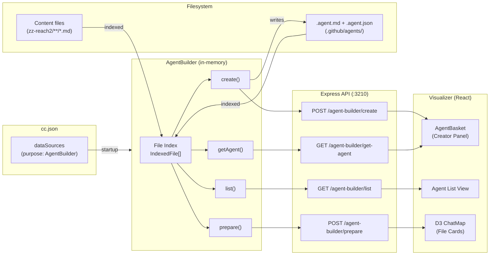

---

## 2. Configuration

### 2.1 Data Source Declaration

AgentBuilder sources are declared per-machine in `cc.json` under the `dataSources` block. Each category (e.g. `"zz-reach2"`) contains an array of `DataSourceEntry` objects:

```json
{
    "machine": "DEVBOX1",
  "harnesses": { "..." },
  "dataSources": {
    "zz-reach2": [
      {
        "path": "D:\\...\\server\\zz-reach2",
        "agentPath": "D:\\...\\.github\\agents",
        "name": "Context Core Server",
        "type": "Reach2 Architectural Repo",
        "purpose": "AgentBuilder"
      },
      {
        "path": "D:\\...\\visualizer\\zz-reach2",
        "agentPath": "D:\\...\\.github\\agents",
        "name": "Context Core Front",
        "type": "Reach2 Architectural Repo",
        "purpose": "AgentBuilder"
      }
    ]
  }
}
```

### 2.2 Configuration Model

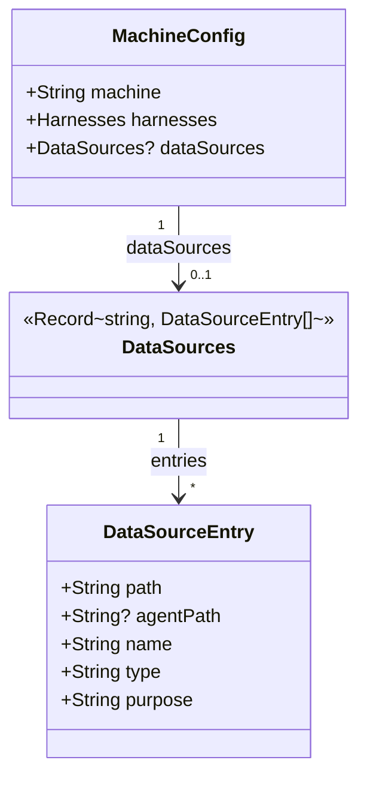

| Field       | Type     | Required | Description                                                        |
| ----------- | -------- | -------- | ------------------------------------------------------------------ |
| `path`      | `string` | yes      | Root directory to index for content files                          |
| `agentPath` | `string` | no       | Directory where `.agent.md` / `.agent.json` files live             |
| `name`      | `string` | yes      | Human-readable label — acts as a filter key and project identifier |
| `type`      | `string` | yes      | Informational tag (e.g. `"Reach2 Architectural Repo"`)             |
| `purpose`   | `string` | yes      | Must be `"AgentBuilder"` to be indexed                             |

**Key design decision**: Multiple data sources can share the same `agentPath`. This is the case in the current config where both "Context Core Server" and "Context Core Front" point to `.github/agents/`. The indexer deduplicates by absolute path to prevent double-counting.

---

## 3. Component Architecture

### 3.1 Module Map

The AgentBuilder subsystem spans three layers: the server-side `AgentBuilder` class, the Express API routing in `routes/agentBuilderRoutes.ts` (mounted by `ContextServer.ts`), and the React UI components in the visualizer.

```mermaid
graph TD
    subgraph Server["Server Layer"]
        AB["AgentBuilder.ts<br/>(class + helpers)"]
        CS["agentBuilderRoutes.ts<br/>(endpoint registration)"]
        CC["ContextCore.ts<br/>(startup wiring)"]
        TY["types.ts<br/>(DataSourceEntry, MachineConfig)"]
    end

    subgraph Visualizer["Visualizer Layer"]
        BASKET["AgentBasket.tsx<br/>(Creator/Editor panel)"]
        SEARCH_API["api/search.ts<br/>(fetch wrappers)"]
        VTYPES["types.ts<br/>(mirrored API types)"]
        VIEWS["useViews.ts<br/>(agent-builder view def)"]
        HOOKS["useSearch.ts<br/>(agent state management)"]
        SB["SearchBar.tsx<br/>(view switcher)"]
        APP["App.tsx<br/>(layout orchestration)"]
        D3["chatMapEngine.ts<br/>(file card rendering)"]
    end

    CC -->|"instantiates"| AB
    CC -->|"passes to"| CS
    CS -->|"delegates to"| AB
    AB --> TY

    APP --> BASKET
    APP --> SB
    SB --> VIEWS
    BASKET --> SEARCH_API
    HOOKS --> SEARCH_API
    SEARCH_API -->|"HTTP"| CS
    D3 -->|"add-knowledge event"| HOOKS

    style AB fill:#2d6a4f,color:#fff
    style CS fill:#1b4332,color:#fff
    style BASKET fill:#7c3aed,color:#fff
```

### 3.2 Module Inventory

| Module                 | Path                                             | Responsibility                                                                                                                      |
| ---------------------- | ------------------------------------------------ | ----------------------------------------------------------------------------------------------------------------------------------- |
| **AgentBuilder**       | `server/src/agentBuilder/AgentBuilder.ts`        | Core class: source extraction, recursive file indexing, agent CRUD, in-memory index management                                      |
| **agentBuilderRoutes** | `server/src/server/routes/agentBuilderRoutes.ts` | Express endpoint registration for all agent-builder routes; input validation; error mapping                                         |
| **ContextCore**        | `server/src/ContextCore.ts`                      | Startup wiring: instantiates AgentBuilder if data sources exist, passes to `startServer()`                                          |
| **types**              | `server/src/types.ts`                            | `DataSourceEntry`, `DataSources`, `MachineConfig` type definitions                                                                  |
| **AgentBasket**        | `visualizer/src/components/AgentBasket.tsx`      | React side panel: form fields, knowledge list, reorder controls, create/save/cancel actions                                         |
| **api/search**         | `visualizer/src/api/search.ts`                   | Fetch wrappers: `fetchAgentBuilderPrepare()`, `fetchAgentBuilderCreate()`, `fetchAgentBuilderList()`, `fetchAgentBuilderGetAgent()` |
| **useViews**           | `visualizer/src/hooks/useViews.ts`               | View system: registers `agent-builder` and `agent-list` as built-in view types                                                      |
| **chatMapEngine**      | `visualizer/src/d3/chatMapEngine.ts`             | D3 card rendering: emits `card:addKnowledge` events when user clicks add-knowledge buttons on file cards                            |

---

## 4. Data Model

### 4.1 Core Types (Server)

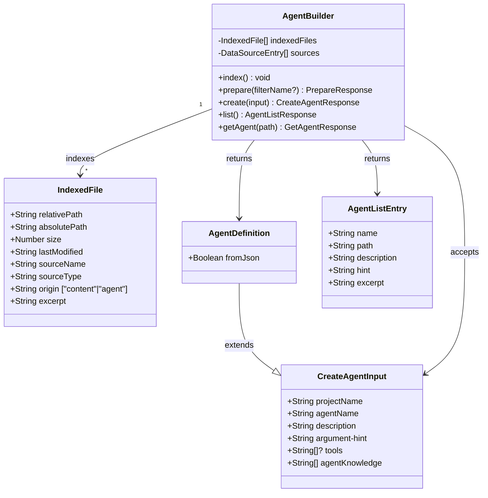

### 4.2 UI Types (Visualizer)

The visualizer mirrors the server types in `visualizer/src/types.ts` plus adds UI-specific types:

| Type                       | Purpose                                                                                                                                    |
| -------------------------- | ------------------------------------------------------------------------------------------------------------------------------------------ |
| `AgentKnowledgeEntry`      | A single knowledge item in the basket — carries `id`, `value`, `kind` ("file" or "custom"), optional `sourceName`, and `addedAt` timestamp |
| `CardEditAgentEventDetail` | D3 engine event payload when user clicks edit on an agent card                                                                             |
| `ViewType`                 | Union type including `"agent-builder"` and `"agent-list"`                                                                                  |

---

## 5. Startup & Initialization

The AgentBuilder integrates into the ContextCore startup sequence after topic summarization and before the Express server starts:

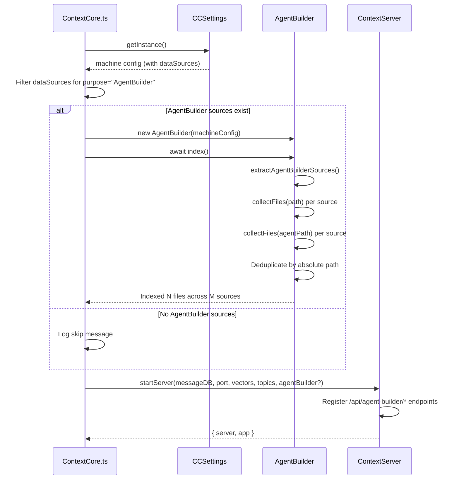

**Key behaviors:**
- The `AgentBuilder` constructor only extracts source entries; actual file scanning happens in `index()`
- `index()` is async but internally synchronous (`readdirSync`, `statSync`, `readFileSync`) — the async signature is a future-proofing hook
- The `agentBuilder` parameter is optional in `startServer()` — when `undefined`, all agent-builder endpoints return 404

---

## 6. File Indexing Pipeline

### 6.1 Indexing Flow

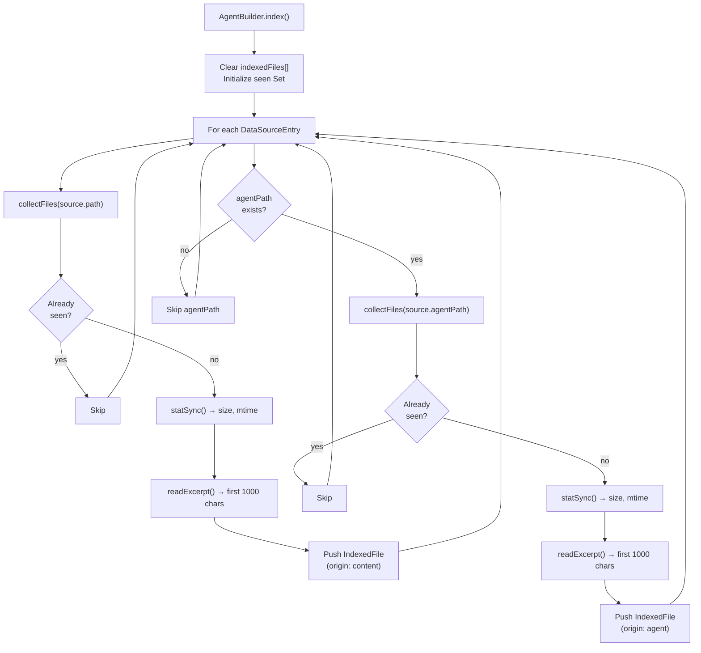

### 6.2 Directory Traversal Rules

The `collectFiles()` function recursively walks directories with these filtering rules:

| Rule                | Behavior                                                   |
| ------------------- | ---------------------------------------------------------- |
| `.git/`             | Skipped (in `SKIP_DIRS` set)                               |
| `node_modules/`     | Skipped (in `SKIP_DIRS` set)                               |
| Hidden dirs (`.*/`) | Skipped — **except** `.github` which is explicitly allowed |
| All files           | Included regardless of extension                           |
| Errors              | Silently caught per-entry (defensive traversal)            |

### 6.3 Indexed File Structure

Each indexed file records:
- **`relativePath`**: Path relative to the data source root, forward-slash normalized
- **`absolutePath`**: Full disk path (used as deduplication key and identity)
- **`origin`**: `"content"` (from `path`) or `"agent"` (from `agentPath`) — this distinction drives the `list()` and `getAgent()` filtering logic
- **`excerpt`**: First 1000 characters of file content — provides preview without a second round-trip

---

## 7. API Surface

### 7.1 Endpoint Map

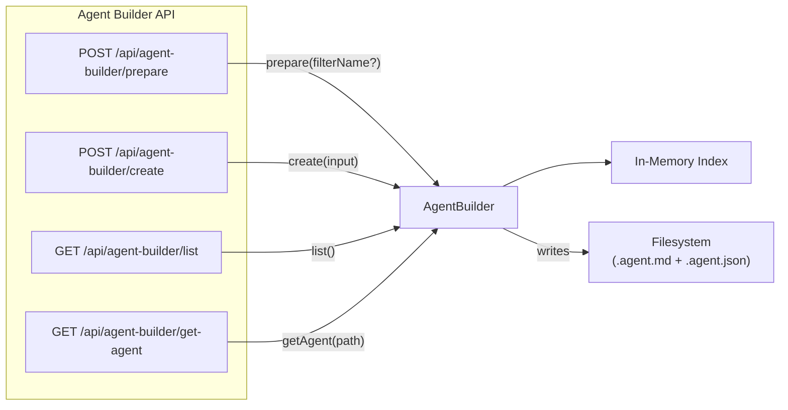

### 7.2 Endpoint Reference

| Endpoint                       | Method | Purpose                                                         | Request                | Response                                           |
| ------------------------------ | ------ | --------------------------------------------------------------- | ---------------------- | -------------------------------------------------- |
| `/api/agent-builder/prepare`   | POST   | Return indexed file listing, optionally filtered by source name | `{ name?: string }`    | `PrepareResponse` (totalFiles, sources[], files[]) |
| `/api/agent-builder/create`    | POST   | Create a new agent (`.agent.md` + `.agent.json`)                | `CreateAgentInput`     | `CreateAgentResponse` (201)                        |
| `/api/agent-builder/list`      | GET    | List all agents with metadata                                   | —                      | `AgentListResponse` (totalAgents, agents[])        |
| `/api/agent-builder/get-agent` | GET    | Get full structured definition for one agent                    | `?path=<absolutePath>` | `GetAgentResponse` (agent: AgentDefinition)        |

### 7.3 Error Handling

All endpoints share a guard pattern: if `agentBuilder` is `undefined` (no data sources configured), they return `404 { error: "AgentBuilder not available" }`.

The `create()` and `getAgent()` methods throw errors with a `status` property that `agentBuilderRoutes` maps directly to HTTP status codes:

| Condition                          | HTTP | Method                                  |
| ---------------------------------- | ---- | --------------------------------------- |
| `projectName` not found in sources | 404  | `create()`                              |
| Source has no `agentPath`          | 400  | `create()`                              |
| Missing required fields            | 400  | `create()` (validated in ContextServer) |
| Path not a `.agent.md`             | 400  | `getAgent()`                            |
| Path not in index                  | 404  | `getAgent()`                            |
| File read failure                  | 500  | `getAgent()`                            |

---

## 8. Agent File Lifecycle

### 8.1 Dual-File Persistence

When an agent is created via `POST /api/agent-builder/create`, **two files** are written to `agentPath`:

```
{agentPath}/
├── my-agent.agent.md     ← Runtime artifact (consumed by VS Code / Copilot)
└── my-agent.agent.json   ← Structured source of truth (for lossless round-trip editing)
```

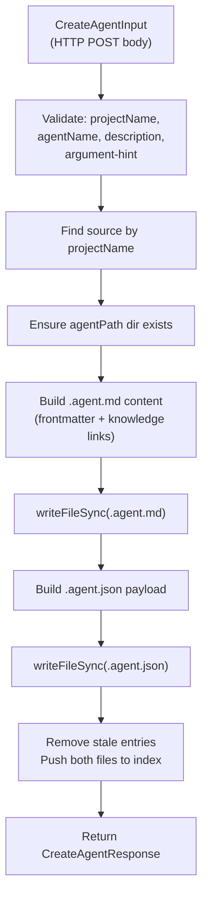

### 8.2 Generated `.agent.md` Format

```markdown
---
name: my-agent
description: What this agent does.
argument-hint: A task to implement.
tools: ['read', 'edit', 'search']
---

To get context for your task, you MUST read the following files:

- [path/to/file.md](path/to/file.md)
- [another/file.md](another/file.md)
```

When `tools` is empty or omitted, the tools line is commented out:
```
# tools: [] # specify the tools this agent can use. If not set, all enabled tools are allowed.
```

### 8.3 Agent Retrieval Strategy

The `getAgent()` method uses a two-tier retrieval strategy to handle both new agents (with JSON) and legacy agents (MD only):

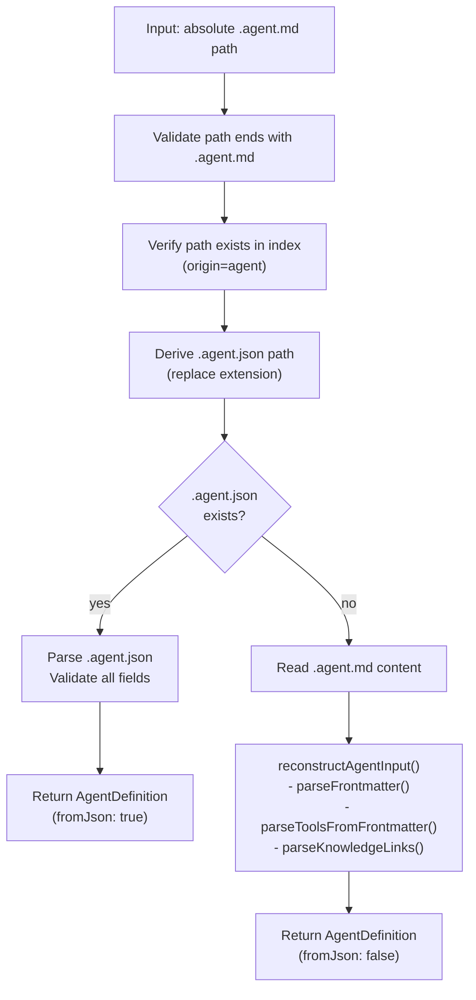

**Security boundary**: The path is validated against the in-memory index before any disk read, preventing path traversal attacks. Only files that were indexed from legitimate `agentPath` directories can be retrieved.

### 8.4 Legacy Agent Reconstruction

For agents without a `.agent.json` companion (e.g. manually created `cxc-ui-worker.agent.md`), the system reconstructs a `CreateAgentInput` from the markdown:

| Data             | Extraction Method                                                    |
| ---------------- | -------------------------------------------------------------------- |
| `agentName`      | Frontmatter `name` field, or filename stem fallback                  |
| `description`    | Frontmatter `description` field                                      |
| `argument-hint`  | Frontmatter `argument-hint` field                                    |
| `tools`          | Frontmatter `tools: [...]` line — commented line (`#`) → empty array |
| `agentKnowledge` | Markdown links `[text](path)` in the body (after second `---` fence) |
| `projectName`    | `sourceName` from the matching index entry                           |

The reconstruction is signaled via `fromJson: false` so the client knows the data is best-effort.

---

## 9. Helper Functions

The `AgentBuilder.ts` module contains seven module-level helper functions that support the class methods:

| Function                                             | Purpose                                                                                         |
| ---------------------------------------------------- | ----------------------------------------------------------------------------------------------- |
| `collectFiles(dir)`                                  | Recursive directory walker with skip rules. Returns absolute paths                              |
| `readExcerpt(filePath)`                              | Reads first 1000 characters. Returns `""` on error                                              |
| `isAgentMdPath(filePath)`                            | Checks if a path ends with `.agent.md` (case-insensitive)                                       |
| `toAgentJsonPath(mdPath)`                            | Converts `.agent.md` path → `.agent.json` path                                                  |
| `getAgentNameFromPath(mdPath)`                       | Extracts filename stem (e.g. `cxc-ui-worker` from `cxc-ui-worker.agent.md`)                     |
| `parseFrontmatter(content)`                          | Extracts key/value pairs from `---` fenced YAML frontmatter. Skips commented (`#`) lines        |
| `parseToolsFromFrontmatter(content)`                 | Parses `tools: [...]` from frontmatter. Handles both active and commented-out tool declarations |
| `parseKnowledgeLinks(content)`                       | Extracts link targets from markdown `[text](path)` patterns in the body section                 |
| `reconstructAgentInput(content, sourceName, mdPath)` | Orchestrates the three parsers above to rebuild a `CreateAgentInput` from legacy `.agent.md`    |

---

## 10. UI Integration

### 10.1 View System

The AgentBuilder integrates into the visualizer's view system as two distinct view types:

| View Type       | Name          | Purpose                                                                               |
| --------------- | ------------- | ------------------------------------------------------------------------------------- |
| `agent-builder` | Agent Builder | D3 file card display from `/prepare` + AgentBasket panel for creating/editing agents  |
| `agent-list`    | Agent List    | Lists all agents from `/list`, allows editing via click-through to agent-builder mode |

### 10.2 Agent Creation Flow (UI → Server)

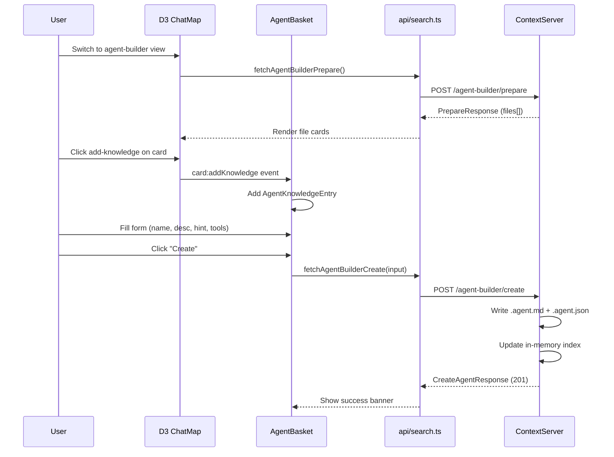

### 10.3 Agent Edit Flow (UI → Server)

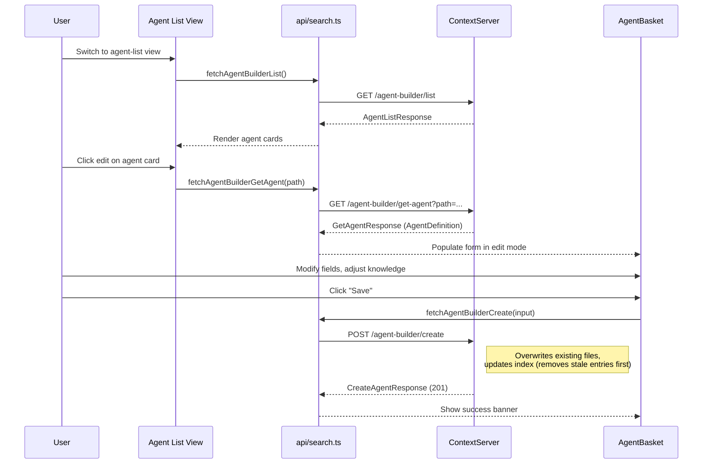

### 10.4 AgentBasket Component

The `AgentBasket.tsx` component is a side panel that provides:

| Section                   | Content                                                                                                      |
| ------------------------- | ------------------------------------------------------------------------------------------------------------ |
| **Header**                | Title ("Agent Creator" / "Edit Agent"), Create/Save button, Cancel (edit mode), Clear button                 |
| **Error/Success banners** | Dismissable error banner, auto-dismiss success banner                                                        |
| **Form**                  | 5 fields: Project (dropdown from sources), Name (slug-validated), Description, Hint, Tools (comma-separated) |
| **Knowledge list**        | Scrollable reorderable list of knowledge entries (file or custom), with move up/down/remove controls         |
| **Custom input**          | Textarea for adding free-text knowledge entries (Ctrl+Enter to add)                                          |

**Smart behaviors:**
- Auto-selects project when only one source exists
- Auto-selects project when all file entries come from the same source
- Slug validation on agent name (lowercase, numbers, hyphens only)
- Auto-scroll knowledge list when new entry added
- Ctrl+Enter anywhere in form triggers create/save
- Edit mode populates all fields from `initialValues` prop

---

## 11. File Layout

### 11.1 Server-Side Files

```
server/
├── src/
│   ├── agentBuilder/
│   │   └── AgentBuilder.ts          ← Core class + 9 helper functions + 11 interfaces
│   ├── server/
│   │   ├── ContextServer.ts         ← Thin orchestrator: middleware, route mounting, port binding
│   │   ├── RouteContext.ts           ← Shared service context interface
│   │   └── routes/
│   │       └── agentBuilderRoutes.ts ← All 7 agent-builder endpoint registrations
│   ├── ContextCore.ts               ← Startup wiring (lines 312–336)
│   └── types.ts                     ← DataSourceEntry, DataSources, MachineConfig
└── zz-reach2/
    └── upgrades/2026-03/
        ├── r2uab-agent-builder.md   ← Phase 1 plan (prepare + create)
        └── r2uab2-agent-builder-2.md ← Phase 2 plan (list + get-agent + JSON persistence)
```

### 11.2 Visualizer-Side Files

```
visualizer/
└── src/
    ├── components/
    │   ├── AgentBasket.tsx           ← Agent creator/editor panel (357 lines)
    │   └── AgentBasket.css           ← Panel styles (364 lines)
    ├── api/
    │   └── search.ts                 ← 4 fetch wrappers for agent-builder endpoints
    ├── hooks/
    │   ├── useViews.ts               ← View definitions (agent-builder, agent-list)
    │   └── useSearch.ts              ← Agent state management
    ├── d3/
    │   └── chatMapEngine.ts          ← File card rendering + add-knowledge events
    └── types.ts                      ← Mirrored API types + UI-specific types
```

### 11.3 Agent Output Files

```
.github/agents/
├── cxc-ui-worker.agent.md           ← Legacy agent (no JSON companion)
├── cxc-test-agent.agent.md          ← Created via /create
├── cxc-test-agent.agent.json        ← JSON companion (structured source of truth)
├── cxc-test-agent2222.agent.md      ← Created via /create
└── cxc-test-agent2222.agent.json    ← JSON companion
```

---

## 12. Data Flow Summary

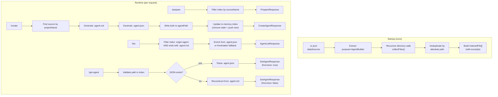

---

## 13. Strengths

1. **Zero database overhead**: The index is a plain in-memory array — no SQLite, no persistence, no schema migrations. Startup cost is proportional to the number of files in data source directories (currently ~30 files).

2. **Deduplication by absolute path**: Multiple data sources sharing the same `agentPath` (common in the current config) don't produce duplicate index entries.

3. **Dual-file persistence**: The `.agent.json` companion preserves the full structured input for lossless round-tripping, while `.agent.md` serves as the runtime artifact consumed by IDE agent frameworks.

4. **Graceful legacy handling**: Agents created before Phase 2 (or manually written) are handled via frontmatter parsing and body link extraction, with `fromJson: false` signaling the reconstruction is best-effort.

5. **Security boundary on retrieval**: `getAgent()` validates the requested path against the in-memory index before any disk read, preventing path traversal attacks.

6. **Immediate index consistency**: After `create()`, both new files are added to the in-memory index (stale entries removed first), so subsequent `/prepare`, `/list`, and `/get-agent` calls reflect the change without a restart.

7. **Defensive I/O**: Every filesystem operation (`readdirSync`, `statSync`, `readFileSync`) is wrapped in try/catch, so a single unreadable file doesn't crash the indexer.

8. **Clean UI separation**: The AgentBasket component is purely presentational — all state management, API calls, and event handling are lifted to parent hooks, making it testable and reusable.

---

## 14. Architectural Risks & Improvement Areas

### 14.1 Index Staleness

The file index is built once at startup and only updated when `create()` is called. Files added, modified, or deleted outside the API (e.g. by git operations, manual editing) are not reflected until the next server restart.

**Recommendation**: Hook into the existing `FileWatcher` infrastructure to watch `dataSources` paths and trigger incremental re-indexing on change.

### 14.2 Edit is Create (Overwrite Semantics)

There is no dedicated `update()` or `PATCH` method. Editing an agent re-invokes `create()` which overwrites both files unconditionally. The `create()` method originally threw a `409 Conflict` on file collision, but this was relaxed to enable edit-mode overwrites. This means there is no protection against accidental overwrites if two clients create agents with the same name simultaneously.

**Recommendation**: Add an `overwrite: boolean` flag to `CreateAgentInput` (defaulting to `false` for new creates, `true` for edits) and check `existsSync` when `overwrite` is false.

### 14.3 Synchronous I/O in Index Pipeline

All file operations in `index()`, `create()`, `list()`, and `getAgent()` use synchronous Node.js APIs (`readdirSync`, `readFileSync`, `writeFileSync`). While acceptable for the current ~30 file count, this blocks the event loop during indexing and on every `/list` call (which re-reads JSON/MD files for metadata enrichment).

**Recommendation**: For the current scale this is fine. If data sources grow to hundreds of files, migrate to async variants and cache metadata enrichment results.

### 14.4 No Validation of agentKnowledge Paths

The `create()` method accepts `agentKnowledge` entries as-is without validating that they reference actual indexed files. Custom text entries are also stored in the same array. This is by design (users can add arbitrary text knowledge), but it means a typo in a file path won't be caught until an agent tries to read it.

**Recommendation**: Consider adding a client-side warning (not a hard error) when a knowledge entry doesn't match any indexed file path.

### 14.5 List Method Re-reads Files on Every Call

The `list()` method reads `.agent.json` or `.agent.md` files from disk on every invocation to extract metadata. With the current agent count (<10) this is negligible, but it could become slow with many agents.

**Recommendation**: Cache metadata at index time or on first `list()` call, invalidating on `create()`.

### 14.6 Shared agentPath Across Sources

When multiple data sources share the same `agentPath`, the `create()` method uses the first source matching `projectName` to determine the target directory. The agent file is then attributed to that source's `sourceName`. If the user later retrieves the agent from a `/list` call, the `sourceName` may not match expectations if the same `agentPath` appears under a different source.

**Recommendation**: This is a minor edge case given the current config. If it becomes problematic, consider associating agents with all sources that share the `agentPath`.
