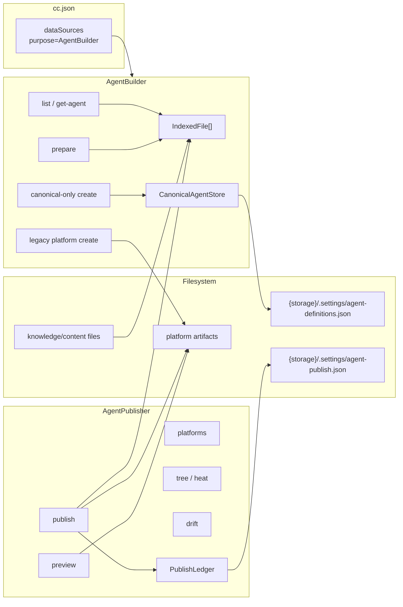
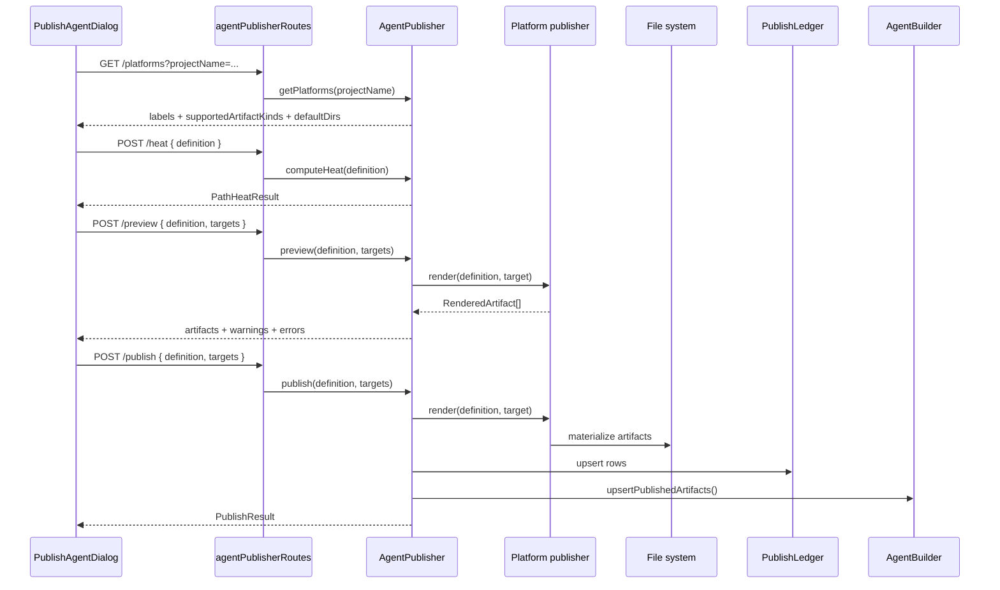

# Agent Builder and Publisher - Architecture

**Date**: 2026-06-21
**Status**: Current after r2ab3 Publisher rollout
**Scope**: Server-side AgentBuilder, AgentPublisher, canonical definition persistence, publishing endpoints, indexing, and safety boundaries.
**Runtime**: Bun, TypeScript, ES modules

---

## 1. System Overview

The current subsystem is split into two responsibilities:

| Subsystem | Responsibility |
| --- | --- |
| `AgentBuilder` | Index configured source directories, expose knowledge files, save canonical agent/skill definitions, list/retrieve existing legacy agent artifacts, and keep an in-memory file index fresh. |
| `AgentPublisher` | Take a canonical definition and materialize concrete platform artifacts through `/api/agent-publisher/*`, with preview, path heat, path allow-listing, backups, generated markers, ledger entries, and drift detection. |

Agent Builder no longer owns normal platform selection in the UI. The default visualizer flow is:

1. Builder assembles metadata and knowledge.
2. Builder saves a canonical definition through `/api/agent-builder/create` with no `platform`.
3. Publisher previews and writes platform files through `/api/agent-publisher/preview` and `/api/agent-publisher/publish`.

Legacy `POST /api/agent-builder/create` with `platform: "github" | "claude" | "codex"` is still supported for old clients and tests. That path writes GitHub, Claude, or Codex artifacts directly from `AgentBuilder`, but the current product flow uses `AgentPublisher`.

Alternative A linking was intentionally not implemented in the r2ab3 rollout. There are no symlink, import-shim, or mention-only publish strategies in the active code path. Every supported publish target writes concrete materialized files and records provenance in the ledger at `{storage}/.settings/agent-publish.json`.


```mermaid
flowchart LR
    subgraph Config["cc.json"]
        DS["dataSources<br/>purpose=AgentBuilder"]
    end

    subgraph Builder["AgentBuilder"]
        IDX["IndexedFile[]"]
        PREP["prepare"]
        SAVE["canonical-only create"]
        LEGACY["legacy platform create"]
        LIST["list / get-agent"]
        STORE["CanonicalAgentStore"]
    end

    subgraph Publisher["AgentPublisher"]
        PLAT["platforms"]
        TREE["tree / heat"]
        PREVIEW["preview"]
        PUBLISH["publish"]
        DRIFT["drift"]
        LEDGER["PublishLedger"]
    end

    subgraph Disk["Filesystem"]
        CONTENT["knowledge/content files"]
        CANON["{storage}/.settings/agent-definitions.json"]
        ART["platform artifacts"]
        PUBLEDGER["{storage}/.settings/agent-publish.json"]
    end

    DS --> Builder
    CONTENT --> IDX
    SAVE --> STORE --> CANON
    PREP --> IDX
    LIST --> IDX
    LEGACY --> ART
    PREVIEW --> ART
    PUBLISH --> ART
    PUBLISH --> LEDGER --> PUBLEDGER
    PUBLISH --> IDX
```

---

## 2. Configuration

Agent Builder sources come from `MachineConfig.dataSources`. Entries with `purpose: "AgentBuilder"` are indexed and are also used as Publisher project roots.

```ts
type DataSourceEntry = {
    path: string;
    agentPath?: string;
    claudeAgentPath?: string;
    codexAgentPath?: string;
    codexAgentPaths?: string[];
    projectRoot?: string;
    publishRoots?: Partial<Record<PublishPlatform, string[]>>;
    name: string;
    type: string;
    purpose: string;
};
```

| Field | Purpose |
| --- | --- |
| `path` | Content root scanned for knowledge files. |
| `agentPath` | Legacy GitHub/Copilot `.agent.md` output directory and default Copilot publisher agent directory. |
| `claudeAgentPath` | Legacy Claude `.md` output directory and default Claude publisher agent directory. |
| `codexAgentPath` | Legacy single Codex `AGENTS.md` output directory. |
| `codexAgentPaths` | Preferred ordered Codex output directories. |
| `projectRoot` | Optional project root for path tree, heat analysis, and publish allow-listing. |
| `publishRoots` | Optional per-platform allowed output roots. Defaults to the inferred project root when absent. |
| `name` | Project/source label used as `projectName`. |
| `type` | Informational source type shown in cards and index entries. |
| `purpose` | Must be `AgentBuilder` to participate. |

Project root inference lives in publisher path policy. It uses `projectRoot` first, then infers from `.github/agents` when possible, then falls back to `path`.

---

## 3. Server Modules

| Module | Path | Responsibility |
| --- | --- | --- |
| `AgentBuilder` | `server/src/agentBuilder/AgentBuilder.ts` | Source extraction, recursive indexing, canonical-only create, legacy create, list/get-agent, templates, file content, and index updates after publishing. |
| `agentBuilderRoutes` | `server/src/server/routes/agentBuilderRoutes.ts` | `/api/agent-builder/*` endpoints and request validation. |
| `AgentPublisher` | `server/src/agentPublisher/AgentPublisher.ts` | Orchestrates platform publishers, preview, publish, ledger updates, path heat, and drift. |
| `AgentPublisherBase` | `server/src/agentPublisher/AgentPublisherBase.ts` | Shared rendering helpers and materialization helpers for platform publishers. |
| `AgentPublisherCopilot` | `server/src/agentPublisher/platforms/AgentPublisherCopilot.ts` | GitHub Copilot agent and skill artifacts. |
| `AgentPublisherClaude` | `server/src/agentPublisher/platforms/AgentPublisherClaude.ts` | Claude sub-agent and skill artifacts. |
| `AgentPublisherCodex` | `server/src/agentPublisher/platforms/AgentPublisherCodex.ts` | Codex `AGENTS.md` collection and skill artifacts. |
| `CanonicalAgentStore` | `server/src/agentPublisher/CanonicalAgentStore.ts` | Persists canonical definitions under `{storage}/.settings/agent-definitions.json`. |
| `PublishLedger` | `server/src/agentPublisher/PublishLedger.ts` | Tracks published artifact provenance and hashes. |
| `pathPolicy` | `server/src/agentPublisher/pathPolicy.ts` | Infers roots and blocks publish output outside allowed roots. |
| `pathContract` | `server/src/agentPublisher/pathContract.ts` | Returns platform-native default directories for the Publisher UI. |
| `PathHeatAnalyzer` | `server/src/agentPublisher/PathHeatAnalyzer.ts` | Builds heat-mapped directory trees from paths mentioned by knowledge files. |
| `PathMentionExtractor` / `PathResolver` | `server/src/agentPublisher/*` | Extracts and resolves path mentions for heat analysis. |
| `fileOps` / `generatedMarker` | `server/src/agentPublisher/*` | Atomic writes, unmanaged backups, hashing, and generated-file detection. |
| `types` | `server/src/agentPublisher/types.ts`, `server/src/types.ts` | Shared publisher and machine config types. |

---

## 4. Core Data Model

The canonical definition is the source of truth used by Builder saves and Publisher materialization.

```ts
interface CanonicalAgentDefinition {
    id: string;
    kind: "agent" | "skill";
    projectName: string;
    name: string;
    description: string;
    whenToUse?: string;
    "argument-hint"?: string;
    tools?: string[];
    knowledge: KnowledgeRef[];
    body?: string;
    license?: string;
    compatibility?: string;
    metadata?: Record<string, string>;
}

interface KnowledgeRef {
    kind: "file" | "text";
    value: string;
}

interface PublishTarget {
    platform: "copilot" | "claude" | "codex" | "kiro" | "cursor" | "windsurf" | "antigravity";
    artifactKind: "agent" | "skill";
    outputDir: string;
    codexEntryId?: string;
}
```

Current implementation detail: the type union already includes Kiro, Cursor, Windsurf, and Antigravity, and the Publisher UI can display them. The backend only registers concrete publishers for `copilot`, `claude`, and `codex`, so the other platforms return unsupported capability rows until their publishers are implemented.

---

## 5. Startup Wiring

`ContextCore` reads machine settings, extracts `dataSources` with `purpose: "AgentBuilder"`, creates `AgentBuilder`, indexes sources, creates `CanonicalAgentStore`, then creates `AgentPublisher` with:

- the same source list
- storage path for ledger and canonical store
- an optional `AgentBuilder` reference for indexed-file lookup and heat reads
- an `onArtifactsWritten` callback so published markdown artifacts are immediately added to the Builder index

When no AgentBuilder sources exist, AgentBuilder and AgentPublisher endpoints are unavailable.

---

## 6. Agent Builder API

| Endpoint | Method | Purpose |
| --- | --- | --- |
| `/api/agent-builder/prepare` | POST | Return indexed files and sources, optionally filtered by source name. |
| `/api/agent-builder/create` | POST | Save a canonical definition when `platform` is omitted. Legacy: write GitHub/Claude/Codex artifacts when `platform` is present. |
| `/api/agent-builder/list` | GET | Return consolidated legacy agent entries from supported agent artifact paths. |
| `/api/agent-builder/get-definition` | GET | Reload a persisted canonical definition by `canonicalId`. |
| `/api/agent-builder/get-agent` | GET | Load one legacy artifact definition by absolute path and optional `codexEntryId`. |
| `/api/agent-builder/get-file-content` | GET | Return full content for an indexed file, guarded by index membership. |
| `/api/agent-builder/add-template` | POST | Persist an agent template under `{storage}/.settings/agent-templates`. |
| `/api/agent-builder/list-templates` | GET | List persisted templates. |

Canonical-only create validates the same builder form fields as legacy create and returns:

```ts
{
    created: true,
    agentName: string,
    canonicalId: string,
    canonicalDefinition: CanonicalAgentDefinition,
    persisted: true
}
```

Legacy platform create is retained for compatibility. It still writes:

| Legacy platform | Files |
| --- | --- |
| `github` | `{agentName}.agent.md` and `{agentName}.agent.json` |
| `claude` | `{agentName}.md` and `{agentName}.json` |
| `codex` | `AGENTS.md` and `AGENTS.json` collection |

---

## 7. Agent Publisher API

| Endpoint | Method | Purpose |
| --- | --- | --- |
| `/api/agent-publisher/platforms?projectName=` | GET | Return platform labels, supported artifact kinds, and platform-native default directories. |
| `/api/agent-publisher/tree?projectName=` | GET | Return a raw directory tree for the path picker. |
| `/api/agent-publisher/heat` | POST | Analyze canonical knowledge refs and return a heat-mapped tree, top paths, and suggested output directory. |
| `/api/agent-publisher/preview` | POST | Validate targets and render artifacts without writing. |
| `/api/agent-publisher/publish` | POST | Validate, render, write artifacts, update ledger, and update AgentBuilder index. |
| `/api/agent-publisher/drift?canonicalId=` | GET | Return ledger-vs-disk drift, loading current canonical definition from store when possible. |
| `/api/agent-publisher/drift` | POST | Return drift using `{ canonicalId, definition? }`, including canonical-changed detection. |

Preview and publish return JSON error bodies for validation and unexpected exceptions. `publish` returns HTTP 201 when successful and 400 when the returned `PublishResult.errors` list is non-empty.

---

## 8. Publisher Lifecycle


```mermaid
sequenceDiagram
    participant UI as PublishAgentDialog
    participant API as agentPublisherRoutes
    participant AP as AgentPublisher
    participant PP as Platform publisher
    participant FS as File system
    participant Ledger as PublishLedger
    participant AB as AgentBuilder

    UI->>API: GET /platforms?projectName=...
    API->>AP: getPlatforms(projectName)
    AP-->>UI: labels + supportedArtifactKinds + defaultDirs

    UI->>API: POST /heat { definition }
    API->>AP: computeHeat(definition)
    AP-->>UI: PathHeatResult

    UI->>API: POST /preview { definition, targets }
    API->>AP: preview(definition, targets)
    AP->>PP: render(definition, target)
    PP-->>AP: RenderedArtifact[]
    AP-->>UI: artifacts + warnings + errors

    UI->>API: POST /publish { definition, targets }
    API->>AP: publish(definition, targets)
    AP->>PP: render(definition, target)
    PP->>FS: materialize artifacts
    AP->>Ledger: upsert rows
    AP->>AB: upsertPublishedArtifacts()
    AP-->>UI: PublishResult
```

Materialization behavior:

- validates `outputDir` inside allowed project roots before rendering
- renders all artifacts before writing
- backs up unmanaged existing files
- uses platform-neutral generated markers for backup detection
- writes through atomic file helpers
- skips companion JSON files when adding published artifacts to `AgentBuilder.indexedFiles`

---

## 9. Supported Platform Outputs

Current concrete Publisher support:

| Platform | Agent output | Skill output | Notes |
| --- | --- | --- | --- |
| `copilot` | `{outputDir}/{name}.agent.md` plus companion JSON where applicable | `{skillRoot}/.github/skills/{id}/SKILL.md` | Default agent output dir is `agentPath` or `<projectRoot>/.github/agents`. |
| `claude` | `{outputDir}/{name}.md` plus companion JSON where applicable | `{skillRoot}/.claude/skills/{id}/SKILL.md` | Default agent output dir is `claudeAgentPath`, inferred `.claude/agents`, or `<projectRoot>/.claude/agents`. |
| `codex` | `{outputDir}/AGENTS.md` and `AGENTS.json` collection | `{skillRoot}/.agents/skills/{id}/SKILL.md` | Preserves multi-entry Codex collection behavior. |

Declared but not yet implemented as supported backends:

| Platform | Status |
| --- | --- |
| `cursor` | Present in types/UI capability rows, disabled until `AgentPublisherCursor` exists. |
| `kiro` | Present in types/UI capability rows, disabled until `AgentPublisherKiro` exists. |
| `windsurf` | Present in types/UI capability rows, disabled until `AgentPublisherWindsurf` exists. |
| `antigravity` | Present in types/UI capability rows, disabled until `AgentPublisherAntigravity` exists. |

---

## 10. Indexing and Listing

`AgentBuilder.index()` recursively scans content roots and configured agent output roots. It skips `.git` and `node_modules`; hidden directories are skipped except `.github` and `.claude`.

Important current behavior:

- `prepare()` returns all indexed files and source summaries.
- `get-file-content` only reads paths already in `indexedFiles`.
- `upsertPublishedArtifacts()` adds published markdown artifacts to the in-memory index immediately.
- `list()` consolidates legacy GitHub, Claude, and Codex-style artifacts by agent name.
- `get-agent()` reconstructs legacy artifacts from companion JSON when present, otherwise from markdown frontmatter and links.

Current gap: `AgentBuilder.list()` and `get-agent()` classify any `AGENTS.md` path as Codex. Cursor/Windsurf/Kiro/Antigravity support needs explicit platform classification so generic or nested `AGENTS.md` files do not become accidental Codex collections.

---

## 11. Safety Boundaries

| Safety area | Current behavior |
| --- | --- |
| Path traversal | Builder file reads are guarded by index membership. Publisher writes are guarded by project-root allow-lists. |
| Output roots | `publishRoots[platform]` can restrict output roots; otherwise the inferred project root is the boundary. |
| Backups | Existing files without a known generated marker are backed up before overwrite. |
| Atomic writes | Publisher file writes use temp-file plus rename helpers. |
| Drift | Ledger rows track canonical hash, artifact hash, knowledge refs, resolved paths, platform, artifact kind, path, and publish time. |
| Canonical persistence | Canonical definitions live in `{storage}/.settings/agent-definitions.json`. |

---

## 12. Known Gaps

1. Cursor, Kiro, Windsurf, and Antigravity are visible in the capability model but not yet supported by concrete publisher classes.
2. Link strategies (`symlink`, `import-shim`, `mention`) are intentionally out of the active rollout; concrete materialization is the only current path.
3. Publishing an existing Agent List item converts the legacy artifact to a canonical definition in the browser and publishes it, but the converted definition is not yet upserted into `CanonicalAgentStore`.
4. Generic `AGENTS.md` files need platform-specific classification before Cursor/Windsurf/Kiro/Antigravity can be indexed and listed safely.
5. Manual verification is still recommended for refresh-after-save publish, platform-native default preview paths, and repeated generated-file publish without repeated backups.
