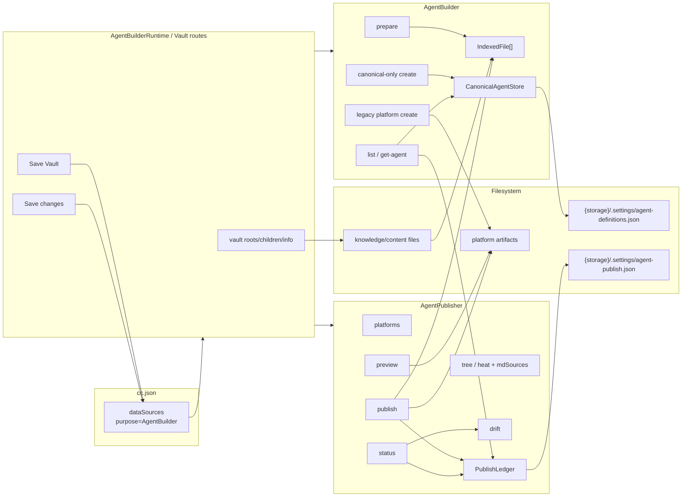
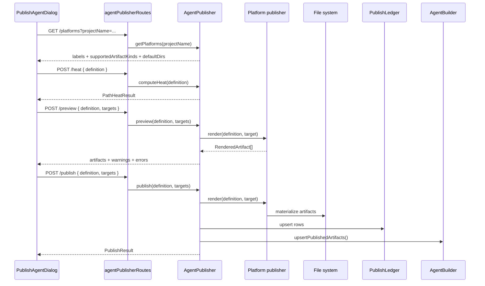

# Agent Builder and Publisher - Architecture

**Date**: 2026-06-22
**Status**: Current after r2ap Publisher placement/status and r2ve Vault Explorer rollout
**Scope**: Server-side AgentBuilder, canonical definition persistence, indexing, Builder API, and legacy create. **Agent Publisher and Vault Explorer** are documented in [`archi-agent-publisher.md`](./archi-agent-publisher.md).
**Runtime**: Bun, TypeScript, ES modules
**UI**: [`archi-agent-builder-ui.md`](../../../../visualizer/zz-reach2/architecture/agents/archi-agent-builder-ui.md) · Publisher/Vault UI: [`archi-agent-publisher-ui.md`](../../../../visualizer/zz-reach2/architecture/agents/archi-agent-publisher-ui.md)

---

## 1. System Overview

The current subsystem is split into three responsibilities:

| Subsystem | Responsibility |
| --- | --- |
| `AgentBuilder` | Index configured source directories, expose knowledge files, save canonical agent/skill definitions, return the canonical-first Agent List, retain legacy artifact reads, and keep an in-memory file index fresh. |
| `AgentBuilderRuntime` / Vault routes | Own the live Builder/Publisher instances for the current machine, serve read-only Vault Explorer browsing, and apply explicit Save Vault / Save changes mutations to `cc.json` before refreshing sources. |
| `AgentPublisher` | Take a canonical definition and materialize concrete platform artifacts through `/api/agent-publisher/*`, with preview, directory placement heat, markdown-source attribution, path allow-listing, backups, generated markers, ledger entries, publish status, and drift detection. |

Agent Builder no longer owns normal platform selection in the UI. The default visualizer flow is:

1. Builder assembles metadata and knowledge.
2. Builder saves a canonical definition through `/api/agent-builder/create` with no `platform`.
3. Publisher previews and writes platform files through `/api/agent-publisher/preview` and `/api/agent-publisher/publish`.
4. Agent List and Publisher status read the canonical store first, then join publish-ledger rows by `canonicalId`.

Legacy `POST /api/agent-builder/create` with `platform: "github" | "claude" | "codex"` is still supported for old clients and tests. That path writes GitHub, Claude, or Codex artifacts directly from `AgentBuilder`, but the current product flow uses `AgentPublisher`.

Active publishing is materialized copy by default. Claude **agent** targets may optionally use `import-shim` (writes `CLAUDE.md` importing `@AGENTS.md`). Symlink and mention-only strategies are deferred behind an internal flag (`ENABLE_SYMLINK_PUBLISH = false`) and are not exposed in `/api/agent-publisher/platforms` or the Publisher UI. Every supported publish target writes concrete files and records provenance in the ledger at `{storage}/.settings/agent-publish.json`.


```mermaid
flowchart LR
    subgraph Config["cc.json"]
        DS["dataSources<br/>purpose=AgentBuilder"]
    end

    subgraph Runtime["AgentBuilderRuntime / Vault routes"]
        BROWSE["vault roots/children/info"]
        ADD["Save Vault"]
        UPDATE["Save changes"]
    end

    subgraph Builder["AgentBuilder"]
        IDX["IndexedFile[]"]
        PREP["prepare"]
        SAVE["canonical-only create"]
        LEGACY["legacy platform create"]
        LIST["list / get-agent"]
        STORE["CanonicalAgentStore"]
    end

    subgraph Publisher["AgentPublisher"]
        PLAT["platforms"]
        TREE["tree / heat + mdSources"]
        PREVIEW["preview"]
        PUBLISH["publish"]
        STATUS["status"]
        DRIFT["drift"]
        LEDGER["PublishLedger"]
    end

    subgraph Disk["Filesystem"]
        CONTENT["knowledge/content files"]
        CANON["{storage}/.settings/agent-definitions.json"]
        ART["platform artifacts"]
        PUBLEDGER["{storage}/.settings/agent-publish.json"]
    end

    ADD --> DS
    UPDATE --> DS
    BROWSE --> CONTENT
    DS --> Runtime --> Builder
    Runtime --> Publisher
    CONTENT --> IDX
    SAVE --> STORE --> CANON
    PREP --> IDX
    LIST --> STORE
    LIST --> LEDGER
    LEGACY --> ART
    PREVIEW --> ART
    PUBLISH --> ART
    PUBLISH --> LEDGER --> PUBLEDGER
    PUBLISH --> IDX
    STATUS --> LEDGER
    STATUS --> DRIFT
```

---

## 2. Configuration

Agent Builder sources come from `MachineConfig.dataSources`. Entries with `purpose: "AgentBuilder"` are indexed and are also used as Publisher project roots.

```ts
type DataSourceEntry = {
    path: string;
    agentPath?: string;
    claudeAgentPath?: string;
    codexAgentPath?: string;
    codexAgentPaths?: string[];
    projectRoot?: string;
    publishRoots?: Partial<Record<PublishPlatform, string[]>>;
    name: string;
    type: string;
    purpose: string;
};
```

| Field | Purpose |
| --- | --- |
| `path` | Content root scanned for knowledge files. |
| `agentPath` | Legacy GitHub/Copilot `.agent.md` output directory and default Copilot publisher agent directory. |
| `claudeAgentPath` | Legacy Claude `.md` output directory and default Claude publisher agent directory. |
| `codexAgentPath` | Legacy single Codex `AGENTS.md` output directory. |
| `codexAgentPaths` | Preferred ordered Codex output directories. |
| `projectRoot` | Optional project root for path tree, heat analysis, and publish allow-listing. |
| `publishRoots` | Optional per-platform allowed output roots. Defaults to the inferred project root when absent. |
| `name` | Project/source label used as `projectName`. |
| `type` | Informational source type shown in cards and index entries. |
| `purpose` | Must be `AgentBuilder` to participate. |

Project root inference lives in publisher path policy. It uses `projectRoot` first, then infers from `.github/agents` when possible, then falls back to `path`.

Vault Explorer creates and edits these entries for the current machine only. Add mode writes a default AgentBuilder source with `path`, `projectRoot`, `name`, `type: "Vault"`, and `purpose: "AgentBuilder"`; `agentPath`, `category`, and explicit alternate roots are supported by the server contract but are not primary UI fields. Edit mode is metadata-only for the existing normalized `path`: it updates `name`, `type`, and optional `agentPath`.

Startup reads `cc.json` but does not mutate it. The only runtime config mutations in this subsystem are explicit `POST /api/agent-builder/vaults` and `PATCH /api/agent-builder/vaults` requests, both written atomically with backup behavior.

---

## 3. Server Modules

| Module | Path | Responsibility |
| --- | --- | --- |
| `AgentBuilder` | `server/src/agentBuilder/AgentBuilder.ts` | Source extraction, recursive indexing, canonical-only create, legacy create, list/get-agent, templates, file content, and index updates after publishing. |
| `AgentBuilderRuntime` | `server/src/agentBuilder/AgentBuilderRuntime.ts` | Owns live Builder/Publisher instances, canonical store, runtime source refresh, Save Vault, Save changes, and status fallback wiring. |
| `agentBuilderRoutes` | `server/src/server/routes/agentBuilderRoutes.ts` | `/api/agent-builder/*` endpoints and request validation. |
| `AgentPublisher` | `server/src/agentPublisher/AgentPublisher.ts` | Orchestrates platform publishers, preview, publish, ledger updates, path heat, and drift. |
| `AgentPublisherBase` | `server/src/agentPublisher/AgentPublisherBase.ts` | Shared rendering helpers and materialization helpers for platform publishers. |
| `AgentPublisherCopilot` | `server/src/agentPublisher/platforms/AgentPublisherCopilot.ts` | GitHub Copilot agent and skill artifacts. |
| `AgentPublisherClaude` | `server/src/agentPublisher/platforms/AgentPublisherClaude.ts` | Claude sub-agent and skill artifacts. |
| `AgentPublisherCodex` | `server/src/agentPublisher/platforms/AgentPublisherCodex.ts` | Codex `AGENTS.md` collection and skill artifacts. |
| Other platform publishers | `server/src/agentPublisher/platforms/AgentPublisher*.ts` | Cursor, Windsurf, Antigravity, and Kiro plain `AGENTS.md` / skill materialization. |
| `CanonicalAgentStore` | `server/src/agentPublisher/CanonicalAgentStore.ts` | Persists canonical definitions under `{storage}/.settings/agent-definitions.json`. |
| `PublishLedger` | `server/src/agentPublisher/PublishLedger.ts` | Tracks published artifact provenance and hashes. |
| `canonicalListMapper` | `server/src/agentPublisher/canonicalListMapper.ts` | Maps canonical definitions plus ledger rows to Agent List/status publish summaries and merges drift states. |
| `pathPolicy` | `server/src/agentPublisher/pathPolicy.ts` | Infers roots and blocks publish output outside allowed roots. |
| `pathContract` | `server/src/agentPublisher/pathContract.ts` | Returns platform-native default directories for the Publisher UI. |
| `PathHeatAnalyzer` / placement helpers | `server/src/agentPublisher/PathHeatAnalyzer.ts`, `placement*.ts` | Builds directory-only heat trees, markdown-source chips, and related markdown discoveries. |
| `PathMentionExtractor` / `PathResolver` | `server/src/agentPublisher/*` | Extracts and resolves path mentions for heat analysis. |
| `vaultBrowser` | `server/src/agentBuilder/vaultBrowser.ts` | Read-only server-backed directory roots, child listing, validation, duplicate detection, and broad-root warnings. |
| `dataSourceMutation` / `vaultDefaults` | `server/src/agentBuilder/*` | Atomic `cc.json` create/update helpers for AgentBuilder vault data sources. |
| `fileOps` / `generatedMarker` | `server/src/agentPublisher/*` | Atomic writes, unmanaged backups, hashing, and generated-file detection. |
| `types` | `server/src/agentPublisher/types.ts`, `server/src/types.ts` | Shared publisher and machine config types. |

---

## 4. Core Data Model

The canonical definition is the source of truth used by Builder saves and Publisher materialization.

```ts
interface CanonicalAgentDefinition {
    id: string;
    kind: "agent" | "skill";
    projectName: string;
    name: string;
    description: string;
    whenToUse?: string;
    "argument-hint"?: string;
    tools?: string[];
    knowledge: KnowledgeRef[];
    body?: string;
    license?: string;
    compatibility?: string;
    metadata?: Record<string, string>;
    paths?: string[];
    disableModelInvocation?: boolean;
}

interface KnowledgeRef {
    kind: "file" | "text";
    value: string;
}

interface PublishTarget {
    platform: "copilot" | "claude" | "codex" | "kiro" | "cursor" | "windsurf" | "antigravity";
    artifactKind: "agent" | "skill";
    outputDir: string;
    codexEntryId?: string;
    linkStrategy?: "copy" | "import-shim" | "symlink";
}

interface PublishedTargetSummary {
    platform: PublishTarget["platform"];
    artifactKind: "agent" | "skill";
    absolutePath: string;
    publishedAt: string;
    artifactFormat?: "codex-collection" | "plain-agents-md" | "plain-agents-override-md";
    actualLinkStrategy?: "copy" | "import-shim" | "symlink";
    codexEntryId?: string;
    state?: "clean" | "disk-changed" | "missing-file" | "canonical-changed" | "unknown";
}

interface DirHeatNode {
    name: string;
    absolutePath: string;
    directHits: number;
    subtreeHits: number;
    heat: number;
    children: DirHeatNode[];
}

interface PlacementMdSource {
    absolutePath: string;
    displayPath: string;
    inBasket: boolean;
    isRelated: boolean;
    directoryPaths: Array<{ absolutePath: string; hits: number }>;
}

interface PathHeatResult {
    projectName: string;
    projectRoot: string;
    totalHits: number;
    tree: DirHeatNode[];
    /** @deprecated retained for older clients; prefer mdSources and tree. */
    topPaths: Array<{ path: string; hits: number }>;
    suggestedOutputDir?: string;
    droppedPathCount: number;
    knowledgeFilePaths?: string[];
    mdSources?: PlacementMdSource[];
}
```

Current implementation detail: the backend registers concrete publishers for `copilot`, `claude`, `codex`, `cursor`, `windsurf`, `antigravity`, and `kiro`. `paths` and `disableModelInvocation` are Cursor skill metadata extensions. `topPaths` remains for older clients, but current placement UX uses `mdSources` to separate markdown source selection from directory heat.

---

## 5. Startup Wiring

`ContextCore` reads machine settings, extracts `dataSources` with `purpose: "AgentBuilder"`, creates `AgentBuilderRuntime`, creates/indexes `AgentBuilder` when sources exist, creates `CanonicalAgentStore`, then creates `AgentPublisher` with:

- the same source list
- storage path for ledger and canonical store
- an optional `AgentBuilder` reference for indexed-file lookup and heat reads
- an `onArtifactsWritten` callback so published markdown artifacts are immediately added to the Builder index

When no AgentBuilder sources exist, ordinary Builder/Publisher endpoints that require indexed sources may be unavailable. Vault browse routes remain available, and Save Vault can create the first AgentBuilder source through the runtime without requiring a restart.

---

## 6. Agent Builder API

| Endpoint | Method | Purpose |
| --- | --- | --- |
| `/api/agent-builder/prepare` | POST | Return indexed files and sources, optionally filtered by source name. |
| `/api/agent-builder/create` | POST | Save a canonical definition when `platform` is omitted. Legacy: write GitHub/Claude/Codex artifacts when `platform` is present. |
| `/api/agent-builder/list` | GET | Return canonical catalog entries from `agent-definitions.json` joined with publish-ledger rows by `canonicalId`. Disk artifacts are publish output only - not list identity. |
| `/api/agent-builder/get-definition` | GET | Reload a persisted canonical definition by `canonicalId`. |
| `/api/agent-builder/get-agent` | GET | Load one legacy artifact definition by absolute path and optional `codexEntryId`. |
| `/api/agent-builder/get-file-content` | GET | Return full content for an indexed file, guarded by index membership. |
| `/api/agent-builder/vault-roots` | GET | List server browse roots for Vault Explorer. Read-only; no AgentBuilder source required. |
| `/api/agent-builder/vault-children?path=` | GET | List one level of child directories, breadcrumbs, and parent path for Vault Explorer. Read-only; directory entries only. |
| `/api/agent-builder/vault-info?path=` | GET | Validate a selected directory and return basename, readability, duplicate state, and broad-root warnings. Read-only. |
| `/api/agent-builder/vaults` | POST | Save Vault: persist a new AgentBuilder `dataSources` entry into `cc.json`, refresh runtime Builder/Publisher sources, index, and return an updated `prepare` payload. |
| `/api/agent-builder/vaults` | PATCH | Save changes: update `name`, `type`, and optional `agentPath` on an existing entry keyed by normalized `path`; returns `previousName` when the display name changed. |
| `/api/agent-builder/add-template` | POST | Persist an agent template under `{storage}/.settings/agent-templates`. |
| `/api/agent-builder/list-templates` | GET | List persisted templates. |

Canonical-only create validates the same builder form fields as legacy create and returns:

```ts
{
    created: true,
    agentName: string,
    canonicalId: string,
    canonicalDefinition: CanonicalAgentDefinition,
    persisted: true
}
```

Legacy platform create is retained for compatibility. It still writes:

| Legacy platform | Files |
| --- | --- |
| `github` | `{agentName}.agent.md` and `{agentName}.agent.json` |
| `claude` | `{agentName}.md` and `{agentName}.json` |
| `codex` | `AGENTS.md` and `AGENTS.json` collection |

Vault browse endpoints must not mutate `cc.json`, refresh sources, call `prepare()`, or start indexing. Only Save Vault and Save changes mutate `cc.json`; both use the runtime mutation helpers and return a `prepare` payload so the visualizer can refresh source inventory without an extra browse-time prepare call.

---

## 7. Agent Publisher API

| Endpoint | Method | Purpose |
| --- | --- | --- |
| `/api/agent-publisher/platforms?projectName=` | GET | Return platform labels, supported artifact kinds, and platform-native default directories. |
| `/api/agent-publisher/tree?projectName=` | GET | Return a raw directory tree for the path picker. |
| `/api/agent-publisher/heat` | POST | Analyze canonical knowledge refs and return a directory-only heat tree, `mdSources`, compatibility `topPaths`, and suggested output directory. |
| `/api/agent-publisher/preview` | POST | Validate targets and render artifacts without writing. |
| `/api/agent-publisher/publish` | POST | Validate, render, write artifacts, update ledger, and update AgentBuilder index. |
| `/api/agent-publisher/drift?canonicalId=` | GET | Return ledger-vs-disk drift, loading current canonical definition from store when possible. |
| `/api/agent-publisher/drift` | POST | Return drift using `{ canonicalId, definition? }`, including canonical-changed detection. |
| `/api/agent-publisher/status?canonicalId=` | GET | Return ledger-backed `publishedTo` summaries with per-row drift state for PublishAgentDialog. |

Preview and publish return JSON error bodies for validation and unexpected exceptions. `publish` returns HTTP 201 when successful and 400 when the returned `PublishResult.errors` list is non-empty.

---

## 8. Publisher Lifecycle


```mermaid
sequenceDiagram
    participant UI as PublishAgentDialog
    participant API as agentPublisherRoutes
    participant AP as AgentPublisher
    participant PP as Platform publisher
    participant FS as File system
    participant Ledger as PublishLedger
    participant AB as AgentBuilder

    UI->>API: GET /platforms?projectName=...
    API->>AP: getPlatforms(projectName)
    AP-->>UI: labels + supportedArtifactKinds + defaultDirs

    UI->>API: POST /heat { definition }
    API->>AP: computeHeat(definition)
    AP-->>UI: PathHeatResult

    UI->>API: POST /preview { definition, targets }
    API->>AP: preview(definition, targets)
    AP->>PP: render(definition, target)
    PP-->>AP: RenderedArtifact[]
    AP-->>UI: artifacts + warnings + errors

    UI->>API: POST /publish { definition, targets }
    API->>AP: publish(definition, targets)
    AP->>PP: render(definition, target)
    PP->>FS: materialize artifacts
    AP->>Ledger: upsert rows
    AP->>AB: upsertPublishedArtifacts()
    AP-->>UI: PublishResult
```

Materialization behavior:

- validates `outputDir` inside allowed project roots before rendering
- renders all artifacts before writing
- backs up unmanaged existing files
- uses platform-neutral generated markers for backup detection
- writes through atomic file helpers
- skips companion JSON files when adding published artifacts to `AgentBuilder.indexedFiles`

Placement heat behavior:

- `/heat` returns directory tree nodes only; resolved file mentions count against their parent directory.
- `mdSources` lists basket markdown files and link-discovered related markdown files separately from the directory tree.
- Basket markdown sources are marked `inBasket: true`; related markdown discoveries are marked `isRelated: true`.
- Related markdown comes from markdown links resolved inside the project root; URLs, anchors, mailto links, duplicates, and unresolved paths are dropped.
- `topPaths` and `knowledgeFilePaths` remain compatibility fields for older clients.

---

## 9. Supported Platform Outputs

Current concrete Publisher support:

| Platform | Agent output | Skill output | Notes |
| --- | --- | --- | --- |
| `copilot` | `{outputDir}/{name}.agent.md` plus companion JSON where applicable | `{skillRoot}/.github/skills/{id}/SKILL.md` | Default agent output dir is `agentPath` or `<projectRoot>/.github/agents`. |
| `claude` | `{outputDir}/{name}.md` plus companion JSON where applicable | `{skillRoot}/.claude/skills/{id}/SKILL.md` | Default agent output dir is `claudeAgentPath`, inferred `.claude/agents`, or `<projectRoot>/.claude/agents`. |
| `codex` | `{outputDir}/AGENTS.md` and `AGENTS.json` collection | `{skillRoot}/.agents/skills/{id}/SKILL.md` | `artifactFormat: codex-collection` on ledger rows. |
| `cursor` | `{outputDir}/AGENTS.md` plain Markdown | `{skillRoot}/.agents/skills/{id}/SKILL.md` | Default `agentOutputDir` is `projectRoot`; supports `paths` and `disableModelInvocation` on skills. |
| `windsurf` | `{outputDir}/AGENTS.md` | `{skillRoot}/.windsurf/skills/{id}/SKILL.md` | Root AGENTS is always-on in Windsurf rules engine. |
| `antigravity` | `{outputDir}/AGENTS.md` | `{skillRoot}/.agents/skills/{id}/SKILL.md` | Portable `.agents/skills` default; avoids Codelab orchestration pattern. |
| `kiro` | `{outputDir}/AGENTS.md` compatibility | `{skillRoot}/.kiro/skills/{id}/SKILL.md` | Native steering mirrors are out of scope for first pass. |

Link strategies (opt-in via `PublishTarget.linkStrategy`):

| Strategy | Support |
| --- | --- |
| `copy` (default) | All platforms and artifact kinds |
| `import-shim` | Claude **agent** only - writes `CLAUDE.md` importing `@AGENTS.md` |
| `symlink` | Deferred - not advertised in capabilities; gated by `ENABLE_SYMLINK_PUBLISH` |

`GET /api/agent-publisher/platforms` returns `supportedLinkStrategiesByKind` (and legacy `supportedLinkStrategies` for agent rows) per platform.

---

## 10. Indexing and Listing

`AgentBuilder.index()` recursively scans content roots and configured agent output roots. It skips `.git` and `node_modules`; hidden directories are skipped except `.github` and `.claude`.

Important current behavior:

- `prepare()` returns all indexed files and source summaries.
- `prepare()` includes configured AgentBuilder source summaries even when a vault currently has `fileCount: 0`.
- `get-file-content` only reads paths already in `indexedFiles`.
- `upsertPublishedArtifacts()` adds published markdown artifacts to the in-memory index immediately.
- `list()` / `listCanonicalAgents()` reads `CanonicalAgentStore` and joins `PublishLedger` by `canonicalId`. Unpublished definitions appear with `publishedTo: []`.
- `get-agent()` remains for legacy disk artifact reads; Agent List edit/publish uses `get-definition` by `canonicalId`.
- Disk-only platform artifacts without a canonical definition are **not** listed as saved agents.
- `AgentBuilderRuntime.addVault()` writes `cc.json`, refreshes Builder/Publisher sources, and re-indexes without restart.
- `AgentBuilderRuntime.updateVault()` writes metadata changes for an existing normalized `path`, refreshes the runtime inventory, returns `previousName`, and lets the UI replace renamed source-filter selections.

### Vault Explorer persistence policy

- `vault-roots`, `vault-children`, and `vault-info` are read-only and must not trigger indexing.
- `vault-children` returns directories only, with breadcrumbs and parent navigation metadata.
- `vault-info` returns duplicate-source state and broad-root warnings. Broad-root warnings are advisory; they do not block Save.
- `POST /vaults` is the add-mode mutation boundary and starts indexing only after the `cc.json` write succeeds.
- `PATCH /vaults` is edit-mode metadata persistence keyed by normalized `path`; it does not create a second source row.
- Both mutations preserve unrelated config branches through atomic `cc.json` write helpers and return `prepare` for UI refresh.

### AGENTS.md collision and provenance policy

- Codex collections use `artifactFormat: codex-collection`.
- Cursor/Windsurf/Kiro/Antigravity plain guidance uses `artifactFormat: plain-agents-md`.
- Publisher preview blocks incompatible generated collisions within the same request and against ledger/on-disk state (e.g. Codex collection vs Cursor plain on the same path).
- `AgentBuilder.invalidatePublishLedger()` is called from `upsertPublishedArtifacts()` so list/get-agent classification sees fresh provenance after publish.
- Unmanaged `AGENTS.md` files still receive backup behavior, not silent cross-platform overwrite.
- `GET /api/agent-publisher/platforms` returns `artifactTemplates`, `notes`, and `supportedLinkStrategiesByKind` per platform.

---

## 11. Safety Boundaries

| Safety area | Current behavior |
| --- | --- |
| Path traversal | Builder file reads are guarded by index membership. Publisher writes are guarded by project-root allow-lists. |
| Vault browse | Directory browse and validation are read-only, one level at a time, and available without an existing AgentBuilder index. |
| Vault mutation | Only Save Vault / Save changes mutate `cc.json`; browse, validate, Cancel, and Close do not refresh sources or index. |
| Output roots | `publishRoots[platform]` can restrict output roots; otherwise the inferred project root is the boundary. |
| Backups | Existing files without a known generated marker are backed up before overwrite. |
| Atomic writes | Publisher file writes use temp-file plus rename helpers; vault config mutations use atomic `cc.json` write helpers with backups. |
| Drift | Ledger rows track canonical hash, artifact hash, knowledge refs, resolved paths, platform, artifact kind, path, and publish time. |
| Canonical persistence | Canonical definitions live in `{storage}/.settings/agent-definitions.json`. |

---

## 12. Known Gaps

1. Antigravity optional `GEMINI.md` mirror is not implemented in the first materialized pass.
2. Kiro native `.kiro/steering/*.md` mirrors are deferred; compatibility `AGENTS.md` only.
3. Vault Explorer UI keeps advanced `category`, `projectRoot`, and `agentPath` fields mostly server/API-level for now; the primary UI exposes Vault name and Vault type.
4. Expand Context changes the in-session working definition and Builder basket; users should save the Builder definition before relying on canonical storage or later status comparisons.
