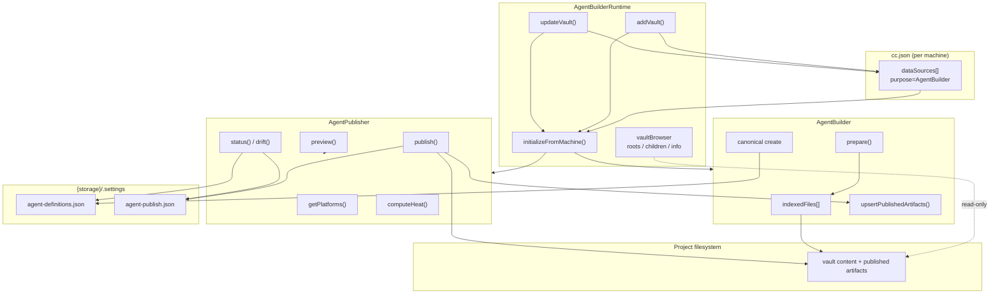
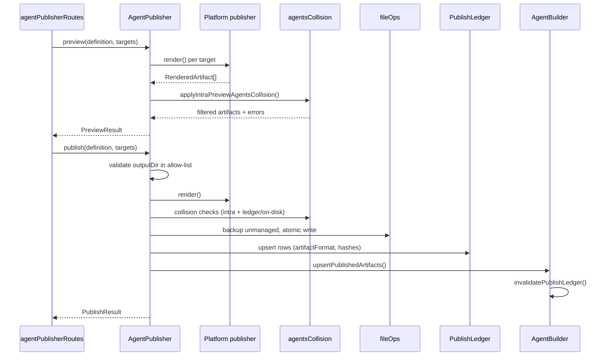
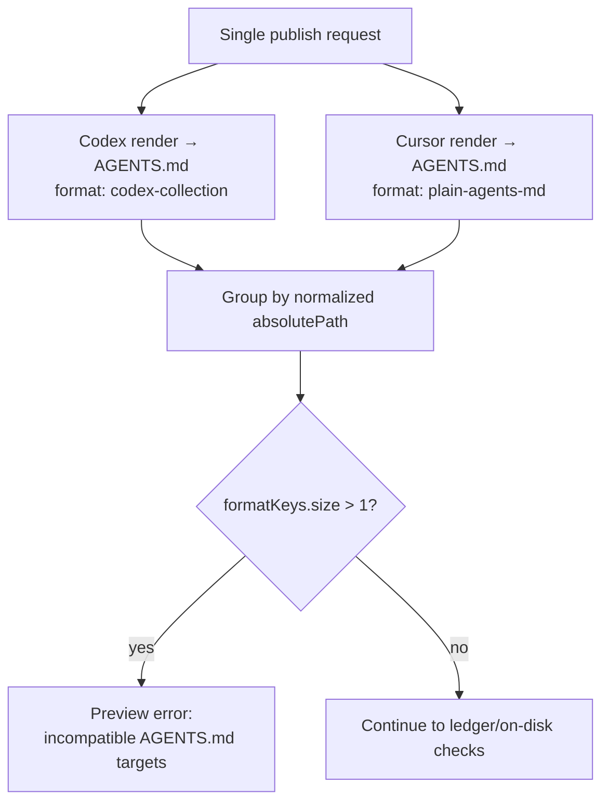
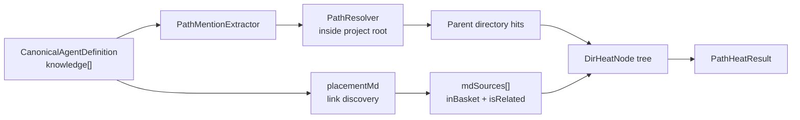
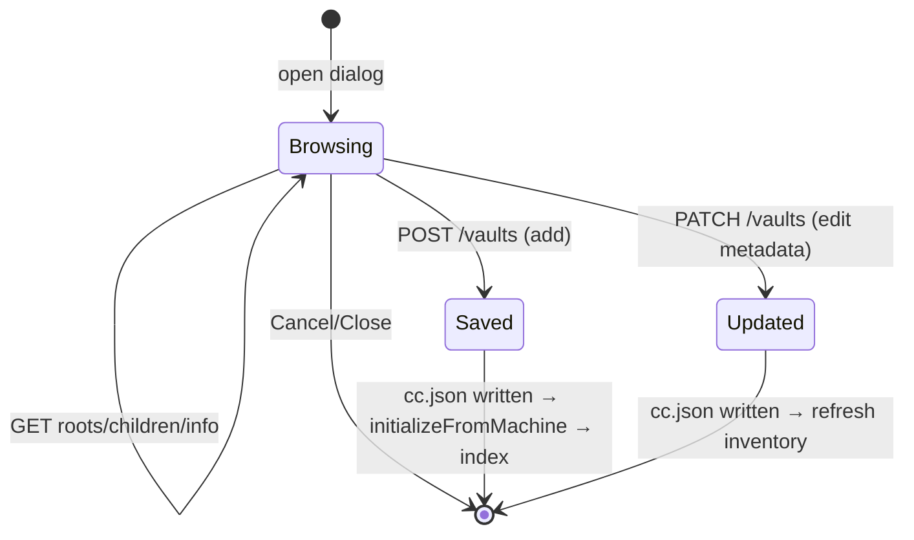

# Agent Publisher and Vault Explorer — Server Architecture

**Date**: 2026-06-22  
**Status**: Current after r2ap (canonical catalog, placement UX), r2ab3 (seven platforms, AGENTS.md provenance), and r2ve (Vault Explorer)  
**Runtime**: Bun, TypeScript, ES modules  
**UI counterpart**: [`visualizer/zz-reach2/architecture/agents/archi-agent-publisher-ui.md`](../../../../visualizer/zz-reach2/architecture/agents/archi-agent-publisher-ui.md)  
**Builder companion**: [`archi-agent-builder.md`](./archi-agent-builder.md) — canonical save, indexing, templates, and legacy create  
**Context**: [`archi-context-core-level0.md`](../archi-context-core-level0.md) — `cc.json`, multi-machine config, startup invariants

---

## 1. System Overview

The server side of the Agent Builder product splits into three cooperating subsystems after the r2ap/r2ab3/r2ve rollouts:

| Subsystem | Primary modules | Responsibility |
| --- | --- | --- |
| **AgentBuilder** | `AgentBuilder.ts` | Index vault content roots, canonical-only save, legacy platform create, `prepare`, templates, file-content reads |
| **AgentBuilderRuntime** | `AgentBuilderRuntime.ts`, `vaultBrowser.ts`, `dataSourceMutation.ts` | Live Builder/Publisher instances, Vault browse, atomic `cc.json` mutation, post-save re-index |
| **AgentPublisher** | `AgentPublisher.ts`, `platforms/*`, `PublishLedger.ts` | Materialize platform artifacts, preview/publish, placement heat, drift, ledger provenance |

The **product contract** for publishing:

1. Builder saves a **canonical definition** to `{storage}/.settings/agent-definitions.json` (no `platform` on create).
2. Publisher takes that definition plus explicit **publish targets** and writes platform-native files.
3. Every write is recorded in `{storage}/.settings/agent-publish.json` with hashes, paths, and `artifactFormat`.
4. Agent List joins canonical rows with ledger rows by `canonicalId` — disk artifacts alone do not define catalog identity.

Vault Explorer is **not** a separate service. It is a read-only browse API plus two explicit mutation routes (`POST` / `PATCH` `/vaults`) that extend `cc.json` `dataSources` for the current machine.



**Upgrade provenance**

| Upgrade | Server contribution |
| --- | --- |
| [r2uab2-agent-builder-2.md](../../upgrades/2026-03/r2uab2-agent-builder-2.md) | List/get-agent, JSON companions, indexing foundation |
| [r2ab2-agent-builder-2.md](../../upgrades/2026-06/r2ab2-agent-builder-2.md) | Canonical store, `AgentPublisher` backbone, materialized copy, path heat |
| [r2ab3-agent-builder-3.md](../../upgrades/2026-06/r2ab3-agent-builder-3.md) | Cursor/Windsurf/Kiro/Antigravity publishers, `artifactFormat`, AGENTS.md collision, ledger classifier |
| [r2ap-agent-publisher-2.md](../../upgrades/2026-06/r2ap-agent-publisher-2.md) | Canonical-first list, `/status`, `mdSources`, Expand Context API support |
| [r2ve-vault-explorer.md](../../upgrades/2026-06/r2ve-vault-explorer.md) | Vault browse contract, Save boundary, PATCH edit vault |

---

## 2. Configuration and Project Roots

AgentBuilder vaults and Publisher project scope both come from `MachineConfig.dataSources` entries with `purpose: "AgentBuilder"`.

```ts
type DataSourceEntry = {
    path: string;                    //Content root indexed for knowledge files
    name: string;                    //projectName label in UI and APIs
    type: string;                    //Display type (e.g. "Vault")
    purpose: string;                 //Must be "AgentBuilder"
    projectRoot?: string;            //Heat, tree, publish allow-list anchor
    agentPath?: string;              //Copilot default agent output dir
    claudeAgentPath?: string;        //Claude default agent output dir
    codexAgentPath?: string;         //Legacy single Codex output dir
    codexAgentPaths?: string[];      //Preferred ordered Codex collection dirs
    publishRoots?: Partial<Record<PublishPlatform, string[]>>;  //Per-platform allowed roots
};
```

| Field | Publisher use | Vault Explorer use |
| --- | --- | --- |
| `path` | Content scan + heat path resolution | Add-mode lookup key; edit-mode immutable key |
| `name` | `projectName` in capabilities and heat | **Vault name** in UI → `dataSources[].name` |
| `projectRoot` | Inferred allow-list boundary | Defaults to selected directory on add |
| `codexAgentPaths` | Codex default `agentOutputDir` | Optional; not primary UI field |
| `publishRoots.cursor` etc. | Override native default output dirs | Optional; server/API level |

**Project root inference** (`pathPolicy.inferProjectRoot`): `projectRoot` → parent of `.github/agents` when `agentPath` is set → else `path`.

**Startup invariant** ([`archi-startup.md`](../startup/archi-startup.md)): ContextCore **reads** `cc.json` at boot and must **not** mutate it. Only explicit `POST` / `PATCH` `/api/agent-builder/vaults` change config at runtime.

---

## 3. Module Inventory

### 3.1 Agent Publisher

| Module | Path | Responsibility |
| --- | --- | --- |
| `AgentPublisher` | `server/src/agentPublisher/AgentPublisher.ts` | Orchestration: platforms, preview, publish, heat, drift, ledger |
| `AgentPublisherBase` | `AgentPublisherBase.ts` | Shared render/materialize helpers |
| `AgentPublisherCopilot` | `platforms/AgentPublisherCopilot.ts` | `.agent.md` + `.github/skills` |
| `AgentPublisherClaude` | `platforms/AgentPublisherClaude.ts` | `.claude/agents/*.md`, import-shim `CLAUDE.md` |
| `AgentPublisherCodex` | `platforms/AgentPublisherCodex.ts` | `AGENTS.md` collection v2 + `AGENTS.json` |
| `AgentPublisherCursor` | `platforms/AgentPublisherCursor.ts` | Plain `AGENTS.md`, `.agents/skills` |
| `AgentPublisherWindsurf` | `platforms/AgentPublisherWindsurf.ts` | Plain `AGENTS.md`, `.windsurf/skills` |
| `AgentPublisherKiro` | `platforms/AgentPublisherKiro.ts` | Compatibility `AGENTS.md`, `.kiro/skills` |
| `AgentPublisherAntigravity` | `platforms/AgentPublisherAntigravity.ts` | Plain `AGENTS.md`, `.agents/skills` |
| `codexCollection` | `platforms/codexCollection.ts` | Collection parse/build, `CXC-CODEX-ENTRY` blocks |
| `CanonicalAgentStore` | `CanonicalAgentStore.ts` | `agent-definitions.json` CRUD |
| `PublishLedger` | `PublishLedger.ts` | `agent-publish.json` upsert and lookup |
| `canonicalListMapper` | `canonicalListMapper.ts` | List + status projection with drift states |
| `agentsCollision` | `agentsCollision.ts` | Intra-preview and ledger AGENTS.md collision policy |
| `agentArtifactClassifier` | `agentArtifactClassifier.ts` | Platform identity from ledger + content heuristics |
| `pathPolicy` | `pathPolicy.ts` | Allowed publish roots, path normalization |
| `pathContract` | `pathContract.ts` | Platform-native default directories for UI |
| `PathHeatAnalyzer` | `PathHeatAnalyzer.ts` | Directory heat tree + `mdSources` |
| `placementMd` | `placementMd.ts` | Related markdown discovery from basket links |
| `fileOps` / `generatedMarker` | `fileOps.ts`, `generatedMarker.ts` | Atomic writes, backups, generated detection |
| `agentPublisherRoutes` | `server/src/server/routes/agentPublisherRoutes.ts` | HTTP surface |

### 3.2 Vault Explorer (server)

| Module | Path | Responsibility |
| --- | --- | --- |
| `vaultBrowser` | `server/src/agentBuilder/vaultBrowser.ts` | One-level directory listing, breadcrumbs, `vault-info` validation |
| `vaultDefaults` | `vaultDefaults.ts` | Default data source shape, unique name resolution, path normalize |
| `dataSourceMutation` | `dataSourceMutation.ts` | Atomic `createVaultDataSource` / `updateVaultDataSource` |
| `AgentBuilderRuntime` | `AgentBuilderRuntime.ts` | `addVault()`, `updateVault()`, `initializeFromMachine()` |
| `agentBuilderRoutes` | `server/src/server/routes/agentBuilderRoutes.ts` | Vault + Builder HTTP surface |

---

## 4. Core Data Model

### 4.1 Canonical definition (input to Publisher)

Persisted by Builder; consumed by preview, publish, heat, and drift.

```ts
interface CanonicalAgentDefinition {
    id: string;
    kind: "agent" | "skill";
    projectName: string;
    name: string;
    description: string;
    whenToUse?: string;
    "argument-hint"?: string;
    tools?: string[];
    knowledge: Array<{ kind: "file" | "text"; value: string }>;
    body?: string;
    paths?: string[];                  //Cursor skill extension
    disableModelInvocation?: boolean;  //Cursor skill extension
    //...license, compatibility, metadata
}
```

### 4.2 Publish target (per platform row)

```ts
interface PublishTarget {
    platform: "copilot" | "claude" | "codex" | "kiro" | "cursor" | "windsurf" | "antigravity";
    artifactKind: "agent" | "skill";
    outputDir: string;
    codexEntryId?: string;
    linkStrategy?: "copy" | "import-shim" | "symlink";
}
```

Active product surface: **`copy`** default everywhere; **`import-shim`** for Claude **agent** only; **`symlink`** gated by `ENABLE_SYMLINK_PUBLISH = false` and not advertised in `/platforms`.

### 4.3 Ledger and artifact format

```ts
type AgentsArtifactFormat =
    | "codex-collection"
    | "plain-agents-md"
    | "plain-agents-override-md";

interface PublishLedgerEntry {
    canonicalId: string;
    platform: PublishPlatform;
    artifactKind: ArtifactKind;
    absolutePath: string;
    artifactFormat?: AgentsArtifactFormat;
    actualLinkStrategy?: LinkStrategy;
    canonicalHash: string;
    artifactHash: string;
    publishedAt: string;
    //...knowledge refs, resolved paths
}
```

**Drift states** on status rows: `clean` | `disk-changed` | `missing-file` | `canonical-changed` | `unknown`.

### 4.4 Placement heat result

```ts
interface PathHeatResult {
    projectName: string;
    projectRoot: string;
    totalHits: number;
    tree: DirHeatNode[];              //Directory-only nodes
    mdSources?: PlacementMdSource[]; //Basket + related markdown chips
    suggestedOutputDir?: string;
    topPaths?: Array<{ path: string; hits: number }>;  //Deprecated compat
    droppedPathCount: number;
}
```

---

## 5. Startup Wiring

```mermaid
sequenceDiagram
    participant CC as ContextCore
    participant RT as AgentBuilderRuntime
    participant AB as AgentBuilder
    participant AP as AgentPublisher
    participant CS as CanonicalAgentStore

    CC->>RT: new(configPath, storage, store, machine)
    CC->>CS: new(storagePath)
    CC->>RT: initializeFromMachine(machine)
    alt sources.length > 0
        RT->>AB: new + index()
        RT->>AP: new(sources, ledger, onArtifactsWritten)
        Note over AP,AB: onArtifactsWritten → upsertPublishedArtifacts()
    else no sources
        Note over RT: Builder/Publisher undefined;<br/>vault browse still mounted
    end
```

When **no** AgentBuilder sources exist at startup:

- Vault browse routes (`vault-roots`, `vault-children`, `vault-info`) remain available.
- `POST /vaults` can create the first source without restart.
- Publisher routes that need indexed content return 503 until sources exist.

---

## 6. Agent Publisher API

| Endpoint | Method | Purpose |
| --- | --- | --- |
| `/api/agent-publisher/platforms?projectName=` | GET | Capabilities: artifact kinds, default dirs, templates, link strategies, notes |
| `/api/agent-publisher/tree?projectName=` | GET | Raw directory tree for path picker |
| `/api/agent-publisher/heat` | POST | `{ definition }` → heat tree + `mdSources` |
| `/api/agent-publisher/preview` | POST | `{ definition, targets }` → rendered artifacts, warnings, errors |
| `/api/agent-publisher/publish` | POST | Materialize, ledger upsert, index update; 201 or 400 |
| `/api/agent-publisher/status?canonicalId=` | GET | `publishedTo` + per-row drift for dialog |
| `/api/agent-publisher/drift` | GET / POST | Full drift report |

---

## 7. Publisher Lifecycle



**Materialization rules**

- Render all artifacts before any disk write.
- Backup files that lack a known generated marker.
- Write via temp file + rename.
- Skip companion `.json` when adding published paths to `indexedFiles`.
- Optional canonical upsert inside `publish()` when store is wired (idempotent by `definition.id`).

---

## 8. Platform Outputs

| Platform | Agent artifact | Skill artifact | Default agent dir | `artifactFormat` |
| --- | --- | --- | --- | --- |
| `copilot` | `{dir}/{name}.agent.md` (+ JSON) | `.github/skills/{id}/SKILL.md` | `agentPath` or `.github/agents` | — |
| `claude` | `{dir}/{name}.md` (+ JSON) | `.claude/skills/{id}/SKILL.md` | `claudeAgentPath` or `.claude/agents` | — |
| `codex` | `{dir}/AGENTS.md` + `AGENTS.json` | `.agents/skills/{id}/SKILL.md` | `codexAgentPaths[0]` or project root | `codex-collection` |
| `cursor` | `{dir}/AGENTS.md` | `.agents/skills/{id}/SKILL.md` | `projectRoot` (or `publishRoots.cursor`) | `plain-agents-md` |
| `windsurf` | `{dir}/AGENTS.md` | `.windsurf/skills/{id}/SKILL.md` | `projectRoot` | `plain-agents-md` |
| `kiro` | `{dir}/AGENTS.md` | `.kiro/skills/{id}/SKILL.md` | `projectRoot` | `plain-agents-md` |
| `antigravity` | `{dir}/AGENTS.md` | `.agents/skills/{id}/SKILL.md` | `projectRoot` | `plain-agents-md` |

**Guidance family** (from r2ab2 gap analysis): six platforms read root `AGENTS.md` natively; Claude reads `CLAUDE.md` and can shim via `@AGENTS.md`. Copilot/Claude use **distinct paths** (`.github/agents`, `.claude/agents`) and do not collide with shared `AGENTS.md` at project root.

---

## 9. AGENTS.md — Format Families and Collision Policy

Both Codex and Cursor target a file named `AGENTS.md`, but the **on-disk contract differs**.

### 9.1 Codex collection (`codex-collection`)

- Multi-entry collection in one markdown file using `<!-- CXC-CODEX-ENTRY:id -->` … `<!-- /CXC-CODEX-ENTRY -->` blocks.
- Companion `AGENTS.json` is the structured store; markdown is regenerated from collection state.
- Upsert merges by `codexEntryId` / agent name into existing collection.
- Parser evidence: `CXC-CODEX-ENTRY`, `CXC-CODEX-FORMAT: v2`, Codex-specific generated marker.

### 9.2 Plain guidance (`plain-agents-md`)

- Single-agent markdown: `# name`, description, optional sections, knowledge links.
- Used by Cursor, Windsurf, Kiro, Antigravity.
- No collection upsert semantics; replace whole file on re-publish.

### 9.3 Why same path is blocked



`applyIntraPreviewAgentsCollision()` (`agentsCollision.ts`) groups same-request `AGENTS.md` artifacts by path. More than one `platform|artifactFormat` key → error. Same platform/format duplicates collapse to the last target in request order.

`decideAgentsCollision()` for ledger/on-disk: replace allowed only when **same platform and same `artifactFormat`**; otherwise block with reason *"Existing generated AGENTS.md belongs to a different platform format."*

Unmanaged `AGENTS.md` (no generated marker, no ledger row) → backup before overwrite, not silent cross-format merge.

### 9.4 Operational workarounds (server-enforced, UI-documented)

| Strategy | Mechanism |
| --- | --- |
| **One owner per path** | Publish Codex *or* Cursor to root `AGENTS.md`, not both in one request |
| **Split output directories** | `codexAgentPaths` vs `publishRoots.cursor` / per-row `outputDir` in preview |
| **Sequential publish** | Second publish to same path blocked unless same format/platform (replacement) |
| **Claude shim** | `import-shim` writes `CLAUDE.md` importing `@AGENTS.md` — does not unify Codex+Cursor |

Future hub-and-projection model (r2ab2 gap doc) is **not implemented**; no shared multi-platform `AGENTS.md` in this batch.

---

## 10. Placement Heat Pipeline



| Rule | Behavior |
| --- | --- |
| Tree nodes | **Directories only** — file mentions roll up to parent dir |
| `mdSources` | Basket markdown `inBasket: true`; link-discovered `isRelated: true` |
| Related docs | Resolved markdown links inside project root; drop URLs, anchors, mailto, duplicates |
| `topPaths` | Retained for older clients; UI prefers `mdSources` + tree |
| Client filter | UI may re-aggregate heat by selected chip paths (`filterHeatByMdSources`) |

Heat informs **placement**; native platform defaults from `pathContract` remain authoritative unless the user picks a directory.

---

## 11. Canonical List and Drift

**List** (`GET /api/agent-builder/list`): reads `CanonicalAgentStore` only; joins `PublishLedger` by `canonicalId`. Disk-only platform files without a canonical row are **not** listed.

**Status** (`GET /api/agent-publisher/status`): returns `publishedTo` with cheap drift flags for dialog prefill.

**Classifier** (`agentArtifactClassifier.ts`): plain `AGENTS.md` platform identity requires ledger `artifactFormat` or Codex-specific content markers — generic `CXC_GENERATED_MARKER` alone is **not** Codex evidence.

`AgentBuilder.invalidatePublishLedger()` runs from `upsertPublishedArtifacts()` so list/get-agent classification sees fresh provenance after publish.

---

## 12. Vault Explorer — Server Contract

### 12.1 Browse (read-only)

| Endpoint | Behavior |
| --- | --- |
| `GET /api/agent-builder/vault-roots` | Labeled OS roots; no index, no `cc.json` write |
| `GET /api/agent-builder/vault-children?path=` | One directory level, breadcrumbs, `parentPath`; directories only |
| `GET /api/agent-builder/vault-info?path=` | Exists, readable, duplicate `alreadyConfigured`, broad-root warnings |

Browse routes work **without** an existing AgentBuilder index (no-source startup).

**Broad-path warning** (`vaultBrowser.inspectVaultPath`): advisory only; never blocks Save.

| Condition | Warning |
| --- | --- |
| Windows drive root | `segments.length === 1` and `^[a-z]:$` |
| Shallow path | `segments.length <= 1` |
| Broad set | Normalized path in `BROAD_ROOT_SEGMENTS` |

### 12.2 Mutation boundary



| Endpoint | Effect |
| --- | --- |
| `POST /api/agent-builder/vaults` | Append `dataSources` entry; atomic `cc.json` backup+write; `addVault()` → re-index; response includes `prepare` |
| `PATCH /api/agent-builder/vaults` | Update `name`, `type`, optional `agentPath` keyed by normalized `path`; returns `previousName` when renamed |

`prepare()` seeds configured sources with `fileCount: 0` when a vault is empty so new vaults appear in source inventory immediately.

### 12.3 Default vault row shape (add mode)

```ts
{
    path: "<selected absolute dir>",
    projectRoot: "<same as path>",
    name: "<unique vault name>",
    type: "Vault",
    purpose: "AgentBuilder",
    category: "vaults"  //when using categorized dataSources
}
```

Edit mode does **not** change `path` — it is the lookup key. Duplicate path on add is rejected via `vault-info.alreadyConfigured`.

---

## 13. Safety Boundaries

| Area | Policy |
| --- | --- |
| Path traversal | Publisher writes only inside `publishRoots` / inferred project root |
| Builder file read | `get-file-content` requires index membership |
| Vault browse | Read-only; no `prepare()`, no indexing |
| Vault mutation | Only POST/PATCH `/vaults`; atomic write with backup |
| Generated overwrite | Same platform+format only on `AGENTS.md` with provenance |
| Unmanaged files | Backup before overwrite |
| Startup | Never mutates `cc.json` |
| Symlink publish | Disabled in product API (`ENABLE_SYMLINK_PUBLISH`) |

---

## 14. Known Gaps and Deferred Work

1. Antigravity `GEMINI.md` mirror not implemented.
2. Kiro native `.kiro/steering/*.md` mirrors deferred.
3. Hub-and-projection / unified `AGENTS.md` across Codex and plain platforms — architectural target only.
4. Symlink link strategy retained behind flag, not exposed in UI.
5. Vault advanced fields (`category`, `projectRoot`, `agentPath`) — server supports; UI exposes primarily name/type.
6. Expand Context mutates in-session definition only until Builder save persists canonical store.

---

## 15. Related Documentation

- UI flows, dialogs, localStorage: [`archi-agent-publisher-ui.md`](../../../../visualizer/zz-reach2/architecture/agents/archi-agent-publisher-ui.md)
- Builder authoring, templates, card pipeline: [`archi-agent-builder.md`](./archi-agent-builder.md), [`archi-agent-builder-ui.md`](../../../../visualizer/zz-reach2/architecture/agents/archi-agent-builder-ui.md)
- User-facing vault instructions: [`visualizer/public/README-DATA-SOURCES.MD`](../../../../visualizer/public/README-DATA-SOURCES.MD)
- Atomic `cc.json` edits: [`archi-cli.md`](../cli/archi-cli.md)
