# ContextCore – Architectural Review

**Date**: 2026-03-07  
**Scope**: High level architecture of ContextCore
**Runtime**: Bun (TypeScript, ESNext modules)  
**Entry point**: `src/ContextCore.ts`  
**API Endpoints Definition**: [`interop/insomnia-context-core.json`](../../interop/insomnia-context-core.json)

---

## 1. System Overview

ContextCore is a batch-ETL + query-API application that **ingests AI chat history from six IDE assistants** (Claude Code, Cursor, Kiro, VS Code, OpenCode, Codex), normalizes every message into a unified `AgentMessage` model, persists sessions as JSON files on disk, loads them into an in-memory SQLite database, and exposes them via an Express REST API with **hybrid search** (Fuse.js fuzzy text matching + optional Qdrant vector semantic search).

On startup, ContextCore also runs an AI topic pipeline (`gpt-5-nano`) that generates per-session summaries into `{storage}/.settings/topics.json` via `TopicStore`. API responses resolve display subject with precedence: `customTopic` → `aiSummary` → original NLP-derived `subject`. Users can update `customTopic` through the API.

An **optional Qdrant integration** adds semantic search via OpenAI `text-embedding-3-large` embeddings (3072 dimensions). When enabled, the `/api/search` endpoint merges Fuse.js lexical hits with Qdrant cosine-similarity hits using weighted scoring (75% semantic, 25% lexical). The vector pipeline is fully additive and feature-gated by environment variables — when absent, the system behaves exactly as the Fuse.js-only baseline. See [`archi-qdrant.md`](search/archi-qdrant.md) for the full vector search architectural review.

The system runs on **Bun** and is designed for multi-machine use: a single `cc.json` config file contains per-hostname harness paths, so the same codebase/storage root can be synced across computers.

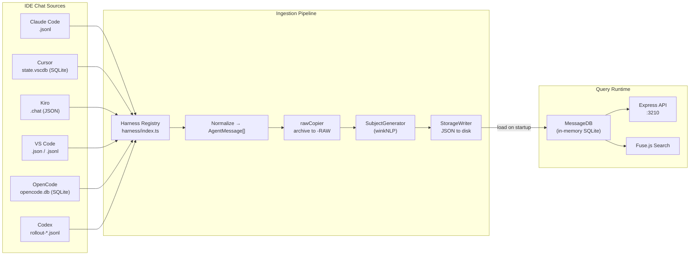

---

## 2. Component Architecture

### 2.1 High-Level Module Map

The codebase is organized into four functional layers. The **Orchestration** layer (`ContextCore.ts`, `config.ts`, `CCSettings`) drives startup and coordinates the full pipeline. The **Harness** layer contains six format-specific readers dispatched through a central registry. The **Storage & Analysis** layer handles NLP-based subject generation and JSON file persistence. The **Query Runtime** layer loads persisted data into an in-memory SQLite database and serves it over HTTP.

All harness readers and most pipeline modules depend on the shared `AgentMessage` model, `hashId` utility, and `pathHelpers` — these form a universal foundation layer used by nearly every module, so they are omitted from the graph below for clarity.

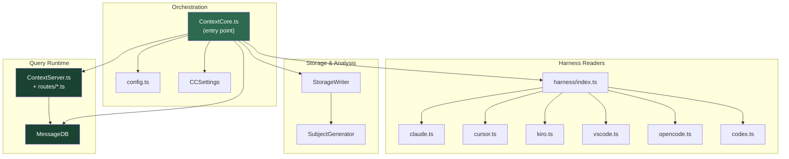

### 2.2 Module Inventory

| Module                   | Path                                  | Responsibility                                                                                                                                                                                                                                              |
| ------------------------ | ------------------------------------- | ----------------------------------------------------------------------------------------------------------------------------------------------------------------------------------------------------------------------------------------------------------- |
| **setup**                | `src/setup.ts`                        | Interactive CLI wizard (`bun run setup`): discovers IDE chat data on the host, prompts per-harness confirmation, generates/merges `cc.json`. Self-contained — no harness imports. See [`r2us-setup.md`](../upgrades/2026-03/r2us-setup.md)                  |
| **ContextCore**          | `src/ContextCore.ts`                  | Orchestrator: loads config, runs harness pipeline, writes storage, boots DB + API                                                                                                                                                                           |
| **config**               | `src/config.ts`                       | Hostname detection, `cc.json` loading (Bun file API), machine selection                                                                                                                                                                                     |
| **CCSettings**           | `src/settings/CCSettings.ts`          | Singleton config wrapper; reads `cc.json` synchronously, ensures storage dir exists                                                                                                                                                                         |
| **types**                | `src/types.ts`                        | Shared type definitions: `HarnessConfig`, `MachineConfig`, `ContextCoreConfig`, `ToolCall`                                                                                                                                                                  |
| **AgentMessage**         | `src/models/AgentMessage.ts`          | Domain model class with `serialize()` / `deserialize()` for JSON round-tripping; carries 19 fields per message                                                                                                                                              |
| **harness/index**        | `src/harness/index.ts`                | Registry dispatch: maps harness name → reader function, normalizes path configs                                                                                                                                                                             |
| **claude**               | `src/harness/claude.ts`               | JSONL parser for Claude Code sessions; user/assistant extraction, tool correlation                                                                                                                                                                          |
| **cursor**               | `src/harness/cursor.ts`               | SQLite reader for Cursor `state.vscdb`; bubble records + ItemTable fallback, workspace inference                                                                                                                                                            |
| **kiro**                 | `src/harness/kiro.ts`                 | JSON parser for Kiro `.chat` files; system prompt detection, project mapping rules                                                                                                                                                                          |
| **vscode**               | `src/harness/vscode.ts`               | Dual-format parser (`.json` + `.jsonl` incremental patches); workspace.json project resolution                                                                                                                                                              |
| **opencode**             | `src/harness/opencode.ts`             | SQLite reader for OpenCode `opencode.db`; step-based message consolidation (N message rows → 1 AgentMessage per user turn), reasoning + tool call extraction                                                                                                |
| **codex**                | `src/harness/codex.ts`                | JSONL event-log reader for Codex sessions; canonical event filtering (`event_msg`), turn-based tool-call correlation, and instruction/meta dedup filtering                                                                                                  |
| **SubjectGenerator**     | `src/analysis/SubjectGenerator.ts`    | NLP-based subject generation using winkNLP; verb extraction, symbol frequency, verb-subject pairs for filenames                                                                                                                                             |
| **TopicContextBuilder**  | `src/analysis/TopicContextBuilder.ts` | Builds summarization context from session messages (role-aware filtering + budgeting)                                                                                                                                                                       |
| **TopicSummarizer**      | `src/analysis/TopicSummarizer.ts`     | Runs GPT-5-nano summarization pipeline and persists topic entries per session                                                                                                                                                                               |
| **StorageWriter**        | `src/storage/StorageWriter.ts`        | Session persistence to `{storage}/{machine}/{harness}/{project}/{YYYY-MM}/` tree                                                                                                                                                                            |
| **TopicStore**           | `src/settings/TopicStore.ts`          | Persists `topics.json` in `{storage}/.settings` and manages AI/custom topic entries                                                                                                                                                                         |
| **IMessageStore**        | `src/db/IMessageStore.ts`             | Common interface for message stores; exports `createMessageStore()` factory, query filter types, and `SessionSummary`                                                                                                                                       |
| **BaseMessageStore**     | `src/db/BaseMessageStore.ts`          | Abstract base class: shared SQLite schema, indexes (7 single-column + 4 compound), all query methods, row mapping                                                                                                                                           |
| **InMemoryMessageStore** | `src/db/InMemoryMessageStore.ts`      | In-memory SQLite (`:memory:`) implementation; all data lost on exit. Opt-in via `IN_MEMORY_DB=true`                                                                                                                                                         |
| **DiskMessageStore**     | `src/db/DiskMessageStore.ts`          | On-disk SQLite with WAL journal, 64 MB cache, incremental `loadFromStorage()`, transactional batch inserts. Default mode                                                                                                                                    |
| **ContextServer**        | `src/server/ContextServer.ts`         | Thin API orchestrator: middleware, `RouteContext` assembly, route mounting (delegates to `routes/*.ts`), static file serving, port binding                                                                                                                  |
| **RouteContext**         | `src/server/RouteContext.ts`          | Interface carrying shared services (`messageDB`, `topicStore`, `vectorServices`, etc.) injected into every route file                                                                                                                                       |
| **routeUtils**           | `src/server/routeUtils.ts`            | Shared route helpers: `resolveSubject()`, `loadProjectRemapsByHarness()`, `applyProjectRemap()`, `normalizeScopeEntry()`                                                                                                                                    |
| **routes/**              | `src/server/routes/*.ts`              | Per-resource route files (`sessionRoutes`, `projectRoutes`, `scopeRoutes`, `topicRoutes`, `messageRoutes`, `searchRoutes`, `threadRoutes`, `agentBuilderRoutes`)                                                                                            |
| **hashId**               | `src/utils/hashId.ts`                 | SHA-256 based deterministic message ID generation (16 hex chars)                                                                                                                                                                                            |
| **pathHelpers**          | `src/utils/pathHelpers.ts`            | Filename sanitization, project name derivation, YYYY-MM folder builder                                                                                                                                                                                      |
| **rawCopier**            | `src/utils/rawCopier.ts`              | Copies/dumps raw source files to `{machine}-RAW` archive with timestamp preservation; provides cache checking via size/mtime comparison to skip unchanged files                                                                                             |
| **FileWatcher**          | `src/watcher/FileWatcher.ts`          | Dual-mode file system watcher: watches local harness source paths + remote machine storage dirs for changes. Debounces events, filters by extension, serializes ingest jobs via a sequential queue. See [archi-file-watcher.md](data/archi-file-watcher.md) |
| **IncrementalPipeline**  | `src/watcher/IncrementalPipeline.ts`  | Orchestrates live ingestion: harness re-read → StorageWriter → MessageDB → TopicSummarizer → VectorPipeline. Also handles remote storage files (short pipeline: JSON parse → MessageDB → AI/Vector)                                                         |
| **MCPServer**            | `src/mcp/MCPServer.ts`                | Stdio MCP transport wrapper: spawns `StdioServerTransport` for local clients (Claude Code, Cursor), calls `registerAll()` on startup                                                                                                                        |
| **mcp/serve**            | `src/mcp/serve.ts`                    | Standalone MCP entry point: loads DB from persisted storage, starts stdio server without Express — used by `bun run mcp`                                                                                                                                    |
| **mcp/registry**         | `src/mcp/registry.ts`                 | Registers all tools, resources, and prompts on an MCP `Server` instance via `registerAll()`; handles dispatch, timing logs, and MCP error codes                                                                                                             |
| **mcp/tools/messages**   | `src/mcp/tools/messages.ts`           | Tool handlers: `get_message`, `get_session`, `list_sessions`, `query_messages`, `get_latest_threads`                                                                                                                                                        |
| **mcp/tools/search**     | `src/mcp/tools/search.ts`             | Tool handlers: `search_messages`, `search_threads` — Fuse.js fuzzy search with advanced query syntax (simple, OR, AND, exact phrase)                                                                                                                        |
| **mcp/tools/topics**     | `src/mcp/tools/topics.ts`             | Tool handlers: `get_topics`, `get_topic`, `set_topic` — topic entry management via `TopicStore`                                                                                                                                                             |
| **mcp/resources**        | `src/mcp/resources/index.ts`          | Resource handlers: `cxc://stats`, `cxc://projects`, `cxc://harnesses`, `cxc://projects/{name}/sessions`                                                                                                                                                     |
| **mcp/prompts**          | `src/mcp/prompts/index.ts`            | Prompt templates: `explore_history`, `summarize_session`, `find_decisions`, `debug_history` — fetch fresh data at invocation time                                                                                                                           |
| **mcp/transports/sse**   | `src/mcp/transports/sse.ts`           | SSE transport mounted on Express: `GET /mcp/sse` opens sessions, `POST /mcp/messages` receives JSON-RPC; optional bearer token auth via `MCP_AUTH_TOKEN`                                                                                                    |
| **mcp/formatters**       | `src/mcp/formatters.ts`               | LLM-friendly text formatters for messages, sessions, search results, threads, and topics; enforces excerpt limits and head+tail truncation                                                                                                                  |

---

## 3. Data Pipeline

### 3.0 Prerequisites — Setup Wizard

Before the first run, `bun run setup` (`src/setup.ts`) generates the `cc.json` config by interactively scanning the host for IDE chat data. It detects the hostname, discovers default paths for all four harnesses (Claude Code `.jsonl` projects, Cursor `state.vscdb`, VS Code `chatSessions/` dirs, Kiro hex-hash session dirs), and lets the user confirm or skip each one. For Kiro, it offers a minimal `.chat` file preview so the user can assign project names. The wizard appends to an existing `cc.json` or creates a new one, and never crashes — every step fails gracefully with actionable advice. It is fully self-contained (no harness module imports, no data ingestion, no network calls).

### 3.1 Startup Sequence

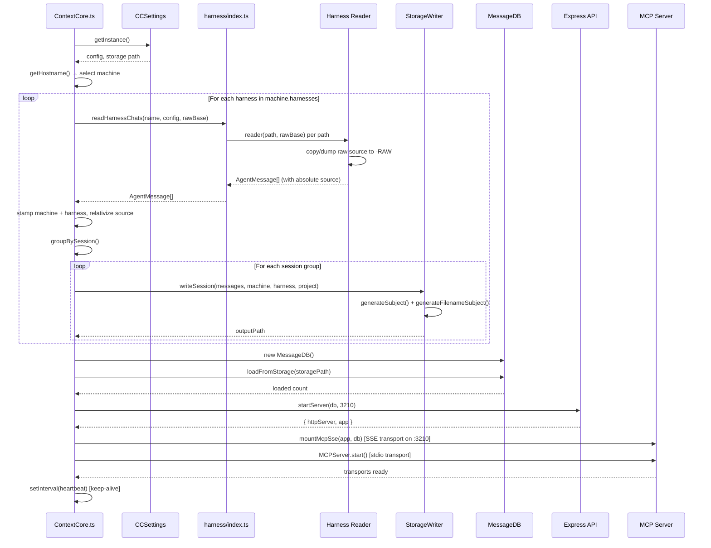

### 3.2 Harness Ingestion Flow

Each harness reader follows the same contract: **accept a path, return `AgentMessage[]`**. Internally, they diverge significantly based on the source format. The four flows are outlined below, each tailored to the quirks of its IDE's storage layout.

#### Claude Code

Claude Code stores conversations as `.jsonl` files under `~/.claude/projects/<project-slug>/`, one JSON event per line. The reader scans for these files, checks if each file is already cached (by comparing size and modification time), and skips unchanged files. For new or modified files, it parses each line defensively (skipping malformed entries) and keeps only `user` and `assistant` typed events. The most notable step is **tool result correlation**: assistant messages contain `tool_use` entries with unique IDs, and subsequent user lines carry matching `tool_result` payloads that must be stitched back together by `tool_use_id`.

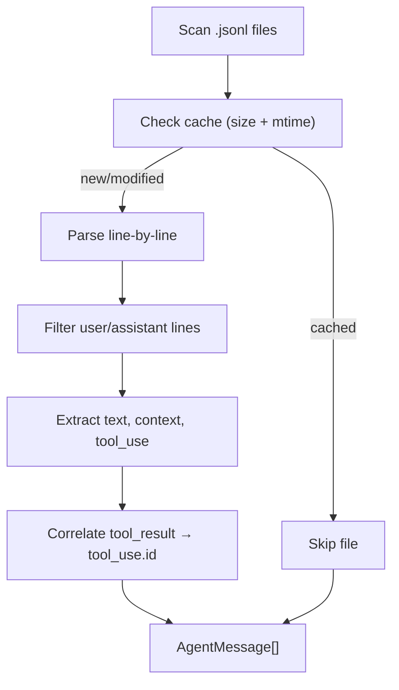

#### Cursor

Cursor keeps all chat state in a single SQLite database (`state.vscdb`). Before extracting messages, the reader builds a **session model map** by scanning `composerData:*` keys in `cursorDiskKV` — each entry's `modelConfig.modelName` field holds the model used for that session (e.g., `claude-4-sonnet`, `gpt-5`, `claude-4.5-sonnet-thinking`). Entries with `modelName: "default"` are skipped. The reader then queries `bubbleId:*` keys for conversation payloads; individual bubble records rarely carry model metadata, so the session model map serves as the primary fallback for model resolution. If no bubble records are found, the reader falls back to the older `ItemTable` format, walking generic JSON trees to locate role/content pairs. Workspace context is inferred from path hints embedded in the data, then run through the configurable project mapping rule cascade.

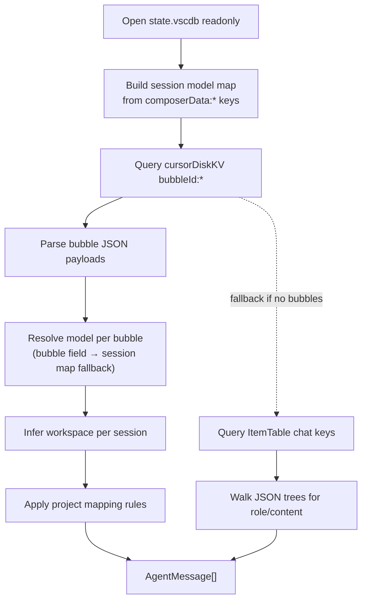

#### Kiro

Kiro saves each session as a single `.chat` JSON file. The payload contains a `chat` array (the conversation turns), a `metadata` object (with `modelId`), and an `executionId`. The reader parses the file to extract project candidates from various sources, then resolves the project name via mapping rules. Once the project is determined, a cache check (size + mtime comparison) decides whether to skip message extraction. For new or modified files, it identifies the system prompt (the first `human` entry containing an `<identity>` tag) and skips it. The model is extracted from `metadata.modelId` (e.g., `claude-sonnet-4.5`, `claude-haiku-4.5`). The remaining entries are walked sequentially, mapping roles (`human` → `user`, `bot` → `assistant`, `tool` → `tool`). Tool calls are inferred best-effort: a `bot` message immediately followed by a `tool` message with empty content is treated as a tool invocation.

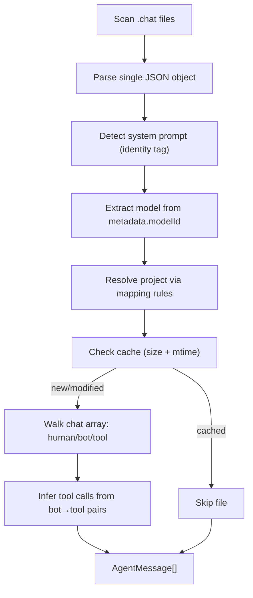

#### VS Code / Copilot

VS Code Copilot has two coexisting storage formats within the same `chatSessions/` directory. Both file types are cache-checked before processing. Older `.json` files contain complete self-contained sessions and are parsed directly. Newer `.jsonl` files use an incremental patch system: line 0 (`kind: 0`) provides the session skeleton, `kind: 1` lines apply field-level set-patches by key path (via `setByPath()`), and `kind: 2` lines deliver array-level append-patches for response data and tool invocation records (via `appendByPath()`). Once reconstructed, both formats converge into the same extraction path — each request yields a user/assistant `AgentMessage` pair, with response items separated by `kind`: `"thinking"` entries are extracted into the `rationale` array, while `"text"` / `"inlineReference"` entries form the assistant message body. Non-string `value` fields (arrays, objects, null) are safely skipped. Project context is resolved from the parent `workspace.json` metadata file.

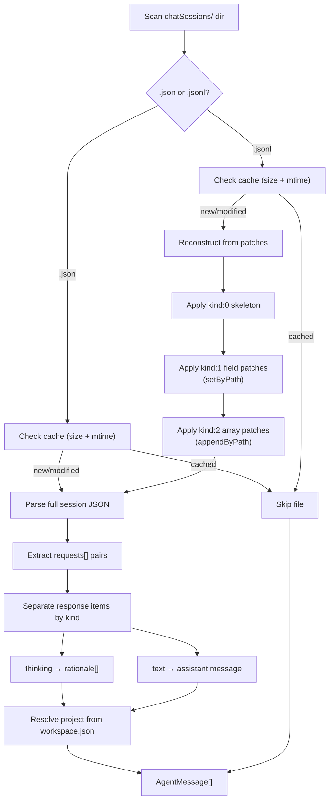

#### OpenCode

OpenCode stores all sessions in a single SQLite database (`opencode.db`). The schema has three key tables: `session` (conversation metadata with working directory), `message` (one row per turn with role/model/token metadata in a JSON `data` field), and `part` (content atoms — text, reasoning, tool calls — linked to their message). The defining quirk is OpenCode's **step-based architecture**: one user prompt produces N `message` rows on the assistant side (one per tool-call cycle), all linked by a shared `parentID`. The harness consolidates these into a single `AgentMessage` per user turn by grouping assistant messages by `parentID` and merging their parts. Project name is derived directly from `session.directory` (the working directory).

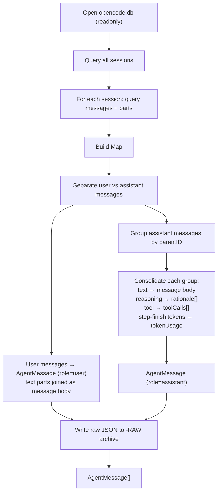

#### Codex

Codex stores sessions as JSONL event logs (`rollout-*.jsonl`) under `.codex/sessions/...`. The harness reads canonical conversation rows from `event_msg` records (`user_message` + `agent_message`) and treats the remaining record families as metadata or tooling streams. This avoids duplicate text rows caused by mirrored `response_item.message` entries and ignores instruction fluff from `session_meta.base_instructions`. Tool calls are reconstructed by pairing `response_item` call/output entries via `call_id` and attached to the terminal assistant message for each turn.

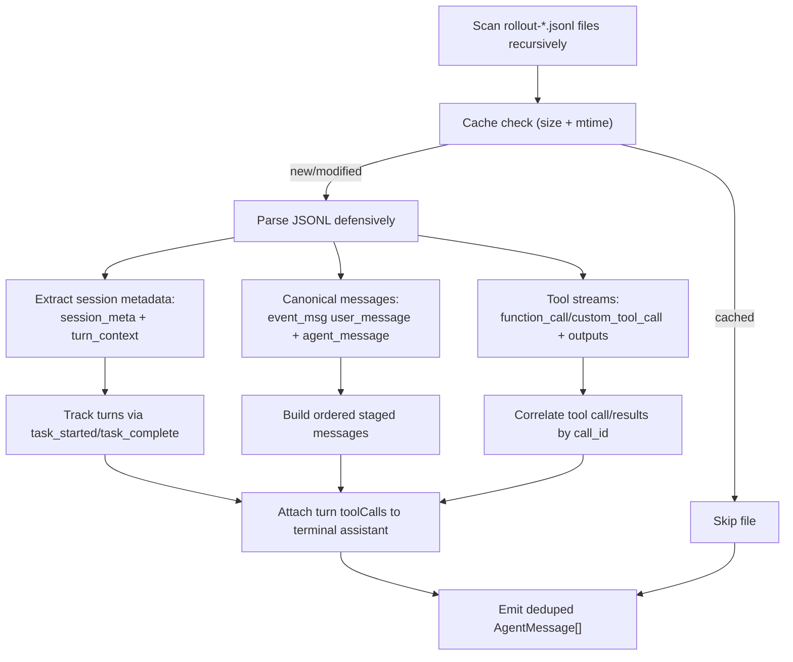

---

## 4. Data Model

### 4.1 AgentMessage Entity

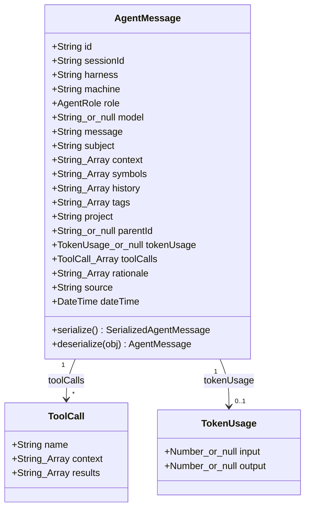

### 4.2 Configuration Model

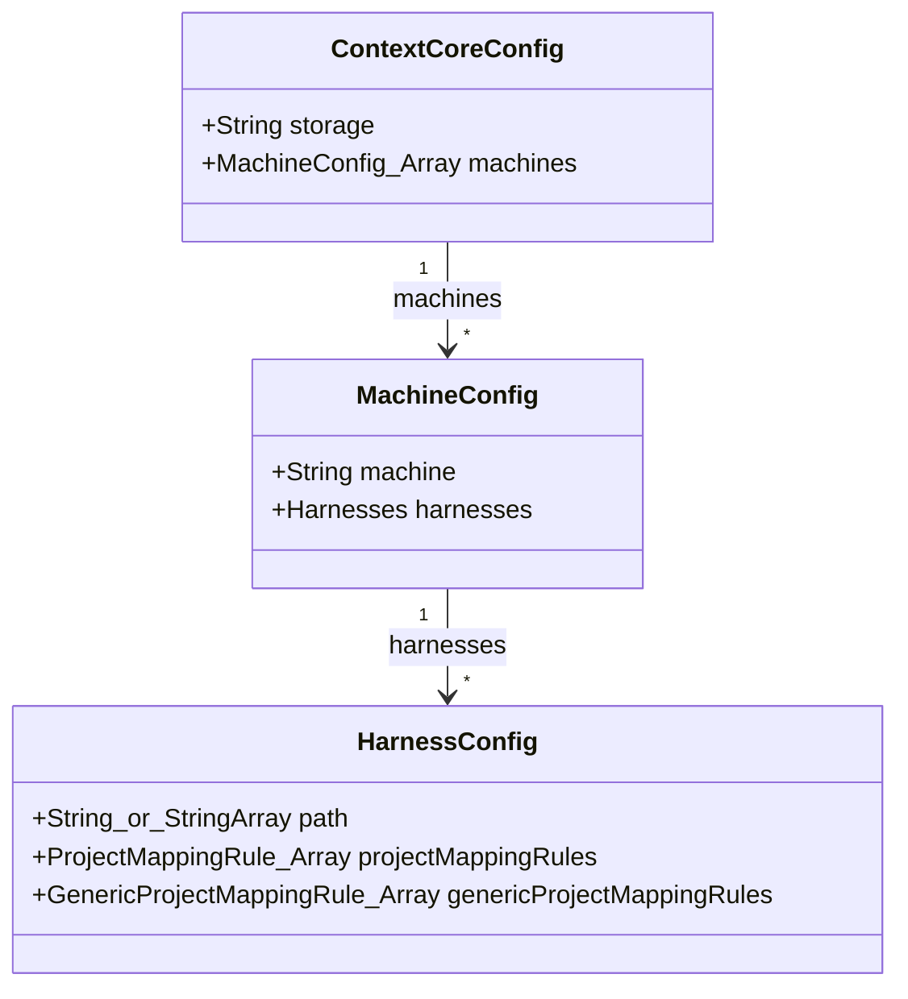

### 4.3 Storage Layout

```
{storage}/
├── {machine}/
│   ├── ClaudeCode/
│   │   ├── {project}/
│   │   │   ├── 2026-03/
│   │   │   │   ├── 2026-03-01 14-30 fix-bug-update-config-run-tests.json
│   │   │   │   └── 2026-03-05 09-15 add-feature-implement-handler-refactor-code.json
│   │   │   └── 2026-02/
│   │   │       └── ...
│   │   └── {project-2}/
│   ├── Cursor/
│   ├── Kiro/
│   └── VSCode/
├── {machine}-RAW/
│   ├── ClaudeCode/
│   │   └── {project}/
│   │       └── session-file.jsonl          ← verbatim copy of source
│   ├── Cursor/
│   │   └── {project}/
│   │       └── {sessionId}.json            ← JSON dump of DB rows
│   ├── Kiro/
│   │   └── {project}/
│   │       └── session.chat                ← verbatim copy of source
│   └── VSCode/
│       └── {project}/
│           ├── session.json                ← verbatim copy of source
│           └── session.jsonl               ← verbatim copy of source
```

Each `.json` file under `{machine}/` contains a serialized `AgentMessage[]` — one complete session.

The **`{machine}-RAW/`** directory mirrors the harness/project structure and preserves the original source data exactly as it was read during ingestion. For file-based harnesses (Claude Code, Kiro, VS Code), the source file is copied verbatim via `copyRawSourceFile()`. For database-based harnesses (Cursor), the parsed DB rows are serialized to JSON via `writeRawSourceData()`. Each `AgentMessage.source` field stores the **storage-relative path** to its raw copy (e.g., `DEVBOX1-RAW\VSCode\AXON\session.jsonl`), enabling traceability back to the original data.

---

## 5. API Surface

The Express server exposes twelve REST endpoints on `localhost:3210`. The API separates concerns into five interaction patterns: **direct lookup** (by message ID or session ID), **filtered listing** (with pagination and field-level query params), **thread-oriented views/search**, **project discovery** (projects grouped by harness), and **topic management** (AI summaries + custom topic overrides).

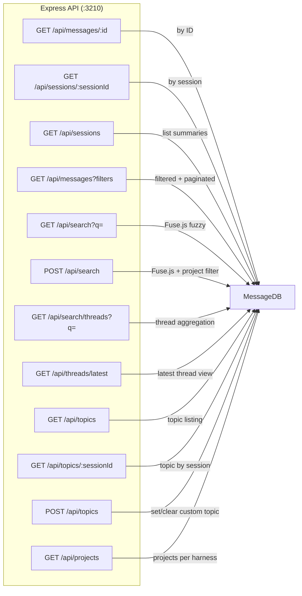

| Endpoint                   | Method | Description                                                  | Body / Filters                                                                                                              |
| -------------------------- | ------ | ------------------------------------------------------------ | --------------------------------------------------------------------------------------------------------------------------- |
| `/api/messages/:id`        | GET    | Single message by ID                                         | —                                                                                                                           |
| `/api/sessions/:sessionId` | GET    | All messages in a session (time-ordered)                     | —                                                                                                                           |
| `/api/sessions`            | GET    | Session summaries (count, date range, harness)               | —                                                                                                                           |
| `/api/messages`            | GET    | Filtered message listing with pagination                     | `role`, `harness`, `model`, `project`, `subject`, `from`, `to`, `page`, `pageSize`                                          |
| `/api/search`              | GET    | Hybrid search across messages (Fuse.js + optional Qdrant)    | `q` (Fuse weighted: message 3×, subject/symbols/tags 2×, context 1×; Qdrant: cosine similarity with configurable min score) |
| `/api/search`              | POST   | Same search with optional project-scoped filter; not cached  | `{ query, projects?: [{ harness, project }] }` — omit or leave `projects` empty for global search                           |
| `/api/search/threads`      | GET    | Thread-level search results aggregated by session            | `q`                                                                                                                         |
| `/api/threads/latest`      | GET    | Most recent threads by latest message date                   | `limit`                                                                                                                     |
| `/api/projects`            | GET    | All known projects grouped by harness, sorted alphabetically | —                                                                                                                           |
| `/api/topics`              | GET    | List topic entries (AI summaries + custom topics)            | —                                                                                                                           |
| `/api/topics/:sessionId`   | GET    | Topic entry for one session                                  | —                                                                                                                           |
| `/api/topics`              | POST   | Set or clear custom topic override                           | `{ sessionId, customTopic }`                                                                                                |

**`/api/projects` response shape:**
```json
[
  { "harness": "ClaudeCode", "projects": ["AXON", "NexusPlatform"] },
  { "harness": "Cursor",     "projects": ["AXON", "NexusPlatform"] },
  { "harness": "Kiro",       "projects": ["AXON"] },
  { "harness": "VSCode",     "projects": ["NexusPlatform"] }
]
```

**`POST /api/search` request body:**
```json
{
  "query": "authentication flow",
  "projects": [
    { "harness": "ClaudeCode", "project": "NexusPlatform" },
    { "harness": "Cursor",     "project": "NexusPlatform" }
  ]
}
```
The `projects` array is optional. When omitted or empty, behaviour is identical to `GET /api/search`. When provided, Fuse.js results are filtered to messages whose `harness`+`project` match one of the listed pairs before merging with any Qdrant hits.

---

## 6. Subject Generation Pipeline

The `SubjectGenerator` produces two distinct subject strings per session, each optimized for a different purpose:

1. **Persisted subject** (`AgentMessage.subject`) — a human-readable summary built from up to 10 verbs (extracted via winkNLP POS tagging from the first user message) and the top 10 camelCase symbols by frequency across the entire session. Format: `"verb1-verb2-...-verb10 [Keywords- sym1-sym2-...-sym10]"`. This is stored on every `AgentMessage` in the session and used for API filtering and search.

2. **Filename subject** — a shorter, filesystem-safe string built from verb-noun pairs (up to 5 pairs extracted from the first user message). This is used by `StorageWriter` to name the output JSON file. For very large sessions (>100k words), the symbol extraction samples 10 evenly-spaced segments rather than scanning the full text.

At runtime, the API does not always expose this NLP subject directly. Subject resolution applies topic overrides in this order:

1. `customTopic` (user-provided via `POST /api/topics`) when non-empty
2. `aiSummary` (from `TopicSummarizer`) when non-empty
3. NLP `subject` from `SubjectGenerator` as fallback

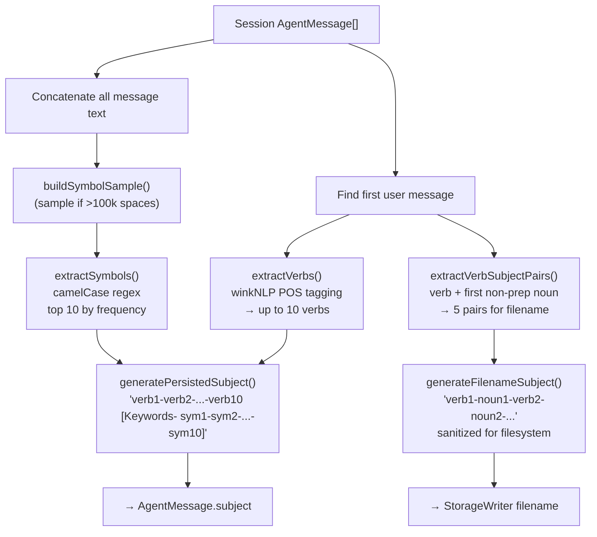

---

## 7. Project Resolution Strategies

Assigning the correct project label to each session is critical for the storage layout and for filtering in the API. Since each IDE stores workspace context differently (or not at all), each harness implements its own resolution strategy. Claude Code and VS Code have relatively straightforward approaches — the workspace path is explicitly present in the data. Cursor and Kiro require more heuristic inference and share a configurable **project mapping rule system** defined in `cc.json`.

The diagram below shows each harness's resolution pipeline. Cursor and Kiro both terminate in the same three-tier rule cascade: explicit rules first, then generic rules, then a `"MISC"` fallback.


The **project mapping rule system** (shared by Cursor and Kiro) supports three tiers:
1. **Explicit rules**: `{ path, newPath }` — if the source path contains `path`, remap to `newPath`. This handles known projects with non-standard or deep directory structures.
2. **Generic rules**: `{ path, rule: "byFirstDir" }` — extract the first directory segment after the matched prefix. Useful for monorepo-style layouts where the first child folder is the project boundary.
3. **Fallback**: `"MISC"` when no rules match — ensures every session gets a valid project label even when the source data contains no useful workspace hints.

---

## 8. Model Resolution Strategies

The `model` field on `AgentMessage` records which AI model generated a response. It is set only on `assistant` messages — user messages always have `model: null`. Each harness extracts the model from a different location in the source data:

| Harness         | Model Source                                                                                              | Example Values                                           |
| --------------- | --------------------------------------------------------------------------------------------------------- | -------------------------------------------------------- |
| **Claude Code** | `line.message.model` on assistant JSONL entries                                                           | `claude-sonnet-4-5-20250929`                             |
| **Cursor**      | `composerData:*` → `modelConfig.modelName` (session-level map), with per-bubble `pickModel()` as override | `claude-4-sonnet`, `gpt-5`, `claude-4.5-sonnet-thinking` |
| **Kiro**        | `metadata.modelId` in the `.chat` file payload                                                            | `claude-sonnet-4.5`, `claude-haiku-4.5`                  |
| **VS Code**     | `request.modelId` (from kind:2 JSONL patches), fallback to `result.details` text parsing                  | `copilot/gpt-5.2-codex`, `GPT-5.2-Codex`                 |
| **OpenCode**    | `message.data.modelID` on assistant message rows                                                          | `big-pickle`                                             |
| **Codex**       | `turn_context.payload.model` per turn, fallback to `session_meta.payload.model_provider`                  | `gpt-5.4`, `openai`                                      |

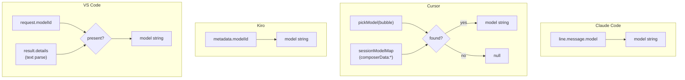

---

## 9. Deduplication & Identity

Messages are deduplicated via a **deterministic ID** computed by `generateMessageId()`:

```
SHA-256( sessionId | role | timestamp | messagePrefix[0:120] ) → first 16 hex chars
```

- The `MessageDB` uses `INSERT OR IGNORE` on this primary key.
- The `StorageWriter` skips overwriting if the output file already exists (`existsSync` check).
- Re-running the pipeline is idempotent at both the file and row level.

---

## 10. Technology Stack

| Layer     | Technology                              | Purpose                                                             |
| --------- | --------------------------------------- | ------------------------------------------------------------------- |
| Runtime   | **Bun**                                 | TypeScript execution, native SQLite via `bun:sqlite`, fast file I/O |
| Language  | **TypeScript** (ESNext, strict)         | Type safety, module system                                          |
| HTTP      | **Express 5**                           | REST API server                                                     |
| Search    | **Fuse.js**                             | Client-side fuzzy text search over messages                         |
| NLP       | **winkNLP** + `wink-eng-lite-web-model` | POS tagging for verb/subject extraction                             |
| Date/Time | **Luxon**                               | DateTime parsing, formatting, ISO round-tripping                    |
| Database  | **bun:sqlite** (in-memory)              | Indexed query store for the API layer                               |
| Hashing   | Node `crypto` (SHA-256)                 | Deterministic message ID generation                                 |
| Terminal  | **Chalk**                               | Colored console output for cache statistics                         |
| Vectors   | **Qdrant** + `@qdrant/js-client-rest`   | Optional semantic vector search (per-harness collections)           |
| Embedding | **OpenAI** via `ai` + `@ai-sdk/openai`  | `text-embedding-3-large` (3072d) for message chunk embeddings       |
| Chunking  | `@langchain/textsplitters`              | Content-aware text splitting (prose vs code separators)             |

---

## 11. Strengths

1. **Unified data model**: All four harness formats converge on the same 19-field `AgentMessage`, making downstream consumers format-agnostic.
2. **Idempotent pipeline**: SHA-based IDs + file-existence checks mean re-runs don't produce duplicates.
3. **Multi-machine support**: The `cc.json` hostname-keying pattern cleanly supports syncing the storage directory across computers.
4. **Defensive parsing**: Every harness reader wraps individual line/file/row parsing in `try/catch`, so one corrupt record doesn't abort the whole ingest.
5. **NLP-derived subjects**: The verb + symbol subject scheme produces human-readable filenames that are both searchable and browsable on disk.
6. **Comment density**: Functions and parameters are consistently documented throughout the codebase.
7. **Project mapping rules**: The explicit + generic + fallback rule cascade provides flexible project routing without hardcoding heuristics.
8. **Raw source archival**: Every processed source file is copied to `{machine}-RAW/`, and each message carries a `source` path for provenance tracing. The raw copier is idempotent — existing files are skipped.
9. **Thinking extraction**: VS Code response items with `kind: "thinking"` are separated into the `rationale` array, preserving model reasoning chains independently from the visible assistant message.
10. **File-based caching**: Source files are cached by comparing size and modification time against their `-RAW` copies. Unchanged files are skipped entirely on subsequent runs, dramatically reducing re-ingestion time for large chat histories.

---

## 12. Architectural Risks & Improvement Areas

### 12.1 ~~In-Memory DB Scalability~~ → **Implemented: On-Disk SQLite**

~~The `MessageDB` loads **every** persisted message into an in-memory SQLite database on startup. For large chat histories (tens of thousands of sessions), this will eventually hit memory constraints and slow down boot time.~~

**✓ Addressed**: Replaced the monolithic `MessageDB` class with a `IMessageStore` interface backed by two implementations: `InMemoryMessageStore` (`:memory:`, opt-in via `IN_MEMORY_DB=true`) and `DiskMessageStore` (on-disk SQLite file with WAL journal mode, the new default). The on-disk store persists across restarts and performs incremental loading — only sessions not yet in the DB are parsed from JSON files, dramatically reducing both startup time and RAM usage. A `createMessageStore()` factory function in `IMessageStore.ts` selects the implementation based on the `IN_MEMORY_DB` environment variable. The DB file path is configured via `databaseFile` in `cc.json` (defaults to `{storage}/cxc-db.sqlite`). Compound indexes on `(sessionId, dateTime)`, `(harness, dateTime)`, `(project, dateTime)`, and `(role, dateTime)` were added for efficient filtered queries. See [`r2udb-database-upgrade.md`](../upgrades/2026-03/r2udb-database-upgrade.md) for the full upgrade plan.

### 12.2 Full-Table Scan for Search

The `/api/search` endpoint calls `messageDB.getAllMessages()` and builds a new Fuse.js index on every request. This is $O(n)$ per search where $n$ is the total message count.

**Recommendation**: Build the Fuse.js index once at startup (or incrementally) and reuse it. Alternatively, use SQLite FTS5 for full-text search.

### 12.3 Dual Config Loaders

There are two config entry points that overlap:
- `config.ts` → `loadConfig()` (async, uses `Bun.file`)
- `CCSettings.ts` → singleton constructor (sync, uses `readFileSync`)

`ContextCore.ts` uses `CCSettings` exclusively; `config.ts`'s `loadConfig()` appears unused in the main pipeline. The harnesses (`cursor.ts`, `kiro.ts`) import `getHostname()` from `config.ts` and `CCSettings` from settings, creating a crosscut dependency.

**Recommendation**: Consolidate into `CCSettings` as the single config source and expose `getHostname()` from there.

### 12.4 Duplicated Utility Code Across Harnesses

`cursor.ts` and `kiro.ts` both implement near-identical functions:
- `normalizeRulePath()` — character-for-character identical
- `getFirstDirAfterPrefix()` — identical
- `asCursorProjectMappingRule()` / `asKiroProjectMappingRule()` — structurally identical
- `asCursorGenericProjectMappingRule()` / `asKiroGenericProjectMappingRule()` — identical
- `loadCursorProjectRuleSet()` / `loadKiroProjectRuleSet()` — same pattern

**Recommendation**: Extract a shared `ProjectResolver` utility module under `src/utils/` that handles rule parsing, path normalization, and project resolution. Both harnesses would delegate to it.

### 12.5 Cursor Harness Complexity

At ~1,300 lines, `cursor.ts` is by far the largest module and handles:
- SQLite access and key discovery
- Bubble record parsing
- Workspace inference via path heuristics
- Project boundary detection
- Request-like session extraction
- Generic JSON tree walking for message-like nodes
- In-memory caching (`PROJECT_ROOT_CACHE`, `WORKSPACE_NORMALIZE_CACHE`)

**Recommendation**: Decompose into sub-modules:
- `cursor/db.ts` — SQLite access, key scanning, row parsing
- `cursor/workspace.ts` — workspace inference, path heuristics, caching
- `cursor/messages.ts` — message extraction from various payload shapes
- `cursor/index.ts` — orchestration and public `readCursorChats()`

### 12.6 ~~No Incremental Ingestion~~ → **Implemented: File-based Caching**

~~The pipeline re-reads **all** harness sources on every run. For large Claude Code projects or Cursor databases with thousands of sessions, this results in redundant I/O.~~

**✓ Addressed**: Implemented file-based caching that compares source file size and modification time against cached copies in the `-RAW` directory. Files that haven't changed since the last run are skipped entirely, avoiding redundant parsing and processing. This applies to all file-based harnesses (ClaudeCode, VSCode, Kiro). See `isSourceFileCached()` in `rawCopier.ts`.

### 12.7 Missing Error Propagation in Pipeline

The `ContextCore.ts` main loop catches errors per-harness but only bumps a counter; there's no structured error log or retry mechanism. The `readHarnessChats` dispatcher silently returns `[]` for unknown harness names.

**Recommendation**: Add a structured error report (harness + path + error message) to the pipeline summary. Consider logging unknown harness names as warnings.

### 12.8 API Has No Authentication

The Express server binds to `localhost:3210` with no auth. While this is reasonable for a local tool, any software on the machine can read all chat history.

**Recommendation**: For the MVP this is acceptable, but document the trust boundary. If network exposure is ever needed, add at minimum a bearer token.

### 12.9 StorageWriter Filename Collisions

The filename format `{YYYY-MM-DD HH-mm} {subject}.json` means two sessions starting in the same minute with the same subject would collide. The current `existsSync` check skips the write, potentially losing the second session's data silently.

**Recommendation**: Append a short disambiguator (session ID prefix or incrementing counter) to the filename when a collision is detected.

### 12.10 Unused AgentMessage Fields

Several `AgentMessage` fields are always initialized empty and never populated by any harness:
- `symbols` — always `[]` (populated later via `SubjectGenerator` but only in `.subject`, not the array)
- `history` — always `[]`
- `tags` — always `[]`

**Recommendation**: Either implement population logic for these fields or remove them from the model to reduce noise. If they're planned for future use, document them as reserved.

---

## 13. Dependency Graph (Imports)

The raw import graph has every harness module individually importing `AgentMessage`, `hashId`, `pathHelpers`, and `types` — which produces a spiderweb that obscures the actual architectural structure. The diagram below groups modules into functional layers, collapsing the shared foundation imports into a single **Domain & Utilities** box. This reveals the true directional flow: **Orchestration** drives the **Harness** and **Storage** layers, which both depend on the shared domain foundation. The **Query Runtime** reads from the domain model and delegates to external libraries for search.

There are no circular dependencies between layers — all arrows flow downward from orchestration toward the domain foundation.

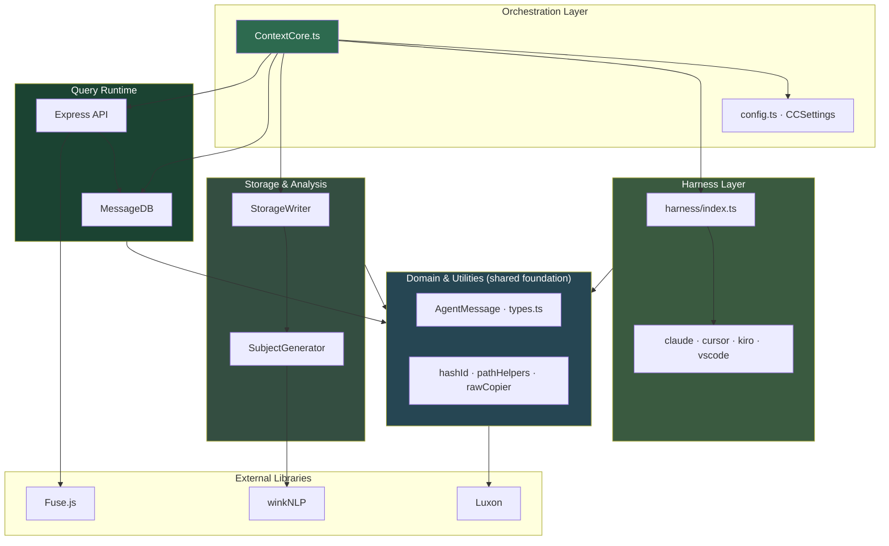

**Layer dependency summary:**

| Layer                  | Depends on                                | Purpose                                     |
| ---------------------- | ----------------------------------------- | ------------------------------------------- |
| **Orchestration**      | Harnesses, Storage, Query Runtime, Domain | Pipeline coordination and startup           |
| **Harness Layer**      | Domain & Utilities                        | Format-specific deserialization (4 readers) |
| **Storage & Analysis** | Domain & Utilities, winkNLP               | Subject generation + JSON persistence       |
| **Query Runtime**      | Domain, Fuse.js                           | In-memory DB + HTTP API                     |
| **Domain & Utilities** | Luxon                                     | Shared model, types, hashing, path helpers  |

---

## 14. Metrics Summary

| Metric                | Value                                                                             |
| --------------------- | --------------------------------------------------------------------------------- |
| Source files          | 17 TypeScript modules                                                             |
| Total lines of code   | ~5,500                                                                            |
| Largest module        | `cursor.ts` (~1,450 lines)                                                        |
| Harness readers       | 6 (Claude Code, Cursor, Kiro, VS Code, OpenCode, Codex)                           |
| API endpoints         | 10                                                                                |
| External dependencies | 6 (`chalk`, `express`, `fuse.js`, `luxon`, `wink-nlp`, `wink-eng-lite-web-model`) |
| Bun-specific APIs     | `bun:sqlite`, `Bun.file`                                                          |
| AgentMessage fields   | 19                                                                                |
| SQLite indexes        | 7 (sessionId, harness, role, model, dateTime, project, subject)                   |

---

## 15. Execution Environment

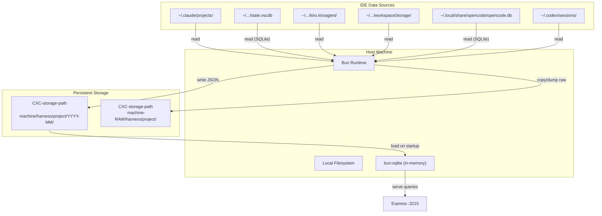

---

## 16. Conclusion

ContextCore is a well-structured MVP that successfully solves the core problem: unifying AI chat history from six different IDE formats into a single queryable store. The `AgentMessage` model is comprehensive, the harness reader pattern is cleanly extensible, and the dual-purpose storage (JSON files + in-memory SQLite) provides both durability and fast queries.

The primary areas for iteration beyond MVP are:
1. **Extracting shared utilities** from the Cursor/Kiro harnesses to reduce duplication.
2. **Decomposing the Cursor harness** which has grown disproportionately complex.
3. **Moving to persistent SQLite or incremental ingestion** to handle scale.
4. **Caching the Fuse.js index** to avoid per-request reconstruction.
5. **Consolidating the dual config loaders** into the `CCSettings` singleton.
