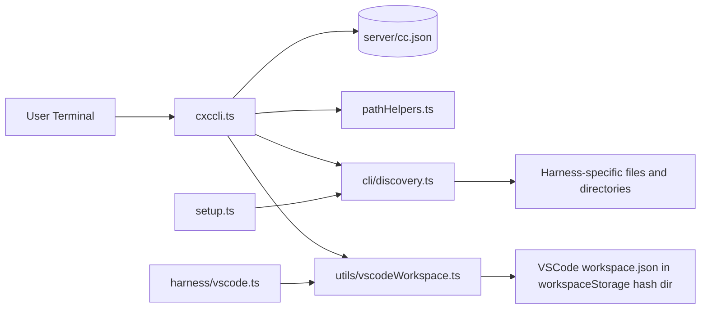
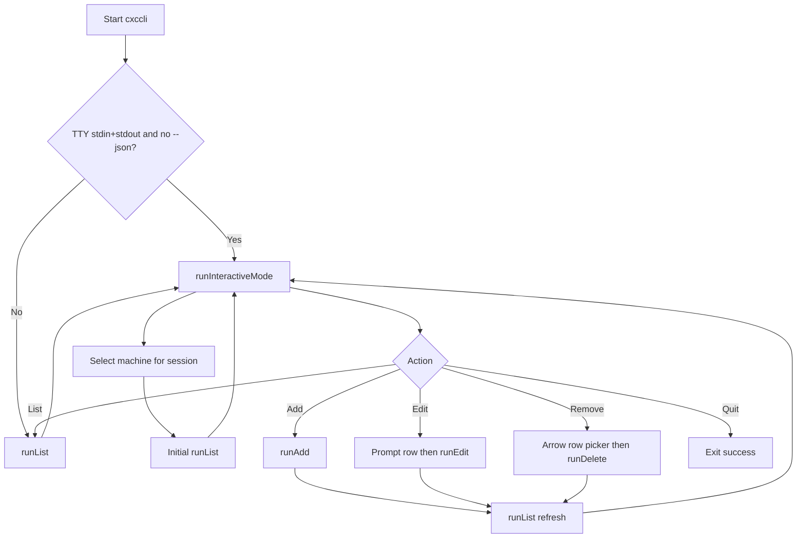
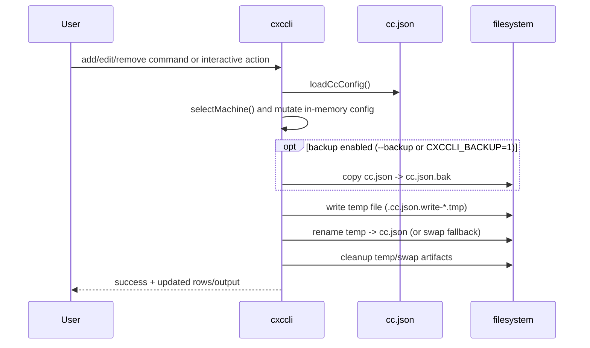

# ContextCore CLI Architecture (`cxccli`)

**Date**: 2026-04-09  
**Target**: `server/src/cxccli.ts`

---

## 1. Purpose

`cxccli` is a machine-scoped `cc.json` editor for harness path management:

- `list`: read-only path inventory with computed project info
- `add`: scanner-driven path discovery and persistence
- `edit <row>`: path update by stable row number
- `delete|remove <row>`: path deletion by stable row number
- `interactive|i`: persistent menu-driven workflow for add/edit/remove/list

It uses:

- `commander` for command/flag parsing, aliases, and help UX
- `@clack/prompts` for interactive text/select/confirm prompts
- raw keypress handling (`readline`) for table-style interactive selection flows

---

## 2. Quick Start

```bash
# default command in a TTY opens interactive mode
bun run cxccli --machine KYLIATHY3

# explicit interactive command
bun run cxccli interactive --machine KYLIATHY3

# list as JSON rows (non-interactive output)
bun run cxccli list --machine KYLIATHY3 --json

# add candidates in non-interactive mode
bun run cxccli add --machine KYLIATHY3 --select 1,3-5 --yes

# edit one row in non-interactive mode
bun run cxccli edit 7 --machine KYLIATHY3 --path "D:\\Codez\\Nexus\\NewProject\\"

# remove one row and write backup first
bun run cxccli remove 7 --machine KYLIATHY3 --yes --backup
```

---

## 3. Interactive Mode Guide

### 3.1 When It Starts

- `bun run cxccli` in a TTY session enters interactive mode by default.
- `bun run cxccli interactive` always requests interactive mode.
- At interactive startup, machine is selected first (unless `--machine` is provided).
- Non-TTY environments (CI/piped output) fall back to `list`.
- `--json` disables interactive mode and runs JSON list output.
- Interactive mode renders the current list immediately on entry.

### 3.2 Controls

- Hotkeys prompt: `L` list, `A` add, `E` edit, `R` remove, `Q` quit
- Hotkeys react immediately (no `Enter` required)
- Press `Enter` on an empty hotkey prompt to open arrow menu
- Arrow menu: use up/down arrows, press `Enter` to execute action
- `R` remove opens a full-table selector immediately (no typed row required)
- In remove mode, the selected table row is highlighted while you move with up/down arrows

### 3.3 Typical Session

1. Run `bun run cxccli` from `server/`.
2. Pick machine for this interactive session (or pass `--machine` to skip picker).
3. Choose action with hotkey or arrow menu.
4. `List`: renders current table for selected machine.
5. `Add`: scans local harness locations, enters table selection mode (up/down + space + enter), confirms write.
6. `Edit`: prompts row number, prompts new path, writes update.
7. `Remove`: enters highlighted table selection mode (up/down + Enter), confirms deletion (default `Yes`), optionally removes empty harness block.
8. After `Add`, `Edit`, or `Remove`, the table auto-refreshes so you see updated rows.
9. `Quit`: exits interactive loop.

`Add` candidate rendering uses the same table columns as `list` (`Configured Path`, `Computed Project`, `Workspace Location`, `Exists`), so VSCode candidates show decoded workspace location when available.
In add selection mode, you can use `Space` to toggle rows, `A` to select all/none, and `Enter` to confirm.

### 3.4 Practical Notes

- Use `--machine <name>` to avoid machine selection prompt.
- Use `--yes` to skip confirmations on mutation commands.
- Use `--backup` or `CXCCLI_BACKUP=1` to write `cc.json.bak` before mutation.

---

## 4. Runtime Interaction Diagrams

### 4.1 CXC Integration Overview



### 4.2 Default Command Routing



### 4.3 Mutation and Atomic Write Path



### 4.4 VSCode Row Enrichment

```mermaid
flowchart TD
    A[VSCode configuredPath from cc.json] --> B[resolveVSCodeWorkspaceMetadata]
    B --> C{workspace.json readable and valid?}
    C -- Yes --> D[Decode file:// workspace URI]
    D --> E[workspacePath + workspaceUri + status=ok]
    C -- Missing --> F[status=missing]
    C -- Malformed --> G[status=malformed]
    E --> H[deriveProjectName(VSCode, workspacePath)]
    F --> I[deriveProjectName(VSCode, configuredPath fallback)]
    G --> I
```

### 4.5 Scanner Candidate Dedupe and Selection Mapping (`add`)

```mermaid
flowchart TD
    A[scanHarnessCandidates(context, DEFAULT_HARNESS_SCANNERS)] --> B[Raw candidates<br/>harness + path + evidence + exists]
    B --> C[buildCandidateRows()<br/>sort by scanner order + path]
    C --> D[Assign display rows 1..N]

    D --> E{Selection source}
    E -- --select spec --> F[parseSelectionSpec()<br/>expand ranges/commas]
    E -- Interactive table selector --> G[promptCandidateSelection()<br/>up/down + space + enter]
    F --> H[Selected rows]
    G --> H

    H --> I[Map rows to candidate objects]
    I --> J[uniqueByPath key<br/>harness::canonicalizePath(path)]
    J --> K[applyAddCandidates()]
    K --> L{Already in cc.json harness paths?}
    L -- Yes --> M[skip duplicate count++]
    L -- No --> N[append path to harness.paths]

    M --> O[updateMachineConfig()]
    N --> O
    O --> P[writeCcConfig() atomic write]
```

---

## 5. Sample `list` Table

```
#  Harness   Configured Path                         Computed Project   Workspace Location          Exists
---------------------------------------------------------------------------------------------------------
1  Cursor    C:\Users\Axonn\...\state.vscdb         global             -                           yes
2  VSCode    C:\Users\Axonn\...\workspaceStorage\.. context-core       d:/Codez/Nexus/context-core yes
3  Codex     C:\Users\Axonn\.codex\sessions\        sessions           -                           yes
```

Notes:

- VSCode rows resolve `workspace.json` (`workspace` or `folder`) and decode URI paths.
- `Computed Project` for VSCode prefers decoded workspace path, then falls back to configured hash path.
- `Workspace Location` is only populated for VSCode rows.

---

## 6. Scanner Extension Contract

Shared scanner contract is defined in [`src/cli/discovery.ts`](../../../../src/cli/discovery.ts):

- `getCandidates(context)`: candidate roots to inspect
- `scan(context)`: discovered rows (`harness/path/evidence`)
- `describe(candidate)`: one-line evidence formatter

### Add a New Scanner

1. Add a `HarnessScanner` implementation in [`src/cli/discovery.ts`](../../../../src/cli/discovery.ts).
2. Keep scanner logic independent and defensive (`warn/continue`, never crash entire run).
3. Use setup-style path conventions: platform-specific getters, evidence checks, no mutation during scan.
4. Register scanner in `DEFAULT_HARNESS_SCANNERS` (order defines `add` grouping).
5. Add or update tests in `src/cli/tests/` for merge, dedupe, and path/project behavior.

---

## 7. Safety Model

- Row mutations are machine-scoped only.
- Reserved key `genericProjectMappingRules` is excluded from row operations.
- Writes are atomic (`temp -> rename`, rollback-safe swap fallback).
- Optional pre-write backup via `--backup` or `CXCCLI_BACKUP=1`.
