# Database Architecture — ContextCore

**Date**: 2026-03-15
**Status**: Active
**Covers**: SQLite storage layer, dual-mode operation, data lifecycle, real-time ingestion

---

## 1. Overview

ContextCore uses a **two-tier storage architecture**: normalized JSON session files on disk serve as the durable source of truth, while an SQLite database (on-disk or in-memory) provides indexed querying for the API, MCP tools, and search. A file system watcher detects live changes and feeds them through an incremental pipeline that writes to both tiers simultaneously.

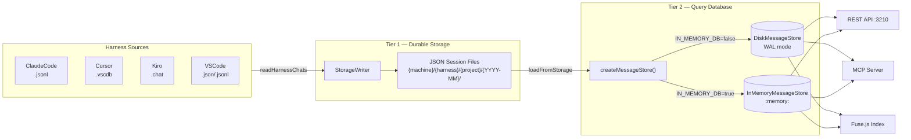

---

## 2. Data Model — AgentMessage

Every chat turn — user prompt, assistant response, tool invocation, system message — is normalized into a single `AgentMessage` entity. This is the atomic unit throughout the entire system.

### 2.1 Fields

| Field        | Type                 | SQLite Type        | Description                                             |
| ------------ | -------------------- | ------------------ | ------------------------------------------------------- |
| `id`         | `string`             | `TEXT PRIMARY KEY` | Unique message identifier (harness-specific hash)       |
| `sessionId`  | `string`             | `TEXT NOT NULL`    | Groups messages into a conversation session             |
| `harness`    | `string`             | `TEXT NOT NULL`    | Source tool: `ClaudeCode`, `Cursor`, `Kiro`, `VSCode`   |
| `machine`    | `string`             | `TEXT NOT NULL`    | Hostname of the machine where the conversation occurred |
| `role`       | `AgentRole`          | `TEXT NOT NULL`    | `user`, `assistant`, `tool`, or `system`                |
| `model`      | `string \| null`     | `TEXT`             | AI model identifier (e.g. `claude-opus-4-6`)            |
| `message`    | `string`             | `TEXT NOT NULL`    | Full message content                                    |
| `subject`    | `string`             | `TEXT NOT NULL`    | Session-level subject line derived at write time        |
| `context`    | `string[]`           | `TEXT NOT NULL`    | JSON array of file paths referenced                     |
| `symbols`    | `string[]`           | `TEXT NOT NULL`    | JSON array of code symbols mentioned                    |
| `history`    | `string[]`           | `TEXT NOT NULL`    | JSON array of conversation history references           |
| `tags`       | `string[]`           | `TEXT NOT NULL`    | JSON array of classification tags                       |
| `project`    | `string`             | `TEXT NOT NULL`    | Project/workspace name                                  |
| `parentId`   | `string \| null`     | `TEXT`             | Parent message ID (for threaded views)                  |
| `tokenUsage` | `TokenUsage \| null` | `TEXT`             | JSON object `{input, output}` or null                   |
| `toolCalls`  | `ToolCall[]`         | `TEXT NOT NULL`    | JSON array of tool invocations                          |
| `rationale`  | `string[]`           | `TEXT NOT NULL`    | JSON array of reasoning steps                           |
| `source`     | `string`             | `TEXT NOT NULL`    | Relative path to original source file                   |
| `dateTime`   | `DateTime`           | `TEXT NOT NULL`    | ISO 8601 timestamp (stored as text, sortable)           |
| `length`     | `number`             | `INTEGER NOT NULL` | Character count of the message content                  |

### 2.2 Serialization

Six fields are stored as JSON-stringified text in SQLite: `context`, `symbols`, `history`, `tags`, `toolCalls`, `rationale`. The `tokenUsage` field is nullable JSON. All other fields are stored as native SQLite text or integer values. Deserialization uses `JSON.parse()` in `mapRowToMessage()`.

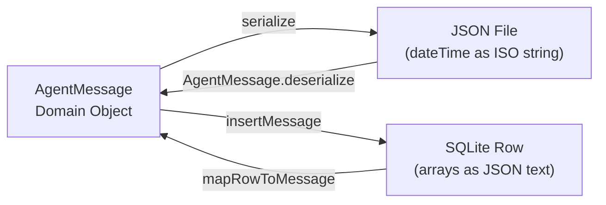

---

## 3. Class Hierarchy

The database layer follows the **Template Method** pattern: an abstract base class implements all shared query logic, while concrete subclasses provide the database instance and can override specific methods for mode-specific optimizations.

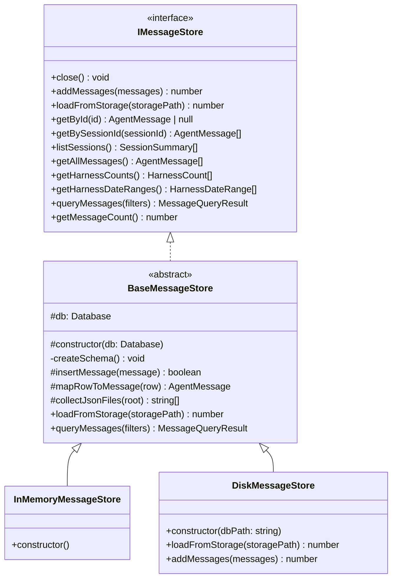

### 3.1 Factory — `createMessageStore()`

Located in `src/db/IMessageStore.ts`. Uses async dynamic `import()` to lazy-load only the required implementation, avoiding unnecessary module initialization:

```typescript
async function createMessageStore(settings: CCSettings): Promise<IMessageStore>
```

Decision tree:
- `IN_MEMORY_DB=true` → `InMemoryMessageStore` (`:memory:`)
- `IN_MEMORY_DB=false` (default) → `DiskMessageStore` (path from `settings.databaseFile`)

### 3.2 InMemoryMessageStore

Three lines of code. Opens `new Database(":memory:")` and delegates everything to `BaseMessageStore`. All data is rebuilt from JSON files on every startup. Suitable for development and testing.

### 3.3 DiskMessageStore

On-disk SQLite with performance-tuned pragmas and two overridden methods:

**Constructor pragmas:**
| Pragma         | Value    | Purpose                                                 |
| -------------- | -------- | ------------------------------------------------------- |
| `journal_mode` | `WAL`    | Concurrent readers + single writer; crash-safe recovery |
| `synchronous`  | `NORMAL` | Balances durability and throughput (safe with WAL)      |
| `cache_size`   | `-64000` | 64 MB page cache (negative = kilobytes)                 |
| `busy_timeout` | `5000`   | Wait up to 5 seconds on write lock contention           |

**`loadFromStorage()` override** — Incremental: pre-fetches existing `sessionId` set from the DB, peeks at each JSON file's first message, skips files for known sessions. Wraps all inserts in a single transaction.

**`addMessages()` override** — Wraps the insert loop in a Bun transaction (`db.transaction(() => { ... })()`) for batch write throughput. Critical for FileWatcher's live ingestion path.

---

## 4. Schema & Index Strategy

### 4.1 Table Definition

Single table: `AgentMessages` with 20 columns. Uses `TEXT PRIMARY KEY` on `id` with `INSERT OR IGNORE` for natural deduplication — the same message ingested twice is silently skipped.

### 4.2 Index Map

```mermaid
graph TD
    subgraph SingleColumn["Single-Column Indexes (8)"]
        I1["idx_agent_sessionId<br/>(sessionId)"]
        I2["idx_agent_harness<br/>(harness)"]
        I3["idx_agent_role<br/>(role)"]
        I4["idx_agent_model<br/>(model)"]
        I5["idx_agent_dateTime<br/>(dateTime)"]
        I6["idx_agent_project<br/>(project)"]
        I7["idx_agent_subject<br/>(subject)"]
        I8["idx_agent_machine<br/>(machine)"]
    end

    subgraph Compound["Compound Indexes (4)"]
        C1["idx_agent_session_dt<br/>(sessionId, dateTime)"]
        C2["idx_agent_harness_dt<br/>(harness, dateTime)"]
        C3["idx_agent_project_dt<br/>(project, dateTime)"]
        C4["idx_agent_role_dt<br/>(role, dateTime)"]
    end

    subgraph Queries["Query Coverage"]
        Q1["getBySessionId()"]
        Q2["listSessions()"]
        Q3["queryMessages(harness + date range)"]
        Q4["queryMessages(project + date range)"]
        Q5["queryMessages(role + date range)"]
        Q6["getAllMessages() ORDER BY dateTime"]
    end

    C1 --> Q1
    C1 --> Q2
    C2 --> Q3
    C3 --> Q4
    C4 --> Q5
    I5 --> Q6
```

### 4.3 Why Compound Indexes?

`queryMessages()` builds dynamic `WHERE` clauses combining 1–3 filter columns with `dateTime` range predicates and `ORDER BY dateTime DESC`. Without compound indexes, SQLite must full-scan the table and sort in a temporary B-tree. A `(filter_col, dateTime)` compound lets SQLite seek to the filter value, then range-scan in index order — avoiding both the full scan and the sort.

The same compound indexes are created in both modes. They're harmless in-memory (slightly more RAM) but essential for on-disk performance at scale.

---

## 5. Data Lifecycle

### 5.1 Startup Pipeline

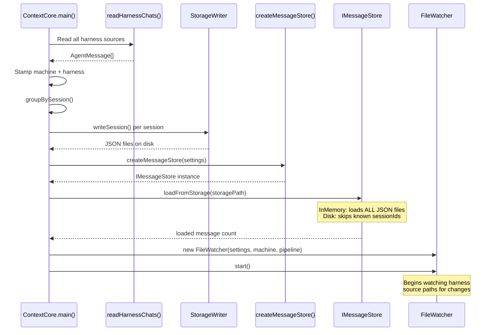

### 5.2 Live Ingestion Pipeline (FileWatcher)

After startup completes, the `FileWatcher` monitors all configured harness source paths using `fs.watch()`. When a change is detected, it flows through the `IncrementalPipeline` to update both storage tiers.

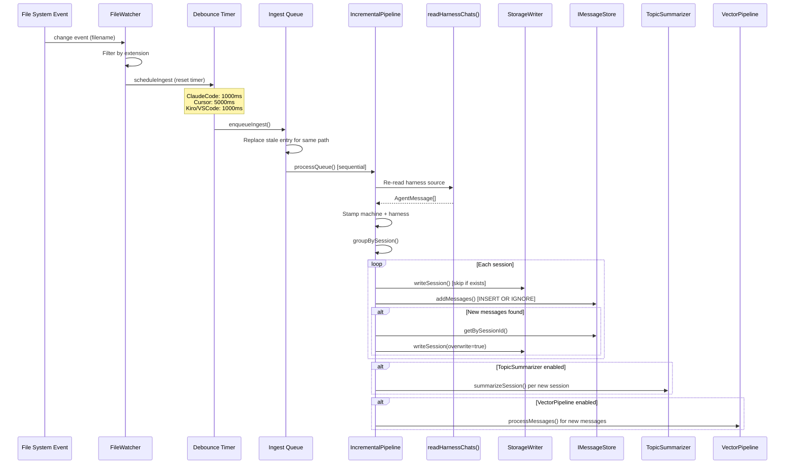

### 5.3 Debounce & Queue Mechanics

The FileWatcher uses two layers of protection against event storms:

1. **Per-path debounce**: Each `(harnessName, path)` pair has its own timer. Rapid successive events reset the timer, collapsing into a single ingest call after activity stops.

2. **Sequential queue**: A re-entrancy guard (`isProcessingQueue`) ensures only one ingest runs at a time. New items are queued and processed in order. If a path fires again while processing, the stale queue entry is replaced with the latest.

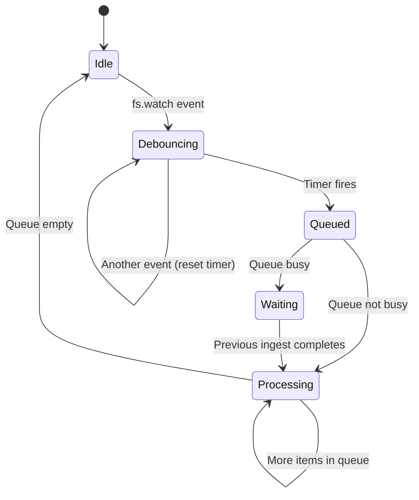

---

## 6. Dual-Mode Operation

### 6.1 Configuration

| Setting        | Source    | Default                   | Effect                                                 |
| -------------- | --------- | ------------------------- | ------------------------------------------------------ |
| `IN_MEMORY_DB` | `.env`    | `false`                   | `true` = volatile `:memory:`, `false` = on-disk SQLite |
| `databaseFile` | `cc.json` | `{storage}/cxc-db.sqlite` | Path for on-disk database file                         |

### 6.2 Behavioral Differences

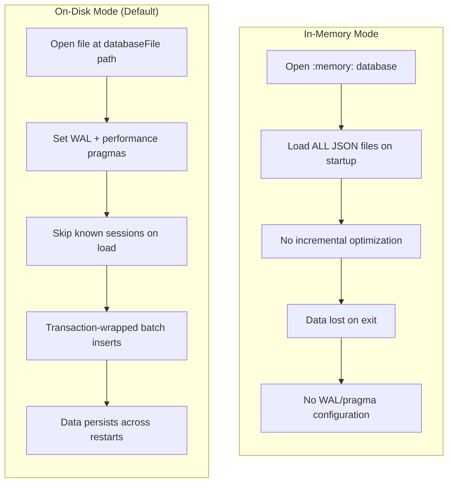

| Aspect              | In-Memory                          | On-Disk                                  |
| ------------------- | ---------------------------------- | ---------------------------------------- |
| Startup speed       | O(all messages) every time         | O(new messages only) after first run     |
| RAM usage           | All data + SQLite pages in RAM     | OS page cache manages hot data           |
| Data durability     | None — rebuilt from JSON each time | Persistent, WAL-protected                |
| Concurrent access   | Single process only                | Single writer + concurrent readers (WAL) |
| `addMessages()`     | Per-row insert                     | Transaction-wrapped batch                |
| `loadFromStorage()` | Full load                          | Incremental (skip known sessions)        |

### 6.3 WAL File Sidecar

On-disk mode creates two sidecar files alongside the main database:

```
cxc-db.sqlite          <- Main database file
cxc-db.sqlite-wal      <- Write-Ahead Log (auto-checkpointed)
cxc-db.sqlite-shm      <- Shared memory for WAL coordination
```

These are managed automatically by SQLite. If the process crashes mid-write, WAL replay on the next open recovers the database to a consistent state.

---

## 7. Query Patterns

### 7.1 API and MCP Consumers

The REST API and MCP tools access the database through the `IMessageStore` interface. All query methods are implemented in `BaseMessageStore` and shared across both modes.

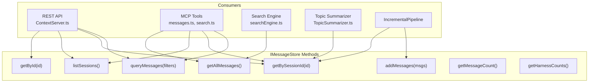

### 7.2 Dynamic Query Builder — `queryMessages()`

The most complex query method. Builds a `WHERE` clause dynamically from the filters object:

```sql
SELECT * FROM AgentMessages
  WHERE harness = ?          -- optional
    AND role = ?             -- optional
    AND model = ?            -- optional
    AND project = ?          -- optional
    AND subject = ?          -- optional
    AND dateTime >= ?        -- optional (from)
    AND dateTime <= ?        -- optional (to)
  ORDER BY dateTime DESC
  LIMIT ? OFFSET ?
```

A companion `COUNT(*)` query runs with the same filters for pagination metadata. The compound indexes cover the most common filter+dateTime combinations so SQLite can avoid full table scans.

---

## 8. Deduplication Strategy

Deduplication operates at three levels:

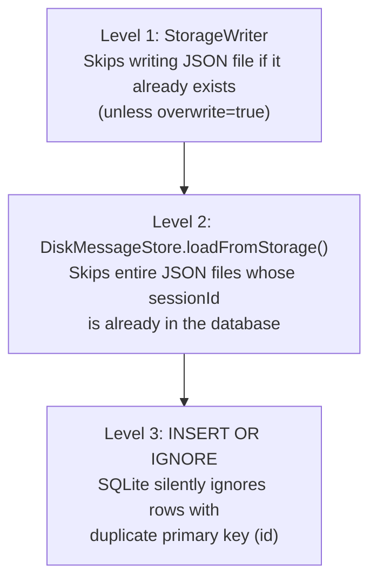

This layered approach means the system is idempotent: re-running the full pipeline against the same source data produces no duplicates and minimal wasted work.

---

## 9. Consumer Wiring

All files that interact with the database reference only the `IMessageStore` interface. The concrete implementation is resolved once at startup via the factory.

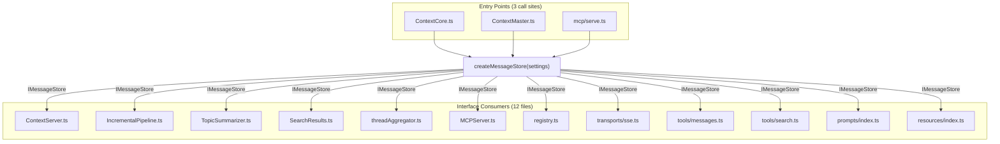

---

## 10. FileWatcher Integration with Database

The FileWatcher does **not** interact with the database directly. It only knows about `IncrementalPipeline`, which handles all storage and database writes. This keeps the watcher focused on event detection and debouncing.

The FileWatcher operates in **two modes simultaneously**:

- **Harness mode** — watches local IDE source files and runs the full pipeline: harness reader → StorageWriter → MessageDB → AI/Vector.
- **Remote storage mode** — watches `{storage}/OtherMachine/` directories for already-processed `.json` session files arriving via file sync. These skip the harness reader and StorageWriter entirely, going straight to MessageDB → AI/Vector.

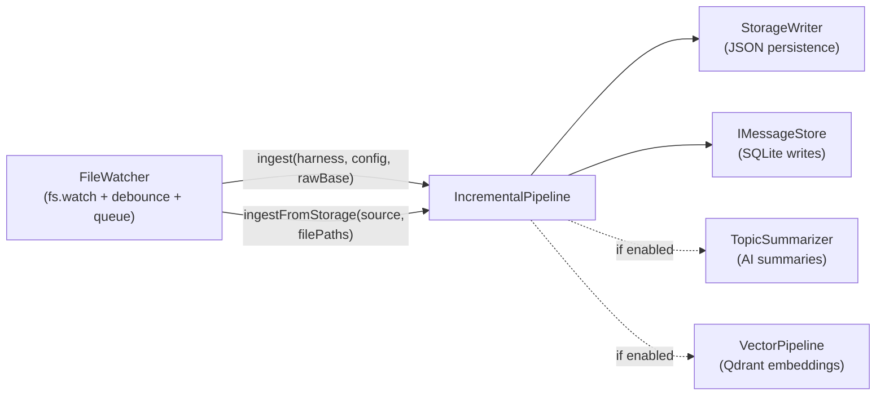

The `IncrementalPipeline.ingest()` method mirrors the startup pipeline's logic:

1. Re-read harness source files via `readHarnessChats()`
2. Stamp `machine` and `harness` on each message, relativize `source` paths
3. Group messages by `sessionId::project`
4. For each session:
   - Write to `StorageWriter` (skipped if file exists)
   - Insert into database via `addMessages()` (duplicates ignored)
   - If new messages were inserted, force-overwrite the storage file to capture the full session
5. Run AI topic summarization for new sessions (if `TopicSummarizer` is available)
6. Generate vector embeddings for new messages (if `VectorPipeline` is available)

The `IncrementalPipeline.ingestFromStorage()` method handles remote files with a shorter pipeline: parse JSON → `AgentMessage.deserialize()` → `addMessages()` → summarize → embed. Truncated files from in-progress syncs are caught by `JSON.parse` failure and retried on the next event.

The `DiskMessageStore.addMessages()` wraps inserts in a transaction, so a batch of messages from a single session is committed atomically.

For the full FileWatcher architecture, see [`archi-file-watcher.md`](archi-file-watcher.md).

---

## 11. Concurrency Model

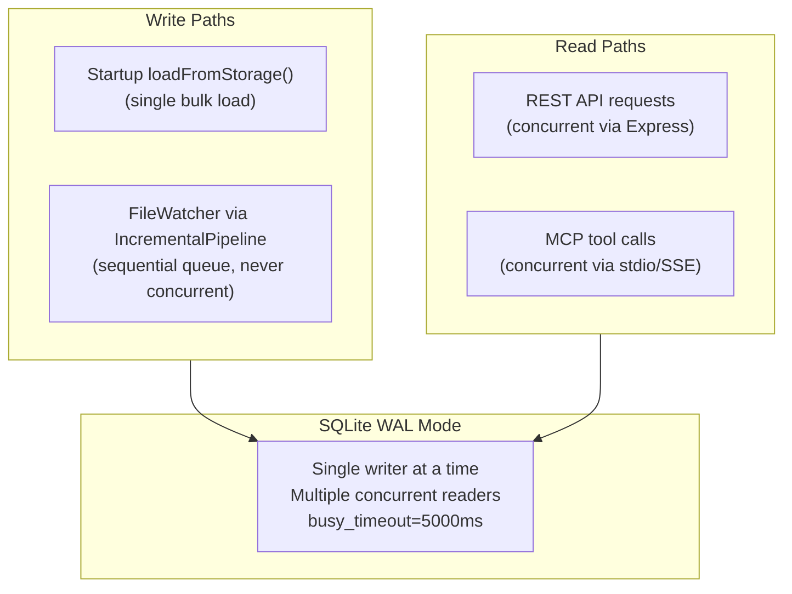

Key guarantees:

- **No concurrent writes**: The FileWatcher's sequential queue ensures at most one ingest runs at a time. The startup pipeline completes before the FileWatcher starts.
- **Readers never block writers**: WAL mode allows concurrent reads while a write transaction is active.
- **Lock contention handled**: If a rare timing conflict occurs (e.g., API read during FileWatcher write), the `busy_timeout=5000` pragma causes SQLite to retry for up to 5 seconds instead of failing immediately.

---

## 12. Disk Storage Layout

### 12.1 JSON Session Files (Tier 1)

```
{storageRoot}/
    {machine}/                          e.g. "DEVBOX2"
    {harness}/                        e.g. "ClaudeCode"
      {project}/                      e.g. "context-core"
        {YYYY-MM}/                    e.g. "2026-03"
          {YYYY-MM-DD HH-mm} {subject}.json
```

Each JSON file contains an array of serialized `AgentMessage` objects for one session. The filename encodes the session's start timestamp and a subject derived from message content (5 verbs + 5 symbols).

### 12.2 SQLite Database (Tier 2)

```
{storage}/cxc-db.sqlite               Main database (configurable via cc.json)
{storage}/cxc-db.sqlite-wal           Write-Ahead Log (auto-managed)
{storage}/cxc-db.sqlite-shm           Shared memory (auto-managed)
```

### 12.3 Size Estimates

| Corpus Size  | JSON Files            | SQLite File | RAM (In-Memory) |
| ------------ | --------------------- | ----------- | --------------- |
| 10,000 msgs  | ~200 files, ~40 MB    | ~40 MB      | ~80 MB          |
| 50,000 msgs  | ~1,000 files, ~200 MB | ~200 MB     | ~400 MB         |
| 100,000 msgs | ~2,000 files, ~400 MB | ~400 MB     | ~800 MB         |

On-disk mode keeps RAM usage constant regardless of corpus size — only the SQLite page cache (64 MB) and active query results are in memory.

---

## 13. Search Integration

The database feeds two search systems, both initialized at startup:

```mermaid
flowchart TD
    DB["IMessageStore"]
    DB -->|getAllMessages()| FUSE["Fuse.js<br/>In-memory fuzzy search"]
    DB -->|getAllMessages()| QDRANT["VectorPipeline<br/>Qdrant embeddings"]

    FUSE --> MERGE["SearchResults.merge()"]
    QDRANT --> MERGE
    MERGE --> API["GET /api/search?q=..."]
```

- **Fuse.js**: Built from `getAllMessages()` at startup. Provides fuzzy text matching across `message`, `subject`, `symbols`, `tags`, and `context` fields. Results scored with configurable weights.
- **Qdrant** (optional): Vector embeddings generated from message chunks. Provides semantic similarity search. Results merged with Fuse.js scores.

Neither search system is backed by the database for lookups — they maintain independent indexes. The database is the source from which these indexes are built.

---

## 14. Future Considerations

1. **SQLite FTS5**: The Fuse.js in-memory index could be replaced with SQLite's built-in full-text search extension. This would eliminate the need to load all messages into RAM for search and would scale better with corpus size.

2. **Partial index for recent data**: A partial index like `WHERE dateTime >= '2026-01-01'` could accelerate "recent messages" queries without indexing the full history.

3. **Vacuum scheduling**: Long-running on-disk databases may benefit from periodic `VACUUM` to reclaim space from deleted/updated rows. This is not currently needed since the schema is append-only.

4. **Multi-process access**: Running multiple ContextCore instances against the same database file is currently unsupported. If needed, a connection pool or advisory locking scheme would be required.
