# File System Watcher Architecture — ContextCore

**Date**: 2026-03-16
**Status**: Active
**Covers**: FileWatcher, IncrementalPipeline, dual-mode watching (harness + remote storage), debounce strategy, queue serialization
**Source files**: `src/watcher/FileWatcher.ts`, `src/watcher/IncrementalPipeline.ts`

---

## 1. Overview

After the startup pipeline completes, ContextCore hands off to a **live file system watcher** that detects new or modified chat data and feeds it through an incremental pipeline — updating both the JSON storage tier and the SQLite query database without restarting the process.

The watcher operates in **two modes simultaneously**:

| Mode               | What it watches                                               | Pipeline                                                     | Debounce           |
| ------------------ | ------------------------------------------------------------- | ------------------------------------------------------------ | ------------------ |
| **Harness**        | Local IDE source files (`.jsonl`, `.vscdb`, `.chat`, `.json`) | Full: harness reader → StorageWriter → MessageDB → AI/Vector | 1s (5s for Cursor) |
| **Remote Storage** | Already-processed `.json` session files from other machines   | Short: parse JSON → MessageDB → AI/Vector                    | 3s                 |

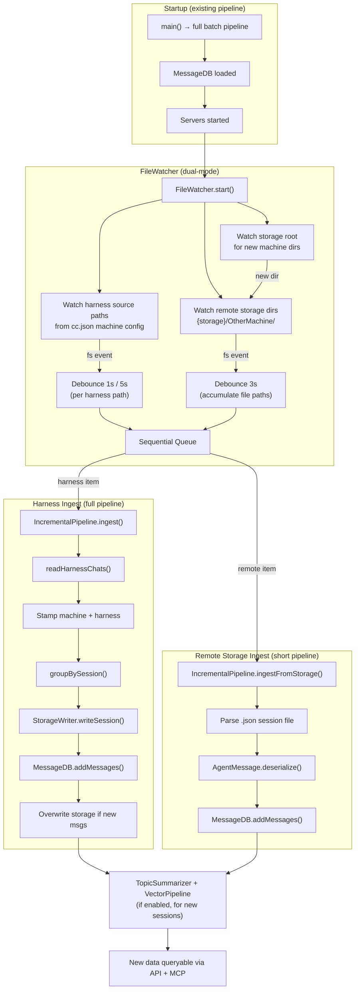

---

## 2. Module Structure

### 2.1 Class Diagram

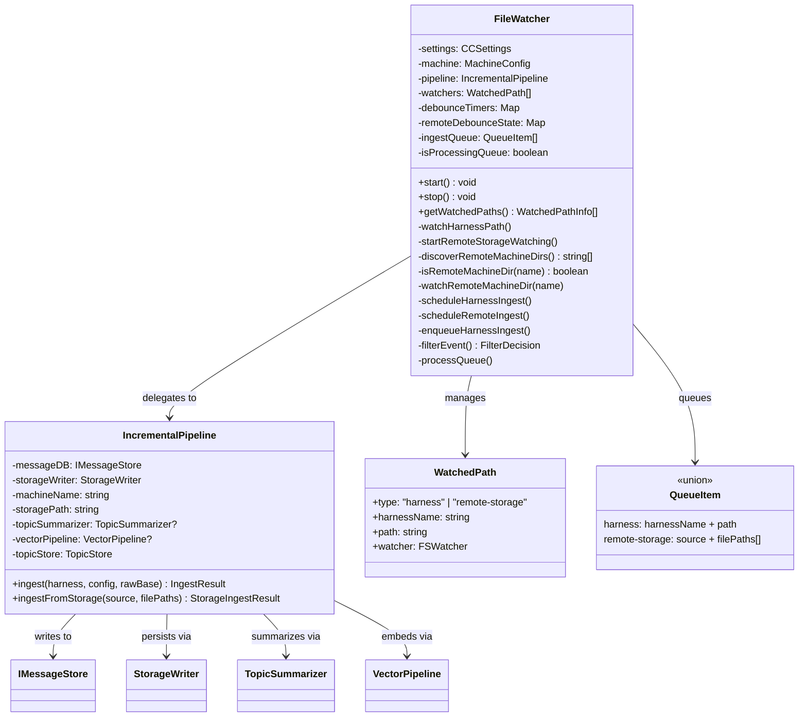

### 2.2 File Inventory

| File                                 | Responsibility                                                                                                               |
| ------------------------------------ | ---------------------------------------------------------------------------------------------------------------------------- |
| `src/watcher/FileWatcher.ts`         | Event detection, extension filtering, debouncing, queue management, remote machine dir discovery                             |
| `src/watcher/IncrementalPipeline.ts` | Orchestrates downstream writes: harness re-read or JSON parse → StorageWriter → MessageDB → TopicSummarizer → VectorPipeline |

---

## 3. Watch Mode: Harness (Local IDE Sources)

### 3.1 What Gets Watched

The harness watcher reads the current machine's config from `cc.json` and creates one `fs.watch()` per configured path:

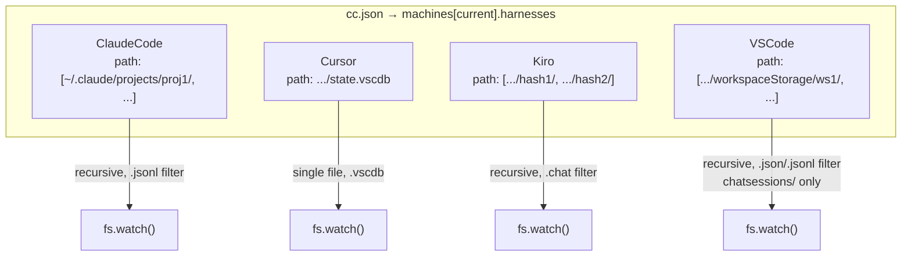

### 3.2 Extension Filtering

Each harness type has a strict extension allowlist. Events for files that don't match are silently counted (for diagnostics) and discarded.

| Harness        | Accepted Extensions | Watch Mode          | Special Filtering                                      |
| -------------- | ------------------- | ------------------- | ------------------------------------------------------ |
| **ClaudeCode** | `.jsonl`            | Recursive directory | —                                                      |
| **Cursor**     | `.vscdb`            | Single file         | All events accepted (single DB file)                   |
| **Kiro**       | `.chat`             | Recursive directory | —                                                      |
| **VSCode**     | `.json`, `.jsonl`   | Recursive directory | Must be under `chatsessions/`; rejects `.tmp`, `.lock` |

### 3.3 Harness Ingest Pipeline

When a debounced harness event fires, `IncrementalPipeline.ingest()` runs the full pipeline:

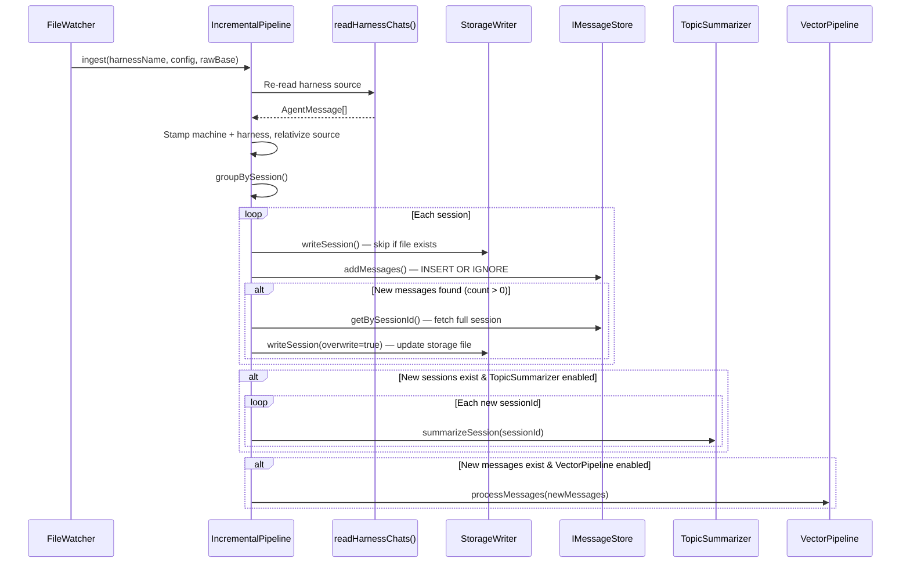

The force-overwrite step is critical: when an active conversation grows (new messages appended to a `.jsonl` file), the storage JSON file from a prior run already exists and would be skipped by `writeSession()`. After `addMessages()` detects new rows, the pipeline re-fetches the full session from the DB and overwrites the storage file to capture the complete conversation.

---

## 4. Watch Mode: Remote Storage (Cross-Machine Sync)

### 4.1 Problem & Motivation

ContextCore is designed for multi-machine use — the same `cc.json` lists multiple machines, and the shared storage directory (`<CXC-storage-path>`) is synced across them (via OneDrive, rsync, Syncthing, etc.). When DEVBOX2 produces new session files and they arrive on DEVBOX1 via file sync, the local DB needs to pick them up without a restart.

### 4.2 Storage Directory Layout

```
{storage}/
    ├── DEVBOX1/                ← current machine → harness watcher handles this
    ├── DEVBOX1-RAW/            ← raw archive → SKIP
    ├── DEVBOX2/                ← remote machine → WATCH recursively
  │   ├── ClaudeCode/
  │   │   └── AXON/
  │   │       └── 2026-03/
  │   │           └── 2026-03-15 14-22 verb-subject.json   ← session file
  │   ├── Cursor/
  │   ├── Kiro/
  │   └── VSCode/
    ├── DEVBOX2-RAW/            ← raw archive → SKIP
  ├── zecache/                ← internal → SKIP
  ├── .settings/             ← internal → SKIP
  └── cxc-db.sqlite           ← database file → SKIP
```

### 4.3 Directory Discovery

On startup, `discoverRemoteMachineDirs()` scans top-level entries in `{storage}/` and applies three exclusion rules:

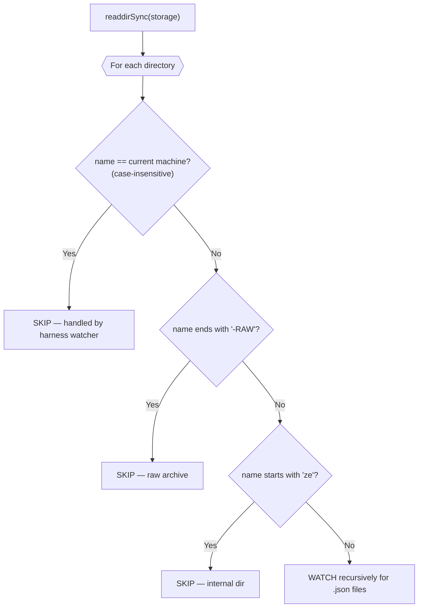

A **storage root watcher** (non-recursive) also monitors `{storage}/` itself. When a new top-level directory appears (e.g., a third machine starts syncing), and it passes the same filter rules, a recursive watcher is dynamically added.

### 4.4 Remote Storage Ingest Pipeline

Remote session files are already the output of `StorageWriter` on the originating machine — they contain serialized `AgentMessage[]` arrays. The pipeline skips harness reading and storage writing entirely:

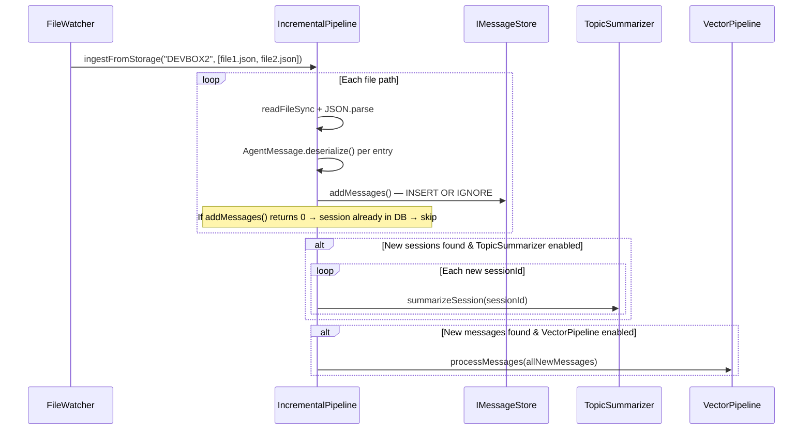

**Key differences from harness ingest:**

| Aspect                   | Harness Ingest                                     | Remote Storage Ingest                       |
| ------------------------ | -------------------------------------------------- | ------------------------------------------- |
| Input                    | Raw IDE source files (`.jsonl`, `.vscdb`, `.chat`) | Pre-processed `.json` session files         |
| Harness reader           | Yes — `readHarnessChats()`                         | No — direct `JSON.parse`                    |
| Machine/harness stamping | Yes — stamps current machine                       | No — already stamped by originating machine |
| StorageWriter            | Yes — writes + optional overwrite                  | No — file IS the storage artifact           |
| Raw archive (`-RAW`)     | Yes — copies source to `-RAW` dir                  | No — no source to archive                   |
| Deduplication            | `StorageWriter` skip + `INSERT OR IGNORE`          | `INSERT OR IGNORE` only                     |

### 4.5 Partial File Handling

File sync tools may deliver files in chunks, producing temporarily truncated JSON. The pipeline catches `JSON.parse` failures silently and does not delete or move the file. The next `fs.watch` event (when the sync tool finishes writing) will retry the file.

---

## 5. Debounce & Queue Architecture

### 5.1 Why Debounce?

IDE tools and file sync services produce rapid bursts of file system events. Without debouncing, a single user typing in Claude Code would trigger dozens of re-ingestions per second as the `.jsonl` file gets flushed repeatedly.

### 5.2 Debounce Configuration

| Source            | Debounce Delay | Rationale                                                           |
| ----------------- | -------------- | ------------------------------------------------------------------- |
| ClaudeCode        | 1,000 ms       | Moderate write frequency; `.jsonl` appends                          |
| Cursor            | 5,000 ms       | Single SQLite DB receives very rapid flushes during active sessions |
| Kiro              | 1,000 ms       | Low write frequency; single `.chat` file per session                |
| VSCode            | 1,000 ms       | Moderate; only `chatsessions/` subdirectory matters                 |
| Remote Storage    | 3,000 ms       | File sync tools deliver multiple files in bursts                    |
| Default (unknown) | 2,000 ms       | Fallback for any future harness type                                |

### 5.3 Two Debounce Strategies

The watcher uses two distinct debounce mechanisms because they serve different purposes:

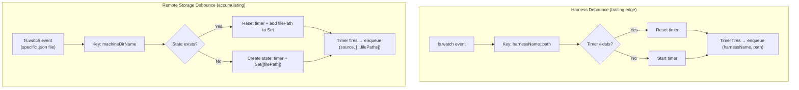

**Harness debounce** uses a simple trailing-edge timer keyed by `harnessName::path`. Only the latest trigger matters — the harness reader will re-scan the full path regardless.

**Remote storage debounce** accumulates file paths in a `Set` during the window. When the timer fires, all accumulated paths are passed to `ingestFromStorage()` as a single batch. This is necessary because the remote pipeline processes individual files (not directory-level re-scans).

### 5.4 Sequential Queue

Both debounce mechanisms feed into a shared sequential queue with a re-entrancy guard:

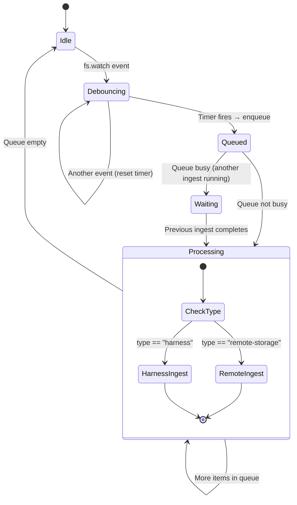

The queue guarantees:

1. **At most one `ingest()` or `ingestFromStorage()` runs at a time** — prevents concurrent writes to MessageDB and concurrent AI API calls.
2. **Stale entries are replaced** — if a harness path fires again while its previous entry is still queued, the old entry is removed (only the latest state matters). For remote storage, file paths from pending entries are merged.
3. **Non-blocking** — the queue drains via an async IIFE; the event loop remains responsive to new `fs.watch` events.

### 5.5 Queue Item Types

```typescript
type QueueItem =
    | { type: "harness"; harnessName: string; path: string }
    | { type: "remote-storage"; source: string; filePaths: string[] };
```

The discriminated union allows `processQueue()` to dispatch to the correct pipeline method:

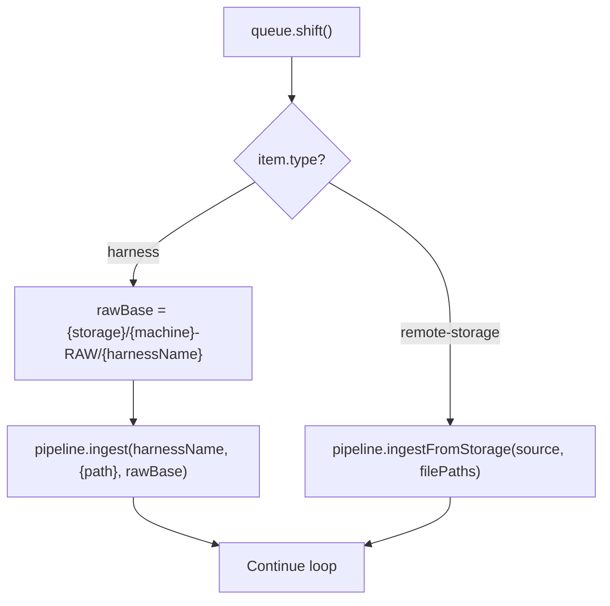

---

## 6. Integration with cc.json

The `FileWatcher` derives all its watch targets from two sources in `cc.json`:

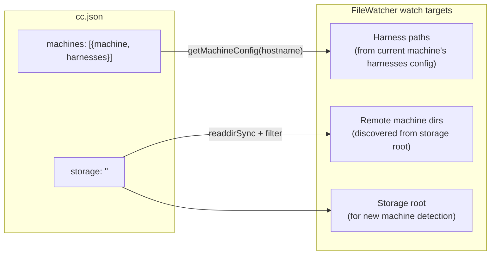

**Harness paths** come directly from the matched `MachineConfig.harnesses` entries — each harness has one or more `path` values pointing to the IDE's raw chat data.

**Remote machine dirs** are NOT listed in `cc.json`. They are discovered dynamically by scanning the `storage` root and filtering out the current machine, `-RAW` archives, and `ze*` internal directories. This means the watcher automatically picks up sessions from any machine that syncs its storage output, with no configuration required.

---

## 7. Integration with the Database

The FileWatcher does **not** interact with the database directly. It delegates all writes to `IncrementalPipeline`, which holds references to `IMessageStore`, `StorageWriter`, `TopicSummarizer`, and `VectorPipeline`.

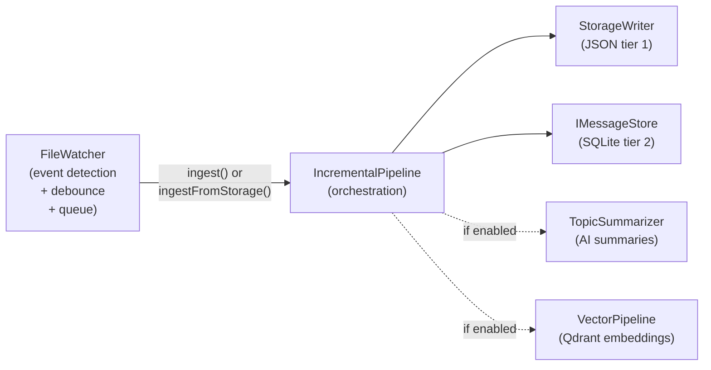

### 7.1 Deduplication at the Database Level

Both ingest paths rely on `IMessageStore.addMessages()`, which uses `INSERT OR IGNORE` on the `id` primary key. This means:

- Re-syncing the same file from a remote machine produces zero duplicates.
- Re-reading a harness path with unchanged sessions inserts zero new rows.
- The `addMessages()` return value (count of actually-inserted rows) is the signal for whether downstream work (summarization, embedding) is needed.

### 7.2 Write Concurrency Model

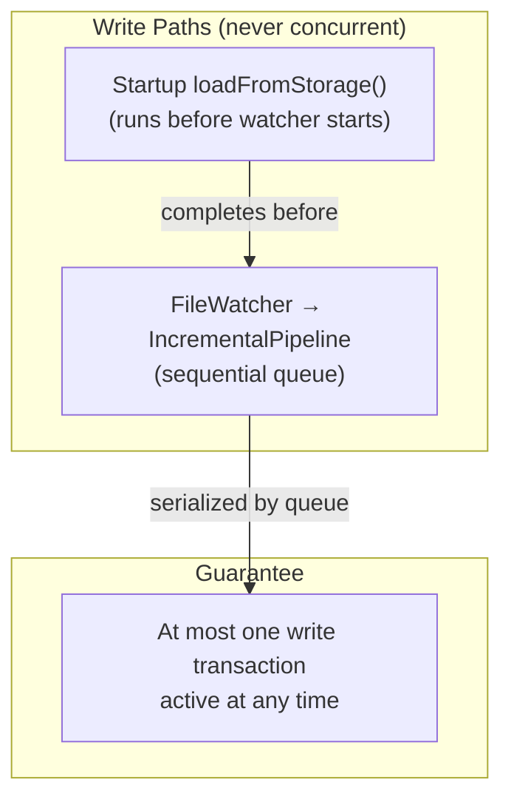

The startup pipeline must complete before `FileWatcher.start()` is called (enforced by sequential `await` in `ContextCore.main()`). After startup, the queue's re-entrancy guard ensures only one ingest runs at a time. Combined with SQLite WAL mode and `busy_timeout=5000ms`, this eliminates write contention.

---

## 8. Lifecycle Management

### 8.1 Startup Sequence

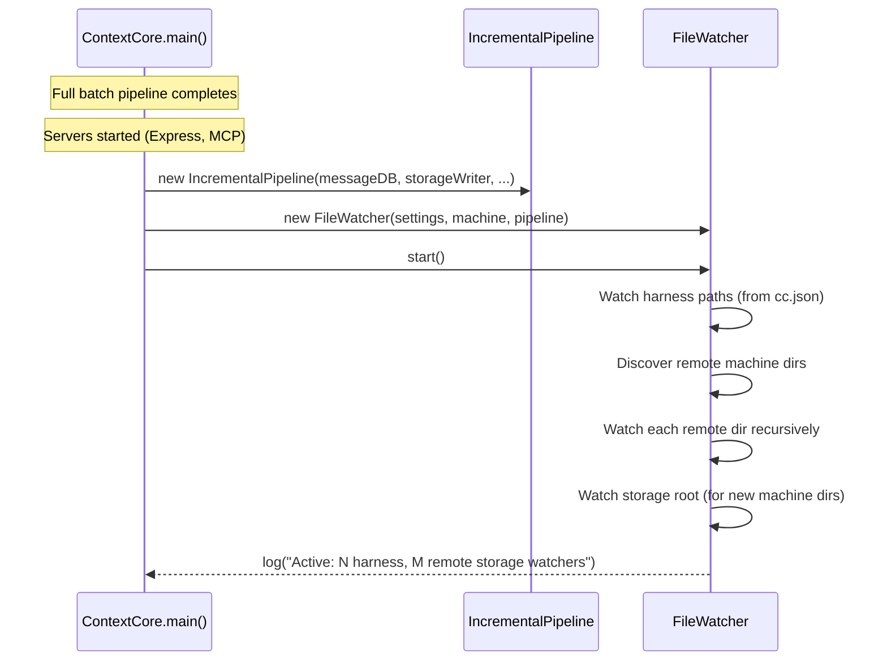

### 8.2 Graceful Shutdown

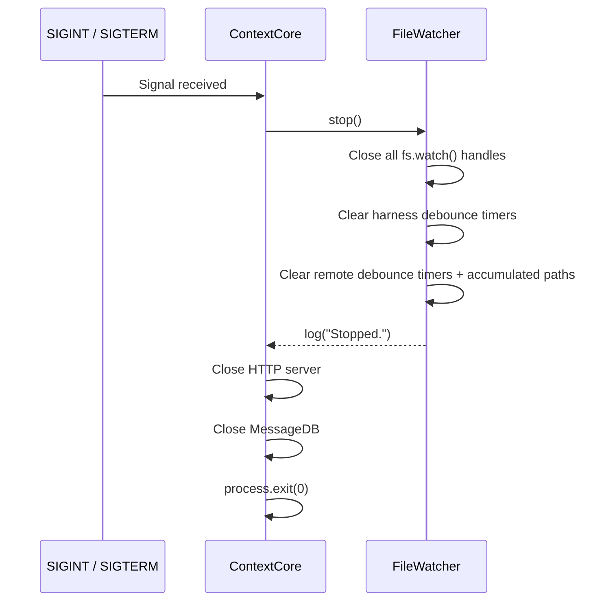

`stop()` does not drain the queue — pending ingest jobs are abandoned on shutdown. This is safe because all data sources are durable (files on disk); the next startup will re-process anything that was missed.

---

## 9. Watcher Inventory (Typical Deployment)

For a machine named `DEVBOX1` with the standard `cc.json`, the watcher creates:

| #   | Type           | Target                                                   | Recursive        | Extension Filter  | Debounce |
| --- | -------------- | -------------------------------------------------------- | ---------------- | ----------------- | -------- |
| 1   | harness        | `~/.claude/projects/d--Codez-Nexus-Evo-NexusPlatform/`   | Yes              | `.jsonl`          | 1s       |
| 2   | harness        | `~/.claude/projects/d--Codez-Nexus-AXON/`                | Yes              | `.jsonl`          | 1s       |
| 3   | harness        | `~/.claude/projects/d--Codez-Nexus-Reach2-context-core/` | Yes              | `.jsonl`          | 1s       |
| 4   | harness        | `.../kiro.kiroagent/1582a.../`                           | Yes              | `.chat`           | 1s       |
| 5   | harness        | `.../kiro.kiroagent/87db.../`                            | Yes              | `.chat`           | 1s       |
| 6   | harness        | `.../kiro.kiroagent/9daa.../`                            | Yes              | `.chat`           | 1s       |
| 7   | harness        | `.../workspaceStorage/d408.../`                          | Yes              | `.json`, `.jsonl` | 1s       |
| 8   | harness        | `.../workspaceStorage/32f5.../`                          | Yes              | `.json`, `.jsonl` | 1s       |
| 9   | harness        | `.../workspaceStorage/aee8.../`                          | Yes              | `.json`, `.jsonl` | 1s       |
| 10  | harness        | `.../Cursor/.../state.vscdb`                             | No (single file) | `.vscdb`          | 5s       |
| 11  | remote-storage | `{storage}/DEVBOX2/`                                     | Yes              | `.json`           | 3s       |
| 12  | remote-storage | `{storage}/` (root)                                      | No               | directories only  | —        |

Total: 10 harness watchers + 2 remote storage watchers.

---

## 10. Error Handling

### 10.1 Watcher Creation Failures

If `fs.watch()` throws (e.g., path doesn't exist, permission denied), the error is logged as a warning and that path is skipped. Other paths continue to be watched.

### 10.2 Ingest Failures

Each ingest call in `processQueue()` is wrapped in try/catch. A failure in one harness or remote machine does not block subsequent queue items.

### 10.3 Individual Session Failures

Within `IncrementalPipeline.ingest()`, each session group is wrapped in its own try/catch. A malformed session does not abort the entire harness re-read.

### 10.4 Truncated Remote Files

`ingestFromStorage()` catches `JSON.parse` failures silently. Truncated files (from in-progress sync) are skipped and will be retried when the sync completes and `fs.watch` fires again.

### 10.5 AI/Vector Failures

Topic summarization and vector embedding errors are caught per-session and per-batch respectively. Failures are logged but do not prevent the DB from being updated.

---

## 11. Data Flow Summary

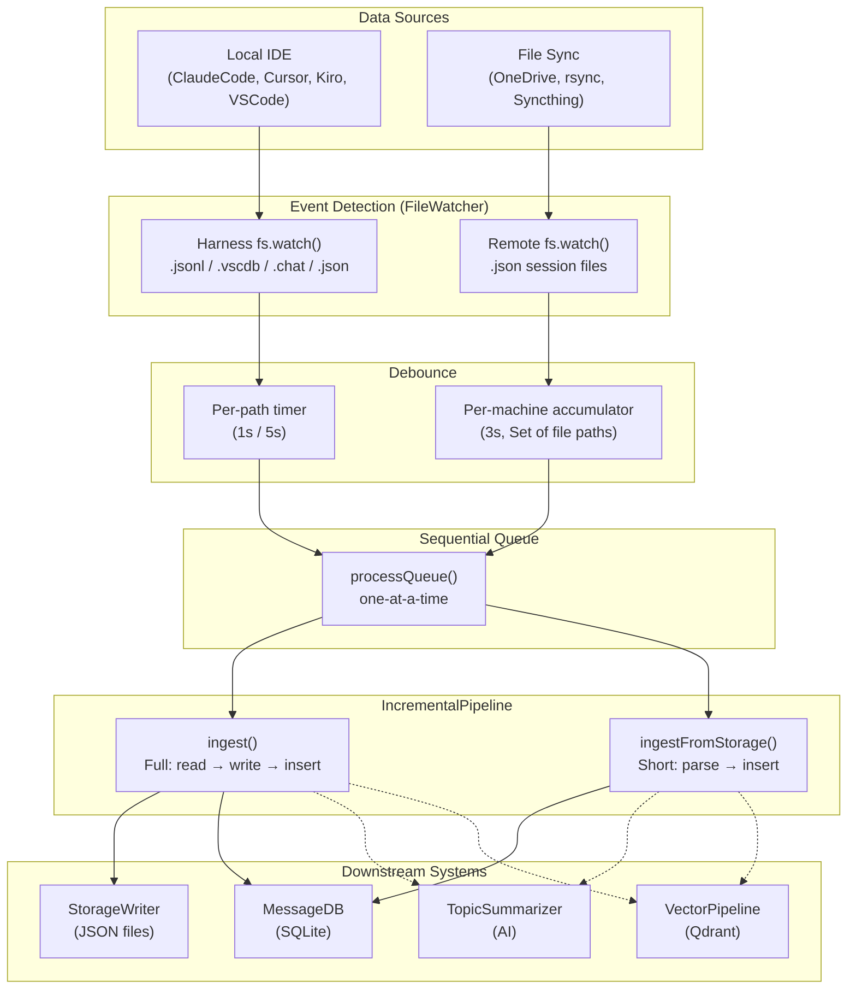

---

## 12. Future Considerations

1. **Watcher health checks**: `fs.watch()` can silently die on some platforms (network drives, OS inotify limits). A periodic health check (e.g., every 60s) could verify watchers are still active and re-create dead ones.

2. **Bi-directional awareness**: Currently the watcher only receives data. If ContextCore ever needs to push local sessions to other machines, that responsibility belongs to the file sync tool — not the watcher.

3. **Config hot-reload**: Changes to `cc.json` (new harness paths, new machines) still require a restart. The storage root watcher handles new machine dirs dynamically, but new harness paths for the current machine do not get picked up.
