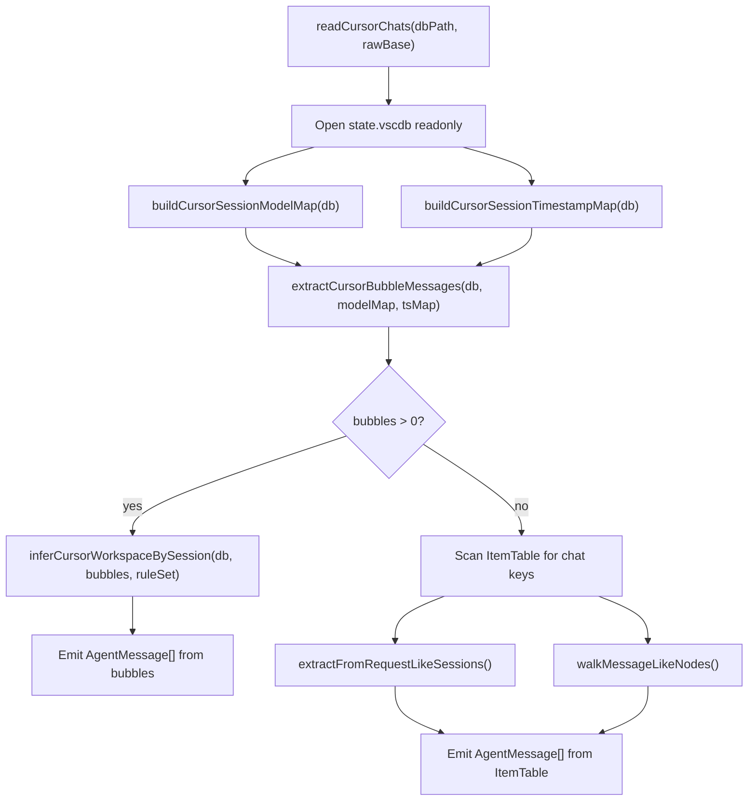
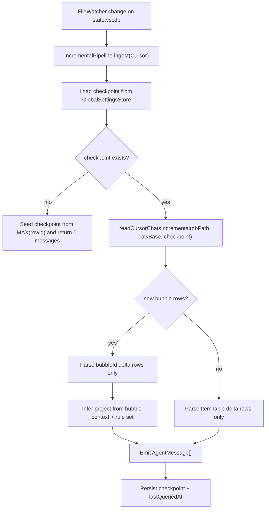
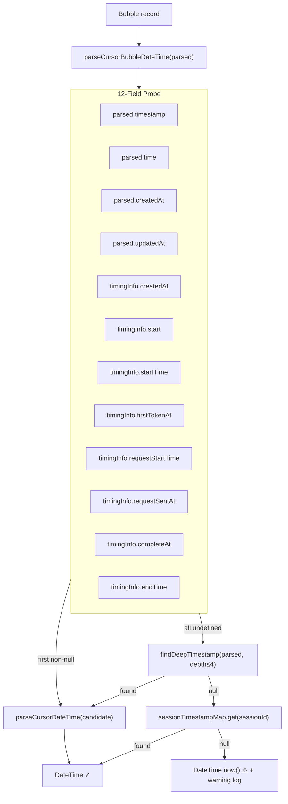
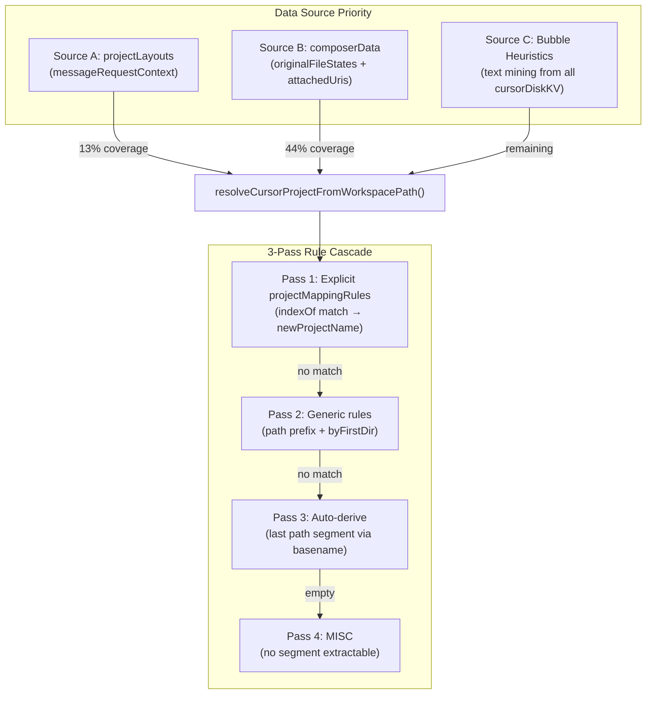
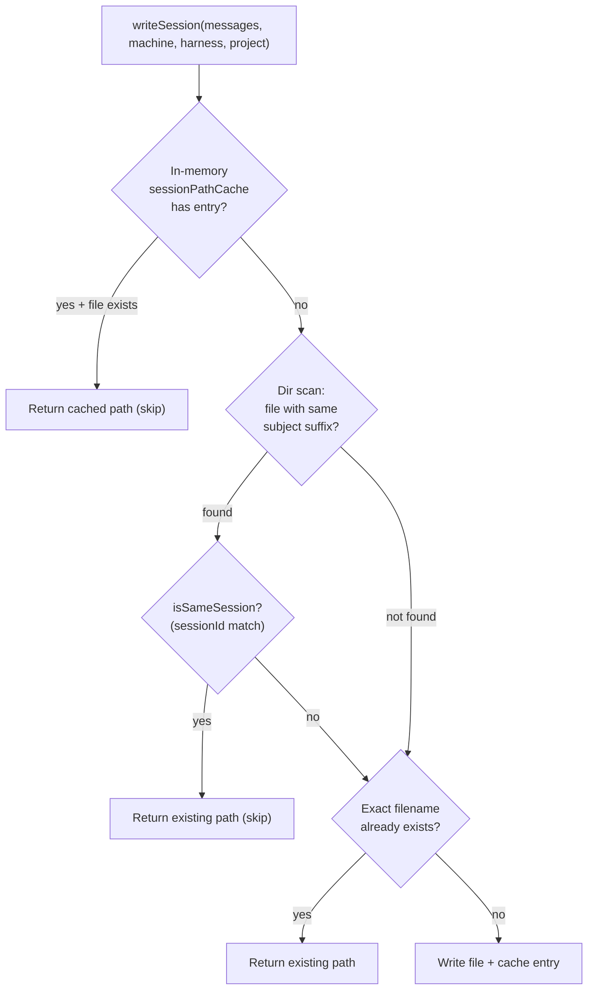
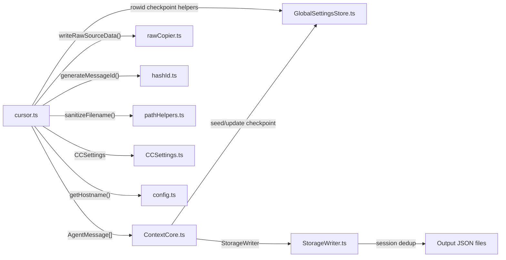

# ContextCore — Cursor Harness: Architecture & Review

**Date**: 2026-03-21
**Updated**: 2026-04-10
**Module**: [`src/harness/cursor.ts`](../../../src/harness/cursor.ts) + [`src/harness/cursor-query.ts`](../../../src/harness/cursor-query.ts)
**Complement to**: [`archi-harness.md`](archi-harness.md), [`r2gam-go-away-misc.md`](../../upgrades/2026-03/r2gam-go-away-misc.md)

---

## 1. Why This Document Exists

The Cursor harness is **by far the most complex** of the six ContextCore harnesses.  While Claude Code reads flat JSONL files and VS Code reads structured session JSONs, Cursor stores everything in a single SQLite database (`state.vscdb`) with two tables (`cursorDiskKV` with 46K+ rows, and `ItemTable` with ~690 rows) — none of which were designed for external consumption.

The harness has grown through multiple rounds of hard-won debugging to handle:
- A database schema that was never documented and changes across Cursor versions
- Multiple data formats (bubbles, requests, message-like nodes) across two tables
- Zero per-message timestamps in the primary (bubble) data source
- Workspace/project paths that must be *inferred* from scattered file URIs and layout metadata
- Startup/full mode and watcher/incremental mode with persisted rowid checkpoints

This document records the current architecture, the bugs discovered in the 2026-03-21 session, and the structural risks that remain.

---

## 2. Issues Discovered & Fixed (2026-03-21)

### 2.1 Bug: All Messages Dated to Today (DateTime.now() Fallback)

**Symptom**: Every Cursor message appeared with today's date/time, regardless of when the conversation actually happened.

**Root cause**: Cursor bubble records (`bubbleId:*` entries in `cursorDiskKV`) do not populate **any** of the 12 timestamp fields that `parseCursorBubbleDateTime()` probes.  The function checked `parsed.timestamp`, `parsed.time`, `parsed.createdAt`, etc., plus 6 fields on `timingInfo` — all `undefined`.  When every candidate was null, the function returned `DateTime.now()`.

**Why it wasn't caught earlier**: The function signature returned `DateTime` (never null), so callers had no way to know the timestamp was fabricated.  The messages looked normal in output — just dated wrong.

**Fix** (3 layers):

1. **`parseCursorBubbleDateTime()` → returns `DateTime | null`** instead of silently falling back to `DateTime.now()`.  Added `findDeepTimestamp()` — a recursive scanner that searches up to 4 levels deep in the bubble object for any field whose name matches `/^(timestamp|time|created|updated|date|start|end|sent|complete|first)/i` and whose numeric value falls in a plausible epoch range (post-2020).

2. **`buildCursorSessionTimestampMap()`** — a new function that reads `composerData:*` entries (already queried for model names) and extracts session-level timestamps as a fallback tier.  Checks `createdAt`, `updatedAt`, `timestamp`, `lastSendTime`, `creationDate`, `startTime`, then falls back to `findDeepTimestamp()`.

3. **`extractCursorBubbleMessages()` — 3-tier fallback chain**:
   - Per-bubble timestamp (12 known fields + deep-scan)
   - Session-level timestamp from composerData
   - `DateTime.now()` only as absolute last resort, with a **warning log** reporting exactly how many bubbles hit each fallback level

**Diagnostic additions**: Logs the field names from the first parsed bubble (`[Cursor][bubble-scan] Sample bubble fields: ...`) so future format changes are immediately visible.

### 2.2 Bug: Duplicate Output Files (16 Copies of Same Session)

**Symptom**: The same 3-message Cursor session appeared as 16 separate output JSON files, each with a different timestamp in the filename:
```
2026-03-21 13-04 go-git-restore-comments-...json
2026-03-21 13-09 go-git-restore-comments-...json
2026-03-21 13-13 go-git-restore-comments-...json
... (16 total)
```

**Root cause chain**:
1. Cursor harness has **no caching** — `state.vscdb` is re-read in full every ingest run
2. The same 3 bubbles for session `a3a45697...` are extracted every time
3. Bug 2.1 caused `parseCursorBubbleDateTime` to return `DateTime.now()` — a **different** timestamp on every run
4. `StorageWriter` names output files as `{datetime HH-mm} {subject}.json`
5. Different datetime → different filename → the `existsSync()` dedup check misses → new file is created
6. All 16 files contain identical message IDs (`1fa2a0c6c3503384`, `f80b2c194c2a01a7`, `922a7dc965647660`)

**Fix** in `StorageWriter.writeSession()` — two new dedup layers:

1. **In-memory `sessionPathCache`** (`Map<string, string>`, keyed by `harness::project::sessionId` → output path) — catches same-session duplicates within a single process run with zero I/O cost.

2. **Cross-run subject-suffix scan** — before creating a new file, scans the output directory for any existing file with the same `{subject}.json` suffix but a different datetime prefix.  If found, reads the file and verifies the `sessionId` matches.  If confirmed same session:
   - Non-overwrite mode: returns the existing path (skip)
   - Overwrite mode: deletes the stale file before writing the new one (prevents accumulation)

### 2.3 Issue: Bad Workspace Path Derivation → Wrong Project Names

**Symptom**: Sessions assigned garbage-derived project names like `"Lands"`, `"nclass"`, `"tprivate"`, `"r"` because the workspace inference pipeline was mining code snippets from bubble text rather than actual workspace metadata.

**Root cause**: The original workspace inference only had one data source — recursively scanning all `cursorDiskKV` values for path-like strings via `collectWorkspaceHints()`.  This collected noise paths from code content (`\r\nclass`, `/gfx/Lands`, `\r\n\tprivate`).

**Fix** (Phase 4 of R2GAM): Three-tier workspace inference with authoritative Cursor metadata sources:

1. **`projectLayouts`** from `messageRequestContext:{sessionId}:{bubbleId}` — contains `listDirV2Result.directoryTreeRoot.absPath`: the definitive workspace root path that Cursor itself uses.  13% session coverage.
2. **File URI extraction** from `composerData.originalFileStates` + `allAttachedFileCodeChunksUris` — real file paths the user worked on; workspace root derivable via common-parent computation.  44% session coverage.
3. **Bubble text heuristics** (original approach) — fallback for older sessions lacking the above metadata.

See [r2gam-go-away-misc.md](../../upgrades/2026-03/r2gam-go-away-misc.md) Phase 4 for full details.

### 2.4 Update (2026-04-10): Rowid-Based Incremental Watcher Ingest

Cursor watcher-triggered ingest no longer re-reads the entire `state.vscdb` every time. The architecture now uses a **full ingest at startup** plus a **rowid-based incremental ingest** on file watcher events.

Key details:

1. `cursorDiskKV` and `ItemTable` do **not** expose `added_date`/`updated_date` columns; both tables are schema-minimal:
   - `key TEXT UNIQUE ON CONFLICT REPLACE`
   - `value BLOB`
2. Incremental mode uses table `rowid` checkpoints:
   - Bubble delta query: `SELECT rowid, key, value FROM cursorDiskKV WHERE key LIKE 'bubbleId:%' AND rowid > ?`
   - ItemTable fallback delta query: `SELECT key FROM ItemTable WHERE rowid > ? AND (...)`
3. Checkpoints are persisted in `{storage}/.settings/global-settings.json` under:
   - `cursor.cursorDiskKVRowId`
   - `cursor.itemTableRowId`
   - `cursor.lastQueriedAt`
4. `ContextCore` startup still performs full Cursor ingest, then stores the latest checkpoint.
5. `IncrementalPipeline` Cursor branch logs explicit checkpoint transitions on watcher events:
   - `[Cursor][Checkpoint] Watcher start: ...`
   - `[Cursor][Checkpoint] Watcher end: before -> after`

---

## 3. Module Structure

### 3.1 High-Level Flow



### 3.1b Incremental Watcher Flow (2026-04-10)



### 3.2 Data Source Priority

The harness reads from two tables in `state.vscdb`, with a hard gate between them:

| Priority | Table          | Key Pattern                                    | Data                                              | When Used                                                                            |
| -------- | -------------- | ---------------------------------------------- | ------------------------------------------------- | ------------------------------------------------------------------------------------ |
| **1**    | `cursorDiskKV` | `bubbleId:{sessionId}:{bubbleId}`              | Individual message payloads                       | **Always tried first** — if any bubble rows exist, the entire output comes from here |
| **2**    | `cursorDiskKV` | `composerData:{sessionId}`                     | Session metadata (model, timestamps, file states) | Used for model/timestamp/workspace enrichment of bubble data                         |
| **3**    | `cursorDiskKV` | `messageRequestContext:{sessionId}:{bubbleId}` | Request context with `projectLayouts`             | Used for workspace inference (most authoritative source)                             |
| **4**    | `ItemTable`    | `*chat*`, `*composer*`, `*conversation*`       | Legacy/alternative session containers             | **Only used when zero bubble rows exist** (older Cursor versions)                    |

The gating logic is at [line 2203](../../../src/harness/cursor.ts#L2203): `if (bubbleMessages.length > 0)` — when bubbles exist, the ItemTable path is never executed.

Watcher incremental mode adds a second gate:
- If `cursorDiskKV` has any new `bubbleId:*` rows after the checkpoint (`rowid > checkpoint`), emit only bubble deltas.
- Otherwise, parse only new ItemTable candidate rows (`rowid > checkpoint`) as fallback.

### 3.3 Function Inventory (Core + Incremental)

Grouped by responsibility:

#### Entry Point
| Function            | Line | Purpose                                       |
| ------------------- | ---- | --------------------------------------------- |
| `readCursorChats()` | 2177 | Exported entry point; orchestrates all stages |

#### Incremental Entry Points (Watcher Path)
| Function | Line | Purpose |
| -------- | ---- | ------- |
| `getCursorRowIdCheckpoint()` | varies | Reads `MAX(rowid)` for `cursorDiskKV` and `ItemTable` |
| `readCursorChatsIncremental()` | varies | Reads only rows newer than persisted rowid checkpoint |
| `extractCursorBubbleMessagesSinceRowId()` | varies | Parses bubble delta rows (`rowid > checkpoint`) |

#### Timestamp Resolution
| Function                           | Line | Purpose                                                  |
| ---------------------------------- | ---- | -------------------------------------------------------- |
| `parseCursorBubbleDateTime()`      | 838  | 12-field probe + deep-scan → `DateTime \| null`          |
| `findDeepTimestamp()`              | 881  | Recursive timestamp field scanner (depth ≤ 4)            |
| `buildCursorSessionTimestampMap()` | 980  | Session-level timestamp fallback from composerData       |
| `parseCursorDateTime()`            | 2146 | Core epoch/ISO parser (handles seconds vs. milliseconds) |

#### Bubble Pipeline
| Function                        | Line | Purpose                                               |
| ------------------------------- | ---- | ----------------------------------------------------- |
| `extractCursorBubbleMessages()` | 1047 | Main bubble extraction with 3-tier timestamp fallback |
| `mapBubbleTypeToRole()`         | 821  | `1→user`, `2→assistant`                               |
| `buildCursorSessionModelMap()`  | 937  | Session→model from composerData                       |
| `pickModel()`                   | 359  | 5-path model field probe on generic objects           |

#### Workspace Inference
| Function                            | Line | Purpose                                         |
| ----------------------------------- | ---- | ----------------------------------------------- |
| `inferCursorWorkspaceBySession()`   | 1675 | Master workspace resolver (3 data sources)      |
| `buildProjectLayoutWorkspaceMap()`  | 1607 | Source A: projectLayouts absPath                |
| `buildComposerWorkspaceMap()`       | 1582 | Source B: composerData file URIs                |
| `extractProjectLayoutsForSession()` | 1449 | Parse projectLayouts from messageRequestContext |
| `extractComposerFileUris()`         | 1495 | Parse file URIs from composerData               |
| `deriveWorkspaceRootFromFileUris()` | 1540 | Common-parent from file URI set                 |
| `deriveCommonDirectoryPath()`       | 1374 | Longest common prefix across path array         |
| `chooseBestWorkspacePath()`         | 1255 | Frequency-scored bubble hint selection          |
| `collectWorkspaceHints()`           | 1203 | Recursive workspace path mining from payloads   |
| `normalizeWorkspaceRoot()`          | 684  | Path → project-root-like path                   |
| `findProjectRootFromDirectory()`    | 642  | Trim to project boundary markers                |
| `toProjectDirectory()`              | 628  | File path → enclosing directory                 |
| `isLikelyFilePath()`                | 612  | Extension-based file vs. directory heuristic    |
| `isLikelyHarnessStoragePath()`      | 1286 | Filter out AppData/storage noise paths          |
| `isLowSignalWorkspaceCandidate()`   | 1305 | Filter out base64 tokens, single-segment paths  |
| `normalizePathCandidate()`          | 465  | `file://` stripping, URI decoding, cleanup      |
| `parseFileUriToPath()`              | 1427 | `file:///` URI → local absolute path            |
| `splitPathSegments()`               | 1342 | Slash-split utility                             |
| `joinPathSegments()`                | 1352 | Segment-join with separator selection           |

#### Project Routing Rules
| Function                                  | Line | Purpose                                                 |
| ----------------------------------------- | ---- | ------------------------------------------------------- |
| `loadCursorProjectRuleSet()`              | 281  | Read rules from cc.json                                 |
| `resolveCursorProjectFromWorkspacePath()` | 516  | 3-pass rule cascade (explicit → generic → auto-derive)  |
| `workspacePathToProject()`                | 500  | Thin wrapper returning just the project string          |
| `remapCursorProjectName()`                | 329  | Apply projectName→newProjectName remaps                 |
| `normalizeRulePath()`                     | 165  | Lowercase slash-normalized path comparison              |
| `getFirstDirAfterPrefix()`                | 175  | First directory after matched prefix (for `byFirstDir`) |
| `asCursorProjectMappingRule()`            | 200  | Validate explicit rule shape                            |
| `asCursorProjectNameMappingRule()`        | 231  | Validate name remap rule shape                          |
| `asCursorGenericProjectMappingRule()`     | 256  | Validate generic rule shape                             |
| `buildCursorGenericRuleSuggestions()`     | 583  | Generate paste-ready cc.json snippets                   |

#### ItemTable Fallback Pipeline
| Function                           | Line | Purpose                                      |
| ---------------------------------- | ---- | -------------------------------------------- |
| `extractFromRequestLikeSessions()` | 1937 | Walk parsed JSON for `requests[]` arrays     |
| `walkMessageLikeNodes()`           | 2072 | Recursive finder for `{role, content}` nodes |
| `isCursorChatKeyCandidate()`       | 788  | Filter noisy ItemTable keys                  |
| `mapCursorRole()`                  | 2124 | String role → normalized role                |
| `extractRequestUserText()`         | 763  | Request → user text                          |
| `extractRequestAssistantText()`    | 776  | Request → assistant text                     |
| `extractRequestContextPaths()`     | 747  | Request variables/attachments → paths        |

#### General Utilities
| Function                       | Line | Purpose                                         |
| ------------------------------ | ---- | ----------------------------------------------- |
| `toDatabaseText()`             | 444  | SQLite value → string (handles Uint8Array)      |
| `normalizeMessageText()`       | 400  | Unknown content → message string                |
| `extractContextPaths()`        | 430  | Regex path extraction from free text            |
| `collectPathLikeValues()`      | 702  | Recursive path collector from arbitrary objects |
| `logCursorProgress()`          | 347  | Periodic progress logging                       |
| `cursorKeyFamily()`            | 1164 | Key → prefix label for diagnostics              |
| `extractSessionHintsFromKey()` | 1178 | Key → session-ID-like tokens                    |
| `queryCursorSessionEvidence()` | 1648 | Point query for session evidence counts         |

### 3.4 Type Inventory

| Type                              | Purpose                                                                        |
| --------------------------------- | ------------------------------------------------------------------------------ |
| `CursorKVRow`                     | Raw SQLite row (`key: string, value: unknown`)                                 |
| `CursorBubbleRecord`              | Parsed bubble with resolved role, message, dateTime, context                   |
| `CursorMessageLike`               | Generic `{role, content}` node from ItemTable walker                           |
| `CursorWalkerState`               | Session/model hints propagated during recursive walk                           |
| `CursorRequestLike`               | Request-like session container from ItemTable                                  |
| `CursorSessionLike`               | Session-like container with `requests[]` array                                 |
| `CursorProjectLayout`             | `{ rootPath, absPath }` from messageRequestContext                             |
| `CursorWorkspaceSource`           | `"projectLayouts" \| "composerFileUris" \| "bubbleHeuristics" \| "unresolved"` |
| `CursorWorkspaceInference`        | Full workspace inference result with diagnostics                               |
| `CursorProjectMappingRule`        | Explicit path → project rule                                                   |
| `CursorProjectNameMappingRule`    | Project name → new project name remap                                          |
| `CursorGenericProjectMappingRule` | Path + rule (e.g. `byFirstDir`)                                                |
| `CursorProjectRuleSet`            | Aggregated rule set from cc.json                                               |
| `CursorProjectResolution`         | `{ project, mode }` from workspace resolution                                  |
| `CursorRowIdCheckpoint`           | Persisted rowid checkpoint for `cursorDiskKV` + `ItemTable`                   |
| `CursorIncrementalResult`         | `{ messages, checkpoint }` returned by incremental watcher ingest              |
| `CursorKVRowWithRowId`            | Delta row shape (`rowid`, `key`, `value`) used in rowid-filtered queries      |

### 3.5 Module-Scoped State

| Variable                    | Type                  | Purpose                                                                 | Lifetime |
| --------------------------- | --------------------- | ----------------------------------------------------------------------- | -------- |
| `PROJECT_ROOT_CACHE`        | `Map<string, string>` | Avoids re-computing `findProjectRootFromDirectory`                      | Process  |
| `WORKSPACE_NORMALIZE_CACHE` | `Map<string, string>` | Avoids re-running `toProjectDirectory` + `findProjectRootFromDirectory` | Process  |

Both caches grow unbounded.  With 574 sessions × multiple path candidates, they typically hold 1–3K entries.  Not a concern at current scale.

---

## 4. Timestamp Resolution Architecture



`parseCursorDateTime()` itself handles three formats:
- **Epoch seconds** (`< 10B`): `DateTime.fromSeconds()`
- **Epoch milliseconds** (`≥ 10B`): `DateTime.fromMillis()`
- **String**: try numeric parse first, then ISO parse, then `DateTime.now()` as last resort

---

## 5. Workspace Inference Architecture



### 5.1 Source A: projectLayouts (Best)

Each `messageRequestContext:{sessionId}:{bubbleId}` entry may contain a `projectLayouts` array.  Each layout has:
- `rootPath`: workspace folder display name (e.g. `"AXON"`)
- `listDirV2Result.directoryTreeRoot.absPath`: full absolute path (e.g. `D:\workspace\AXON`)

For multi-root workspaces (multiple layouts), `buildProjectLayoutWorkspaceMap()` computes the common parent via `deriveCommonDirectoryPath()`.

### 5.2 Source B: composerData File URIs (Good)

Each `composerData:{sessionId}` entry may contain:
- `originalFileStates`: object whose keys are `file:///` URIs of files Cursor snapshot
- `allAttachedFileCodeChunksUris`: array of `file:///` URIs the user attached

`extractComposerFileUris()` decodes these into local paths.  `deriveWorkspaceRootFromFileUris()` computes the common parent directory, falling back to most-frequent directory root if the common prefix is too shallow (e.g. just a drive root).

### 5.3 Source C: Bubble Text Heuristics (Weakest)

The original approach.  Recursively scans every `cursorDiskKV` value for path-like strings via `collectWorkspaceHints()`, scores them by frequency per session, and picks the best via `chooseBestWorkspacePath()`.  Produces noise paths from code content — the cause of bug 2.3.

### 5.4 Efficient DB Access

All three sources are collected during a **single full scan** of `cursorDiskKV` ([line 1729](../../../src/harness/cursor.ts#L1729): `SELECT key, value FROM cursorDiskKV`).  During iteration:
- `composerData:*` rows are parsed and stored in `composerDataBySession`
- `messageRequestContext:*` rows are parsed and layouts stored in `projectLayoutsBySession`
- All other rows contribute to `sessionHintCounts` (Source C) and `unresolvedFamilies`

No per-session queries are issued.  The workspace maps are built *after* the scan completes.

---

## 6. Storage Dedup Architecture

The `StorageWriter.writeSession()` dedup operates at two levels:



The `isSameSession()` check reads the existing file and compares `sessionId` on the first message (fast path), with a fallback to message ID overlap check.

---

## 7. Structural Risks & Technical Debt

### 7.1 File Size (2,430 lines, 48 functions)

The module is the largest in the codebase by a significant margin.  It combines:
- Database I/O and parsing
- Timestamp resolution (4 functions)
- Workspace inference (20+ functions)
- Project rule routing (9 functions)
- Two independent message extraction pipelines (bubbles vs. ItemTable)

**Risk**: Cognitive load makes bugs harder to spot.  The timestamp bug went unnoticed because the relevant code was buried among 48 functions.

**Mitigation candidate**: Split into submodules:
- `cursor/bubbles.ts` — bubble extraction + timestamp resolution
- `cursor/workspace.ts` — workspace inference + path utilities
- `cursor/rules.ts` — project routing rules
- `cursor/itemTable.ts` — legacy ItemTable fallback
- `cursor/index.ts` — orchestrator (`readCursorChats`)

### 7.2 Full Re-Read Cost (Partially Addressed)

The startup path still performs a full Cursor read (intended), but watcher-triggered updates are now rowid-incremental:
- Startup: full `readCursorChats()`
- Watcher: `readCursorChatsIncremental()` using persisted rowid checkpoints

**Current impact**: Runtime watcher cost is dramatically reduced on active Cursor sessions, but startup cost still scales with DB size.

**Remaining gap**: Incremental project inference in watcher mode is intentionally lightweight (bubble-context based) and may still fall back to `MISC` for some sparse deltas, relying on prior DB session project continuity when available.

### 7.3 `parseCursorDateTime()` Still Falls Back to `DateTime.now()`

The ItemTable fallback path ([line 2146](../../../src/harness/cursor.ts#L2146)) calls `parseCursorDateTime()` which still returns `DateTime.now()` when called with `null`.  This is acceptable for the ItemTable path (which is rarely hit and typically has timestamps in request payloads), but the pattern of silently returning "now" remains a latent risk.

**Mitigation candidate**: Change `parseCursorDateTime` to return `DateTime | null` (like the bubble variant) and handle nulls explicitly at each call site.

### 7.4 Code Duplication with Kiro Harness

As noted in [archi-harness.md](archi-harness.md#shared-code-duplication-cursor--kiro), the following functions are character-for-character identical between `cursor.ts` and `kiro.ts`:

| Function                                                                    | Purpose                                      |
| --------------------------------------------------------------------------- | -------------------------------------------- |
| `normalizeRulePath()`                                                       | Lowercase slash-normalized path comparison   |
| `getFirstDirAfterPrefix()`                                                  | First directory segment after a prefix match |
| `asCursorProjectMappingRule()` / `asKiroProjectMappingRule()`               | Validate explicit rule shape                 |
| `asCursorGenericProjectMappingRule()` / `asKiroGenericProjectMappingRule()` | Validate generic rule shape                  |
| `loadCursorProjectRuleSet()` / `loadKiroProjectRuleSet()`                   | Read rules from cc.json                      |

These should be extracted to a shared `harness/projectRules.ts` module.

### 7.5 `inferCursorWorkspaceBySession()` Is 260 Lines

This single function ([line 1675–1935](../../../src/harness/cursor.ts#L1675)) handles:
- Collecting bubble context paths per session
- Full `cursorDiskKV` scan with row-level dispatch
- Building composerData and projectLayout maps
- Merging all three workspace sources per session
- Project resolution with auto-derived/MISC classification
- Diagnostic logging and evidence queries

**Risk**: Hard to test in isolation; changes to any one responsibility can break the others.

### 7.6 Module-Scoped Caches Are Never Cleared

`PROJECT_ROOT_CACHE` and `WORKSPACE_NORMALIZE_CACHE` persist for the lifetime of the process.  In long-running server mode (FileWatcher + IncrementalPipeline), these grow monotonically.  Not a practical concern at current scale (~3K entries), but a correctness risk if the underlying data changes during a run.

### 7.7 Duplicate JSDoc Comment on `readCursorChats`

[Lines 2170–2176](../../../src/harness/cursor.ts#L2170) have two consecutive JSDoc blocks:
```typescript
/**
 * Reads chat-related entries from Cursor's state.vscdb.
 * @param dbPath – path to state.vscdb
 */
/**
 * Entry point for Cursor chat history ingestion.
 * ...
```

Minor hygiene issue — the first block is a stale remnant.

---

## 8. AgentMessage Field Mapping (Complete Reference)

### 8.1 Bubble Pipeline (Primary)

| AgentMessage Field | Source                                                                                  |
| ------------------ | --------------------------------------------------------------------------------------- |
| **id**             | `generateMessageId(sessionId, role, bubbleId, message[0:120])`                          |
| **sessionId**      | Key segment: `bubbleId:{sessionId}:*`                                                   |
| **role**           | `mapBubbleTypeToRole(type)`: 1→user, 2→assistant                                        |
| **model**          | `pickModel(bubble)` → `sessionModelMap` fallback → `null`                               |
| **message**        | `parsed.text` (trimmed)                                                                 |
| **context**        | `extractContextPaths(text)` + `collectPathLikeValues(context, codeBlocks, toolResults)` |
| **project**        | `workspaceInference.projectBySession.get(sessionId)` → `MISC`                           |
| **parentId**       | Previous message ID in session (sequential chaining)                                    |
| **tokenUsage**     | `null` (not available in bubble records)                                                |
| **toolCalls**      | `[]` (not extractable from bubble format)                                               |
| **rationale**      | `[]`                                                                                    |
| **source**         | Path to `-RAW` JSON dump of session bubbles                                             |
| **dateTime**       | `parseCursorBubbleDateTime()` → session-level fallback → `DateTime.now()`               |

### 8.2 ItemTable Fallback (Request-Like)

| AgentMessage Field | User Message                                                       | Assistant Message                                                    |
| ------------------ | ------------------------------------------------------------------ | -------------------------------------------------------------------- |
| **id**             | `generateMessageId(sessionId, "user", key-i-u, text[0:120])`       | `generateMessageId(sessionId, "assistant", key-i-a, text[0:120])`    |
| **sessionId**      | `request.result.metadata.sessionId` → container sessionId → DB key | Same                                                                 |
| **role**           | `"user"`                                                           | `"assistant"`                                                        |
| **model**          | `null`                                                             | `request.modelId` → `result.details` first segment → container model |
| **message**        | `request.message.text` → parts joined                              | Response items values joined                                         |
| **context**        | `extractRequestContextPaths()`: file-kind variables + attachments  | Same (shared per request)                                            |
| **project**        | `projectBySession.get(sessionId)` → defaultProject (`MISC`)        | Same                                                                 |
| **parentId**       | Previous assistant ID                                              | User message ID                                                      |
| **dateTime**       | `parseCursorDateTime(request.timestamp ?? container.creationDate)` | Same                                                                 |

### 8.3 ItemTable Fallback (MessageLike Walker)

| AgentMessage Field | Source                                                      |
| ------------------ | ----------------------------------------------------------- |
| **id**             | `generateMessageId(sessionId, role, key-i, message[0:120])` |
| **sessionId**      | `messageNode.sessionHint` → DB key → `basename(dbPath)`     |
| **role**           | `mapCursorRole(messageNode.role)`                           |
| **model**          | Assistant: `messageNode.model`; else: `null`                |
| **message**        | `normalizeMessageText(messageNode.content)`                 |
| **context**        | `extractContextPaths(message)`                              |
| **project**        | `MISC` (no workspace inference for ItemTable path)          |
| **dateTime**       | `parseCursorDateTime(messageNode.timestamp)`                |

---

## 9. Key Constants

| Constant                   | Value                                                                            | Purpose                                                      |
| -------------------------- | -------------------------------------------------------------------------------- | ------------------------------------------------------------ |
| `MISC_CURSOR_PROJECT`      | `"MISC"`                                                                         | Default project label when all resolution fails              |
| `CURSOR_PROGRESS_EVERY`    | `5000`                                                                           | Progress log interval (rows)                                 |
| `PROJECT_BOUNDARY_MARKERS` | `{src, app, apps, lib, libs, test, tests, docs, scripts, interop, node_modules}` | Directory names that signal "above here is the project root" |
| `PROJECT_TRAILING_NOISE`   | `{dist, build, .next, .cursor, .vscode}`                                         | Directory names to strip from the end of resolved paths      |

---

## 10. Interaction with Other Modules



The harness is invoked by `ContextCore.ts` (full ingest) and `IncrementalPipeline.ts` (watcher-triggered incremental ingest). Both pass results through `StorageWriter.writeSession()`. The watcher path additionally reads/writes Cursor rowid checkpoints through `GlobalSettingsStore`.

---

## 11. FileWatcher Integration

- **Watch target**: Single file (`state.vscdb`)
- **Extension filter**: `[".vscdb"]`
- **Debounce**: 5000ms
- **Watch mode**: Single-file watch (not recursive directory)
- **Startup behavior**: Full Cursor ingest, then checkpoint persisted to `.settings/global-settings.json`
- **Watcher behavior**: Incremental Cursor ingest via rowid (`before -> after` checkpoint logs each run)

The 5-second debounce is critical: Cursor writes to `state.vscdb` frequently during active sessions. Without debounce + rowid checkpoints, the system would repeatedly perform high-cost full re-reads.
