# ContextCore – Harness Operational Architecture

**Date**: 2026-03-19
**Scope**: Operational-level detail for all six harness readers
**Complement to**: [`archi-context-core.md`](../archi-context-core.md)
**Source modules**: [`src/harness/`](../../../src/harness/)

---

## 1. Overview

Each harness is a format-specific reader that implements a single contract:

```typescript
(path: string, rawBase: string) => AgentMessage[]
```

The harness registry ([`harness/index.ts`](../../../src/harness/index.ts)) dispatches by name to one of six readers. Each reader independently handles source discovery, caching, parsing, normalization, project resolution, and raw archival — then returns a flat array of `AgentMessage` instances with `machine` and `subject` left blank (stamped later by the orchestrator).

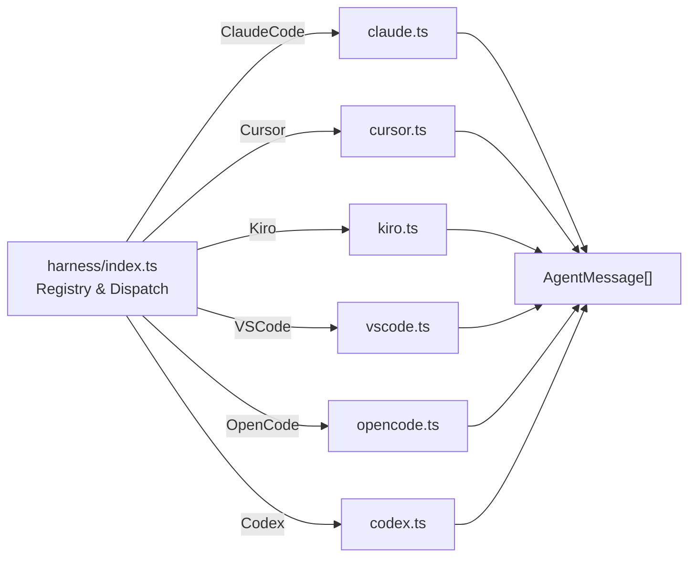
```mermaid
flowchart LR
    REG["harness/index.ts<br/>Registry & Dispatch"]
    CC["claude.ts"]
    CU["cursor.ts"]
    KI["kiro.ts"]
    VS["vscode.ts"]
    OC["opencode.ts"]
    CX["codex.ts"]

    REG -->|"ClaudeCode"| CC
    REG -->|"Cursor"| CU
    REG -->|"Kiro"| KI
    REG -->|"VSCode"| VS
    REG -->|"OpenCode"| OC
    REG -->|"Codex"| CX

    CC --> AM["AgentMessage[]"]
    CU --> AM
    KI --> AM
    VS --> AM
    OC --> AM
    CX --> AM
```

The six harnesses differ dramatically in source format, complexity, and field population strategy. This document details each one.

---

## 2. Claude Code Harness

**Module**: [`src/harness/claude.ts`](../../../src/harness/claude.ts) (~410 lines)
**Source format**: `.jsonl` files (one file per session)
**Source location**: `~/.claude/projects/<project-slug>/`
**Caching**: File-level (size + mtime via `isSourceFileCached`)
**Raw archival**: Verbatim file copy via `copyRawSourceFile`

### 2.1 Source Data Structure

Each `.jsonl` file contains one JSON object per line. Only lines with `type: "user"` or `type: "assistant"` are kept; all other event types are discarded.

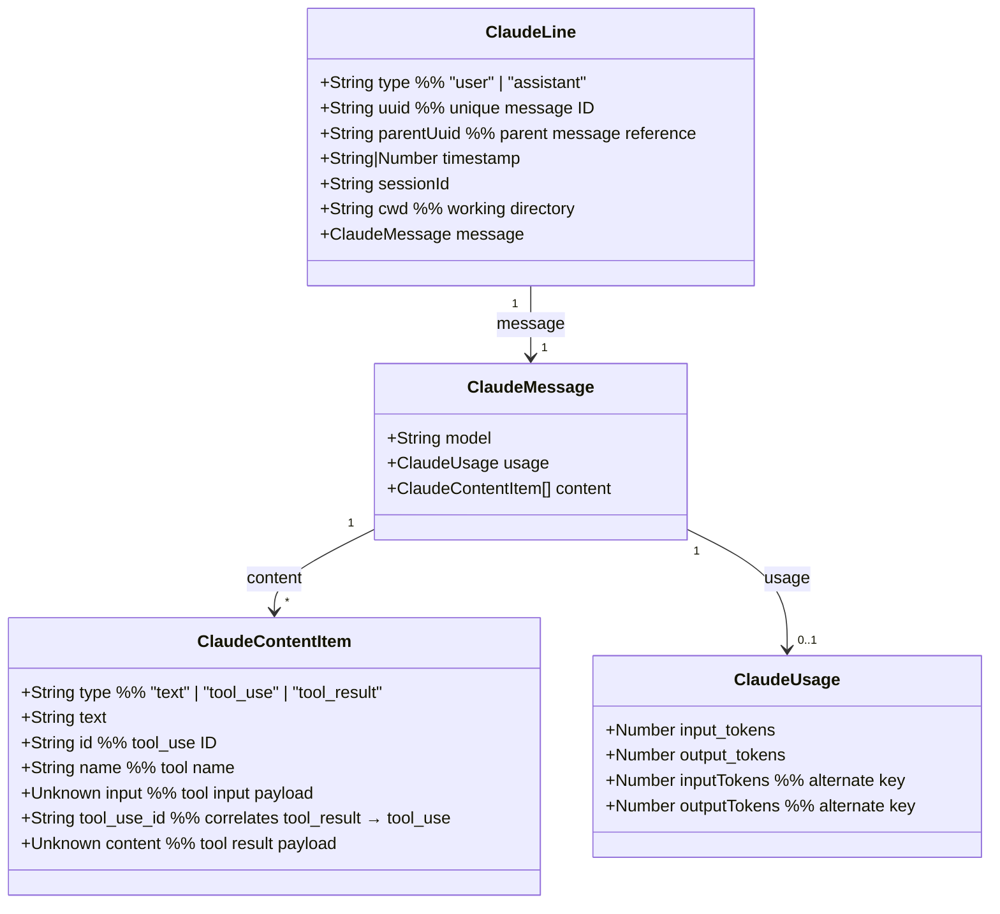
```mermaid
classDiagram
    class ClaudeLine {
        +String type           %% "user" | "assistant"
        +String uuid           %% unique message ID
        +String parentUuid     %% parent message reference
        +String|Number timestamp
        +String sessionId
        +String cwd            %% working directory
        +ClaudeMessage message
    }

    class ClaudeMessage {
        +String model
        +ClaudeUsage usage
        +ClaudeContentItem[] content
    }

    class ClaudeContentItem {
        +String type     %% "text" | "tool_use" | "tool_result"
        +String text
        +String id       %% tool_use ID
        +String name     %% tool name
        +Unknown input   %% tool input payload
        +String tool_use_id  %% correlates tool_result → tool_use
        +Unknown content     %% tool result payload
    }

    class ClaudeUsage {
        +Number input_tokens
        +Number output_tokens
        +Number inputTokens    %% alternate key
        +Number outputTokens   %% alternate key
    }

    ClaudeLine "1" --> "1" ClaudeMessage : message
    ClaudeMessage "1" --> "*" ClaudeContentItem : content
    ClaudeMessage "1" --> "0..1" ClaudeUsage : usage
```

### 2.2 Tool Result Correlation

Claude Code's most distinctive parsing challenge is **tool result stitching**. Assistant messages contain `tool_use` content items with unique IDs. Subsequent user lines carry matching `tool_result` items that must be correlated back.

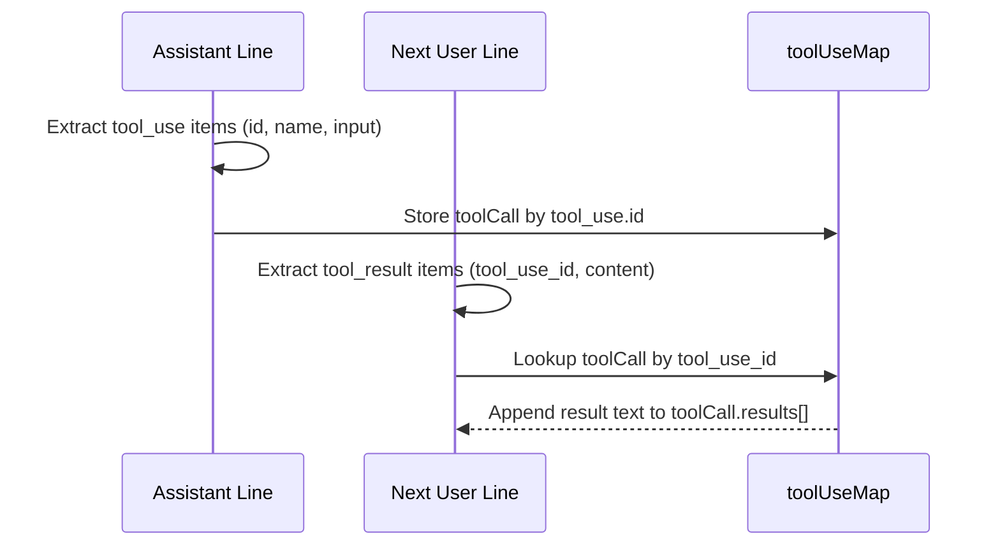
```mermaid
sequenceDiagram
    participant A as Assistant Line
    participant U as Next User Line
    participant Map as toolUseMap

    A->>A: Extract tool_use items (id, name, input)
    A->>Map: Store toolCall by tool_use.id
    U->>U: Extract tool_result items (tool_use_id, content)
    U->>Map: Lookup toolCall by tool_use_id
    Map-->>U: Append result text to toolCall.results[]
```

The `toolUseMap` is scoped per session file and accumulates across all lines, enabling tool results that appear many lines after their invocation to still be matched.

### 2.3 AgentMessage Field Mapping

| AgentMessage Field | User Messages | Assistant Messages |
|---|---|---|
| **id** | `line.uuid` → fallback: `generateMessageId(sessionId, role, timestamp, prefix)` | Same strategy |
| **sessionId** | `first_line.sessionId` → fallback: filename without `.jsonl` | Same |
| **role** | `"user"` | `"assistant"` |
| **model** | `null` (always) | `line.message.model` |
| **message** | Text content items joined, `<ide_opened_file>` tags stripped | Text content items joined |
| **context** | Extracted from `<ide_opened_file>` tags in text | `[]` (empty) |
| **project** | `deriveProjectName("ClaudeCode", line.cwd)` → fallback: parent directory | Same |
| **parentId** | `line.parentUuid` | `line.parentUuid` |
| **tokenUsage** | `null` | `{ input: usage.input_tokens, output: usage.output_tokens }` (dual-key fallback) |
| **toolCalls** | `[]` | Extracted `tool_use` items: `{ name, context: pathValues(input), results: [] }` |
| **rationale** | `[]` | `[]` |
| **source** | Path to `-RAW` copy of the `.jsonl` file | Same |
| **dateTime** | `parseClaudeDateTime(line.timestamp)` — handles ISO string and epoch milliseconds | Same |

### 2.4 Key Extraction Functions

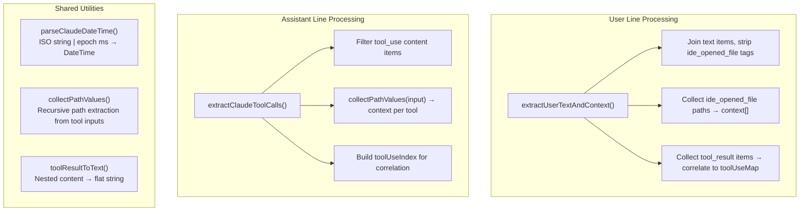
```mermaid
flowchart TD
    subgraph User["User Line Processing"]
        U1["extractUserTextAndContext()"]
        U1a["Join text items, strip ide_opened_file tags"]
        U1b["Collect ide_opened_file paths → context[]"]
        U1c["Collect tool_result items → correlate to toolUseMap"]
        U1 --> U1a
        U1 --> U1b
        U1 --> U1c
    end

    subgraph Assistant["Assistant Line Processing"]
        A1["extractClaudeToolCalls()"]
        A1a["Filter tool_use content items"]
        A1b["collectPathValues(input) → context per tool"]
        A1c["Build toolUseIndex for correlation"]
        A1 --> A1a
        A1 --> A1b
        A1 --> A1c
    end

    subgraph Shared["Shared Utilities"]
        S1["parseClaudeDateTime()<br/>ISO string | epoch ms → DateTime"]
        S2["collectPathValues()<br/>Recursive path extraction from tool inputs"]
        S3["toolResultToText()<br/>Nested content → flat string"]
    end
```

---

## 3. Cursor Harness

**Module**: [`src/harness/cursor.ts`](../../../src/harness/cursor.ts) (~1,570 lines)
**Source format**: SQLite database (`state.vscdb`)
**Source location**: `~/.cursor/User/globalStorage/state.vscdb` (or similar)
**Caching**: None (database-level; re-read every run)
**Raw archival**: JSON dump per session via `writeRawSourceData`

### 3.1 Source Database Structure

Cursor stores all IDE state in a single SQLite database with two relevant tables. The harness primarily reads from `cursorDiskKV` and falls back to `ItemTable` when no bubble records exist.

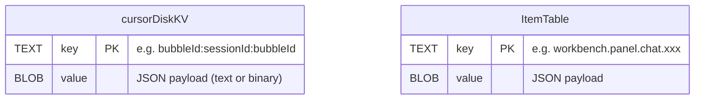
```mermaid
erDiagram
    cursorDiskKV {
        TEXT key PK "e.g. bubbleId:sessionId:bubbleId"
        BLOB value   "JSON payload (text or binary)"
    }

    ItemTable {
        TEXT key PK  "e.g. workbench.panel.chat.xxx"
        BLOB value   "JSON payload"
    }
```

#### Key Namespaces in `cursorDiskKV`

| Key Pattern | Content | Used For |
|---|---|---|
| `composerData:{sessionId}` | Session metadata with `modelConfig.modelName` | Building the session → model map |
| `bubbleId:{sessionId}:{bubbleId}` | Individual message payloads | Primary message extraction |
| `*workspace*`, `*folder*`, `*root*`, `*path*` | Workspace hint metadata | Project/workspace inference |

### 3.2 Bubble Record Structure

Each `bubbleId:*` entry deserializes to a record with the following shape:

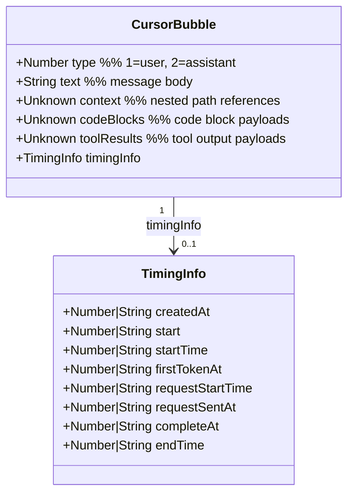
```mermaid
classDiagram
    class CursorBubble {
        +Number type         %% 1=user, 2=assistant
        +String text         %% message body
        +Unknown context     %% nested path references
        +Unknown codeBlocks  %% code block payloads
        +Unknown toolResults %% tool output payloads
        +TimingInfo timingInfo
    }

    class TimingInfo {
        +Number|String createdAt
        +Number|String start
        +Number|String startTime
        +Number|String firstTokenAt
        +Number|String requestStartTime
        +Number|String requestSentAt
        +Number|String completeAt
        +Number|String endTime
    }

    CursorBubble "1" --> "0..1" TimingInfo : timingInfo
```

### 3.3 Three-Stage Ingestion Pipeline

The Cursor harness is the most complex, operating in three sequential stages:

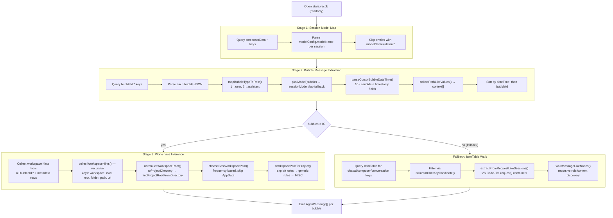
```mermaid
flowchart TD
    START["Open state.vscdb (readonly)"] --> S1

    subgraph S1["Stage 1: Session Model Map"]
        S1a["Query composerData:* keys"]
        S1b["Parse modelConfig.modelName per session"]
        S1c["Skip entries with modelName='default'"]
        S1a --> S1b --> S1c
    end

    S1 --> S2

    subgraph S2["Stage 2: Bubble Message Extraction"]
        S2a["Query bubbleId:* keys"]
        S2b["Parse each bubble JSON"]
        S2c["mapBubbleTypeToRole()<br/>1→user, 2→assistant"]
        S2d["pickModel(bubble) → sessionModelMap fallback"]
        S2e["parseCursorBubbleDateTime()<br/>10+ candidate timestamp fields"]
        S2f["collectPathLikeValues() → context[]"]
        S2g["Sort by dateTime, then bubbleId"]
        S2a --> S2b --> S2c --> S2d --> S2e --> S2f --> S2g
    end

    S2 --> CHECK{"bubbles > 0?"}

    CHECK -->|"yes"| S3

    subgraph S3["Stage 3: Workspace Inference"]
        S3a["Collect workspace hints from<br/>all bubbleId:* + metadata rows"]
        S3b["collectWorkspaceHints() — recursive<br/>keys: workspace, cwd, root, folder, path, uri"]
        S3c["normalizeWorkspaceRoot()<br/>toProjectDirectory → findProjectRootFromDirectory"]
        S3d["chooseBestWorkspacePath()<br/>frequency-based, skip AppData"]
        S3e["workspacePathToProject()<br/>explicit rules → generic rules → MISC"]
        S3a --> S3b --> S3c --> S3d --> S3e
    end

    CHECK -->|"no (fallback)"| FB

    subgraph FB["Fallback: ItemTable Walk"]
        FB1["Query ItemTable for chat/ai/composer/conversation keys"]
        FB2["Filter via isCursorChatKeyCandidate()"]
        FB3["extractFromRequestLikeSessions()<br/>VS Code-like request[] containers"]
        FB4["walkMessageLikeNodes()<br/>recursive role/content discovery"]
        FB1 --> FB2 --> FB3 --> FB4
    end

    S3 --> EMIT["Emit AgentMessage[] per bubble"]
    FB --> EMIT
```

### 3.4 Workspace Inference Deep Dive

The workspace inference system is the core of Cursor's project resolution. It works by mining path-like values from every relevant database row and scoring them per session.

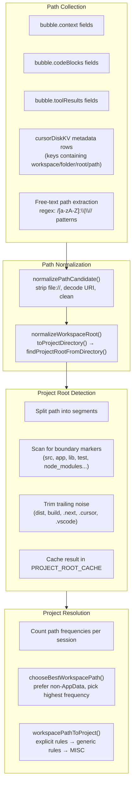
```mermaid
flowchart TD
    subgraph PathCollection["Path Collection"]
        PC1["bubble.context fields"]
        PC2["bubble.codeBlocks fields"]
        PC3["bubble.toolResults fields"]
        PC4["cursorDiskKV metadata rows<br/>(keys containing workspace/folder/root/path)"]
        PC5["Free-text path extraction<br/>regex: /[a-zA-Z]:\\|\\// patterns"]
    end

    subgraph Normalization["Path Normalization"]
        N1["normalizePathCandidate()<br/>strip file://, decode URI, clean"]
        N2["normalizeWorkspaceRoot()<br/>toProjectDirectory() → findProjectRootFromDirectory()"]
    end

    subgraph RootDetection["Project Root Detection"]
        R1["Split path into segments"]
        R2["Scan for boundary markers<br/>(src, app, lib, test, node_modules...)"]
        R3["Trim trailing noise<br/>(dist, build, .next, .cursor, .vscode)"]
        R4["Cache result in PROJECT_ROOT_CACHE"]
    end

    subgraph Resolution["Project Resolution"]
        RES1["Count path frequencies per session"]
        RES2["chooseBestWorkspacePath()<br/>prefer non-AppData, pick highest frequency"]
        RES3["workspacePathToProject()<br/>explicit rules → generic rules → MISC"]
    end

    PathCollection --> N1 --> N2 --> RootDetection --> Resolution
```

**Boundary markers** (`PROJECT_BOUNDARY_MARKERS`): `src`, `app`, `apps`, `lib`, `libs`, `test`, `tests`, `docs`, `scripts`, `interop`, `node_modules`

**Trailing noise** (`PROJECT_TRAILING_NOISE`): `dist`, `build`, `.next`, `.cursor`, `.vscode`

### 3.5 Model Resolution Priority Chain

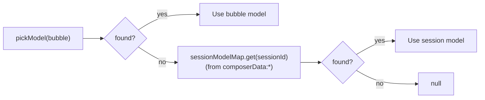
```mermaid
flowchart LR
    B["pickModel(bubble)"] --> FOUND1{"found?"}
    FOUND1 -->|"yes"| USE1["Use bubble model"]
    FOUND1 -->|"no"| SM["sessionModelMap.get(sessionId)<br/>(from composerData:*)"]
    SM --> FOUND2{"found?"}
    FOUND2 -->|"yes"| USE2["Use session model"]
    FOUND2 -->|"no"| NULL["null"]
```

The `pickModel()` function searches an object for model-like fields in this order:
1. `obj.model` (string)
2. `obj.modelName` (string)
3. `obj.modelId` (string)
4. `obj.selectedModel.identifier` (string)
5. `obj.selectedModel.metadata.name` (string)

### 3.6 DateTime Resolution

The `parseCursorBubbleDateTime()` function probes **12 candidate timestamp fields** across the bubble object and its `timingInfo` sub-object, using the first one that yields a valid value:

| Priority | Field Path | Typical Source |
|---|---|---|
| 1 | `parsed.timestamp` | Direct timestamp |
| 2 | `parsed.time` | Alternative timestamp |
| 3 | `parsed.createdAt` | Creation time |
| 4 | `parsed.updatedAt` | Last update |
| 5 | `timingInfo.createdAt` | Timing metadata |
| 6 | `timingInfo.start` | Request start |
| 7 | `timingInfo.startTime` | Alternative start |
| 8 | `timingInfo.firstTokenAt` | First token time |
| 9 | `timingInfo.requestStartTime` | Request initiation |
| 10 | `timingInfo.requestSentAt` | Request sent |
| 11 | `timingInfo.completeAt` | Completion time |
| 12 | `timingInfo.endTime` | End time |

The `parseCursorDateTime()` utility handles both epoch seconds (`< 10B`) and epoch milliseconds (`≥ 10B`), plus ISO string parsing.

### 3.7 AgentMessage Field Mapping

| AgentMessage Field | Bubble Path (Primary) | ItemTable Fallback |
|---|---|---|
| **id** | `generateMessageId(sessionId, role, bubbleId, prefix)` | `generateMessageId(sessionId, role, key-index, prefix)` |
| **sessionId** | Key segment: `bubbleId:{sessionId}:*` | `obj.sessionId` or `obj.conversationId` or DB key |
| **role** | `mapBubbleTypeToRole(type)`: 1→user, 2→assistant | `mapCursorRole(role)`: string matching |
| **model** | `pickModel(bubble)` → `sessionModelMap` fallback → `null` | `pickModel(obj)` or `request.modelId` or `result.details` parse |
| **message** | `parsed.text` | `normalizeMessageText(content)`: string, array, or object |
| **context** | `extractContextPaths(text)` + `collectPathLikeValues(context, codeBlocks, toolResults)` | `extractRequestContextPaths(request)` or `extractContextPaths(text)` |
| **project** | `workspaceInference.projectBySession.get(sessionId)` → `MISC` | `MISC` (default) |
| **parentId** | Previous message ID in session (sequential chaining) | Same |
| **tokenUsage** | `null` (not available in bubble records) | `null` |
| **toolCalls** | `[]` (not extractable from bubble format) | `[]` |
| **rationale** | `[]` | `[]` |
| **source** | Path to `-RAW` JSON dump of session bubbles | Path to `-RAW` JSON dump of DB key |
| **dateTime** | `parseCursorBubbleDateTime()` — 12 candidate fields | `parseCursorDateTime(timestamp)` |

### 3.8 In-Memory Caches

| Cache | Type | Purpose |
|---|---|---|
| `PROJECT_ROOT_CACHE` | `Map<string, string>` | Avoids re-computing project root trimming for the same directory |
| `WORKSPACE_NORMALIZE_CACHE` | `Map<string, string>` | Avoids re-running `toProjectDirectory` + `findProjectRootFromDirectory` |

Both caches are module-scoped and persist for the lifetime of the process.

---

## 4. Kiro Harness

**Module**: [`src/harness/kiro.ts`](../../../src/harness/kiro.ts) (~790 lines)
**Source format**: `.chat` JSON files (one file per session)
**Source location**: `~/.kiro/kiro.kiroagent/<workspace-hash>/`
**Caching**: File-level (size + mtime via `isSourceFileCached`)
**Raw archival**: Verbatim file copy via `copyRawSourceFile`

### 4.1 Source Data Structure

Each `.chat` file is a single JSON object containing the full conversation, metadata, and execution context.

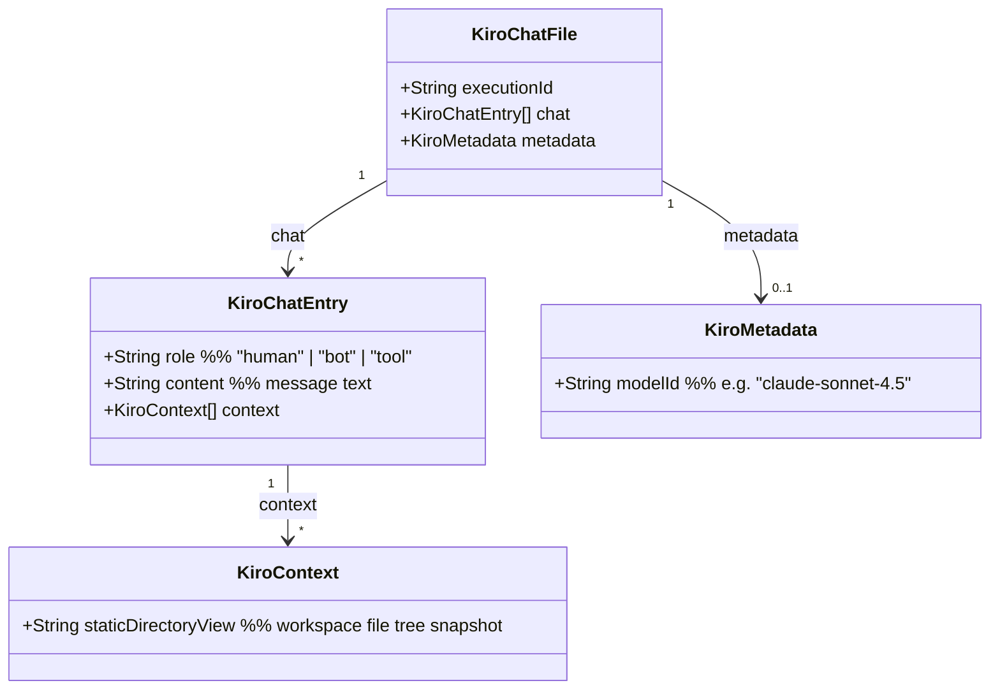
```mermaid
classDiagram
    class KiroChatFile {
        +String executionId
        +KiroChatEntry[] chat
        +KiroMetadata metadata
    }

    class KiroChatEntry {
        +String role         %% "human" | "bot" | "tool"
        +String content      %% message text
        +KiroContext[] context
    }

    class KiroContext {
        +String staticDirectoryView  %% workspace file tree snapshot
    }

    class KiroMetadata {
        +String modelId    %% e.g. "claude-sonnet-4.5"
    }

    KiroChatFile "1" --> "*" KiroChatEntry : chat
    KiroChatFile "1" --> "0..1" KiroMetadata : metadata
    KiroChatEntry "1" --> "*" KiroContext : context
```

### 4.2 System Prompt Detection & Skipping

The first `human` entry containing an `<identity>` tag is treated as the system prompt and excluded from output. The `findSystemPromptInfo()` function returns the start index for actual conversation entries.

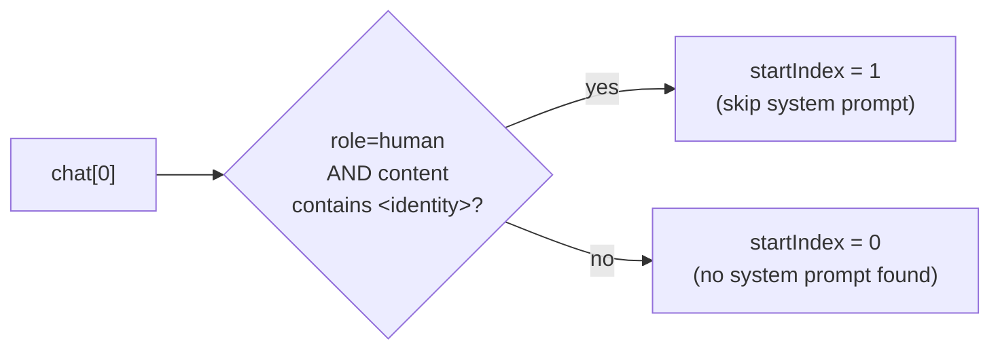
```mermaid
flowchart LR
    C1["chat[0]"] --> CHECK{"role=human<br/>AND content<br/>contains &lt;identity&gt;?"}
    CHECK -->|"yes"| SKIP["startIndex = 1<br/>(skip system prompt)"]
    CHECK -->|"no"| KEEP["startIndex = 0<br/>(no system prompt found)"]
```

### 4.3 Role Mapping

| Kiro Role | AgentMessage Role |
|---|---|
| `"human"` | `"user"` |
| `"bot"` | `"assistant"` |
| `"tool"` | `"tool"` |
| anything else | skipped (`null`) |

### 4.4 Tool Call Inference

Kiro does not provide structured tool call metadata. Tool calls are **inferred heuristically**: when a `bot` message is immediately followed by a `tool` message with empty content, the bot message is treated as a tool invocation.

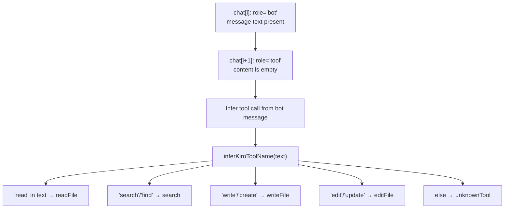
```mermaid
flowchart TD
    BOT["chat[i]: role='bot'<br/>message text present"]
    NEXT["chat[i+1]: role='tool'<br/>content is empty"]
    INFER["Infer tool call from bot message"]
    NAME["inferKiroToolName(text)"]

    BOT --> NEXT --> INFER --> NAME

    NAME --> R1["'read' in text → readFile"]
    NAME --> R2["'search'/'find' → search"]
    NAME --> R3["'write'/'create' → writeFile"]
    NAME --> R4["'edit'/'update' → editFile"]
    NAME --> R5["else → unknownTool"]
```

### 4.5 Project Resolution Pipeline

Kiro's project resolution combines multiple signal sources into a candidate pool, then runs them through the three-tier rule cascade.

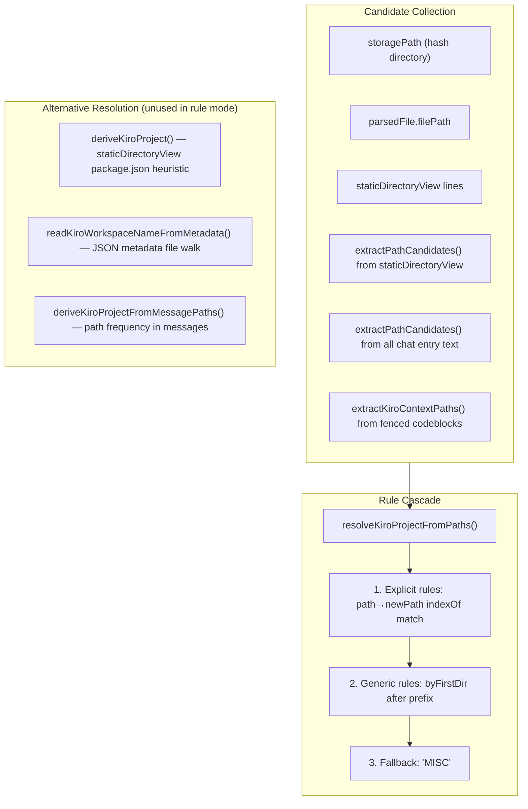
```mermaid
flowchart TD
    subgraph Candidates["Candidate Collection"]
        C1["storagePath (hash directory)"]
        C2["parsedFile.filePath"]
        C3["staticDirectoryView lines"]
        C4["extractPathCandidates() from staticDirectoryView"]
        C5["extractPathCandidates() from all chat entry text"]
        C6["extractKiroContextPaths() from fenced codeblocks"]
    end

    subgraph Rules["Rule Cascade"]
        R1["resolveKiroProjectFromPaths()"]
        R2["1. Explicit rules: path→newPath indexOf match"]
        R3["2. Generic rules: byFirstDir after prefix"]
        R4["3. Fallback: 'MISC'"]
        R1 --> R2 --> R3 --> R4
    end

    Candidates --> R1

    subgraph AltResolution["Alternative Resolution (unused in rule mode)"]
        A1["deriveKiroProject() — staticDirectoryView package.json heuristic"]
        A2["readKiroWorkspaceNameFromMetadata() — JSON metadata file walk"]
        A3["deriveKiroProjectFromMessagePaths() — path frequency in messages"]
    end
```

The rule cascade is identical in structure to Cursor's, reading from `cc.json`:
- `projectMappingRules` under the `Kiro` harness config
- `genericProjectMappingRules` under `Kiro` or at machine level

### 4.6 Context Extraction

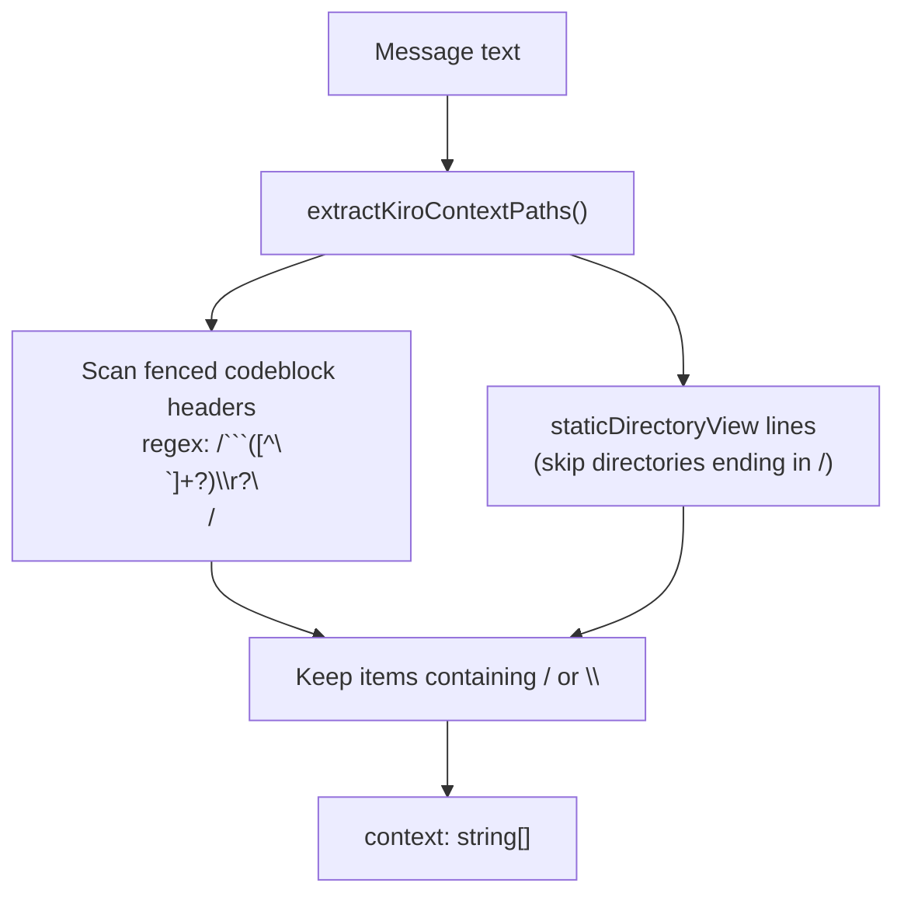
```mermaid
flowchart TD
    MSG["Message text"] --> FP["extractKiroContextPaths()"]
    FP --> FENCED["Scan fenced codeblock headers<br/>regex: /```([^\\n`]+?)\\r?\\n/"]
    FP --> SDV["staticDirectoryView lines<br/>(skip directories ending in /)"]
    FENCED --> FILTER["Keep items containing / or \\"]
    SDV --> FILTER
    FILTER --> PATHS["context: string[]"]
```

### 4.7 AgentMessage Field Mapping

| AgentMessage Field | Source |
|---|---|
| **id** | `generateMessageId(sessionId, role, mtimeMs-index, prefix)` |
| **sessionId** | `payload.executionId` → fallback: filename without `.chat` |
| **role** | `mapKiroRole(entry.role)`: human→user, bot→assistant, tool→tool |
| **model** | `payload.metadata.modelId` for assistant messages, `null` for others |
| **message** | `entry.content` (raw string) |
| **context** | `extractKiroContextPaths(message, staticDirectoryView)` |
| **project** | `resolveKiroProjectFromPaths(candidates, ruleSet)` |
| **parentId** | Previous message ID in session (sequential chaining) |
| **tokenUsage** | `null` (not available in Kiro format) |
| **toolCalls** | Inferred: `[{ name: inferKiroToolName(text), context: [], results: [] }]` when bot→tool pattern matches |
| **rationale** | `[]` |
| **source** | Path to `-RAW` copy of the `.chat` file |
| **dateTime** | `DateTime.fromMillis(file.mtimeMs)` — Kiro doesn't embed per-message timestamps, so file modification time is used for the entire session |

---

## 5. VS Code Harness

**Module**: [`src/harness/vscode.ts`](../../../src/harness/vscode.ts) (~680 lines)
**Source format**: `.json` (full session) and `.jsonl` (incremental patches) — both in `chatSessions/`
**Source location**: `~/.../workspaceStorage/<hash>/chatSessions/`
**Caching**: File-level (size + mtime via `isSourceFileCached`)
**Raw archival**: Verbatim file copy via `copyRawSourceFile`

### 5.1 Source Data Structure (`.json` format)

The legacy format contains complete self-contained session objects.

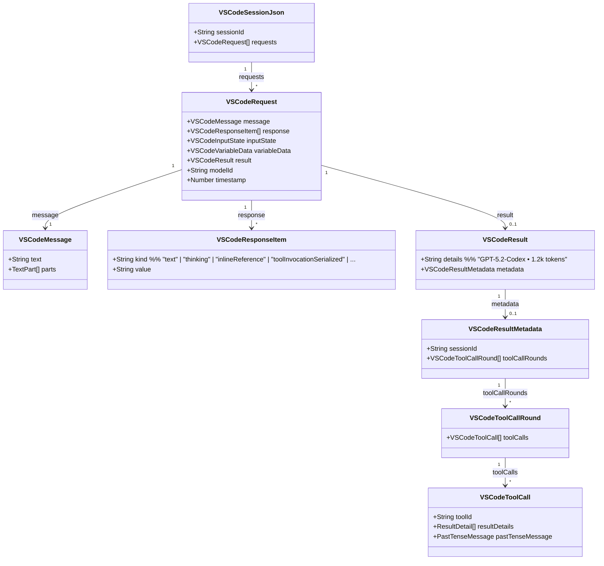
```mermaid
classDiagram
    class VSCodeSessionJson {
        +String sessionId
        +VSCodeRequest[] requests
    }

    class VSCodeRequest {
        +VSCodeMessage message
        +VSCodeResponseItem[] response
        +VSCodeInputState inputState
        +VSCodeVariableData variableData
        +VSCodeResult result
        +String modelId
        +Number timestamp
    }

    class VSCodeMessage {
        +String text
        +TextPart[] parts
    }

    class VSCodeResponseItem {
        +String kind     %% "text" | "thinking" | "inlineReference" | "toolInvocationSerialized" | ...
        +String value
    }

    class VSCodeResult {
        +String details           %% "GPT-5.2-Codex • 1.2k tokens"
        +VSCodeResultMetadata metadata
    }

    class VSCodeResultMetadata {
        +String sessionId
        +VSCodeToolCallRound[] toolCallRounds
    }

    class VSCodeToolCallRound {
        +VSCodeToolCall[] toolCalls
    }

    class VSCodeToolCall {
        +String toolId
        +ResultDetail[] resultDetails
        +PastTenseMessage pastTenseMessage
    }

    VSCodeSessionJson "1" --> "*" VSCodeRequest : requests
    VSCodeRequest "1" --> "1" VSCodeMessage : message
    VSCodeRequest "1" --> "*" VSCodeResponseItem : response
    VSCodeRequest "1" --> "0..1" VSCodeResult : result
    VSCodeResult "1" --> "0..1" VSCodeResultMetadata : metadata
    VSCodeResultMetadata "1" --> "*" VSCodeToolCallRound : toolCallRounds
    VSCodeToolCallRound "1" --> "*" VSCodeToolCall : toolCalls
```

### 5.2 Source Data Structure (`.jsonl` incremental format)

The newer format uses a three-kind patch system. Each line is a JSON object with a `kind` field.

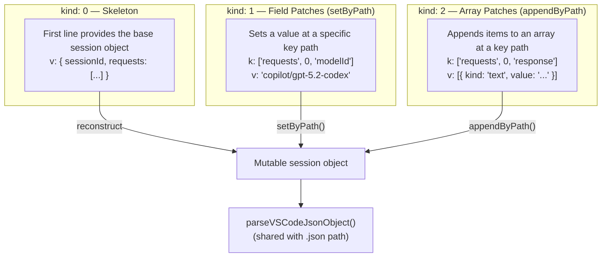
```mermaid
flowchart TD
    subgraph Kind0["kind: 0 — Skeleton"]
        K0["First line provides the base session object<br/>v: { sessionId, requests: [...] }"]
    end

    subgraph Kind1["kind: 1 — Field Patches (setByPath)"]
        K1["Sets a value at a specific key path<br/>k: ['requests', 0, 'modelId']<br/>v: 'copilot/gpt-5.2-codex'"]
    end

    subgraph Kind2["kind: 2 — Array Patches (appendByPath)"]
        K2["Appends items to an array at a key path<br/>k: ['requests', 0, 'response']<br/>v: [{ kind: 'text', value: '...' }]"]
    end

    K0 -->|"reconstruct"| SESSION["Mutable session object"]
    K1 -->|"setByPath()"| SESSION
    K2 -->|"appendByPath()"| SESSION
    SESSION --> PARSE["parseVSCodeJsonObject()<br/>(shared with .json path)"]
```

The `setByPath()` and `appendByPath()` functions walk the key path array (which can contain both string keys and numeric indices) to apply patches to the mutable session reconstruction.

### 5.3 Response Item Separation

VS Code responses are arrays of typed items. The harness separates them by `kind`:

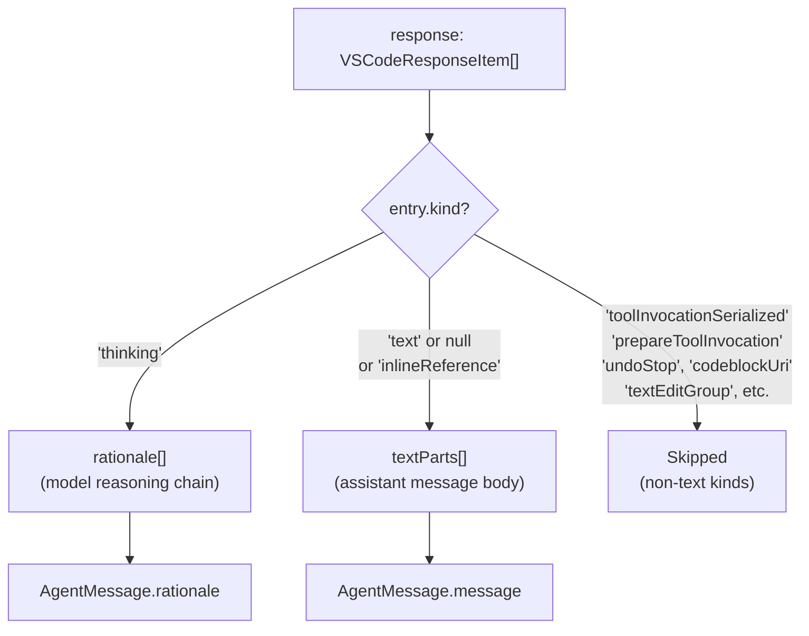
```mermaid
flowchart TD
    RESP["response: VSCodeResponseItem[]"] --> SWITCH{"entry.kind?"}

    SWITCH -->|"'thinking'"| RAT["rationale[]<br/>(model reasoning chain)"]
    SWITCH -->|"'text' or null<br/>or 'inlineReference'"| TEXT["textParts[]<br/>(assistant message body)"]
    SWITCH -->|"'toolInvocationSerialized'<br/>'prepareToolInvocation'<br/>'undoStop', 'codeblockUri'<br/>'textEditGroup', etc."| SKIP["Skipped<br/>(non-text kinds)"]

    RAT --> MSG["AgentMessage.rationale"]
    TEXT --> MSG2["AgentMessage.message"]
```

### 5.4 Tool Call Extraction (Dual Path)

Tool calls come from two sources depending on the file format:

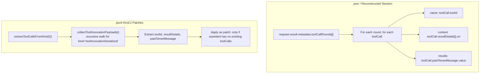
```mermaid
flowchart TD
    subgraph JSON_Path[".json / Reconstructed Session"]
        J1["request.result.metadata.toolCallRounds[]"]
        J2["For each round, for each toolCall:"]
        J3["name: toolCall.toolId"]
        J4["context: toolCall.resultDetails[].uri"]
        J5["results: toolCall.pastTenseMessage.value"]
        J1 --> J2 --> J3 & J4 & J5
    end

    subgraph JSONL_Path[".jsonl Kind:2 Patches"]
        L1["extractToolCallsFromKind2()"]
        L2["collectToolInvocationPayloads()<br/>recursive walk for kind='toolInvocationSerialized'"]
        L3["Extract toolId, resultDetails, pastTenseMessage"]
        L4["Apply as patch: only if assistant has no existing toolCalls"]
        L1 --> L2 --> L3 --> L4
    end
```

### 5.5 Project Resolution

VS Code uses the simplest project resolution: read `workspace.json` from the parent storage directory.

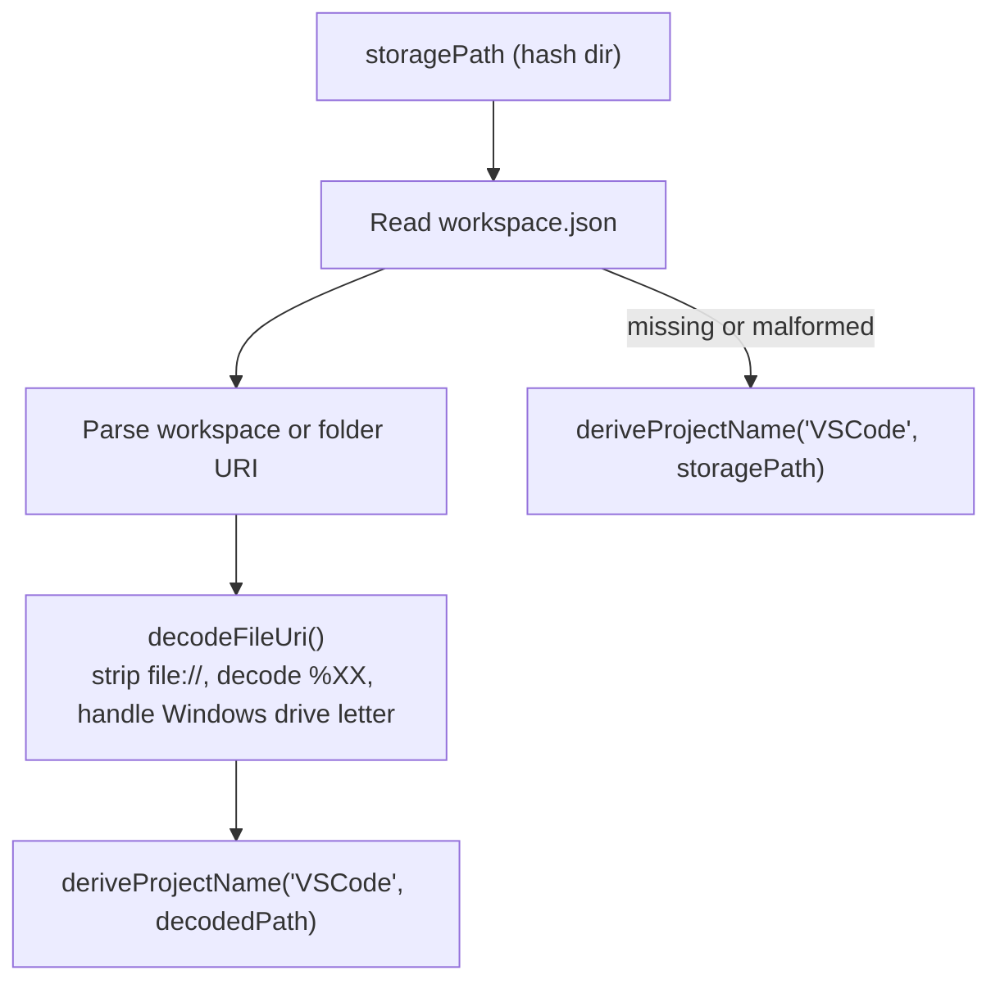
```mermaid
flowchart TD
    SP["storagePath (hash dir)"] --> WJ["Read workspace.json"]
    WJ --> PARSE["Parse workspace or folder URI"]
    PARSE --> DECODE["decodeFileUri()<br/>strip file://, decode %XX, handle Windows drive letter"]
    DECODE --> DPN["deriveProjectName('VSCode', decodedPath)"]
    WJ -->|"missing or malformed"| FALLBACK["deriveProjectName('VSCode', storagePath)"]
```

### 5.6 Model Resolution Priority

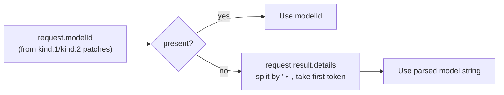
```mermaid
flowchart LR
    MID["request.modelId<br/>(from kind:1/kind:2 patches)"] --> CHECK{"present?"}
    CHECK -->|"yes"| USE["Use modelId"]
    CHECK -->|"no"| DET["request.result.details<br/>split by ' • ', take first token"]
    DET --> USE2["Use parsed model string"]
```

### 5.7 AgentMessage Field Mapping

Each `request` in the session produces a **user + assistant message pair**.

| AgentMessage Field | User Message | Assistant Message |
|---|---|---|
| **id** | `generateMessageId(sessionId, "user", timestamp-index-u, prefix)` | `generateMessageId(sessionId, "assistant", timestamp-index-a, prefix)` |
| **sessionId** | `request.result.metadata.sessionId` → `parsed.sessionId` → filename stem | Same |
| **role** | `"user"` | `"assistant"` |
| **model** | `null` | `request.modelId` → `result.details` first segment |
| **message** | `request.message.text` → fallback: `parts[].text` joined | Response items with kind `"text"` / `null` / `"inlineReference"` joined |
| **context** | `extractVSCodeContext()`: file-kind variables + file-kind attachments | Same as user (shared per request) |
| **project** | `resolveVSCodeProjectName(storagePath)` via `workspace.json` | Same |
| **parentId** | `null` | User message's ID (paired) |
| **tokenUsage** | `null` | `null` |
| **toolCalls** | `[]` | `extractVSCodeToolCallsFromRequest()` from `result.metadata.toolCallRounds` |
| **rationale** | `[]` | Response items with `kind: "thinking"` |
| **source** | Path to `-RAW` copy of the source file | Same |
| **dateTime** | `request.timestamp` (ms) → fallback: file mtime | Same |

---

## 6. OpenCode Harness

**Module**: [`src/harness/opencode.ts`](../../../src/harness/opencode.ts) (~440 lines)
**Source format**: SQLite database (`opencode.db`)
**Source location**: `~/.local/share/opencode/opencode.db`
**Caching**: None (database-level; re-read every run, like Cursor)
**Raw archival**: JSON dump per session via `writeRawSourceData`

### 6.1 Source Database Structure

OpenCode stores all data in a single SQLite database with WAL journaling. Three tables are relevant:

```mermaid
erDiagram
    session {
        TEXT id PK "e.g. ses_2faa00eb1ffe..."
        TEXT project_id "FK to project.id"
        TEXT directory "working directory (project source)"
        TEXT title "AI-generated title"
        TEXT slug "human-readable slug"
        INTEGER time_created "epoch ms"
        INTEGER time_updated "epoch ms"
    }

    message {
        TEXT id PK "e.g. msg_d055ff166001..."
        TEXT session_id "FK to session.id"
        INTEGER time_created "epoch ms"
        INTEGER time_updated "epoch ms"
        TEXT data "JSON blob (role, model, tokens, etc.)"
    }

    part {
        TEXT id PK "e.g. prt_d055ff169001..."
        TEXT message_id "FK to message.id"
        TEXT session_id "FK to session.id"
        INTEGER time_created "epoch ms"
        TEXT data "JSON blob (content atom)"
    }

    session ||--o{ message : "has"
    message ||--o{ part : "has"
```

### 6.2 Step-Based Message Architecture

OpenCode's defining characteristic is its **step-based architecture**: one user prompt produces N `message` rows on the assistant side (one per tool-call cycle), all linked by a shared `parentID`. The harness must consolidate these into a single `AgentMessage`.

```
USER MSG (msg_1)
  └─ PART: text (user's prompt)

ASSISTANT MSG (msg_2, parentID=msg_1, finish=tool-calls)
  ├─ PART: step-start
  ├─ PART: reasoning  ← thinking
  ├─ PART: tool (read) ← tool call
  └─ PART: step-finish (reason=tool-calls)

ASSISTANT MSG (msg_3, parentID=msg_1, finish=tool-calls)  ← SAME parent!
  ├─ PART: step-start
  ├─ PART: reasoning
  ├─ PART: tool (write)
  └─ PART: step-finish (reason=tool-calls)

ASSISTANT MSG (msg_4, parentID=msg_1, finish=stop)  ← final step
  ├─ PART: step-start
  ├─ PART: reasoning
  ├─ PART: text  ← final response text
  └─ PART: step-finish (reason=stop)
```

### 6.3 Part Types

Parts are the content atoms. Five types observed:

| Part Type | Content | Maps To |
|---|---|---|
| `text` | User prompt text or assistant response text | `AgentMessage.message` |
| `reasoning` | Model thinking/rationale | `AgentMessage.rationale[]` |
| `tool` | Tool invocation with callID, tool name, state (input/output) | `AgentMessage.toolCalls[]` |
| `step-start` | Marks beginning of a processing step | Ignored |
| `step-finish` | Marks end of step with token/cost summary | `AgentMessage.tokenUsage` (summed) |

### 6.4 Consolidation Pipeline

```mermaid
flowchart TD
    START["Open opencode.db (readonly)"] --> S1["Query all sessions"]
    S1 --> S2["For each session: query messages + parts"]
    S2 --> S3["Build Map<messageId → Part[]>"]
    S3 --> S4["Separate user vs assistant messages"]

    S4 --> U["User messages → AgentMessage (role=user)<br/>text parts joined as message body"]

    S4 --> A1["Group assistant messages by parentID"]
    A1 --> A2["For each group, consolidate:<br/>text → message body<br/>reasoning → rationale[]<br/>tool → toolCalls[]<br/>step-finish tokens → tokenUsage (summed)"]
    A2 --> A3["Single AgentMessage (role=assistant)<br/>per user prompt"]

    U --> PAIR["Pair: user msg → consolidated assistant"]
    A3 --> PAIR
    PAIR --> RAW["Write raw JSON to -RAW archive"]
    RAW --> EMIT["AgentMessage[]"]
```

### 6.5 AgentMessage Field Mapping

| AgentMessage Field | User Messages | Assistant Messages (Consolidated) |
|---|---|---|
| **id** | `generateMessageId(sessionId, "user", time_created, prefix)` | `generateMessageId(sessionId, "assistant", time_created, prefix)` |
| **sessionId** | `session.id` | Same |
| **role** | `"user"` | `"assistant"` |
| **model** | `null` | `firstMessage.data.modelID` (e.g. `"big-pickle"`) |
| **message** | All `text` parts joined | All `text` parts across all steps joined |
| **context** | `[]` | `[]` |
| **project** | `sessionProject(session.directory)` → last path segment | Same |
| **parentId** | `null` | `null` |
| **tokenUsage** | `null` | Summed `input` + `output` from all `step-finish` parts |
| **toolCalls** | `[]` | All `tool` parts: `{ name: part.tool, context: [filePath], results: [output] }` |
| **rationale** | `[]` | All `reasoning` parts' text |
| **source** | `""` (set by orchestrator) | Same |
| **dateTime** | `DateTime.fromMillis(message.time_created)` | `DateTime.fromMillis(firstMessage.time_created)` |

### 6.6 FileWatcher Integration

OpenCode requires specific FileWatcher configuration because its source is a live SQLite database with WAL journaling:

- **Extension filter**: `[".db", ".json"]` — accepts changes to the main database file and session diff `.json` files, but **filters out `.db-shm` and `.db-wal`** companion files. This is critical: without this filter, closing OpenCode triggers an infinite loop where the WAL checkpoint modifies `.db-shm`, FileWatcher detects it, the harness opens the DB (which may touch `.db-shm` again), and so on indefinitely.
- **Debounce**: 5000ms (same as Cursor) — since the live SQLite DB receives frequent flushes during active sessions.
- **Watch mode**: Recursive directory watch (not single-file like Cursor).

### 6.7 Codex Harness

**Module**: [`src/harness/codex.ts`](../../../src/harness/codex.ts)  
**Source format**: JSONL event logs (`rollout-*.jsonl`)  
**Source location**: `~/.codex/sessions/YYYY/MM/DD/`  
**Caching**: File-level (size + mtime via `isSourceFileCached`)  
**Raw archival**: Verbatim file copy via `copyRawSourceFile`

Codex logs contain many event types, including metadata and duplicated message projections. The harness uses `event_msg` records as the canonical message source and ignores prompt/config fluff (`session_meta.base_instructions`, duplicated `response_item.message` rows, and terminal `task_complete.last_agent_message` summaries).

```mermaid
flowchart TD
    S1["Scan rollout-*.jsonl recursively"] --> S2["Cache check (size + mtime)"]
    S2 -->|"cached"| S8["Skip file"]
    S2 -->|"new/modified"| S3["Parse JSONL lines defensively"]
    S3 --> S4["Extract metadata maps:<br/>session_meta + turn_context"]
    S3 --> S5["Canonical chat stream:<br/>event_msg user_message + agent_message"]
    S3 --> S6["Tool stream:<br/>response_item function_call/custom_tool_call + outputs"]
    S4 --> S7["Turn assembly:<br/>task_started boundaries + model attribution"]
    S5 --> S7
    S6 --> S7
    S7 --> S9["Attach turn toolCalls to terminal assistant message"]
    S9 --> S10["Emit AgentMessage[] (dedup by id)"]
    S8 --> S10
```

#### 6.7.1 Dedup/Filtering Policy

- Keep as canonical conversation text:
  - `event_msg.payload.type = "user_message"`
  - `event_msg.payload.type = "agent_message"`
- Use only for metadata:
  - `session_meta`
  - `turn_context`
  - `event_msg.task_started` / `task_complete` / `turn_aborted`
- Use only for tools:
  - `response_item.function_call` / `custom_tool_call`
  - `response_item.function_call_output` / `custom_tool_call_output`
- Ignore as duplicate/non-conversation text:
  - `response_item.message` (all roles)
  - `event_msg.task_complete.last_agent_message`
  - token/accounting events and wrapper payloads

#### 6.7.2 AgentMessage Field Mapping

| AgentMessage Field | Source |
|---|---|
| **id** | `generateMessageId(sessionId, role, timestampMillis, messagePrefix)` |
| **sessionId** | `session_meta.payload.id` → fallback: filename stem |
| **role** | `event_msg.user_message` → `user`; `event_msg.agent_message` → `assistant` |
| **model** | Assistant: `turn_context.payload.model` → fallback `session_meta.payload.model_provider`; User: `null` |
| **message** | `event_msg.payload.message` (trimmed, wrappers removed) |
| **project** | `deriveProjectName("Codex", session_meta.payload.cwd)` → fallback source-path basename |
| **parentId** | Sequential chain in emitted order |
| **toolCalls** | Turn-level calls correlated by `call_id`, attached to terminal assistant message in the turn |
| **rationale** | `[]` (not reliably extractable from current Codex JSONL payloads) |
| **source** | Path to `-RAW` copy of the source JSONL |
| **dateTime** | Top-level record `timestamp` parsed as ISO |

#### 6.7.3 FileWatcher Integration

- **Extension filter**: `[".jsonl"]`
- **Debounce**: 1000ms (same class as Claude Code / VS Code file-based harnesses)
- **Watch mode**: Recursive directory watch

---

## 7. Cross-Harness Comparison

### 7.1 Source Format Comparison

```mermaid
flowchart LR
    subgraph Formats["Source Formats"]
        CC["Claude Code<br/>.jsonl per session<br/>(line-delimited JSON)"]
        CU["Cursor<br/>state.vscdb<br/>(SQLite database)"]
        KI["Kiro<br/>.chat per session<br/>(single JSON object)"]
        VS["VS Code<br/>.json + .jsonl<br/>(full + incremental patches)"]
        OC["OpenCode<br/>opencode.db<br/>(SQLite database)"]
        CX["Codex<br/>rollout-*.jsonl<br/>(event log JSONL)"]
    end
```

### 7.2 Field Population Matrix

This matrix shows which harness populates which `AgentMessage` fields with meaningful data versus defaults.

| Field | Claude Code | Cursor (Bubbles) | Cursor (ItemTable) | Kiro | VS Code | OpenCode | Codex |
|---|---|---|---|---|---|---|---|
| **id** | `uuid` from source | Generated | Generated | Generated | Generated | Generated | Generated |
| **sessionId** | From JSONL field | From DB key segment | From JSON payload | `executionId` | From result metadata | `session.id` | `session_meta.id` |
| **model** | `message.model` | `pickModel()` + session map | `pickModel()` / `modelId` / `details` | `metadata.modelId` | `modelId` / `details` | `message.data.modelID` | `turn_context.model` / `session_meta.model_provider` |
| **message** | Text content items | `parsed.text` | `normalizeMessageText()` | `entry.content` | Text response items | `text` parts joined (consolidated) | Canonical `event_msg` text (`user_message` / `agent_message`) |
| **context** | `<ide_opened_file>` tags | Path extraction from multiple fields | Request variables/attachments | Fenced codeblocks + directory view | Request variables/attachments | — | — |
| **project** | `deriveProjectName(cwd)` | Workspace inference (3-stage) | `MISC` fallback | Rule cascade from path candidates | `workspace.json` | `session.directory` last segment | `session_meta.cwd` last segment |
| **parentId** | `parentUuid` | Sequential chain | Sequential chain | Sequential chain | Paired (user→assistant) | — | Sequential chain |
| **tokenUsage** | `usage.input_tokens` / `output_tokens` | — | — | — | — | Summed from `step-finish` parts | — |
| **toolCalls** | `tool_use` + `tool_result` correlation | — | — | Heuristic inference | `toolCallRounds` metadata | `tool` parts (name, filePath, output) | Correlated `response_item` call/output pairs by `call_id` |
| **rationale** | — | — | — | — | `thinking` response items | `reasoning` parts | — |
| **dateTime** | Per-message timestamp (ISO / epoch) | Per-bubble (12 candidates) | Per-request / container | File mtime (session-level) | Per-request timestamp | Per-message `time_created` (epoch ms) | Top-level event timestamp |

### 7.3 Caching & Performance

| Harness | Caching Strategy | Cache Granularity | Skip Mechanism |
|---|---|---|---|
| **Claude Code** | Size + mtime comparison | Per `.jsonl` file | `isSourceFileCached()` before parsing |
| **Cursor** | None | N/A (single DB file) | Full re-read every run |
| **Kiro** | Size + mtime comparison | Per `.chat` file | `isSourceFileCached()` after project resolution |
| **VS Code** | Size + mtime comparison | Per `.json`/`.jsonl` file | `isSourceFileCached()` before parsing |
| **OpenCode** | None | N/A (single DB file) | Full re-read every run (like Cursor) |
| **Codex** | Size + mtime comparison | Per `rollout-*.jsonl` file | `isSourceFileCached()` before parsing |

### 7.4 Raw Archival Strategy

| Harness | Method | Archive Content |
|---|---|---|
| **Claude Code** | `copyRawSourceFile()` | Verbatim `.jsonl` copy |
| **Cursor** | `writeRawSourceData()` | JSON dump of parsed bubble records per session |
| **Kiro** | `copyRawSourceFile()` | Verbatim `.chat` copy |
| **VS Code** | `copyRawSourceFile()` | Verbatim `.json` or `.jsonl` copy |
| **OpenCode** | `writeRawSourceData()` | JSON dump of session metadata + messages + parts |
| **Codex** | `copyRawSourceFile()` | Verbatim rollout JSONL copy |

### 7.5 Project Resolution Complexity

```mermaid
flowchart TD
    subgraph Simple["Simple (Explicit in Source)"]
        CC["Claude Code<br/>cwd field → last path segment"]
        VS["VS Code<br/>workspace.json → URI decode"]
        OC["OpenCode<br/>session.directory → last path segment"]
        CX["Codex<br/>session_meta.cwd → last path segment"]
    end

    subgraph Complex["Complex (Heuristic + Rules)"]
        CU["Cursor<br/>3-stage workspace inference<br/>+ rule cascade"]
        KI["Kiro<br/>multi-source candidate pool<br/>+ rule cascade"]
    end

    Simple ~~~ Complex
```

---

## 8. Shared Utilities

All harnesses depend on a common utility layer. The key shared functions are:

| Utility | Module | Used By | Purpose |
|---|---|---|---|
| `generateMessageId()` | `hashId.ts` | All | SHA-256 → 16 hex chars deterministic ID |
| `deriveProjectName()` | `pathHelpers.ts` | CC, KI, VS | Last path segment extraction |
| `sanitizeFilename()` | `pathHelpers.ts` | CU, KI, OC | Filesystem-safe name transformation |
| `isSourceFileCached()` | `rawCopier.ts` | CC, KI, VS | Size + mtime comparison for cache check |
| `copyRawSourceFile()` | `rawCopier.ts` | CC, KI, VS | Verbatim file copy with mtime preservation |
| `writeRawSourceData()` | `rawCopier.ts` | CU, OC | JSON dump for database-sourced data |

### Shared Code Duplication (Cursor ↔ Kiro)

The following functions are character-for-character identical between `cursor.ts` and `kiro.ts`:

| Function | Purpose |
|---|---|
| `normalizeRulePath()` | Lowercase slash-normalized path comparison |
| `getFirstDirAfterPrefix()` | First directory segment after a prefix match |
| `as{Harness}ProjectMappingRule()` | Validate explicit rule shape |
| `as{Harness}GenericProjectMappingRule()` | Validate generic rule shape |
| `load{Harness}ProjectRuleSet()` | Read rules from `cc.json` |

This is documented as architectural risk 12.4 in the parent architecture document.

---

## 9. Fields Never Populated by Any Harness

The following `AgentMessage` fields are initialized to empty values by all harnesses and are never populated during ingestion:

| Field | Default | Notes |
|---|---|---|
| `machine` | `""` | Stamped by orchestrator (`ContextCore.ts`) after harness returns |
| `subject` | `""` | Generated by `SubjectGenerator` via `StorageWriter` |
| `symbols` | `[]` | Reserved; symbol data lives in the `subject` string via SubjectGenerator |
| `history` | `[]` | Reserved for future use |
| `tags` | `[]` | Reserved for future use |
