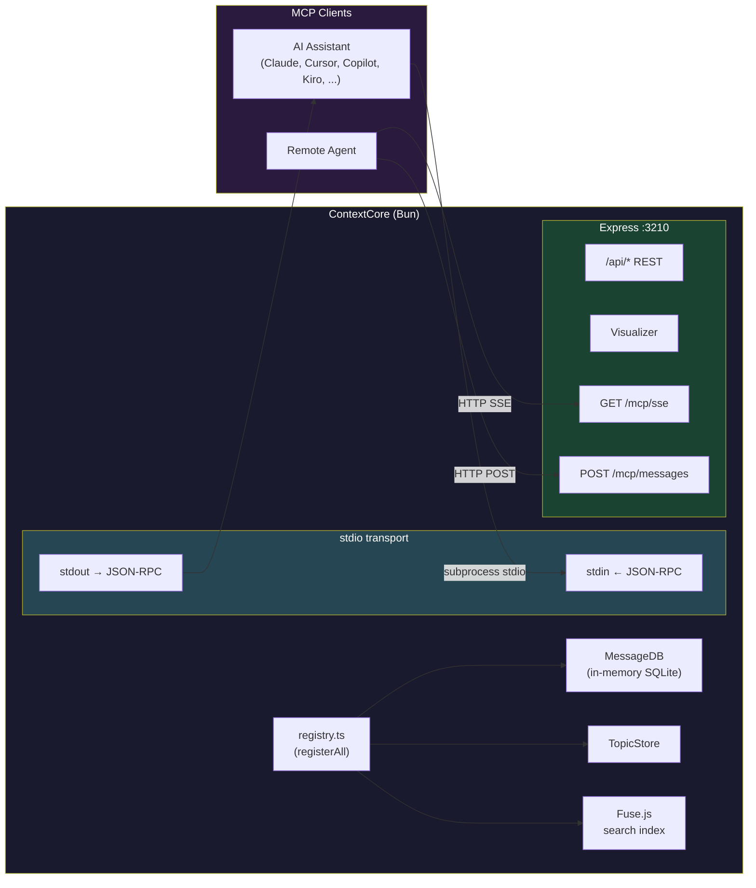
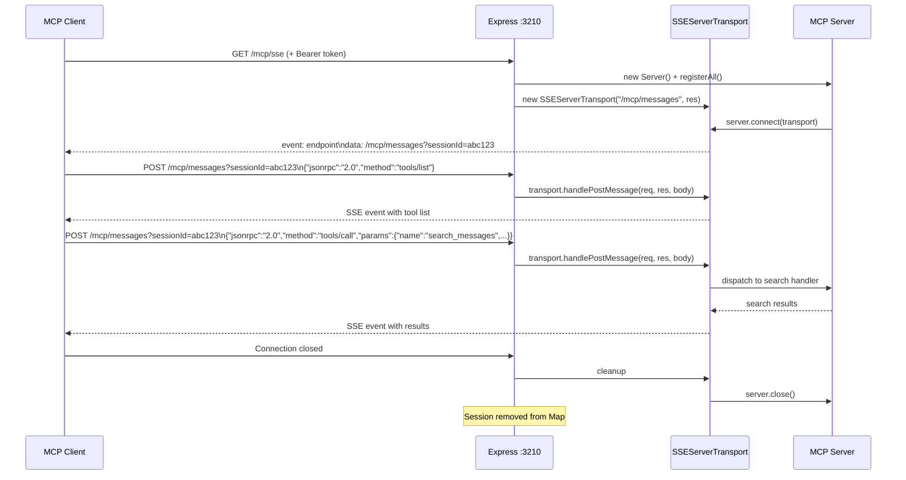
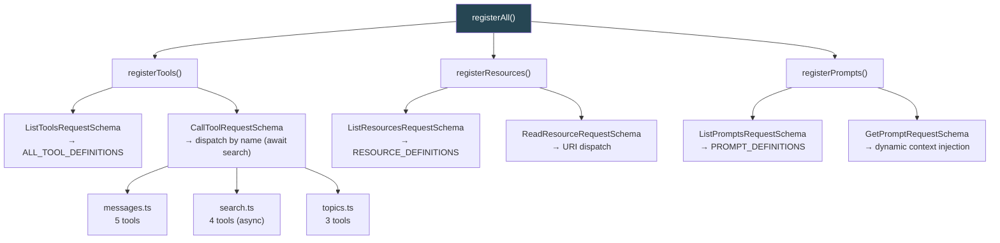
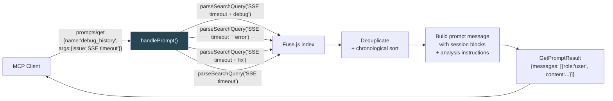
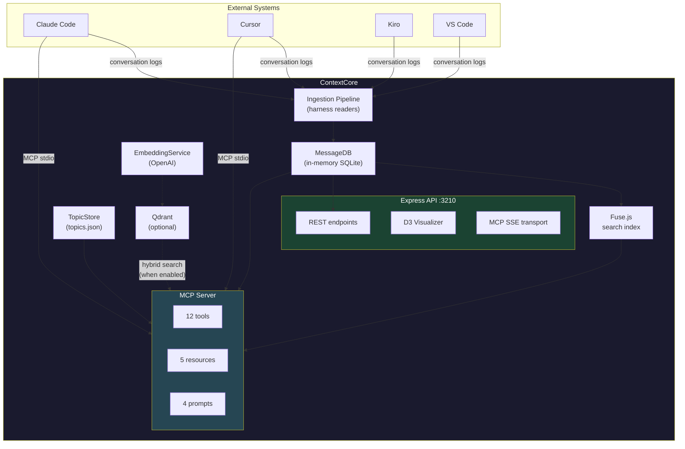

# ContextCore MCP Server — Architecture

**Date**: 2026-03-22
**Status**: Implemented
**Scope**: MCP server exposing ContextCore's conversation archive to LLMs via tools, resources, and prompts
**Parent**: [`archi-context-core-level0.md`](../archi-context-core-level0.md)
**Related**: [`archi-search.md`](../search/archi-search.md), [`archi-cxs.md`](../../protocol/archi-cxs.md)
**Implementation plans**: [`r2m1-mcp-implementation.md`](../../upgrades/2026-03/r2m1-mcp-implementation.md), [`r2m3-mcp-iteration-3.md`](../../upgrades/2026-03/r2m3-mcp-iteration-3.md)

---

## 1. What This Is

ContextCore ingests and stores developer-AI conversations from four IDE harnesses (Claude Code, Cursor, Kiro, VS Code). The MCP server turns this archive into a **live, queryable memory** that any MCP-capable LLM can access — searching past sessions, retrieving transcripts, browsing project metadata, and picking up where prior conversations left off.

The primary use case: **an LLM fixing a regression or continuing an abandoned task needs to understand what was discussed and decided before.** The MCP server is how it gets that context.

---

## 2. Architecture Overview

### 2.1 Process Model

The MCP server runs **inside the same Bun process** as ContextCore, sharing `MessageDB` (in-memory SQLite) and `TopicStore` directly — no serialization overhead. Two entry points serve different workflows:

| Entry Point          | Command         | What starts                                                                                                                          |
| -------------------- | --------------- | ------------------------------------------------------------------------------------------------------------------------------------ |
| `src/ContextCore.ts` | `bun run start` | Full pipeline: ingest + Express API + MCP stdio (if `MCP_ENABLED=true`) + MCP SSE (if `MCP_ENABLED=true` and `MCP_SSE_ENABLED=true`) |
| `src/mcp/serve.ts`   | `bun run mcp`   | Lightweight: load from storage + MCP stdio only (no ingestion, no Express; gated by `MCP_ENABLED`)                                   |

The standalone entry point (`bun run mcp`) is optimized for MCP clients that launch the server as a subprocess. It skips ingestion and Express, loading the persisted corpus from JSON files in ~1 second.

Runtime toggles:
- `MCP_ENABLED` (default `true`) controls MCP startup globally.
- `MCP_SSE_ENABLED` (default `false`) controls only SSE route mounting.

### 2.2 Dual Transport



**stdio**: The MCP client spawns `bun run mcp` as a child process. JSON-RPC messages flow over stdin/stdout. This is the standard local integration pattern — zero networking, zero configuration.

**SSE**: For remote or web-based MCP clients. `GET /mcp/sse` establishes a Server-Sent Events stream; `POST /mcp/messages?sessionId=X` sends messages back. Each SSE connection gets its own `Server` + `SSEServerTransport` pair. SSE is disabled by default and mounts only when `MCP_ENABLED=true` and `MCP_SSE_ENABLED=true`. Optional bearer token auth via `MCP_AUTH_TOKEN` env var.

### 2.3 SSE Session Lifecycle



---

## 3. Module Topology

```
src/mcp/
├── MCPServer.ts              Main server class (wraps SDK Server + StdioServerTransport); accepts optional VectorServices
├── serve.ts                  Standalone stdio entry point; optionally inits EmbeddingService + QdrantService
├── registry.ts               Registers all tools, resources, prompts; awaits async search handlers
├── formatters.ts             LLM-friendly text formatters (truncation, excerpts, hybrid score display)
├── tools/
│   ├── messages.ts           5 tools: get_message, get_session, list_sessions, query_messages, get_latest_threads
│   ├── search.ts             4 tools: search_messages, search_threads, search_thread_messages, search_by_symbol
│   └── topics.ts             3 tools: get_topics, get_topic, set_topic
├── prompts/
│   └── index.ts              4 prompts: explore_history, summarize_session, find_decisions, debug_history
├── resources/
│   └── index.ts              5 resources: cxc://stats, cxc://projects, cxc://harnesses, cxc://query-syntax, cxc://projects/{name}/sessions
├── transports/
│   └── sse.ts                SSE transport manager (Express route mounting, session Map, auth)
└── tests/                    20 test files, 242 tests (run via: bun run test)
    ├── messages.test.ts      Integration tests for message and session tools
    ├── resources.test.ts     Integration tests for write tools and resource handlers
    ├── search.test.ts        Integration tests for search tools (original suite + project substring matching)
    ├── test_search_messages.ts     Fixture-backed search_messages tests (subject, symbols, project substring, scope combos, role filtering)
    ├── test_search_threads.ts      Fixture-backed search_threads tests (subject, symbols, project substring, scope combos, date range, maxResults)
    ├── test_search_thread_messages.ts  search_thread_messages tests (query, field-only, combined, maxResults)
    ├── test_search_by_symbol.ts    search_by_symbol tests (word-boundary, case-sensitivity)
    ├── test_project_matching.ts    matchesAnyProject unit tests (substring, case-insensitive)
    ├── test_scope_resolution.ts    scope → project resolution integration tests
    ├── test_get_message.ts         get_message tests (known IDs, not-found, validation)
    ├── test_get_session.ts         get_session tests (multi-message, single-message, truncation)
    ├── test_get_latest_threads.ts  get_latest_threads tests (fromDate, limit, boundary cases)
    ├── test_cross_tool.ts          Cross-tool integration (search → get_message, search → get_session)
    ├── test_prompts.ts             Prompt handler tests (all 4 prompts)
    └── loadFixtures.ts             Shared fixture loader (messages_storyteller_nncharacter.json)
```

### 3.1 Registration Flow

All MCP capabilities are registered through a single function, `registerAll(server, db, topicStore, vectorServices?)`, called from both `MCPServer.ts` (stdio) and `transports/sse.ts` (per SSE session). This ensures both transports expose identical capabilities. The optional `vectorServices` parameter enables Qdrant hybrid search when `QDRANT_URL` and `OPENAI_API_KEY` are set.



---

## 4. Tool Reference

### 4.1 Message & Session Tools

| Tool                 | Input                                                                                            | Output                                                        | Use When                                                                                                |
| -------------------- | ------------------------------------------------------------------------------------------------ | ------------------------------------------------------------- | ------------------------------------------------------------------------------------------------------- |
| `get_message`        | `{ id, includeAssistantMessages? }`                                                              | Full message content + metadata                               | You have a specific message ID from search results                                                      |
| `get_session`        | `{ sessionId, maxMessages?, includeAssistantMessages? }`                                         | Chronological transcript (truncated at head+tail if >30 msgs) | You want the full conversation flow of a session                                                        |
| `list_sessions`      | `{ limit? }`                                                                                     | Session summaries sorted by recency                           | Browsing what conversations exist                                                                       |
| `query_messages`     | `{ role?, harness?, model?, project?, from?, to?, page?, pageSize?, includeAssistantMessages? }` | Filtered + paginated human messages (default)                 | Narrowing down by harness, project, date range, or role                                                 |
| `get_latest_threads` | `{ limit?, fromDate? }`                                                                          | Recent threads with first-message preview                     | Seeing what was worked on recently; `fromDate` filters to threads with activity on or after an ISO date |

### 4.2 Search Tools

| Tool                     | Input                                                                                           | Output                                                     | Use When                                                            |
| ------------------------ | ----------------------------------------------------------------------------------------------- | ---------------------------------------------------------- | ------------------------------------------------------------------- |
| `search_messages`        | `{ query?, subject?, symbols?, maxResults?, projects?, scope?, from?, to?, includeAssistantMessages? }` | Ranked human messages (default); all roles when opted in   | Finding specific content across all conversations                   |
| `search_threads`         | `{ query?, subject?, symbols?, maxResults?, projects?, scope?, from?, to? }`                            | Ranked sessions (deduplicated from message hits)           | Finding *which conversations* discussed a topic                     |
| `search_thread_messages` | `{ sessionId, query?, subject?, symbols?, maxResults?, includeAssistantMessages? }`             | Ranked human messages scoped to one thread (default)       | Drilling into a thread found via `search_threads`                   |
| `search_by_symbol`       | `{ symbol, maxResults?, caseSensitive?, includeAssistantMessages? }`                            | Human messages ranked by symbol occurrence count (default) | Finding which conversations discussed a code symbol most frequently |

**`query` (optional when `subject` or `symbols` are provided):**
- At least one of `query`, `subject`, or `symbols` must be present.
- When `query` is present: runs the full Fuse.js text search pipeline (+ Qdrant hybrid when available).
- When `query` is absent: field-only search using `subject`/`symbols` with relevance scoring.

**`subject` and `symbols` field filters (`search_messages`, `search_threads`, `search_thread_messages`):**
- `subject`: case-insensitive substring match against the AI-generated conversation subject. Example: `"tile rendering"`.
- `symbols`: case-insensitive substring match against the message's extracted code symbols array. Example: `"HexGrid"`.
- When combined with `query`, these narrow the full-text results. When used alone, they drive field-only search.

**`projects` filter (`search_messages` and `search_threads`):**
- Optional array of project name **patterns** (substring matching, case-insensitive). When omitted or empty, all projects are searched.
- A message matches if its project name contains any of the supplied patterns. Example: `["reach2"]` matches "reach2", "zz-reach2", "reach2-web".
- The user should tell the LLM which projects are relevant; the LLM passes them here to scope the search.
- Example: `["AXON", "NexusPlatform"]`
- Filtering is applied after Fuse.js scoring, so relevance ranking within the matched set is unchanged.

**`scope` filter (`search_messages` and `search_threads`):**
- Optional scope name (string). Resolved via ScopeStore → `projectIds[].project` → merged with explicit `projects`.
- Case-insensitive scope lookup. Returns an error if the scope name is not found in the ScopeStore.
- When both `scope` and `projects` are provided, the resulting project patterns are the union of both sets.

**`from`/`to` date filter (`search_messages` and `search_threads`):**
- Optional ISO datetime boundaries applied after text search.
- `from` is inclusive lower bound, `to` is inclusive upper bound.
- If `from` is provided and `to` is omitted, `to` defaults to current time.
- Example: `{ "query": "auth + middleware", "from": "2026-03-01", "to": "2026-03-15" }`

**Query syntax (`search_messages`, `search_threads`, `search_thread_messages`):**
- Simple: `authentication` (fuzzy match)
- Exact: `"error handling"` (quoted phrase)
- OR: `auth token` (space-separated — matches either term)
- AND: `JWT + refresh` (plus-separated — must match both terms)

**Qdrant hybrid search (when `QDRANT_URL` + `OPENAI_API_KEY` are set):**
- `search_messages`, `search_threads`, and `search_thread_messages` run Fuse.js + Qdrant in parallel via `hybridMerge()`.
- Results are merged by `SearchResults.merge()` with post-merge field filter safety net.
- Score display adapts: `Score: 85% (Q:91% | F:72%)` when Qdrant is active; plain `Score: 85%` otherwise.
- Qdrant failures are non-fatal — search falls back to Fuse-only gracefully.
- See [`archi-search.md` §13](../search/archi-search.md) for the full MCP ↔ HTTP parity mapping.

**`search_thread_messages` (new in iteration 3):**
- Requires `sessionId`; at least one of `query`, `subject`, or `symbols` must also be provided.
- When `query` is present: runs full Fuse.js (+ Qdrant) search, then filters results to the target session.
- When field-only: loads session messages via `db.getBySessionId()`, applies field filters.
- Output includes a thread context header (sessionId, subject, message count).

**Symbol search (search_by_symbol):**
- Uses word-boundary matching to find whole identifiers only
- Example: searching for `DB` won't match `MessageDB` (prevents false positives)
- Supports case-sensitive and case-insensitive matching (default: case-insensitive)
- Results ranked by occurrence count (how many times the symbol appears in each message)
- Useful for finding: which conversations discussed `MessageDB` the most, where `executeSearch` was implemented, all references to `TopicStore`, etc.

### 4.5 Message Role Filtering

**Role inventory** (from all 6 harness JSONs):

| Role          | Harnesses                                         | Description       |
| ------------- | ------------------------------------------------- | ----------------- |
| `"user"`      | ClaudeCode, Codex, Cursor, Kiro, OpenCode, VSCode | Human messages    |
| `"assistant"` | ClaudeCode, Codex, Cursor, Kiro, OpenCode, VSCode | AI/LLM responses  |
| `"tool"`      | Kiro only                                         | Tool call results |

**Default behavior**: All search and message-listing tools return only `role === "user"` messages by default. This prevents bloated AI responses from consuming LLM context windows.

**`includeAssistantMessages` parameter**: Available on all message-interacting tools. When `true`, returns all roles including assistant and tool messages.

| Tool                     | Default              | Effect when `true`                                     |
| ------------------------ | -------------------- | ------------------------------------------------------ |
| `search_messages`        | human-only (`false`) | Includes assistant messages in search results          |
| `search_thread_messages` | human-only (`false`) | Includes assistant messages within thread results      |
| `search_by_symbol`       | human-only (`false`) | Counts symbol occurrences in assistant messages too    |
| `query_messages`         | human-only (`false`) | Returns all roles (overrides default `role: "user"`)   |
| `get_message`            | all roles (`true`)   | When `false`, rejects non-human messages with an error |
| `get_session`            | all roles (`true`)   | When `false`, filters session to human messages only   |

**`query_messages` role interaction**: The explicit `role` parameter takes priority over `includeAssistantMessages`. When `role` is omitted and `includeAssistantMessages` is not `true`, the handler injects `role: "user"` into the DB query.

**Thread-level tools are not filtered**: `search_threads`, `list_sessions`, and `get_latest_threads` show the full human-AI conversation context and are not subject to role filtering.

### 4.3 Topic Tools

| Tool         | Input                        | Output                                           | Use When                                            |
| ------------ | ---------------------------- | ------------------------------------------------ | --------------------------------------------------- |
| `get_topics` | `{ limit? }`                 | All topic entries (AI summaries + custom labels) | Browsing session topics for orientation             |
| `get_topic`  | `{ sessionId }`              | Single topic entry                               | Checking what a session was about before loading it |
| `set_topic`  | `{ sessionId, customTopic }` | Confirmation                                     | Labeling a session for future discoverability       |

### 4.4 Advanced Analysis Tools — ⚠️ NOT YET IMPLEMENTED

> **Status**: These tools are **designed but not yet coded**. They exist only in this architecture document as future work. The MCP server does not register or expose them. Do not attempt to call them — they will return "Unknown tool" errors.

| Tool                         | Input                          | Output                                                                    | Use When                                                |
| ---------------------------- | ------------------------------ | ------------------------------------------------------------------------- | ------------------------------------------------------- |
| `get_conversation_summary`   | `{ sessionId }`                | Structured narrative: participants, duration, topics, decisions           | Quick understanding without reading the full transcript |
| `get_project_overview`       | `{ project }`                  | Activity summary: sessions, date range, harness breakdown, recent threads | Orienting yourself in a project's history               |
| `find_related_conversations` | `{ sessionId }` or `{ query }` | Sessions with overlapping subjects/symbols                                | Discovering related prior work                          |
| `get_developer_timeline`     | `{ days?, project? }`          | Chronological activity log grouped by day                                 | Understanding what was worked on and when               |

---

## 5. Resource Reference

Resources are browsable, structured data that require no search query. They answer "what exists?" questions.

| URI                              | What It Returns                                      | Example Use                             |
| -------------------------------- | ---------------------------------------------------- | --------------------------------------- |
| `cxc://stats`                    | Total messages, sessions, harness counts, date range | "How much data does ContextCore have?"  |
| `cxc://projects`                 | All projects with session counts and last activity   | "What projects are tracked?"            |
| `cxc://harnesses`                | Harness names, message counts, date ranges           | "Which IDEs have been used?"            |
| `cxc://query-syntax`             | Search query syntax reference and examples           | "How do I build AND/OR search queries?" |
| `cxc://projects/{name}/sessions` | Session list for a specific project                  | "What sessions exist for project X?"    |

---

## 6. Prompt Reference

Prompts are pre-built conversation starters that inject relevant context from the archive. Each prompt fetches fresh data at invocation time, not at registration time.

| Prompt              | Argument            | What It Builds                                                                                                                                                 |
| ------------------- | ------------------- | -------------------------------------------------------------------------------------------------------------------------------------------------------------- |
| `explore_history`   | `topic: string`     | Searches threads, returns top 10 matches with excerpts, asks LLM to identify themes and insights (supports OR/AND/phrase syntax)                               |
| `summarize_session` | `sessionId: string` | Loads full transcript (up to 50 messages), asks LLM to summarize decisions, outcomes, and follow-ups                                                           |
| `find_decisions`    | `component: string` | Multi-query search (component + "decision", + "architecture"), groups results by session, asks for chronological decision list (supports OR/AND/phrase syntax) |
| `debug_history`     | `issue: string`     | Multi-query search (issue + "debug", + "error", + "fix"), chronological ordering, asks for debugging narrative (supports OR/AND/phrase syntax)                 |

### 6.1 How Prompts Work Internally



Each prompt returns a single `user` role message containing:
1. The gathered context (threads, excerpts, sessions)
2. Structured analysis instructions telling the LLM what to extract

The LLM receives this as if it were a user message in the conversation, providing rich context for reasoning.

---

## 7. Response Formatting Strategy

LLM context windows are finite. All MCP tool responses are formatted as information-dense plain text, not raw JSON. **Search tools return only human (user) messages by default** — assistant/tool messages are excluded to prevent bloated AI responses from consuming context budgets. Pass `includeAssistantMessages: true` to include them when deep research is needed (see §4.5).

| Scenario                       | Strategy                                                                                                                      |
| ------------------------------ | ----------------------------------------------------------------------------------------------------------------------------- |
| Single message                 | Full content + all metadata (ID, session, role, model, harness, project, datetime, tokens, tool calls)                        |
| Session (≤30 messages)         | Full messages with `[datetime] ROLE [model]` headers                                                                          |
| Session (>30 messages)         | First 5 + last 5, with `[...{N} messages omitted...]` between                                                                 |
| Search results (≤20 hits)      | All results: score, matched terms, 300-char excerpt, session/harness/project/datetime (human-only by default)                 |
| Search results (>20 hits)      | Top 20 by score, with `(N more results not shown)` footer                                                                     |
| Search results (hybrid active) | `Score: 85% (Q:91% \| F:72%)` — shows combined, Qdrant, and Fuse components                                                   |
| Thread search results          | Same as search results but with thread context header (sessionId, subject, message count)                                     |
| Symbol search results          | Occurrence count, score, datetime (for triage), ID, session, subject, role, harness, project, excerpt (human-only by default) |
| Thread list                    | Compact: sessionId, subject, harness, messageCount, date range, first-message excerpt                                         |
| Topic list                     | sessionId + customTopic + aiSummary per entry                                                                                 |

Adaptive truncation: when a response exceeds ~8000 characters, detail is progressively reduced (shorter excerpts, fewer results) to stay within typical tool response budgets.

The `maxMessages` parameter on `get_session` lets clients control the truncation threshold (default 30).

---

## 8. Usage Examples — Fixing Regressions

This is the primary value proposition: an LLM encountering a regression can use the MCP server to understand what changed, when, and why.

### 8.1 "This feature used to work. What changed?"

A developer tells the LLM: *"The thread cards stopped scaling at zoom. This worked before."*

The LLM's investigation flow:

```
1. search_threads({ query: "thread cards zoom scaling" })
   → Finds 2 matching sessions from 2026-03-10

2. get_session({ sessionId: "abc123" })
   → Reads the full conversation where zoom scaling was first implemented

3. search_messages({ query: "thread cards + CSS" })
   → Finds a message from 2026-03-12 that changed the CSS grid layout

4. get_message({ id: "f7a3b2c1e9d04568" })
   → Reads the exact message where the breaking change was discussed

5. The LLM now knows:
   - The original zoom implementation used CSS transform: scale()
   - A later change switched to grid-based sizing
   - The grid change didn't preserve the zoom behavior
   → It can now write the fix with full context
```

### 8.2 "This endpoint returns wrong data. When did it break?"

```
1. search_threads({ query: "\"customTopic\" + search endpoint" })
   → Finds session where /search was updated, but customTopic wasn't wired in

2. get_topic({ sessionId: "the-session-id" })
   → Sees the AI summary: "Updated /search to read from topics.json"

3. get_session({ sessionId: "the-session-id" })
   → Reads the full implementation conversation, sees the field was added
     to /search but not to the serialization layer

4. find_related_conversations({ query: "customTopic serialization" })
   → Discovers an earlier session where customTopic was originally added
     to the data model — shows the correct serialization pattern
```

### 8.3 Using the `debug_history` Prompt

If the LLM prefers a pre-built investigation, it can use the prompt:

```
prompts/get: debug_history({ issue: "customTopic missing on Chat cards" })

→ Returns a structured message containing:
  - Chronological debugging sessions related to this issue
  - What was tried, what worked, what didn't
  - The LLM's analysis instructions

The LLM can then reason about the full debugging timeline
without manually searching.
```

---

## 9. Usage Examples — Continuing Abandoned Tasks

The second major use case: picking up a task that was started in a previous conversation but never finished.

### 9.1 "We started implementing Qdrant search but didn't finish"

```
1. explore_history prompt: explore_history({ topic: "Qdrant" })
   → Pre-built context with all Qdrant-related threads

2. The prompt response includes:
   - 8 matching sessions spanning 2 weeks
   - Session subjects: "Qdrant pipeline setup", "Qdrant search integration",
     "Analyzed Qdrant data — poor hit rate"
   - The LLM identifies which sessions are relevant

3. get_session({ sessionId: "qdrant-pipeline-session" })
   → Full transcript of the pipeline implementation

4. get_session({ sessionId: "qdrant-poor-hits-session" })
   → Full transcript of the investigation into poor hit rates

5. The LLM now understands:
   - What was implemented (embedding pipeline, collection management)
   - What's working (data is being indexed)
   - What's broken (hit rate is poor — likely a chunking issue)
   - What was discussed as next steps
   → It can resume the task with full context
```

### 9.2 "What decisions were made about the auth middleware rewrite?"

```
1. find_decisions prompt: find_decisions({ component: "auth middleware" })
   → Searches for "auth middleware + decision" and "auth middleware + architecture"
   → Returns excerpts from 4 sessions grouped by date

2. The LLM extracts:
   - Decision: Session tokens must not be stored in cookies (compliance)
   - Decision: Use JWTs with short TTL + refresh tokens
   - Open question: Should refresh tokens be stored server-side?
   - The rewrite was started but paused at 60% completion

3. get_session({ sessionId: "auth-rewrite-session-3" })
   → Reads the last session where the rewrite was worked on
   → Sees exactly where it stopped: middleware was updated,
     but the token refresh endpoint wasn't wired up

4. The LLM can now continue the rewrite, respecting all prior
   decisions and picking up at the exact stopping point
```

### 9.3 "What was I working on last week?"

```
1. get_developer_timeline({ days: 7 })
   → Returns a day-by-day activity log:

   2026-03-12:
     - context-core (ClaudeCode): MCP server implementation, 4 sessions
     - context-core (Cursor): Visualizer thread cards, 2 sessions

   2026-03-11:
     - context-core (ClaudeCode): Topic summarization pipeline, 3 sessions
     - project-X (VSCode): API refactoring, 1 session

   2026-03-10:
     - context-core (ClaudeCode): Search improvements, 2 sessions

2. The developer (or LLM) can now pick the relevant thread
   and use get_session to resume it
```

---

## 10. Usage Examples — Cross-Session Intelligence

### 10.1 Searching by Role and Model

```
query_messages({
  role: "assistant",
  model: "claude-opus-4-6",
  project: "context-core",
  from: "2026-03-01",
  to: "2026-03-13"
})

→ All Opus responses for this project in the last 2 weeks
→ Useful for reviewing AI-generated architectural decisions
```

### 10.2 Combining Search + Resources

```
1. Read cxc://projects
   → Discover project names: "context-core", "project-X", "internal-tools"

2. Read cxc://projects/context-core/sessions
   → List all 47 sessions for context-core with dates and subjects

3. search_threads({ query: "\"Favorites\" + bug" })
   → Find the exact session where a Favorites bug was discussed and fixed

4. get_session({ sessionId: "favorites-bug-fix" })
   → Read the full conversation including the fix
```

### 10.3 Topic-Based Navigation

```
1. get_topics({ limit: 50 })
   → Browse all topic entries to orient

2. Search for a topic pattern:
   search_messages({ query: "\"CXC protocol\" + design" })
   → Find where the CXC protocol design was discussed

3. set_topic({ sessionId: "cxc-design-session", customTopic: "CXC Protocol v1 Design" })
   → Label the session for future discoverability
```

### 10.4 Project-Scoped Search

```
// Exact project name — still works as a substring of itself
search_messages({ query: "auth middleware", projects: ["AXON"] })
  → Only returns messages from the AXON project — ignores all others

// Substring matching — "reach2" matches "zz-reach2", "reach2-web", "Reach2"
search_messages({ query: "auth middleware", projects: ["reach2"] })
  → Matches any project whose name contains "reach2" (case-insensitive)

// Multiple patterns are OR'd — matches projects containing "Nexus" OR "AXON"
search_threads({ query: "database migration", projects: ["Nexus", "AXON"] })
  → Finds threads in NexusPlatform, NexusEvo, AXON, etc.

// Using a scope — resolves to its constituent projects automatically
search_messages({ query: "auth middleware", scope: "Reach2" })
  → Looks up the "Reach2" scope, extracts its project names, filters by those

// Scope + explicit projects — merged (union of both sets)
search_messages({ query: "auth middleware", scope: "Reach2", projects: ["AXON"] })
  → Searches scope's projects plus AXON

// Omitting both scope and projects — searches everything (backward-compatible)
search_messages({ query: "auth middleware" })
  → Searches all projects
```

### 10.5 Symbol-Based Code Search

```
1. search_by_symbol({ symbol: "MessageDB" })
   → Find all messages mentioning MessageDB, ranked by frequency
   → Result: 8 messages found
     [1] Occurrences: 8 | Score: 100% | DateTime: 2026-03-10 14:23
         Design session discussing MessageDB architecture
     [2] Occurrences: 5 | Score: 63% | DateTime: 2026-03-09 16:45
         Implementation of MessageDB query methods
     [3] Occurrences: 3 | Score: 38% | DateTime: 2026-03-08 10:12
         Debugging MessageDB connection issues

2. search_by_symbol({ symbol: "executeSearch", caseSensitive: true, maxResults: 5 })
   → Find exactly "executeSearch" (case-sensitive), top 5 results
   → Useful for finding where specific functions were implemented or discussed

3. search_by_symbol({ symbol: "get_session" })
   → Word-boundary matching: finds "get_session" but not "forget_session"
   → Finds: sym005 with 1 occurrence
   → Useful for tracking discussions about specific API methods
```

**Use cases:**
- Code archaeology: "Where did we talk about MessageDB the most?"
- Implementation tracking: "Which conversations implemented executeSearch?"
- API usage: "Find all discussions of the get_session method"
- Refactoring planning: "See which sessions reference TopicStore before refactoring"

---

## 11. Transport Configuration

### 11.1 stdio — Local MCP Clients

Requires: `MCP_ENABLED=true`

**Claude Code** (`~/.claude/mcp_servers.json` or project `.mcp.json`):
```json
{
  "context-core": {
    "command": "bun",
    "args": ["run", "mcp"],
      "cwd": "<path-to-context-core>"
  }
}
```

**Cursor** (MCP settings):
```json
{
  "mcpServers": {
    "context-core": {
      "command": "bun",
      "args": ["run", "src/mcp/serve.ts"],
         "cwd": "<path-to-context-core>"
    }
  }
}
```

### 11.2 SSE — Network MCP Clients

Requires: `MCP_ENABLED=true` and `MCP_SSE_ENABLED=true`

Endpoint: `http://localhost:3210/mcp/sse` (GET to establish stream)

With authentication:
```
GET http://localhost:3210/mcp/sse
Authorization: Bearer <MCP_AUTH_TOKEN>
```

The SSE transport is available when running the full pipeline (`bun run start`) with `MCP_SSE_ENABLED=true`, and is **not** available in standalone stdio mode (`bun run mcp`).

---

## 12. Security Model

| Layer       | Protection                                                    | Configuration                                               |
| ----------- | ------------------------------------------------------------- | ----------------------------------------------------------- |
| stdio       | Process isolation — only the spawning process can communicate | N/A (inherent to subprocess model)                          |
| SSE auth    | Optional bearer token on all MCP HTTP routes                  | `MCP_AUTH_TOKEN` env var                                    |
| SSE CORS    | Inherited from Express app's `cors()` middleware              | Currently allows all origins; restrict in production        |
| Data access | Read-only for all tools except `set_topic`                    | `set_topic` only modifies topic labels, not message content |

When `MCP_AUTH_TOKEN` is set, both `GET /mcp/sse` and `POST /mcp/messages` require the header `Authorization: Bearer <token>`. Unauthenticated requests receive `401 Unauthorized`.

---

## 13. Diagnostic Output

All MCP diagnostic logs go to **stderr** (not stdout), because the stdio transport uses stdout for the JSON-RPC protocol. Logging prefixes:

| Prefix       | Source                                                  |
| ------------ | ------------------------------------------------------- |
| `[MCP]`      | MCPServer.ts / serve.ts — startup, registration counts  |
| `[MCP/Req]`  | registry.ts — non-tool request handlers (list, prompts) |
| `[MCP/Tool]` | mcpLogger.ts — tool request + result lines              |
| `[MCP/SSE]`  | transports/sse.ts — session lifecycle, errors           |

Example startup output (stderr):
```
[MCP] Loaded 12847 messages from storage
[MCP] Loaded 156 topic entries
[MCP] Registered 12 tools, 5 resources, and 4 prompts
[MCP] File logging enabled → /path/to/server/logs/2026-03-22 07:51 MCP Tool Calls.json
[MCP] Server running on stdio
[MCP/SSE] Routes mounted: GET /mcp/sse, POST /mcp/messages
[MCP/SSE] Bearer token authentication enabled
```

Note: `[MCP/SSE]` lines are present only when SSE is enabled (`MCP_SSE_ENABLED=true`). The `[MCP] File logging enabled` line is present only when `MCP_LOGGING=true`.

### 13.1 Tool Call Logging

Each tool call emits two stderr lines — one on entry (request) and one on completion (result):

```
[MCP/Tool] search_messages ← {"query":"auth middleware","maxResults":10}
[MCP/Tool] search_messages → 42ms | 8 results | 2847 chars
```

### 13.2 File Logging (`MCP_LOGGING=true`)

When `MCP_LOGGING=true`, tool calls are also written to disk under `server/logs/`:

```
server/logs/
├── 2026-03-22 07:51 MCP Tool Calls.json      ← session log (all calls, no response text)
└── mcp-tool-calls/
    └── 2026-03-22/
        ├── 07:51:03 Tool- search_messages.json  ← full request + full response
        ├── 07:51:04 Tool- get_session.json
        └── ...
```

**Session log** (`YYYY-MM-DD HH:mm MCP Tool Calls.json`): JSON array of all tool calls during the run. Filename is frozen at startup. Contains request args, duration, result count, and char count — but not the full response text.

**Per-call detail log** (`HH:mm:ss Tool- <name>.json`): Full request args and full response text. Created per tool call in a date-based subdirectory. If multiple calls hit the same tool within the same second, a counter suffix is appended: `(2)`, `(3)`, etc.

The `logs/` directory is gitignored.

---

## 14. Error Handling & Input Validation

All tools validate inputs and return structured MCP errors with clear, actionable messages.

| Concern                       | Handling                                                                                                              |
| ----------------------------- | --------------------------------------------------------------------------------------------------------------------- |
| **Missing required params**   | Trimmed and checked; empty/missing `id` or `sessionId` returns an `isError: true` response with a descriptive message |
| **Unknown message/session**   | Returns an informative "not found" message rather than a raw empty result                                             |
| **Empty database**            | Tools return human-readable "no data" messages instead of empty arrays                                                |
| **Malformed search queries**  | `parseSearchQuery()` errors are caught; query length capped at 500 characters                                         |
| **Numeric range clamping**    | `limit`, `pageSize`, `maxResults` are clamped to safe ranges (e.g. `pageSize` ≤ 50)                                   |
| **TopicStore unavailability** | When AI summarization is disabled, topic-dependent tools fall back to NLP subjects silently                           |
| **Unknown tool name**         | `registry.ts` dispatches via `Set`-based name lookups; unknown tools throw `McpError(MethodNotFound)`                 |
| **Unknown resource URI**      | Returns `McpError(InvalidRequest)`; internal errors return `McpError(InternalError)`                                  |
| **Unknown prompt name**       | Returns a user-facing "Unknown prompt" message (no throw)                                                             |

All tool invocations are logged with timing (tool name, duration, response length) to stderr for observability.

---

## 15. Testing

**242 tests** across **20 test files** in `src/mcp/tests/`. Run with `bun run test` (the package.json script uses explicit globs to discover both `*.test.ts` and `test_*.ts` files — plain `bun test` without args misses the `test_*` files).

| Test file                        | Tests | Coverage                                                                                                                        |
| -------------------------------- | ----- | ------------------------------------------------------------------------------------------------------------------------------- |
| `messages.test.ts`               | —     | All read tools: `get_message`, `get_session`, `list_sessions`, `query_messages`, `get_latest_threads`                           |
| `search.test.ts`                 | 50    | Search tools: all query syntax, symbol search, project substring matching (synthetic fixtures)                                  |
| `resources.test.ts`              | —     | `set_topic` and all 5 resource handlers                                                                                         |
| `test_search_messages.ts`        | 37    | `search_messages`: subject/symbols, project substring (multi-project fixture), scope resolution, scope+project combos, roles    |
| `test_search_threads.ts`         | 25    | `search_threads`: subject/symbols, project substring, scope resolution, scope+project combos, date range, maxResults            |
| `test_search_thread_messages.ts` | 13    | `search_thread_messages`: validation, query search, field-only, combined, maxResults, role filtering                             |
| `test_search_by_symbol.ts`       | —     | `search_by_symbol`: word-boundary matching, case-sensitivity, ranking                                                           |
| `test_project_matching.ts`       | 10    | `matchesAnyProject()` unit tests: exact, case-insensitive, prefix/suffix/mid-word substring, multi-pattern, empty patterns      |
| `test_scope_resolution.ts`       | 8     | Scope → project resolution: lookup, case-insensitive, unknown scope error, empty scope, no scopeStore, scope+projects merge     |
| `test_get_message.ts`            | 5     | `get_message`: known IDs, not-found, validation, includeAssistantMessages                                                       |
| `test_get_session.ts`            | 5     | `get_session`: multi-message, single-message, truncation, not-found, includeAssistantMessages                                   |
| `test_get_latest_threads.ts`     | 7     | `get_latest_threads`: `fromDate` filtering, limit, future/past boundary cases                                                   |
| `test_cross_tool.ts`             | 3     | Cross-tool integration: search → get_message, search → get_session, list → get_topic                                            |
| `test_prompts.ts`                | 4     | All 4 prompts: explore_history, summarize_session, find_decisions, debug_history                                                |

All fixture-backed tests use `messages_storyteller_nncharacter.json` (23 messages, 22 sessions, dates 2025-08-07 to 2026-03-06) via the shared `loadFixtures.ts` loader.

---

## 16. Design Decisions

| Decision                                               | Rationale                                                                                                                                                      |
| ------------------------------------------------------ | -------------------------------------------------------------------------------------------------------------------------------------------------------------- |
| **Low-level `Server` API** over high-level `McpServer` | Avoids Zod dependency; project uses raw JSON Schema for tool input definitions                                                                                 |
| **Formatted text responses** over raw JSON             | LLMs process natural language better than raw JSON; keeps responses within context budgets                                                                     |
| **New `Server` per SSE session**                       | MCP SDK's `Server` is session-scoped; `registerAll()` is cheap (just sets handler functions)                                                                   |
| **Qdrant hybrid in MCP search** (iteration 3)          | `handleSearchTool` is async; `hybridMerge()` runs Fuse.js + Qdrant in parallel, falls back gracefully when Qdrant is absent. Same pipeline as the HTTP routes. |
| **`query` optional on search tools** (iteration 3)     | Field-only search with `subject`/`symbols` mirrors `POST /api/messages` behavior; avoids forcing LLMs to invent a query when they want to filter by field      |
| **Duck-typed hybrid score display** (iteration 3)      | `formatSearchResults()` detects `AgentMessageFound` via `"qdrantScore" in msg` — no new parameter or separate formatter needed                                 |
| **Standalone entry point** skips ingestion             | Fast startup (~1s) for MCP client subprocess management; run `bun run start` separately to ingest fresh data                                                   |
| **Topic resolution in all responses**                  | Every surface that shows a subject resolves it through `customTopic → aiSummary → NLP subject` priority chain                                                  |
| **stderr for all diagnostics**                         | stdio protocol occupies stdout; any `console.log` would corrupt the transport                                                                                  |

---

## 17. Relationship to Other Components



The MCP server is a **read layer** on top of the same data that the Express API serves. It does not modify `MessageDB` — the only write operation is `set_topic`, which updates `TopicStore` (persisted to `topics.json`).

The search engine's Fuse.js index is built once at startup by `initSearchIndex()` and shared across the Express API and all MCP transports. When `QDRANT_URL` and `OPENAI_API_KEY` are set, `serve.ts` also initializes `EmbeddingService` and `QdrantService`, passing them as `VectorServices` to the MCP server. Search tools then run Fuse.js + Qdrant in parallel via `hybridMerge()`, producing combined scores. When Qdrant is absent, search falls back to Fuse-only with full 0–1 score range.

---

## Annex A. MCP Manifest & Tool Definition Sources

Use these source files as the canonical implementation references for what the MCP server exposes.

### A.1 General MCP Manifest (Aggregated Registration)

- [`../../../src/mcp/registry.ts`](../../../src/mcp/registry.ts)
   - Defines `ALL_TOOL_DEFINITIONS` (aggregated tools manifest)
   - Wires `tools/list`, `tools/call`, `resources/list`, `resources/read`, `prompts/list`, `prompts/get`

### A.2 Tool Manifest Definitions (Per Domain)

- [`../../../src/mcp/tools/messages.ts`](../../../src/mcp/tools/messages.ts) (`MESSAGE_TOOL_DEFINITIONS`)
- [`../../../src/mcp/tools/search.ts`](../../../src/mcp/tools/search.ts) (`SEARCH_TOOL_DEFINITIONS`)
- [`../../../src/mcp/tools/topics.ts`](../../../src/mcp/tools/topics.ts) (`TOPIC_TOOL_DEFINITIONS`)
