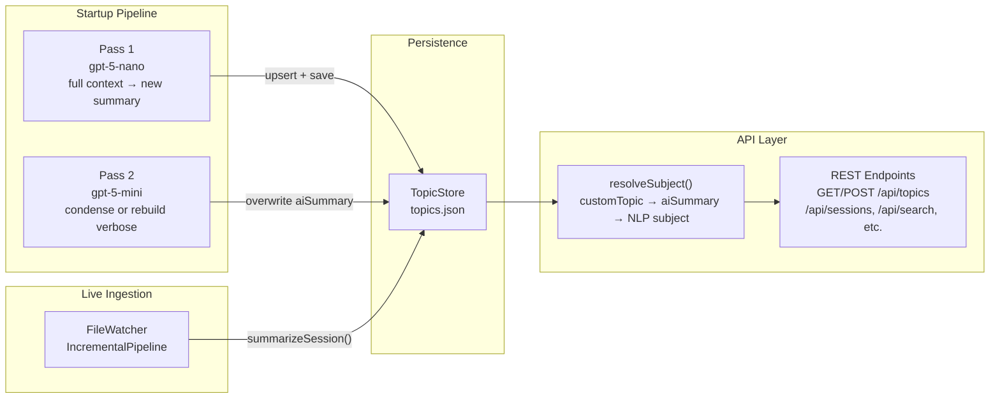
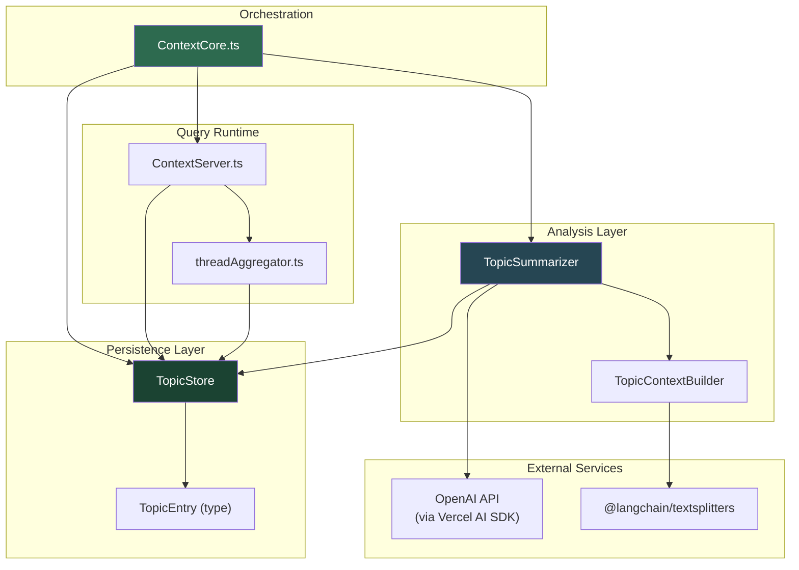
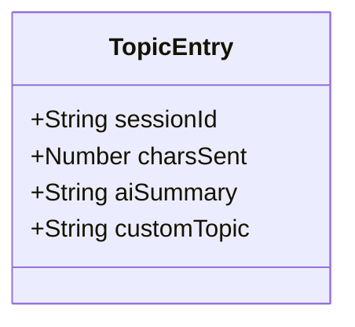
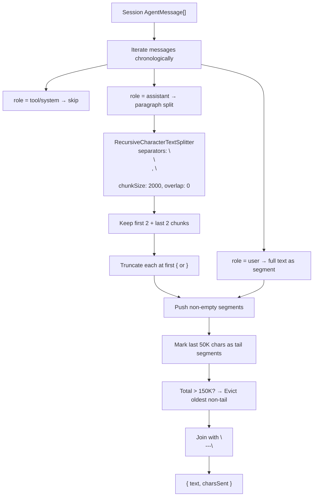
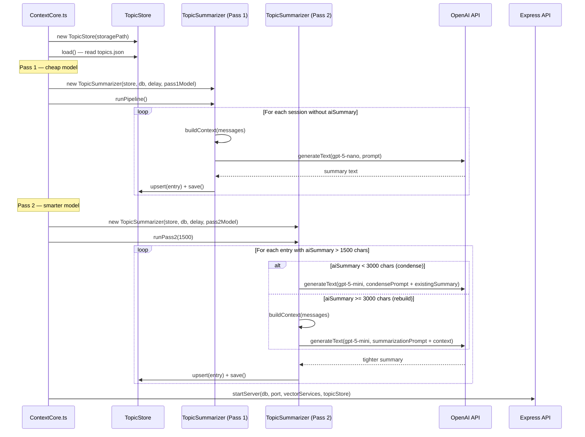
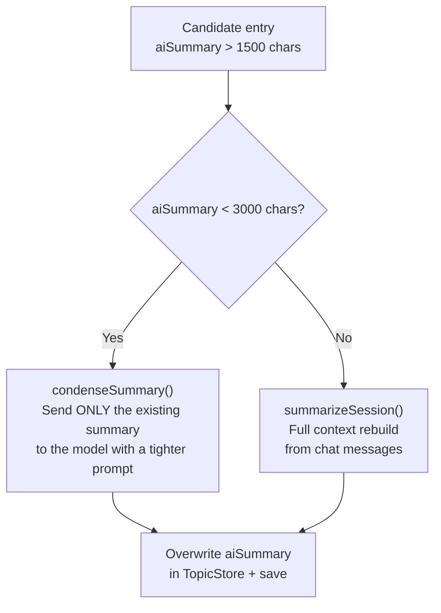
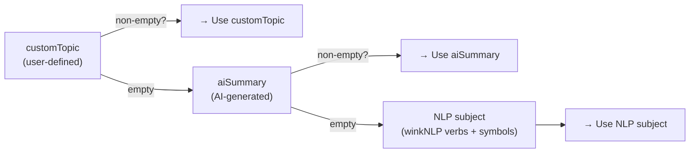
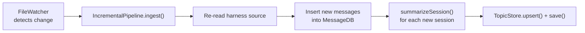
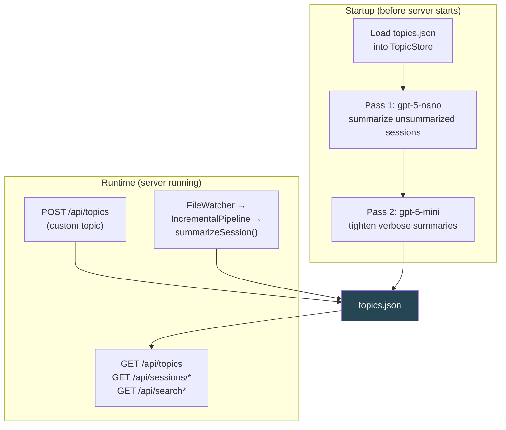

# AI Topic Summarization — Architectural Review

**Date**: 2026-03-16
**Scope**: Two-pass AI summarization pipeline, TopicStore persistence, context assembly, subject resolution, and custom topic overrides
**Runtime**: Bun (TypeScript, ESNext modules)
**External Dependencies**: Vercel AI SDK (`ai`), `@ai-sdk/openai`, `@langchain/textsplitters`

---

## 1. System Overview

The AI Topic Summarization subsystem generates concise, human-readable summaries for every conversation session stored in ContextCore. It replaces the earlier NLP-derived subjects (verb + symbol lists from winkNLP) with AI-generated prose summaries as the primary display text across all API responses and the visualizer UI.

The system operates as a **two-pass pipeline** at startup:

- **Pass 1** (cheap model — `gpt-5-nano` by default): Summarizes every session that has no summary yet. Processes the full conversation by building a condensed context from its messages.
- **Pass 2** (smarter model — `gpt-5-mini` by default): Finds pass 1 results that exceeded 1500 characters and tightens them. For moderately verbose summaries (< 3000 chars), it condenses the existing summary text directly — no need to rebuild context from the full chat. For extremely long summaries (>= 3000 chars), it falls back to a full context rebuild.

Summaries are persisted in `.settings/topics.json`, isolated from the AgentMessage storage tree. This isolation means processed messages under `{machine}/` can be wiped and regenerated without losing AI summaries or user-defined custom topics.

Users can override any AI summary with a custom topic name via `POST /api/topics`. Custom topics take absolute priority and are never overwritten by the summarization pipeline.



---

## 2. Component Architecture

### 2.1 Module Map



### 2.2 Module Inventory

| Module | Path | Responsibility |
| --- | --- | --- |
| **TopicEntry** | `src/models/TopicEntry.ts` | Type definition: `sessionId`, `charsSent`, `aiSummary`, `customTopic` |
| **TopicStore** | `src/settings/TopicStore.ts` | Load/save `topics.json`, map-based lookups, skip logic, verbose-entry queries |
| **TopicContextBuilder** | `src/analysis/TopicContextBuilder.ts` | Builds AI-ready context string from session messages with budget enforcement |
| **TopicSummarizer** | `src/analysis/TopicSummarizer.ts` | Orchestrates pass 1 and pass 2 pipelines, calls OpenAI, manages retries |
| **resolveSubject()** | `src/server/ContextServer.ts`, `src/search/threadAggregator.ts` | Subject resolution: `customTopic` > `aiSummary` > NLP `subject` |

---

## 3. Data Model

### 3.1 TopicEntry



Each entry maps 1:1 to a session in the MessageDB. The `charsSent` field records how many characters were sent to the AI model — useful for diagnostics and cost tracking. The `customTopic` field is user-controlled and defaults to `""`. When non-empty, it overrides everything.

### 3.2 Storage Layout

```
{storage}/
├── .settings/
│   └── topics.json          ← TopicEntry[] (isolated from message wipes)
├── {machine}/               ← processed AgentMessages (wipeable independently)
│   └── ...
```

`topics.json` is a flat JSON array of `TopicEntry` objects, written with 2-space indentation. The `TopicStore` loads it into a `Map<string, TopicEntry>` keyed by `sessionId` for O(1) lookups.

---

## 4. Context Assembly Algorithm

The `TopicContextBuilder` transforms a session's `AgentMessage[]` into a single text string suitable for summarization. This is a non-trivial process because conversations can be extremely long (hundreds of thousands of characters) and contain large code blocks that add noise.



### 4.1 Design Decisions

**Why first-2/last-2 chunks?** Assistant messages are typically long — they contain explanations, code, and analysis. The opening paragraphs establish the approach, the closing paragraphs contain the conclusion or result. The middle is detail the summarizer doesn't need.

**Why truncate at `{` / `}`?** These indicate the start of code blocks (JSON, TypeScript, etc.). Code is noise for topic summarization — the model should focus on the prose that describes *what was done*, not the code itself.

**Why the 150K/50K budget?** The 150K cap keeps the prompt within model context limits and controls API cost. The 50K tail guarantee ensures the end of the conversation — where conclusions, final decisions, and outcomes live — is always preserved. When the budget is exceeded, the oldest non-tail segments are evicted first.

---

## 5. Two-Pass Pipeline

### 5.1 Startup Sequence



### 5.2 Pass 1 — Bulk Summarization

**Model**: `AI_SUMMARIZATION_MODEL_PASS_1` (default `gpt-5-nano`)
**Candidate selection**: All sessions in MessageDB that have no entry in TopicStore (or whose entry has both `aiSummary` and `customTopic` empty).
**Skip logic**: Sessions with a non-empty `aiSummary` OR a non-empty `customTopic` are skipped via `TopicStore.shouldSkipSummarization()`.

For each candidate:
1. Fetch messages from MessageDB.
2. Build context via `TopicContextBuilder.buildContext()`.
3. Prepend `SUMMARIZATION_PROMPT_PREFIX` and call `generateText()`.
4. Upsert the resulting `TopicEntry` and save to disk immediately.

A 300ms delay between API calls prevents rate-limiting. The pipeline tracks separate counters for AI-summarized skips and custom-topic skips, logged at start and completion.

### 5.3 Pass 2 — Verbose Summary Tightening

**Model**: `AI_SUMMARIZATION_MODEL_PASS_2` (default `gpt-5-mini`)
**Candidate selection**: `TopicStore.getVerboseEntries(1500)` — entries where `aiSummary.length > 1500` and `customTopic` is empty.
**Routing by length**:



**Condense strategy** (1500–2999 chars): The existing summary is already a reasonable representation of the conversation — it's just too long. Sending only the summary text (~2KB) to the smarter model with a tight "condense to 5 sentences / 500 chars" prompt is fast and cheap compared to rebuilding the full context.

**Rebuild strategy** (>= 3000 chars): The summary is so long that pass 1 clearly went off-rails. A full context rebuild gives the smarter model a fresh shot at the source material.

### 5.4 Idempotency

Both passes are fully idempotent:
- Pass 1 skips any session that already has a non-empty `aiSummary` or `customTopic`.
- Pass 2 only processes entries where `aiSummary.length > 1500`. Once tightened below the threshold, they won't be reprocessed on subsequent runs.
- Re-running the full startup pipeline produces no redundant API calls.

---

## 6. Prompt Engineering

### 6.1 Summarization Prompt (Pass 1 + Pass 2 Rebuild)

The summarization prompt is designed to counteract specific failure modes observed during development with cheaper models:

| Rule | Why |
| --- | --- |
| "maximum 10 sentences" | Cheap models tend to enumerate every tool call and file change |
| "Do not cheat more content by using semicolons" | Models concatenate clauses with semicolons to technically stay at 10 sentences |
| "Do NOT use phrasing such as 'Chat is'..." | Models default to meta-descriptions rather than content descriptions |
| "Do NOT start with 'The user requests'..." | The summary is *for* the user — referring to them in third person is weird |
| "Save on prepositions and articles. Tech-speak!" | Produces denser, more scannable summaries |
| "NEVER RETURN MORE THAN 2000 CHARACTERS" | Hard cap as final guardrail (the 1500 pass 2 threshold catches violations) |
| "One single paragraph" | Prevents models from using line breaks to expand content |

### 6.2 Condense Prompt (Pass 2 Condense)

A much simpler prompt: "Condense to at most 5 sentences and 500 characters. Preserve all technical content. Cut all filler, articles, and prepositions. Tech-speak only."

This works well because the input is already a summary — the model only needs to compress, not understand a full conversation.

---

## 7. Subject Resolution

Subject resolution determines what text is displayed as the "topic" for a session across all API responses. The priority chain is:



The `resolveSubject(sessionId, originalSubject, topicStore)` function is defined in two places:
- `ContextServer.ts` — applied to all message/search/session endpoints
- `threadAggregator.ts` — applied to thread aggregation and latest-threads views

Both implementations are identical. The function is applied at serialization time — the underlying `AgentMessage.subject` field is never mutated.

### 7.1 Endpoints Affected

| Endpoint | Resolution Applied |
| --- | --- |
| `GET /api/sessions/:sessionId` | Each serialized message's `subject` field |
| `GET /api/messages` | Each serialized message in paginated results |
| `GET /api/search` | Each message in search results |
| `GET /api/search/threads` | Thread-level subject via `aggregateToThreads()` |
| `GET /api/threads/latest` | Thread-level subject via `getLatestThreads()` |

---

## 8. Custom Topics

Users can set a custom topic per session via `POST /api/topics` with `{ sessionId, customTopic }`. This:

1. Creates or updates the `TopicEntry` in `TopicStore`.
2. Persists to disk immediately.
3. Takes absolute priority in `resolveSubject()`.

**Pipeline interaction**: Sessions with a non-empty `customTopic` are skipped by both pass 1 and pass 2. Clearing a custom topic (setting it to `""`) makes the session eligible for AI summarization on the next run.

---

## 9. Live Ingestion

The `IncrementalPipeline` (triggered by `FileWatcher` on file-system changes) performs pass 1 summarization for newly ingested sessions in real-time. It calls `topicSummarizer.summarizeSession()` directly for each new session, using the same pass 1 model configured at startup. Pass 2 does not run during live ingestion — it only runs at startup.



---

## 10. Retry & Resilience

### 10.1 Retry Logic

All API calls go through `withRetry()`, which implements exponential backoff:

| Attempt | Delay | Condition |
| --- | --- | --- |
| 1 | 1000 ms | 429 (rate limit), 5xx (server error), or no status code |
| 2 | 2000 ms | Same |
| 3 | 4000 ms | Final attempt — throws on failure |

Non-transient errors (4xx other than 429) are thrown immediately without retry.

### 10.2 Crash Resilience

- `TopicStore.save()` is called after **every** successful summarization, not in batch. If the process crashes mid-pipeline, all prior results are preserved.
- Pass 1 and pass 2 failures are caught independently in `ContextCore.ts` — a pass 2 crash does not prevent the server from starting.
- Individual session failures within a pass are logged and skipped — the pipeline continues with the next candidate.

### 10.3 Defensive Loading

`TopicStore.load()` handles:
- Missing `topics.json` → empty map (first run)
- Invalid JSON → warning log, empty map (corruption recovery)
- Missing `.settings/` directory → created automatically by constructor

---

## 11. Configuration

| Environment Variable | Default | Description |
| --- | --- | --- |
| `SKIP_AI_SUMMARIZATION` | `true` | Master switch. Set to `false` to enable both passes |
| `AI_SUMMARIZATION_MODEL_PASS_1` | `gpt-5-nano` | Model for initial bulk summarization |
| `AI_SUMMARIZATION_MODEL_PASS_2` | `gpt-5-mini` | Model for verbose summary tightening |
| `SKIP_AI_SUMMARIZATION_PASS_2` | `false` | Set to `true` to disable pass 2 only |
| `OPENAI_API_KEY` | — | Required for OpenAI API access (shared with embedding service) |

---

## 12. Cost & Performance Characteristics

| Metric | Pass 1 | Pass 2 (Condense) | Pass 2 (Rebuild) |
| --- | --- | --- | --- |
| **Input size** | Up to 150K chars (context) | ~1.5–3K chars (existing summary) | Up to 150K chars (context) |
| **Model** | gpt-5-nano (cheapest) | gpt-5-mini | gpt-5-mini |
| **When triggered** | Sessions with no summary | aiSummary 1500–2999 chars | aiSummary >= 3000 chars |
| **Relative cost** | Low | Very low (~50x cheaper than rebuild) | Medium |

The condense path in pass 2 is the key cost optimization: most pass 1 violations produce summaries in the 1500–2500 char range, where sending ~2KB to the model is dramatically cheaper than rebuilding 150KB of context.

---

## 13. API Surface

| Endpoint | Method | Description |
| --- | --- | --- |
| `/api/topics` | GET | All topic entries as JSON array |
| `/api/topics/:sessionId` | GET | Single topic entry by session ID (404 if not found) |
| `/api/topics` | POST | Set or clear custom topic: `{ sessionId, customTopic }` |

---

## 14. Data Flow Summary



---

## 15. Strengths

1. **Two-pass cost optimization**: Cheap model handles the bulk, expensive model only runs on violations. The condense path avoids re-reading the full conversation for most cases.
2. **Crash resilience**: Per-entry persistence means no work is lost on interruption.
3. **Storage isolation**: `topics.json` in `.settings/` survives AgentMessage wipes.
4. **Idempotent pipeline**: Safe to re-run at any time with zero redundant API calls.
5. **Custom topic override**: User control is absolute — the pipeline never touches sessions with custom topics.
6. **Pluggable models**: Both pass 1 and pass 2 models are environment-configurable with no code changes.
7. **Budget-aware context assembly**: The 150K cap with 50K tail guarantee produces high-quality context even for very long conversations.
8. **Live summarization**: New sessions ingested via FileWatcher get summarized immediately without waiting for a restart.

---

## 16. Architectural Risks & Improvement Areas

### 16.1 Sequential Processing

Both passes process sessions sequentially with a 300ms delay between calls. For large backlogs (hundreds of new sessions), startup time can be significant. Parallelizing with a bounded concurrency pool (e.g., 5 concurrent calls) would reduce startup time substantially while respecting rate limits.

### 16.2 No Pass 2 in Live Ingestion

`IncrementalPipeline` only runs pass 1 (`summarizeSession()`) for new sessions. If the pass 1 model produces a verbose summary for a live-ingested session, it won't be tightened until the next full startup. A lightweight check after live summarization could trigger the condense path immediately.

### 16.3 Duplicate `resolveSubject()`

The `resolveSubject()` function is defined identically in both `ContextServer.ts` and `threadAggregator.ts`. This should be extracted to a shared utility module (e.g., `src/utils/topicHelpers.ts`) to avoid drift.

### 16.4 No Summary Versioning

When pass 2 overwrites an `aiSummary`, the pass 1 result is lost. If the pass 2 model produces a worse summary (rare but possible), there's no rollback. Storing both `aiSummaryPass1` and `aiSummaryPass2` would enable comparison and fallback, at the cost of a TopicEntry schema change.

### 16.5 Fixed Character Thresholds

The 1500-char pass 2 trigger and 3000-char condense/rebuild boundary are hardcoded constants. These work well empirically but cannot be tuned without code changes. Exposing them as environment variables (e.g., `PASS2_MAX_SUMMARY_CHARS`, `CONDENSE_THRESHOLD_CHARS`) would allow tuning without redeployment.
