# Qdrant Vector Search — Architectural Review

**Date**: 2026-03-10
**Updated**: 2026-03-21 — R2BQ upgrade (dual vectors, V2 payload, summary embedding cache)
**Scope**: Semantic search pipeline — Qdrant, OpenAI embeddings, LangChain text splitters
**Parent**: [`archi-context-core.md`](../archi-context-core.md)
**Upgrade spec**: [`r2uq-qdrant.md`](../../upgrades/2026-03/r2uq-qdrant.md) | [`r2bq-better-qdrant.md`](../../upgrades/2026-03/r2bq-better-qdrant.md)

---

## 1. Overview

ContextCore's original search relied exclusively on Fuse.js fuzzy text matching against message content, subjects, symbols, and tags. This works well for keyword recall but fails on **semantic intent** — a search for "how to handle authentication" won't surface a message discussing "login flow with JWT tokens" because the words don't overlap.

The Qdrant integration adds an **optional semantic search layer** that runs alongside Fuse.js. When enabled, the existing `/api/search` endpoint becomes a hybrid engine: Fuse.js handles lexical matching while Qdrant handles meaning-based retrieval via OpenAI embeddings. Results from both engines are merged by message ID with weighted scoring (75% Qdrant, 25% Fuse.js).

As of the R2BQ upgrade, each Qdrant point carries **two named vector channels** — `chunk` (from chunk text) and `summary` (from session-level AI summary) — enabling both fine-grained chunk matching and broader topic-level retrieval. Points also carry an enriched **V2 payload** with symbols, dateTime, subject, aiSummary, and customTopic metadata. A **SummaryEmbeddingCache** pre-computes and persists summary vectors so the pipeline never calls OpenAI for summaries during chunk indexing.

The design is **additive and gated**: when `QDRANT_URL` and `OPENAI_API_KEY` are both absent from `.env`, the system behaves exactly as before. No code paths change, no new dependencies are loaded at runtime.

---

## 2. System Architecture

### 2.1 High-Level Integration

The vector search pipeline sits alongside the existing query runtime. It introduces three external services (Qdrant, OpenAI, LangChain text splitters) and seven internal modules under `src/vector/`.

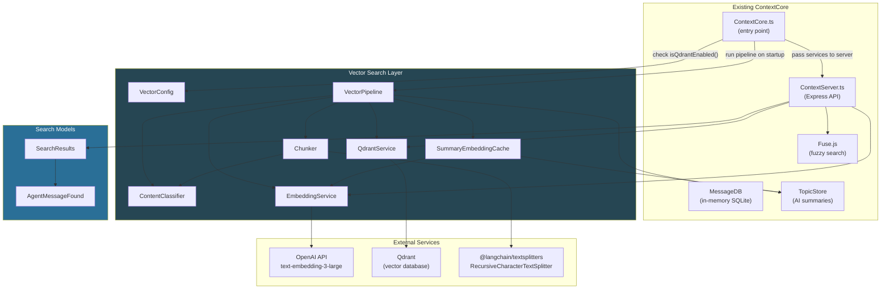

### 2.2 Module Inventory

| Module                    | Path                                  | Responsibility                                                                              |
| ------------------------- | ------------------------------------- | ------------------------------------------------------------------------------------------- |
| **VectorConfig**          | `src/vector/VectorConfig.ts`          | Reads `.env` vars, exposes typed config, feature gate via `isQdrantEnabled()`               |
| **ContentClassifier**     | `src/vector/ContentClassifier.ts`     | Heuristic code/prose/mixed classifier (`classifyBlob()`), mixed content span parser         |
| **Chunker**               | `src/vector/Chunker.ts`               | Routes content to LangChain splitters based on classification, produces indexed chunks      |
| **EmbeddingService**      | `src/vector/EmbeddingService.ts`      | OpenAI embedding generation via Vercel AI SDK, retry with exponential backoff               |
| **QdrantService**         | `src/vector/QdrantService.ts`         | Qdrant client: per-harness collection management, upsert, dual-channel search               |
| **SummaryEmbeddingCache** | `src/vector/SummaryEmbeddingCache.ts` | Persistent cache of pre-computed summary embeddings, sync tracking against Qdrant           |
| **VectorPipeline**        | `src/vector/VectorPipeline.ts`        | Orchestrator: classify → chunk → embed → enrich V2 payload → attach summary vector → upsert |
| **AgentMessageFound**     | `src/models/AgentMessageFound.ts`     | Extends `AgentMessage` with `qdrantScore`, `fuseScore`, `combinedScore`                     |
| **SearchResults**         | `src/models/SearchResults.ts`         | Merges Fuse.js + Qdrant hits, max-score dedup by messageId, sorts by combined score         |

---

## 3. Feature Gate

Qdrant activation is controlled entirely by environment variables — no feature flags, no config file entries. The runtime gate logic in `VectorConfig.ts` is:

```
Qdrant usable at runtime  ⟺  DO_NOT_USE_QDRANT is false
                           AND QDRANT_URL is set AND non-empty
                           AND OPENAI_API_KEY is set AND non-empty
```

Startup indexing is controlled independently:

```
Skip startup indexing  ⟺  SKIP_STARTUP_UPDATING_QDRANT is true
```

When only one of the two is present, a warning is logged identifying the missing variable. When neither is set, the system silently continues without vector search.

### Environment Variables

| Variable                        | Required          | Default      | Purpose                                                 |
| ------------------------------- | ----------------- | ------------ | ------------------------------------------------------- |
| `QDRANT_URL`                    | For vector search | —            | Qdrant server endpoint (e.g., `http://localhost:6333`)  |
| `QDRANT_API_KEY`                | No                | `null`       | Optional Qdrant authentication key                      |
| `OPENAI_API_KEY`                | For vector search | —            | OpenAI API key for embedding generation                 |
| `QDRANT_MIN_SCORE`              | No                | `0.6`        | Minimum cosine similarity threshold for search results  |
| `EMBEDDING_BATCH_DELAY_MS`      | No                | `200`        | Rate limiting delay (ms) between embedding batches      |
| `SKIP_STARTUP_UPDATING_QDRANT`  | No                | `false`      | Skip bulk embedding/upsert during startup only          |
| `DO_NOT_USE_QDRANT`             | No                | `false`      | Disable all Qdrant usage at runtime (search + indexing) |
| `SKIP_AI_SUMMARIZATION`         | No                | `true`       | Skip AI topic summarization during startup              |
| `SKIP_AI_SUMMARIZATION_PASS_2`  | No                | `false`      | Skip second-pass re-summarization of long summaries     |
| `AI_SUMMARIZATION_MODEL_PASS_1` | No                | `gpt-5-nano` | Model for first-pass topic summarization                |
| `AI_SUMMARIZATION_MODEL_PASS_2` | No                | `gpt-5-mini` | Model for second-pass re-summarization                  |

---

## 4. Ingestion Pipeline

### 4.1 Full Flow

On startup, after `MessageDB.loadFromStorage()` populates the in-memory database, `ContextCore.ts` runs the **Summarization → Vector Init** pipeline. The startup ordering was resequenced in R2BQ so that freshly generated AI summaries are available for both the summary embedding cache and Qdrant payload enrichment.

**Only user (human) messages are embedded.** The pipeline skips assistant, tool, and system messages before any chunking or embedding occurs — these roles produce noise (verbose tool output, boilerplate responses) that would dilute semantic search quality.

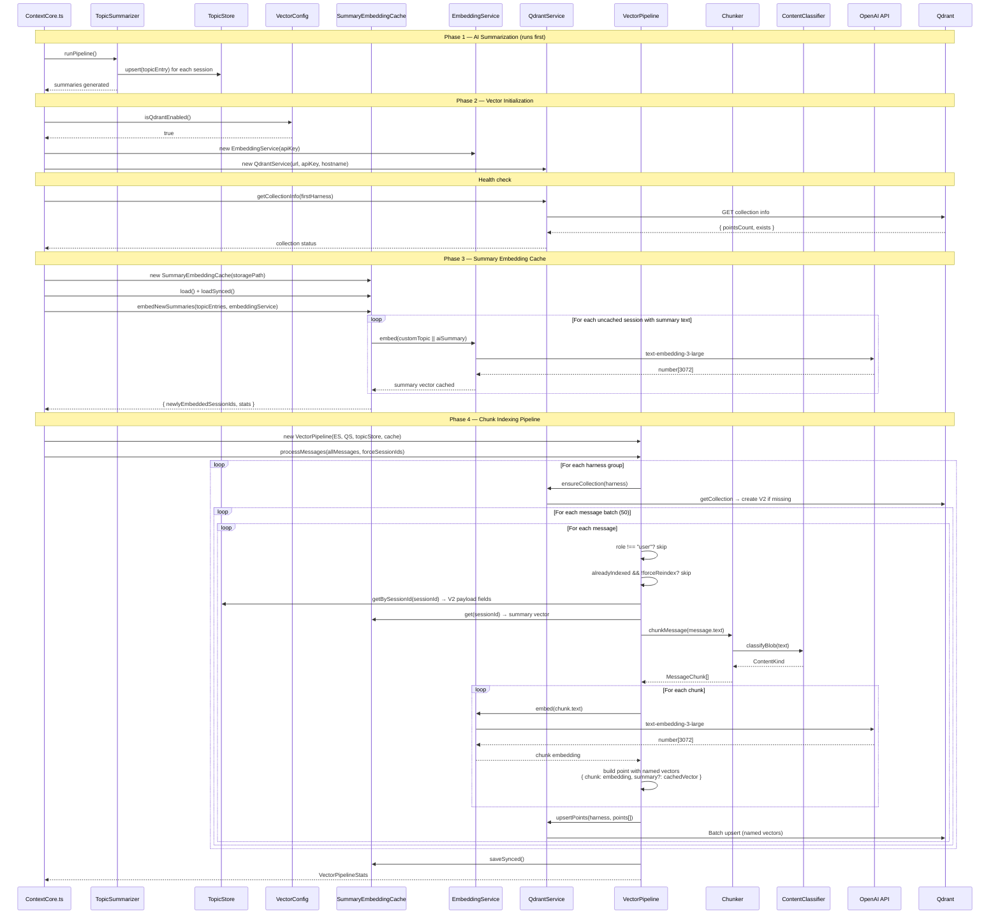

### 4.2 Startup Ordering (R2BQ)

The startup sequence follows a strict dependency chain:

```
TopicSummarizer → SummaryEmbeddingCache.embedNewSummaries() → VectorPipeline.processMessages()
```

1. **TopicSummarizer** runs first, generating `aiSummary` entries in TopicStore for sessions that lack them.
2. **SummaryEmbeddingCache** runs second, embedding summary text (`customTopic || aiSummary`) for all sessions not yet cached. Returns `newlyEmbeddedSessionIds`.
3. **VectorPipeline** runs third, building chunk points with V2 payload fields from TopicStore and attaching pre-computed summary vectors from the cache.

This ordering ensures that freshly summarized sessions get both summary metadata and summary vectors in their Qdrant points on the same startup pass.

### 4.3 Per-Harness Collections

Qdrant collections are partitioned **per harness per machine** using the naming convention:

```
CXC_{HOSTNAME}_{Harness}
```

The hostname is sanitized (non-alphanumeric characters replaced with underscores, uppercased). Examples:

| Collection Name          | Machine | Harness    |
| ------------------------ | ------- | ---------- |
| `CXC_DEVBOX1_Kiro`       | DEVBOX1 | Kiro       |
| `CXC_DEVBOX1_ClaudeCode` | DEVBOX1 | ClaudeCode |
| `CXC_DEVBOX1_Cursor`     | DEVBOX1 | Cursor     |
| `CXC_DEVBOX1_VSCode`     | DEVBOX1 | VSCode     |

This partitioning strategy means:

- Embeddings from different harnesses never mix in the same collection
- A harness's index can be dropped and rebuilt without affecting others
- At query time, the system searches across all harness collections and merges results
- Collection names are self-documenting in the Qdrant dashboard

Each collection is created with the **V2 named-vector schema** — two vector channels (`chunk` and `summary`), both using **cosine distance** and **vector size 3072** (matching `text-embedding-3-large` output dimensions).

### 4.4 Collection Creation

Collections are always created with the V2 named-vector schema. No migration logic exists — `ensureCollection()` simply checks whether the collection exists and creates it if not:

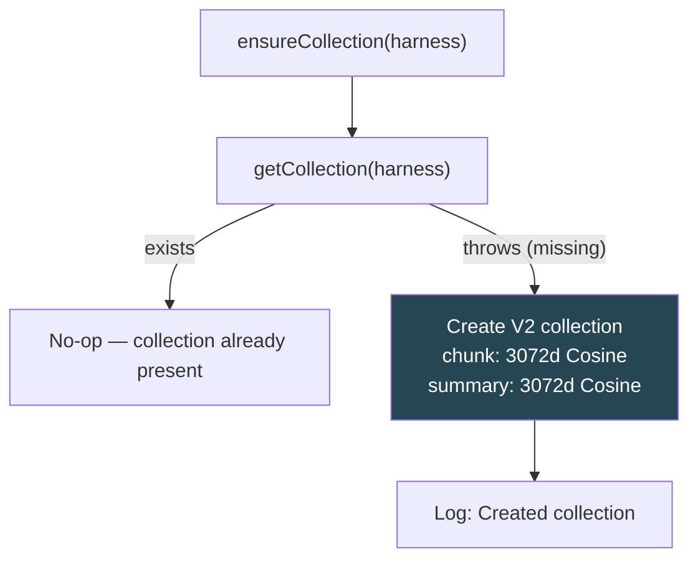

### 4.5 Deduplication

Two levels of deduplication prevent redundant work:

1. **Message-level**: Before processing a message, the pipeline checks a preloaded set of already-indexed message IDs (loaded once per harness via `getIndexedMessageIds()`). If found and the message is not in `forceSessionIds`, it is skipped. Messages in `forceSessionIds` bypass this check for summary vector backfill.

2. **Point-level**: Qdrant point IDs are generated deterministically using UUID v5:
   ```
   UUID_v5( "{messageId}:{chunkIndex}", ISO_OID_NAMESPACE )
   ```
   This means re-upserting the same message+chunk combination overwrites rather than duplicates.

### 4.6 Force-Reindex for Summary Backfill

`processMessages()` accepts an optional `forceSessionIds?: Set<string>` parameter. Messages in these sessions bypass the `alreadyIndexed` skip check, ensuring they are re-upserted with updated summary vectors and enriched V2 payload.

The force set is computed as:

```
forceSessionIds = newlyEmbeddedSessionIds ∪ unsyncedSessionIds
```

- **`newlyEmbeddedSessionIds`**: Sessions embedded in the current run's `embedNewSummaries()` pass.
- **`unsyncedSessionIds`**: Sessions with cached embeddings that were never confirmed applied to Qdrant (e.g., because `SKIP_STARTUP_UPDATING_QDRANT` was true or Qdrant was disabled at the time).

After the pipeline completes and summary vectors have been attached, the synced state is persisted via `summaryEmbeddingCache.saveSynced()`.

---

## 5. Content Classification

### 5.1 The Classifier

AI chat messages are inherently heterogeneous — prose explaining code, interspersed with fenced code blocks and inline identifiers. The `ContentClassifier` module routes each message to the optimal text splitter by analyzing its structure.

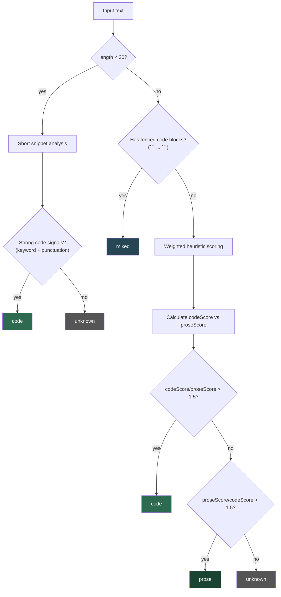

### 5.2 Scoring Signals

The classifier uses purely heuristic signals (no LLM calls):

| Signal Category                 | Indicators                                                                   | Weight              |
| ------------------------------- | ---------------------------------------------------------------------------- | ------------------- |
| **Code: line endings**          | Lines ending with `;`                                                        | 2x per line         |
| **Code: keywords**              | `function`, `class`, `const`, `import`, `return`, `async`, `def`, etc.       | 1.5x per keyword    |
| **Code: syntax density**        | Density of `{}[]()=<>:;` relative to text length (capped at 0.3)             | Up to 6 points      |
| **Code: declarations**          | Lines starting with `public`/`private`/`export`/`const`/etc. + identifier    | 4 points            |
| **Prose: stopword density**     | Frequency of `the`, `and`, `is`, `this`, `that`, etc. relative to word count | Up to 10 points     |
| **Prose: sentence punctuation** | Occurrences of `.`, `!`, `?` followed by whitespace or end-of-string         | 1.5x per occurrence |
| **Prose: word count**           | 8+ words in the text                                                         | 2 points            |

The decision threshold is a **1.5x ratio** — if code score is more than 1.5x prose score, the text is classified as code (and vice versa). Ambiguous cases default to `"unknown"`, which routes to the prose splitter.

### 5.3 Mixed Content Decomposition

When fenced code blocks are detected, `splitMixedContent()` decomposes the text into tagged spans:

```mermaid
flowchart LR
    subgraph Input["Mixed message"]
        P1["Prose paragraph"]
        C1["```js\ncode block\n```"]
        P2["More prose"]
        C2["```ts\nanother block\n```"]
        P3["Final paragraph"]
    end

    subgraph Spans["Tagged spans"]
        S1["{ text: prose, kind: prose }"]
        S2["{ text: code, kind: code }"]
        S3["{ text: prose, kind: prose }"]
        S4["{ text: code, kind: code }"]
        S5["{ text: prose, kind: prose }"]
    end

    P1 --> S1
    C1 --> S2
    P2 --> S3
    C2 --> S4
    P3 --> S5
```

Each span is then individually re-classified via `classifyBlob()` (with `"mixed"` results forced to `"prose"`) and routed to the appropriate splitter.

---

## 6. Chunking Strategy — LangChain Integration

### 6.1 Why LangChain Text Splitters

We use `@langchain/textsplitters` — specifically `RecursiveCharacterTextSplitter` — for one narrow purpose: **intelligent text chunking**. We do not use any other LangChain component (no loaders, retrievers, chains, or vector store abstractions).

The value proposition:

- **Prose splitting**: `RecursiveCharacterTextSplitter` with default separators (`\n\n`, `\n`, ` `, `""`) produces chunks at natural paragraph and sentence boundaries, superior to naive fixed-size slicing.
- **Code splitting**: `RecursiveCharacterTextSplitter.fromLanguage("js")` uses JavaScript/TypeScript-aware separators that respect function, class, and block boundaries — preventing chunks that split a function definition in half.

### 6.2 Splitter Configuration

| Content Kind            | Splitter                                              | Chunk Size | Chunk Overlap |
| ----------------------- | ----------------------------------------------------- | ---------- | ------------- |
| **prose** / **unknown** | `RecursiveCharacterTextSplitter` (default separators) | 1000 chars | 150 chars     |
| **code**                | `RecursiveCharacterTextSplitter.fromLanguage("js")`   | 1200 chars | 120 chars     |

Code gets a larger chunk size (1200 vs 1000) because code has higher information density per character and splitting mid-function is more damaging than splitting mid-paragraph.

### 6.3 Chunking Flow

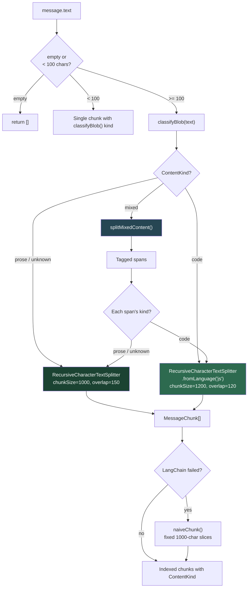

The `naiveChunk()` fallback ensures that a LangChain failure never prevents a message from being indexed — it degrades to fixed-size slicing rather than skipping the message.

---

## 7. Embedding Service

### 7.1 Model & Dimensions

| Property          | Value                                                 |
| ----------------- | ----------------------------------------------------- |
| **Model**         | `text-embedding-3-large`                              |
| **Provider**      | OpenAI (via Vercel AI SDK `@ai-sdk/openai`)           |
| **Dimensions**    | 3072                                                  |
| **SDK Functions** | `embed()` for single texts, `embedMany()` for batches |
| **Batch Size**    | 100 texts per API call                                |

### 7.2 Retry Strategy

The `EmbeddingService` wraps all OpenAI calls with exponential backoff:

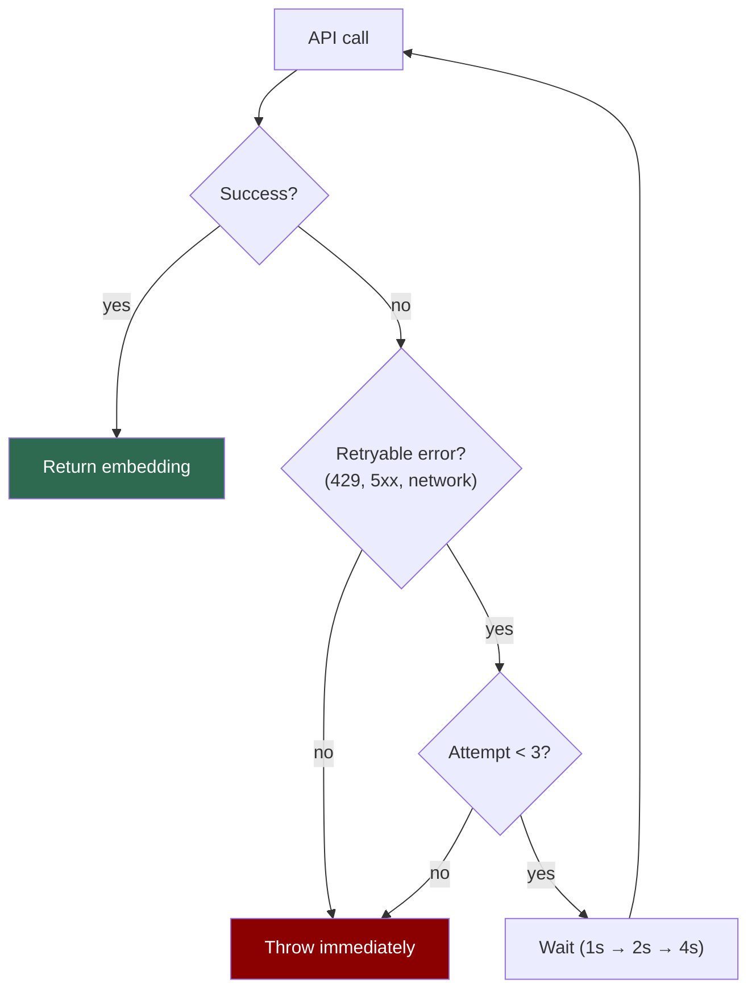

| Attempt | Delay    | Retryable Conditions           |
| ------- | -------- | ------------------------------ |
| 1       | 1,000 ms | HTTP 429 (rate limit)          |
| 2       | 2,000 ms | HTTP 5xx (server error)        |
| 3       | 4,000 ms | No status code (network error) |

Client errors (4xx except 429) are **not retried** — these indicate malformed requests and retrying would be futile.

### 7.3 SDK Integration Pattern

The Vercel AI SDK (`ai` + `@ai-sdk/openai`) is used as a **thin gateway** to OpenAI's embedding API. The integration is deliberately minimal:

```
@ai-sdk/openai  →  openai.embedding("text-embedding-3-large")  →  model instance
ai              →  embed(model, value)                          →  single embedding
ai              →  embedMany(model, values)                     →  batch embeddings
```

We do not use Vercel AI SDK's text generation, streaming, tool calling, or any other capabilities — only the embedding functions.

---

## 8. Qdrant Service

### 8.1 Collection Management

The `QdrantService` manages per-harness collections with lazy creation. Collections are created on first use during the pipeline run via `ensureCollection()`, which creates the collection if it doesn't exist and leaves it untouched otherwise.

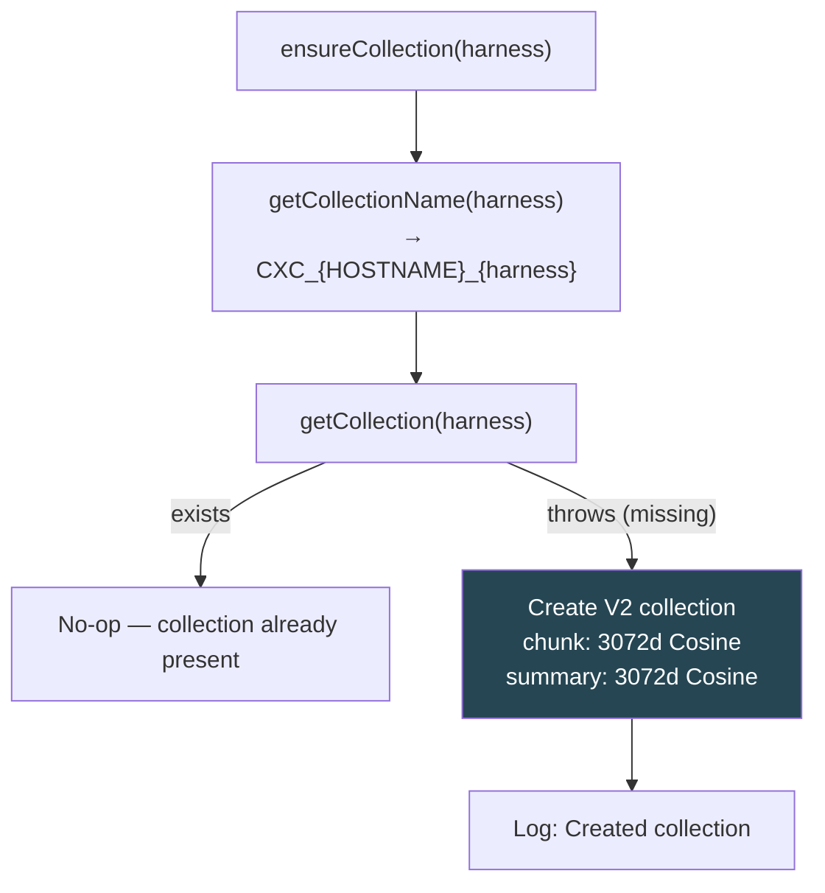

Collection parameters:

| Property            | Value                               |
| ------------------- | ----------------------------------- |
| **Distance metric** | Cosine                              |
| **Named vectors**   | `chunk` (3072d) + `summary` (3072d) |
| **Naming**          | `CXC_{HOSTNAME}_{Harness}`          |

### 8.2 Point Structure (V2 Payload)

Each Qdrant point represents a single **chunk** of a message (not the full message). A long message may produce multiple points, all sharing the same `messageId` but with different `chunkIndex` values. All chunks of the same session share the same summary vector (looked up by sessionId).

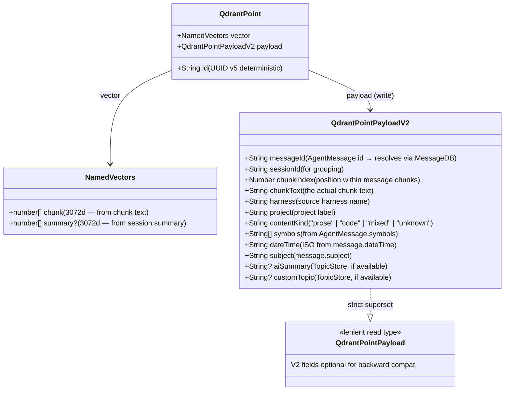

**Payload types**:
- `QdrantPointPayloadV2` is the **strict write type** — enforces all V2 fields on newly indexed points.
- `QdrantPointPayload` is the **lenient read type** — V2 fields are optional for backward compatibility with any pre-migration points that might still exist.

The `chunkText` field stores the raw chunk text as metadata, providing traceability without requiring a round-trip to the message database for chunk-level inspection.

### 8.3 Dual-Channel Search Across Collections

When searching, the service queries **all** harness collections using a specified named vector channel (`chunk` or `summary`):

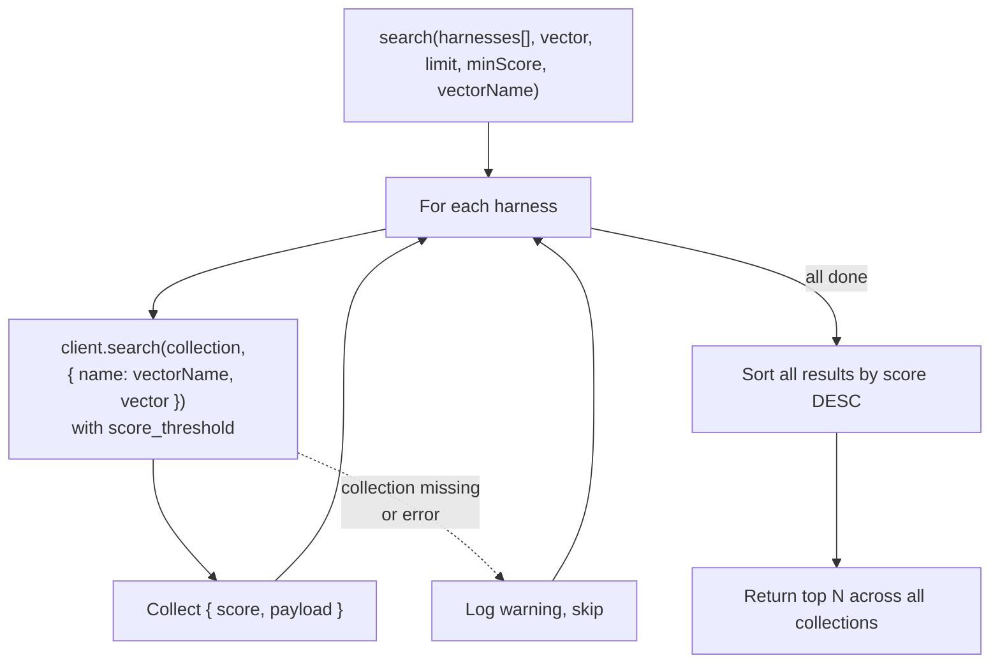

The `vectorName` parameter defaults to `"chunk"` and can be set to `"summary"` for topic-level retrieval. Failed collection searches (missing collection, network error) are logged and skipped — a single unreachable collection doesn't prevent results from others.

---

## 9. Summary Embedding Cache

### 9.1 Purpose

The `SummaryEmbeddingCache` (`src/vector/SummaryEmbeddingCache.ts`) pre-computes and persists session-level summary embeddings so that the VectorPipeline never calls OpenAI for summary vectors during chunk indexing. This decouples the summary embedding cost from the per-chunk embedding loop.

### 9.2 Storage

| File                          | Location               | Content                                                     |
| ----------------------------- | ---------------------- | ----------------------------------------------------------- |
| `summary-embeddings.json`     | `{storage}/.settings/` | Object keyed by sessionId, values are 3072-dim float arrays |
| `summary-vectors-synced.json` | `{storage}/.settings/` | Array of sessionIds confirmed applied to Qdrant             |

### 9.3 Lifecycle

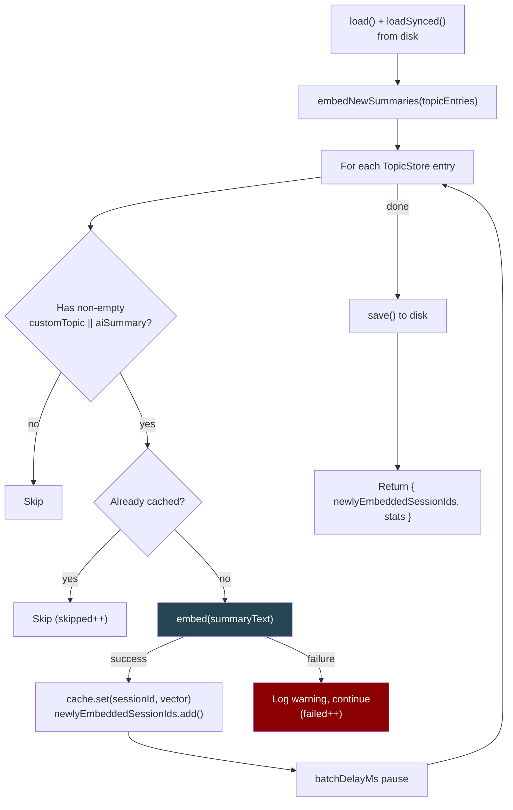

### 9.4 Sync Tracking

The cache tracks which sessions have had their summary vectors **confirmed applied to Qdrant** via a separate `summary-vectors-synced.json` file. This closes the gap where:

- Qdrant was disabled when embeddings were cached
- `SKIP_STARTUP_UPDATING_QDRANT` was true when embeddings were cached
- The pipeline crashed before reaching those sessions' messages

`getUnsyncedSessionIds()` returns sessions with cached embeddings not yet confirmed in Qdrant. These are included in `forceSessionIds` on the next pipeline run.

After the VectorPipeline successfully attaches summary vectors, `markSynced(sessionId)` is called per-session, and `saveSynced()` persists the updated set.

### 9.5 Topic Invalidation (POST /api/topics)

When a `customTopic` is changed via the API:

1. `cache.delete(sessionId)` — removes both the embedding and the synced state
2. `cache.save()` + `cache.saveSynced()` — persists changes to disk
3. Re-embedding happens on the next pipeline run (startup or incremental)

---

## 10. Hybrid Search — Merge Strategy

### 10.1 Dual-Channel + Dual-Engine Query Flow

When a user queries `/api/search?q=...`, the system runs Fuse.js locally and Qdrant's dual-channel search, then merges all results:

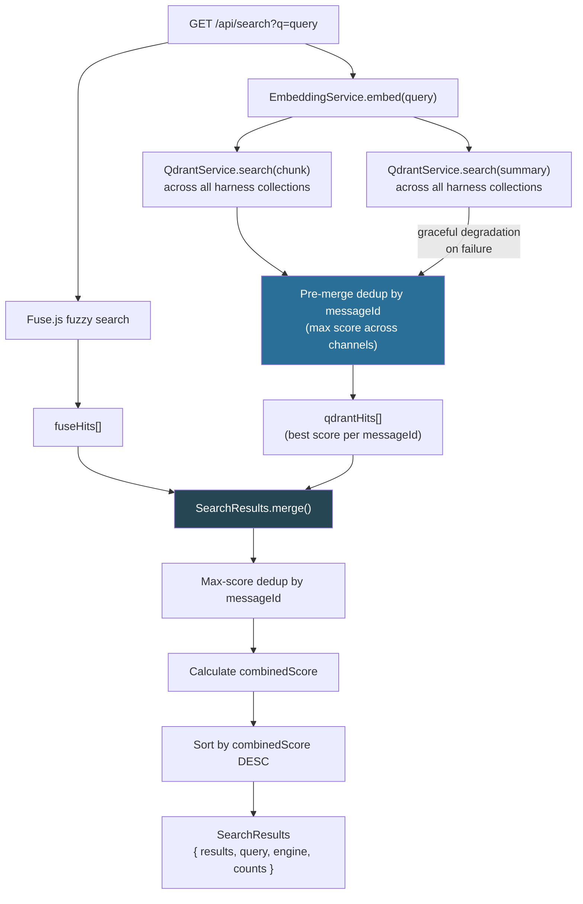

The dual-channel search flow:

1. **Embed query once** — a single 3072d vector serves both channels
2. **Search `chunk` channel** — finds messages with semantically similar chunk text
3. **Search `summary` channel** — finds messages whose session summary matches the query intent (with graceful degradation if the summary channel fails)
4. **Pre-merge dedup** — before passing to `SearchResults.merge()`, chunk and summary hits are merged by messageId using max score, so each message appears at most once with its best score
5. **SearchResults.merge()** — merges the Qdrant hits with Fuse.js hits using the 75/25 formula

POST `/api/search` and POST `/api/messages` also use the same dual-channel search via the shared `runQdrantSearch()` helper.

### 10.2 Score Normalization & Weighting

Fuse.js and Qdrant use **opposite scoring conventions**:

| Engine      | Scale     | Perfect Match | Worst Match |
| ----------- | --------- | ------------- | ----------- |
| **Fuse.js** | 0.0 – 1.0 | 0.0           | 1.0         |
| **Qdrant**  | 0.0 – 1.0 | 1.0           | 0.0         |

The merge formula inverts the Fuse score and applies weighted combination:

```
normalizedFuseScore = 1 - fuseScore
combinedScore = (qdrantScore × 0.75) + (normalizedFuseScore × 0.25)
```

The 75/25 weighting favors semantic similarity over lexical matching, reflecting the principle that **meaning matters more than keyword overlap** for chat history retrieval.

### 10.3 Max-Score Dedup Fix (R2BQ)

`SearchResults.merge()` now uses max-score deduplication:

```ts
const bestQdrantScore = Math.max(hit.score, existing.qdrantScore ?? 0);
```

Previously, the merge used last-write-wins, meaning a lower-scoring chunk could silently downgrade a message's ranking if it was processed after a higher-scoring chunk. The max-score approach ensures the best score always wins, regardless of iteration order.

This is especially important with dual-channel search, where a message may appear in both chunk and summary results with different scores.

### 10.4 Merge Cases

| Scenario                          | Combined Score                                    |
| --------------------------------- | ------------------------------------------------- |
| Message in **both** Fuse + Qdrant | `(qdrantScore × 0.75) + ((1 - fuseScore) × 0.25)` |
| Message in **Qdrant only**        | `qdrantScore × 0.75`                              |
| Message in **Fuse only**          | `(1 - fuseScore) × 0.25`                          |

Messages appearing in both engines naturally score highest, creating a boosting effect for results with both lexical and semantic relevance.

### 10.5 Engine Label

The `SearchResults.engine` field tells the client what contributed:

| Value      | Meaning                                                        |
| ---------- | -------------------------------------------------------------- |
| `"hybrid"` | Both Fuse.js and Qdrant returned results                       |
| `"fuse"`   | Only Fuse.js contributed (Qdrant disabled or returned nothing) |
| `"qdrant"` | Only Qdrant contributed (Fuse.js returned nothing)             |

---

## 11. Search Models

### 11.1 Class Hierarchy

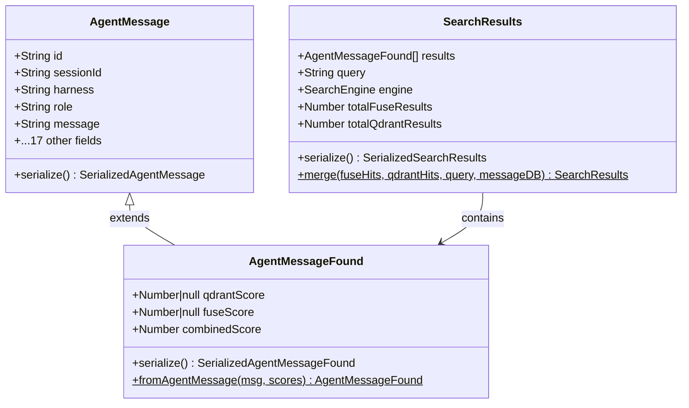

`AgentMessageFound` extends `AgentMessage` rather than wrapping it, so all 19 base fields are directly available on search results. The `fromAgentMessage()` static factory handles score calculation, ensuring the weighted formula is applied consistently.

### 11.2 API Response Shape

The enhanced `/api/search` response is a `SerializedSearchResults` object:

```json
{
  "results": [
    {
      "id": "a1b2c3d4e5f6g7h8",
      "message": "Here's how JWT authentication works...",
      "harness": "ClaudeCode",
      "qdrantScore": 0.847,
      "fuseScore": 0.32,
      "combinedScore": 0.805
    }
  ],
  "query": "authentication flow",
  "engine": "hybrid",
  "totalFuseResults": 12,
  "totalQdrantResults": 8
}
```

When Qdrant is disabled, the response structure is identical but `qdrantScore` is `null` on every result and `engine` is `"fuse"`.

---

## 12. VectorPipeline V2 Enrichment

### 12.1 Payload Enrichment

`processMessageBatch()` enriches each point with V2 payload fields from multiple sources:

| Field         | Source                                     | Always present? |
| ------------- | ------------------------------------------ | --------------- |
| `messageId`   | `AgentMessage.id`                          | Yes             |
| `sessionId`   | `AgentMessage.sessionId`                   | Yes             |
| `chunkIndex`  | Chunk position (0-based)                   | Yes             |
| `chunkText`   | Chunk text                                 | Yes             |
| `harness`     | `AgentMessage.harness`                     | Yes             |
| `project`     | `AgentMessage.project`                     | Yes             |
| `contentKind` | `ContentClassifier` result                 | Yes             |
| `symbols`     | `AgentMessage.symbols`                     | Yes (V2)        |
| `dateTime`    | `AgentMessage.dateTime.toISO()`            | Yes (V2)        |
| `subject`     | `AgentMessage.subject`                     | Yes (V2)        |
| `aiSummary`   | `TopicStore.getBySessionId()?.aiSummary`   | Optional (V2)   |
| `customTopic` | `TopicStore.getBySessionId()?.customTopic` | Optional (V2)   |

### 12.2 Named Vector Construction

For each chunk, the pipeline builds a named vector map:

```ts
const point: QdrantPoint = {
    id: pointId,
    vector: summaryVector
        ? { chunk: chunkEmbedding, summary: summaryVector }
        : { chunk: chunkEmbedding },
    payload,
};
```

- **`chunk`** vector is always present (generated from `embed(chunk.text)`)
- **`summary`** vector is attached when the SummaryEmbeddingCache has a pre-computed embedding for the message's sessionId

All chunks of the same message share the same summary vector (looked up once by sessionId per message).

### 12.3 Pipeline Statistics

The `VectorPipelineStats` now tracks summary-related metrics:

| Stat                     | Description                                             |
| ------------------------ | ------------------------------------------------------- |
| `summaryVectorsAttached` | Points that received a summary vector from cache        |
| `summaryCacheHits`       | Summary cache lookups that returned a hit               |
| `summaryCacheMisses`     | Summary cache lookups that missed (no cached embedding) |
| `payloadWithAiSummary`   | Points whose payload includes aiSummary                 |
| `payloadWithCustomTopic` | Points whose payload includes customTopic               |

---

## 13. Incremental Pipeline (R2BQ)

The `IncrementalPipeline` (`src/watcher/IncrementalPipeline.ts`) processes live file changes with the same three-step dependency chain as startup:

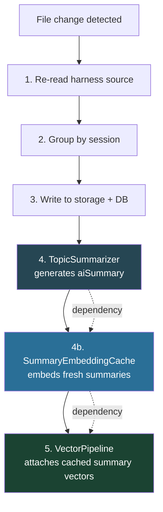

| Step | Module                  | Purpose                                                             |
| ---- | ----------------------- | ------------------------------------------------------------------- |
| 4    | `TopicSummarizer`       | Generates aiSummary in TopicStore for new sessions                  |
| 4b   | `SummaryEmbeddingCache` | Embeds fresh summaries into the cache (batchDelayMs=0 for speed)    |
| 5    | `VectorPipeline`        | Chunks, embeds, and upserts points with V2 payload + summary vector |

This ordering ensures that a session discovered via file watch gets its AI summary, summary embedding, and Qdrant points all in a single ingestion pass.

---

## 14. Resilience & Graceful Degradation

The system is designed to **never let vector search failures block core functionality**.

```mermaid
flowchart TD
    subgraph Startup["Startup Resilience"]
        S1["VectorConfig: both keys present?"]
        S1 -->|"no"| S2["Log: Qdrant not enabled<br/>Continue without vector search"]
        S1 -->|"yes"| S1b{"DO_NOT_USE_QDRANT?"}
        S1b -->|"yes"| S2b["Log: Qdrant usage disabled<br/>Continue without vector search"]
        S1b -->|"no"| S3["Health check: getCollectionInfo()"]
        S3 -->|"fails"| S4["Log warning<br/>Disable vector ops<br/>Continue with Fuse-only"]
        S3 -->|"passes"| S3b["SummaryEmbeddingCache<br/>embedNewSummaries()"]
        S3b --> S5["Run VectorPipeline"]
        S5 -->|"pipeline error"| S6["Log: Vector init failed<br/>Continue without vector search"]
        S5 -->|"success"| S7["Pass services to server"]
    end

    subgraph Runtime["Runtime Resilience"]
        R1["Search request arrives"]
        R1 --> R2["Fuse.js search (always runs)"]
        R1 --> R3["Qdrant chunk search"]
        R1 --> R3b["Qdrant summary search"]
        R3 -->|"embed fails"| R4["Log warning<br/>Return Fuse-only results"]
        R3 -->|"Qdrant unreachable"| R4
        R3b -->|"summary search fails"| R5b["Graceful degradation<br/>Continue with chunk-only hits"]
        R3 -->|"success"| R5["Pre-merge dedup"]
        R3b -->|"success"| R5
        R5 --> R6["Merge with Fuse results"]
        R2 --> R6
        R4 --> R7["SearchResults with engine='fuse'"]
        R6 --> R8["SearchResults with engine='hybrid'"]
    end

    style S2 fill:#555,color:#fff
    style S2b fill:#555,color:#fff
    style S4 fill:#555,color:#fff
    style S6 fill:#555,color:#fff
    style R4 fill:#555,color:#fff
    style R5b fill:#555,color:#fff
```

### Error Isolation Boundaries

| Level                       | Failure                     | Behavior                                                    |
| --------------------------- | --------------------------- | ----------------------------------------------------------- |
| **Config**                  | Missing env vars            | Feature gate returns false, no vector code runs             |
| **Config**                  | `DO_NOT_USE_QDRANT=true`    | All Qdrant usage disabled, Fuse-only search                 |
| **Startup health check**    | Qdrant unreachable          | Log warning, continue with Fuse-only search                 |
| **Summary embedding**       | Per-session embed failure   | Log warning, continue (missing entry = chunk-only vector)   |
| **Collection missing**      | getCollection throws        | Create fresh with V2 schema (chunk + summary vectors)       |
| **Pipeline: harness**       | Collection creation fails   | Log, skip harness, process remaining harnesses              |
| **Pipeline: message**       | Chunking or embedding fails | Log, skip message, process remaining messages               |
| **Pipeline: chunk**         | Single embedding call fails | Log, skip chunk, process remaining chunks                   |
| **Search: embed query**     | OpenAI API error            | Catch, return Fuse-only `SearchResults`                     |
| **Search: chunk channel**   | Collection search fails     | Catch, return Fuse-only `SearchResults`                     |
| **Search: summary channel** | Summary search fails        | Catch, continue with chunk-only hits (graceful degradation) |

### Rate Limiting

The `VectorPipeline` implements two rate limiting mechanisms:

1. **Batch delay**: A configurable pause (`EMBEDDING_BATCH_DELAY_MS`, default 200ms) between message batches prevents sustained bursts against the OpenAI API.
2. **Batch sizing**: Messages are processed in groups of 50 (configurable), and each chunk is embedded individually with the `EmbeddingService`'s built-in retry logic absorbing 429 responses.

The `SummaryEmbeddingCache` also uses `batchDelayMs` between individual summary embedding calls during `embedNewSummaries()`.

---

## 15. Data Flow Summary

### 15.1 Ingestion (Startup)

```
Phase 1: AI Summarization
  TopicSummarizer.runPipeline()
    → generates aiSummary for sessions without one
    → persists to TopicStore (topics.json)

Phase 2: Summary Embedding Cache
  SummaryEmbeddingCache.load() + loadSynced()
  SummaryEmbeddingCache.embedNewSummaries(topicEntries)
    → for each session with (customTopic || aiSummary):
        → already cached? skip
        → embed(summaryText) → number[3072]
        → cache.set(sessionId, vector)
    → save() to disk
    → return { newlyEmbeddedSessionIds }

Phase 3: Chunk Indexing
  forceSessionIds = newlyEmbeddedSessionIds ∪ unsyncedSessionIds
  VectorPipeline.processMessages(allMessages, forceSessionIds)
    → group by harness
      → ensureCollection(harness) — create if missing
        → for each message:
            → skip if role !== "user"
            → skip if indexed AND not in forceSessionIds
            → lookup TopicStore → V2 payload fields
            → lookup SummaryEmbeddingCache → summary vector
            → classifyBlob(text) → ContentKind
            → LangChain split → MessageChunk[]
              → for each chunk:
                  → embed(chunk.text) → number[3072]
                  → build QdrantPoint { id: UUID_v5, vector: { chunk, summary? }, payload: V2 }
            → upsertPoints(harness, points[])
    → saveSynced()
    → return VectorPipelineStats
```

### 15.2 Search (Runtime)

```
GET|POST /api/search?q=...
  → Fuse.js fuzzy search → fuseHits[]
  → embed(query) → queryVector[3072]
  → QdrantService.search(allHarnesses, queryVector, "chunk")  → chunkHits[]
  → QdrantService.search(allHarnesses, queryVector, "summary") → summaryHits[]  (graceful degradation)
  → Pre-merge dedup: merge chunkHits + summaryHits by messageId (max score)
  → qdrantHits[] (one entry per message, best score wins)
  → SearchResults.merge(fuseHits, qdrantHits)
    → max-score dedup by messageId
    → calculate combinedScore per message (75% Qdrant, 25% Fuse)
    → sort by combinedScore DESC
  → return SearchResults { results, engine, counts }
```

### 15.3 Incremental Ingestion (File Watch)

```
File change detected
  → 1. Re-read harness source
  → 2. Group by session
  → 3. Write to storage + MessageDB
  → 4. TopicSummarizer: summarize new sessions
  → 4b. SummaryEmbeddingCache: embed new summaries (batchDelayMs=0)
  → 5. VectorPipeline: chunk, embed, upsert with V2 payload + summary vectors
```

---

## 16. Technology Stack (Vector Layer)

| Component               | Package                    | Version | Purpose                                                            |
| ----------------------- | -------------------------- | ------- | ------------------------------------------------------------------ |
| **Qdrant Client**       | `@qdrant/js-client-rest`   | —       | Vector database operations (upsert, search, collection management) |
| **Vercel AI SDK**       | `ai`                       | —       | Unified embedding API (`embed()`, `embedMany()`)                   |
| **OpenAI Provider**     | `@ai-sdk/openai`           | —       | OpenAI model provider for Vercel AI SDK                            |
| **LangChain Splitters** | `@langchain/textsplitters` | —       | `RecursiveCharacterTextSplitter` for intelligent chunking          |
| **UUID**                | `uuid`                     | —       | UUID v5 generation for deterministic point IDs                     |

### Why These Specific Libraries

**Vercel AI SDK over raw OpenAI SDK**: Provides a provider-agnostic embedding interface. If we switch from OpenAI to another embedding provider (Cohere, Voyage, etc.), only the model instantiation line changes — `embed()` and `embedMany()` remain the same.

**Raw Qdrant client over LangChain vector store**: LangChain's `QdrantVectorStore` wrapper would hide the per-harness collection logic, named vector channels, schema migration, and multi-collection search. The raw client gives full control over collection naming, batch upserts, dual-channel queries, and schema version detection.

**LangChain text splitters but not full LangChain**: The `RecursiveCharacterTextSplitter` is the only LangChain component we use. Its language-aware separators (via `fromLanguage()`) handle code boundary detection that would be complex to reimplement. We avoid LangChain's document loaders, retrievers, chains, and vector store abstractions entirely.

---

## 17. Dependency Graph (Vector Layer)

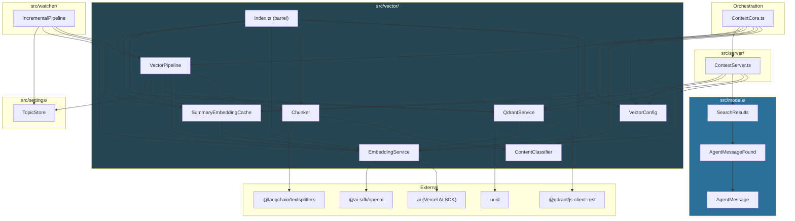

There are no circular dependencies. The dependency flow is strictly downward: Orchestration → Vector Modules → External Libraries, with the Search Models sitting between the server and the domain model. The `IncrementalPipeline` in `src/watcher/` also depends on vector modules for live update processing.

---

## 18. Design Trade-offs

### 18.1 Embed-per-chunk vs Embed-per-message

We embed each **chunk** individually rather than the full message. This costs more API calls but produces better search granularity — a long message discussing five topics will match on the specific topic chunk rather than diluting the embedding with unrelated content.

### 18.2 Sequential chunk embedding vs batch

Chunks are embedded one at a time via `embed()` rather than batched via `embedBatch()` within the pipeline loop. This simplifies error isolation (a failed chunk doesn't block siblings) at the cost of higher latency. The `embedBatch()` method exists on `EmbeddingService` and could be adopted in a future optimization pass.

### 18.3 Pre-computed summary vectors vs inline embedding

Summary vectors are pre-computed and cached by `SummaryEmbeddingCache` rather than embedded inline during the chunk indexing loop. This has several advantages:
- **Zero OpenAI calls for summaries** during chunk indexing (already cached)
- **Shared across chunks** — all chunks of the same message get the same summary vector via a single cache lookup
- **Decoupled lifecycle** — summary embeddings survive across Qdrant collection recreations
- **Sync tracking** — the cache knows which sessions still need their summary vectors applied to Qdrant

The trade-off is added complexity (two persistence files, sync state tracking) and the possibility of stale embeddings if a summary text changes without invalidation. The `POST /api/topics` endpoint handles the primary invalidation case.

### 18.4 Search-time collection enumeration

At query time, the system discovers harness names from `CCSettings` machine config rather than listing Qdrant collections directly. This means collections created for harnesses that have since been removed from config won't be searched. This is intentional — config is the source of truth for what's active.

### 18.5 No schema migration

All collections are created with the V2 named-vector schema (`chunk` + `summary`) from the start. There is no migration logic — `ensureCollection()` is create-if-missing only. This eliminates the risk of accidentally destroying existing embeddings.

> **History**: The R2BQ upgrade originally included destructive legacy→V2 migration (delete + recreate), which wiped all existing chunk embeddings and forced expensive re-embedding via OpenAI. This was removed in R2QUC (2026-03-21). See [`r2quc-qudrant-upgrade-cleanup.md`](../../upgrades/2026-03/r2quc-qudrant-upgrade-cleanup.md).

### 18.6 No incremental re-indexing

The pipeline runs against **all** messages on every startup. The preloaded `indexedMessageIds` set makes this idempotent but not free — each harness requires a Qdrant scroll to build the set. For very large corpora, a "last indexed timestamp" watermark could skip messages older than the most recent full run.
