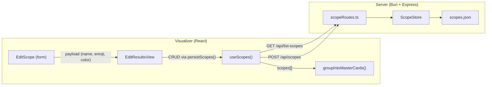
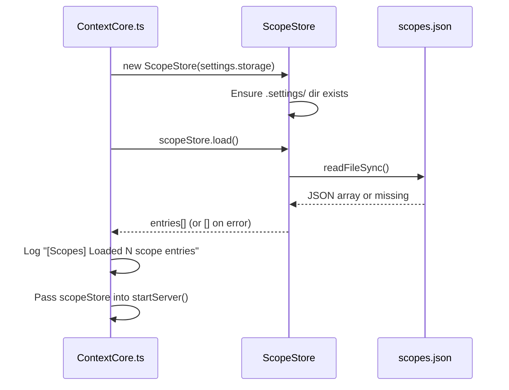
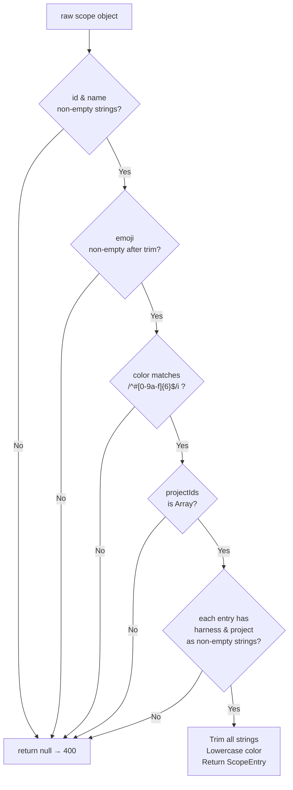
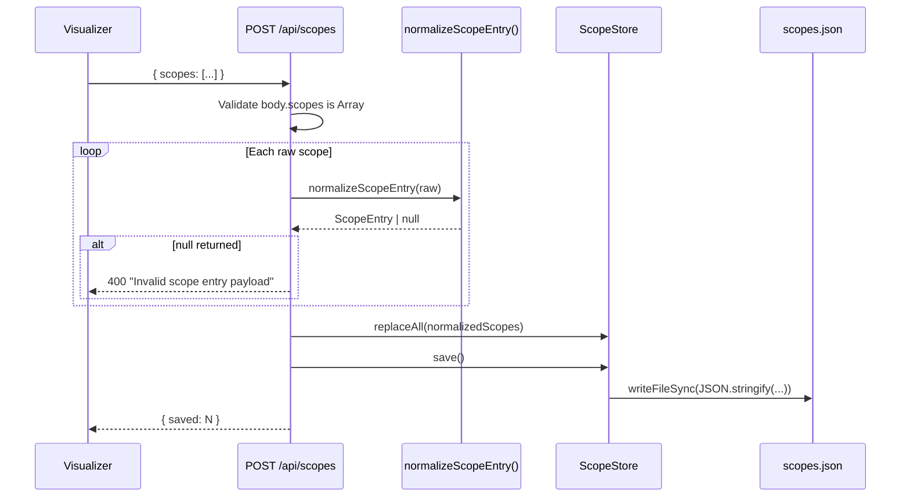
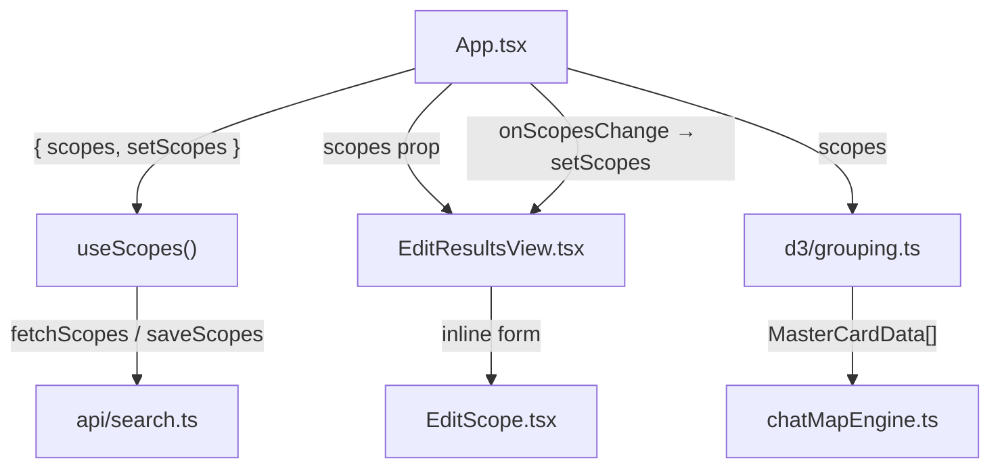
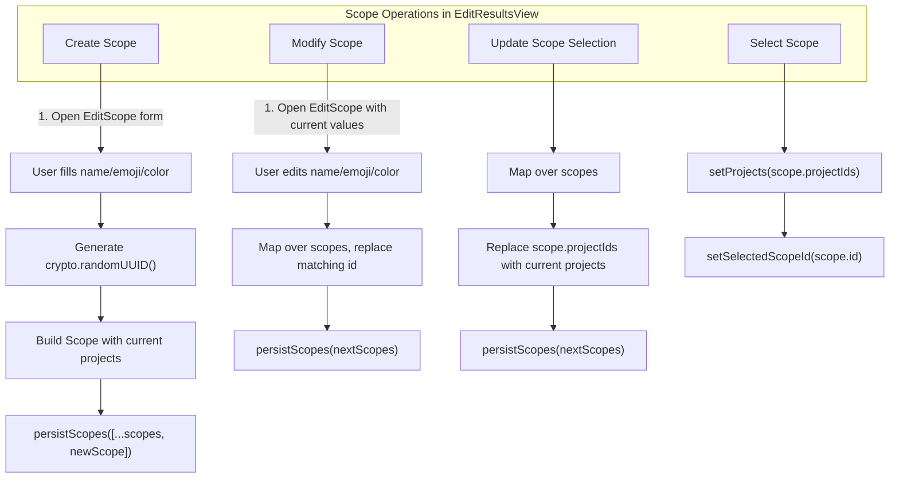
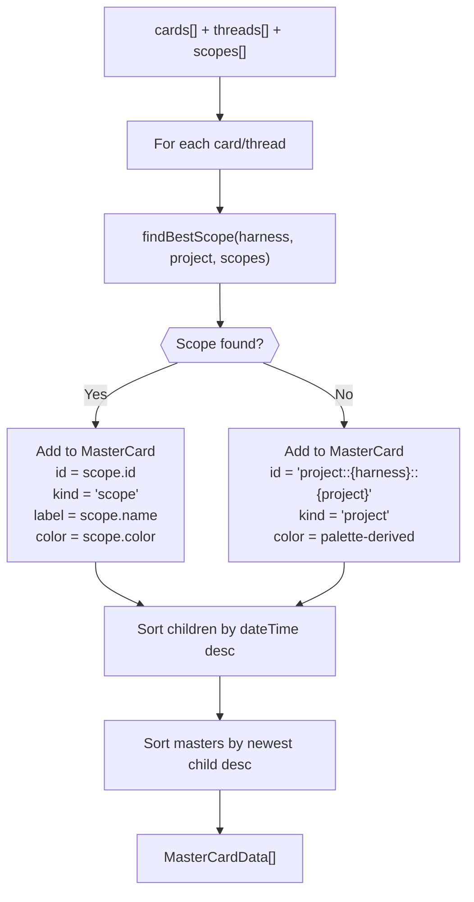
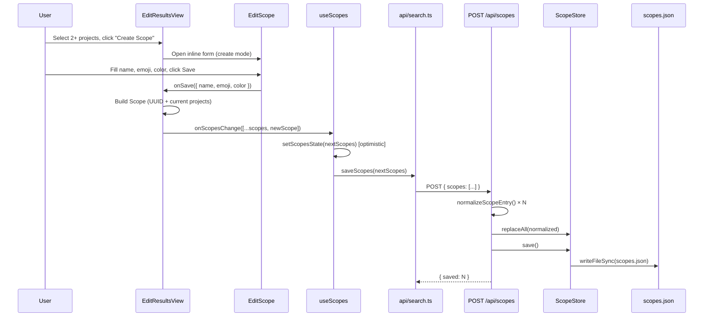
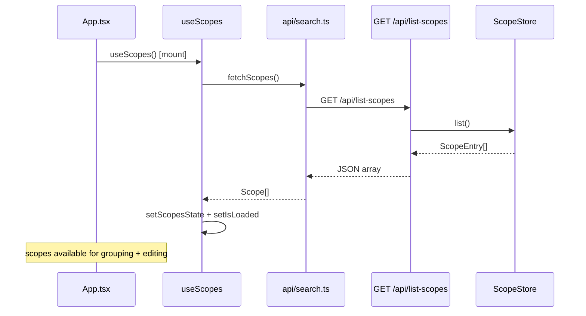
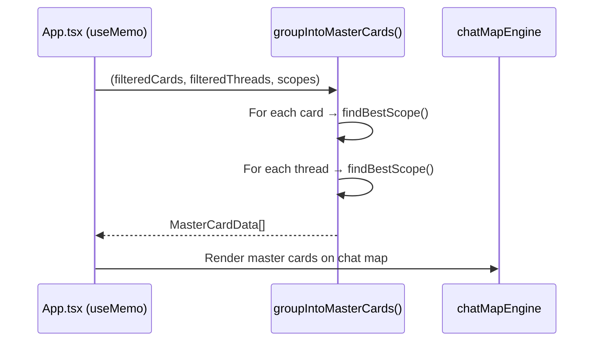

# Scopes – Architectural Review

**Date**: 2026-03-26  
**Scope**: Project scoping system — FE management, BE persistence, and display-time grouping  
**Storage**: `{storage}/.settings/scopes.json` (server-side JSON file)

---

## 1. System Overview

Scopes let users **group multiple `(harness, project)` pairs** under a named, colored, emoji-tagged container. They serve two core purposes:

1. **Editing convenience** — in the "New View / Edit View" dialog, clicking a scope button selects its member projects instantly.
2. **Visual grouping** — at render time, the chat-map engine groups cards/threads into **MasterCards** by scope rather than raw project, giving a higher-level view of related work.

Scopes are **global** — they are not per-view. Once created, a scope persists in `scopes.json` and is available across all views.



---

## 2. Data Model

### 2.1 Frontend Type (`visualizer/src/types.ts`)

```typescript
type SelectedProject = { harness: string; project: string };

type Scope = {
    id: string;           // crypto.randomUUID(), generated client-side
    name: string;         // user-supplied display name
    emoji: string;        // 1-2 glyph emoji
    color: string;        // #RRGGBB hex string
    projectIds: SelectedProject[];
};
```

### 2.2 Backend Type (`server/src/models/ScopeEntry.ts`)

```typescript
type ScopeProject = { harness: string; project: string };

type ScopeEntry = {
    id: string;
    name: string;
    emoji: string;
    color: string;        // normalized to lowercase #rrggbb
    projectIds: ScopeProject[];
};
```

The types are structurally identical. `ScopeEntry` is the server's canonical name; `Scope` is the FE alias. The server normalizes all strings (trim + lowercase color) before persisting.

### 2.3 MasterCardData (Render-Time Container)

When scopes are applied at render time, cards/threads are grouped into `MasterCardData`:

```typescript
type MasterCardData = {
    id: string;                 // scope.id  OR  "project::{harness}::{project}"
    label: string;              // scope.name  OR  project name
    emoji: string;              // scope.emoji  OR  ""
    color: string;              // scope.color  OR  palette-derived
    kind: "scope" | "project";  // discriminator
    cards: CardData[];
    threads: ThreadCardData[];
    x: number; y: number; w: number; h: number;
};
```

---

## 3. Persistence Layer (Backend)

### 3.1 File Location

```
{storage}/
├── .settings/
│   ├── scopes.json        ← flat JSON array of ScopeEntry[]
│   └── topics.json        ← (sibling — AI topic summaries)
└── ...
```

### 3.2 `ScopeStore` (`server/src/settings/ScopeStore.ts`)

| Method        | Signature                      | Behavior                                                                           |
| ------------- | ------------------------------ | ---------------------------------------------------------------------------------- |
| `constructor` | `(storagePath: string)`        | Resolves `{storagePath}/.settings/scopes.json`, creates `.settings/` dir if absent |
| `load`        | `(): void`                     | Reads & parses `scopes.json`; on missing file or parse error → `[]` with warning   |
| `save`        | `(): void`                     | Writes current entries to `scopes.json` (2-space indent JSON)                      |
| `list`        | `(): ScopeEntry[]`             | Returns in-memory array by reference                                               |
| `replaceAll`  | `(scopes: ScopeEntry[]): void` | Replaces in-memory array (caller must call `save()` separately)                    |

**Design notes:**
- Read/write via `fs.readFileSync` / `fs.writeFileSync` — synchronous, no concurrency guards.
- The store is a **full-replacement** model. Every save writes the entire array; there is no append/patch/delete operation on disk.
- Follows the same pattern as `TopicStore` (sibling in the same `settings/` directory).

### 3.3 Startup Initialization



`ScopeStore` is instantiated and loaded once at startup, then injected into `RouteContext` as an optional field (`scopeStore?: ScopeStore`). If absent, routes return graceful defaults.

---

## 4. API Layer

### 4.1 Route Registration

`scopeRoutes.register(app, ctx)` is called from `ContextServer.ts`, which mounts it alongside all other route groups.

### 4.2 Endpoints

| Method | Path               | Body                       | Response            | Description                                       |
| ------ | ------------------ | -------------------------- | ------------------- | ------------------------------------------------- |
| `GET`  | `/api/list-scopes` | —                          | `ScopeEntry[]`      | Returns all scopes (or `[]` if store unavailable) |
| `POST` | `/api/scopes`      | `{ scopes: ScopeEntry[] }` | `{ saved: number }` | Validates, replaces all scopes, writes to disk    |

### 4.3 Validation — `normalizeScopeEntry()`

Every scope in the `POST` body is individually validated by `normalizeScopeEntry()` in `routeUtils.ts`. If **any** entry fails validation, the entire request is rejected with `400`.



**Normalization applied:**
- `id`, `name`, `emoji` → trimmed
- `color` → trimmed + lowercased (e.g., `#3366CC` → `#3366cc`)
- Each `projectIds[].harness` and `.project` → trimmed

### 4.4 Write Flow



---

## 5. Frontend Architecture

### 5.1 Module Map



### 5.2 `useScopes` Hook (`visualizer/src/hooks/useScopes.ts`)

The central scope lifecycle manager:

1. **On mount**: `fetchScopes()` → `GET /api/list-scopes` → hydrates local state.
2. **On update**: `setScopes(next)` → optimistic local state update → `saveScopes(next)` → `POST /api/scopes` (fire-and-forget with error logging).
3. **Returns**: `{ scopes, setScopes, isLoaded }`.

The hook is consumed once in `App.tsx` and threaded down via props.

### 5.3 `EditResultsView` — Scope CRUD Hub

`EditResultsView` is the "New View / Edit View" modal and serves as the **only UI surface for scope management**. It receives `scopes` and `onScopesChange` as props.

#### Internal State

```typescript
const [selectedScopeId, setSelectedScopeId] = useState<string | null>(null);
const [scopeEditorMode, setScopeEditorMode] = useState<"create" | "modify" | null>(null);
```

#### Derived Values

| Name                     | Purpose                                                                 |
| ------------------------ | ----------------------------------------------------------------------- |
| `filteredScopes`         | Scopes whose `name` matches the project filter input (case-insensitive) |
| `selectedScope`          | Resolved `Scope` object from `selectedScopeId`                          |
| `canCreateScope`         | `true` when `projects.length >= 2`                                      |
| `hasScopeProjectChanges` | `true` when selected scope's `projectIds` differ from current selection |

#### Operations



Every mutation calls `persistScopes()` → `onScopesChange()` → `useScopes.setScopes()` → optimistic state + `POST /api/scopes`.

**Key constraint**: There is **no delete** operation. Scopes can only be created or modified. To remove a scope, a user would need to do so through direct file editing or a future UI addition.

### 5.4 `EditScope` Component (`visualizer/src/components/searchView/EditScope.tsx`)

A pure presentational inline form — no API calls, no state management beyond local field values.

| Prop           | Type                | Purpose                          |
| -------------- | ------------------- | -------------------------------- |
| `initialName`  | `string?`           | Pre-fill for modify mode         |
| `initialEmoji` | `string?`           | Defaults to `"📦"`                |
| `initialColor` | `string?`           | Defaults to `"#0ea5e9"`          |
| `title`        | `string?`           | Form header text                 |
| `saveLabel`    | `string?`           | Submit button label              |
| `onSave`       | `(payload) => void` | Returns `{ name, emoji, color }` |
| `onCancel`     | `() => void`        | Dismiss form                     |

**Validation rules:**
- `name`: required, max 40 characters (trimmed)
- `emoji`: trimmed, max 2 grapheme clusters, defaults to `📦` if empty
- `color`: must match `/^#[0-9a-f]{6}$/i`, defaults to `#0ea5e9` if invalid

---

## 6. Display-Time Grouping

### 6.1 `groupIntoMasterCards()` (`visualizer/src/d3/grouping.ts`)

This function is the **read-side consumer** of scopes. It runs inside a `useMemo` in `App.tsx`, recomputed whenever cards, threads, or scopes change.



### 6.2 Scope Conflict Resolution — "Most Specific Wins"

A single `(harness, project)` pair can appear in **multiple scopes**. The `findBestScope()` function resolves this:

```
For each scope that contains the project:
    → pick the one with the fewest projectIds (most specific)
```

This means a scope with 2 projects beats a scope with 5 projects for any shared member. In case of a tie (equal `projectIds.length`), the first encountered scope wins (iteration order).

### 6.3 Scope Activation Conditions

Grouping only runs for view types in `{ "latest", "search-threads", "search" }`. Other view types (agent builder, favorites, templates, etc.) do not produce MasterCards.

---

## 7. End-to-End Data Flow

### 7.1 Creating a Scope



### 7.2 Loading Scopes on Startup



### 7.3 Scope → Visual Grouping



---

## 8. `scopes.json` File Format

A flat JSON array at the root. No wrapper object, no metadata.

```json
[
    {
        "id": "a1b2c3d4-e5f6-7890-abcd-ef1234567890",
        "name": "Backend Core",
        "emoji": "⚙️",
        "color": "#3366cc",
        "projectIds": [
            { "harness": "ClaudeCode", "project": "context-core" },
            { "harness": "Cursor", "project": "context-core" }
        ]
    },
    {
        "id": "f9e8d7c6-b5a4-3210-fedc-ba0987654321",
        "name": "Frontend",
        "emoji": "🎨",
        "color": "#e91e63",
        "projectIds": [
            { "harness": "ClaudeCode", "project": "visualizer" },
            { "harness": "VSCode", "project": "visualizer" },
            { "harness": "Cursor", "project": "visualizer" }
        ]
    }
]
```

**Constraints:**
- Maximum file size: unbounded (no enforced limit)
- Duplicate scope IDs: not validated (UUIDs make collisions astronomically unlikely)
- Empty `projectIds` array: passes validation but produces a scope that never matches anything
- The file is overwritten atomically on every save (no journaling, no WAL)

---

## 9. Files Changed / Involved

| File                                                       | Layer          | Role                                                           |
| ---------------------------------------------------------- | -------------- | -------------------------------------------------------------- |
| `server/src/models/ScopeEntry.ts`                          | BE Model       | `ScopeEntry` and `ScopeProject` types                          |
| `server/src/settings/ScopeStore.ts`                        | BE Persistence | Load/save `scopes.json`, in-memory array management            |
| `server/src/server/routes/scopeRoutes.ts`                  | BE API         | `GET /api/list-scopes`, `POST /api/scopes`                     |
| `server/src/server/routeUtils.ts`                          | BE Validation  | `normalizeScopeEntry()` — strict input sanitization            |
| `server/src/server/RouteContext.ts`                        | BE DI          | Optional `scopeStore` field in shared route context            |
| `server/src/server/ContextServer.ts`                       | BE Bootstrap   | Mounts scope routes, passes store via context                  |
| `server/src/ContextCore.ts`                                | BE Bootstrap   | Creates and loads `ScopeStore` at startup                      |
| `visualizer/src/types.ts`                                  | FE Types       | `Scope`, `SelectedProject`, `MasterCardData`                   |
| `visualizer/src/api/search.ts`                             | FE API         | `fetchScopes()`, `saveScopes()`                                |
| `visualizer/src/hooks/useScopes.ts`                        | FE State       | Hook managing scope lifecycle (load + optimistic save)         |
| `visualizer/src/components/searchView/EditResultsView.tsx` | FE UI          | Scope CRUD hub (create, modify, update selection, select)      |
| `visualizer/src/components/searchView/EditScope.tsx`       | FE UI          | Inline form for scope name/emoji/color editing                 |
| `visualizer/src/components/searchView/EditResultsView.css` | FE Style       | Scope button pills, editor panel styles                        |
| `visualizer/src/d3/grouping.ts`                            | FE Grouping    | `groupIntoMasterCards()`, `findBestScope()`                    |
| `visualizer/src/App.tsx`                                   | FE Root        | Wires `useScopes` → `EditResultsView` + `groupIntoMasterCards` |

---

## 10. Design Notes & Trade-offs

1. **Full-replacement persistence**: Every scope mutation sends the **entire scope array** to the server. Simple and conflict-free for a single-user system, but would need delta operations or ETags for multi-client use.

2. **Optimistic UI**: `useScopes.setScopes()` updates React state immediately, then fires the `POST` asynchronously. If the save fails, the UI is already updated — there is no rollback mechanism. Errors are logged to console only.

3. **Delete UI now supported**: The Edit Results modal now supports scope deletion from the UI. Deletion is still implemented as client-side filtering plus full-array `POST /api/scopes`, keeping backend persistence unchanged.

4. **Scope IDs are client-generated**: UUIDs via `crypto.randomUUID()`. The server accepts them as-is after trimming — no server-side ID generation or uniqueness enforcement.

5. **Synchronous file I/O**: `ScopeStore` uses `readFileSync`/`writeFileSync`. Acceptable for a local-first tool with infrequent writes, but blocks the event loop during save.

6. **No scope-view binding**: Scopes are global, not per-view. All views share the same scope pool. A view's `projects[]` selection is separate from scopes — scopes are shortcuts to populate that selection.

7. **"Most specific" conflict resolution**: When a project belongs to multiple scopes, the scope with the fewest total `projectIds` wins. This is deterministic but not user-configurable — there is no explicit scope priority or ordering mechanism.

8. **Multi-select scope UX**: Scope pills now include checkboxes and support multi-select. Exactly one selected scope enables modify/update semantics, while multi-select is primarily for quick union-based project loading and batch deletion.
