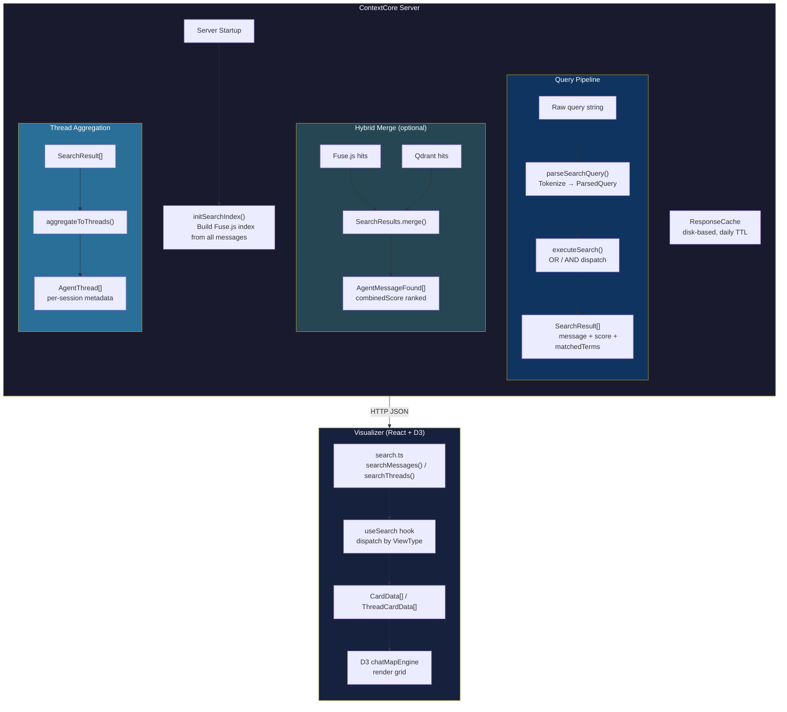
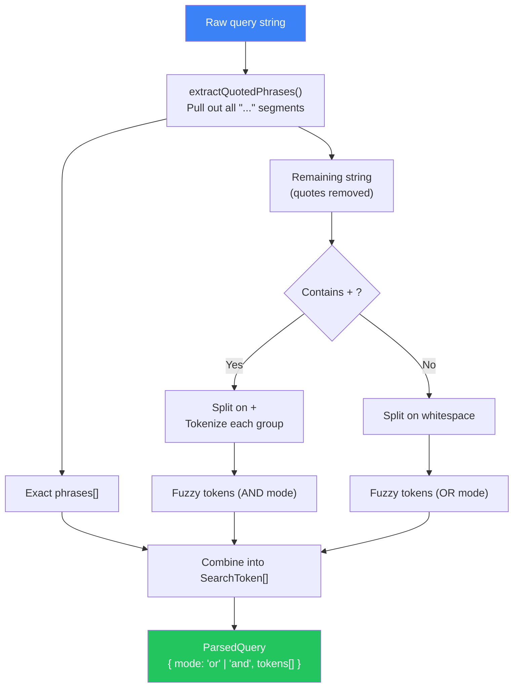
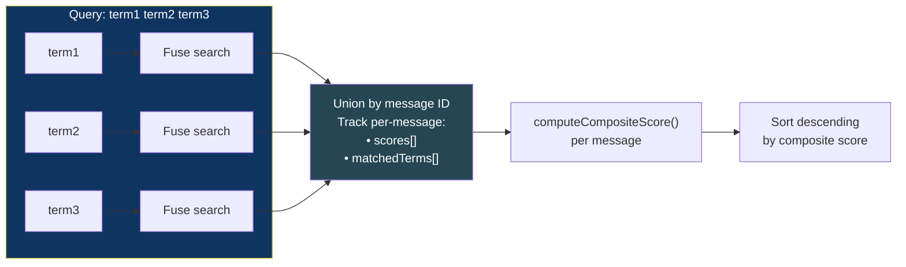
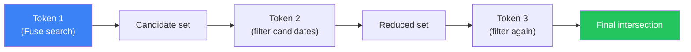
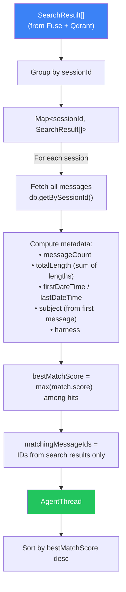
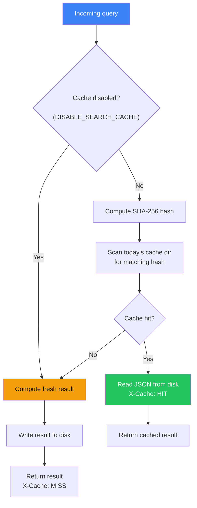
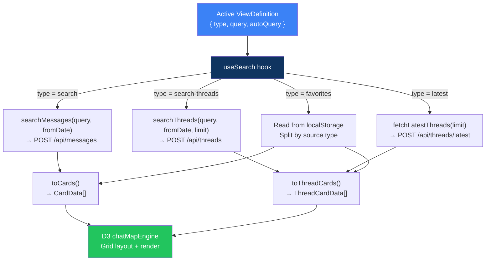

# Search System — Architectural Review

**Date**: 2026-03-22
**Scope**: Query parsing, search execution, thread aggregation, response caching, API endpoints, date filtering, result limiting, visualizer integration
**Parent**: [`archi-context-core.md`](../archi-context-core-level0.md)
**Upgrade specs**: [`r2ubs-better-search.md`](../../upgrades/2026-03/r2ubs-better-search.md), [`r2ubs-better-search-ui.md`](../../visualizer/zz-reach2/upgrades/r2ubs-better-search-ui.md)

---

## 1. Overview

ContextCore's search system provides two levels of retrieval over ingested AI chat messages: **message-level** (individual turns) and **thread-level** (conversation sessions). It supports an advanced query syntax with exact phrases, OR, and AND operators, executed through a cached Fuse.js fuzzy index. When Qdrant is enabled, results are merged with semantic vector search for hybrid scoring (see [Qdrant Architecture](archi-qdrant.md)).

The system spans three layers:

| Layer                 | Components                                                | Responsibility                                    |
| --------------------- | --------------------------------------------------------- | ------------------------------------------------- |
| **Query parsing**     | `queryParser.ts`                                          | Tokenize raw input into structured `ParsedQuery`  |
| **Execution**         | `searchEngine.ts`, `SearchResults.ts`, `ResponseCache.ts` | Index, search, merge, cache                       |
| **Aggregation & API** | `threadAggregator.ts`, `ContextServer.ts`, `routes/*.ts`  | Group results into threads, expose HTTP endpoints |
| **Visualizer**        | `search.ts`, `useSearch.ts`, `types.ts`                   | Fetch, transform, and render results in the D3 UI |

---

## 2. System Architecture

### 2.1 High-Level Data Flow



### 2.2 Module Inventory

| Module                | Path                                 | Responsibility                                                                                                                                        |
| --------------------- | ------------------------------------ | ----------------------------------------------------------------------------------------------------------------------------------------------------- |
| **queryParser**       | `src/search/queryParser.ts`          | Tokenize raw queries into `ParsedQuery` (exact, fuzzy, OR, AND)                                                                                       |
| **searchEngine**      | `src/search/searchEngine.ts`         | Module-level Fuse.js index cache; `executeSearch()` dispatcher                                                                                        |
| **fieldFilters**      | `src/search/fieldFilters.ts`         | Field-targeted filters: `filterResultsBySymbols`, `filterResultsBySubject`, `filterMessagesBySymbols`, `filterMessagesBySubject`, `messagesToResults` |
| **threadAggregator**  | `src/search/threadAggregator.ts`     | Group `SearchResult[]` into `AgentThread[]` by session                                                                                                |
| **AgentMessageFound** | `src/models/AgentMessageFound.ts`    | `AgentMessage` subclass with `qdrantScore`, `fuseScore`, `combinedScore`                                                                              |
| **SearchResults**     | `src/models/SearchResults.ts`        | Merge Fuse.js + Qdrant hits, deduplicate by message ID, sort by combined score                                                                        |
| **AgentThread**       | `src/models/AgentThread.ts`          | Thread metadata type: session stats, matching message IDs, best score                                                                                 |
| **ResponseCache**     | `src/cache/ResponseCache.ts`         | Disk-based query result cache with daily TTL and content-hash filenames                                                                               |
| **CCSettings**        | `src/settings/CCSettings.ts`         | `FUSE_THRESHOLD`, `QDRANT_MIN_SCORE`, `DISABLE_SEARCH_CACHE` configuration                                                                            |
| **ContextServer**     | `src/server/ContextServer.ts`        | Thin orchestrator: middleware, route mounting, port binding                                                                                           |
| **routeUtils**        | `src/server/routeUtils.ts`           | Shared helpers: `resolveSubject`, project remap, validation, `runQdrantSearch()`, `applyTopicSubjects()`, `parseProjectFilters()`                     |
| **messageRoutes**     | `src/server/routes/messageRoutes.ts` | `/api/messages` (GET+POST) — primary message search with Fuse.js + Qdrant hybrid, date filtering, field filters                                       |
| **threadRoutes**      | `src/server/routes/threadRoutes.ts`  | `POST /api/threads` (Fuse.js + Qdrant hybrid → thread aggregation), `GET /api/threads/latest`                                                         |

---

## 3. Query Syntax

### 3.1 Operators

| Syntax            | Mode  | Meaning                                   | Example                     |
| ----------------- | ----- | ----------------------------------------- | --------------------------- |
| `term`            | Fuzzy | Default Fuse.js behavior                  | `storyteller`               |
| `"phrase"`        | Exact | Case-insensitive substring match          | `"error handling"`          |
| `term1 term2`     | OR    | Match messages containing **either** term | `storyteller nncharacter`   |
| `term1 + term2`   | AND   | Match messages containing **both** terms  | `storyteller + nncharacter` |
| `"phrase" + term` | AND   | Exact phrase AND fuzzy term               | `"tile info" + render`      |

### 3.2 Parsing Algorithm



### 3.3 Types

```typescript
type SearchToken =
  | { type: "fuzzy"; term: string }
  | { type: "exact"; phrase: string };

type ParsedQuery =
  | { mode: "or"; tokens: SearchToken[] }
  | { mode: "and"; tokens: SearchToken[] };
```

---

## 4. Search Execution

### 4.1 Fuse.js Index

The Fuse.js index is built **once** at server startup from all messages in `MessageDB` and cached at module scope in `searchEngine.ts`. Since ingestion is a batch process, message data is static during runtime — the index is never rebuilt.

**Index configuration:**

| Property             | Value                                                     |
| -------------------- | --------------------------------------------------------- |
| **Threshold**        | Configurable via `FUSE_THRESHOLD` env var (default `0.4`) |
| **Min match length** | 3 characters                                              |
| **Score included**   | Yes                                                       |

**Weighted search keys:**

| Key       | Weight | Purpose                                                |
| --------- | ------ | ------------------------------------------------------ |
| `message` | 3      | Full message content — highest priority                |
| `subject` | 2      | AI-generated subject/title                             |
| `symbols` | 2      | Extracted code symbols (functions, classes, variables) |
| `tags`    | 2      | AI-assigned metadata tags                              |
| `context` | 1      | File paths and contextual references                   |

### 4.2 OR Query Execution

OR queries execute each token independently and **union** the results:



Each message accumulates scores from every token it matches. The composite score combines match quality and match breadth.

### 4.3 AND Query Execution

AND queries use **sequential filtering** — search the first token, then filter survivors through each subsequent token:



This strategy is faster when the first token is selective, and avoids computing full result sets for all tokens upfront. After the first token uses Fuse.js, subsequent tokens use case-insensitive substring matching against the shrinking candidate set.

### 4.4 Exact Phrase Matching

Exact phrases (quoted tokens) bypass Fuse.js entirely. They perform a simple **case-insensitive substring match** against `message.message`, returning a perfect score of `0` (Fuse convention: 0 = perfect).

### 4.5 Composite Scoring

For OR queries that merge results from multiple tokens, a configurable scoring formula balances **match quality** against **match breadth**:

```
normalizedScore = 1 - avgFuseScore          // invert: 0=worst → 1=best
matchRatio      = matchedTerms / totalTerms  // breadth: 0=one term → 1=all terms

compositeScore  = (normalizedScore × scoreWeight) + (matchRatio × countWeight)
```

| Parameter     | Default | Purpose                                                  |
| ------------- | ------- | -------------------------------------------------------- |
| `scoreWeight` | 0.6     | Importance of how well matched terms scored individually |
| `countWeight` | 0.4     | Importance of how many query terms matched               |

The defaults favor a message that matches one term extremely well over a message that weakly matches many terms, while still rewarding breadth.

### 4.6 SearchResult Type

Each search result carries two score representations:

```typescript
type SearchResult = {
  message: AgentMessage;
  score: number;         // composite score (higher = better) — used for Fuse-internal ranking
  rawFuseScore: number;  // original Fuse.js score (0=best, 1=worst) — used for hybrid merge
  matchedTerms: string[];
};
```

The `score` (composite) drives sort order within Fuse-only results. The `rawFuseScore` is passed to the hybrid merge formula so that `AgentMessageFound.fromAgentMessage()` can correctly invert it (Fuse convention: 0 = perfect). This avoids double-inversion — the composite score is already higher-is-better and must not be re-inverted.

---

## 5. Hybrid Merge (Qdrant)

When Qdrant is enabled, `POST /api/messages` and `POST /api/threads` run **Fuse.js and Qdrant searches**, then merge them. The merge deduplicates by message ID and computes a weighted combined score. See [Qdrant Architecture](archi-qdrant.md) for full details on the vector pipeline, embedding service, and collection management.

Qdrant integration is **additive and gated** — when `QDRANT_URL` and `OPENAI_API_KEY` are absent, the search system behaves exactly as described in this document with Fuse.js-only results.

### 5.1 Combined Score Formula

`AgentMessageFound.fromAgentMessage()` computes a weighted combined score from the raw Fuse and Qdrant scores:

```
// When Qdrant is present:
combinedScore = qdrantScore × 0.50 + normalizedFuseScore × 0.50

// When Qdrant is absent (disabled or no hits for this message):
combinedScore = normalizedFuseScore   // full 0.0–1.0 range
```

Where `normalizedFuseScore = 1 − rawFuseScore` (invert Fuse convention: 0=best → 1=best).

| Weight | Value    | Location                   |
| ------ | -------- | -------------------------- |
| Qdrant | **0.50** | `AgentMessageFound.ts` L81 |
| Fuse   | **0.50** | `AgentMessageFound.ts` L82 |

The 50/50 split gives equal weight to semantic similarity (Qdrant) and lexical matching (Fuse). When Qdrant is absent, the Fuse score occupies the full 0–1 range instead of being compressed.

### 5.2 Subject-Aware Qdrant Channel Routing

`runQdrantSearch()` routes embedding queries to the appropriate Qdrant vector channels based on the combination of `query` and `subject` parameters:

| Inputs          | Qdrant `chunk` channel | Qdrant `summary` channel | Embedding calls     |
| --------------- | ---------------------- | ------------------------ | ------------------- |
| `q` only        | ✅ embed(`q`)           | ✅ embed(`q`)             | 1 (query)           |
| `q` + `subject` | ✅ embed(`q`)           | ✅ embed(`subject`)       | 2 (query + subject) |
| `subject` only  | ✗ skip                 | ✅ embed(`subject`)       | 1 (subject)         |
| `symbols` only  | ✗ skip                 | ✗ skip                   | 0                   |
| `q` + `symbols` | ✅ embed(`q`)           | ✅ embed(`q`)             | 1 (query)           |

**Key principle**: Subject **only** searches the `summary` channel — never `chunk`. The summary vector represents session-level topic meaning, which is where subject relevance lives. Searching `chunk` with a subject term would match on incidental content overlap.

### 5.3 Qdrant Payload Filters

When `symbols` is specified, a Qdrant payload filter is passed to the `search()` call to narrow results at the vector DB level:

```typescript
filter: { must: [{ key: "symbols", match: { text: symbolsTerm } }] }
```

The `QdrantService.search()` method accepts an optional `filter?: QdrantPayloadFilter` parameter that is spread into the Qdrant client request. This reduces the number of irrelevant results before they reach the application layer.

### 5.4 Post-Merge Field Filtering

After `SearchResults.merge()` combines Fuse and Qdrant hits, field filters are applied to the merged result set to ensure Qdrant-sourced results also respect `symbols` and `subject` constraints:

```
merged = SearchResults.merge(fuseHits, qdrantHits, ...)
if (symbolsTerm) → filter merged.results by symbols[].includes(symbolsTerm)
if (subjectTerm) → filter merged.results by subject.includes(subjectTerm)
```

This is a safety net — Qdrant payload filters narrow results at query time, but post-merge filtering guarantees correctness even if payload data is stale or incomplete.

### 5.5 Field-Only Relevance Scoring

When no `query` text is provided (field-only search with `symbols`/`subject`), `messagesToResults()` computes a relevance score instead of assigning a flat 1.0:

```
score = matchPrecision × 0.6 + recencyBoost × 0.4
```

| Signal              | Formula                                 | Range     |
| ------------------- | --------------------------------------- | --------- |
| Symbol match type   | exact name = 1.0, substring = 0.7       | 0.0 – 1.0 |
| Subject match ratio | `term.length / subject.length`          | 0.0 – 1.0 |
| Recency boost       | `max(0.8, 1.0 − daysSince / 365 × 0.2)` | 0.8 – 1.0 |

`matchedTerms` is populated with the symbol/subject terms that matched, enabling `countTermHits()` in thread aggregation.

---

## 6. Thread Aggregation

### 6.1 Purpose

While `POST /api/messages` returns individual messages, `POST /api/threads` returns **conversation threads** as first-class entities. This supports discovery workflows where users want to find relevant conversations, not individual turns.

### 6.2 Aggregation Flow



When Qdrant is enabled, `POST /api/threads` runs `runQdrantSearch()` (with the same subject-aware channel routing as message search), converts Qdrant hits to `SearchResult[]` by resolving `messageId` → `AgentMessage`, deduplicates with the Fuse results by message ID (skip existing), applies post-merge field filters and `fromDate` filtering, and then passes the combined set to `aggregateToThreads()`.

### 6.3 AgentThread Shape

```typescript
type AgentThread = {
  sessionId: string;          // unique session identifier
  subject: string;            // from first message in session
  harness: string;            // source harness (ClaudeCode, Cursor, etc.)
  messageCount: number;       // total messages in thread
  totalLength: number;        // sum of character lengths across all messages
  firstDateTime: string;      // ISO datetime of earliest message
  lastDateTime: string;       // ISO datetime of latest message
  firstMessage: string;       // content of first message (initial user prompt)
  matchingMessageIds: string[]; // only the message IDs that matched the query
  bestMatchScore: number;     // highest composite score among matches (0-1)
};
```

### 6.4 Latest Threads

`getLatestThreads()` provides a non-search variant: it returns threads sorted by most recent activity, used by the **Latest** view in the visualizer. These threads have `bestMatchScore: 1.0` (not search-ranked) and `matchingMessageIds` pointing to the most recent message.

---

## 7. Response Cache

### 7.1 Strategy

Search responses are cached to disk with a **daily TTL** to avoid redundant computation for repeated queries. Since the message corpus is static at runtime (loaded once at startup), cached results remain valid for the day they were computed.

The `withCache()` wrapper supports an optional `maxAgeMs` parameter for finer-grained time-based invalidation. When set, the cached file's modification time is checked — if it's older than `maxAgeMs`, the result is recomputed and overwritten. This is used by the **latest threads** endpoint with a **5-minute TTL**, since "latest" results change as new conversations are ingested.

### 7.2 Endpoint Coverage

| Endpoint                   | Cached                          | TTL       | Cache key prefix |
| -------------------------- | ------------------------------- | --------- | ---------------- |
| `POST /api/messages`       | ✅ When `searchTerms` is present | Daily     | `msg`            |
| `POST /api/threads`        | ✅ Full-text and field-only      | Daily     | `thr`            |
| `POST /api/threads/latest` | ✅ Always                        | 5 minutes | `thr-latest`     |
| `GET /api/messages`        | ✗ Paginated browse              | —         | —                |
| `GET /api/messages/:id`    | ✗ Single lookup                 | —         | —                |
| `GET /api/threads/latest`  | ✗ (Deprecated in favor of POST) | —         | —                |

### 7.2 Cache Key

```
filename = {sanitized-query-prefix}--{sha256-hash-12chars}.json
path     = {storage}/zeCache/queries/YYYY-MM-DD/{filename}
```

The hash is computed from the **lowercased** query string, making cache lookups case-insensitive. The sanitized prefix makes cache files human-readable in the filesystem.

### 7.3 Flow



When `maxAgeMs` is specified (e.g., latest threads), the flow adds a freshness check after cache hit: if the file's mtime is older than the threshold, it falls through to recompute and overwrite.

---

## 8. API Endpoints

> **Note**: The legacy `/api/search` (GET+POST) and `/api/search/threads` (GET+POST) endpoints were removed in the [search consolidation](../../upgrades/2026-03/r2srf-serach-review-fixes.md). All search is now unified through `/api/messages` and `/api/threads`.

### 8.1 Message by ID: `GET /api/messages/:id`

Returns a single message by its ID. Resolves topic subject via `resolveSubject()`.

### 8.2 Message Browse: `GET /api/messages`

Paginated message browse with optional filters (`role`, `harness`, `model`, `project`, `subject`, `from`, `to`, `page`, `pageSize`). No Fuse/Qdrant search — direct `messageDB.queryMessages()`.

### 8.3 Message Search: `POST /api/messages`

Primary message search endpoint used by the visualizer. Runs the full Fuse.js + optional Qdrant hybrid pipeline.

**Request body:**

| Field         | Type                     | Description                                                                                       |
| ------------- | ------------------------ | ------------------------------------------------------------------------------------------------- |
| `searchTerms` | string                   | Full-text search query. Empty = field-only or paginated browse                                    |
| `symbols`     | string                   | Case-insensitive substring match against `AgentMessage.symbols[]`. Empty = not applied            |
| `subject`     | string                   | Case-insensitive substring match against `AgentMessage.subject`. Empty = not applied              |
| `fromDate`    | string                   | ISO date `YYYY-MM-DD` — only return messages on or after this date. Empty string = no date filter |
| `projects`    | `{ harness, project }[]` | Optional project scope filter                                                                     |
| `page`        | number                   | Page number (used in paginated browse mode only)                                                  |
| `pageSize`    | number                   | Results per page (used in paginated browse mode only)                                             |

**When `searchTerms` is present:** runs the full Fuse.js pipeline, applies `fromDate`/`projects`/`symbols`/`subject` field filters on Fuse results. Then runs `runQdrantSearch()` (subject-aware dual-channel with symbols payload filter) when Qdrant is enabled and `searchTerms` or `subject` is present. Merges via `SearchResults.merge()` using `rawFuseScore` for correct hybrid scoring. Applies post-merge field filters (symbols/subject) as a safety net. Resolves topic subjects via `applyTopicSubjects()`.

**Response shape** (`SerializedSearchResults`):

```json
{
  "results": [
    {
      "id": "...", "sessionId": "...", "harness": "...",
      "message": "...", "subject": "...",
      "qdrantScore": 0.85,
      "fuseScore": 0.12,
      "combinedScore": 0.86,
      ...
    }
  ],
  "query": "error handling",
  "engine": "hybrid",
  "totalFuseResults": 42,
  "totalQdrantResults": 15
}
```

The `engine` field indicates which engines contributed: `"fuse"`, `"qdrant"`, or `"hybrid"`.

**When `searchTerms` is empty and `symbols`/`subject` are present (field-only mode):** loads all messages via `getAllMessages()`, applies `fromDate`, `projects`, `symbols`, and `subject` filters, returns sorted by date descending.

**When all search params are empty:** delegates to `messageDB.queryMessages()` with `from: fromDate` and optional filters (`role`, `harness`, `model`, `project`). Returns paginated results.

### 8.4 Thread Search: `POST /api/threads`

Primary thread search endpoint used by the visualizer. Runs Fuse.js + optional Qdrant hybrid pipeline, then aggregates into threads.

**Request body:**

| Field         | Type                     | Description                                                                            |
| ------------- | ------------------------ | -------------------------------------------------------------------------------------- |
| `searchTerms` | string                   | Full-text search query. Empty = field-only mode (requires `symbols` or `subject`)      |
| `symbols`     | string                   | Case-insensitive substring match against `AgentMessage.symbols[]`. Empty = not applied |
| `subject`     | string                   | Case-insensitive substring match against `AgentMessage.subject`. Empty = not applied   |
| `fromDate`    | string                   | ISO date `YYYY-MM-DD` — filters messages before thread aggregation                     |
| `projects`    | `{ harness, project }[]` | Optional project scope filter                                                          |
| `limit`       | number                   | Max threads to return (0 or absent = no limit). Applied post-aggregation               |

**Flow:** Fuse.js search (or field-only from `getAllMessages()`) → filter by `fromDate` → filter by `projects` → filter by `symbols`/`subject` → Qdrant search (when enabled, union with Fuse results, dedup by message ID, apply `fromDate` + post-merge field filters) → `aggregateToThreads()` → optional `limit` truncation. All filtering happens before aggregation so threads only include temporally and field-relevant matches.

**Response shape** (`ThreadSearchResponse`):

```json
{
  "total": 5,
  "page": 1,
  "results": [
    {
      "sessionId": "...",
      "subject": "Refactor auth module",
      "harness": "ClaudeCode",
      "messageCount": 14,
      "totalLength": 28400,
      "firstDateTime": "2026-03-10T09:00:00.000Z",
      "lastDateTime": "2026-03-10T11:30:00.000Z",
      "firstMessage": "I need to refactor the authentication...",
      "matchingMessageIds": ["msg-1", "msg-7"],
      "bestMatchScore": 0.92,
      "hits": 4
    }
  ]
}
```

### 8.5 Latest Threads: `GET /api/threads/latest`

Returns the most recent conversation threads, sorted by last activity. No search query required.

| Parameter | Type   | Description                           |
| --------- | ------ | ------------------------------------- |
| `limit`   | number | Max threads to return (default `100`) |

Response shape is identical to `POST /api/threads`.

---

## 9. Visualizer Integration

### 9.1 View System

The visualizer organizes search functionality through a **view system** with four built-in view types:

| View Type          | View Name        | Behavior                                             |
| ------------------ | ---------------- | ---------------------------------------------------- |
| `"latest"`         | Latest           | Fetches recent threads via `GET /api/threads/latest` |
| `"search"`         | Search Messages  | Queries `POST /api/messages` for individual messages |
| `"search-threads"` | Search Threads 🧵 | Queries `POST /api/threads` for conversation threads |
| `"favorites"`      | Favorites ⭐      | Renders saved messages and threads from localStorage |

### 9.2 Client Data Flow



Search UI controls in the visualizer include:
- `Limit` selector on both `latest` and `search-threads` views (propagates to thread endpoints).
- `Instant filter...` text input for client-side filtering of already-fetched cards.

### 9.3 Card Types

The D3 engine renders two distinct card types, each with different visual treatment:

**CardData** (message cards):
- Title (subject or excerpt)
- Harness color stripe
- Role indicator
- Symbol badges
- Excerpt text (multi-LOD: short/medium/long)
- Score badge

**ThreadCardData** (thread cards):
- Title (subject)
- Harness color stripe
- Message count badge
- Total length (e.g., "12.4k chars")
- Date range (e.g., "Mar 10 – Mar 12")
- Match count (e.g., "3 matches")

Both card types support **star** (favorites) and **title click** (opens `ChatViewDialog`) interactions.

### 9.4 Favorites: Polymorphic Storage

The favorites system stores both messages and threads using a discriminated union:

```typescript
type FavoriteSource =
  | { type: "message"; data: SerializedAgentMessage }
  | { type: "thread"; data: SerializedAgentThread };

type FavoriteEntry = {
  cardId: string;
  viewId: string;
  source: FavoriteSource;
  addedAt: number;
};
```

When the favorites view is active, `useSearch` splits entries by source type and populates both `cards` (messages) and `threadCards` (threads) for simultaneous rendering.

Custom favorites text entries are saved as `type: "message"` with `harness: "custom"`. When created via `AddFavoriteMessage`, optional emoji/color metadata is persisted in tags (`customEmoji:*`, `customColor:*`).

---

## 10. Configuration

All search-relevant settings are loaded from environment variables with sensible defaults:

| Variable               | Default | Purpose                                                      |
| ---------------------- | ------- | ------------------------------------------------------------ |
| `FUSE_THRESHOLD`       | `0.4`   | Fuse.js match threshold (0 = exact only, 1 = match anything) |
| `QDRANT_MIN_SCORE`     | `0.6`   | Minimum cosine similarity for Qdrant results                 |
| `DISABLE_SEARCH_CACHE` | `false` | Bypass disk cache for debugging                              |

See [Qdrant Architecture](archi-qdrant.md) for additional vector-search environment variables (`QDRANT_URL`, `OPENAI_API_KEY`, etc.).

---

## 11. Design Decisions

| Question                  | Decision                                                                                                                        | Rationale                                                                                                             |
| ------------------------- | ------------------------------------------------------------------------------------------------------------------------------- | --------------------------------------------------------------------------------------------------------------------- |
| AND query strategy        | Sequential filtering                                                                                                            | Search first term → filter through subsequent terms; faster when first term is selective                              |
| OR scoring formula        | Weighted hybrid (60% score, 40% breadth)                                                                                        | Configurable via `ScoringConfig`; balances relevance and coverage                                                     |
| Fuse.js index lifecycle   | Build once at startup, module-level cache                                                                                       | Messages are static at runtime; avoids O(n) rebuilds per query                                                        |
| Thread deduplication      | Distinct sessions only                                                                                                          | `POST /api/messages` covers per-message results; threads are for conversation discovery                               |
| Pagination                | None by default; optional `limit` on `POST /api/threads`                                                                        | Message search returns all; thread search supports limit applied post-aggregation so ranking is preserved             |
| Date filtering            | Pre-aggregation on message `dateTime`                                                                                           | Filter by `fromDate` before thread aggregation so threads only include temporally relevant matches                    |
| `DateTime` coercion       | `String(result.message.dateTime)`                                                                                               | `AgentMessage.dateTime` is Luxon `DateTime`, not plain string; coerce before `Date.parse()`                           |
| Cache scope               | Active on `POST /api/messages`, `POST /api/threads`, `POST /api/threads/latest`                                                 | Daily TTL for search endpoints; 5-minute TTL for latest threads (results change as conversations arrive)              |
| Qdrant integration point  | `SearchResults.merge()` in server + post-merge field filters                                                                    | Additive; merge happens after both engines produce results; field filters applied uniformly post-merge                |
| Qdrant channel routing    | Subject → summary only; query → both channels                                                                                   | Summary vector represents session-level topic; chunk represents message content. Keeps channels semantically focused  |
| Hybrid score weights      | 50% Qdrant + 50% Fuse (equal)                                                                                                   | Balances semantic similarity with lexical precision; exact keyword matches get fair representation                    |
| Qdrant-absent scoring     | Use full Fuse range (0–1) when Qdrant absent                                                                                    | Avoids score compression to 0–0.5 range; UI can treat `combinedScore` uniformly                                       |
| Thread Qdrant integration | Run Qdrant in thread search, union with Fuse before aggregation                                                                 | Enables semantic thread discovery while preserving existing Fuse-based browsing                                       |
| Visualizer card types     | Separate `CardData` / `ThreadCardData`                                                                                          | Type safety; threads have fundamentally different fields than messages                                                |
| Favorites storage         | Polymorphic `FavoriteSource` union                                                                                              | Single favorites list holds both messages and threads                                                                 |
| Endpoint consolidation    | Removed `/api/search` (GET+POST) and `/api/search/threads` (GET+POST); unified via `POST /api/messages` and `POST /api/threads` | Eliminates 4 duplicate endpoints; shared `runQdrantSearch()` moved to `routeUtils.ts`; Qdrant now on all search paths |

---

## 12. File Map

| File                                 | Layer        | Purpose                                                                                                                                                            |
| ------------------------------------ | ------------ | ------------------------------------------------------------------------------------------------------------------------------------------------------------------ |
| `src/search/queryParser.ts`          | Parsing      | Tokenize queries, compute composite scores                                                                                                                         |
| `src/search/searchEngine.ts`         | Execution    | Fuse.js index, OR/AND dispatch, `executeSearch()`. `SearchResult` type includes `rawFuseScore` for hybrid merge                                                    |
| `src/search/fieldFilters.ts`         | Execution    | Field-targeted filters for `symbols` and `subject`; relevance scoring for field-only searches (`scoreSymbolMatch`, `scoreSubjectMatch`, `recencyBoost`)            |
| `src/search/threadAggregator.ts`     | Aggregation  | `aggregateToThreads()`, `getLatestThreads()`                                                                                                                       |
| `src/models/AgentMessageFound.ts`    | Model        | Message + hybrid search scores (50/50 weights, Qdrant-absent normalization)                                                                                        |
| `src/models/SearchResults.ts`        | Model        | Merge Fuse + Qdrant, deduplicate, rank                                                                                                                             |
| `src/models/AgentThread.ts`          | Model        | Thread metadata type                                                                                                                                               |
| `src/cache/ResponseCache.ts`         | Caching      | Disk-based daily query cache                                                                                                                                       |
| `src/settings/CCSettings.ts`         | Config       | Search thresholds and toggles                                                                                                                                      |
| `src/server/ContextServer.ts`        | API          | Orchestrator: middleware, route mounting, port binding                                                                                                             |
| `src/server/RouteContext.ts`         | API          | Shared service context interface for all route files                                                                                                               |
| `src/server/routeUtils.ts`           | API          | Shared helpers: `resolveSubject`, project remap, validation, `runQdrantSearch()` (subject-aware dual-channel), `applyTopicSubjects()`, `parseProjectFilters()`     |
| `src/server/routes/messageRoutes.ts` | API          | `GET /api/messages/:id`, `GET /api/messages`, `POST /api/messages` — primary message search with Fuse+Qdrant hybrid, post-merge field filters                      |
| `src/server/routes/threadRoutes.ts`  | API          | `POST /api/threads` (Fuse+Qdrant hybrid → thread aggregation), `GET /api/threads/latest`                                                                           |
| `visualizer/src/api/search.ts`       | Client API   | `searchMessages()`, `searchThreads()`, `fetchLatestThreads()`                                                                                                      |
| `visualizer/src/hooks/useSearch.ts`  | Client Logic | View-type dispatch, card transformation                                                                                                                            |
| `visualizer/src/types.ts`            | Client Types | `CardData`, `ThreadCardData`, `FavoriteSource`, `ViewType`                                                                                                         |
| `src/mcp/tools/search.ts`            | MCP          | MCP search tool definitions + handlers: `search_messages`, `search_threads`, `search_thread_messages`, `search_by_symbol`; async Qdrant hybrid via `hybridMerge()` |
| `src/mcp/tools/messages.ts`          | MCP          | MCP message/session tool definitions + handlers: `get_message`, `get_session`, `list_sessions`, `query_messages`, `get_latest_threads`                             |
| `src/mcp/formatters.ts`              | MCP          | Text formatters for MCP output: `formatSearchResults`, `formatThreadList`, `formatThreadSearchResults`, `formatSymbolSearchResults`, hybrid score display          |
| `src/mcp/registry.ts`                | MCP          | MCP tool registration and dispatch; `await`s async search handlers                                                                                                 |
| `src/mcp/MCPServer.ts`               | MCP          | MCP server wrapper; accepts optional `VectorServices` for Qdrant integration                                                                                       |
| `src/mcp/serve.ts`                   | MCP          | MCP server entry point; optionally initializes `EmbeddingService` + `QdrantService` when env vars are set                                                          |

---

## 13. MCP Tool Parity

As of 2026-03-22, the MCP tools provide **feature parity** with the HTTP search endpoints. This section documents the mapping and any MCP-specific behavior.

### 13.1 Tool ↔ Endpoint Mapping

| MCP Tool                 | HTTP Equivalent           | Notes                                                            |
| ------------------------ | ------------------------- | ---------------------------------------------------------------- |
| `search_messages`        | `POST /api/messages`      | Same Fuse.js + Qdrant hybrid pipeline, field filters, date range |
| `search_threads`         | `POST /api/threads`       | Same pipeline → `aggregateToThreads()`                           |
| `search_thread_messages` | *(no HTTP equivalent)*    | New MCP-only tool: search within a single thread's messages      |
| `search_by_symbol`       | *(no HTTP equivalent)*    | Word-boundary occurrence counting; ranks by reference frequency  |
| `get_message`            | `GET /api/messages/:id`   | Single message retrieval                                         |
| `get_session`            | *(no direct equivalent)*  | Full session transcript with head+tail truncation                |
| `list_sessions`          | *(no direct equivalent)*  | Session list sorted by recency                                   |
| `query_messages`         | `GET /api/messages`       | Paginated message browse with filters                            |
| `get_latest_threads`     | `GET /api/threads/latest` | Supports `fromDate` parameter (ISO date string)                  |

### 13.2 Qdrant Integration in MCP

Qdrant support is **optional and gated** on `QDRANT_URL` + `OPENAI_API_KEY` environment variables, same as the HTTP server. When available:

1. `serve.ts` initializes `EmbeddingService` and `QdrantService`, passes them as `VectorServices` to `MCPServer`
2. `handleSearchTool()` is async; receives `vectorServices` as an optional parameter
3. `hybridMerge()` in `search.ts` mirrors the HTTP route pattern: runs `runQdrantSearch()` → `SearchResults.merge()` → post-merge field filter safety net
4. `registry.ts` `await`s the search handler

When Qdrant is absent, search falls back to Fuse.js-only with full 0–1 score range.

### 13.3 Score Formatting

MCP text output adapts score display based on whether Qdrant was active for a given result:

| Scoring Mode | Format                        | Detection                                                  |
| ------------ | ----------------------------- | ---------------------------------------------------------- |
| Hybrid       | `Score: 85% (Q:91% \| F:72%)` | Duck-typing: `"qdrantScore" in msg` on `AgentMessageFound` |
| Fuse-only    | `Score: 85%`                  | Default path when no Qdrant properties present             |

The Fuse percentage is displayed as `1 - fuseScore` (Fuse convention: 0 = perfect → invert for higher-is-better display).

### 13.4 Key Differences from HTTP

- **Output format**: MCP tools return formatted **plain text** (optimized for LLM consumption), not JSON. The formatters in `formatters.ts` produce human-readable output with headers, scores, excerpts, and pagination notes.
- **`search_thread_messages`**: MCP-only tool with no HTTP counterpart. Enables LLMs to drill into a thread found via `search_threads`.
- **`query` optionality**: On `search_messages` and `search_threads`, `query` is optional when `subject` or `symbols` are provided (field-only search). This matches the HTTP endpoints.
- **`search_by_symbol`**: MCP-only tool providing occurrence-counted symbol search with word-boundary matching. Complements the substring-based `symbols` filter on the other search tools.
