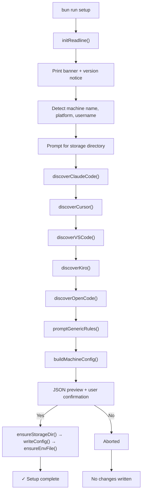
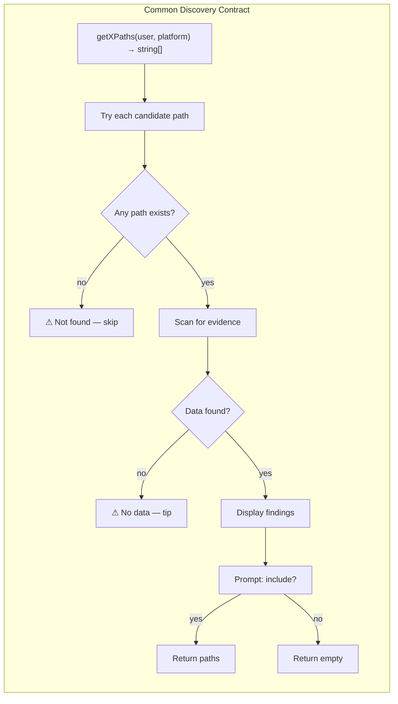
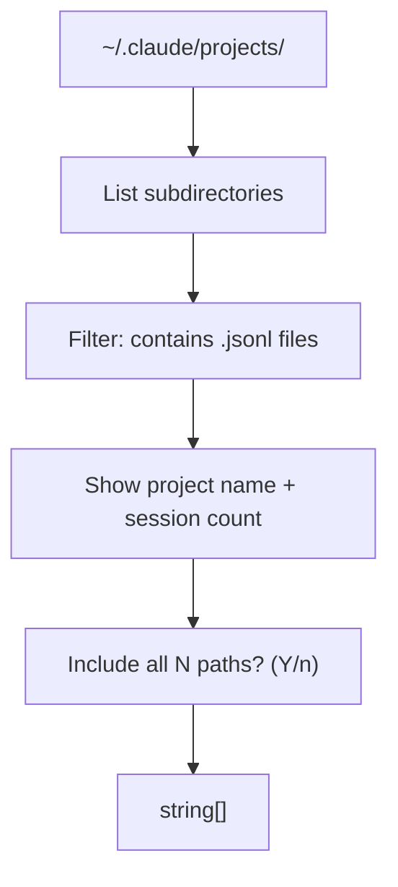
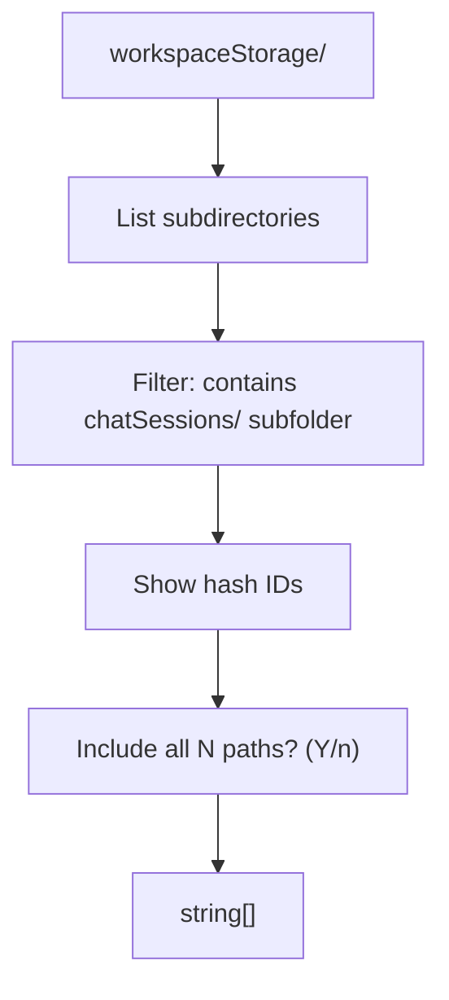
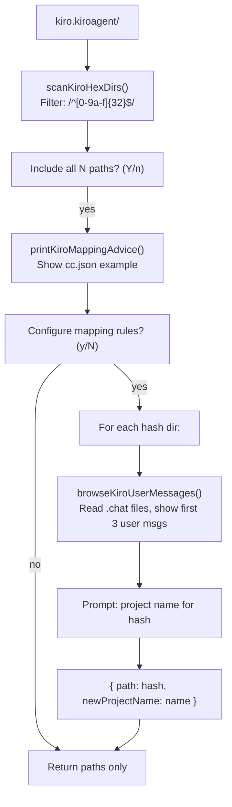
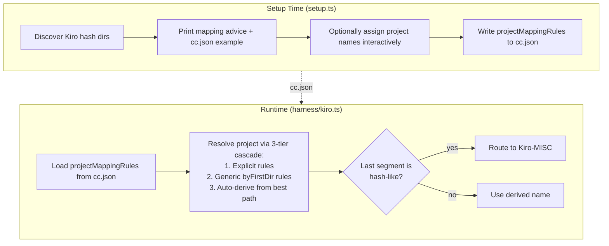
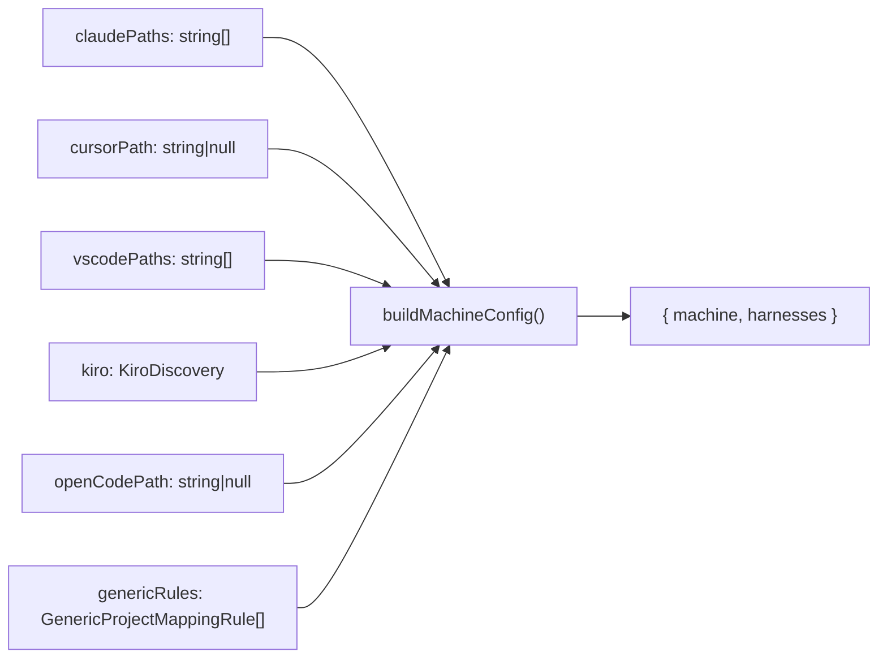
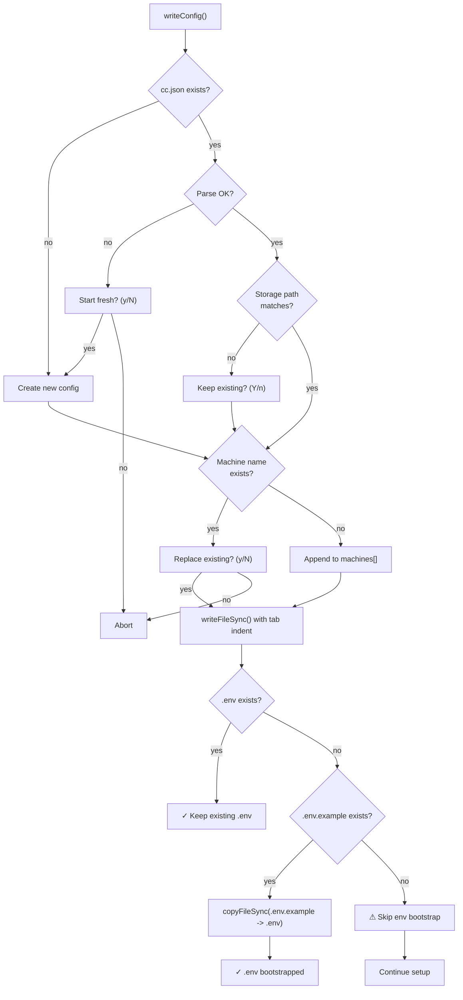
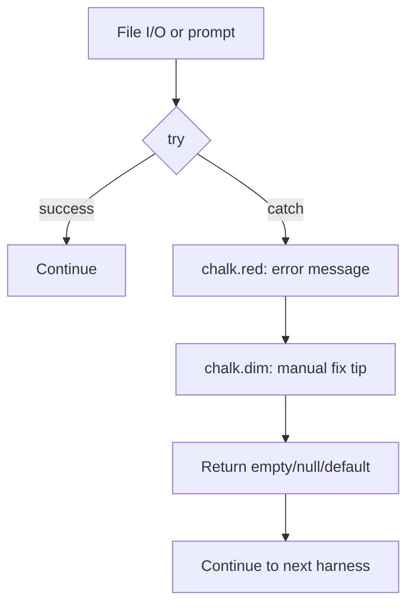

# ContextCore — Setup Script: Architectural Review

**Date**: 2026-03-27
**Module**: [`src/setup.ts`](../../../src/setup.ts) (~900 lines, 23 functions)
**Entry**: `bun run setup` (defined in [`package.json`](../../../package.json) as `"setup": "bun run src/setup.ts"`)
**Complement to**: [`archi-context-core.md`](../archi-context-core-level0.md), [`archi-harness.md`](../harness/archi-harness.md)
**Design spec**: [`r2us-setup.md`](../../upgrades/2026-03/r2us-setup.md)

---

## 1. Purpose

The setup script is a **prerequisite** for ContextCore operation. Before the server can ingest any chat data, `cc.json` must exist with at least one machine entry describing where each IDE stores its conversations. The setup wizard automates this by:

- Detecting the host machine's identity (hostname, username, platform)
- Scanning known filesystem locations for five supported IDE harnesses
- Letting the user confirm, skip, or configure each discovery
- Assembling a machine config block and writing it to `cc.json`
- Creating `.env` from `.env.example` when `.env` is missing

The script is **self-contained** — it imports nothing from the harness modules, performs no data ingestion, makes no network calls, and uses only Bun/Node built-ins plus `chalk` for terminal coloring.

---

## 2. High-Level Flow



Each harness discovery step is **sequential** (not parallel) because the wizard prompts the user interactively after each scan. However, every step is **independent** — a failure in one harness never prevents the others from running.

---

## 3. Module Design

### 3.1 Function Inventory

| Function                  `` | Line | Purpose                                               |
| ---------------------------- | ---- | ----------------------------------------------------- |
| `main()`                     | 844  | Top-level orchestrator; calls all steps in sequence   |
| `initReadline()`             | 47   | Creates `readline.Interface` for stdin/stdout         |
| `closeReadline()`            | 52   | Closes the readline interface in `finally`            |
| `promptUser()`               | 55   | Free-text prompt with optional default; never throws  |
| `promptYesNo()`              | 78   | Yes/no prompt with configurable default; never throws |
| `printVersionNotice()`       | 98   | Renders cyan-bordered version banner                  |
| `detectPlatform()`           | 127  | Returns `"win32"`, `"darwin"`, or `"linux"`           |
| `detectMachineName()`        | 133  | `COMPUTERNAME` env (Windows) or `os.hostname()`       |
| `detectUsername()`           | 140  | `USERNAME` → `USER` → `LOGNAME` env chain             |
| `withTrailingSlash()`        | 148  | Ensures directory paths end with separator            |
| `formatBytes()`              | 154  | Human-readable file size (B / KB / MB)                |
| `dirName()`                  | 160  | Last path segment after stripping trailing slash      |
| `getClaudeCodeBasePath()`    | 166  | Platform-specific Claude Code projects directory      |
| `scanJsonlProjects()`        | 174  | Finds subdirectories containing `.jsonl` files        |
| `discoverClaudeCode()`       | 197  | Full Claude Code discovery with user confirmation     |
| `getCursorDbPath()`          | 248  | Platform-specific Cursor `state.vscdb` path           |
| `discoverCursor()`           | 256  | Cursor discovery: existence + size check              |
| `getVSCodeStoragePath()`     | 287  | Platform-specific VS Code workspaceStorage path       |
| `scanChatSessionDirs()`      | 295  | Filters workspace dirs by `chatSessions/` presence    |
| `discoverVSCode()`           | 305  | Full VS Code discovery with user confirmation         |
| `getKiroAgentPaths()`        | 374  | Ordered candidate paths for Kiro kiroagent directory  |
| `scanKiroHexDirs()`          | 368  | Filters by `/^[0-9a-f]{32}$/` hex hash naming         |
| `printKiroMappingAdvice()`   | 379  | Prints cc.json mapping example for Kiro hashes        |
| `browseKiroUserMessages()`   | 401  | Minimal `.chat` parser; returns up to 3 user messages |
| `promptKiroMappings()`       | 447  | Interactive per-hash project name assignment          |
| `discoverKiro()`             | 480  | Full Kiro discovery + mapping advice + rules          |
| `getOpenCodeStoragePaths()`  | 547  | Ordered candidate paths for OpenCode data directory   |
| `discoverOpenCode()`         | 538  | OpenCode discovery: `opencode.db` existence check     |
| `promptGenericRules()`       | 563  | Optional `byFirstDir` generic rule creation loop      |
| `buildMachineConfig()`       | 591  | Assembles machine config object from all discoveries  |
| `ensureStorageDir()`         | 633  | `mkdir -p` equivalent with error handling             |
| `ensureEnvFile()`            | 738  | Creates `.env` from `.env.example` when missing       |
| `writeConfig()`              | 771  | Merge-write to cc.json with collision handling        |

### 3.2 Type Inventory

| Type                        | Purpose                                                  |
| --------------------------- | -------------------------------------------------------- |
| `Platform`                  | `"win32" \| "darwin" \| "linux"`                         |
| `ProjectMappingRule`        | `{ path, newProjectName }` — Kiro hash → project name    |
| `GenericProjectMappingRule` | `{ path, rule: "byFirstDir" }` — prefix-based extraction |
| `KiroDiscovery`             | `{ paths: string[], rules: ProjectMappingRule[] }`       |
| `ContextCoreConfig`         | `{ storage, machines[] }` — top-level cc.json shape      |

---

## 4. Per-Harness Discovery Architecture

Each harness discovery follows a common contract but with format-specific scanning logic:



### 4.1 Claude Code

| Aspect            | Detail                                        |
| ----------------- | --------------------------------------------- |
| **Source format** | `.jsonl` files (one per session)              |
| **Base path**     | `~/.claude/projects/`                         |
| **Evidence test** | Subdirectory contains ≥1 `.jsonl` file        |
| **Output**        | `string[]` — array of project directory paths |
| **User sees**     | Project slug + session count per directory    |



### 4.2 Cursor

| Aspect            | Detail                                                    |
| ----------------- | --------------------------------------------------------- |
| **Source format** | SQLite database (`state.vscdb`)                           |
| **Base path**     | `~/AppData/Roaming/Cursor/User/globalStorage/state.vscdb` |
| **Evidence test** | `existsSync(path)` + `statSync` for file size             |
| **Output**        | `string \| null` — single database path or null           |
| **User sees**     | Database file size                                        |

Cursor is the simplest discovery — one file, one check, one prompt.

### 4.3 VS Code

| Aspect            | Detail                                                  |
| ----------------- | ------------------------------------------------------- |
| **Source format** | `.json` / `.jsonl` session files inside `chatSessions/` |
| **Base path**     | `~/AppData/Roaming/Code/User/workspaceStorage/`         |
| **Evidence test** | Subdirectory contains a `chatSessions/` subdirectory    |
| **Output**        | `string[]` — array of workspace hash directory paths    |
| **User sees**     | Workspace hash IDs (opaque)                             |



### 4.4 Kiro

| Aspect            | Detail                                                 |
| ----------------- | ------------------------------------------------------ |
| **Source format** | `.chat` JSON files (one per session)                   |
| **Base path**     | Platform-specific; Linux tries two candidates (see §5) |
| **Evidence test** | Subdirectory name matches `/^[0-9a-f]{32}$/`           |
| **Output**        | `KiroDiscovery { paths[], rules[] }`                   |
| **User sees**     | Hash IDs + mapping advice + optional message preview   |

Kiro is the most complex discovery because its session directories are opaque 32-character hex hashes with no inherent project meaning. The setup handles this with a three-step approach:



#### Kiro Mapping Advice

When Kiro paths are included, the wizard prints explicit guidance instructing the user to:
1. Open the `kiro.kiroagent/` directory
2. Identify which hash corresponds to which project
3. Add `projectMappingRules` under the Kiro harness entry in `cc.json`

An inline example is shown:
```json
"Kiro": {
  "paths": [
    "C:\\Users\\<user>\\AppData\\...\\kiro.kiroagent\\1582a63a37f5...816\\"
  ],
  "projectMappingRules": [
    { "path": "1582a63a37f5...816", "newProjectName": "AXON" },
    { "path": "87db373831ef...3a6", "newProjectName": "Chooser" }
  ]
}
```

Without these rules, the Kiro harness routes all hash-named sessions to `Kiro-MISC` at runtime (see §6).

#### Kiro Message Browser

The `browseKiroUserMessages()` function is a **minimal inline `.chat` parser** kept decoupled from the full Kiro harness. It:
1. Reads `.chat` files from a hash directory
2. Parses JSON to extract `chat[]` entries
3. Skips the first human entry if it contains `<identity>` (system prompt)
4. Returns the first 3 user messages, truncated to 120 characters

This gives the user enough context to assign a project name without requiring the full harness parsing pipeline.

### 4.5 OpenCode

| Aspect            | Detail                                                            |
| ----------------- | ----------------------------------------------------------------- |
| **Source format** | SQLite database (`opencode.db`)                                   |
| **Base path**     | `~/.local/share/opencode/`; Windows tries two candidates (see §5) |
| **Evidence test** | `existsSync(opencode.db)` + file size, across all candidate paths |
| **Output**        | `string \| null` — directory path or null                         |
| **User sees**     | Database file size                                                |

Similar pattern to Cursor, but with multi-candidate path resolution on Windows (OpenCode places its database in `~/.local/share/opencode/` on some installs and `%APPDATA%/opencode/` on others).

---

## 5. Platform-Specific Path Resolution

Every harness has a `getXPaths(username, platform)` function that returns an ordered list of candidate paths per OS. The discovery function tries each candidate in order and uses the first one that exists. The table below summarizes all candidates (primary first):

| Harness         | Windows                                                                                                          | macOS                                                    | Linux                                                                                                                               |
| --------------- | ---------------------------------------------------------------------------------------------------------------- | -------------------------------------------------------- | ----------------------------------------------------------------------------------------------------------------------------------- |
| **Claude Code** | `C:\Users\{u}\.claude\projects\`                                                                                 | `/Users/{u}/.claude/projects/`                           | `/home/{u}/.claude/projects/`                                                                                                       |
| **Cursor**      | `C:\Users\{u}\AppData\Roaming\Cursor\User\globalStorage\state.vscdb`                                             | `…/Library/Application Support/Cursor/…/state.vscdb`     | `…/.config/Cursor/…/state.vscdb`                                                                                                    |
| **VS Code**     | `C:\Users\{u}\AppData\Roaming\Code\User\workspaceStorage\`                                                       | `…/Library/Application Support/Code/…/workspaceStorage/` | `…/.config/Code/…/workspaceStorage/`                                                                                                |
| **Kiro**        | `C:\Users\{u}\AppData\Roaming\Kiro\User\globalStorage\kiro.kiroagent\`                                           | `…/Library/Application Support/Kiro/…/kiro.kiroagent/`   | 1. `/home/{u}/.kiro-server/data/User/globalStorage/kiro.kiroagent/` *(primary)*<br>2. `…/.config/Kiro/…/kiro.kiroagent/` *(legacy)* |
| **OpenCode**    | 1. `C:\Users\{u}\.local\share\opencode\` *(primary)*<br>2. `C:\Users\{u}\AppData\Roaming\opencode\` *(fallback)* | `/Users/{u}/.local/share/opencode/`                      | `/home/{u}/.local/share/opencode/`                                                                                                  |

Platform is detected once at start via `process.platform` and passed to every `getXPaths()` call. For harnesses with a single known path the function returns a one-element array, keeping the calling convention uniform. The Linux Kiro path changed in a Kiro update from `~/.config/Kiro/…` to `~/.kiro-server/data/…`; both are checked for compatibility with older installs.

---

## 6. Relationship to Kiro Harness Runtime

A key design decision links setup-time choices to runtime project resolution. Kiro's session directories are 32-char hex hashes that carry no project information. Without mapping rules, the harness must infer project names from message content — which is unreliable and was producing noise like hash-named project folders (`abc123...def.chat/`).

The current architecture uses a **two-layer defense**:



The harness contains two regex guards added to prevent hash pollution:
- `KIRO_HASH_DIR`: `/^[a-f0-9]{32}$/i` — matches bare 32-hex directory names
- `KIRO_HASH_CHAT`: `/^[a-f0-9]{32}\.chat$/i` — matches `.chat`-suffixed hex names

If auto-derivation produces a hash-like last segment, the session is immediately routed to `Kiro-MISC` instead of creating a garbage project folder. The runtime also emits a concise hint pointing users to `bun run setup` to configure rules.

---

## 7. Config Assembly & Write Strategy

### 7.1 Assembly

`buildMachineConfig()` receives the results from all five discovery functions plus generic rules, and constructs a single machine config object. Only harnesses with actual discovered paths are included — empty arrays and null values are silently omitted:



### 7.2 Write

`writeConfig()` plus `ensureEnvFile()` implement a **merge-not-overwrite** strategy for config and a **safe bootstrap** for server env setup:



Key decisions in the write flow:
- **Storage conflict**: If an existing `cc.json` has a different `storage` path, the user chooses which to keep
- **Machine collision**: If the machine name already exists, the user chooses to replace or keep the old one
- **Parse failure**: If existing `cc.json` is malformed, the user can start fresh or abort
- **Indentation**: Output uses tab indentation (matching the project convention)
- **Env safety**: Existing `.env` is never overwritten
- **Env bootstrap**: If `.env` is missing and `.env.example` exists, setup auto-creates `.env`

---

## 8. Error Handling Strategy

The script follows a **never-crash** principle. Every function boundary wraps I/O in `try/catch` and every failure path provides:
1. A visible error message (what went wrong)
2. A manual recovery tip (what to do about it)
3. A graceful fallback (continue to the next step)



| Function                   | Failure Mode          | User Sees                           | Fallback                           |
| -------------------------- | --------------------- | ----------------------------------- | ---------------------------------- |
| `promptUser()`             | readline crash        | (nothing)                           | Returns `defaultValue`             |
| `promptYesNo()`            | readline crash        | (nothing)                           | Returns `defaultYes`               |
| `scanJsonlProjects()`      | `readdirSync` fails   | (nothing)                           | Returns `[]`                       |
| `discoverClaudeCode()`     | Any exception         | `✗ Error scanning Claude Code: ...` | Returns `[]`                       |
| `discoverCursor()`         | Any exception         | `✗ Error scanning Cursor: ...`      | Returns `null`                     |
| `discoverVSCode()`         | Any exception         | `✗ Error scanning VS Code: ...`     | Returns `[]`                       |
| `discoverKiro()`           | Any exception         | `✗ Error scanning Kiro: ...`        | Returns `{ paths: [], rules: [] }` |
| `discoverOpenCode()`       | Any exception         | `✗ Error scanning OpenCode: ...`    | Returns `null`                     |
| `browseKiroUserMessages()` | Parse/read error      | (skips file)                        | Best-effort partial results        |
| `ensureStorageDir()`       | `mkdirSync` fails     | `⚠ Could not create...`             | Tells user to create manually      |
| `ensureEnvFile()`          | `copyFileSync` fails  | `⚠ Could not create .env: ...`      | Keep going + manual copy hint      |
| `writeConfig()`            | `writeFileSync` fails | `✗ Failed to write cc.json: ...`    | Exits cleanly                      |

The `main()` function wraps everything in a `try/finally` block that guarantees `closeReadline()` runs even on error, preventing stdin from hanging.

---

## 9. Chalk Usage Convention

| Purpose                     | Style          | Example                        |
| --------------------------- | -------------- | ------------------------------ |
| Version banner (box + text) | `chalk.cyan`   | `┌──── ... ────┐`              |
| Section headers             | `chalk.bold`   | `──── Claude Code ────`        |
| Found / success markers     | `chalk.green`  | `✓ state.vscdb found`          |
| Warnings / not-found        | `chalk.yellow` | `⚠ Directory not found`        |
| Errors                      | `chalk.red`    | `✗ Error scanning Cursor: ...` |
| File paths / tips / hints   | `chalk.dim`    | `Scanning: C:\Users\...`       |
| Interactive prompts (`?`)   | `chalk.cyan`   | `? Include all 3 paths?`       |

---

## 10. Dependencies

The setup script has an intentionally minimal dependency footprint:

| Import     | Source                             | Usage                                                                                                 |
| ---------- | ---------------------------------- | ----------------------------------------------------------------------------------------------------- |
| `fs`       | Node built-in                      | `existsSync`, `readdirSync`, `readFileSync`, `statSync`, `mkdirSync`, `writeFileSync`, `copyFileSync` |
| `path`     | Node built-in                      | `join`, `basename`, `resolve`                                                                         |
| `os`       | Node built-in                      | `hostname`                                                                                            |
| `readline` | Node built-in                      | Interactive terminal prompts                                                                          |
| `chalk`    | npm (already a project dependency) | Colored terminal output                                                                               |

No harness module imports. No network calls. No database access. No NLP or AI dependencies. This keeps the setup fast to start (~100ms) and safe to run without external services.

---

## 11. Output Format

The generated `cc.json` machine config block matches the shape consumed by `CCSettings` and the harness registry at runtime:

```json
{
  "storage": "/path/to/cxc-storage",
  "machines": [
    {
      "machine": "HOSTNAME",
      "harnesses": {
        "ClaudeCode": {
          "paths": ["~/.claude/projects/proj-a/", "~/.claude/projects/proj-b/"]
        },
        "Cursor": {
          "paths": ["~/.cursor/.../state.vscdb"]
        },
        "VSCode": {
          "paths": ["~/.vscode/.../hash1/", "~/.vscode/.../hash2/"]
        },
        "Kiro": {
          "paths": ["~/.kiro/.../abcdef01234.../"],
          "projectMappingRules": [
            { "path": "abcdef01234...", "newProjectName": "MyProject" }
          ]
        },
        "OpenCode": {
          "paths": ["~/.local/share/opencode/"]
        },
        "genericProjectMappingRules": [
          { "path": "Codez\\Nexus", "rule": "byFirstDir" }
        ]
      }
    }
  ]
}
```

Key format notes:
- All harness paths are arrays (even Cursor and OpenCode, which are single paths)
- Trailing backslash/slash on directory paths matches existing convention
- `genericProjectMappingRules` sits as a sibling to harness entries inside `harnesses`, not at machine level
- Tab indentation for human readability
- Only populated harnesses appear — empty discoveries are omitted entirely

---

## 12. Limitations & Non-Goals

| Item                         | Status                                                                                           |
| ---------------------------- | ------------------------------------------------------------------------------------------------ |
| **No data ingestion**        | Setup only writes config; never reads/writes chat storage                                        |
| **No network calls**         | Pure local filesystem inspection                                                                 |
| **No harness imports**       | Self-contained; Kiro `.chat` parser is inlined                                                   |
| **No dataSources config**    | `zz-reach2` data source entries must be added manually to `cc.json`                              |
| **No env value validation**  | Setup can bootstrap `.env`, but does not validate env values or mutate an existing `.env`        |
| **No Codex discovery**       | The Codex harness exists but has no setup discovery step yet                                     |
| **No Antigravity discovery** | Gemini Antigravity is not yet covered by setup                                                   |
| **Single-machine per run**   | Each invocation configures one machine; multi-machine requires separate runs or manual editing   |
| **No path validation**       | Setup does not verify that discovered paths contain valid/parseable data beyond existence checks |
