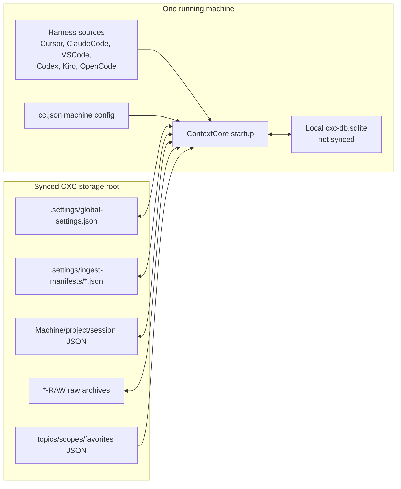
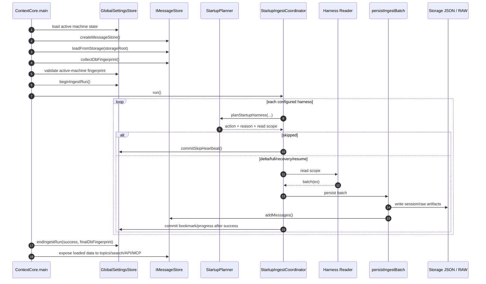
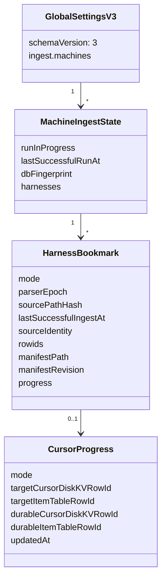
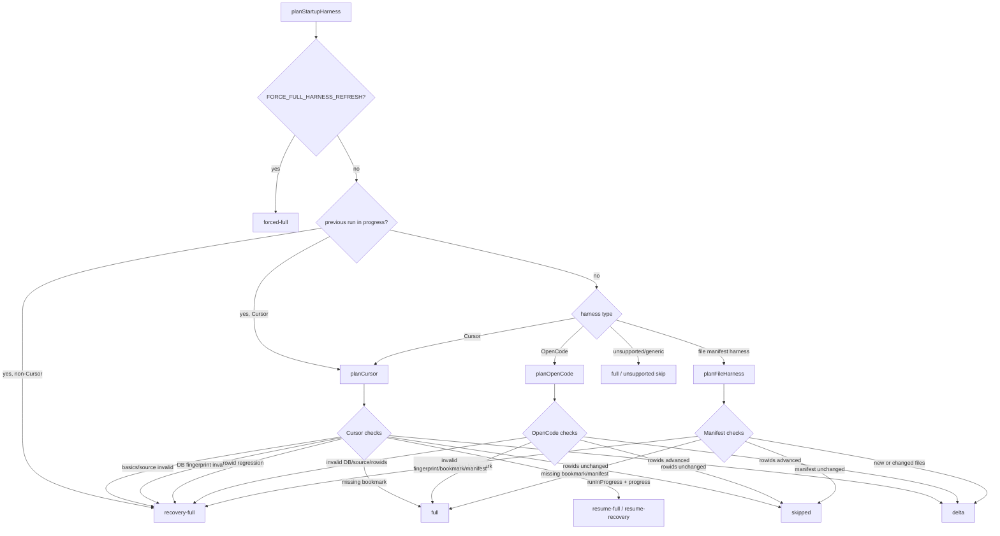
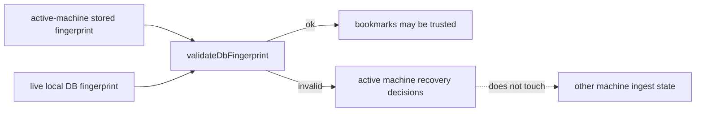
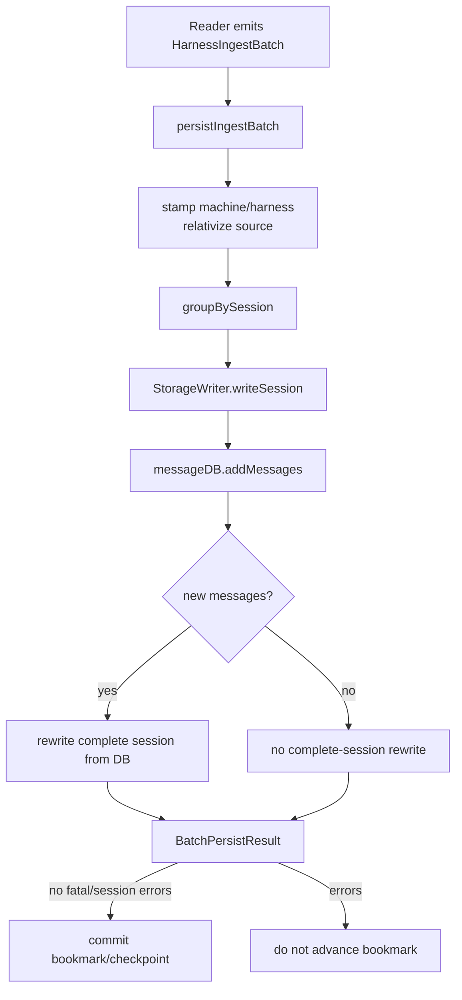
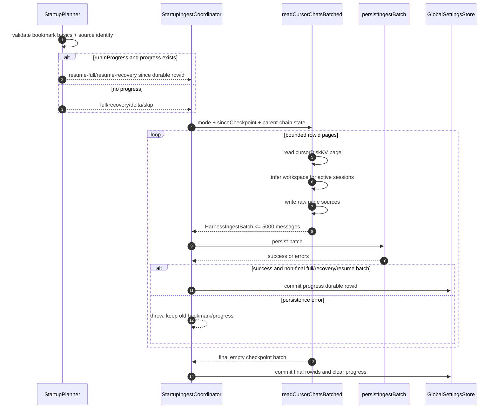
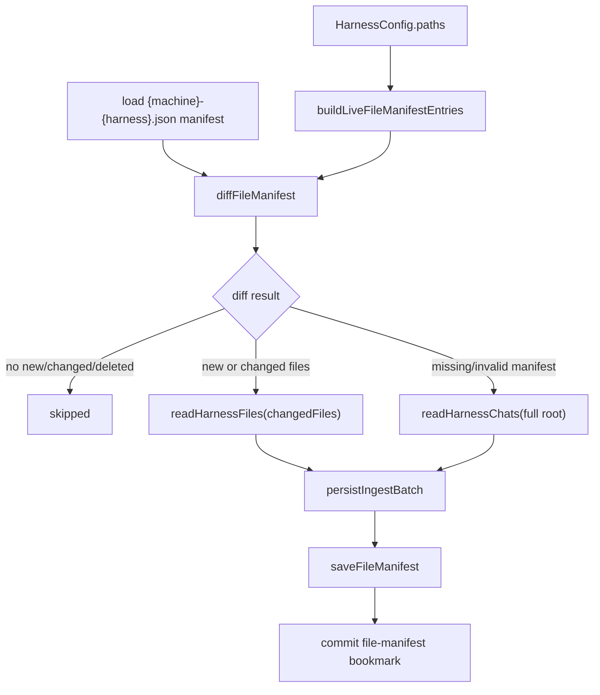
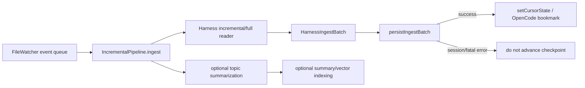
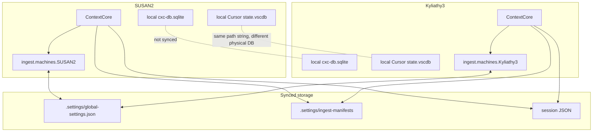

# Startup Architecture

**Date**: 2026-06-20  
**Status**: Current architecture review after R2SO and R2SO2 implementation  
**Related plans**: [`r2so-startup-optimization.md`](../../upgrades/2026-06/r2so-startup-optimization.md), [`r2so2-startup-optimization2.md`](../../upgrades/2026-06/r2so2-startup-optimization2.md)  
**Related architecture**: [`archi-context-core-level0.md`](../archi-context-core-level0.md), [`archi-harness.md`](../harness/archi-harness.md), [`archi-h-cursor.md`](../harness/archi-h-cursor.md), [`archi-database.md`](../data/archi-database.md), [`archi-file-watcher.md`](../data/archi-file-watcher.md)

## Purpose

ContextCore startup used to be a simple but expensive routine: read every configured harness source, rewrite storage, load the database, then start the API. R2SO replaced that with a planned ingest model that skips unchanged sources, reads only deltas where possible, and bounds large Cursor reads. R2SO2 then fixed the shared-storage case where multiple machines sync the same CXC storage tree but do not share local SQLite database files.

This document reviews the architecture of the startup systems involved in those changes. It is meant to answer:

- What owns startup state?
- Which parts of startup are shared across machines?
- Why does a harness skip, delta, full, recovery-full, resume-full, or resume-recovery?
- When are bookmarks advanced?
- How does Cursor recover from an interrupted full/recovery read?
- Which logs and operator tools should future maintainers use first?

## System Boundary

Startup sits between machine-local source applications and the shared CXC storage tree. Its job is to reconcile local source history into the local query database and synced storage artifacts without repeatedly parsing everything.



The key R2SO2 correction is that the **database is local-only** even if its configured path sits under the synced storage root. Sync excludes `cxc-db.sqlite`, WAL, SHM, and related database files. The shared surface is the storage JSON plus `.settings` metadata.

## Important Modules

| Module | Role |
|---|---|
| `ContextCore.ts` | Main startup orchestration, DB load, run markers, startup ingest, downstream topic/vector/server setup. |
| `GlobalSettingsStore.ts` | Synced v3 ingest metadata, scoped by active machine. Writes `global-settings.json` atomically with merge-on-save. |
| `DbFingerprint.ts` | Local DB fingerprint collection and validation. Used only against the active machine's stored fingerprint. |
| `StartupPlanner.ts` | Pure-ish decision layer: selects skip, delta, full, forced-full, recovery-full, resume-full, or resume-recovery. |
| `StartupIngestCoordinator.ts` | Executes planner decisions, calls readers, persists batches, commits bookmarks after persistence succeeds. |
| `BatchPersistence.ts` | Shared storage + DB persistence path for startup and watcher ingest. |
| `FileManifest.ts` | Machine-named manifests for file harness skip/delta decisions. |
| `cursor.ts` | Bounded Cursor startup/recovery reader, rowid checkpoints, incremental watcher reader. |
| `opencode.ts` | OpenCode rowid checkpoints, affected-session reads, startup/watch delta paths. |
| `harness/index.ts` | Reader registry and scoped-reader dispatch for file harnesses. |
| `IncrementalPipeline.ts` | Post-startup watcher ingest. Reuses batch persistence and commits checkpoints only after persistence. |
| `cxccli.ts` | Operator inspection/reset tools, including per-machine ingest status and Cursor progress. |

## Startup Order

Startup now loads the database before planning harness ingest. This is intentional: planner decisions depend on the local DB fingerprint and existing DB content.



After startup ingest completes, ContextCore loads topic/scopes/favorites stores, optionally runs summarization/vector work, starts MCP/SSE/API, creates `IncrementalPipeline`, then starts `FileWatcher`.

## State Ownership

Startup state is split deliberately.

| State | Location | Shared by sync? | Owner | Notes |
|---|---|---:|---|---|
| Machine config | `server/cc.json` | Usually no | Operator/setup/CLI | Startup reads it but must not mutate it. |
| Session storage | `<storage>/<machine>/<harness>/<project>/*.json` | Yes | `StorageWriter` / batch persistence | Historical source of truth for reloads. |
| Raw archives | `<storage>/<machine>-RAW/...` | Yes | Harness readers | Cursor writes page-scoped raw files. |
| Ingest metadata | `<storage>/.settings/global-settings.json` | Yes | `GlobalSettingsStore` | v3 schema, per-machine ingest state. |
| File manifests | `<storage>/.settings/ingest-manifests/{machine}-{harness}.json` | Yes | `FileManifest` helpers | Large file-harness state lives outside global settings. |
| Query DB | `cxc-db.sqlite` plus WAL/SHM | No | `IMessageStore` implementation | Local cache/index rebuilt from storage when needed. |
| Topics/scopes/favorites | `.settings` JSON files | Yes | Settings stores | Loaded after startup ingest. |

## Global Settings v3

R2SO2 intentionally discards older global ingest schemas instead of migrating them. Backwards compatibility was not required because local DBs and old ingest bookmarks can be wiped/rebuilt. This avoids carrying forward the exact bug class where a global Cursor rowid bookmark from one machine affected another machine.



Rules:

- Every read/write is scoped to one active machine name.
- `commitHarnessBookmark()` writes only that active machine's harness bookmark.
- `resetAllIngestBookmarks()` means active-machine reset; global reset requires an explicit global command path.
- `beginIngestRun()` creates a per-machine run id.
- `endIngestRun()` only clears the active run marker when the run id matches.
- `save()` merges the active machine object into the latest disk file before atomic rename.

## Startup Decision Model

The planner returns one `StartupHarnessPlan` per configured harness. The coordinator is the only place that executes the decision.



### Actions

| Action | Meaning |
|---|---|
| `skipped` | No source parsing. The coordinator may refresh bookmark metadata. |
| `delta` | Read only changed/new files or DB rows beyond stored rowids. |
| `full` | First run or missing bookmark; read the whole source scope. Cursor/OpenCode still use bounded batch paths where available. |
| `forced-full` | Operator-forced full read via `FORCE_FULL_HARNESS_REFRESH`. |
| `recovery-full` | Conservative read due to invalid bookmark, local DB fingerprint failure, source replacement, rowid regression, parser epoch drift, manifest corruption, or interrupted non-Cursor startup. |
| `resume-full` / `resume-recovery` | Cursor-only continuation from durable page progress after an interrupted full/recovery run. |

## DB Fingerprint Semantics

The DB fingerprint is local to the active machine because database files are not synced. It contains:

- database file path
- message count
- session count
- DB file mtime and size
- per-harness message counts

Validation is conservative: if stored counts are greater than live counts, if the DB file is missing, or if the path changed, the fingerprint is invalid.

Important nuance: in R2SO2, an invalid fingerprint must not reset other machines. It invalidates only the active machine's DB-dependent decisions. A Cursor resume-progress bookmark can still win over a missing fingerprint during an interrupted first rebuild, as long as bookmark basics and source identity validate.



## Batch Persistence Contract

Readers do not commit bookmarks. Readers emit data and checkpoint candidates. The coordinator persists batches, then commits bookmarks.



Invariant: bookmarks and rowid checkpoints advance only after storage and DB persistence have succeeded for the relevant batch. If persistence fails, the next startup or watcher pass retries from the previous durable state.

## Cursor Startup Architecture

Cursor was the main startup sink. The R2SO architecture makes Cursor full/recovery reads bounded, resumable, and per-machine.

### Cursor State

Cursor bookmarks track:

- `sourceIdentity.machineName`
- `sourceIdentity.sourceKind = "cursor-state-vscdb"`
- normalized local DB path
- final committed rowids for `cursorDiskKV` and `ItemTable`
- optional `progress` during full/recovery/resume

`progress` is written after each successfully persisted non-final emitted batch. A normal large run therefore rewrites `global-settings.json` at every emitted batch boundary, which is capped at `CURSOR_INGEST_BATCH_SIZE` and hard-clamped to `5000`.

### Cursor Read / Resume Flow



### Cursor Memory Rules

- Source pages are read by rowid with a bounded `LIMIT`.
- Page-local bubble records become page-local messages.
- Workspace inference receives only sessions touched by the current page, with a paged fallback when needed.
- Parent chains use `CursorBatchState.lastMessageIdBySession`, not a whole-corpus message array.
- `readCursorChatsBatched()` returns an empty `messages` array by design; persistence happens via callback.
- ItemTable fallback is considered legacy-only for batched startup; bubble rows are the authoritative modern source.

## File Harness Architecture

File harnesses are `ClaudeCode`, `Kiro`, `VSCode`, and `Codex`. They use manifests rather than rowid bookmarks.



Deleted source files do not delete historical CXC storage. They update the manifest so future restarts remain stable.

## OpenCode Architecture

OpenCode is DB-backed. Its bookmark tracks rowids from the `session`, `message`, and `part` tables plus source identity for the resolved `opencode.db`.

Planner logic:

- Missing bookmark => `full`.
- Invalid DB fingerprint, bookmark basics, source identity, or rowid regression => `recovery-full`.
- All three rowid families unchanged => `skipped`.
- Any rowid advances => `delta`.

Delta reads identify affected sessions from rowids and process only those sessions. Full startup still uses callback persistence rather than accumulating all emitted messages for startup.

## Watcher Relationship

Startup and watcher ingest share the same persistence invariant. The watcher starts after startup ingest and server setup, preserving the no-race startup model.



Watcher Cursor checkpoints and startup Cursor bookmarks are the same active-machine state. This matters because an early checkpoint commit would skip rows after a storage/DB failure. R2SO moved watcher checkpoint commits after shared batch persistence succeeds.

## Multi-Machine Behavior

R2SO2 exists because two machines can share storage while each has different local Cursor/Claude/VSCode/OpenCode sources and a different local DB.



Rules:

- Same Cursor path string on two machines does not imply same Cursor DB.
- Cursor source identity includes machine name and source kind.
- File manifests are machine-named.
- DB fingerprints are active-machine-local.
- `runInProgress` is active-machine-local.
- Settings writes merge one active machine object into the latest disk file.

## Crash and Interruption Semantics

### Normal Success

1. `beginIngestRun()` writes active-machine run marker.
2. Each harness commits its bookmark only after its work succeeds.
3. Cursor full/recovery also commits page progress after each successful non-final batch.
4. `endIngestRun(true, fingerprint)` clears the run marker and stores the final DB fingerprint.

### Interrupted Full/Recovery Cursor

If the process dies after one or more Cursor pages:

1. `runInProgress` remains true unless the signal handler finishes.
2. Cursor bookmark has `progress.durableCursorDiskKVRowId`.
3. Next startup validates bookmark basics and source identity.
4. If progress is usable, planner returns `resume-full` or `resume-recovery`.
5. Reader starts from durable rowid. If the previous page was persisted but progress was not committed, replay is safe because DB/storage dedupe handles duplicates.

### Interrupted Non-Cursor

Non-Cursor harnesses do not currently have page-level progress. An interrupted active-machine startup can produce conservative `recovery-full` decisions, except when the previous DB fingerprint still validates and startup can clear the stale run marker.

### Signal Handler Caveat

`ContextCore` tries to clear the active run marker on `SIGINT`/`SIGTERM` by calling `endIngestRun(false, fingerprint)`. A hard process kill can still leave `runInProgress` true. That is expected; planner rules handle it.

## Operational Logs

Important namespaces:

| Namespace | What to look for |
|---|---|
| `startup-db-load` | Storage load count, DB message/session counts, DB fingerprint invalidation. |
| `startup-ingest-plan` | Previous run handling, bookmark presence, live rowids, expected read count, summary line. |
| `startup-harness-skip` | Harnesses skipped without source parsing. |
| `startup-harness-delta` | File/rowid deltas. |
| `startup-harness-full` | Full/recovery/forced/resume actions and scope. |
| `startup-harness-batch` | Batch-level parsed/session/insert/error/duration counters. |
| `StartupIngestCoordinator` | Per-harness final stats and Cursor symbol-map writes. |
| `harness:cursor` | Cursor batched reader mode, emitted messages/batches, peak RSS. |

Healthy steady-state examples:

```text
startup-harness-skip Cursor: action=skipped, reason=Cursor rowids unchanged, scope=none
startup-harness-skip ClaudeCode: action=skipped, reason=file manifest unchanged, scope=none
startup-ingest-plan summary Codex:skipped/0, Cursor:skipped/0
```

Cursor interrupted-resume example:

```text
startup-harness-full Cursor: action=resume-recovery, reason=previous Cursor ingest interrupted; resuming from durable page progress, scope=sinceCursorRowId=161027
startup-harness-batch Cursor: messagesParsed=..., sessions=..., inserted=..., errors=0
harness:cursor Batched rowid-delta emitted ... peakRssMb=...
```

Suspicious examples:

```text
Cursor: action=recovery-full, reason=DB fingerprint missing or invalid, scope=full
Cursor: action=recovery-full, reason=rowid regressed for cursorDiskKV, scope=full
ClaudeCode: action=recovery-full, reason=source path config changed for ClaudeCode
```

These are not always bugs, but they are the first things to inspect when startup feels slow.

## Operator Tools

Use `cxccli` before deleting DBs or settings.

```text
bun run cxccli ingest-status
bun run cxccli ingest-status --json
bun run cxccli ingest-status --all-machines
bun run cxccli reset-ingest --machine Kyliathy3 --harness Cursor
bun run cxccli reset-ingest --global
```

The status command should show:

- active machine
- per-machine `runInProgress`
- DB fingerprint state
- harness bookmark mode
- parser/path/source identity metadata
- Cursor live rowids
- Cursor durable progress rowids and target rowids

## Environment Controls

| Control | Effect |
|---|---|
| `FORCE_FULL_HARNESS_REFRESH=Cursor` | Forces one harness through full/recovery path. Comma-separated values are supported; `true`, `yes`, `1`, or `all` target all harnesses. |
| `CURSOR_INGEST_BATCH_SIZE=5000` | Sets Cursor page/emitted batch cap. Values above `5000` are clamped. |
| `STARTUP_INGEST_TRACE=true` | Emits extra startup planning trace lines. |
| Parser epoch constants | `HARNESS_PARSER_EPOCHS` in `IngestConfig.ts`; bump when parser semantics change enough to invalidate bookmarks/manifests. |

## Invariants

- Startup must not mutate `cc.json`.
- Startup must load local DB/storage before planning harness work.
- All ingest state in `global-settings.json` is scoped under `ingest.machines[machineName]`.
- DB fingerprints never cross machine boundaries.
- Reader functions do not advance bookmarks.
- Cursor full/recovery progress commits only after the emitted batch persists successfully.
- Final Cursor rowids commit only after the final empty checkpoint batch and all prior batches succeed.
- File manifests are saved only after the planned file scope persists successfully.
- Deleted source files do not delete historical CXC storage.
- Watcher checkpoint advancement follows the same persistence-before-commit rule as startup.

## Known Gaps and Verification Still Needed

The code path has automated coverage for planner decisions, settings isolation, batch persistence, Cursor resume, Cursor paging, OpenCode checkpoints, and watcher checkpoint failure behavior. The remaining highest-value checks are live operational checks against real SUSAN2/Kyliathy3 data:

- First clean startup on each machine establishes fresh per-machine bookmarks.
- Restart on either machine skips or deltas Cursor rather than recovery-full due to another machine's rowids.
- Concurrent runs do not erase the other machine's settings object.
- Interrupting Cursor full/recovery resumes from durable progress in the live large DB.
- Local DB fingerprint warnings do not reset another machine's bookmarks.

## Troubleshooting Playbook

1. Run `bun run cxccli ingest-status --json` and save it before resetting anything.
2. Check whether the active machine has `runInProgress`.
3. Check Cursor `progress` before assuming recovery must start from rowid `0`.
4. Compare the startup log action/reason to the planner table above.
5. If a DB fingerprint is invalid, remember it is local evidence only.
6. If file harnesses recovery-full, inspect `sourcePathHash` and the machine-specific manifest path.
7. If Cursor recovery-full repeats after interruption, confirm whether the log says `resume-*` or plain `recovery-full`.
8. Only use `reset-ingest --global` when every machine's shared ingest metadata is intentionally disposable.
