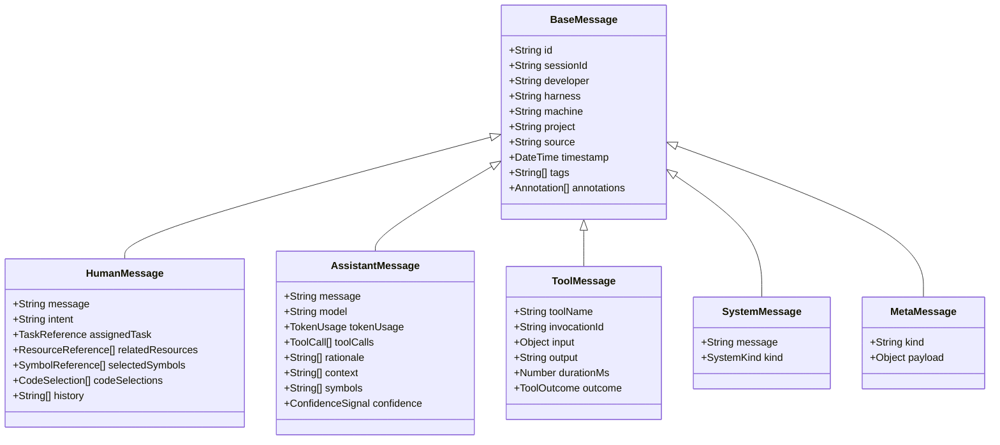
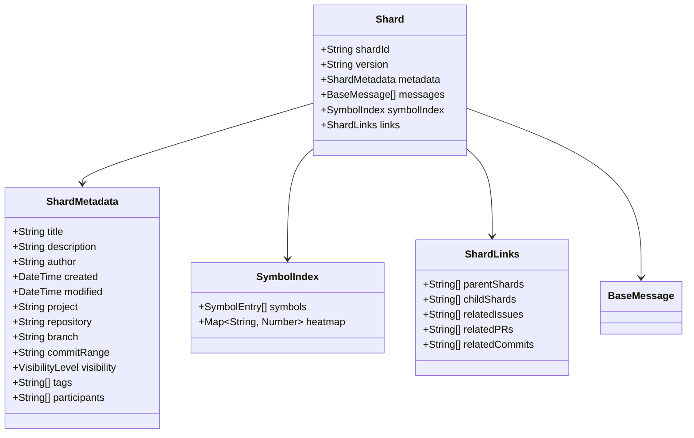
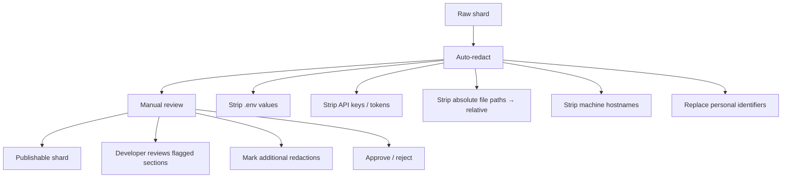
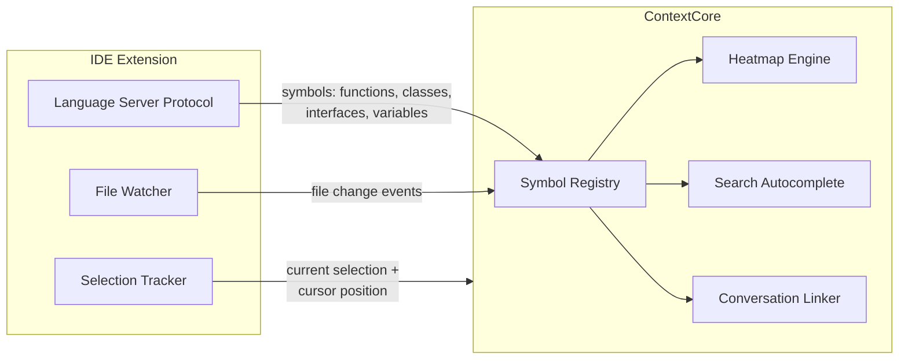
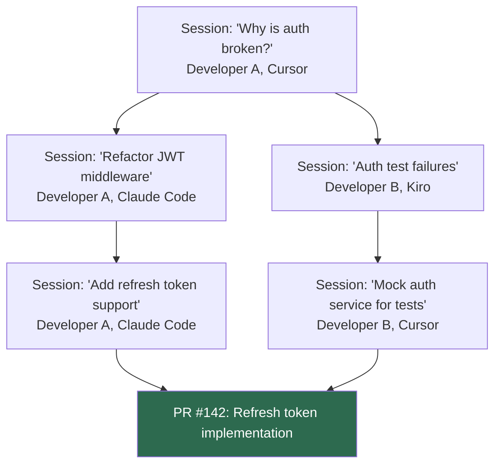
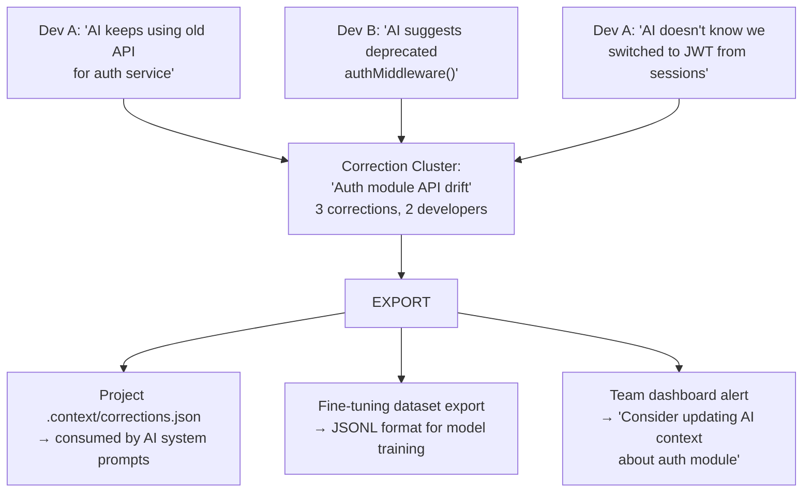
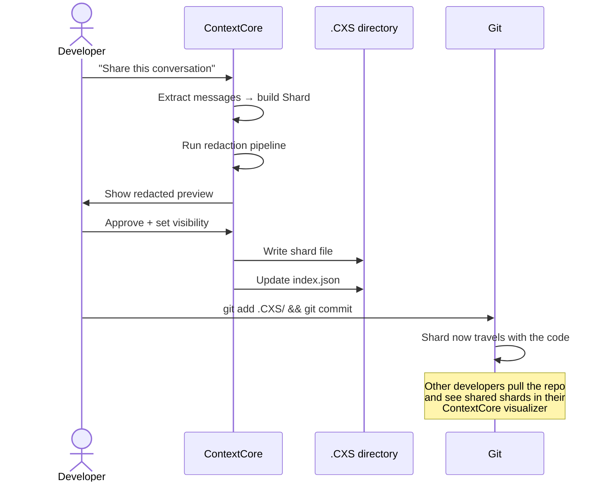
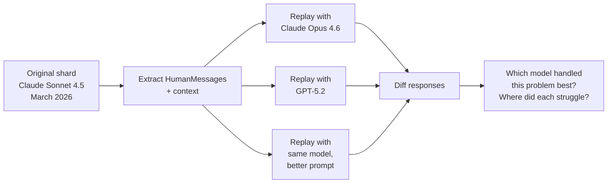
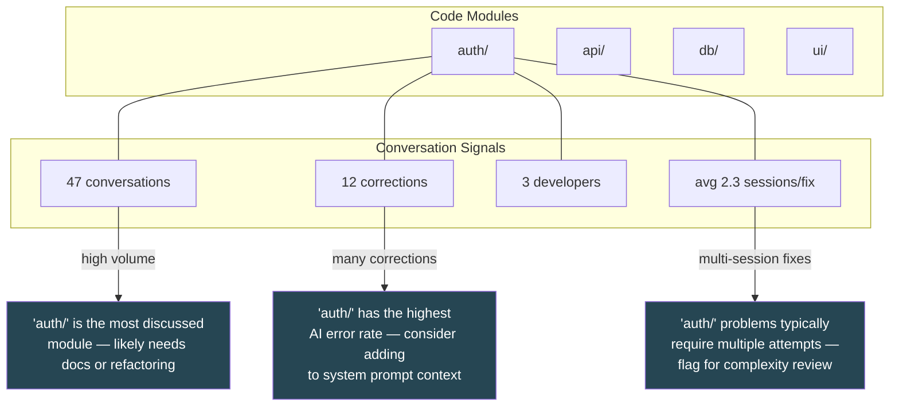

**Date**: 2026-03-10
**Status**: Design Draft
**Authors**: Michael Axonn & TAI

---

# Context Exchange Standard - Proposal

## 0. Introduction

ContextCore today ingests conversations from five AI assistants (Copilot, Cursor, Open Code, Claude Code, Kiro)  into a unified store. It already supports **multi-machine ingestion** — the `cc.json` config maps per-hostname harness paths so the same storage root can aggregate conversations from multiple workstations (e.g., `MyDESKTOP` and `theLaptop` feeding into a single `CXS/` tree). But it is still a **single-developer system** — all machines belong to the same person. The moment two developers on the same repo both use AI assistants, their conversations are invisible to each other. The accumulated context — what was tried, what failed, what reasoning led to a design decision — evaporates into private chat logs.

This document designs a **standard for portable, shareable, composable AI conversation artifacts** — not just for ContextCore's internal use, but as a format that could be adopted by any tool, IDE extension, or platform that produces or consumes developer-AI interaction data.

We call it **Context Exchange Standard**.

---

## 1. The Core Thesis

> AI conversations about code are a **new category of development artifact**, alongside source code, issues, PRs, documentation, and commit history. They capture *intent*, *reasoning*, *exploration*, and *mistakes* — none of which exist in any other artifact.

Today these conversations are:
- **Siloed** per developer, per tool, per machine
- **Ephemeral** — most IDE assistants overwrite or rotate history
- **Unstructured** — raw JSON/JSONL/SQLite blobs with no cross-tool schema
- **Unshareable** — no mechanism to selectively publish or subscribe

CXS treats conversations as **first-class, versionable, shareable artifacts** with the same rigor we give to source code.

---

## 2. Design Principles

| Principle             | Meaning                                                                                                                     |
| --------------------- | --------------------------------------------------------------------------------------------------------------------------- |
| **Portability**       | A CXS artifact must be readable by any tool, with no runtime dependency. JSON + schema, nothing exotic.                     |
| **Selective Sharing** | Developers must be able to share *some* conversations while keeping others private. Sharing is opt-in, per-shard.           |
| **Composability**     | Shards can be combined, filtered, annotated, and re-exported. A team's knowledge base is the union of shared shards.        |
| **Provenance**        | Every message traces back to its source tool, model, and timestamp. No information is invented or inferred during exchange. |
| **Privacy-first**     | Secrets, credentials, and personal data must be strippable before sharing. The standard defines redaction affordances.      |
| **Extensibility**     | New message types, metadata fields, and annotations can be added without breaking existing consumers.                       |

---

## 3. Message Hierarchy — From AgentMessage to a Type System

### 3.1 The Problem with Flat Messages

The current `AgentMessage` model has 19 fields, all on a single class regardless of role. This works for storage but creates semantic noise:
- `model` and `tokenUsage` are meaningless on user messages
- `toolCalls` and `rationale` are meaningless on user messages
- Fields like `assignedTask`, `relatedResources`, `selectedSymbols` (future) would clutter assistant messages

A typed hierarchy makes the standard self-documenting: the shape of a message tells you what it is.

### 3.2 Proposed Type Tree



### 3.3 New Fields on HumanMessage

| Field              | Type                  | Purpose                                                                                                |
| ------------------ | --------------------- | ------------------------------------------------------------------------------------------------------ |
| `intent`           | `string`              | Machine-readable summary of what the human wanted (could be auto-generated via NLP or manually tagged) |
| `assignedTask`     | `TaskReference`       | Link to an issue, ticket, or task tracker item that this conversation addresses                        |
| `relatedResources` | `ResourceReference[]` | URLs, file paths, documentation links the human referenced or had open                                 |
| `selectedSymbols`  | `SymbolReference[]`   | IDE symbols (functions, classes, variables) selected or highlighted when the message was sent          |
| `codeSelections`   | `CodeSelection[]`     | Exact file + line range selections from the IDE at message time                                        |

### 3.4 New Fields on AssistantMessage

| Field        | Type               | Purpose                                                                                         |
| ------------ | ------------------ | ----------------------------------------------------------------------------------------------- |
| `confidence` | `ConfidenceSignal` | Optional self-reported confidence (from models that support it), or derived from retry patterns |
| `context`    | `string[]`         | Files/symbols the assistant referenced in its response                                          |
| `symbols`    | `string[]`         | Code symbols mentioned, extracted via analysis                                                  |

### 3.5 MetaMessage — The Escape Hatch

Not every event in a conversation is a human/assistant/tool turn. Some events are structural:
- Session started / ended
- Model changed mid-conversation
- Developer switched branches
- IDE state snapshot (open files, cursor position)
- Annotation added retroactively

`MetaMessage` is a schemaless envelope (`kind` + `payload`) for these, ensuring the standard can absorb new event types without schema revisions.

### 3.6 Annotations — Retroactive Knowledge

Any message in the hierarchy can carry `annotations[]`:

```typescript
type Annotation = {
    author: string;          // who annotated (developer, automated tool, etc.)
    timestamp: DateTime;
    kind: AnnotationKind;    // "correction" | "note" | "quality" | "link" | "redaction"
    content: string;
    metadata?: Record<string, unknown>;
};
```

This is how developers mark conversations as useful, flag mistakes, add cross-references, or redact sensitive content **after the fact** without modifying the original message.

---

## 4. Developer Identity & the Multi-Tenancy Gap

### 4.1 What cc.json Already Does

ContextCore's `cc.json` already handles **multi-machine** ingestion. A single config maps multiple hostnames to their harness paths, and the storage tree is keyed by machine:

```
CXS/
├── DEVBOX1/            ← desktop
│   ├── ClaudeCode/
│   ├── Cursor/
│   └── ...
├── DEVBOX1-RAW/
├── DEVBOX2/            ← laptop
│   ├── ClaudeCode/
│   └── ...
└── DEVBOX2-RAW/
```

This means the same developer's conversations from two workstations land in the same storage root, queryable through one API. The machine dimension is solved.

### 4.2 What's Missing: The Developer Dimension

The config has no concept of **who** — it assumes all machines belong to the same person. When two developers on the same team use ContextCore, the system can't distinguish their conversations, can't apply per-developer sharing preferences, and can't attribute shards to authors.

### 4.3 Proposed Config Evolution

The config should grow a `developer` (or `developers`) level that sits **above** machines:

```jsonc
{
    "storage": "<CXS_STORAGE_PATH>",
    "developers": [
        {
            "id": "dev-a",
            "displayName": "Developer A",
            "email": "<developer-email>",     // optional, used for git attribution
            "machines": [
                {
                    "machine": "DEVBOX1",
                    "harnesses": { /* ... existing shape ... */ }
                },
                {
                    "machine": "DEVBOX2",
                    "harnesses": { /* ... */ }
                }
            ]
        },
        {
            "id": "collaborator-b",
            "displayName": "Charlie",
            "machines": [
                {
                    "machine": "CHARLIE-PC",
                    "harnesses": { /* ... */ }
                }
            ]
        }
    ],
    // backward compat: "machines" at root still works for single-developer mode
    "machines": [ /* ... legacy shape, treated as implicit default developer ... */ ]
}
```

### 4.4 Storage Layout with Developer Keying

Two options for incorporating developer identity into the storage tree:

**Option A — Developer above machine** (recommended):
```
CXS/
├── dev-a/
│   ├── DEVBOX1/
│   │   ├── ClaudeCode/
│   │   └── Cursor/
│   └── DEVBOX2/
│       └── ClaudeCode/
├── dev-b/
│   └── DEVBOX3/
│       ├── ClaudeCode/
│       └── Kiro/
```

**Option B — Developer as metadata only** (lighter migration):
The storage tree stays machine-keyed, but every `BaseMessage` gains a `developer` field populated from config. The developer dimension lives in the DB index and shard metadata, not the filesystem.

Option A is cleaner for long-term multi-developer use. Option B is easier to migrate to from the current layout and avoids reshuffling existing data. Both are valid; the CXS standard should support either by requiring `developer` on every `BaseMessage` regardless of storage layout.

### 4.5 What Developer Identity Enables

| Capability               | How developer ID is used                                                                                                            |
| ------------------------ | ----------------------------------------------------------------------------------------------------------------------------------- |
| **Attribution**          | Every shard and message has a clear author for team visibility                                                                      |
| **Sharing controls**     | Per-developer visibility preferences ("share my ClaudeCode conversations but not Cursor")                                           |
| **Correction authoring** | Correction pairs are attributed, so the team knows who flagged the issue                                                            |
| **Heatmap segmentation** | "Which symbols does *Charlie* discuss most?" vs. the team aggregate                                                                 |
| **Privacy boundaries**   | Developer A's conversations are never visible to Developer B unless explicitly shared via shards                                    |
| **Conflict resolution**  | When two developers' shards discuss the same symbols, the system can surface this as a collaboration signal rather than a collision |

### 4.6 Single-Developer Backward Compatibility

The current `cc.json` with `machines[]` at the root continues to work — ContextCore treats it as an implicit single developer with `id` derived from the OS username or hostname. The `developers[]` wrapper is opt-in. Migration is non-breaking: existing storage roots work unchanged, and the `developer` field on messages defaults to `"default"` when not configured.

---

## 5. The Conversation Shard

### 4.1 Definition

A **Shard** is the atomic unit of sharing in CXS. It is a self-contained package of messages from one or more sessions, bundled with metadata about what they cover and how they should be interpreted.



### 4.2 Why Shards, Not Sessions

Sessions are a harness artifact — they start when you open a chat and end when you close it. But **meaningful units of work** don't align with sessions:

- A bug fix might span 3 sessions across 2 days
- A single session might cover 5 unrelated topics
- A feature might involve conversations across Cursor AND Claude Code

Shards let developers **carve out the meaningful slice** and package it. A shard can contain:
- A complete session
- A subset of messages from a session
- Messages from multiple sessions (cross-session narrative)
- Messages from multiple harnesses (cross-tool narrative)

### 4.3 Visibility Levels

```
private    → Only the author can see it
team       → Visible to configured team members
project    → Visible to anyone with access to the repo
public     → Visible to anyone (e.g., published as learning material)
```

### 4.4 Redaction

Before sharing, a shard passes through a **redaction pipeline**:



Redacted content is replaced with `[REDACTED:reason]` markers, preserving the conversation structure while removing sensitive data.

---

## 6. The Symbol Registry — IDE Integration Layer

### 5.1 The Vision

An IDE extension (VS Code, Cursor, etc.) acts as a **live symbol provider** for ContextCore:



### 5.2 What the Extension Provides

| Data                        | Source                     | Frequency               |
| --------------------------- | -------------------------- | ----------------------- |
| **Project symbol list**     | LSP `workspace/symbol`     | On file save + periodic |
| **Symbol relationships**    | LSP references/definitions | On demand               |
| **Active file + selection** | Editor state               | Real-time               |
| **Open files**              | Tab state                  | On change               |
| **Git state**               | Git extension API          | On change               |
| **Terminal output**         | Terminal API               | On command completion   |

### 5.3 What This Enables

**Symbol Heatmap**: Overlay on the file explorer or a dedicated panel showing which symbols are most discussed in AI conversations. A function that was the subject of 47 conversations across 3 developers is probably complex, fragile, or poorly documented.

**Search Autocomplete**: As you type in the search box, suggest symbol names from the current project. `"handleAuth"` auto-completes and searches for all conversations mentioning that function — across all harnesses, all team members.

**Conversation Anchoring**: When viewing a file in the IDE, a gutter annotation shows "3 conversations touched this function" with links to the relevant shards.

**Context Injection**: When starting a new AI conversation, the extension can auto-attach relevant past conversation shards as context — "here's what was discussed about this module last week."

### 5.4 SymbolReference Schema

```typescript
type SymbolReference = {
    name: string;                // "handleAuthentication"
    kind: SymbolKind;            // "function" | "class" | "interface" | "variable" | "type" | "module"
    filePath: string;            // relative to project root
    lineRange?: [number, number]; // start, end lines
    containerName?: string;      // parent class/module
    language?: string;           // "typescript" | "python" | etc.
    signature?: string;          // full type signature if available
};
```

---

## 7. Conversation Genealogy

### 6.1 The Idea

Conversations don't exist in isolation. They form **causal chains**:



The shard's `links.parentShards` and `links.childShards` fields capture this. But the genealogy goes deeper:

**Spawn events**: When a developer reads a conversation shard from a colleague and starts a new conversation based on it, that's a spawn event. The new shard's `parentShards` includes the source.

**Merge events**: When a PR is created that incorporates work from multiple conversation chains, the PR becomes a merge point in the genealogy.

**Branch events**: When two developers independently tackle the same problem (visible because their shards reference the same symbols/files), that's a branch — potentially surfaceable as "Developer B is also working on this."

### 6.2 Why This Matters

**Code archaeology**: Six months from now, someone asks "why did we choose this auth approach?" The genealogy traces from the current code back through the PR, back through the conversation shards, back to the original bug report and the reasoning that led to each decision.

**Duplicate work detection**: If Developer A's shard from Monday and Developer B's shard from Tuesday both reference `handleAuthentication` with intent "refactor", CXS can surface this overlap.

**Knowledge propagation**: When a senior developer's conversation shard about a tricky module is linked as a parent by three junior developers' shards, that's a signal that the senior's conversation is high-value documentation.

---

## 8. LLM Feedback Loop — Learning from Mistakes

### 7.1 The Problem

Every developer has experienced this: the AI gives a confidently wrong answer, you correct it, and next week it makes the same mistake. The correction lives in your private chat history and never reaches the model.

### 7.2 Correction Pairs

CXS defines a **CorrectionPair** annotation type:

```typescript
type CorrectionPair = {
    assistantMessageId: string;      // the message that was wrong
    correctionType: CorrectionType;  // "factual" | "approach" | "style" | "security" | "performance"
    whatWentWrong: string;           // developer's description of the error
    correctApproach: string;         // what should have been done
    codeBeforeAfter?: {
        before: string;              // AI's suggested code
        after: string;               // actual final code
    };
    severity: "minor" | "significant" | "critical";
    projectSpecific: boolean;        // is this correction specific to this codebase or general?
};
```

### 7.3 Correction Aggregation

When multiple developers on the same repo mark similar corrections, CXS can aggregate them:



### 7.4 The Feedback Channel

Three tiers of feedback, from lightest to most impactful:

| Tier                | Mechanism                                                                                                    | Consumer                                        |
| ------------------- | ------------------------------------------------------------------------------------------------------------ | ----------------------------------------------- |
| **Prompt context**  | Export corrections as a "known issues" block injected into system prompts via CLAUDE.md, .cursorrules, etc.  | Current AI session                              |
| **RAG retrieval**   | Store corrections in the Qdrant vector index; retrieve relevant corrections when similar questions are asked | Same project, any developer                     |
| **Training export** | Export correction pairs in standard fine-tuning format (JSONL with prompt/completion/preference)             | Model providers, internal fine-tuning pipelines |

The first tier is immediately actionable today. If CXS knows that three developers have corrected the AI about the auth module, it can auto-generate a `.cursorrules` entry: *"Note: The auth module was refactored in March 2026. Use `JWTAuthService` instead of the deprecated `SessionAuthMiddleware`. See conversation shard CXS-00142 for details."*

---

## 9. Team Collaboration Model

### 8.1 The .CXS Directory

Like `.git`, a **`.CXS`** directory at the repo root holds the shared conversation index:

```
project-root/
├── .git/
├── .CXS/
│   ├── config.json              ← team settings, sharing preferences
│   ├── index.json               ← manifest of all shared shards
│   ├── shards/
│   │   ├── CXS-00001.json       ← individual shard files
│   │   ├── CXS-00002.json
│   │   └── ...
│   ├── corrections/
│   │   └── corrections.json     ← aggregated correction pairs
│   ├── symbols/
│   │   └── heatmap.json         ← symbol discussion frequency
│   └── .cxcignore               ← patterns to auto-exclude from sharing
```

### 8.2 Sharing Workflow



### 8.3 Why Git, Not a Separate Service

Conversations travel **with the code they discuss**. When you clone a repo, you get its conversation history. When you branch, conversations about that branch's work are scoped to the branch. When you merge, conversation shards merge too (JSON files, no conflicts unless someone edited the same shard).

This also means **no new infrastructure**. No conversation server, no new auth system, no new access control layer. Git's access control IS the conversation access control. If you can read the repo, you can read its shared conversations.

### 8.4 .cxcignore

Like `.gitignore`, patterns that prevent auto-sharing:

```
# Never share conversations about infrastructure secrets
**/infra/**
**/deploy/**

# Never share conversations mentioning specific files
**/credentials*
**/.env*

# Only share conversations from specific harnesses
!ClaudeCode/**
!Cursor/**
```

---

## 10. Cross-Pollination — Beyond One Repo

### 9.1 Library Conversations

When your project uses a library, and that library has a `.CXS` directory with public shards, those shards become **discoverable context**. Imagine:

- You're debugging a `react-query` cache invalidation issue
- CXS detects that `react-query` has public shards tagged "cache invalidation"
- Your search results include not just your own conversations but **conversations from the library's maintainers** about how the cache works

### 9.2 The CXS Registry (Future)

A public registry (like npm but for conversation shards) where:
- Library maintainers publish "canonical" conversation shards explaining design decisions
- Teams publish anonymized conversation patterns for common problems
- Training dataset curators aggregate correction pairs across projects

This is distant-future, but the shard format is designed to support it from day one.

### 9.3 Conversation Templates

Reusable conversation starters, packaged as shards with `MetaMessage` instructions:

```json
{
    "shardId": "CXS-template-pr-review",
    "metadata": {
        "title": "PR Review Template",
        "description": "Structured conversation flow for reviewing pull requests",
        "tags": ["template", "review"]
    },
    "messages": [
        {
            "type": "meta",
            "kind": "template-instruction",
            "payload": {
                "step": 1,
                "prompt": "Analyze the diff for security issues, focusing on: input validation, authentication checks, SQL injection, XSS",
                "expectedOutput": "Security review findings"
            }
        },
        {
            "type": "meta",
            "kind": "template-instruction",
            "payload": {
                "step": 2,
                "prompt": "Review error handling: are all failure modes covered? Are errors propagated correctly?",
                "expectedOutput": "Error handling assessment"
            }
        }
    ]
}
```

Teams can create, share, and iterate on these templates — standardizing how AI is used for common workflows.

---

## 11. Conversation Replay & Comparison

### 10.1 AI Replay

Given a shard, **replay** it against a different model:



This is powerful for:
- **Model evaluation**: Does the new model actually perform better on YOUR codebase's problems?
- **Prompt engineering**: Same model, different system prompts — which works better?
- **Regression detection**: After a model update, replay key shards to verify the new version doesn't regress on known-good responses

### 10.2 Temporal Relevance

Conversations decay in relevance as code evolves. CXS tracks this:

```typescript
type TemporalRelevance = {
    shardId: string;
    lastReferencedCommit: string;
    filesDiscussed: string[];
    filesChangedSince: number;       // how many of the discussed files changed since the shard was created
    relevanceScore: number;          // 0.0 (stale) to 1.0 (fresh)
    status: "current" | "aging" | "stale" | "historical";
};
```

A shard discussing `auth.ts` that was created before a major refactor of `auth.ts` gets marked as `"stale"`. It's not deleted — it's historical context — but it's ranked lower in search results and visually dimmed in the visualizer.

---

## 12. Collective Intelligence Map

### 11.1 The Knowledge Graph

Aggregating all shared shards across a team builds a **project knowledge graph**:



### 11.2 Developer Interaction Patterns (Opt-in)

With consent, CXS can analyze how each developer interacts with AI:
- **Question style**: Does this developer give detailed context or terse prompts?
- **Correction frequency**: How often does this developer correct the AI? (High correction rate might indicate the developer works on harder problems, not that they're less skilled)
- **Tool usage**: Which AI features does this developer use most? (Code generation vs. explanation vs. debugging)
- **Session length**: Short focused sessions vs. long exploratory ones

This isn't surveillance — it's **personalization data**. A developer who tends to give terse prompts might benefit from an IDE extension that auto-attaches more context. A developer who frequently corrects the AI about a specific module might be the right person to author a context document for that module.

---

## 13. File Format Specification

### 12.1 Shard File Format

```jsonc
{
    // ─── Envelope ───
    "$schema": "https://CXS.dev/schema/shard/v1.json",
    "cxcVersion": "1.0.0",
    "shardId": "CXS-a1b2c3d4",

    // ─── Metadata ───
    "metadata": {
        "title": "Fix JWT refresh token race condition",
        "description": "Debugged and fixed a race condition where concurrent requests could invalidate each other's refresh tokens.",
        "author": "developer-a",
        "created": "2026-03-10T14:30:00Z",
        "modified": "2026-03-10T16:45:00Z",
        "project": "my-api",
        "repository": "github.com/org/my-api",
        "branch": "fix/jwt-race-condition",
        "commitRange": "abc1234..def5678",
        "visibility": "team",
        "tags": ["auth", "jwt", "race-condition", "bugfix"],
        "participants": ["developer-a"]
    },

    // ─── Messages ───
    "messages": [
        {
            "type": "human",
            "id": "msg-001",
            "sessionId": "sess-abc",
            "developer": "developer-a",
            "harness": "ClaudeCode",
            "machine": "dev-laptop",
            "project": "my-api",
            "timestamp": "2026-03-10T14:30:12Z",
            "message": "I'm seeing intermittent 401s when multiple API calls fire simultaneously after a token refresh. Can you look at src/auth/refreshToken.ts?",
            "intent": "debug race condition in token refresh",
            "assignedTask": {
                "system": "github-issues",
                "id": "142",
                "url": "https://github.com/org/my-api/issues/142"
            },
            "selectedSymbols": [
                {
                    "name": "refreshAccessToken",
                    "kind": "function",
                    "filePath": "src/auth/refreshToken.ts",
                    "lineRange": [45, 82]
                }
            ],
            "codeSelections": [
                {
                    "filePath": "src/auth/refreshToken.ts",
                    "startLine": 67,
                    "endLine": 72,
                    "text": "const newToken = await tokenService.refresh(oldToken);\nredis.set(`token:${userId}`, newToken);"
                }
            ],
            "tags": [],
            "annotations": []
        },
        {
            "type": "assistant",
            "id": "msg-002",
            "sessionId": "sess-abc",
            "developer": "developer-a",
            "harness": "ClaudeCode",
            "machine": "dev-laptop",
            "project": "my-api",
            "timestamp": "2026-03-10T14:30:45Z",
            "message": "I can see the race condition. The `refreshAccessToken` function...",
            "model": "claude-opus-4-6",
            "tokenUsage": { "input": 4200, "output": 1800 },
            "toolCalls": [
                {
                    "name": "Read",
                    "context": ["src/auth/refreshToken.ts"],
                    "results": ["...file content..."]
                }
            ],
            "rationale": [],
            "context": ["src/auth/refreshToken.ts", "src/auth/tokenService.ts"],
            "symbols": ["refreshAccessToken", "tokenService", "redis"],
            "confidence": null,
            "tags": [],
            "annotations": [
                {
                    "author": "developer-a",
                    "timestamp": "2026-03-10T16:45:00Z",
                    "kind": "correction",
                    "content": "The suggested mutex approach worked but needed to use Redis distributed locks instead of in-memory locks for multi-instance deployment.",
                    "metadata": {
                        "correctionType": "approach",
                        "severity": "significant"
                    }
                }
            ]
        }
    ],

    // ─── Symbol Index ───
    "symbolIndex": {
        "symbols": [
            { "name": "refreshAccessToken", "kind": "function", "filePath": "src/auth/refreshToken.ts", "mentions": 8 },
            { "name": "tokenService", "kind": "variable", "filePath": "src/auth/tokenService.ts", "mentions": 5 },
            { "name": "redis", "kind": "variable", "filePath": "src/lib/redis.ts", "mentions": 3 }
        ],
        "heatmap": {
            "refreshAccessToken": 8,
            "tokenService": 5,
            "redis": 3
        }
    },

    // ─── Links ───
    "links": {
        "parentShards": [],
        "childShards": ["CXS-e5f6g7h8"],
        "relatedIssues": ["https://github.com/org/my-api/issues/142"],
        "relatedPRs": ["https://github.com/org/my-api/pull/143"],
        "relatedCommits": ["def5678"]
    }
}
```

### 12.2 MIME Type & Extension

```
File extension: .CXS.json
MIME type:      application/vnd.CXS+json
```

Using `.CXS.json` (not `.CXS`) means standard JSON tooling works out of the box — syntax highlighting, linting, schema validation — while the double extension signals the CXS format.

---

## 14. Migration Path from Current AgentMessage

### 13.1 Backwards Compatibility

The current `AgentMessage` maps cleanly to the new hierarchy:

```
AgentMessage.role === "user"      →  HumanMessage
AgentMessage.role === "assistant" →  AssistantMessage
AgentMessage.role === "tool"      →  ToolMessage
AgentMessage.role === "system"    →  SystemMessage
```

Fields migrate directly:

| Current Field | Human                | Assistant            | Tool           | System      |
| ------------- | -------------------- | -------------------- | -------------- | ----------- |
| `id`          | `id`                 | `id`                 | `id`           | `id`        |
| `sessionId`   | `sessionId`          | `sessionId`          | `sessionId`    | `sessionId` |
| *(new)*       | `developer`          | `developer`          | `developer`    | `developer` |
| `harness`     | `harness`            | `harness`            | `harness`      | `harness`   |
| `machine`     | `machine`            | `machine`            | `machine`      | `machine`   |
| `project`     | `project`            | `project`            | `project`      | `project`   |
| `source`      | `source`             | `source`             | `source`       | `source`    |
| `dateTime`    | `timestamp`          | `timestamp`          | `timestamp`    | `timestamp` |
| `message`     | `message`            | `message`            | —              | `message`   |
| `model`       | —                    | `model`              | —              | —           |
| `tokenUsage`  | —                    | `tokenUsage`         | —              | —           |
| `toolCalls`   | —                    | `toolCalls`          | *(expanded)*   | —           |
| `rationale`   | —                    | `rationale`          | —              | —           |
| `context`     | —                    | `context`            | —              | —           |
| `symbols`     | —                    | `symbols`            | —              | —           |
| `subject`     | *via shard metadata* | *via shard metadata* | —              | —           |
| `tags`        | `tags`               | `tags`               | —              | —           |
| `history`     | `history`            | —                    | —              | —           |
| `parentId`    | *via shard links*    | *via shard links*    | `invocationId` | —           |

### 13.2 Export/Import

ContextCore's existing storage can be **exported** to CXS shards without loss. The export groups messages by session (one shard per session by default) and populates shard metadata from the session's subject, project, and date range.

Import works in reverse — CXS shards from other tools or developers are ingested into the MessageDB alongside native harness data.

### 13.3 Format Versioning

To handle schema evolution gracefully, both shard files and session JSON files should include a `cxcVersion` or `formatVersion` field:

```jsonc
{
    "formatVersion": "1.2.0",
    "messages": [ /* ... */ ]
}
```

This enables smart migration behavior:
- **On read**: Detect version mismatch → apply migration transforms → load into MessageDB
- **On write**: Check existing file's version → if different, re-write with new format → if identical, skip
- **On export**: Stamp current version on all shards

This prevents the current issue where format changes (adding fields, restructuring JSON) are blocked by the `existsSync` check in `StorageWriter`, which silently preserves old-format files even when the schema has evolved.

---

## 15. Open Questions

These are unresolved design decisions that need further exploration:

| Question                                               | Options                                                                 | Leaning                                                                                      |
| ------------------------------------------------------ | ----------------------------------------------------------------------- | -------------------------------------------------------------------------------------------- |
| **Developer ID format?**                               | Free-form string vs. email vs. GitHub handle vs. UUID                   | GitHub handle — aligns with Git/repo collaboration model and is already unique per developer |
| **Should shards be immutable once shared?**            | Yes (append-only annotations) vs. No (allow edits with version history) | Yes — immutability with annotations is simpler and prevents trust issues                     |
| **Should the symbol registry be push or pull?**        | IDE pushes to CXS vs. CXS queries IDE via LSP                           | Push — the extension knows when symbols change; CXS shouldn't poll                           |
| **How to handle long conversations?**                  | One shard per session vs. auto-split at topic boundaries                | Allow both — auto-split as a suggestion, developer confirms boundaries                       |
| **Should correction pairs be embedded or standalone?** | Annotations on messages vs. separate correction files                   | Both — annotation for per-message, aggregated file for project-level patterns                |
| **Git LFS for large shards?**                          | Store shard content in Git LFS vs. keep in regular Git                  | Only if shards routinely exceed 1MB; most won't                                              |
| **Authentication for CXS registry?**                   | GitHub OAuth vs. API keys vs. open access                               | GitHub OAuth — aligns with the Git-based sharing model                                       |
| **Should we standardize prompt templates?**            | CXS defines a template format vs. leave to each tool                    | Define a minimal template format in CXS; tools can extend it                                 |
| **Shard signing/integrity?**                           | Cryptographic signatures on shards vs. trust Git history                | Git history for now; signing if/when external registry exists                                |

---

## 16. Implementation Roadmap

### Phase 0 — Foundation (Current)
- [x] Unified `AgentMessage` model across 4 harnesses
- [x] JSON session storage with deterministic deduplication
- [x] Fuse.js + Qdrant hybrid search
- [x] D3 visualizer with multi-view workspace

### Phase 1 — Developer Identity & Message Type Hierarchy
- [ ] Add `developers[]` wrapper to `cc.json` (backward-compatible with existing `machines[]` root)
- [ ] Add `developer` field to `AgentMessage` / `BaseMessage`, populated from config
- [ ] Update MessageDB schema to index by developer
- [ ] Split `AgentMessage` into `BaseMessage` / `HumanMessage` / `AssistantMessage` / `ToolMessage`
- [ ] Backward-compatible deserialization (old flat format → new typed format)
- [ ] Update MessageDB schema for typed queries
- [ ] Update visualizer to render type-specific card layouts

### Phase 2 — Shard Support
- [ ] Add `formatVersion` field to all message storage formats (session JSON, shard JSON)
- [ ] Update `StorageWriter` to check format version before skipping existing files
- [ ] Implement format version migration transforms (old → new schema)
- [ ] Shard creation from selected messages
- [ ] Redaction pipeline (auto + manual review)
- [ ] Shard export to `.CXS.json` files with version stamping
- [ ] Shard import into MessageDB with version detection
- [ ] `.CXS/` directory structure

### Phase 3 — IDE Extension
- [ ] VS Code extension: symbol registry provider
- [ ] Symbol heatmap overlay
- [ ] Search autocomplete from project symbols
- [ ] Active file → related conversations gutter annotations
- [ ] Code selection → auto-populate `HumanMessage.codeSelections`

### Phase 4 — Team Collaboration
- [ ] Shard visibility levels + sharing workflow
- [ ] `.cxcignore` support
- [ ] Shard index management (`index.json`)
- [ ] Visualizer: team view (browse shared shards)
- [ ] Conversation genealogy tracking + visualization

### Phase 5 — LLM Feedback Loop
- [ ] Correction pair annotation UI
- [ ] Correction aggregation engine
- [ ] Auto-generate `.cursorrules` / `CLAUDE.md` entries from corrections
- [ ] RAG integration: retrieve relevant corrections during search
- [ ] Training export (JSONL format for fine-tuning)

### Phase 6 — Advanced Features
- [ ] Conversation replay against different models
- [ ] Temporal relevance scoring
- [ ] Collective intelligence dashboard
- [ ] Cross-repo shard discovery
- [ ] CXS registry (public shard sharing)

---

## 17. Closing Thought

The tools we use to write code have version control. The code itself has version control. The issues and PRs have version control. But the **thinking** — the conversations where we reason about design, debug problems, explore approaches, and make decisions — has no version control. It vanishes into ephemeral chat windows.

CXS is version control for developer-AI thinking.

Not every conversation is worth preserving. But the ones that are — the debugging session that uncovered a subtle race condition, the design discussion that shaped an architecture, the correction that taught the AI something new about your codebase — those are as valuable as the code they produced. Maybe more so, because they capture the *why* that the code alone can never tell you.
