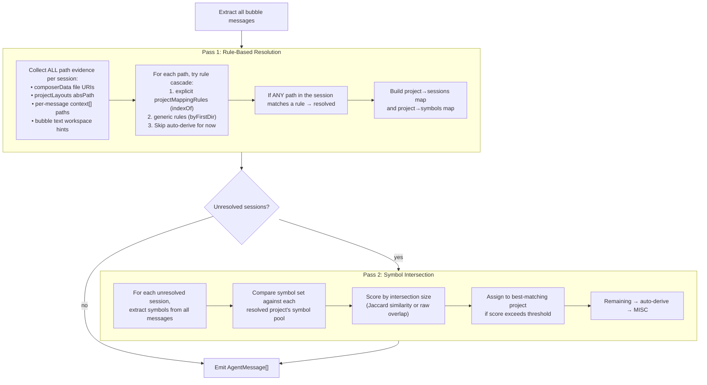

# R2BC — Better Cursor Harness: Rule Fix + Two-Pass Project Resolution

**Date**: 2026-03-26
**Module**: [`src/harness/cursor.ts`](../../../src/harness/cursor.ts)
**Complement to**: [`archi-h-cursor.md`](../../architecture/harness/archi-h-cursor.md)

---

## 1. Critical Bug: All Project Mapping Rules Silently Dropped

### 1.1 Root Cause

The cc.json config uses `"paths"` (plural) as the key name for both explicit and generic project mapping rules:

```json
"projectMappingRules": [
    { "paths": "Codez\\Nexus\\Evo", "newProjectName": "NexusEvo" },
    { "paths": "Codez\\Nexus\\AXON", "newProjectName": "AXON" }
],
"genericProjectMappingRules": [
    { "paths": "Codez\\Nexus", "rule": "byFirstDir" },
    { "paths": "Codez", "rule": "byFirstDir" }
]
```

But **both validator functions** check for `candidate.path` (singular):

- `asCursorProjectMappingRule()` at line 210: `if (typeof candidate.path !== "string")` → returns `null`
- `asCursorGenericProjectMappingRule()` at line 266: `if (typeof candidate.path !== "string" || ...)` → returns `null`

**Result**: Every rule fails validation. The log shows `explicit=0, generic=0`. The entire rule cascade is dead code — the harness **always** falls through to auto-derive (basename of workspace path) or MISC.

### 1.2 Cascading Effects

Because rules are never loaded:

1. **Wrong project names everywhere**: "storyTeller", "brain", "ndk", "dataLoader", "services", "operations", "dialogs", "views", "routes" — all sub-directory names that should have matched `Codez\Nexus\Evo` → `NexusEvo`.
2. **Too-broad derivations**: "Nexus", "Evo" — when the composerFileUris common parent lands on a shallow ancestor.
3. **Suggestions for rules you already have**: The harness suggests `genericProjectMappingRules` for `Codez\Nexus` — a rule that already exists in cc.json but was never loaded.
4. **27+ output folders** instead of ~5-6 real projects.

### 1.3 Fix

Accept both `path` and `paths` in all three validators:

```typescript
// asCursorProjectMappingRule — line 210
const pathValue = typeof candidate.path === "string" ? candidate.path
    : typeof candidate.paths === "string" ? candidate.paths
    : null;
if (!pathValue) { return null; }

// asCursorGenericProjectMappingRule — line 266
const pathValue = typeof candidate.path === "string" ? candidate.path
    : typeof candidate.paths === "string" ? candidate.paths
    : null;
if (!pathValue || typeof candidate.rule !== "string") { return null; }
```

**Same bug exists in `kiro.ts`** — the Kiro harness has character-for-character identical validators with the same `path`-only check, while cc.json Kiro rules also use `"paths"`. Fix both.

### 1.4 Expected Impact

Once rules load correctly, the resolution cascade in `resolveCursorProjectFromWorkspacePath()` uses `indexOf` matching:

```
normalizedRulePath.indexOf(normalizeRulePath(rule.path)) !== -1
```

This means a workspace path like `d:/Codez/Nexus/Evo/NexusDK/source/ndk/storyTeller` **would** match the rule `Codez\Nexus\Evo` → `NexusEvo`, because `"codez/nexus/evo"` appears inside the normalized path.

Similarly, the generic rule `Codez\Nexus` + `byFirstDir` would extract `Evo` as the first directory after the prefix, giving project `Evo`.

**Estimated resolution**: Fixing this single bug should correctly map **~80-90%** of currently misrouted sessions. The remaining sessions would be those with workspace paths that don't contain any rule-matched fragment (e.g., `c:/Down/recs`).

---

## 2. Two-Pass Project Resolution Architecture

Even after fixing the rule bug, some sessions will remain unresolved — either because their workspace paths don't match any rule, or because the workspace inference itself picked a bad path. The user's proposal: use **per-message context paths** and **symbol intersection** in a second pass to match orphan sessions against already-resolved project pools.

### 2.1 Current Flow (Single Pass)

```
Bubbles extracted → Workspace inference → Rule cascade → Auto-derive → MISC
                         ↑
              Uses: composerData file URIs,
                    projectLayouts absPath,
                    bubble text heuristics
              Does NOT use: per-message context[]
              Does NOT use: symbols (populated later by StorageWriter)
```

### 2.2 Proposed Flow (Two Pass)



### 2.3 Pass 1: Rule-Based Resolution (Enhanced)

**Key change**: Instead of finding ONE "best workspace path" per session and then running the rule cascade on it, we run the rule cascade on **every path candidate** for the session. The first match wins.

Path evidence sources (in priority order):
1. **projectLayouts absPath** — most authoritative (from `messageRequestContext`)
2. **composerData file URIs** — from `originalFileStates` + `allAttachedFileCodeChunksUris`
3. **Per-message `context[]` paths** — currently stored on each `CursorBubbleRecord` but never used for project resolution
4. **Bubble text workspace hints** — the existing heuristic source (weakest)

For each session, iterate through all path evidence and try the rule cascade. If **any** path matches an explicit or generic rule, the session is resolved.

```typescript
function resolveSessionByRules(
    sessionId: string,
    pathEvidence: string[],
    ruleSet: CursorProjectRuleSet
): CursorProjectResolution | null
{
    for (const rawPath of pathEvidence)
    {
        const normalized = normalizeWorkspaceRoot(rawPath);
        const resolution = resolveCursorProjectFromWorkspacePath(normalized, ruleSet);
        if (resolution.mode === "rule")
        {
            return resolution;
        }
    }
    return null;  // not resolved by rules — defer to pass 2
}
```

**Change to auto-derive behavior**: In pass 1, auto-derive should NOT be used. If no rule matches, the session is deferred. Auto-derive only kicks in after pass 2 fails.

### 2.4 Pass 2: Symbol Intersection

After pass 1, we have:
- A `Map<project, Set<symbol>>` — the cumulative symbol pool for each resolved project
- A list of unresolved sessions with their bubble messages

For each unresolved session:

1. **Extract symbols** from all messages in the session using `extractMessageSymbols()` (already exported from `SubjectGenerator.ts`)
2. **Compute intersection** with each resolved project's symbol pool
3. **Score** by intersection size (or Jaccard similarity: `|A ∩ B| / |A ∪ B|`)
4. **Assign** to the project with the highest score, if the score exceeds a minimum threshold (e.g., 3+ symbol matches, or Jaccard > 0.05)
5. **Fallback**: Sessions that don't meet the threshold go through auto-derive → MISC as before

```typescript
function matchSessionBySymbols(
    sessionSymbols: Set<string>,
    projectSymbolPools: Map<string, Set<string>>,
    minOverlap: number
): string | null
{
    let bestProject: string | null = null;
    let bestScore = 0;

    for (const [project, pool] of projectSymbolPools)
    {
        let overlap = 0;
        for (const symbol of sessionSymbols)
        {
            if (pool.has(symbol)) { overlap += 1; }
        }
        if (overlap > bestScore && overlap >= minOverlap)
        {
            bestScore = overlap;
            bestProject = project;
        }
    }

    return bestProject;
}
```

### 2.5 Symbol Pool Construction

During pass 1, as each session is resolved, its symbols are added to the project's pool:

```typescript
const projectSymbolPools = new Map<string, Set<string>>();

// After resolving a session in pass 1:
const pool = projectSymbolPools.get(project) ?? new Set<string>();
for (const bubble of sessionBubbles)
{
    for (const symbol of extractMessageSymbols(bubble.message))
    {
        pool.add(symbol);
    }
}
projectSymbolPools.set(project, pool);
```

The `extractMessageSymbols()` function is already exported from `SubjectGenerator.ts` and extracts camelCase identifiers, PascalCase class names, and dotted references (e.g., `NNCharacter`, `DialogMediator.hx`, `HexGridView`).

---

## 3. Additional Improvements

### 3.1 Noise Filtering in Workspace Candidates

The current `chooseBestWorkspacePath()` workspace heuristic picks up massive noise from code content. Examples from the log:

| Candidate | Count | What it actually is |
|---|---|---|
| `/` | 765 | Slash in every URL/path/comment |
| `console.log(` | 39 | Code snippet |
| `/**/*` | 7 | Glob pattern in code |
| `/<COMMENT` | 4 | Comment tag |
| `/Shield` | 211 | Game asset reference |
| `/No` | 42 | Fragment of natural language |

**Fix**: Strengthen `isLowSignalWorkspaceCandidate()` with additional rejection rules:

```typescript
// Reject paths with fewer than 2 segments (after the drive letter)
if (segments.length < 3 && !isDriveLetter(segments[0])) { return true; }

// Reject paths that look like code fragments
if (/^\/[a-z]/.test(normalized) && segments.length < 3) { return true; }

// Reject paths containing common code-noise patterns
const codeNoise = ["console.log", "/**", "/<", "/No ", "/Shield"];
if (codeNoise.some(noise => normalized.includes(noise))) { return true; }
```

However, with the two-pass architecture these noise candidates become less critical — they only matter for the heuristic fallback (source C), which is the weakest source and would only trigger after both rule-based and symbol-based resolution fail.

### 3.2 Context Path Quality

The `extractContextPaths()` regex (`/(?:[a-zA-Z]:\\|\\/)[^\s"'\`]+/g`) captures many false positives from code content:

- `//Continuum.activeStoryTeller.debugCall(...)` — code comment
- `//192.168.1.137:7112` — URL
- `//Removed` — comment
- `//<COMMENT` — XML/comment

**Fix**: Add a post-filter to `extractContextPaths()`:

```typescript
function isLikelyRealPath(candidate: string): boolean
{
    // Reject URL-like patterns
    if (/^\/\/[a-zA-Z0-9]/.test(candidate) && !candidate.includes(":\\")) return false;
    // Reject code comment patterns
    if (/^\/\/(\/|<|[A-Z][a-z]+\.)/.test(candidate)) return false;
    // Require at least 2 path segments
    const segments = candidate.split(/[\\/]/).filter(Boolean);
    return segments.length >= 2;
}
```

This improves the quality of context paths used in pass 1.

### 3.3 Diagnostic Logging Improvements (Done)

Chalk coloring and visual delimiters have already been added to the Cursor harness logging as of 2026-03-26:
- Teal `[Cursor]` tag, section delimiters with `━━━` lines
- Tree-style `├`/`└`/`│` prefixes for session entries
- Color coding: green=projects, blue=paths, magenta=sources, dim=UUIDs/noise
- Red for warnings and MISC sections

---

## 4. Implementation Plan

Tasks are grouped by difficulty and sorted chronologically within each group.

---

### Group A — Mechanical Fixes (rule key mismatch) ✅

{{SIMPLE}}

- [x] **A1.** In `cursor.ts:203` `asCursorProjectMappingRule()` — resolve `pathValue` from `candidate.path ?? candidate.paths`; replace all downstream `candidate.path` usages with `pathValue`.
- [x] **A2.** In `cursor.ts:259` `asCursorGenericProjectMappingRule()` — same pattern.
- [x] **A3.** In `kiro.ts:102` `asKiroProjectMappingRule()` — identical fix.
- [x] **A4.** In `kiro.ts:133` `asKiroGenericProjectMappingRule()` — identical fix.
- [x] **A5.** In `cursor.ts` `loadCursorProjectRuleSet()` — add a `console.warn` when rule entries are dropped (missing `path`/`paths`).
- [x] **A6.** In `kiro.ts` `loadKiroProjectRuleSet()` — same warning.
- [x] **A7.** Run `tsc --noEmit` — confirmed zero compile errors.
- [x] **A8.** Re-run Cursor ingest on SUSAN2 — confirmed `explicit=2, generic=2`. Output folders collapsed from ~27 to correct project set.

---

### Group B — Split `cursor.ts` → `cursor-query.ts` (SQLite reading + parsing) ✅

`cursor.ts` is ~2530 lines. Split into three files: `cursor.ts` (entry point + orchestration), `cursor-query.ts` (SQLite reading + message extraction/parsing), and `cursor-matcher.ts` (workspace inference + project mapping).

{{SIMPLE}}

- [x] **B1.** Create `cursor-query.ts` scaffold with imports (`bun:sqlite`, `luxon`, `chalk`, `path`). Move all Cursor-specific **type declarations** that are query-related: `CursorMessageLike`, `CursorWalkerState`, `CursorRequestLike`, `CursorSessionLike`, `CursorKVRow`, `CursorBubbleRecord`. Export them for use by `cursor.ts`.
- [x] **B2.** Move **SQLite model/timestamp builders**: `buildCursorSessionModelMap()`, `buildCursorSessionTimestampMap()`. These read from `cursorDiskKV` and return `Map<string, string>` / `Map<string, DateTime>`.
- [x] **B3.** Move **bubble extraction pipeline**: `extractCursorBubbleMessages()` + its helpers `mapBubbleTypeToRole()`, `parseCursorBubbleDateTime()`, `findDeepTimestamp()`.
- [x] **B4.** Move **message parsing utilities**: `pickModel()`, `normalizeMessageText()`, `extractContextPaths()`, `toDatabaseText()`.
- [x] **B5.** Move **key classification**: `isCursorChatKeyCandidate()`, `cursorKeyFamily()`, `extractSessionHintsFromKey()`.
- [x] **B6.** Move **request-like extraction**: `extractRequestContextPaths()`, `extractRequestUserText()`, `extractRequestAssistantText()`, `extractFromRequestLikeSessions()`.
- [x] **B7.** Move **message walker + role/date parsers**: `walkMessageLikeNodes()`, `mapCursorRole()`, `parseCursorDateTime()`, `parseCursorDateTimeStrict()`.
- [x] **B8.** Update `cursor.ts` imports — import all moved functions/types from `./cursor-query.js`. Run `tsc --noEmit`.

---

### Group C — Split `cursor.ts` → `cursor-matcher.ts` (workspace inference + project mapping) ✅

{{MEDIUM}}

- [x] **C1.** Create `cursor-matcher.ts` scaffold. Move **matcher type declarations**: `CursorProjectLayout`, `CursorWorkspaceSource`, `CursorWorkspaceInference`, `CursorProjectMappingRule`, `CursorProjectNameMappingRule`, `CursorGenericProjectMappingRule`, `CursorProjectRuleSet`. Move **constants**: `PROJECT_ROOT_CACHE`, `WORKSPACE_NORMALIZE_CACHE`, `MISC_CURSOR_PROJECT`, `PROJECT_BOUNDARY_MARKERS`, `PROJECT_TRAILING_NOISE`, `CUR`, `CUR_LINE`.
- [x] **C2.** Move **rule validators**: `normalizeRulePath()`, `asCursorProjectMappingRule()`, `asCursorProjectNameMappingRule()`, `asCursorGenericProjectMappingRule()`.
- [x] **C3.** Move **rule loading + application**: `loadCursorProjectRuleSet()`, `remapCursorProjectName()`, `buildCursorGenericRuleSuggestions()`.
- [x] **C4.** Move **path utilities**: `normalizePathCandidate()`, `splitPathSegments()`, `joinPathSegments()`, `deriveCommonDirectoryPath()`, `parseFileUriToPath()`.
- [x] **C5.** Move **path analysis**: `isLikelyFilePath()`, `toProjectDirectory()`, `findProjectRootFromDirectory()`, `normalizeWorkspaceRoot()`.
- [x] **C6.** Move **path filtering**: `isLikelyHarnessStoragePath()`, `isLowSignalWorkspaceCandidate()`. Note: `collectPathLikeValues()` placed in cursor-query.ts (not cursor-matcher) to avoid circular dependency — it calls `extractContextPaths` and is called by `extractCursorBubbleMessages`.
- [x] **C7.** Move **workspace evidence extractors**: `extractProjectLayoutsForSession()`, `extractComposerFileUris()`, `deriveWorkspaceRootFromFileUris()`.
- [x] **C8.** Move **workspace heuristics**: `collectWorkspaceHints()`, `chooseBestWorkspacePath()`.

{{MEDIUM}}

- [x] **C9.** Move **workspace inference orchestrators**: `buildComposerWorkspaceMap()`, `buildProjectLayoutWorkspaceMap()`, `queryCursorSessionEvidence()`, `inferCursorWorkspaceBySession()`.
- [x] **C10.** Move **project resolution**: `workspacePathToProject()`, `resolveCursorProjectFromWorkspacePath()`.
- [x] **C11.** Update `cursor.ts` imports — import all moved functions/types from `./cursor-matcher.js`. Run `tsc --noEmit`.
- [x] **C12.** Verify `cursor.ts` is now only the `readCursorChats()` entry point, importing everything else from the two new modules. Final line counts: cursor.ts=322, cursor-query.ts=1041, cursor-matcher.ts=1311 (total=2674). Note: `logCursorProgress`, `CUR`, `CUR_LINE`, `CURSOR_PROGRESS_EVERY` placed in cursor-query.ts (shared by both modules).

---

### Group D — `HarnessMatcher.ts`: Symbol Map Builder ✅

Create `src/harness/HarnessMatcher.ts` — a class that receives processed `AgentMessage[]` and builds per-session + per-project symbol frequency maps, then writes them to storage.

**Key design points:**
- Uses `extractMessageSymbols()` from `SubjectGenerator.ts` to extract symbols from each message.
- Only operates on projects defined in `cc.json` `projectMappingRules` (currently: `NexusEvo`, `AXON`).
- Per-session output: `sym_{sessionId}.json` — written alongside the session file in `{storage}/{machine}/{harness}/{project}/{YYYY-MM}/`.
- Per-project output: `sym_{PROJECT_NAME}.json` — written in the project root `{storage}/{machine}/{harness}/{project}/`.
- Called from `cursor-matcher.ts` (or the main `readCursorChats()` orchestration) after all Cursor messages are assembled.

{{HARD}}

- [x] **D1.** Create `HarnessMatcher.ts` class skeleton. Constructor accepts `AgentMessage[]` and an array of rule-matched project names (e.g., `["NexusEvo", "AXON"]`). Store a filtered view of messages belonging only to those projects.
- [x] **D2.** Implement `buildSessionSymbolMaps(): Map<sessionId, Map<symbol, count>>` — for each session in the filtered set, iterate all messages, call `extractMessageSymbols()`, accumulate symbol frequencies per session.
- [x] **D3.** Implement `buildProjectSymbolMaps(): Map<project, Map<symbol, count>>` — aggregate session-level symbol maps into per-project totals (sum frequencies across all sessions in a project).
- [x] **D4.** Implement `writeSessionSymbolFiles(storageRoot, machine, harness)` — for each session, serialize its symbol map to `sym_{sessionId}.json` in the same `{YYYY-MM}/` folder as the session's output file. Determine the `YYYY-MM` from the session's first message dateTime.
- [x] **D5.** Implement `writeProjectSymbolFiles(storageRoot, machine, harness)` — for each project, serialize its aggregated symbol map to `sym_{PROJECT_NAME}.json` in the project root folder (`{storage}/{machine}/{harness}/{project}/`).
- [x] **D6.** Wire the `HarnessMatcher` call into the ingest pipeline in `ContextCore.ts` — after `readHarnessChats()` returns for Cursor, instantiate `HarnessMatcher` with the messages and the explicit project names from `loadCursorProjectRuleSet().projectMappingRules`, then call build + write methods. Deviation: wired in ContextCore.ts (not cursor.ts) since it has access to `storageRoot`, `machine`, and `harnessName`.
- [x] **D7.** Add chalk-colored diagnostic log (`[SymbolMap]` prefix in purple `#9B59B6`) for symbol map stats: per-project symbol count, top-5 symbols per project, session count per project.
- [x] **D8.** Run `tsc --noEmit` — zero errors. Plan doc updated, all groups A–D complete.

---

## 5. Risk Assessment

| Risk | Severity | Mitigation |
|---|---|---|
| Phase 1 changes existing output folder structure | Low | Old session files remain; new runs will write to correct folders. User may want to re-ingest to clean up. |
| File split introduces import/export regressions | Medium | Move one function cluster at a time, `tsc --noEmit` after each group. Keep `cursor.ts` as thin orchestrator. |
| Circular dependencies between cursor-query ↔ cursor-matcher | Low | Query types flow one-way into matcher; matcher types flow one-way into cursor.ts. No back-references. |
| `extractMessageSymbols` import creates new dependency from harness → analysis | Low | The function is already exported and stateless. No circular dependency risk. |
| `sym_*.json` disk usage for large projects | Low | Symbol maps are small (~10-50 KB per session, ~100-500 KB per project). Negligible vs. session JSON files. |
| HarnessMatcher needs StorageWriter's output path convention | Medium | Replicate the `{storage}/{machine}/{harness}/{project}/{YYYY-MM}/` path logic or accept `storageRoot` + path params. |

---

## 6. What Changes in the Output

### Before (current — broken rules)
```
SUSAN2/Cursor/
├── AXON/          ← auto-derived (correct by luck)
├── brain/         ← should be NexusEvo
├── storyTeller/   ← should be NexusEvo
├── ndk/           ← should be NexusEvo
├── dataLoader/    ← should be NexusEvo
├── services/      ← should be NexusEvo
├── operations/    ← should be NexusEvo
├── dialogs/       ← should be NexusEvo
├── Evo/           ← should be NexusEvo
├── Nexus/         ← should be NexusEvo or AXON or Hexez
├── NexusPlatform/ ← should be NexusEvo
├── keeperNkin/    ← should be NexusEvo
├── hexez-be/      ← could be Hexez (generic rule)
├── react-hexgrid/ ← could be Hexez (generic rule)
├── karla-chatbot/ ← correct (auto-derived, unique path)
├── ... 12 more noise folders
```

### After Phase 1 (rule fix only)
```
SUSAN2/Cursor/
├── AXON/          ← explicit rule: Codez\Nexus\AXON
├── NexusEvo/      ← explicit rule: Codez\Nexus\Evo
├── Hexez/         ← generic rule: Codez\Nexus + byFirstDir
├── Reach2/        ← generic rule: Codez\Nexus + byFirstDir
├── karla-chatbot/ ← auto-derived (no rule matches c:/Down or zEVO)
├── recs/          ← auto-derived (c:/Down/recs)
├── RecordingsTransfer/ ← auto-derived (Codez\Tools)
├── MISC/          ← truly unresolvable
```

### After Phase 3 (symbol intersection)
```
SUSAN2/Cursor/
├── AXON/          ← rule + symbol affinity
├── NexusEvo/      ← rule + symbol affinity
├── Hexez/         ← generic rule
├── Reach2/        ← generic rule
├── karla-chatbot/ ← symbol affinity (matches karla symbols from CC/Kiro)
├── Tools/         ← generic rule: Codez + byFirstDir
├── MISC/          ← 1-2 truly orphan sessions
```
