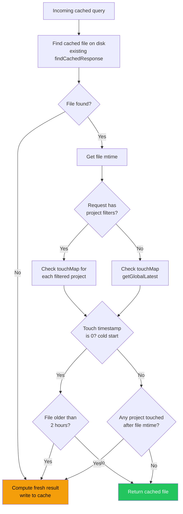

# R2CFW — Cache Invalidation via ProjectTouchMap

**Date**: 2026-03-28
**Status**: Planning
**Scope**: Replace daily-TTL cache invalidation with project-aware staleness checking driven by `FileWatcher` → `IncrementalPipeline` ingest events
**Prerequisite**: [`r2urc2-back-to-caching.md`](r2urc2-back-to-caching.md) (caching is already wired into endpoints)

---

## 1. Cache Directory Rename: `zeCache` → `zzzcache`

**Completed 2026-03-28.** Renamed everywhere in source and docs.

| File | Change |
|------|--------|
| `src/cache/ResponseCache.ts` | `CACHE_SUBDIR = 'zzzcache/queries'`; updated JSDoc |
| `src/db/BaseMessageStore.ts` | `startsWith("zzzcache")` in `shouldSkipDirectory()` |
| `server/zz-reach2/architecture/search/archi-search.md` | Cache path example |
| `server/zz-reach2/architecture/techDebt/td-memory-optimization.md` | Skip-list entry |
| `visualizer/zz-reach2/architecture/ui/archi-search-ui.md` | Cache path in ResponseCache section |
| `server/zz-reach2/upgrades/2026-03/r2urc-response-caching.md` | All references (original spec) |
| `server/zz-reach2/upgrades/2026-03/r2urc2-back-to-caching.md` | All references (re-wire spec) |

> **Migration**: Any existing `zeCache/` directory is inert and can be deleted. `zzzcache/` is created lazily on first cache write.

---

## 2. Cache System Inventory

### 2.1 Module: `src/cache/ResponseCache.ts`

| Export | Purpose |
|--------|---------|
| `sanitizeQueryForFilename(query)` | Filesystem-safe 50-char prefix from query string |
| `computeQueryHash(query)` | SHA-256, 12-char hex; case-insensitive |
| `getTodayCacheDir()` | `{storage}/zzzcache/queries/YYYY-MM-DD/` |
| `findCachedResponse(hash)` | Scan today's dir; parse `{prefix}--{hash}.json` filenames |
| `readCachedResponse<T>(path)` | JSON.parse from file |
| `writeCachedResponse(query, data, prefix?)` | Create dir + write file |
| `buildCacheFilenamePrefix(endpoint, terms, opts?)` | Human-readable prefix: `{ep}-{terms}[--from-{date}][--lim-{N}]` |
| `buildSearchCacheKey(prefix, terms, opts?)` | Composite pipe-delimited key for hashing; includes all filter params |
| `withCache<T>(query, compute, options?)` | Full wrapper: check → compute → write → return with `cached` flag |

**Cache key structure**:
```
msg|{searchTerms}[|sym:{symbols}][|sub:{subject}][|from:{date}][|proj:{h1}::{p1},...][|lim:{N}]
thr|{searchTerms}[|sym:{symbols}][|sub:{subject}][|from:{date}][|proj:...][|lim:{N}]
thr-latest|lim:{N}[|from:{date}]
```

### 2.2 Cache Consumers

| Route | Cache prefix | Invalidation | `withCache` call site |
|-------|-------------|-----|----------------------|
| `POST /api/messages` (search) | `msg` | ProjectTouchMap | `messageRoutes.ts` |
| `POST /api/threads` (search) | `thr` | ProjectTouchMap | `threadRoutes.ts` |
| `POST /api/threads/latest` | `thr-latest` | ProjectTouchMap | `threadRoutes.ts` |

### 2.3 DB Loader Skip Rule

`BaseMessageStore.collectJsonFiles()` → `shouldSkipDirectory()`:
```typescript
lower.startsWith("zzzcache")  // skip cache directories during JSON session scan
```

---

## 3. Problem Statement

### 3.1 Cache Staleness After Live Ingestion

The `FileWatcher` detects new/changed source files and `IncrementalPipeline` ingests them into `MessageDB`. However, the `ResponseCache` is **not notified** — cached search results that would include the new messages remain stale until the daily TTL expires (midnight).

### 3.2 Fuse.js Index Staleness (Hard Dependency)

The Fuse.js search index is built **once at server startup** (`initSearchIndex()` in `searchEngine.ts`). When `IncrementalPipeline` adds new messages to the DB, they are **not added to the Fuse.js index**. This means even if we invalidate the cache and recompute the search, the new messages won't appear in results.

This is a **hard prerequisite**: cache invalidation for search endpoints is pointless unless the Fuse.js index also includes the new messages. The `POST /api/threads/latest` endpoint (which queries the DB directly via `getLatestThreads()`, not Fuse.js) would benefit immediately, but the primary search endpoints (`POST /api/messages`, `POST /api/threads`) require index freshness.

### 3.3 Current Knowledge at Each Layer

| Component | Knows project? | Knows harness? | Knows new messages? | Can invalidate cache? |
|-----------|:-:|:-:|:-:|:-:|
| `FileWatcher` | No | Yes | No (only file events) | No |
| `IncrementalPipeline` | **Yes** (discovered per session) | **Yes** | **Yes** (`newSessionIds`) | No (no service ref) |
| `ResponseCache` | Yes (in cache key) | Yes (in cache key) | No | Yes (if told when) |
| Route handlers | Yes (request body) | Yes (request body) | No | No |

**Conclusion**: `IncrementalPipeline` is the only component that knows which `(harness, project)` pairs were just updated. It must be the one to record this information.

---

## 4. Design: ProjectTouchMap

### 4.1 Concept

An in-memory `Map<string, number>` that records when each `harness::project` pair last received new messages. No files are deleted — staleness is checked lazily at query time.

```typescript
// src/cache/ProjectTouchMap.ts

/** Max age for cache files when no touch has been recorded (cold start). */
const COLD_START_MAX_AGE_MS = 2 * 60 * 60 * 1000; // 2 hours

class ProjectTouchMap {
  private touches: Map<string, number>;  // key: "harness::project", value: epoch ms

  /** Record that (harness, project) just received new messages. */
  touch(harness: string, project: string): void;

  /** Get the timestamp of the last touch for a specific project. Returns 0 if never touched. */
  getLastTouch(harness: string, project: string): number;

  /** Get the most recent touch across ALL projects. Returns 0 if never touched. */
  getGlobalLatest(): number;

  /** Cold-start max age constant, exported for use in isStaleByProjectTouch(). */
  static readonly COLD_START_MAX_AGE_MS = COLD_START_MAX_AGE_MS;
}
```

### 4.2 Staleness Check Flow



### 4.3 Key Design Decisions

| Question | Decision | Rationale |
|----------|----------|-----------|
| Map key schema | `harness::project` | Matches the existing `proj:` field in cache keys and route handler `projectFilterSet` format |
| No-project searches | Check `getGlobalLatest()` | If any project changed, an unscoped search may include new results |
| Staleness check unit | File mtime vs touch timestamp | File mtime is already on disk (no extra bookkeeping); touch timestamp is when pipeline completed |
| Physical deletion? | Never — lazy rewrite | Avoids I/O storms when FileWatcher fires frequently; stale files are simply overwritten |
| Initialization | Empty map at startup + 2-hour cold-start fallback | On restart, the touch map has no entries. Cache files older than 2 hours are assumed stale (`COLD_START_MAX_AGE_MS`). Files newer than 2 hours are served — they're recent enough to be trustworthy even without touch history. |
| `maxAgeMs` on `thr-latest` | **Removed** — ProjectTouchMap replaces it | The 5-min hardcoded TTL was a workaround for not knowing when new data arrived. With ProjectTouchMap, we know exactly when data changed. The endpoint queries the DB directly (not Fuse), so `getGlobalLatest()` is the sole freshness gate. |

### 4.4 `withCache` Signature Change

```typescript
// Before:
withCache<T>(query, compute, filenamePrefix?, maxAgeMs?)

// After:
withCache<T>(query, compute, options?: {
  filenamePrefix?: string;
  projectTouchMap?: ProjectTouchMap;
  projectFilters?: Array<{ harness: string; project: string }>;
})
```

Bundling into an options object avoids a growing positional parameter list. `maxAgeMs` is removed — all freshness is now driven by `ProjectTouchMap` (with a 2-hour cold-start fallback when no touches exist). All callers must be updated (3 call sites in `messageRoutes.ts` and `threadRoutes.ts`).

---

## 5. Design: Fuse.js Index Refresh

When `IncrementalPipeline` adds new messages to the DB, the Fuse.js index must also be updated so that recomputed search results actually include the new data.

### 5.1 Approach

Add an `addToSearchIndex(messages: AgentMessage[])` function to `searchEngine.ts` that incrementally appends new records to the existing Fuse index. Fuse.js supports `add()` on a live index — no full rebuild needed.

### 5.2 Wiring

`IncrementalPipeline` receives a callback (`onMessagesIngested`) at construction. After `messageDB.addMessages()` returns with `newCount > 0`, the pipeline calls the callback with the new messages. The callback (set up in `ContextCore.ts`) calls `addToSearchIndex()`.

This keeps `IncrementalPipeline` decoupled from the search engine — it doesn't import `searchEngine.ts`, just calls a function it was given.

---

## 6. Tasks

### Phase 1 — ProjectTouchMap Data Structure

{{SIMPLE}}

- [ ] Create `src/cache/ProjectTouchMap.ts` with class: `Map<string, number>` wrapper, `touch(harness, project)`, `getLastTouch(harness, project)`, `getGlobalLatest()`, `size` getter, and `static readonly COLD_START_MAX_AGE_MS = 2 * 60 * 60 * 1000` constant
- [ ] Add `projectTouchMap?: ProjectTouchMap` field to `RouteContext` interface in `src/server/RouteContext.ts`
- [ ] Instantiate `ProjectTouchMap` in `ContextCore.ts` startup (alongside existing `topicStore`, `scopeStore` etc.)
- [ ] Pass `ProjectTouchMap` instance to `startServer()` in `ContextServer.ts`; inject into the `RouteContext` object
- [ ] Accept `ProjectTouchMap` in `IncrementalPipeline` constructor; store as instance field

### Phase 2 — Pipeline Touch Events

{{SIMPLE}}

- [ ] In `IncrementalPipeline.ingest()`: after `messageDB.addMessages()` returns `newCount > 0` for a session, call `this.projectTouchMap.touch(harnessName, project)`
- [ ] In `IncrementalPipeline.ingestFromStorage()`: after adding messages, call `this.projectTouchMap.touch(harness, project)` (harness and project are available on each deserialized `AgentMessage`)
- [ ] Wire `ProjectTouchMap` from `ContextCore.ts` through to the `IncrementalPipeline` constructor (it's created in `ContextCore.ts`, pipeline is created there too — direct pass)

### Phase 3 — `withCache` Staleness Logic

{{MEDIUM}}

- [ ] Add `isStaleByProjectTouch(filePath: string, touchMap: ProjectTouchMap, projectFilters?: Array<{harness: string; project: string}>): boolean` to `ResponseCache.ts` — gets file mtime via `statSync`, compares against `getLastTouch()` per project or `getGlobalLatest()` when no filters. **Cold-start fallback**: when the relevant touch timestamp is 0 (no entry), check `Date.now() - fileMtimeMs > COLD_START_MAX_AGE_MS` instead — cache files older than 2 hours are assumed stale.
- [ ] Define `CacheOptions` type in `ResponseCache.ts`: `{ filenamePrefix?: string; projectTouchMap?: ProjectTouchMap; projectFilters?: Array<{harness: string; project: string}> }` — no `maxAgeMs` (ProjectTouchMap + cold-start fallback replaces all TTL-based invalidation)
- [ ] Refactor `withCache` signature from positional params to `withCache<T>(query, compute, options?: CacheOptions)`; remove the `isCacheStale()` / `maxAgeMs` code path entirely
- [ ] Implement the staleness branch inside `withCache`: after finding a cached file, check `isStaleByProjectTouch()` — if stale, recompute and overwrite
- [ ] Update `messageRoutes.ts`: adapt all `withCache` call sites to the new options object signature; pass `projectTouchMap` from `RouteContext` and `projectFilters` from the parsed request body
- [ ] Update `threadRoutes.ts`: adapt all `withCache` call sites to new options object; remove the `LATEST_CACHE_TTL = 5 * 60 * 1000` constant and `maxAgeMs` parameter from `POST /api/threads/latest` — it now uses `projectTouchMap` with `getGlobalLatest()` (no project filters) like the other endpoints

### Phase 4 — Fuse.js Index Refresh

{{MEDIUM}}

- [ ] Add `addToSearchIndex(messages: AgentMessage[]): void` to `searchEngine.ts` — calls `fuseIndex.add()` for each new message's `SearchRecord`, appends to `indexedRecords`
- [ ] Add optional `onMessagesIngested?: (messages: AgentMessage[]) => void` callback parameter to `IncrementalPipeline` constructor
- [ ] In `IncrementalPipeline.ingest()` and `ingestFromStorage()`: after all sessions processed successfully, call `this.onMessagesIngested(allNewMessages)` if callback is set and `allNewMessages.length > 0`
- [ ] In `ContextCore.ts` startup: after `initSearchIndex()`, pass `addToSearchIndex` as the `onMessagesIngested` callback when constructing `IncrementalPipeline`

### Phase 5 — Verification & Docs

{{SIMPLE}}

- [ ] Verify server starts clean; confirm `ProjectTouchMap` is instantiated and empty
- [ ] Trigger a FileWatcher ingest (modify a source file); confirm `ProjectTouchMap` records the touch
- [ ] Run a search → cache MISS → result cached. Trigger ingest for same project. Run same search → cache should recompute (MISS again) with new data visible
- [ ] Run an all-projects search (no `projects` filter). Trigger ingest for any project. Run same search → recompute
- [ ] Run a search for project A. Trigger ingest for project B only. Run same search for A → should return cached (HIT), not recompute
- [ ] Confirm `POST /api/threads/latest` uses ProjectTouchMap (`getGlobalLatest()`) as sole freshness gate — any project touch after the cache file was written causes recompute
- [ ] Cold-start test: restart server (empty touch map), confirm cache files older than 2 hours are recomputed while recent ones are served
- [ ] Update `archi-search.md` section 7 (Response Cache): document `ProjectTouchMap` invalidation, remove daily-TTL-only description
- [ ] Update `archi-context-core-level0.md` module inventory: add `ProjectTouchMap` entry

---

## 7. Files Changed (Expected)

| File | Change |
|------|--------|
| `src/cache/ProjectTouchMap.ts` | **NEW** — `ProjectTouchMap` class |
| `src/cache/ResponseCache.ts` | Add `isStaleByProjectTouch()`, `CacheOptions` type, refactor `withCache` signature |
| `src/search/searchEngine.ts` | Add `addToSearchIndex()` |
| `src/server/RouteContext.ts` | Add `projectTouchMap` field |
| `src/server/ContextServer.ts` | Accept + inject `ProjectTouchMap` into `RouteContext` |
| `src/server/routes/messageRoutes.ts` | Pass `projectTouchMap` + `projectFilters` to `withCache` |
| `src/server/routes/threadRoutes.ts` | Pass `projectTouchMap` + `projectFilters` to `withCache` |
| `src/watcher/IncrementalPipeline.ts` | Accept `ProjectTouchMap` + `onMessagesIngested` callback; call both after ingest |
| `src/ContextCore.ts` | Instantiate `ProjectTouchMap`, wire to pipeline + server |

---

## 8. Architectural Notes

### 8.1 Why Not Physical Deletion?

The FileWatcher fires frequently (debounce timers of 1–5 seconds per harness). Physically deleting cache files on every ingest would cause I/O storms and defeat the purpose of caching. The lazy-rewrite approach means stale files sit on disk harmlessly until the same query is requested again — then they're overwritten in-place.

### 8.2 Daily Directory Structure Stays

The `YYYY-MM-DD/` directory structure remains useful for disk hygiene (old dirs can be pruned periodically). The `ProjectTouchMap` staleness check is **additive** — it runs alongside the existing date-based directory logic, not instead of it.

### 8.3 Cold-Start Fallback (2-Hour TTL)

On server restart the `ProjectTouchMap` is empty — no project has been "touched" yet. Without a fallback, every cached file would appear fresh (touch 0 < file mtime always holds). But the startup pipeline may have loaded new data into the DB and Fuse index that wasn't present when those cache files were written.

The fallback: when a staleness check encounters touch timestamp 0 for the relevant project(s) — or `getGlobalLatest() === 0` for unscoped queries — it falls back to a simple age check: `Date.now() - fileMtimeMs > COLD_START_MAX_AGE_MS` (2 hours). This means:

- **Cache file < 2 hours old**: served as-is. It was written recently, likely by this same server version or a very recent prior run. Trustworthy enough.
- **Cache file > 2 hours old**: assumed stale and recomputed. The server may have been down for a while; data could have changed.

Once the first `FileWatcher` ingest fires and calls `touch()`, the touch map has real entries and the cold-start path is no longer reached for those projects.

### 8.4 Memory Cost

The `ProjectTouchMap` holds one entry per unique `harness::project` pair. With 6 harnesses × ~20 projects each = ~120 entries × ~50 bytes each ≈ 6 KB. Negligible.
