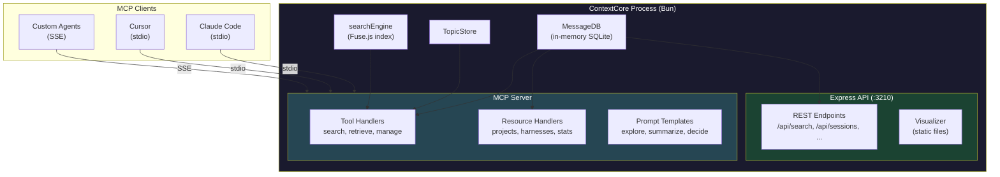

# R2M1 — MCP Server Implementation for ContextCore

**Date**: 2026-03-13
**Status**: Planning
**Scope**: Expose ContextCore's search, retrieval, and topic management capabilities to LLMs via Model Context Protocol
**Parent**: [`archi-context-core-level0.md`](../../architecture/archi-context-core-level0.md)
**Related**: [`archi-search.md`](../../architecture/search/archi-search.md), [`archi-cxs.md`](../../protocol/archi-cxs.md)

---

## 1. Motivation

ContextCore holds a rich, queryable archive of developer-AI conversations across four IDE harnesses. Today this data is accessible only through the Express REST API (port 3210) and the D3 visualizer. But the most natural consumer of conversation history is **another AI** — an LLM that can search past sessions, retrieve relevant context, and build on prior reasoning.

The **Model Context Protocol (MCP)** is the standard interface for connecting LLMs to external data sources and tools. By exposing ContextCore as an MCP server, any MCP-capable client (Claude Code, Cursor, VS Code Copilot, custom agents) can:

- **Search** past conversations by keyword, symbol, or semantic similarity
- **Retrieve** full session transcripts to understand prior reasoning
- **Discover** what topics have been discussed about a file, module, or project
- **Browse** project/harness metadata as structured resources
- **Set topics** on sessions for better organization

This is the missing piece that the CXC design document didn't address: **real-time LLM access to the conversation archive**, not just storage and visualization.

---

## 2. Architecture

### 2.1 Integrated Server Approach

The MCP server will run **inside the same Bun process** as ContextCore, sharing the `MessageDB` instance directly. This avoids HTTP round-trips and keeps the deployment as a single process.

A **separate entry point** (`src/mcp/serve.ts`) will also be provided for standalone stdio mode, enabling MCP clients to launch the server as a subprocess without starting the full Express API.



### 2.2 Transport Strategy

| Phase | Transport | Client | Use Case |
|-------|-----------|--------|----------|
| **Phase 1** | **stdio** | Claude Code, Cursor | Local MCP — client spawns server as subprocess |
| **Phase 2** | **SSE** | Remote agents, web clients | Network MCP — server runs alongside Express on :3210 |

stdio is prioritized because it's the most common MCP integration pattern and requires zero networking configuration.

### 2.3 Entry Points

| Entry Point | Command | Purpose |
|-------------|---------|---------|
| `src/ContextCore.ts` | `bun run start` | Full pipeline: ingest → DB → Express + MCP |
| `src/mcp/serve.ts` | `bun run mcp` | Standalone MCP: load DB from storage → stdio server |

The standalone entry point skips ingestion and Express, loading only from persisted JSON files. This makes it fast to start and suitable for MCP client subprocess management.

---

## 3. Tool Inventory

### 3.1 Read Tools (from existing API)

| Tool | Maps to | Description |
|------|---------|-------------|
| `get_message` | `GET /api/messages/:id` | Retrieve a single message by its unique ID |
| `get_session` | `GET /api/sessions/:sessionId` | Get all messages in a conversation session, time-ordered |
| `list_sessions` | `GET /api/sessions` | List session summaries (count, date range, harness) |
| `query_messages` | `GET /api/messages?filters` | Filtered + paginated message listing |
| `get_latest_threads` | `GET /api/threads/latest` | Most recent conversation threads by activity |
| `get_topics` | `GET /api/topics` | List all topic entries (AI summaries + custom topics) |
| `get_topic` | `GET /api/topics/:sessionId` | Topic entry for a specific session |

### 3.2 Search Tools

| Tool | Maps to | Description |
|------|---------|-------------|
| `search_messages` | `GET /api/search?q=` | Full-text search across messages with advanced query syntax (`"exact"`, `OR`, `+AND`) |
| `search_threads` | `GET /api/search/threads?q=` | Thread-level search — find conversations, not individual turns |

### 3.3 Write Tools

| Tool | Maps to | Description |
|------|---------|-------------|
| `set_topic` | `POST /api/topics` | Set or clear a custom topic label on a session |

### 3.4 Advanced Tools (new, no existing API equivalent)

| Tool | Description |
|------|-------------|
| `get_conversation_summary` | Formatted narrative view of a session: participants, duration, key topics, message count |
| `get_project_overview` | Activity summary for a project: session count, date range, harness breakdown, recent threads |
| `find_related_conversations` | Find sessions with overlapping subjects or symbols for a given session or query |
| `get_developer_timeline` | Chronological view of recent work across all projects — what was worked on and when |

---

## 4. Resource Inventory

MCP Resources provide browsable, structured data that LLMs can inspect without executing a search.

| URI Pattern | Description | Content |
|-------------|-------------|---------|
| `cxc://stats` | System-wide statistics | Total messages, sessions, harness breakdown, date range |
| `cxc://projects` | All known projects | Project names with session counts and last activity |
| `cxc://harnesses` | Configured harnesses | Harness names, message counts, date ranges |
| `cxc://projects/{name}/sessions` | Sessions for a project | Session list with summaries for a specific project |

---

## 5. Prompt Inventory

MCP Prompts are pre-built conversation starters that inject relevant context automatically.

| Prompt | Arguments | Purpose |
|--------|-----------|---------|
| `explore_history` | `topic: string` | "What has been discussed about {topic}?" — searches and summarizes relevant sessions |
| `summarize_session` | `sessionId: string` | "Summarize this conversation" — retrieves and formats a full session narrative |
| `find_decisions` | `component: string` | "What design decisions were made about {component}?" — cross-session decision archaeology |
| `debug_history` | `issue: string` | "What debugging has been done for {issue}?" — finds related debugging sessions |

---

## 6. Response Formatting Strategy

LLM context windows are finite. MCP tool responses must be **information-dense without being overwhelming**. The strategy:

| Scenario | Strategy |
|----------|----------|
| Single message | Full content, all metadata |
| Session (≤30 messages) | Full messages with role labels |
| Session (>30 messages) | First 5 + last 5 messages, with "[...{N} messages omitted...]" |
| Search results (≤20 hits) | All results with excerpts (first 300 chars of each message) |
| Search results (>20 hits) | Top 20 by score, with total count noted |
| Thread list | Compact: sessionId, subject, harness, messageCount, date range |

A `maxLength` parameter on applicable tools will let clients control verbosity.

---

## 7. Implementation Tasks

### Level 1 — Foundation & Scaffolding

{{SIMPLE}}

- [x] Install `@modelcontextprotocol/sdk` as a dependency in `package.json`
- [x] Create `src/mcp/` directory with `MCPServer.ts` as the main MCP server class
- [x] Implement `MCPServer` constructor: accept `MessageDB`, `TopicStore`, and search engine references
- [x] Configure stdio transport in `MCPServer` using `StdioServerTransport`
- [x] Register server metadata (name: `"context-core"`, version from package.json, capabilities)
- [x] Create standalone entry point `src/mcp/serve.ts` that loads DB from storage and starts MCP
- [x] Add `"mcp": "bun run src/mcp/serve.ts"` script to `package.json`
- [ ] Add MCP configuration section to `CCSettings` (enable/disable, transport type)

### Level 2 — Core Read Tools: Messages & Sessions

{{MEDIUM}}

- [x] Create `src/mcp/tools/` directory with one file per tool group
- [x] Implement `get_message` tool: accept `{ id: string }`, return full serialized `AgentMessage` with topic resolution
- [x] Implement `get_session` tool: accept `{ sessionId: string }`, return all messages time-ordered with session metadata header
- [x] Implement `list_sessions` tool: return session summaries with resolved topics, sorted by recency
- [x] Implement `query_messages` tool: accept `{ role?, harness?, model?, project?, from?, to?, page?, pageSize? }`, return paginated results
- [x] Implement `get_latest_threads` tool: accept `{ limit?: number }`, return latest `AgentThread[]` with resolved topics
- [x] Implement `get_topics` tool: return all `TopicEntry[]` from `TopicStore`
- [x] Implement `get_topic` tool: accept `{ sessionId: string }`, return single `TopicEntry`

### Level 3 — Search Tools

{{MEDIUM}}

- [x] Implement `search_messages` tool: accept `{ query: string, maxResults?: number }`, invoke `executeSearch()` from `searchEngine.ts`
- [x] Implement `search_threads` tool: accept `{ query: string }`, invoke search + `aggregateToThreads()` from `threadAggregator.ts`
- [x] Create `src/mcp/formatters.ts` with response formatting helpers (message truncation, session summarization, search result ranking)
- [x] Format search results for LLM consumption: include score, excerpt (first 300 chars), sessionId, harness, dateTime
- [x] Add `matchedTerms` to search tool output so the LLM knows which query terms each result matched
- [ ] Test both tools with all query syntax variants: simple, `"exact phrase"`, `term1 term2` (OR), `term1 + term2` (AND)

### Level 4 — Write Tool & MCP Resources

{{MEDIUM}}

- [x] Implement `set_topic` tool: accept `{ sessionId: string, customTopic: string }`, call `TopicStore.setCustomTopic()`
- [x] Create `src/mcp/resources/` directory for resource handlers
- [x] Implement `cxc://stats` resource: total messages, sessions, per-harness counts, date range extremes from `MessageDB`
- [x] Implement `cxc://projects` resource: distinct project names with session counts and last activity dates
- [x] Implement `cxc://harnesses` resource: harness names with counts and date ranges from `getHarnessDateRanges()`
- [x] Implement `cxc://projects/{name}/sessions` resource template: sessions filtered by project with summaries

### Level 5 — Tool Registration & Wiring

{{SIMPLE}}

- [x] Create `src/mcp/registry.ts` that registers all tools, resources, and prompts on the MCP `Server` instance
- [x] Define JSON Schema inputs for every tool (via MCP SDK's raw handler API — no Zod dependency needed)
- [x] Write tool descriptions that are clear and actionable for an LLM (the description is what the LLM reads to decide whether to call the tool)
- [x] Wire `MCPServer.start()` into `ContextCore.ts` after server startup (dual-mode: Express + MCP)
- [x] Wire `MCPServer.start()` into standalone `serve.ts` for stdio-only mode
- [x] Add graceful shutdown handling: close MCP transport on process exit
- [x] Log MCP server startup status to console (tools registered, resources available)
- [ ] Test end-to-end: `bun run mcp` → connect via Claude Code `mcp_servers` config → invoke `search_messages`

### Level 6 — Advanced Analysis Tools

{{HARD}}

- [ ] Implement `get_conversation_summary` tool: build a structured narrative from session messages (participants, duration, topic flow, key decisions)
- [ ] Implement `get_project_overview` tool: aggregate sessions by project — count, date range, harness breakdown, most recent threads
- [ ] Implement `find_related_conversations` tool: accept a sessionId or query, find sessions with overlapping subjects/symbols using Fuse.js
- [ ] Implement `get_developer_timeline` tool: chronological list of recent sessions across all projects, grouped by day
- [ ] Design adaptive response truncation: if total response exceeds ~8000 chars, progressively reduce detail level
- [ ] Add `maxLength` parameter to `get_session` and `get_conversation_summary` for client-controlled verbosity

### Level 7 — MCP Prompts

{{COMPLEX}}

- [x] Design `explore_history` prompt: accepts `{ topic: string }`, searches threads, returns top results as structured context for the LLM
- [x] Design `summarize_session` prompt: accepts `{ sessionId: string }`, retrieves full session, returns formatted transcript as prompt context
- [x] Design `find_decisions` prompt: accepts `{ component: string }`, searches for design/architecture discussions, returns decision-relevant excerpts
- [x] Design `debug_history` prompt: accepts `{ issue: string }`, searches for debugging sessions, returns chronological debugging narrative
- [x] Implement prompt argument schemas with JSON Schema definitions and helpful descriptions (via MCP SDK's raw handler API — no Zod dependency needed)
- [x] Build dynamic context injection: prompts fetch fresh data from MessageDB at invocation time, not at registration time

### Level 8 — SSE Transport & Network Access

{{HARD}}

- [x] Implement SSE transport as an Express route on the existing `:3210` server (`GET /mcp/sse` + `POST /mcp/messages`)
- [x] Handle concurrent MCP client sessions over SSE (each SSE connection = independent `Server` + `SSEServerTransport` pair, tracked in a session Map)
- [x] Share `MessageDB` and `TopicStore` safely across stdio + SSE transports (read-heavy, single writer — each SSE session registers its own handlers via `registerAll()`)
- [x] Add CORS configuration for SSE endpoint (inherited from Express app's `cors()` middleware — allows all origins)
- [x] Add optional bearer token authentication for SSE transport (env var `MCP_AUTH_TOKEN`)
- [ ] Test SSE transport with a remote MCP client

### Level 9 — Error Handling & Edge Cases

{{MEDIUM}}

- [x] Return structured MCP errors with clear messages for: invalid message ID, unknown session, malformed query, empty search
- [x] Handle empty database gracefully: tools return informative "no data" messages instead of empty arrays
- [x] Validate all tool inputs: reject missing required params, clamp numeric ranges, sanitize strings
- [x] Handle `TopicStore` unavailability (when AI summarization is disabled): fall back to NLP subjects silently
- [x] Add request timeout for search tools (prevent Fuse.js from hanging on pathological queries): query length capped at 500 chars + try/catch for malformed queries
- [x] Log MCP tool invocations with timing (tool name, duration, result count) for observability

### Level 10 — Testing & Documentation

{{SIMPLE}}

- [x] Write integration tests for all read tools (get_message, get_session, list_sessions, query_messages) — `src/mcp/tests/messages.test.ts`
- [x] Write integration tests for search tools (search_messages, search_threads with all query types) — `src/mcp/tests/search.test.ts`
- [x] Write integration tests for write tools (set_topic) and resource handlers — `src/mcp/tests/resources.test.ts`
- [x] Create connection guide: how to add ContextCore MCP to Claude Code's `mcp_servers` config — `zz-reach2/guides/mcp-connection-guide.md`
- [x] Create connection guide: how to add ContextCore MCP to Cursor's MCP settings — `zz-reach2/guides/mcp-connection-guide.md`
- [x] Update [`archi-context-core-level0.md`](../../architecture/archi-context-core-level0.md) with MCP server as a new component in the architecture diagrams
- [x] Update [`insomnia-context-core.json`](../../../interop/insomnia-context-core.json) with MCP server metadata: added MCP (SSE) folder with 5 requests
- [x] Add MCP section to the Module Inventory table in the architecture doc

---

## 8. Client Configuration Examples

### 8.1 Claude Code (`~/.claude/mcp_servers.json` or project-level)

```json
{
  "context-core": {
    "command": "bun",
    "args": ["run", "mcp"],
    "cwd": "d:\\Codez\\Nexus\\Reach2\\context-core"
  }
}
```

### 8.2 Cursor (MCP settings)

```json
{
  "mcpServers": {
    "context-core": {
      "command": "bun",
      "args": ["run", "src/mcp/serve.ts"],
      "cwd": "d:\\Codez\\Nexus\\Reach2\\context-core"
    }
  }
}
```

### 8.3 SSE (Phase 2 — network clients)

```
MCP endpoint: http://localhost:3210/mcp/sse
Auth header:  Authorization: Bearer {MCP_AUTH_TOKEN}
```

---

## 9. Open Questions

| Question | Options | Leaning |
|----------|---------|---------|
| **Should search tools use the cached Fuse.js index or rebuild?** | Reuse startup index vs. rebuild on first MCP search call | Reuse — messages are static at runtime, index is already built |
| **Should the standalone MCP entry point also run the ingestion pipeline?** | Yes (always fresh) vs. No (fast startup from persisted data) | No — keep MCP startup fast; run `bun run start` separately to ingest |
| **Should Qdrant hybrid search be available via MCP tools?** | Expose hybrid vs. Fuse-only | Expose hybrid when available — same gating as REST API |
| **Rate limiting on MCP tools?** | None vs. per-tool limits | None for stdio (local); consider limits for SSE (Phase 2) |
| **Should tool responses include raw `AgentMessage` JSON or formatted text?** | JSON vs. formatted markdown vs. both | Formatted text with key metadata — LLMs process natural language better than raw JSON |

---

## 10. Success Criteria

1. **`bun run mcp`** starts a stdio MCP server that connects successfully to Claude Code
2. An LLM can **search conversation history** via `search_messages` and get meaningful, ranked results
3. An LLM can **retrieve full session transcripts** via `get_session` with proper topic resolution
4. An LLM can **browse projects and harnesses** via MCP resources without executing searches
5. An LLM can **set custom topics** on sessions via `set_topic`
6. Response formatting is **LLM-friendly**: concise, structured, and within typical context budgets
7. The MCP server **does not impact** the existing Express API or visualizer
