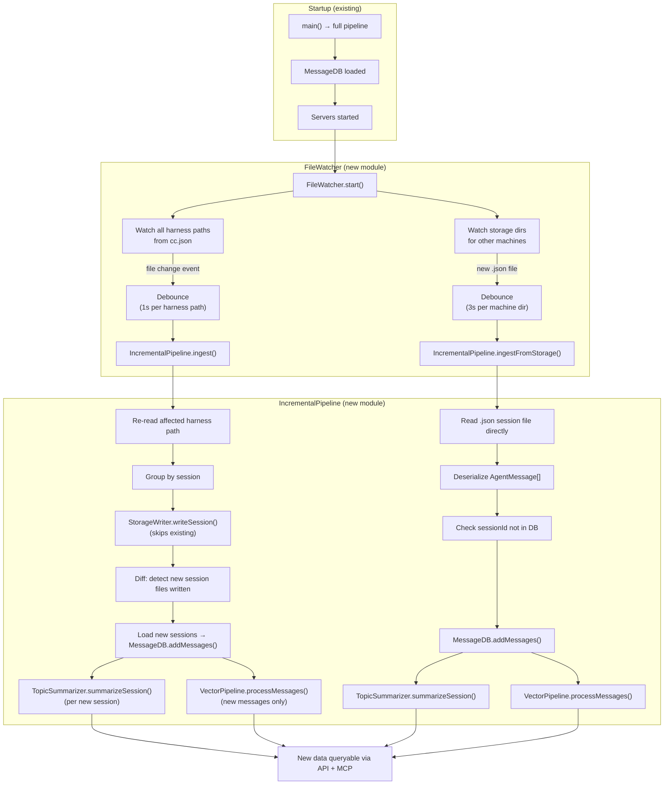

# R2UFS — File System Watcher for Live Harness Ingestion

**Date**: 2026-03-15
**Status**: Planning
**Scope**: Watch harness source paths for changes, re-ingest incrementally, update all downstream systems
**Architecture refs**: [archi-context-core-level0.md](../../architecture/archi-context-core-level0.md), [archi-harness.md](../../architecture/harness/archi-harness.md)

---

## 1. Problem Statement

ContextCore currently runs its full ingestion pipeline **once at startup** — reading all harness sources, writing sessions, loading the DB, embedding vectors, and summarizing topics. Any new conversations created *after* startup are invisible until the process is restarted.

For a tool that monitors active IDE conversations, this is a significant gap. Users working in Claude Code, Cursor, Kiro, or VS Code expect new threads to appear in the query API and MCP server without restarting ContextCore.

---

## 2. Goal

After the initial startup pipeline completes, **continuously watch two kinds of paths**:

### A. Local Harness Paths (from `cc.json`)

When IDE source files are created or modified:

1. Re-read the affected harness path(s)
2. Write new/updated sessions to storage via `StorageWriter`
3. Insert new messages into the live `MessageDB`
4. Run AI topic summarization on new sessions (if enabled)
5. Generate Qdrant embeddings for new messages (if enabled)

### B. Remote Machine Storage Directories

When session files from other machines arrive in storage (via file sync, rsync, OneDrive, etc.):

1. Parse the already-processed `.json` session files directly
2. Insert new messages into the live `MessageDB` (skip if session already loaded)
3. Run AI topic summarization on new sessions (if enabled)
4. Generate Qdrant embeddings for new messages (if enabled)

No harness reading or `StorageWriter` needed — these files are already the storage artifact.

Both paths must happen **incrementally** — no full pipeline re-run.

---

## 3. Current Pipeline Audit — Incremental Readiness

| Component                                | Incremental?                                                                            | Blocker                                                                                   |
| ---------------------------------------- | --------------------------------------------------------------------------------------- | ----------------------------------------------------------------------------------------- |
| **Harness readers** (`readHarnessChats`) | Partial — file-level caching skips unchanged files, but always scans the full path tree | Need to scope scan to changed path only                                                   |
| **StorageWriter** (`writeSession`)       | Yes — idempotent, skips existing files                                                  | None                                                                                      |
| **MessageDB** (`insertMessage`)          | Yes — uses `INSERT OR IGNORE`                                                           | **Private method** — must expose a public `addMessages()`                                 |
| **TopicSummarizer** (`summarizeSession`) | Yes — operates on single sessionId                                                      | None                                                                                      |
| **VectorPipeline** (`processMessages`)   | Partial — skip-indexed logic exists                                                     | Accepts full message array; need a lighter `processNewMessages()` or just pass the subset |
| **Fuse.js search index**                 | No — rebuilt per request from `getAllMessages()`                                        | Not a blocker (already rebuilds each query); incremental benefit is free                  |

---

## 4. Design

### 4.1 Architecture Overview



### 4.2 Watch Targets by Harness

Each harness type has different source formats and watch characteristics:

| Harness            | Watch Path(s)                                | Watch Pattern                    | Event Type                                                   |
| ------------------ | -------------------------------------------- | -------------------------------- | ------------------------------------------------------------ |
| **ClaudeCode**     | Each project dir under `~/.claude/projects/` | `**/*.jsonl`                     | New file = new session; modified file = continued session    |
| **Cursor**         | Single `state.vscdb` file                    | Exact file                       | Any modification = potential new messages across any session |
| **Kiro**           | Each storage hash dir                        | `**/*.chat`                      | New file = new session; modified file = continued session    |
| **VSCode**         | Each workspace storage dir                   | `chatSessions/**/*.{json,jsonl}` | New or modified files                                        |
| **Remote Storage** | `{storage}/{OtherMachine}/` dirs             | `**/*.json`                      | New file = synced session from another machine               |

**Cursor special case**: Since Cursor stores everything in a single SQLite DB, we cannot scope changes to individual sessions. On `state.vscdb` change, re-read the entire Cursor harness (existing caching logic in the reader is **not file-based** for Cursor — it re-reads every run). A longer debounce (3–5s) is appropriate here to batch rapid DB writes.

### 4.3 Debouncing Strategy

File system events fire rapidly during active IDE use (partial writes, temp files, metadata flushes). A naive approach would trigger dozens of re-ingestions per second.

**Design**: Per-path debounce with a trailing-edge timer.

```
Event arrives for path P
  → If timer for P exists, reset it
  → If no timer, start a new one (delay: 1s for file harnesses, 5s for Cursor)
  → When timer fires, run IncrementalPipeline.ingest(harnessName, path)
```

Only one ingest per harness path can run at a time. If a new change arrives while ingest is running, queue it (single-slot — only the latest trigger matters, not every intermediate state).

### 4.4 New/Modified Session Detection

The key question: how do we know which sessions are **new** after a re-read?

**Approach**: Track `StorageWriter.writeSession()` return values.
- Returns a file path → new session was written → needs DB insert + summarization + embedding
- Returns `null` → file already existed → session was already processed → skip

This leverages the existing idempotency of `StorageWriter` as the change detection mechanism. No separate diff tracking needed.

### 4.5 Remote Machine Storage Watching

#### Problem

The existing harness watcher (4.2–4.4) covers **local** IDE conversations — raw source files that need the full ingestion pipeline. But CXC also needs to pick up sessions from **other machines** (e.g., SUSAN2 pushing files to Kyliathy3 via file sync, rsync, OneDrive, etc.).

These remote sessions land in the shared storage directory as already-processed `.json` session files:

```
{storage}/SUSAN2/ClaudeCode/some-project/2026-03/2026-03-15 14-22 verb-subject.json
{storage}/SUSAN2/Cursor/workspace/2026-03/2026-03-16 09-01 verb-subject.json
```

They've already been through the harness reader → StorageWriter pipeline on the originating machine. They just need to be **loaded into the local DB** and run through summarization + embedding.

#### Watch Targets

Watch **all top-level directories** under `{storage}/` that do **not** match the current machine name, excluding special directories:

```
{storage}/
  ├── Kyliathy3/          ← current machine → SKIP (handled by harness watcher)
  ├── Kyliathy3-RAW/      ← raw archive → SKIP
  ├── SUSAN2/             ← remote machine → WATCH ✓
  ├── SUSAN2-RAW/         ← raw archive → SKIP
  ├── zecache/            ← cache dir → SKIP
  ├── zesettings/         ← settings → SKIP
  └── cxc-db.sqlite       ← database file → SKIP
```

**Filter rules** for directories to watch:
1. Must be a directory (not a file)
2. Must not match the current machine name (case-insensitive)
3. Must not end with `-RAW` (case-insensitive)
4. Must not start with `ze` (existing skip convention from `collectJsonFiles`)

Within each watched machine directory, recursively watch for new `.json` files.

#### Shortened Pipeline

Remote storage files skip the entire harness reading + StorageWriter phase. The pipeline is:

```
File sync delivers new .json → FileWatcher detects it
  → Debounce (10s — file sync can deliver multiple files in bursts)
  → IncrementalPipeline.ingestFromStorage(filePaths)
    → For each file:
      1. Parse JSON → AgentMessage.deserialize() each entry
      2. Check sessionId against MessageDB (skip if already loaded)
      3. MessageDB.addMessages(messages)
      4. TopicSummarizer.summarizeSession(sessionId)  (if enabled)
      5. VectorPipeline.processMessages(messages)       (if enabled)
```

No `StorageWriter`, no harness reader, no raw-base archiving — the file **is** the storage artifact.

#### Debouncing & Batching

File sync tools often deliver multiple files in rapid succession. Use a **per-machine-directory debounce** with a 10-second trailing edge (same rationale as Cursor — batch burst arrivals). Accumulate the list of changed/new file paths during the debounce window and pass the full batch to `ingestFromStorage()`.

#### Change Detection

Since `DiskMessageStore.loadFromStorage()` already does session-level deduplication (peeks at first message's `sessionId`, skips if already in DB), the same logic applies here. The `addMessages()` method uses `INSERT OR IGNORE`, so even if a file is re-synced, no duplicates are created.

**Important**: Unlike local harness watching which uses `StorageWriter` return values for new-session detection, remote storage watching uses the `MessageDB` itself as the source of truth — if the sessionId isn't in the DB, it's new.

#### Module Interface

```typescript
// New method on IncrementalPipeline
async ingestFromStorage(filePaths: string[]): Promise<StorageIngestResult>

interface StorageIngestResult {
  source: string              // machine directory name (e.g., "SUSAN2")
  filesScanned: number
  newSessionsLoaded: number
  messagesAdded: number
  topicsSummarized: number
  embeddingsCreated: number
  durationMs: number
}
```

#### Logging

```
[FileWatcher] Remote storage change detected: SUSAN2 (3 files)
[IncrementalPipeline] SUSAN2 storage: scanned 3 files, 2 new sessions → added 47 messages
[IncrementalPipeline] Topics: summarized 2 sessions | Qdrant: embedded 47 messages (141 chunks)
[IncrementalPipeline] Done in 2.1s
```

### 4.6 Module Design

#### `src/watcher/FileWatcher.ts`

Responsibilities:
- Read harness paths from `CCSettings`
- Create `fs.watch()` watchers (Bun's native recursive watcher) for each harness source path
- **Discover and watch remote machine directories** under `{storage}/` (all dirs that aren't the current machine, `-RAW`, or `ze*`)
- Filter events by relevant file extensions (`.jsonl`, `.chat`, `.json`, `.vscdb`)
- Filter remote storage events to `.json` only
- Debounce events per harness path (1s) and per remote machine directory (3s)
- Delegate local changes to `IncrementalPipeline.ingest()`
- Delegate remote storage changes to `IncrementalPipeline.ingestFromStorage()`
- Provide `start()` / `stop()` lifecycle + status logging

```typescript
export class FileWatcher {
  constructor(
    private settings: CCSettings,
    private machineName: string,       // current machine — to exclude from storage watching
    private pipeline: IncrementalPipeline
  )

  start(): void        // Begin watching all configured paths + remote storage dirs
  stop(): void         // Clean up all watchers
  getWatchedPaths(): WatchedPathInfo[]  // Status inspection (includes remote dirs)
}
```

#### `src/watcher/IncrementalPipeline.ts`

Responsibilities:
- Accept a harness name + path, re-read that path via the existing harness reader
- Stamp machine/harness, group by session, write via `StorageWriter`
- Detect new sessions from write results
- Insert new messages into `MessageDB`
- Trigger AI summarization for new sessions
- Trigger vector embedding for new messages
- Log pipeline stats (sessions found, new sessions written, messages added)

```typescript
export class IncrementalPipeline {
  constructor(
    private messageDB: MessageDB,
    private storageWriter: StorageWriter,
    private machineName: string,
    private topicSummarizer: TopicSummarizer | null,
    private vectorPipeline: VectorPipeline | null,
    private topicStore: TopicStore
  )

  async ingest(
    harnessName: string,
    harnessConfig: HarnessConfig,
    rawBase: string
  ): Promise<IngestResult>

  async ingestFromStorage(
    filePaths: string[]
  ): Promise<StorageIngestResult>
}

interface IngestResult {
  harnessName: string
  sessionsScanned: number
  newSessionsWritten: number
  messagesAdded: number
  topicsSummarized: number
  embeddingsCreated: number
  durationMs: number
}

interface StorageIngestResult {
  source: string              // machine directory name (e.g., "SUSAN2")
  filesScanned: number
  newSessionsLoaded: number
  messagesAdded: number
  topicsSummarized: number
  embeddingsCreated: number
  durationMs: number
}
```

### 4.6 MessageDB Changes

Expose a public method to insert messages at runtime:

```typescript
// New public method on MessageDB
addMessages(messages: AgentMessage[]): number  // returns count of newly inserted (not duplicates)
```

This wraps the existing private `insertMessage()` with `INSERT OR IGNORE`, returning the count of rows that were actually inserted (not ignored). Uses `this.db.changes()` after each insert to detect if the row was new.

---

## 5. Integration into ContextCore.ts

After the existing startup pipeline completes (servers started), add:

```typescript
// After startServer() and MCP server setup
const incrementalPipeline = new IncrementalPipeline(
  messageDB, storageWriter, machineName,
  topicSummarizer,    // null if AI summarization disabled
  vectorPipeline,     // null if Qdrant disabled
  topicStore
);

const fileWatcher = new FileWatcher(settings, machineName, incrementalPipeline);
fileWatcher.start();

// Log watch status
const watched = fileWatcher.getWatchedPaths();
const localPaths = watched.filter(p => p.type === 'harness').length;
const remotePaths = watched.filter(p => p.type === 'remote-storage').length;
console.log(`Watching ${localPaths} harness paths + ${remotePaths} remote storage dirs for changes`);
```

The watcher runs in the background. The existing heartbeat interval already keeps the process alive.

---

## 6. Edge Cases & Safeguards

### 6.1 Concurrent Ingestion

Multiple paths can trigger simultaneously (e.g., Claude Code and VS Code both receive new chats). Each harness path gets its own debounce timer, but `IncrementalPipeline.ingest()` calls should be serialized via a mutex/queue to avoid concurrent `MessageDB` writes and `TopicSummarizer` API calls.

**Design**: Single async queue in `FileWatcher` — debounced events push `{ harnessName, path }` items; a loop processes them sequentially.

### 6.2 Large Cursor Re-reads

Cursor re-reads the entire `state.vscdb` on each change. For large databases this could be slow. Mitigations:
- 5s debounce absorbs rapid DB flushes
- Existing bubble parsing is fast (in-memory SQLite read)
- `StorageWriter` skips already-written sessions
- `MessageDB.addMessages()` deduplicates via `INSERT OR IGNORE`

### 6.3 Watcher Failures

`fs.watch()` can silently stop on some platforms (network drives, OS limits). Add a periodic health check (every 60s) that verifies watchers are still active and re-creates any that have died.

### 6.4 Startup Race Condition

The watcher must only start **after** the initial pipeline is complete. Otherwise, file changes during startup could trigger concurrent ingestion with the batch pipeline. This is already handled by the sequential flow in `main()`.

### 6.5 Partial File Sync

File sync tools (OneDrive, rsync, Syncthing) may write files in chunks — the watcher could see a partially-written `.json` file. Mitigations:
- The 3s debounce absorbs most partial writes (sync tools typically finish a single file quickly)
- JSON parsing in `ingestFromStorage()` will fail on truncated files — catch and skip, same as `loadFromStorage()` does today
- The file will be retried on the next change event when the sync completes the write
- Do **not** delete or move files that fail to parse — they may still be in transit

### 6.6 New Remote Machine Appearing

If a new machine directory appears in storage (e.g., a third machine starts syncing), the current watchers won't cover it because `fs.watch()` was only set up for directories that existed at startup. Two options:
- **Simple (recommended)**: Watch the storage root itself for new top-level directories. When one appears that passes the filter rules (not current machine, not `-RAW`, not `ze*`), add a new recursive watcher for it.
- **Alternative**: The periodic health check (6.3) can also scan for new machine directories and add watchers.

### 6.7 Process Shutdown

On `SIGINT`/`SIGTERM`, call `fileWatcher.stop()` to close all watchers before exiting. Prevents orphaned file handles.

---

## 7. Logging

Each incremental ingest should log a concise summary:

```
[FileWatcher] Change detected: ClaudeCode @ ~/.claude/projects/d--Codez-Nexus-AXON/
[IncrementalPipeline] ClaudeCode: scanned 45 sessions, 2 new → wrote 2 files, added 28 messages
[IncrementalPipeline] Topics: summarized 2 sessions | Qdrant: embedded 28 messages (84 chunks)
[IncrementalPipeline] Done in 3.2s
```

Use `chalk` for colored output consistent with existing pipeline logging.

---

## 8. Implementation Tasks

### Group 1 — Foundations & Plumbing

{{SIMPLE}}

- [ ] Create `src/watcher/` directory
- [ ] Add `addMessages(messages: AgentMessage[]): number` public method to `BaseMessageStore` / `DiskMessageStore` — wraps existing `insertMessage()` in a transaction, returns count of newly inserted rows (uses `INSERT OR IGNORE` + `db.changes()`)
- [ ] Add `getSessionIds(): Set<string>` public method to `BaseMessageStore` — returns all distinct sessionIds currently in the DB (needed by `ingestFromStorage` for dedup)
- [ ] Create `src/watcher/types.ts` — define `IngestResult`, `StorageIngestResult`, `WatchedPathInfo` interfaces
- [ ] Write `discoverRemoteMachineDirs(storagePath: string, currentMachine: string): string[]` utility in `src/watcher/watcherUtils.ts` — lists top-level dirs under storage, filters out current machine (case-insensitive), dirs ending with `-RAW`, dirs starting with `ze`, and non-directories

### Group 2 — Core Modules

{{MEDIUM}}

- [ ] Create `src/watcher/IncrementalPipeline.ts` — constructor takes `MessageDB`, `StorageWriter`, `machineName`, `TopicSummarizer | null`, `VectorPipeline | null`, `TopicStore`
- [ ] Implement `IncrementalPipeline.ingest(harnessName, harnessConfig, rawBase)` — re-reads harness path via existing reader, stamps machine/harness, groups by session, writes via `StorageWriter`, detects new sessions from write return values, calls `addMessages()`, triggers summarizer + embedder for new sessions only
- [ ] Implement `IncrementalPipeline.ingestFromStorage(filePaths)` — for each file: parse JSON, deserialize `AgentMessage[]`, check sessionId against DB, skip if known, else `addMessages()` + summarize + embed. Catch and skip malformed/truncated files. Return `StorageIngestResult`
- [ ] Create `src/watcher/FileWatcher.ts` — constructor takes `CCSettings`, `machineName`, `IncrementalPipeline`. Internal async queue (single-slot) to serialize all ingest calls. `start()` / `stop()` / `getWatchedPaths()` lifecycle

{{MEDIUM}}

- [ ] Implement local harness watching in `FileWatcher.start()` — for each harness path in `CCSettings`, create `fs.watch()` (recursive), filter by extension (`.jsonl` for ClaudeCode, `.chat` for Kiro, `.json`/`.jsonl` for VSCode, `.vscdb` for Cursor), debounce 4s per path (10s for Cursor), push to async queue → `pipeline.ingest()`
- [ ] Implement remote storage watching in `FileWatcher.start()` — call `discoverRemoteMachineDirs()`, create recursive `fs.watch()` per machine dir, filter `.json` only, debounce 10s per machine dir accumulating changed file paths, push to async queue → `pipeline.ingestFromStorage()`
- [ ] Implement storage root watching — watch `{storage}/` itself (non-recursive) for new top-level directories. When a new dir appears and passes filter rules, add a recursive watcher for it (same as remote storage setup above)
- [ ] Wire into `ContextCore.ts` — after server startup, instantiate `IncrementalPipeline` and `FileWatcher`, call `fileWatcher.start()`, log watch counts (local + remote)

### Group 3 — Harness-Specific Tuning & Edge Cases

{{SIMPLE}}

- [ ] Cursor-specific debounce: set 10s trailing-edge debounce for `.vscdb` paths in `FileWatcher`
- [ ] Extension filtering map: define a `HARNESS_EXTENSIONS: Record<string, string[]>` constant (`ClaudeCode → [".jsonl"]`, `Kiro → [".chat"]`, `VSCode → [".json", ".jsonl"]`, `Cursor → [".vscdb"]`) and use it in event filtering
- [ ] Add `type: 'harness' | 'remote-storage'` field to `WatchedPathInfo` so `getWatchedPaths()` can distinguish them in logging

### Group 4 — Resilience & Shutdown

{{MEDIUM}}

- [ ] Watcher health check: add a 60s `setInterval` in `FileWatcher` that verifies each watcher is still active, re-creates dead ones, logs warnings
- [ ] Graceful shutdown: in `ContextCore.ts` SIGINT/SIGTERM handler, call `fileWatcher.stop()` before closing servers and DB. `stop()` clears all `fs.watch()` handles, clears the health check interval, drains the async queue
- [ ] Error handling in `IncrementalPipeline`: wrap each ingest call in try/catch so a single harness/file failure doesn't crash the queue. Log errors with `[IncrementalPipeline] ERROR:` prefix. For `ingestFromStorage`, skip truncated/malformed files (do not delete them — they may be mid-sync)
- [ ] Logging: add concise chalk-colored log lines for each ingest cycle — change detection, scan/write/insert counts, summarization + embedding counts, duration. Match existing pipeline logging style

---

## 9. Non-Goals (Out of Scope)

- **Deletions**: We do not handle deleted source files. Sessions already ingested stay in the DB.
- **Config hot-reload**: If `cc.json` changes, a restart is still required. The watcher only monitors harness *source* paths and remote storage dirs.
- **Bi-directional sync**: We only *receive* remote sessions into the local DB. We do not push local sessions to other machines — that's the file sync tool's job.
- **WebSocket push to clients**: The API remains pull-based. Clients poll or re-query after their own writes.
- **Fuse.js index caching**: The search index is already rebuilt per request; this feature doesn't change that.

---

## 10. Testing Strategy

- **Unit (local)**: `IncrementalPipeline.ingest()` with a mock `MessageDB` and mock `StorageWriter` — verify only new sessions trigger downstream calls.
- **Unit (remote)**: `IncrementalPipeline.ingestFromStorage()` with mock `MessageDB` — verify already-loaded sessions are skipped, new sessions get inserted + summarized + embedded.
- **Unit (partial writes)**: Feed `ingestFromStorage()` a truncated JSON file — verify it's skipped without crashing, and a subsequent call with the complete file succeeds.
- **Integration (local)**: Create a temp directory, start the watcher, write a `.jsonl` file, assert that `MessageDB` receives the new messages within the debounce window.
- **Integration (remote)**: Start the watcher, drop a valid session `.json` into a simulated remote machine dir under storage, assert it appears in `MessageDB` within the 3s debounce window.
- **Manual**: Run `bun run dev` (which uses `--watch` for code changes), then create a new Claude Code conversation in a watched project dir. Verify it appears in the MCP server within seconds. Also test by copying a session file from another machine's storage into the local storage dir.
