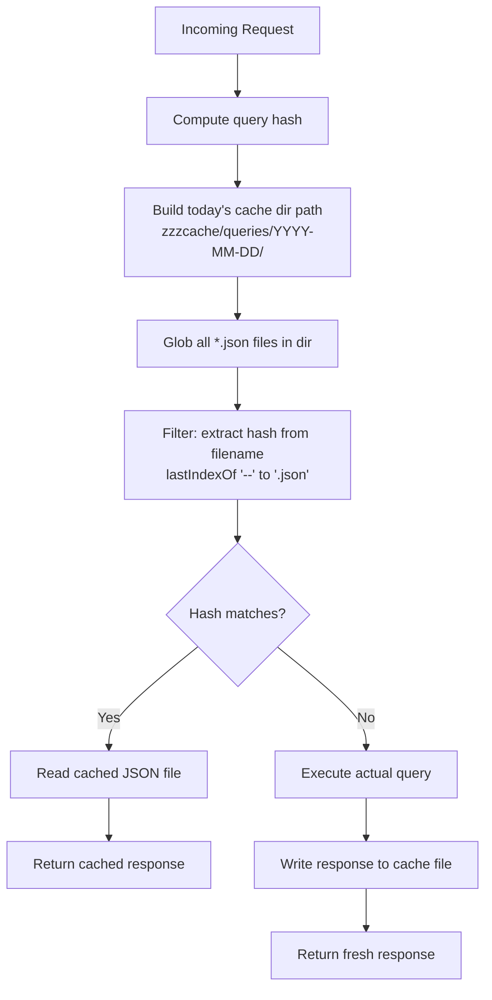

# Response Caching for ContextCore API

**Date**: 2026-03-09
**Status**: Planning
**Scope**: Add file-based response caching for expensive API queries

---

## 1. Problem Statement

The `/api/search` endpoint (and potentially other filtered queries) can return large JSON payloads. Currently, every request rebuilds the Fuse.js index from scratch and performs a full search. For repeated queries within the same day, this is wasteful.

---

## 2. Solution Overview

Implement a **file-based response cache** with daily invalidation:

```
{storage}/zzzcache/queries/
└── YYYY-MM-DD/
    ├── storyteller-query-for-narrative--a1b2c3d4e5f6.json
    ├── fix-auth-bug-in-login--f7e8d9c0b1a2.json
    └── ...
```

---

## 3. Cache Key Design

### 3.1 File Naming Convention

```
{sanitized_prefix}--{hash}.json
```

- **sanitized_prefix**: First 50 path-acceptable characters from the query string
  - Replace non-path-safe chars with `-`
  - Trim leading/trailing dashes
  - Collapse multiple dashes to single dash
- **hash**: SHA-256 hash of the full query (truncated to 12 hex chars)
- **separator**: `--` (double dash) to clearly delimit prefix from hash

### 3.2 Examples

| Query | Filename |
|-------|----------|
| `storyteller` | `storyteller--a1b2c3d4e5f6.json` |
| `fix authentication bug in user login flow` | `fix-authentication-bug-in-user-login-flow--b2c3d4e5f6a7.json` |
| `AgentMessage model changes 2026` | `agentmessage-model-changes-2026--c3d4e5f6a7b8.json` |

---

## 4. Cache Lookup Strategy

### 4.1 On Request



### 4.2 Hash Extraction from Filename

```typescript
function extractHashFromFilename(filename: string): string | null {
  const dashPos = filename.lastIndexOf('--');
  if (dashPos === -1) return null;
  const jsonPos = filename.lastIndexOf('.json');
  if (jsonPos === -1 || jsonPos <= dashPos) return null;
  return filename.slice(dashPos + 2, jsonPos);
}
```

---

## 5. Implementation Tasks

### 5.1 New Module: `src/cache/ResponseCache.ts`

| Function | Description |
|----------|-------------|
| `sanitizeQueryForFilename(query: string): string` | Sanitize query to first 50 path-safe chars |
| `computeQueryHash(query: string): string` | SHA-256 hash, truncated to 12 hex chars |
| `buildCacheFilename(query: string): string` | Combine sanitized prefix + hash |
| `getTodayCacheDir(): string` | Return `{storage}/zzzcache/queries/YYYY-MM-DD/` |
| `findCachedResponse(queryHash: string): string \| null` | Scan today's dir for matching hash |
| `readCachedResponse<T>(filePath: string): T` | Parse and return cached JSON |
| `writeCachedResponse(query: string, response: unknown): void` | Write response to cache file |

### 5.2 Integrate with Express API: `src/server/index.ts`

- [ ] Import `ResponseCache` module
- [ ] Wrap `/api/search` handler with cache check
- [ ] On cache hit: return cached JSON immediately
- [ ] On cache miss: execute query, cache result, return response
- [ ] Add `X-Cache: HIT` or `X-Cache: MISS` header for debugging

### 5.3 Cache Directory Setup

- [ ] Create `zzzcache/queries/` under storage root on startup (if not exists)
- [ ] Today's `YYYY-MM-DD/` subdirectory created lazily on first write

---

## 6. API Changes

### 6.1 New Response Header

```
X-Cache: HIT | MISS
```

### 6.2 Endpoints to Cache

| Endpoint | Cache? | Notes |
|----------|--------|-------|
| `GET /api/search?q=` | ✅ Yes | Primary use case, expensive Fuse.js rebuild |
| `GET /api/messages` | ⚠️ Optional | Filtered queries could benefit |
| `GET /api/sessions` | ❌ No | Fast summary query |
| `GET /api/messages/:id` | ❌ No | Direct lookup, already fast |
| `GET /api/sessions/:sessionId` | ❌ No | Direct lookup, already fast |

---

## 7. Cache Invalidation

### 7.1 Automatic (Daily)

The `YYYY-MM-DD/` directory structure provides automatic daily invalidation:
- Cache lookups only check today's directory
- Yesterday's cache is effectively orphaned
- No explicit cleanup required for MVP

### 7.2 Manual (Future)

For future iterations:
- Add `GET /api/cache/clear` endpoint to purge today's cache
- Add `--no-cache` query param to bypass cache
- Add cleanup job to delete cache dirs older than N days

---

## 8. File Structure After Implementation

```
src/
├── cache/
│   └── ResponseCache.ts      ← NEW
├── server/
│   └── index.ts              ← MODIFIED (add cache middleware)
└── ...

{storage}/
├── {machine}/
├── {machine}-RAW/
└── zzzcache/                  ← NEW
    └── queries/
        └── 2026-03-09/
            ├── storyteller--a1b2c3d4e5f6.json
            └── ...
```

---

## 9. Code Sketch

### 9.1 ResponseCache.ts

```typescript
import { createHash } from 'crypto';
import { existsSync, mkdirSync, readdirSync, readFileSync, writeFileSync } from 'fs';
import { join } from 'path';
import { DateTime } from 'luxon';
import { CCSettings } from '../settings/CCSettings';

const CACHE_SUBDIR = 'zzzcache/queries';
const HASH_LENGTH = 12;
const PREFIX_MAX_LENGTH = 50;

export function sanitizeQueryForFilename(query: string): string {
  return query
    .toLowerCase()
    .replace(/[^a-z0-9]+/g, '-')
    .replace(/^-+|-+$/g, '')
    .replace(/-{2,}/g, '-')
    .slice(0, PREFIX_MAX_LENGTH);
}

export function computeQueryHash(query: string): string {
  return createHash('sha256')
    .update(query.toLowerCase()) // case-insensitive hashing
    .digest('hex')
    .slice(0, HASH_LENGTH);
}

export function getTodayCacheDir(): string {
  const settings = CCSettings.getInstance();
  const today = DateTime.now().toFormat('yyyy-MM-dd');
  return join(settings.storagePath, CACHE_SUBDIR, today);
}

export function findCachedResponse(queryHash: string): string | null {
  const cacheDir = getTodayCacheDir();
  if (!existsSync(cacheDir)) return null;

  const files = readdirSync(cacheDir);
  for (const file of files) {
    const dashPos = file.lastIndexOf('--');
    const jsonPos = file.lastIndexOf('.json');
    if (dashPos !== -1 && jsonPos > dashPos) {
      const fileHash = file.slice(dashPos + 2, jsonPos);
      if (fileHash === queryHash) {
        return join(cacheDir, file);
      }
    }
  }
  return null;
}

export function readCachedResponse<T>(filePath: string): T {
  const content = readFileSync(filePath, 'utf-8');
  return JSON.parse(content) as T;
}

export function writeCachedResponse(query: string, response: unknown): void {
  const cacheDir = getTodayCacheDir();
  if (!existsSync(cacheDir)) {
    mkdirSync(cacheDir, { recursive: true });
  }

  const prefix = sanitizeQueryForFilename(query);
  const hash = computeQueryHash(query);
  const filename = `${prefix}--${hash}.json`;
  const filePath = join(cacheDir, filename);

  writeFileSync(filePath, JSON.stringify(response, null, 2));
}

// Convenience wrapper for endpoint handlers
export function withCache<T>(
  query: string,
  compute: () => T
): { data: T; cached: boolean } {
  const hash = computeQueryHash(query);
  const cachedPath = findCachedResponse(hash);

  if (cachedPath) {
    return { data: readCachedResponse<T>(cachedPath), cached: true };
  }

  const data = compute();
  writeCachedResponse(query, data);
  return { data, cached: false };
}
```

### 9.2 Server Integration (search endpoint)

```typescript
// In src/server/index.ts

import { withCache } from '../cache/ResponseCache';

app.get('/api/search', (req, res) => {
  const q = req.query.q as string;
  if (!q) {
    return res.status(400).json({ error: 'Missing query parameter q' });
  }

  const { data, cached } = withCache(q, () => {
    const allMessages = messageDB.getAllMessages();
    const fuse = new Fuse(allMessages, fuseOptions);
    return fuse.search(q).map(r => r.item);
  });

  res.setHeader('X-Cache', cached ? 'HIT' : 'MISS');
  res.json(data);
});
```

---

## 10. Testing Checklist

- [ ] First search for "storyteller" → MISS, file created
- [ ] Second search for "storyteller" → HIT, same response
- [ ] Search for "STORYTELLER" (case) → HIT (case-insensitive hashing)
- [ ] Search next day → MISS (new directory)
- [ ] Verify `X-Cache` header present in response
- [ ] Verify cache file contains valid JSON
- [ ] Verify filename is path-safe (no invalid chars)

---

## 11. Future Enhancements

1. **Cache filtered `/api/messages` queries** — build cache key from all query params
2. **Cache cleanup job** — delete directories older than 7 days
3. **Cache bypass** — `?nocache=1` query param
4. **Cache stats endpoint** — `GET /api/cache/stats` returns hit rate, size, etc.
5. **Memory cache layer** — LRU cache in front of file cache for hot queries

---

## 12. Implementation Order

1. Create `src/cache/ResponseCache.ts` with core functions
2. Add cache directory creation to startup in `ContextCore.ts`
3. Integrate `withCache` wrapper in `/api/search` handler
4. Test manually with curl/Insomnia
5. Add `X-Cache` header
6. Document in API surface (update archi doc)
