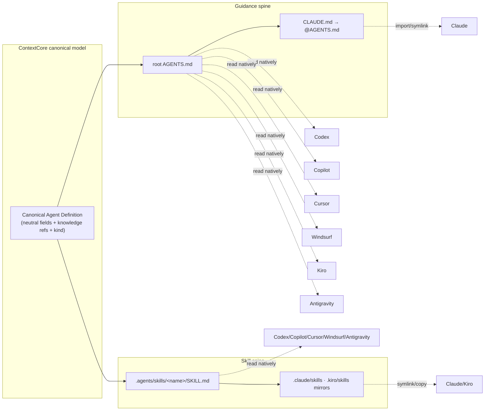
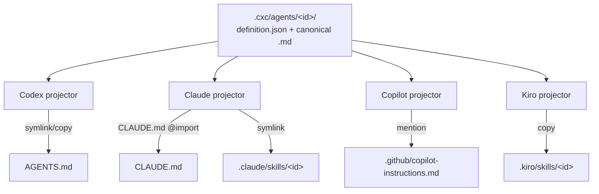
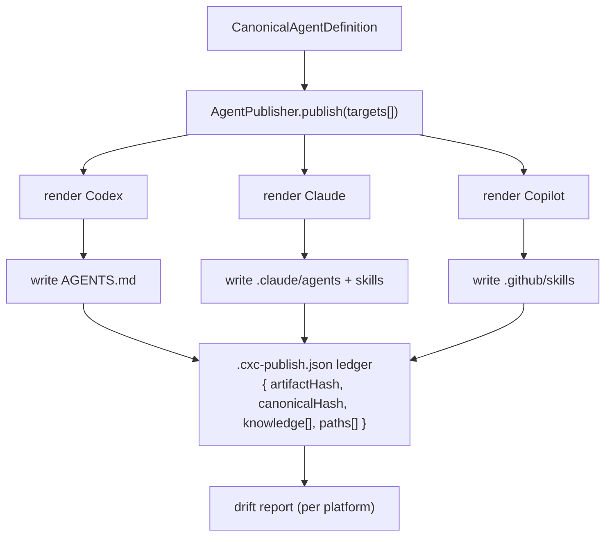
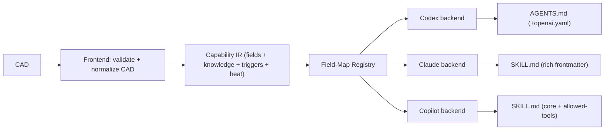
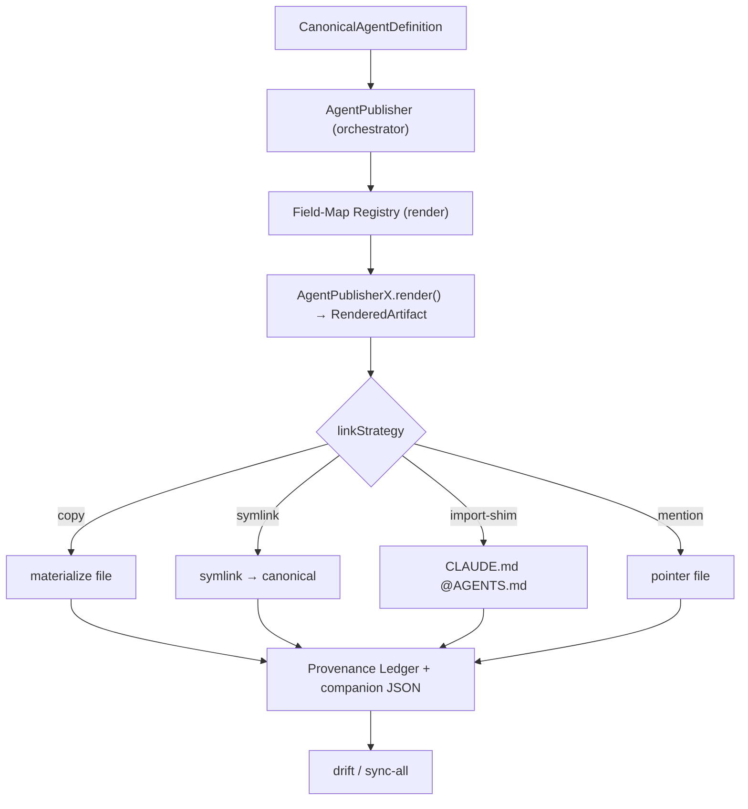
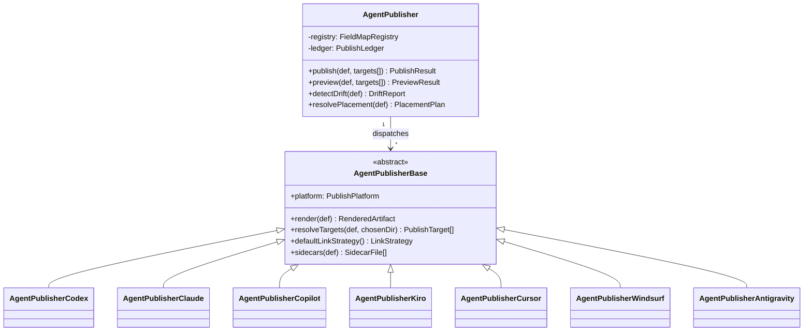
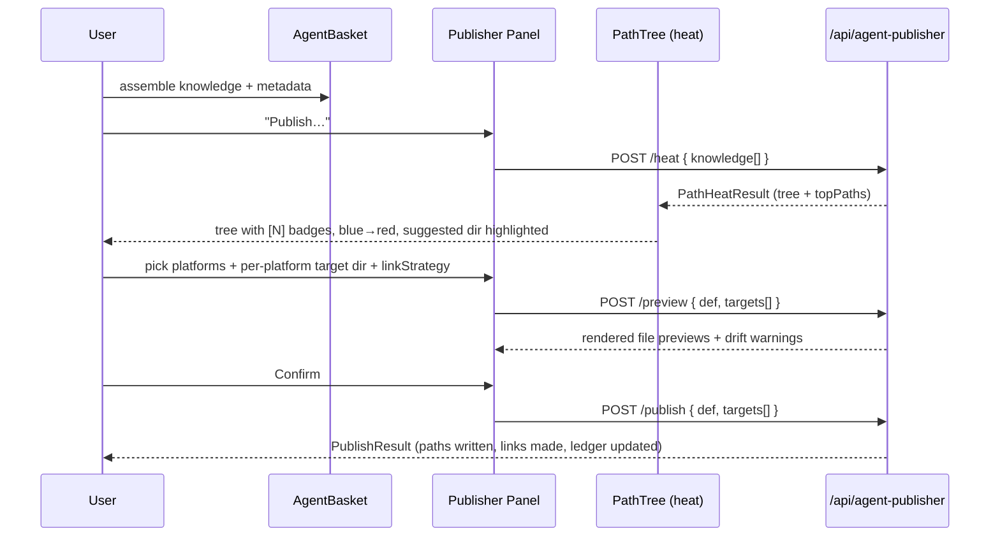

# r2ab2 — Agent Builder Phase 2: The Agent Publisher

**Date**: 2026-06-05
**Scope**: Design the `AgentPublisher` subsystem that takes a platform-neutral agent/skill definition assembled by `AgentBuilder` and emits *best-fit* artifacts for every major agentic harness (Codex, Claude, Copilot, Kiro, Cursor, Windsurf/Devin, Antigravity), with a path-aware publishing UI and a "hottest paths" placement assistant.
**Status**: Design / RFC — 3 alternatives, deep-dives, and a recommended hybrid.
**Predecessors**: [`archi-agent-builder.md`](../../architecture/agents/archi-agent-builder.md), [`archi-context-core-level0.md`](../../architecture/archi-context-core-level0.md)
**Research inputs**: [`skills-agents-standards-2026-codex-claude-copilot.md`](./skills-agents-standards-2026-codex-claude-copilot.md), [`skills-agents-standards-2026-windsurf-antigravity.md`](./skills-agents-standards-2026-windsurf-antigravity.md)

---

## 1. Problem statement

Every agentic harness invented its own dialect for two artifact families:

- **Persistent guidance** — `AGENTS.md` (Codex, Copilot, Cursor, Windsurf, Kiro, Antigravity) vs `CLAUDE.md` (Claude) vs `GEMINI.md` (Antigravity legacy).
- **Procedural skills** — folder-per-skill `SKILL.md` with a *mostly* shared frontmatter core, but each vendor adds, drops, or relocates fields and discovery roots.

`AgentBuilder` today (`server/src/agentBuilder/AgentBuilder.ts`) already assembles a neutral component set — `projectName`, `agentName`, `description`, `argument-hint`, `tools[]`, `agentKnowledge[]` — and can materialize **three** platforms (`github` → `.agent.md`, `claude` → `.claude/agents/*.md`, `codex` → `AGENTS.md` collections). That generation logic is hard-wired inside `create()` and only covers placement that the config (`agentPath` / `claudeAgentPath` / `codexAgentPaths`) predeclares.

We want to evolve this into a clean separation:

> **AgentBuilder = assemble the bits of context.**
> **AgentPublisher = decide, per platform, *what file to write*, *where to write it*, and *how to link it* so one set of context benefits every harness.**

The publisher must be **aware of where the context bits come from** (the indexed `dataSources`), **aware of the project's file structure** (so it can offer a path browser), and able to **place files via a UI directory picker** — choosing target dirs for platforms that need `AGENTS.md`, choosing a common location for Copilot-style instruction files, and creating **symlinks / imports / mentions** so a Claude agent can reuse what we wrote for Copilot, and vice-versa.

The concrete deliverable the rest of this doc converges on:

```
AgentPublisher                      //<orchestrator + canonical model>
├── AgentPublisherCodex             //<AGENTS.md collections, AGENTS.override.md, byte cap>
├── AgentPublisherClaude            //<.claude/agents + .claude/skills, CLAUDE.md @import shim>
├── AgentPublisherCopilot           //<AGENTS.md + .github/instructions + .github/skills>
├── AgentPublisherKiro              //<AGENTS.md compat + .kiro/steering + .kiro/skills>
├── AgentPublisherCursor            //<AGENTS.md hierarchical + .cursor/skills + paths frontmatter>
├── AgentPublisherWindsurf          //<AGENTS.md rules-engine + .windsurf/skills>
└── AgentPublisherAntigravity       //<AGENTS.md + GEMINI.md mirror + .agents/skills>
```

---

## 2. What we already have (grounding)

These existing facts constrain and enable the design — the publisher is an *extraction and generalization* of code that already works, not a greenfield rewrite.

| Existing asset | Location | Reused as |
| --- | --- | --- |
| `CreateAgentInput` (neutral component set) | `AgentBuilder.ts` L40-55 | Seed for the Canonical Agent Definition |
| Per-platform file writers (`buildClaudeAgentContent`, GitHub inline build, Codex collection build) | `AgentBuilder.ts` | Migrate into `AgentPublisherX.render()` |
| Codex collection v2 (`AGENTS.md` multi-entry + `AGENTS.json`) | `AgentBuilder.ts` L362-495 | `AgentPublisherCodex` |
| `contentDiverged` + `platforms[]` consolidation | `list()` L1355-1505 | Provenance / drift detection |
| `resolveCodexAgentPaths()` precedence resolver | L786-859 | Generalize to per-platform path resolvers |
| Companion JSON round-trip (`fromJson`) | `getAgent()` L1507-1642 | Canonical store format |
| In-memory index + path-traversal guard | `index()`, `getFileContent()` | Feeds the path browser + heat analyzer |
| `DataSourceEntry` (`path`, `agentPath`, `claudeAgentPath`, `codexAgentPath(s)`) | `types.ts` L42-55 | Extend with publisher roots + project root |
| Routes `/api/agent-builder/*` | `agentBuilderRoutes.ts` | Add sibling `/api/agent-publisher/*` |

**Key takeaway**: `AgentBuilder.create()` already proves that "one neutral input → N platform-specific files + companion JSON + drift detection" works. The publisher formalizes that into a model + adapter hierarchy and adds **user-chosen placement** and **interop linking**.

---

## 3. The standards landscape, distilled

The seven harnesses collapse into **two artifact families** plus a small set of per-vendor quirks. This table is the crux of the whole design — everything downstream is an attempt to honor it without forcing the user to learn it.

### 3.1 Guidance family (`AGENTS.md` and cousins)

| Vendor | Native guidance file | Reads root `AGENTS.md`? | Discovery / merge rule | CXC interop move |
| --- | --- | --- | --- | --- |
| **Codex** | `AGENTS.md` | Yes (first-class) | Global → project-root → CWD walk; `AGENTS.override.md` masks; concat root→leaf; byte cap | Write canonical `AGENTS.md`; offer `AGENTS.override.md` for local pins |
| **Copilot** | `AGENTS.md` | Yes | Nearest `AGENTS.md` wins; coexists with `.github/copilot-instructions.md` + `.github/instructions/*.instructions.md`; personal > repo > org | Write canonical `AGENTS.md`; optional `.github/copilot-instructions.md` *mention* |
| **Cursor** | `AGENTS.md` | Yes | **Hierarchical merge** (ancestor + descendant combined; specific wins); nested = implicit subtree glob | Write canonical `AGENTS.md`; thin root + nested leaves |
| **Windsurf/Devin** | `AGENTS.md` | Yes | Compiled into rules engine; root = always-on, subdir = `<dir>/**` glob | Write canonical `AGENTS.md`; placement = scope |
| **Kiro** | `AGENTS.md` (compat over steering) | Yes (always-included, no inclusion modes) | Root or `~/.kiro/steering`; richer behavior lives in `.kiro/steering/*.md` | Write canonical `AGENTS.md`; optional steering mirror |
| **Antigravity** | `AGENTS.md` + legacy `GEMINI.md` | Yes | Workspace + active dir; nested merge under-documented | Write canonical `AGENTS.md`; optional `GEMINI.md` mirror |
| **Claude** | `CLAUDE.md` (does **not** read `AGENTS.md` natively) | **No** — needs shim | Walks up for `CLAUDE.md`/`CLAUDE.local.md`; supports `@path` import (≤4 hops) | Write `CLAUDE.md` containing `@AGENTS.md`, or symlink |

**Spine insight**: A single canonical root **`AGENTS.md`** satisfies six of seven harnesses directly. Claude is the only outlier, and it is solved deterministically by a one-line `CLAUDE.md` shim (`@AGENTS.md`) or a symlink. That is the "one size that fits all" anchor for guidance.

### 3.2 Skill family (`SKILL.md`)

| Vendor | Skill discovery roots | Required fields | Notable extensions | Cross-vendor common root |
| --- | --- | --- | --- | --- |
| Open spec | (n/a) | `name`, `description` | `license`, `compatibility`, `metadata`, exp. `allowed-tools` | — |
| **Codex** | `.agents/skills` (+ user/admin/system) | `name`, `description` | `agents/openai.yaml` sidecar | `.agents/skills` |
| **Claude** | `.claude/skills` (+ personal/enterprise/plugin) | none strictly (desc recommended) | huge frontmatter: `when_to_use`, `argument-hint`, `context: fork`, `hooks`, `paths`, … | scans `.agents/skills` too |
| **Copilot** | `.github/skills`, `.claude/skills`, `.agents/skills` | `name`, `description` | `allowed-tools` | `.agents/skills` |
| **Kiro** | `.kiro/skills`, `~/.kiro/skills` | `name`, `description` | `skill://` resource refs for custom agents | (kiro-specific) |
| **Cursor** | `.agents/skills`, `.cursor/skills` (+ `~`), scans `.claude/.codex` | `name`, `description` | `paths`, `disable-model-invocation`, legacy `globs` | `.agents/skills` |
| **Windsurf** | `.windsurf/skills`, `~/.codeium/windsurf/skills`, `.agents/skills` | `name`, `description` | (portable core only) | `.agents/skills` |
| **Antigravity** | `.agents/skills` (pref), `.agent/skills` (legacy), `~/.gemini/...` | `description` (`name` optional → folder) | beware non-portable `.agents/agents.md` orchestration pattern | `.agents/skills` |

**Spine insight**: **`.agents/skills/<name>/SKILL.md`** is the widest-read skill root — Codex, Copilot, Cursor, Windsurf, and Antigravity all discover it; Kiro and Claude need a mirror/symlink into `.kiro/skills` / `.claude/skills`. Keep the canonical `SKILL.md` confined to the open core (`name`, `description`, optional `license`/`compatibility`/`metadata`) and push vendor extras to sidecars.

### 3.3 The impedance to absorb



---

## 4. Design goals & principles

1. **Single source of truth, many faces.** The user edits one canonical definition; the publisher projects faces. Drift is detected and surfaced, never silent.
2. **Placement is a first-class decision.** Where an `AGENTS.md` or skill folder lands changes its scope (nearest-wins / glob / always-on). The UI must make placement easy and *informed*.
3. **Lowest-common-denominator core, sidecar extensions.** Canonical `SKILL.md`/`AGENTS.md` stay portable; vendor-only fields go to sidecars (`agents/openai.yaml`) or native config — never poison the shared file.
4. **Linking over duplication when safe.** Prefer symlink / `@import` / mention so one file serves many harnesses; fall back to copy when links are unreliable (Windows, git).
5. **Don't forbid targeting a harness.** Keep the explicit per-platform path, but *add* richer publish options on top.
6. **Reuse the proven machinery.** Codex collection round-trip, companion JSON, divergence detection, path-traversal guard — all carry forward.

---

## 5. The Canonical Agent Definition (CAD)

The neutral intermediate representation every alternative shares. It is `CreateAgentInput` promoted to a first-class, kind-aware model.

```ts
//<the platform-neutral source of truth; one CAD → many platform faces>
interface CanonicalAgentDefinition
{
	//<stable slug identity, reused as Codex entry id and skill folder name>
	id: string;
	//<"agent" → guidance (AGENTS.md/CLAUDE.md); "skill" → procedural SKILL.md folder>
	kind: "agent" | "skill";
	name: string;
	description: string;
	//<maps to Claude when_to_use; folded into description for vendors without the field>
	whenToUse?: string;
	"argument-hint"?: string;
	//<neutral tool names; each adapter maps/filters to its own vocabulary>
	tools?: string[];
	//<the assembled context bits; file refs carry provenance back to a dataSource>
	knowledge: KnowledgeRef[];
	//<open-spec portable extras (safe on every SKILL.md)>
	license?: string;
	compatibility?: string;
	metadata?: Record<string, string>;
	//<which dataSource project this CAD belongs to (placement + path resolution)>
	projectName: string;
}

//<a single knowledge component; either an indexed file or free text>
interface KnowledgeRef
{
	kind: "file" | "text";
	//<for files: the stored reference (often repo-relative); for text: the literal body>
	value: string;
	//<provenance: which dataSource produced this file, enabling root-relative rewrites>
	sourceName?: string;
	//<resolved at publish time for reading + hot-path analysis>
	resolvedAbsPath?: string;
}
```

`CanonicalAgentDefinition` is persisted as the companion JSON (today's `.agent.json` / `AGENTS.json`), so existing round-trip code generalizes cleanly. `kind: "skill"` is the new axis that unlocks `SKILL.md` output across vendors.

---

## 6. Three architectural alternatives

All three produce the `AgentPublisher` + subclass hierarchy the user asked for. They differ in **how the single-source-of-truth promise is kept** and **how much machinery sits between the CAD and the disk**.

### Alternative A — Canonical Source + Projection Adapters (hub & spoke, link-first)

**Concept.** Write the canonical artifact once into a CXC-owned **hub** (e.g. `<projectRoot>/.cxc/agents/<id>/`), holding `definition.json` + the rendered canonical `AGENTS.md` or `SKILL.md`. Each `AgentPublisherX` then **projects** the hub artifact into the platform's native location, *preferring a link* (symlink / `@import` shim / mention) over a copy. The hub is the only writable source; native locations are views.



**Adapter shape.**

```ts
abstract class AgentPublisherBase
{
	//<render canonical content for this platform from the hub definition>
	abstract render(def: CanonicalAgentDefinition): RenderedArtifact;
	//<where this platform discovers the artifact, given a user-chosen base dir>
	abstract resolveTarget(def: CanonicalAgentDefinition, chosenDir: string): PublishTarget;
	//<how to connect target → hub (symlink|import|mention|copy), with a safe default>
	abstract defaultLinkStrategy(): LinkStrategy;
}
```

**Pros**
- True single source of truth: edit the hub, every linked face updates with zero re-publish.
- Smallest drift surface — links can't diverge.
- Maps perfectly to Claude's `@AGENTS.md` import (a *native* link form).

**Cons**
- **Windows + git symlink fragility** is real (needs Developer Mode / `core.symlinks=true`); many users will silently fall back to copy, eroding the core promise.
- A `.cxc/` hub inside the user's repo is intrusive and may confuse the harnesses themselves (they might index it).
- Mentions are lossy: Copilot reading "see AGENTS.md" is weaker than reading the content.

---

### Alternative B — Per-Platform Materialization + Provenance Ledger (fan-out, ledger-tracked)

**Concept.** No hub. Each platform gets a **fully materialized, best-fit file** written directly into its native location (exactly what `AgentBuilder.create()` does today, generalized to all seven). A **provenance ledger** records every materialized artifact: its canonical hash, the CAD it came from, the knowledge components and resolved paths used. The ledger powers drift detection ("the `.claude` copy diverged from canonical"), bulk re-publish ("sync all platforms"), and clean deletes.



**Ledger entry.**

```ts
//<one row per materialized artifact; lives in storage, not the user's repo>
interface PublishLedgerEntry
{
	canonicalId: string;
	platform: PublishPlatform;
	absolutePath: string;
	//<hash of the CAD at publish time; compare to current CAD to detect "needs republish">
	canonicalHash: string;
	//<hash of the file on disk at publish time; compare to current file to detect "edited externally">
	artifactHash: string;
	knowledge: string[];
	//<resolved paths mentioned by the knowledge (snapshot for the heat view)>
	referencedPaths: string[];
	publishedAt: string;
	linkStrategy: LinkStrategy;
}
```

**Pros**
- Robust everywhere: no symlink dependency, git-friendly, harnesses read real content.
- Generalizes the *already shipped* `contentDiverged`/`platforms[]` logic into a durable ledger.
- Drift is explicit and actionable; "publish to all" is a first-class verb.

**Cons**
- Duplication: N copies of the same content on disk.
- Edits require an explicit re-publish (mitigated by drift alerts + one-click sync).
- Ledger must stay consistent with reality (handled by re-scan on `list`, like today's `refreshAgentEntriesFromDisk`).

---

### Alternative C — Capability Compiler (IR + field-map registry + backends, most ambitious)

**Concept.** Treat agents/skills as a **capability graph** compiled by per-platform backends, like a compiler with one frontend (the CAD) and many backends. The novel piece is a declarative **field-mapping registry**: for every canonical field, the registry states how each platform expresses it. Adding a new harness becomes "write a backend + fill a column" rather than "edit seven `if` branches".

```ts
//<declarative: canonical field → per-platform expression strategy>
const FIELD_MAP: FieldMapRegistry = {
	whenToUse: {
		claude:      { mode: "frontmatter", key: "when_to_use" },
		cursor:      { mode: "foldInto", target: "description" },
		copilot:     { mode: "foldInto", target: "description" },
		codex:       { mode: "foldInto", target: "description" },
		//<…one row per canonical field, columns per platform…>
	},
	paths: {
		cursor:      { mode: "frontmatter", key: "paths" },
		windsurf:    { mode: "placement", note: "directory location becomes the glob" },
		claude:      { mode: "frontmatter", key: "paths" },
		default:     { mode: "drop" },
	},
	tools: {
		claude:      { mode: "frontmatter", key: "allowed-tools" },
		copilot:     { mode: "frontmatter", key: "allowed-tools" },
		codex:       { mode: "sidecar", file: "agents/openai.yaml" },
		default:     { mode: "frontmatter", key: "tools" },
	},
};
```

A backend is then a thin interpreter of the registry plus platform file conventions (filename, fence style, sidecars, link form).



**Pros**
- Most future-proof: vendor extension drift is data, not code; new platforms are cheap.
- Cleanly separates *what a field means* from *how a platform writes it*.
- The hot-path analyzer slots in as a compiler pass that annotates placement.

**Cons**
- Heaviest to build and test; risk of over-engineering for a finite (~7) platform set.
- The registry abstraction can obscure simple platform-specific quirks that are easier read as code.
- Slower first delivery.

---

## 7. Recommendation — a pragmatic hybrid (B backbone · C field-map · A opt-in linking)

Ship **Alternative B as the backbone** (materialization + provenance ledger): it is robust, git-friendly, and a direct generalization of code that already works. Borrow **Alternative C's field-mapping registry** for the *render* step so the seven `AgentPublisherX` classes stay thin and adding a platform is data-driven. Offer **Alternative A's linking** as an opt-in per-target `linkStrategy` (`symlink` / `import-shim` / `mention` / `copy`) — defaulting to `copy` on Windows/git-unsafe contexts and to `import-shim` for Claude guidance (the one place a native link is reliable).



This gives the single-source-of-truth *feel* (one CAD, one-click sync, drift alerts) without betting the core experience on symlinks.

---

## 8. AgentPublisher class hierarchy (the concrete outcome)



**Per-subclass responsibilities** (what each one knows that the others don't):

| Subclass | Guidance output | Skill output | Sidecars / shims | Placement nuance |
| --- | --- | --- | --- | --- |
| `AgentPublisherCodex` | `AGENTS.md` (collection v2, reuse existing) + optional `AGENTS.override.md` | `.agents/skills/<id>/SKILL.md` | `agents/openai.yaml` for tools/invocation policy | root→CWD walk → place at scope root; respect byte cap |
| `AgentPublisherClaude` | `CLAUDE.md` shim `@AGENTS.md` (or symlink) | `.claude/skills/<id>/SKILL.md` (rich frontmatter via field-map) | `.claude/agents/<name>.md` for sub-agents | does **not** read `AGENTS.md` — shim mandatory |
| `AgentPublisherCopilot` | canonical `AGENTS.md` + optional `.github/copilot-instructions.md` mention | `.github/skills/<id>/SKILL.md` | `allowed-tools` frontmatter | nearest-wins; `.github/` placement |
| `AgentPublisherKiro` | `AGENTS.md` (always-on) + optional `.kiro/steering/*.md` mirror | `.kiro/skills/<id>/SKILL.md` | steering inclusion modes if user opts in | no nested AGENTS; steering for conditional |
| `AgentPublisherCursor` | `AGENTS.md` (thin root + nested leaves) | `.agents/skills` or `.cursor/skills/<id>/SKILL.md` | `paths` + `disable-model-invocation` frontmatter | hierarchical merge; multi-root root bug warning |
| `AgentPublisherWindsurf` | `AGENTS.md` (placement = rule scope) | `.windsurf/skills/<id>/SKILL.md` | — (portable core) | root = always-on, subdir = glob |
| `AgentPublisherAntigravity` | `AGENTS.md` + optional `GEMINI.md` mirror | `.agents/skills/<id>/SKILL.md` | — | avoid the non-portable `.agents/agents.md` orchestration pattern |

**Shared rendering pipeline** (in `AgentPublisherBase`, driven by the field-map): frontmatter assembly → knowledge body (reuse `formatGithubKnowledgeEntry` / `formatClaudeKnowledgeEntry`, generalized) → sidecar emission → link/materialize → ledger write. Codex keeps its bespoke collection round-trip; everything else flows through the generic path.

---

## 9. The Path Heat Analyzer (hottest-paths placement assistant)

> The standout idea: read every `.md` knowledge file going into an agent, harvest **every path it mentions**, aggregate those mentions across all the agent's knowledge, and turn the result into a **heat-mapped directory tree** that tells the user *where the agent's center of gravity is* — i.e. the best place to drop an `AGENTS.md` / skill folder so guidance lands nearest the work (which is exactly how nearest-wins / glob / hierarchical-merge discovery rewards placement).

### 9.1 Why this is the right signal

`AGENTS.md` scope is **placement-derived** on almost every harness (nearest-wins, `<dir>/**` glob, hierarchical merge, always-on-at-root). A knowledge pack of architecture docs implicitly points at the subsystems it documents. The densest cluster of referenced paths is therefore the natural anchor: place the agent file at (or just above) that cluster and you maximize relevant scope while minimizing leakage into unrelated subtrees.

### 9.2 Extraction pipeline

```mermaid
flowchart TD
    K["Agent knowledge[] (resolved .md abs paths)"] --> R["read each file (path-traversal guarded)"]
    R --> X["extract path mentions"]
    X --> X1["markdown links [text](path) — reuse parseKnowledgeLinks"]
    X --> X2["inline code `src/foo/bar.ts`"]
    X --> X3["bare path tokens (regex, repo-relative or absolute)"]
    X1 & X2 & X3 --> N["normalize + resolve vs file dir AND dataSource roots"]
    N --> F["filter: keep paths inside a known project root; drop URLs/externals"]
    F --> AGG["aggregate: for each resolved path, increment it + every ancestor dir"]
    AGG --> TREE["DirHeatNode tree (directHits, subtreeHits, heat 0..1)"]
    AGG --> TOP["topPaths[] — top 10 by mention count"]
```



### 9.3 Data shapes

```ts
//<a node in the heat-mapped directory tree served to the path browser>
interface DirHeatNode
{
	name: string;
	absolutePath: string;
	//<distinct mentioned paths that resolve directly to this dir/file>
	directHits: number;
	//<distinct mentioned paths resolving anywhere inside this subtree (drives the [N] badge)>
	subtreeHits: number;
	//<normalized 0..1 across the tree (log-scaled), drives the blue→red color>
	heat: number;
	children?: DirHeatNode[];
}

//<response for the heat endpoint>
interface PathHeatResult
{
	//<top 10 hottest individual paths across the whole knowledge set>
	topPaths: Array<{ path: string; hits: number; heat: number }>;
	//<the directory tree, rooted at the dataSource project root(s)>
	tree: DirHeatNode[];
	//<so the UI legend matches the server's normalization>
	scale: { min: number; max: number; mode: "linear" | "log" };
}
```

### 9.4 Counting rule (the `[N]` badge)

- Resolve each mention to one absolute path; **de-duplicate** per knowledge set (a path mentioned 5× in one doc counts once for that doc, but mentions across *different* knowledge files accumulate — configurable: `distinctPerFile` vs `raw`).
- For every resolved path, increment its own counter **and** walk ancestors up to the project root, incrementing each ancestor's `subtreeHits`. A directory's badge `[N]` = `subtreeHits`.
- `heat = normalize(subtreeHits)` with a **log scale** (path references are heavy-tailed; linear would paint one hot folder red and everything else blue).

### 9.5 Color mapping (cold → hot)

`heat ∈ [0,1]` maps blue `#3b82f6` (cold) → cyan → green → amber → red `#ef4444` (hot). The server returns `heat` + `scale`; the UI owns the gradient so the legend and badges stay in sync. Directories with `subtreeHits === 0` render with no badge and neutral color, so the eye is drawn only to where context concentrates.

### 9.6 Placement suggestion

From the tree, the analyzer proposes a **`PlacementPlan`**: the shallowest directory whose `subtreeHits` covers ≥ X% (default 70%) of total mentions — the tightest folder that still "contains" the agent's concern. The publisher pre-selects this directory in the path browser per platform, but the user always overrides via the picker.

---

## 10. UI — Agent Publisher panel + heat-mapped path browser

The Publisher is a **new view** alongside Agent Builder / Agent List (`useViews.ts`), opened from the basket after assembly (or from an Agent List card via "Publish…").



**Panel anatomy**
- **Platform multiselect** with smart defaults (pre-check platforms already present per ledger). Each platform row shows: target directory (from path browser), `linkStrategy` dropdown, and a live "will write: `<file>`" hint.
- **Path browser** (the heat tree): collapsible directory tree per `dataSource` project root. Each dir shows its name, a `[N]` badge when `subtreeHits > 0`, and a left color bar from blue→red. The suggested placement dir is highlighted and scrolled into view. Hovering a dir lists which knowledge files contribute mentions.
- **Top-10 panel**: the `topPaths` list as clickable chips; clicking jumps the tree to that path's nearest directory.
- **Preview drawer**: side-by-side rendered artifacts (the exact `AGENTS.md` / `SKILL.md` / sidecars) before write, with a diff vs any existing file (drift).
- **Interop toggles**: "Create Claude `CLAUDE.md` shim", "Mirror to `.kiro/skills`", "Add `.github/copilot-instructions.md` mention" — each a checkbox that adds a link/mention target.

---

## 11. API surface

Sibling namespace to `/api/agent-builder/*`, registered the same way (`agentBuilderRoutes.ts` pattern, guarded by `ctx.agentBuilder`/`ctx.agentPublisher`).

| Endpoint | Method | Purpose | Body / Query | Response |
| --- | --- | --- | --- | --- |
| `/api/agent-publisher/heat` | POST | Hot-path analysis for a knowledge set | `{ knowledge: string[], projectName? }` | `PathHeatResult` |
| `/api/agent-publisher/tree` | GET | Raw project file tree for a source (no heat) | `?projectName=` | `DirHeatNode[]` (hits = 0) |
| `/api/agent-publisher/preview` | POST | Render artifacts without writing | `{ definition, targets[] }` | `{ previews: RenderedArtifact[], drift: DriftReport }` |
| `/api/agent-publisher/publish` | POST | Materialize + link + ledger write | `{ definition, targets[] }` | `PublishResult` |
| `/api/agent-publisher/drift` | GET | Compare ledger vs disk vs canonical | `?canonicalId=` | `DriftReport` |
| `/api/agent-publisher/platforms` | GET | Capability matrix (drives UI defaults) | — | per-platform fields + roots + link support |

```ts
//<one chosen output for one platform>
interface PublishTarget
{
	platform: PublishPlatform;          //<"codex" | "claude" | "copilot" | "kiro" | "cursor" | "windsurf" | "antigravity">
	artifactKind: "agent" | "skill";
	outputDir: string;                   //<chosen via path browser; validated against allowed roots>
	linkStrategy: LinkStrategy;          //<"copy" | "symlink" | "import-shim" | "mention">
}

type LinkStrategy = "copy" | "symlink" | "import-shim" | "mention";
type PublishPlatform = "codex" | "claude" | "copilot" | "kiro" | "cursor" | "windsurf" | "antigravity";
```

**Security**: `outputDir` is validated against an allow-list derived from each `DataSourceEntry`'s `projectRoot` + declared platform roots (extends today's index-membership path-traversal guard). No write is permitted outside a declared project root. Unmanaged existing files get a timestamped backup (reuse `backupUnmanagedCodexAgentsFileIfNeeded`, generalized).

---

## 12. Config additions (`cc.json` / `DataSourceEntry`)

Extend `DataSourceEntry` (in `types.ts`) to declare a **project root** (needed for path-tree + safe placement) and optional per-platform roots. All additive and optional — existing configs keep working.

```ts
type DataSourceEntry = {
	path: string;
	agentPath?: string;            //<existing — GitHub .agent.md>
	claudeAgentPath?: string;      //<existing>
	codexAgentPath?: string;       //<existing>
	codexAgentPaths?: string[];    //<existing>
	//<NEW: repo root for this source — anchors the path browser + write allow-list>
	projectRoot?: string;
	//<NEW: explicit per-platform output roots; when absent, sensible defaults are inferred>
	publishRoots?: Partial<Record<PublishPlatform, string[]>>;
	name: string;
	type: string;
	purpose: string;               //<"AgentBuilder" today; reused for publishing>
};
```

When `projectRoot` is absent, infer it the way `resolveCodexAgentPaths` already infers repo root from `agentPath` ending in `.github/agents` (two levels up), falling back to `path`.

---

## 13. Interop linking strategies (per platform)

| Strategy | Mechanism | Best for | Caveats |
| --- | --- | --- | --- |
| `copy` | full materialized duplicate | default everywhere; git-safe | drift (mitigated by ledger + sync-all) |
| `symlink` | OS symlink to canonical | `.claude/skills` → `.agents/skills` on POSIX | Windows needs Dev Mode; git needs `core.symlinks` |
| `import-shim` | `CLAUDE.md` with `@AGENTS.md` | Claude guidance (native, reliable) | Claude-only feature |
| `mention` | tiny pointer file ("see AGENTS.md") | `.github/copilot-instructions.md` | lossy — not full content |

**Default policy**: Claude guidance → `import-shim`; cross-skill-root reuse → `symlink` on POSIX else `copy`; Copilot instructions → `mention` (opt-in); everything else → `copy`. The publisher detects OS + git symlink support and downgrades automatically, recording the *actual* strategy used in the ledger.

This is the concrete answer to *"even a Claude agent can benefit from what we save for Copilot"*: the canonical `AGENTS.md` (which Copilot reads natively) is imported by Claude's `CLAUDE.md` shim — one file, two harnesses, zero duplication.

---

## 14. Security & safety

- **Write allow-list**: every `outputDir` must resolve inside a declared `projectRoot`; reject path traversal (generalize the existing index-membership guard).
- **Backups before overwrite**: unmanaged (non-CXC-generated) files are backed up with a timestamp before replacement (generalize `backupUnmanagedCodexAgentsFileIfNeeded`).
- **Atomic writes**: reuse `writeFileAtomic` (temp + rename) for every artifact and sidecar.
- **No tool over-grant by default**: `allowed-tools` / `shell` pre-approval is **off** unless the user explicitly opts in per platform (both Anthropic and GitHub warn this enables arbitrary command execution).
- **Portable-core enforcement**: the canonical `SKILL.md`/`AGENTS.md` may only contain open-spec fields; everything vendor-specific is emitted to sidecars/native config, so a foreign harness never chokes on an unknown field.

---

## 15. Phased rollout

| Phase | Deliverable | Notes |
| --- | --- | --- |
| **P0** | Extract `AgentPublisherBase` + migrate existing Codex/Claude/GitHub `create()` logic behind it | Pure refactor; no behavior change; keeps tests green |
| **P1** | `CanonicalAgentDefinition` + `kind: "skill"` + field-map registry | Unlocks `SKILL.md` output |
| **P2** | Path Heat Analyzer + `/heat` + `/tree` endpoints | Backend-only, unit-testable on fixtures |
| **P3** | Publisher panel + heat-mapped path browser (UI) | New view in `useViews.ts` |
| **P4** | Provenance ledger + drift report + "publish to all" | Generalizes `contentDiverged` |
| **P5** | Remaining backends (Cursor, Windsurf, Antigravity, Kiro) via field-map | Mostly registry rows + roots |
| **P6** | Link strategies (symlink/import-shim/mention) + OS/git capability detection | Opt-in, with safe downgrades |

P0–P2 deliver value with zero risk to current behavior; the heat analyzer (P2) is independently shippable and demoable.

---

## 16. Open questions & risks

1. **Skill bodies vs knowledge links.** Today `agentKnowledge` renders as "you MUST read these files" links. A real `SKILL.md` often wants *procedural steps* in the body, not just links. Do we add a `body`/`steps` field to the CAD, or generate steps from knowledge? (Leaning: optional `body` on the CAD; knowledge links appended as a "References" section.)
2. **Heat scope.** Should the heat tree span only the agent's `dataSource` project root, or the whole repo? (Leaning: per-source root, with an opt-in "expand to repo".)
3. **Mention fidelity.** A `mention` pointer is weak; do we instead always `copy` for Copilot and reserve mentions for truly redundant cases? (Leaning: copy default, mention opt-in.)
4. **Symlink portability.** Given the Windows-first user base, is `symlink` worth shipping in P6, or should `import-shim` + `copy` cover the real needs? (Revisit after P4.)
5. **Antigravity duality.** Keep firmly to folder-based `SKILL.md`; explicitly *do not* emit the `.agents/agents.md` orchestration pattern (non-portable). Confirm no user demand for the orchestration flavor before excluding permanently.
6. **Ledger location.** Store under `{storage}/.settings/agent-publish.json` (out of the user's repos, consistent with `topics.json`/templates) vs a per-repo `.cxc-publish.json`. (Leaning: storage-side, to keep user repos clean.)

---

*This RFC proposes shipping the hybrid (B + C field-map + opt-in A linking). The `AgentPublisher` + seven subclasses, the Canonical Agent Definition, and the Path Heat Analyzer together turn "every harness speaks a different dialect" into "assemble once in CXC, publish a best-fit face everywhere — and see exactly where to put it."*
