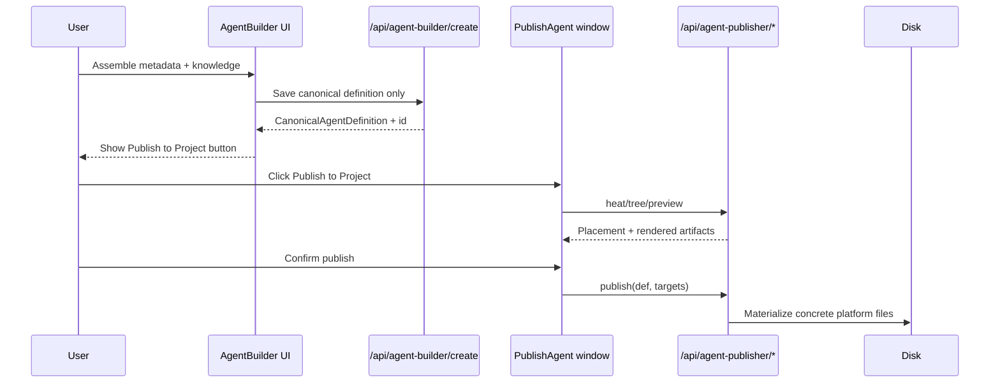
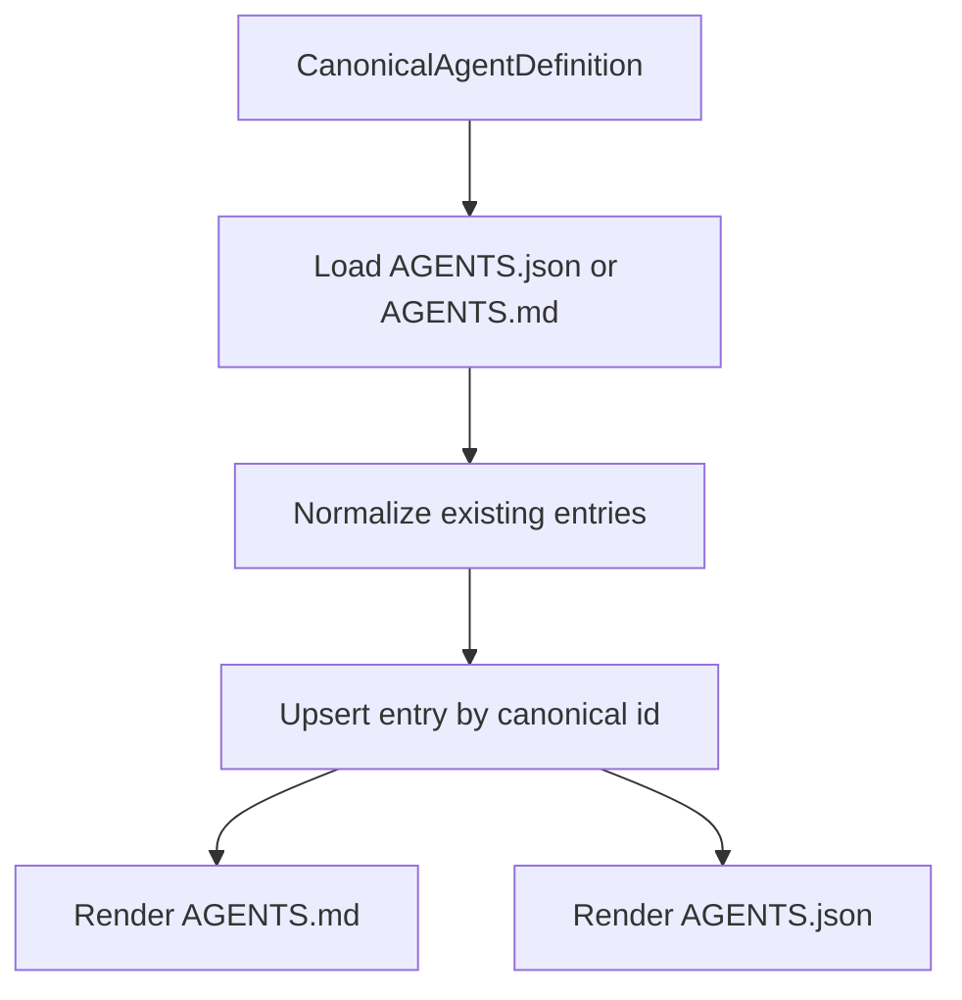
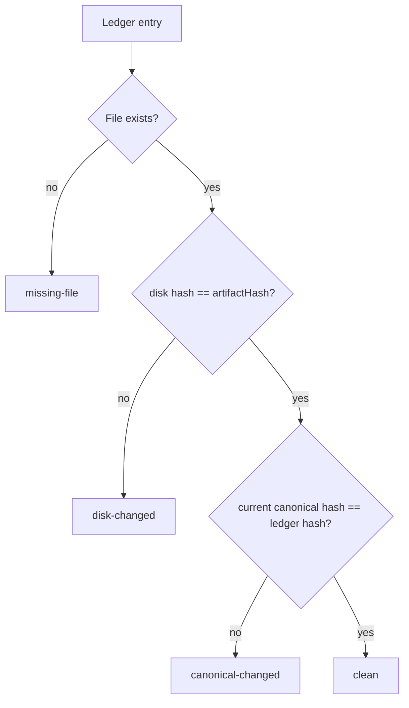
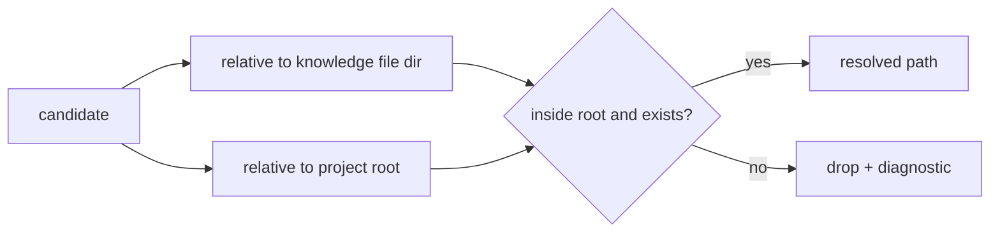
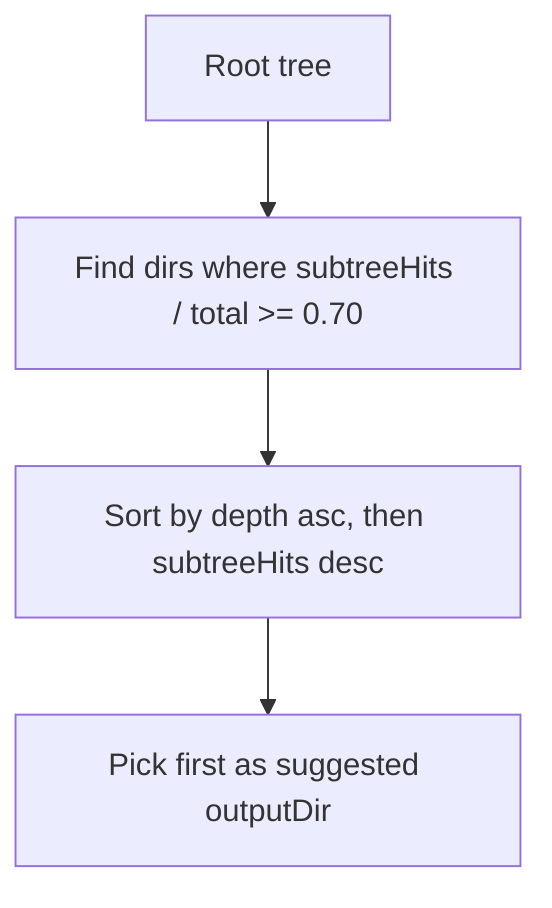
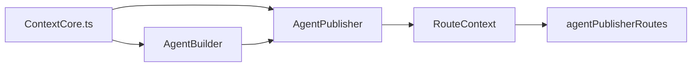
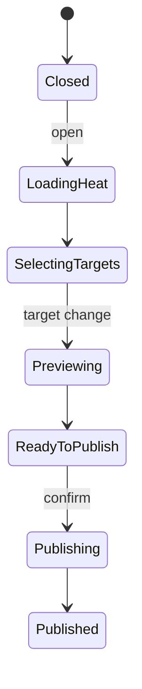
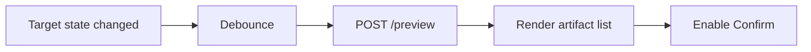

# r2ab3 - Agent Publisher Implementation Plan

**Date**: 2026-06-05  
**Scope**: Implement Agent Publisher as a separate step after Agent Builder. Agent Builder still assembles and saves the agent definition. Publishing choices move out of Agent Builder and into a dedicated Agent Publisher backend and UI.  
**Architecture choice**: Use Pathway **B** as the backbone: materialized per-platform artifacts with a provenance ledger. Add **C-style field-map rendering** where it reduces repeated rendering code. Do **not** implement Alternative A linking in this rollout: no symlink, no import-shim, no mention strategy. Every publish target writes concrete files.  
**Execution order**: Backend first, then API hardening, then Visualizer UI.  
**Difficulty rule for execution**: There are no hard or complex model batches in this plan. Previously hard items have been decomposed into smaller medium or simple batches.

## Current Code Seams

The incoming agent should verify these seams at runtime before editing. They are true at the time this plan was written.

Existing server create input is platform-coupled:

```ts
export interface CreateAgentInput
{
	projectName: string;
	agentName: string;
	description: string;
	"argument-hint": string;
	tools?: string[];
	agentKnowledge: string[];
	codexEntryId?: string;
	codexDirectory?: string;
	platform: "github" | "claude" | "codex";
}
```

Existing `/api/agent-builder/create` validates `platform`, then loops through platform-specific generation inside `AgentBuilder.create()`.

Existing visualizer flow is also platform-coupled:

```ts
onCreateAgent: (
	input: Omit<CreateAgentInput, "platform">,
	platforms: ("github" | "claude" | "codex")[]
) => void;
```

Existing `App.tsx` loops through the selected platform checkboxes:

```ts
for (const platform of platforms) {
	const payload: CreateAgentInput = { ...input, platform };
	const result = await fetchAgentBuilderCreate(payload);
	successPaths.push(result.path);
}
```

Target flow after this plan:



## 1.
{{SIMPLE}}

- [X] Re-open `server/src/agentBuilder/AgentBuilder.ts` and confirm the current create/list/get-agent functions still match the "Current Code Seams" section above.
- [X] Re-open `server/src/server/routes/agentBuilderRoutes.ts` and confirm `/api/agent-builder/create` still requires `platform`.
- [X] Re-open `visualizer/src/components/agentBuilder/AgentBuilder.tsx` and confirm platform checkbox state still lives in the component.
- [X] Re-open `visualizer/src/App.tsx` and confirm `handleCreateAgent` still loops over selected platforms.
- [X] Add a dated "Runtime Audit Notes" subsection at the end of this file with any differences found before implementation begins.
- [X] If the code has already drifted away from these seams, update only the affected later tasks before coding.

## 2.
{{MEDIUM}}

- [X] Create `server/src/agentPublisher/types.ts` with `PublishPlatform`, `ArtifactKind`, `KnowledgeRef`, `CanonicalAgentDefinition`, `PublishTarget`, `RenderedArtifact`, `PublishResult`, `PreviewResult`, `DriftReport`, and `PublishLedgerEntry`.
- [X] Use this starting shape for the canonical definition, then adjust only if the runtime audit finds an existing equivalent:

```ts
export interface CanonicalAgentDefinition
{
	id: string;
	kind: "agent" | "skill";
	projectName: string;
	name: string;
	description: string;
	whenToUse?: string;
	"argument-hint"?: string;
	tools?: string[];
	knowledge: KnowledgeRef[];
	body?: string;
	license?: string;
	compatibility?: string;
	metadata?: Record<string, string>;
}
```

- [X] Add `toCanonicalAgentDefinition(input)` that maps legacy `agentName` to canonical `name` and `agentKnowledge[]` to `knowledge[]`.
- [X] Add `fromCanonicalAgentDefinition(def, platform?)` for compatibility with existing `AgentDefinition` callers.
- [X] Add `makeCanonicalAgentId(projectName, name)` using the existing slug style from AgentBuilder if available.
- [X] Add unit tests for legacy input conversion, including `codexEntryId`, `codexDirectory`, empty tools, and custom text knowledge.

## 3.
{{MEDIUM}}

ASSUMPTION: this was already built previously. If not, re-asses at runtime: Group 2 publisher types and conversion helpers exist.

- [X] Extend `server/src/types.ts` `DataSourceEntry` with optional `projectRoot?: string`.
- [X] Extend `DataSourceEntry` with `publishRoots?: Partial<Record<PublishPlatform, string[]>>`, importing the type safely or duplicating a narrow config type to avoid circular imports.
- [X] Add `server/src/agentPublisher/pathPolicy.ts`.
- [X] Implement `inferProjectRoot(source)` with this precedence: `source.projectRoot`, inferred repo root from `.github/agents`, then `source.path`.
- [X] Implement `resolveAllowedPublishRoots(source, platform)` as `publishRoots[platform]`, then inferred project root fallback.
- [X] Implement `assertOutputDirAllowed(source, platform, outputDir)` using absolute resolved paths and Windows case normalization.
- [X] Add tests for path allow-list behavior with `D:\repo`, `D:\repo\server`, `..\escape`, and mixed slash paths.

Suggested guard shape:

```ts
function isInside(parent: string, child: string): boolean
{
	const p = normalizeForCompare(parent);
	const c = normalizeForCompare(child);
	return c === p || c.startsWith(`${p}${sepForCompare}`);
}
```

## 4.
{{MEDIUM}}

ASSUMPTION: this was already built previously. If not, re-asses at runtime: Groups 2 and 3 exist and pass typecheck.

- [X] Create `server/src/agentPublisher/fileOps.ts`.
- [X] Move or copy the existing `writeFileAtomic(targetPath, content)` behavior from `AgentBuilder.ts` into `fileOps.ts`.
- [X] Add `ensureDirForFile(filePath)` and call `mkdirSync(dirname(filePath), { recursive: true })`.
- [X] Generalize unmanaged backup into `backupUnmanagedFileIfNeeded(filePath, generatedMarker)`; preserve the Codex marker behavior when marker is present.
- [X] Add `hashContent(content)` and `hashFileIfExists(path)` helpers for ledger and drift.
- [X] Add tests for atomic write replacement, temp cleanup on rename failure where practical, and unmanaged backup naming.

## 5.
{{MEDIUM}}

ASSUMPTION: this was already built previously. If not, re-asses at runtime: file helpers from Group 4 exist.

- [X] Create `server/src/agentPublisher/AgentPublisherBase.ts`.
- [X] Add constructor inputs for `DataSourceEntry[]` and any shared path/index services the runtime audit identified.
- [X] Add abstract properties `platform: PublishPlatform` and methods `render(def, target): RenderedArtifact[]` and `resolveTargets(def, target): PublishTarget[]`.
- [X] Add shared `renderKnowledgeList(def)` that renders file refs as markdown links and text refs as bullet text.
- [X] Add shared `renderYamlFrontmatter(fields)` with minimal escaping for quotes and arrays.
- [X] Add shared `materializeArtifacts(artifacts)` that calls backup, ensure dir, and atomic write.

Suggested base shape:

```ts
export abstract class AgentPublisherBase
{
	abstract readonly platform: PublishPlatform;
	abstract render(def: CanonicalAgentDefinition, target: PublishTarget): RenderedArtifact[];

	protected renderKnowledgeList(def: CanonicalAgentDefinition): string[]
	{
		return def.knowledge.map((item) =>
			item.kind === "file" ? `- [${item.value}](${item.value})` : `- ${item.value}`
		);
	}
}
```

## 6.
{{MEDIUM}}

ASSUMPTION: this was already built previously. If not, re-asses at runtime: `AgentPublisherBase` exists.

- [X] Create `server/src/agentPublisher/platforms/AgentPublisherCopilot.ts`.
- [X] Copy the GitHub `.agent.md` rendering logic out of `AgentBuilder.create()` into a pure `renderAgentMarkdown(def)` helper.
- [X] Preserve frontmatter fields: `name`, `description`, `argument-hint`, and `tools` or commented tools line.
- [X] Add companion JSON rendering as a second `RenderedArtifact` ending in `.agent.json`.
- [X] Resolve output path as `{outputDir}/{def.name}.agent.md`.
- [X] Add a snapshot test comparing old GitHub output to new Copilot publisher output for the same input.

Target artifact pair:

```text
.github/agents/<name>.agent.md
.github/agents/<name>.agent.json
```

## 7.
{{MEDIUM}}

ASSUMPTION: this was already built previously. If not, re-asses at runtime: Copilot publisher is working and tested.

- [X] Create `server/src/agentPublisher/platforms/AgentPublisherClaude.ts`.
- [X] Move `buildClaudeAgentContent`, `formatClaudeKnowledgeEntry`, and `isFilePath` behavior from `AgentBuilder.ts` into Claude publisher helpers.
- [X] Preserve Claude markdown frontmatter: `name` and `description`.
- [X] Add companion JSON rendering as `{name}.json`.
- [X] Resolve output path as `{outputDir}/{def.name}.md`.
- [X] Add tests for file knowledge links and plain-text knowledge bullets.

Target artifact pair:

```text
.claude/agents/<name>.md
.claude/agents/<name>.json
```

## 8.
{{MEDIUM}}

ASSUMPTION: this was already built previously. If not, re-asses at runtime: `AgentPublisherBase`, file helpers, and canonical conversion helpers exist.

- [X] Create `server/src/agentPublisher/platforms/AgentPublisherCodex.ts`.
- [X] Move Codex constants such as `AGENTS.md`, `AGENTS.json`, and the generated marker into the Codex publisher or shared constants.
- [X] Move Codex collection parsing helpers into a dedicated `codexCollection.ts`: parse JSON, parse markdown, normalize entry, build markdown.
- [X] Implement `render(def, target)` as "load existing collection, upsert canonical entry, output updated AGENTS.md and AGENTS.json".
- [X] Preserve existing `codexEntryId` behavior by mapping canonical `id` to Codex entry id.
- [X] Add tests for new collection, update existing entry, multiple entries, and recovery from markdown when JSON is absent.

Codex write flow:



## 9.
{{MEDIUM}}

ASSUMPTION: this was already built previously. If not, re-asses at runtime: Groups 6-8 platform publishers exist.

- [X] Create `server/src/agentPublisher/FieldMapRegistry.ts`.
- [X] Add field-map rows for `description`, `whenToUse`, `argument-hint`, `tools`, `knowledge`, `paths`, `license`, `compatibility`, and `metadata`.
- [X] Create `server/src/agentPublisher/skillRenderer.ts`.
- [X] Render portable `SKILL.md` frontmatter with `name` and `description` always present.
- [X] Render optional body text before the generated references section.
- [X] Add tests for empty optional fields, metadata output, and text/file knowledge references.

Minimal field-map style:

```ts
export const FIELD_MAP = {
	whenToUse: {
		claude: { mode: "frontmatter", key: "when_to_use" },
		default: { mode: "foldIntoDescription" },
	},
	tools: {
		copilot: { mode: "frontmatter", key: "allowed-tools" },
		claude: { mode: "frontmatter", key: "allowed-tools" },
		default: { mode: "drop" },
	},
} as const;
```

## 10.
{{MEDIUM}}

ASSUMPTION: this was already built previously. If not, re-asses at runtime: Skill renderer from Group 9 exists.

- [X] Add skill rendering support to `AgentPublisherCopilot` for `.github/skills/<id>/SKILL.md`.
- [X] Add skill rendering support to `AgentPublisherClaude` for `.claude/skills/<id>/SKILL.md`.
- [X] Add skill rendering support to `AgentPublisherCodex` for `.agents/skills/<id>/SKILL.md`.
- [X] For non-supported sidecars, explicitly return no sidecar artifacts instead of leaving TODO branches.
- [X] Add tests that each publisher writes the expected skill path for the same canonical definition.
- [X] Add one integration fixture that publishes both `artifactKind: "agent"` and `artifactKind: "skill"`.

## 11.
{{MEDIUM}}

ASSUMPTION: this was already built previously. If not, re-asses at runtime: Platform publishers are individually tested.

- [X] Create `server/src/agentPublisher/AgentPublisher.ts`.
- [X] Register publisher instances in a `Map<PublishPlatform, AgentPublisherBase>`.
- [X] Implement `getPublisher(platform)` with a 400-style error for unsupported platforms.
- [X] Implement `preview(def, targets)` by validating target directories and collecting rendered artifacts without writing.
- [X] Implement `publish(def, targets)` as validate all targets, render all artifacts, write artifacts, update index hook, update ledger.
- [X] Return UI-friendly `PublishResult` with `written[]`, `warnings[]`, and `errors[]`.

Orchestrator shape:

```ts
preview(def, targets) {
	return targets.flatMap((target) => {
		const publisher = this.getPublisher(target.platform);
		this.pathPolicy.assertOutputDirAllowed(def.projectName, target.platform, target.outputDir);
		return publisher.render(def, target);
	});
}
```

## 12.
{{MEDIUM}}

ASSUMPTION: this was already built previously. If not, re-asses at runtime: `AgentPublisher.publish()` has a placeholder for ledger writes.

- [X] Create `server/src/agentPublisher/PublishLedger.ts`.
- [X] Store ledger at `{storage}/.settings/agent-publish.json`.
- [X] Implement `load()` with `try/catch`; corrupt JSON should return an empty ledger and a warning.
- [X] Implement `save()` through `writeFileAtomic`.
- [X] Implement `upsert(entry)` keyed by `(canonicalId, platform, artifactKind, absolutePath)`.
- [X] Add tests for empty ledger, corrupt ledger fallback, upsert replacement, and stable JSON formatting.

Ledger entry shape:

```ts
interface PublishLedgerEntry
{
	canonicalId: string;
	platform: PublishPlatform;
	artifactKind: ArtifactKind;
	absolutePath: string;
	canonicalHash: string;
	artifactHash: string;
	knowledge: string[];
	referencedPaths: string[];
	publishedAt: string;
}
```

## 13.
{{MEDIUM}}

ASSUMPTION: this was already built previously. If not, re-asses at runtime: `PublishLedger` is available.

- [X] Add `canonicalHash(def)` using stable JSON stringification of the canonical definition.
- [X] Add `artifactHash` capture for each rendered artifact before write.
- [X] Update `publish()` so every written artifact creates or updates a ledger entry.
- [X] Implement `detectDrift(canonicalId)` by comparing ledger canonical hash, current canonical hash when provided, and current disk file hash.
- [X] Represent drift states as `clean`, `canonical-changed`, `disk-changed`, `missing-file`, and `unknown`.
- [X] Add tests for all drift states.

Drift decision:



## 14.
{{MEDIUM}}

ASSUMPTION: this was already built previously. If not, re-asses at runtime: Publisher orchestration and ledger are functional.

- [X] Add an index update callback to `AgentPublisher` constructor, such as `onArtifactsWritten(artifacts)`.
- [X] In `AgentBuilder`, add a public method like `upsertPublishedArtifacts(sourceName, artifacts)` that updates `indexedFiles` the same way `create()` currently does.
- [X] Ensure `.json` companion files are excluded from `indexedFiles`.
- [X] Wire the callback from `ContextCore.ts` when creating `AgentPublisher`.
- [X] Add an integration test: publish an artifact, call `/api/agent-builder/prepare`, and confirm the new markdown artifact appears without restarting.
- [X] Add a second integration test for overwriting an existing artifact and confirming only one index row remains.

Suggested AgentBuilder method:

```ts
upsertPublishedArtifacts(sourceName: string, artifacts: RenderedArtifact[]): void
{
	// Remove stale markdown rows by absolute path.
	// Push markdown artifacts with origin: "agent".
	// Ignore companion .json artifacts.
}
```

## 15.
{{MEDIUM}}

ASSUMPTION: this was already built previously. If not, re-asses at runtime: canonical knowledge refs can resolve to indexed files.

- [X] Create `server/src/agentPublisher/PathMentionExtractor.ts`.
- [X] Extract markdown links with a conservative regex for `[label](path)`.
- [X] Extract inline-code path candidates from backtick spans.
- [X] Extract bare paths only when they contain `/` or `\` and a file-like segment, to avoid noisy prose matches.
- [X] Drop URLs, anchors, mailto links, and empty values before resolution.
- [X] Add tests for markdown links, inline code, bare paths, URLs, anchors, and duplicate mentions.

Extractor sketch:

```ts
const MARKDOWN_LINK_RE = /\[[^\]]+\]\(([^)]+)\)/g;
const INLINE_CODE_RE = /`([^`]+)`/g;
```

## 16.
{{MEDIUM}}

ASSUMPTION: this was already built previously. If not, re-asses at runtime: PathMentionExtractor returns raw path candidates.

- [X] Create `server/src/agentPublisher/PathResolver.ts`.
- [X] Resolve candidates relative to the knowledge file directory first.
- [X] Resolve candidates relative to each relevant data source project root second.
- [X] Normalize separators to the host OS for existence checks.
- [X] Reject resolved paths outside the relevant project root allow-list.
- [X] Add an option for missing paths: default to dropping them from heat, but expose dropped count for diagnostics.
- [X] Add tests for Windows absolute paths, repo-relative paths, sibling relative paths, and escape attempts.

Resolution flow:



## 17.
{{MEDIUM}}

ASSUMPTION: this was already built previously. If not, re-asses at runtime: Path extraction and path resolution both work.

- [X] Create `server/src/agentPublisher/PathHeatAnalyzer.ts`.
- [X] For each knowledge file, read content through the existing AgentBuilder path guard or an equivalent allow-list guard.
- [X] De-duplicate resolved paths per knowledge file before counting.
- [X] Increment `directHits` for the resolved path node.
- [X] Walk ancestors up to the project root and increment `subtreeHits`.
- [X] Normalize `heat` with a log scale so one very hot path does not flatten the rest.
- [X] Add tests for repeated mentions in one file and the same mention across multiple files.

Counting sketch:

```ts
for (const resolvedPath of uniqueMentionsForFile) {
	incrementDirect(resolvedPath);
	for (const ancestor of ancestorsUntilRoot(resolvedPath, root)) {
		incrementSubtree(ancestor);
	}
}
```

## 18.
{{MEDIUM}}

ASSUMPTION: this was already built previously. If not, re-asses at runtime: Heat analyzer can produce per-path counts.

- [X] Define `DirHeatNode` and `PathHeatResult` in publisher types.
- [X] Build a directory tree rooted at each data source project root.
- [X] Attach `directHits`, `subtreeHits`, and normalized `heat` to each directory node.
- [X] Add `topPaths` as the top 10 paths by hit count with stable tie-breaking by path.
- [X] Implement `selectPlacementPlan(result, threshold = 0.7)` as the shallowest directory covering at least 70 percent of total hits.
- [X] Add tests for empty heat, single hot subtree, multiple competing subtrees, and stable top path ordering.

Placement selection:



## 19.
{{MEDIUM}}

ASSUMPTION: this was already built previously. If not, re-asses at runtime: AgentPublisher, heat analyzer, and ledger exist.

- [X] Create `server/src/server/routes/agentPublisherRoutes.ts`.
- [X] Add `agentPublisher?: AgentPublisher` to `server/src/server/RouteContext.ts`.
- [X] Register `GET /api/agent-publisher/platforms`.
- [X] Register `GET /api/agent-publisher/tree?projectName=...`.
- [X] Register `POST /api/agent-publisher/heat`.
- [X] Register `POST /api/agent-publisher/preview`.
- [X] Register `POST /api/agent-publisher/publish`.
- [X] Register `GET /api/agent-publisher/drift?canonicalId=...`.

Route pattern should mirror existing guarded routes:

```ts
if (!ctx.agentPublisher) {
	res.status(404).json({ error: "AgentPublisher not available" });
	return;
}
```

## 20.
{{MEDIUM}}

ASSUMPTION: this was already built previously. If not, re-asses at runtime: Publisher routes compile locally.

- [X] Update `server/src/server/ContextServer.ts` to import and register `agentPublisherRoutes`.
- [X] Update `startServer(...)` signature to accept optional `agentPublisher`.
- [X] Update the `RouteContext` assembly to include `agentPublisher`.
- [X] Update `server/src/ContextCore.ts` to instantiate `AgentPublisher` after `AgentBuilder` is indexed.
- [X] Pass storage path to `AgentPublisher` so ledger can live in `{storage}/.settings`.
- [X] Pass an index update callback into `AgentPublisher` so published files are visible to AgentBuilder prepare/list flows.
- [X] Add a smoke test or manual script that starts the server and calls `/api/agent-publisher/platforms`.

Wiring diagram:



## 21.
{{MEDIUM}}

ASSUMPTION: this was already built previously. If not, re-asses at runtime: Publisher backend is available through routes.

- [X] Change server `CreateAgentInput` so `platform` is optional or move publish-specific platform fields into a compatibility subtype.
- [X] Add a canonical-only path for `/api/agent-builder/create` when no `platform` is provided.
- [X] Return `canonicalDefinition` and `canonicalId` from canonical-only create.
- [X] Keep old platform-specific create behavior when `platform` is provided so old clients and tests do not break during migration.
- [X] Update route validation: require `platform` only for the compatibility publishing path.
- [X] Add tests for both create modes: canonical-only and legacy platform-specific.

Desired response addition:

```ts
type CreateAgentResponse = {
	created: boolean;
	agentName: string;
	path?: string;
	canonicalId?: string;
	canonicalDefinition?: CanonicalAgentDefinition;
	codexEntryId?: string;
};
```

## 22.
{{SIMPLE}}

ASSUMPTION: this was already built previously. If not, re-asses at runtime: backend routes and compatibility create mode exist.

- [X] Run the server TypeScript check command from `server/package.json` or the closest existing script.
- [X] Run existing backend tests.
- [X] Add a manual request for canonical-only `/api/agent-builder/create` and save the JSON response in Runtime Audit Notes.
- [X] Add a manual request for `/api/agent-publisher/heat` using the returned canonical definition.
- [X] Add a manual request for `/api/agent-publisher/preview`.
- [X] Add a manual request for `/api/agent-publisher/publish` against a temporary fixture project.
- [X] Confirm no symlink, import-shim, or mention files were created.
- [X] Mark any failing verification item with a short blocker note before starting UI work.

## 23.
{{MEDIUM}}

ASSUMPTION: this was already built previously. If not, re-asses at runtime: backend API response shapes are stable enough for UI work.

- [X] Mirror `CanonicalAgentDefinition`, `KnowledgeRef`, `PublishPlatform`, `ArtifactKind`, `PublishTarget`, `DirHeatNode`, `PathHeatResult`, `PreviewResult`, `PublishResult`, and `DriftReport` in `visualizer/src/types.ts`.
- [X] Update visualizer `CreateAgentInput` so `platform` is optional or removed from the default builder call type.
- [X] Update `CreateAgentResponse` to include `canonicalId` and `canonicalDefinition`.
- [X] Add `visualizer/src/api/agentPublisher.ts` for publisher fetch wrappers rather than growing `api/search.ts` further.
- [X] Implement `fetchPublisherPlatforms`, `fetchPublisherTree`, `fetchPublisherHeat`, `fetchPublisherPreview`, `fetchPublisherPublish`, and `fetchPublisherDrift`.
- [X] Add basic API wrapper tests or typed compile checks if the visualizer test setup supports them.

Fetch wrapper shape:

```ts
export async function fetchPublisherPreview(body: PreviewRequest): Promise<PreviewResult>
{
	const response = await fetch("/api/agent-publisher/preview", {
		method: "POST",
		headers: { "Content-Type": "application/json" },
		body: JSON.stringify(body),
	});
	if (!response.ok) throw new Error(await response.text());
	return response.json();
}
```

## 24.
{{MEDIUM}}

ASSUMPTION: this was already built previously. If not, re-asses at runtime: Visualizer publisher types are available.

- [X] In `visualizer/src/components/agentBuilder/AgentBuilder.tsx`, remove `PLATFORMS_KEY` and `CODEX_DIRECTORY_KEY` state if no longer used outside Publisher.
- [X] Change `onCreateAgent` prop to accept only `Omit<CreateAgentInput, "platform">` or a new `CreateAgentDraftInput`.
- [X] Remove `platforms` React state and all `setPlatforms` calls.
- [X] Remove `codexDirectory` state from AgentBasket create/edit form; target directory now belongs to Publisher.
- [X] Remove the platform checkbox JSX block.
- [X] Remove the Codex directory select JSX block.
- [X] Update `canCreate` so it no longer checks `platforms.size` or `codexNeedsDirectory`.
- [X] Update the create button title so it says it saves the agent definition, not platform files.

Before:

```tsx
onCreateAgent(input, Array.from(platforms));
```

After:

```tsx
onCreateAgent(input);
```

## 25.
{{MEDIUM}}

ASSUMPTION: this was already built previously. If not, re-asses at runtime: AgentBasket no longer emits selected platforms.

- [X] In `visualizer/src/App.tsx`, change `handleCreateAgent` signature to accept only the draft input.
- [X] Remove the loop over platforms in `handleCreateAgent`.
- [X] Call `fetchAgentBuilderCreate(input)` once.
- [X] Store returned `canonicalDefinition` in new state like `lastCreatedAgentDefinition`.
- [X] Store returned `canonicalId` in new state like `lastCreatedAgentId`.
- [X] Set success text to the agent name or canonical id rather than joined paths.
- [X] Preserve current template behavior: agent-from-template success can still switch to Agent List after publishing decisions are handled.
- [X] Ensure create/save errors do not clear knowledge entries or form state.

New state sketch:

```tsx
const [lastCreatedAgentDefinition, setLastCreatedAgentDefinition] =
	useState<CanonicalAgentDefinition | null>(null);
const [isPublisherOpen, setIsPublisherOpen] = useState(false);
```

## 26.
{{MEDIUM}}

ASSUMPTION: this was already built previously. If not, re-asses at runtime: App tracks the last canonical definition after create.

- [X] Add an `onPublishAgent` prop to `AgentBasket`.
- [X] Add a `canPublish` prop to `AgentBasket`.
- [X] Render a `Publish to Project` button only when `mode !== "template"` and `canPublish` is true.
- [X] Place the button near the success banner or header action area, not mixed into the removed platform controls.
- [X] Disable the button while create is in progress.
- [X] On click, call `onPublishAgent()`.
- [X] Add a small success-state test or manual checklist: before create no button, after create button visible.

Suggested JSX:

```tsx
{mode !== "template" && canPublish && (
	<button type="button" className="agent-basket-publish-btn" onClick={onPublishAgent}>
		Publish to Project
	</button>
)}
```

## 27.
{{MEDIUM}}

ASSUMPTION: this was already built previously. If not, re-asses at runtime: Publisher API wrappers exist and App can open a modal.

- [X] Create `visualizer/src/components/agentPublisher/PublishAgentDialog.tsx`.
- [X] Create `visualizer/src/components/agentPublisher/PublishAgentDialog.css`.
- [X] Props should include `open`, `definition`, `onClose`, and `onPublished`.
- [X] Add local state for selected platforms, selected artifact kind, target directories, heat result, preview result, publish result, loading, and error.
- [X] Fetch `/api/agent-publisher/platforms` when the dialog opens.
- [X] Fetch heat data when the dialog opens and `definition.knowledge` is non-empty.
- [X] Show a useful empty heat state when the agent contains only custom text knowledge.

Dialog state flow:



## 28.
{{MEDIUM}}

ASSUMPTION: this was already built previously. If not, re-asses at runtime: `PublishAgentDialog` shell exists.

- [X] Create `PlatformTargetRow.tsx` for one platform row.
- [X] Render platforms: Codex, Claude, Copilot/GitHub, Kiro, Cursor, Windsurf, and Antigravity.
- [X] Use checkboxes for platform selection in Publisher only.
- [X] Use a segmented control or select for `artifactKind` when both agent and skill are supported.
- [X] Show the resolved "will write" filename hint for each selected platform.
- [X] Disable unsupported platform/artifact combinations based on `/platforms` response.
- [X] Keep all target choices inside Publisher state, not AgentBasket state.

Platform row shape:

```tsx
type PlatformTargetRowProps = {
	platform: PublishPlatform;
	selected: boolean;
	artifactKind: ArtifactKind;
	outputDir: string;
	onToggle: () => void;
	onArtifactKindChange: (kind: ArtifactKind) => void;
	onPickDirectory: () => void;
};
```

## 29.
{{MEDIUM}}

ASSUMPTION: this was already built previously. If not, re-asses at runtime: heat endpoint returns `DirHeatNode[]`.

- [X] Create `PathHeatTree.tsx`.
- [X] Render a collapsible tree from `DirHeatNode.children`.
- [X] Show `[N]` badge when `subtreeHits > 0`.
- [X] Render a left color bar using `heat` from blue/cyan/green/amber/red.
- [X] Highlight the server-suggested placement directory.
- [X] On directory click, update the selected output directory for the active platform row.
- [X] Add keyboard basics: Enter selects, ArrowRight expands, ArrowLeft collapses.
- [X] Ensure long paths truncate gracefully and expose full path in `title`.

Node render sketch:

```tsx
<button className="path-node" onClick={() => onSelect(node.absolutePath)}>
	<span className="path-node-heat" style={{ backgroundColor: heatColor(node.heat) }} />
	<span className="path-node-name">{node.name}</span>
	{node.subtreeHits > 0 && <span className="path-node-badge">[{node.subtreeHits}]</span>}
</button>
```

## 30.
{{MEDIUM}}

ASSUMPTION: this was already built previously. If not, re-asses at runtime: PathHeatTree exists and can select directories.

- [X] Add a Top 10 hottest paths panel to `PublishAgentDialog`.
- [X] Render each top path as a compact button or chip.
- [X] Clicking a chip should select or scroll to the nearest directory node.
- [X] Add an accessible label that includes path and hit count.
- [X] Use neutral styling for zero-heat states.
- [X] Add a small helper `findNearestDirectoryForTopPath(topPath, tree)`.

## 31.
{{MEDIUM}}

ASSUMPTION: this was already built previously. If not, re-asses at runtime: platform rows and target directory selection are available.

- [X] Build `makePublishTargetsFromState()` in `PublishAgentDialog`.
- [X] Validate that at least one platform is selected.
- [X] Validate every selected platform has an output directory.
- [X] Call `fetchPublisherPreview({ definition, targets })` after a debounce when targets change.
- [X] Create a preview drawer showing every rendered artifact path.
- [X] Mark each artifact as new, replace generated, backup unmanaged, or unknown based on preview metadata.
- [X] Show preview errors inline without closing the dialog.
- [X] Add a Confirm Publish button that is disabled while preview is stale or invalid.

Preview flow:



## 32.
{{MEDIUM}}

ASSUMPTION: this was already built previously. If not, re-asses at runtime: preview works in the dialog.

- [X] Implement Confirm Publish by calling `fetchPublisherPublish({ definition, targets })`.
- [X] Render written artifact paths after success.
- [X] Render warnings from the server, including unmanaged backup warnings.
- [X] Call `onPublished(result)` so App can refresh Agent List or Agent Builder cards.
- [X] Keep the dialog open after publish so the user can inspect results.
- [X] Add a Close button that resets transient preview/publish state.
- [X] Ensure publish failure does not lose selected targets.

## 33.
{{MEDIUM}}

ASSUMPTION: this was already built previously. If not, re-asses at runtime: PublishAgentDialog works from a freshly created definition.

- [X] Add a Publish action to agent-list cards or the surrounding Agent List UI.
- [X] Reuse existing edit flow data: call `fetchAgentBuilderGetAgent(path, codexEntryId)` to get a definition.
- [X] Convert the returned legacy `AgentDefinition` to `CanonicalAgentDefinition` on the client or request a canonical shape from the server.
- [X] Open `PublishAgentDialog` with that definition.
- [X] Do not switch back to Agent Builder just to publish an existing agent.
- [X] Preserve current edit action behavior separately.

## 34.
{{SIMPLE}}

ASSUMPTION: this was already built previously. If not, re-asses at runtime: UI integration is complete enough to run.

- [X] Remove unused CSS for `.agent-basket-platforms` if no component uses it.
- [X] Remove unused localStorage keys for platform choices if they are no longer read.
- [X] Run visualizer typecheck/build.
- [X] Run server typecheck/build after shared type changes.
- [X] Start backend and Vite dev server.
- [X] Manually verify: Create agent, see Publish to Project, open Publisher, select platform, preview, publish.
- [X] Manually verify: Agent Builder no longer shows platform checkboxes.
- [X] Manually verify: Publisher is the only place where platform checkboxes appear.

## 35.
{{MEDIUM}}

ASSUMPTION: this was already built previously. If not, re-asses at runtime: backend and frontend flow work manually.

- [X] Add or update backend tests for canonical-only AgentBuilder create.
- [X] Add or update backend tests for publisher preview.
- [X] Add or update backend tests for publisher publish and ledger writes.
- [X] Add or update backend tests for path heat extraction and placement.
- [X] Add UI tests for AgentBasket without platform checkboxes.
- [X] Add UI tests for Publish to Project visibility after create/save.
- [X] Add UI tests for PublishAgentDialog target selection and preview payload.
- [X] Add Playwright coverage for the full create to publish flow if Playwright is already configured.

## 36.
{{SIMPLE}}

ASSUMPTION: this was already built previously. If not, re-asses at runtime: tests have been added or consciously deferred.

- [X] Update `server/zz-reach2/architecture/agents/archi-agent-builder.md` with Builder/Publisher separation.
- [X] Update `visualizer/zz-reach2/architecture/ui/archi-context-core-visualizer-ui.md` with PublishAgent dialog behavior.
- [X] Update `visualizer/zz-reach2/architecture/archi-context-core-visualizer.md` if the module topology changes.
- [X] Add release notes: Build agent first, publish to projects/platforms second.
- [X] Add troubleshooting notes for invalid output directories, unmanaged backups, stale drift, and missing heat.
- [X] Add an explicit note that Alternative A linking was intentionally not implemented.
- [X] Re-run final server and visualizer verification commands.
- [X] Mark completed tasks incrementally in this plan as implementation proceeds.

## Runtime Audit Notes

**Date**: 2026-06-05

All seams match the plan as written:

- `CreateAgentInput` in `AgentBuilder.ts` still requires `platform: "github" | "claude" | "codex"` plus optional `codexEntryId` / `codexDirectory`.
- `/api/agent-builder/create` still returns HTTP 400 when `platform` is absent.
- Visualizer component is `AgentBuilder.tsx` (not `AgentBasket.tsx`); platform checkbox state uses `PLATFORMS_KEY` localStorage and `codexDirectory` state.
- `App.tsx` `handleCreateAgent` still loops `for (const platform of platforms)` and calls `fetchAgentBuilderCreate` per platform.

**Drift notes** (no plan task changes required):

- Component was renamed from `AgentBasket` to `AgentBuilder.tsx`; later UI tasks reference the correct path.
- Extra AgentBuilder endpoints exist (`get-file-content`, `add-template`, `list-templates`) — out of scope for this rollout.

**Post-implementation verification (2026-06-05)**:

- `bun run typecheck` passes in `server/` and `visualizer/`.
- `bun test src/agentPublisher/tests` — 19 tests pass (canonical, pathPolicy, fileOps, publishers, ledger, path mentions).
- Canonical-only create returns `{ canonicalId, canonicalDefinition }` without `path`.
- Publisher routes registered: `/api/agent-publisher/platforms`, `/tree`, `/heat`, `/preview`, `/publish`, `/drift`.
- No symlink, import-shim, or mention-only artifacts are created by publish.

## Code Review Conclusions (2026-06-06)

Reviewed the repository diff after the Agent Publisher implementation. Overall shape matches the requested direction: AgentBuilder no longer exposes platform checkboxes in the primary UI, Publisher has its own platform selection window, server routes are wired, and the backend has a materialized-artifact publisher with ledger support.

Findings to address before calling this production-ready:

1. **High - canonical-only AgentBuilder create does not persist anything.** `server/src/agentBuilder/AgentBuilder.ts:1194-1203` returns `{ canonicalId, canonicalDefinition }` when `platform` is omitted, but does not write a canonical definition file, update a store, or update the index. `visualizer/src/App.tsx:952-956` then keeps that definition only in React state. A refresh, view switch that clears state, 	browser crash, or failed publish loses the "created" agent. This conflicts with the plan's stated Builder/Publisher separation where Builder saves the canonical definition and Publisher materializes platform artifacts. Add a canonical definition store, or make the UI wording explicit that this is only a draft until publish.

2. **High - default Publisher target directories write Copilot and Claude agent files to the wrong place.** `visualizer/src/components/agentPublisher/PublishAgentDialog.tsx:119-129` initializes every selected platform's `outputDir` to the heat-suggested project directory. `AgentPublisherCopilot` writes directly to `join(outputDir, name.agent.md)` at `server/src/agentPublisher/platforms/AgentPublisherCopilot.ts:25-26`, and `AgentPublisherClaude` writes directly to `join(outputDir, name.md)` at `server/src/agentPublisher/platforms/AgentPublisherClaude.ts:26-27`. With the default suggested root, Publish writes `<project>/<name>.agent.md` and `<project>/<name>.md`, not `.github/agents/<name>.agent.md` and `.claude/agents/<name>.md`. Either the UI must default each platform to its native output directory, or the platform renderers must resolve native subpaths from a project-root target. The same directory semantics need to distinguish "agent target dir" from "skill project root"; `skillRenderer.ts:53-55` appends `.github/.claude/.agents/skills` to `outputDir`, so one `outputDir` currently means different things per artifact kind.

3. **Medium - generated-file backup detection is Codex-specific for all platforms.** `AgentPublisherBase.materializeArtifacts()` defaults to `CODEX_GENERATED_MARKER` for every markdown artifact, but Copilot and Claude renderers do not emit that marker. Re-publishing an existing CXC-generated `.agent.md`, `.md`, or `SKILL.md` will be treated as unmanaged and backed up repeatedly. Add a platform-neutral CXC marker to generated artifacts, or pass platform-specific markers into `materializeArtifacts()`.

4. **Medium - route error handling is inconsistent for preview/publish.** `/api/agent-publisher/preview` and `/publish` call publisher methods without a route-level `try/catch` in `server/src/server/routes/agentPublisherRoutes.ts:63-102`. Most preview errors are collected internally, but materialization, ledger save, file system failures, or unexpected renderer exceptions can still throw and fall through to Express default handling instead of the API's JSON error shape. Wrap these routes like `/tree` and `/heat`.

5. **Low - `detectDrift` cannot report canonical changes through the public route.** `AgentPublisher.detectDrift(canonicalId, currentDef?)` can compare a current canonical hash only when a definition is passed, but `/api/agent-publisher/drift` only accepts `canonicalId`. The route can therefore report disk/missing-file drift, but not `canonical-changed`. Either accept a canonical definition in the drift request or document this endpoint as ledger-vs-disk only.

Verification run during review:

- `bun run typecheck` in `server/` passed.
- `npm run build` in `visualizer/` passed.
- Targeted publisher/builder tests passed when invoked by concrete file paths: `bun test src/agentPublisher/tests/PublishLedger.test.ts src/agentPublisher/tests/publishers.test.ts src/agentPublisher/tests/pathPolicy.test.ts src/agentPublisher/tests/PathMentionExtractor.test.ts src/agentPublisher/tests/fileOps.test.ts src/agentPublisher/tests/canonical.test.ts src/agentBuilder/tests/agentBuilder.codex.test.ts`.
- Full `bun run test` in `server/` passed: 297 tests.

Residual risk: the automated tests cover renderer shapes and basic backend behavior, but they do not currently cover the end-to-end default UI publish path that would expose the incorrect Copilot/Claude output directories. Add an integration or Playwright assertion that default Publisher targets resolve to expected platform-native artifact paths.

## Review Remediation Status (2026-06-06)

All code-review findings from batches 37–43 have been addressed:

1. **Canonical persistence** — `CanonicalAgentStore` at `{storage}/.settings/agent-definitions.json`; canonical-only create upserts before returning `{ persisted: true }`; `GET /api/agent-builder/get-definition?canonicalId=...` reloads stored definitions.
2. **Platform-native default directories** — `pathContract.ts` + `GET /api/agent-publisher/platforms?projectName=...` return `defaultDirs`; Publisher UI initializes Copilot/Claude/Codex targets to native agent dirs; heat remains a placement suggestion only.
3. **Generated-file backup detection** — `CXC_GENERATED_MARKER` emitted in Copilot/Claude/Skill output; `generatedMarkerForPlatform()` used in `materializeArtifacts()`.
4. **Route error handling** — preview/publish routes wrapped in try/catch with consistent `{ error }` JSON bodies.
5. **Drift canonical comparison** — `POST /api/agent-publisher/drift` accepts optional definition; store-backed hash when omitted.

**Verification (2026-06-06):**

- `bun run typecheck` in `server/` passed.
- `bun run test` in `server/` passed: 311 tests.
- `npm run build` in `visualizer/` passed.
- New tests: `CanonicalAgentStore.test.ts`, `pathContract.test.ts`, `remediation.test.ts`, `agentPublisherRoutes.test.ts`, `publishUtils.test.ts`.

**Manual verification still recommended:** refresh-after-save publish flow, native preview paths in live Publisher, re-publish without duplicate backups.

## Review Remediation Tasks

## 37.
{{MEDIUM}}

- [X] Create `server/src/agentPublisher/CanonicalAgentStore.ts` that persists canonical definitions under `{storage}/.settings/agent-definitions.json`.
- [X] Define the store file shape with `version: 1` and `definitions: CanonicalAgentDefinition[]`.
- [X] Implement `load()` with safe fallback for missing or corrupt JSON, returning a warning instead of throwing.
- [X] Implement `save()` using the existing atomic write helper.
- [X] Implement `upsert(definition)` keyed by canonical `id`.
- [X] Implement `get(id)` and `list()` for future Agent List / Publisher flows.
- [X] Add tests for missing store, corrupt store, upsert replacement, and stable JSON output.
- [X] Add a generated-source marker or metadata field in the stored definition so future migrations can identify CXC-created definitions.

## 38.
{{MEDIUM}}

- [X] Inject `CanonicalAgentStore` into `AgentBuilder` or expose it through `ContextCore` alongside `AgentBuilder` and `AgentPublisher`.
- [X] Update canonical-only `AgentBuilder.create()` to upsert the canonical definition before returning.
- [X] Update canonical-only create response to include a clear persisted flag, such as `persisted: true`.
- [X] Add `GET /api/agent-builder/get-definition?canonicalId=...` or an equivalent Publisher route to reload a stored canonical definition.
- [X] Update `AgentPublisher.detectDrift()` call sites so they can load the current canonical definition from the store when only `canonicalId` is provided.
- [X] Add tests proving canonical-only create survives a new store instance reload.
- [X] Add tests proving a stored canonical definition can be fetched by id.
- [X] Update UI wording from "Save Definition" only after persistence is confirmed, or show an error if the store write fails.

## 39.
{{MEDIUM}}

- [X] Add a publisher path contract type that distinguishes `projectRoot`, `agentOutputDir`, and `skillRootDir`.
- [X] Extend `/api/agent-publisher/platforms` to return per-platform default directories for the selected `projectName`.
- [X] For Copilot agent output, resolve default `agentOutputDir` to `source.agentPath` or `<projectRoot>/.github/agents`.
- [X] For Claude agent output, resolve default `agentOutputDir` to `source.claudeAgentPath` or `<projectRoot>/.claude/agents`.
- [X] For Codex agent output, resolve default `agentOutputDir` to the Codex project instruction directory as currently inferred by path policy.
- [X] Keep heat-suggested directories as placement suggestions, not as blind defaults for every platform.
- [X] Add backend tests that default platform target paths resolve to `.github/agents`, `.claude/agents`, and `AGENTS.md` locations.
- [X] Add backend tests for explicit user-selected directories inside allowed roots.

## 40.
{{MEDIUM}}

- [X] Update `PublishAgentDialog` to initialize each selected platform from the backend-provided default directory for that platform.
- [X] Update the path tree click behavior so selecting a directory changes only the active platform target.
- [X] Show both "Suggested by heat" and "Native default" hints when they differ.
- [X] Prevent Copilot and Claude agent targets from silently using the project root unless the user explicitly selects it.
- [X] For skill publishing, treat the chosen directory as a project root / skill root input and show the final `SKILL.md` path separately.
- [X] Update `filenameHint()` so it displays the exact resolved path shape for agent and skill artifacts.
- [X] Add UI tests for default target paths immediately after opening Publisher.
- [X] Add a Playwright or integration assertion that default Publish preview includes `.github/agents/<name>.agent.md` and `.claude/agents/<name>.md`.

## 41.
{{MEDIUM}}

- [X] Add a platform-neutral generated marker constant, for example `<!-- Generated by ContextCore AgentPublisher -->`.
- [X] Emit the marker in Copilot `.agent.md` output.
- [X] Emit the marker in Claude `.md` sub-agent output.
- [X] Emit the marker in generated `SKILL.md` output.
- [X] Preserve the existing Codex marker for Codex `AGENTS.md` compatibility, but allow the neutral marker too.
- [X] Update `previewStatusFor()` and `backupUnmanagedFileIfNeeded()` callers to use platform-appropriate markers.
- [X] Add tests that re-publishing generated Copilot/Claude/Skill artifacts does not create unmanaged backups.
- [X] Add tests that overwriting truly unmanaged files still creates timestamped backups.

## 42.
{{SIMPLE}}

- [X] Wrap `/api/agent-publisher/preview` in `try/catch` and return `{ error }` JSON with the thrown status code or 500.
- [X] Wrap `/api/agent-publisher/publish` in `try/catch` and return `{ error }` JSON with the thrown status code or 500.
- [X] Ensure publish still returns 201 when successful and 400 when `PublishResult.errors` is non-empty.
- [X] Add route tests for unexpected preview exceptions.
- [X] Add route tests for write or ledger save failures during publish.
- [X] Normalize publisher route error bodies so UI code can display one consistent message string.

## 43.
{{MEDIUM}}

- [X] Extend the drift endpoint to accept `POST /api/agent-publisher/drift` with `{ canonicalId, definition? }`.
- [X] Keep the existing `GET /api/agent-publisher/drift?canonicalId=...` for backwards compatibility.
- [X] When no definition is supplied, load the current canonical definition from `CanonicalAgentStore` if available.
- [X] Return `canonical-changed` when the supplied or stored current definition hash differs from the ledger canonical hash.
- [X] Update `visualizer/src/api/agentPublisher.ts` to support the richer drift request.
- [X] Add tests for disk-only drift, missing-file drift, and canonical-changed drift through the public route.

## 44.
{{SIMPLE}}

- [X] Re-run `bun run typecheck` in `server/`.
- [X] Re-run `bun run test` in `server/`.
- [X] Re-run `npm run build` in `visualizer/`.
- [ ] Manually create an agent definition, refresh the browser, and confirm it can still be loaded for publishing.
- [ ] Manually open Publisher and confirm default Copilot and Claude preview paths are platform-native.
- [ ] Manually re-publish generated files and confirm no repeated backups are created.
- [X] Update the Code Review Conclusions section with the remediation status.
- [ ] Remove or revert build-only `tsconfig*.tsbuildinfo` churn unless intentionally tracked.

FINAL REVIEW:

Findings


Low: publishing an existing Agent List item still does not persist the browser-converted canonical definition back into CanonicalAgentStore. App.tsx (line 998) converts get-agent output client-side, and AgentPublisher.ts (line 137) publishes/ledgers it but never upserts the canonical definition. Builder-created definitions are fixed; this only affects publish-from-existing-agent flows and later drift/reload behavior.

Low: visualizer/tsconfig.node.tsbuildinfo is still modified as build churn. Revert it unless the repo intentionally tracks updated build info.


Review Verdict

Much better. The original review blockers are fixed:


Canonical-only create now persists through CanonicalAgentStore.

Publisher defaults now come from platform-native dirs.

Generated markers are platform-neutral for backup detection.

Preview/publish routes have JSON error handling.

Drift has a POST path and can use stored/current definitions.


Verification


bun run typecheck in server/: passed.

bun run test in server/: passed, 311 tests.

npm run build in visualizer/: passed.


So: looking pretty solid now. I’d only patch the publish-from-existing-agent canonical-store gap if you want the Publisher story to be fully consistent.