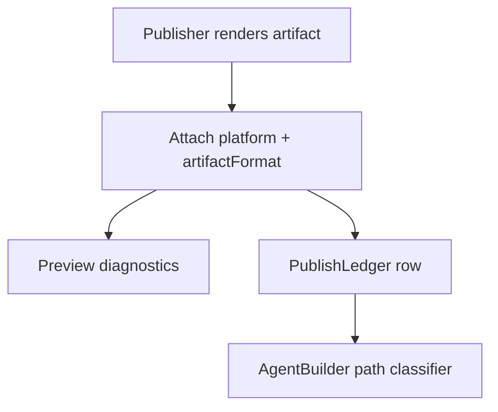
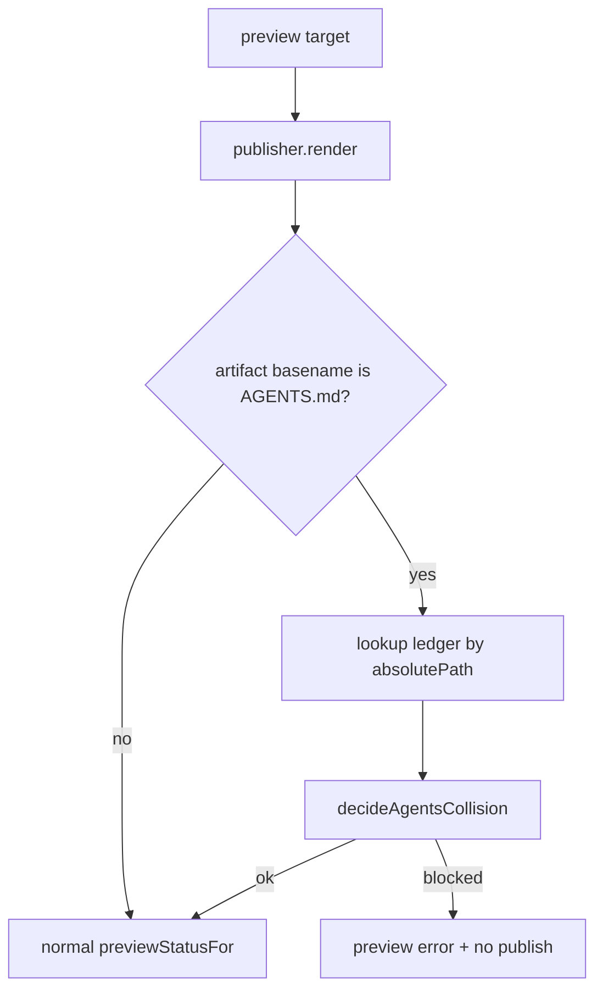
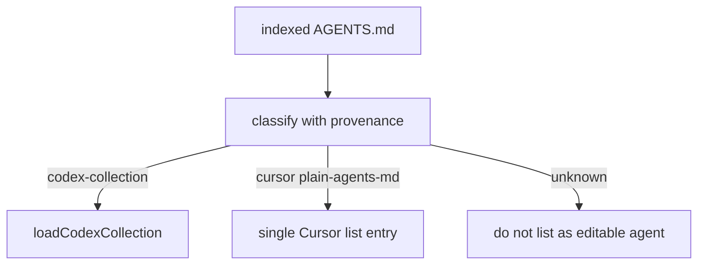
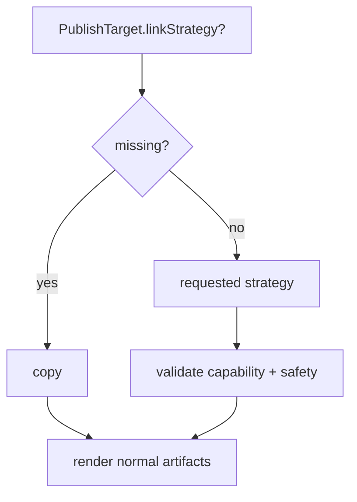
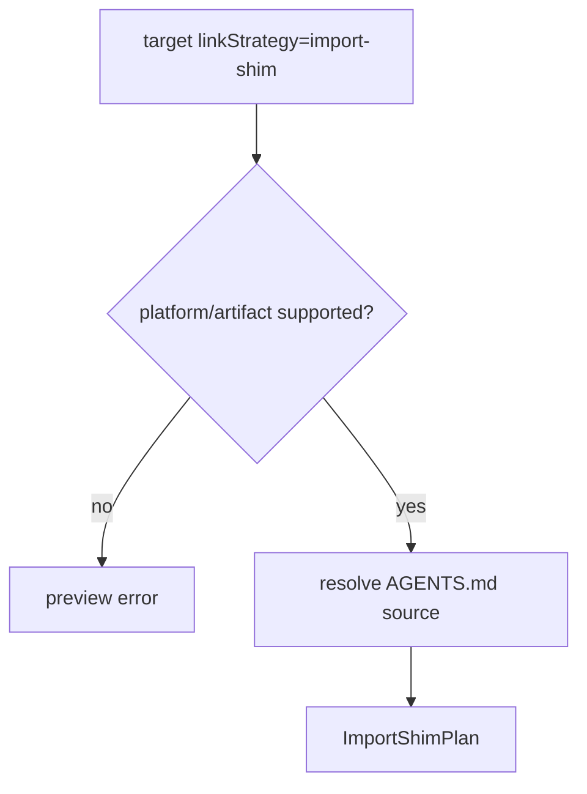
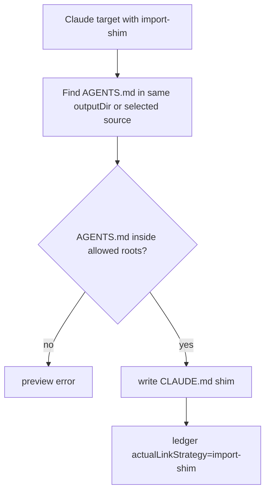
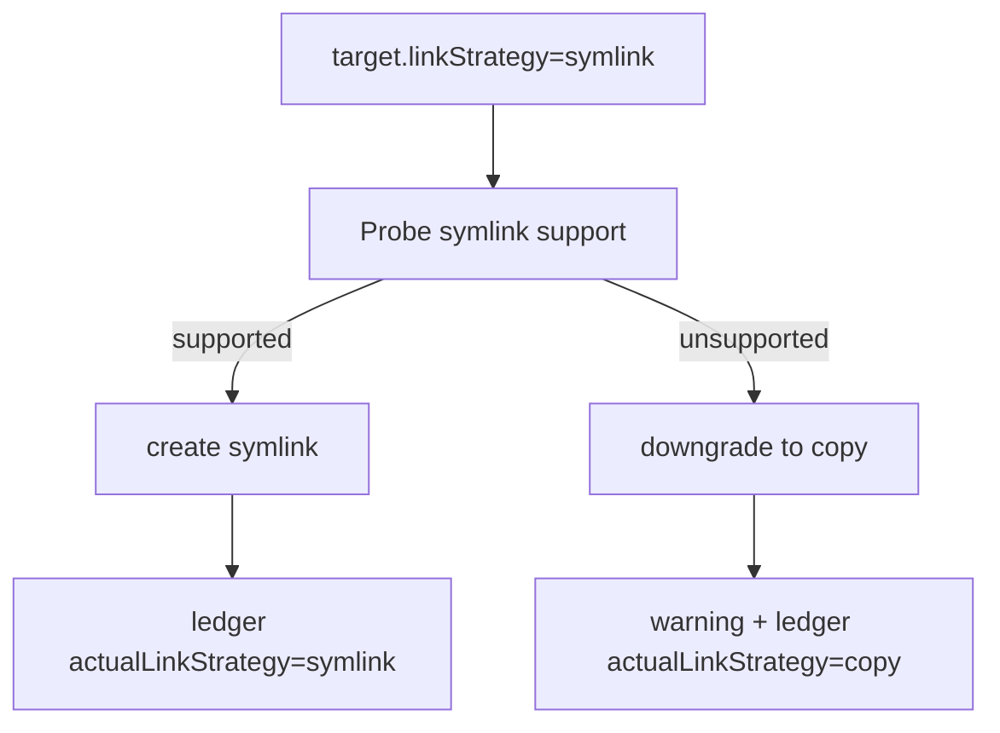
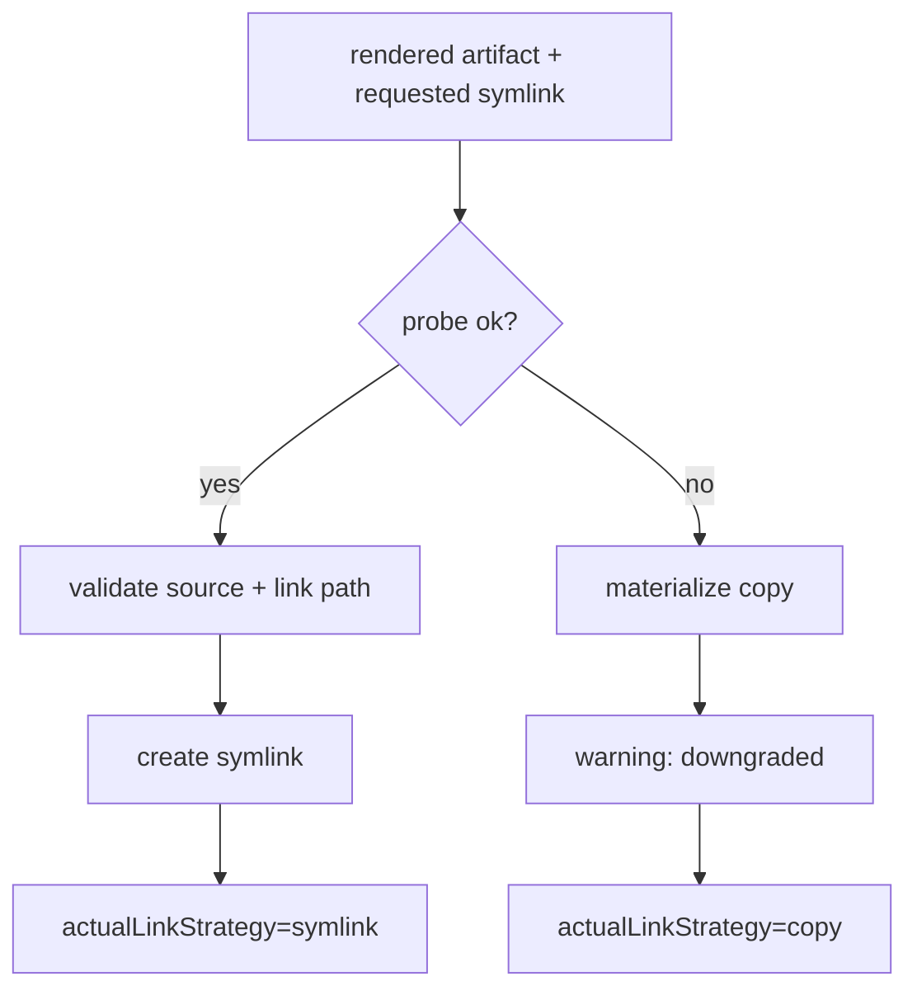
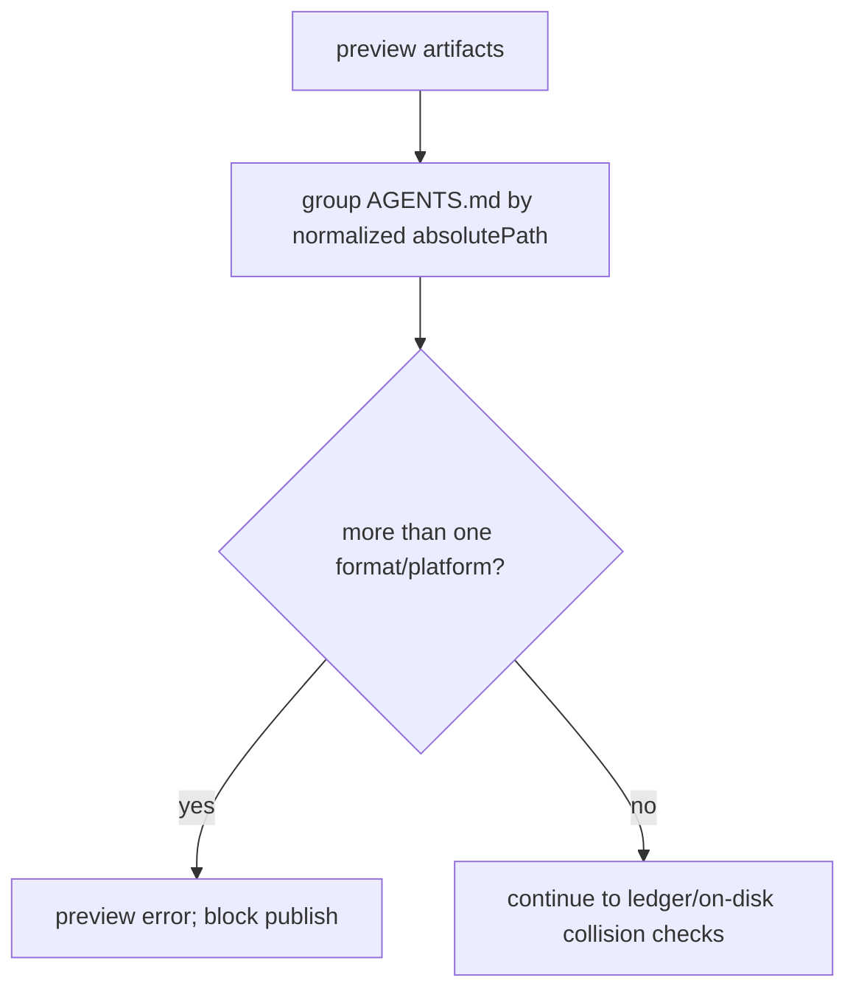

# r2ab3 - Agent Publisher Remaining Platforms and Cursor Plan

**Date**: 2026-06-21
**Scope**: Finish the next Agent Publisher wave after the r2ab3 Copilot/Claude/Codex rollout. Cursor is the priority. The plan also covers the residual Publisher consistency gap, generic `AGENTS.md` platform identity, Windsurf/Devin, Antigravity, Kiro, and optional link strategies.
**Execution posture**: Keep the current materialized-artifact backbone. Do not block Cursor on symlinks/import-shims/mentions. Add link strategies only after materialized platform support is stable.

## Mandatory Reading

| file name | line range | description |
| --- | --- | --- |
| `server/zz-reach2/architecture/agents/archi-agent-builder.md` | 10-72 | Current Builder/Publisher split, canonical-only create, legacy compatibility, and no-linking decision. |
| `server/zz-reach2/architecture/agents/archi-agent-builder.md` | 132-168 | Canonical definition, knowledge refs, publish target model, and current supported-platform caveat. |
| `server/zz-reach2/architecture/agents/archi-agent-builder.md` | 218-299 | Publisher API, lifecycle, materialization behavior, supported outputs, and unsupported platform rows. |
| `server/zz-reach2/architecture/agents/archi-agent-builder.md` | 301-336 | Index/list behavior and current gaps around generic `AGENTS.md` classification and unsupported platforms. |
| `visualizer/zz-reach2/architecture/agents/archi-agent-builder-ui.md` | 9-46 | Current visualizer product shape: Builder saves definitions, Publisher chooses platforms. |
| `visualizer/zz-reach2/architecture/agents/archi-agent-builder-ui.md` | 67-127 | App-owned Builder and Publisher state plus canonical-only create flow. |
| `visualizer/zz-reach2/architecture/agents/archi-agent-builder-ui.md` | 152-208 | PublishAgentDialog flow, platform target rows, defaults, and filename hints. |
| `visualizer/zz-reach2/architecture/agents/archi-agent-builder-ui.md` | 243-250 | UI constraints that must be closed for Cursor and other platforms. |
| `server/zz-reach2/upgrades/2026-06/r2ab2-agent-builder-2.md` | 1-7 | Implemented r2ab3 architecture choice: materialized artifacts, ledger, field-map help, and no Alternative A linking in the rollout. |
| `server/zz-reach2/upgrades/2026-06/r2ab2-agent-builder-2.md` | 523-527 | Canonical-only Builder create tasks that changed the default save path. |
| `server/zz-reach2/upgrades/2026-06/r2ab2-agent-builder-2.md` | 659-690 | PublishAgentDialog shell and platform row tasks already built. |
| `server/zz-reach2/upgrades/2026-06/r2ab2-agent-builder-2.md` | 887-898 | Remediation status for canonical persistence, platform-native defaults, markers, route errors, and drift. |
| `server/zz-reach2/upgrades/2026-06/r2ab2-agent-builder-2.md` | 996-1014 | Final residual finding: publishing existing Agent List items does not persist the converted canonical definition. |
| `server/zz-reach2/upgrades/2026-06/r2ab2-agent-builder-2-gap.md` | 31-37 | Intended seven-publisher class list, including `AgentPublisherCursor`. |
| `server/zz-reach2/upgrades/2026-06/r2ab2-agent-builder-2-gap.md` | 66-93 | Guidance and skill family tables for all target platforms, including Cursor paths and skill roots. |
| `server/zz-reach2/upgrades/2026-06/r2ab2-agent-builder-2-gap.md` | 346-386 | Target `AgentPublisher` hierarchy and per-platform responsibilities. |
| `server/zz-reach2/upgrades/2026-06/r2ab2-agent-builder-2-gap.md` | 511-518 | Broader target shape with `PublishPlatform` and future `linkStrategy`. |
| `server/zz-reach2/upgrades/2026-06/r2ab2-agent-builder-2-gap.md` | 580-585 | Remaining backend and link-strategy rollout phases. |
| `server/zz-reach2/upgrades/2026-06/skills-agents-standards-2026-codex-claude-copilot.md` | 3-15 | Baseline AGENTS/SKILL interoperability conclusions for Codex, Claude, Copilot, and Kiro. |
| `server/zz-reach2/upgrades/2026-06/skills-agents-standards-2026-codex-claude-copilot.md` | 65-169 | Codex, Claude, and Copilot artifact behavior that existing publishers must not regress. |
| `server/zz-reach2/upgrades/2026-06/skills-agents-standards-2026-codex-claude-copilot.md` | 204-269 | Kiro compatibility, steering, skills, and path precedence. |
| `server/zz-reach2/upgrades/2026-06/skills-agents-standards-2026-codex-claude-copilot.md` | 325-350 | Migration/interoperability guidance and compatibility matrix. |
| `server/zz-reach2/upgrades/2026-06/skills-agents-standards-2026-cursor-windsurf-antigravity.md` | 3-11 | Executive summary for Cursor, Windsurf, and Antigravity differences. |
| `server/zz-reach2/upgrades/2026-06/skills-agents-standards-2026-cursor-windsurf-antigravity.md` | 21-58 | Cursor AGENTS/SKILL behavior, nested merge semantics, skill roots, and Cursor-only fields. |
| `server/zz-reach2/upgrades/2026-06/skills-agents-standards-2026-cursor-windsurf-antigravity.md` | 98-139 | Windsurf/Devin AGENTS and skills behavior. |
| `server/zz-reach2/upgrades/2026-06/skills-agents-standards-2026-cursor-windsurf-antigravity.md` | 141-201 | Cross-vendor AGENTS/SKILL comparison and implementation guidance. |
| `server/src/agentPublisher/types.ts` | 1-141 | Current publish platforms, canonical definition, target, preview, ledger, drift, and capability types. |
| `server/src/agentPublisher/AgentPublisher.ts` | 30-88 | Current supported platform list and capability response behavior. |
| `server/src/agentPublisher/AgentPublisher.ts` | 103-190 | Preview/publish orchestration, publisher lookup, ledger writes, and index update callback. |
| `server/src/agentPublisher/AgentPublisher.ts` | 208-245 | Drift detection using ledger, current definition, and canonical store. |
| `server/src/agentPublisher/AgentPublisherBase.ts` | 1-77 | Current render/materialize seam where copy-only writes happen. Needed for future link strategies. |
| `server/src/agentPublisher/fileOps.ts` | 1-73 | Current atomic write, backup, and hash helpers that link strategies should reuse or sit beside. |
| `server/src/agentPublisher/pathPolicy.ts` | 1-124 | Allowed-root validation helpers that import-shim and symlink strategies must reuse. |
| `server/src/agentPublisher/PublishLedger.ts` | 1-73 | Ledger upsert and save behavior that must capture actual materialization strategy later. |
| `server/src/agentPublisher/pathContract.ts` | 1-69 | Existing platform-native default directory contract. |
| `server/src/agentPublisher/skillRenderer.ts` | 1-58 | Current portable skill rendering and platform-specific skill path helper. |
| `server/src/agentBuilder/AgentBuilder.ts` | 40-112 | Builder create response and Agent List platform type surface. |
| `server/src/agentBuilder/AgentBuilder.ts` | 694-712 | Current agent artifact path classifier that treats `AGENTS.md` as Codex. |
| `server/src/agentBuilder/AgentBuilder.ts` | 1582-1850 | Agent list/get-agent behavior and current Codex collection assumptions. |
| `server/src/agentBuilder/AgentBuilder.ts` | 2068-2098 | Publisher-to-Builder index update hook. |
| `visualizer/src/components/agentPublisher/PublishAgentDialog.tsx` | 38-190 | Platform order, target-state creation, capability loading, preview, and publish payload assembly. |
| `visualizer/src/components/agentPublisher/PublishAgentDialog.tsx` | 217-344 | Platform row rendering, path tree selection, preview list, and confirm publish behavior. |
| `visualizer/src/components/agentPublisher/PlatformTargetRow.tsx` | 1-82 | Current platform-row controls that would receive a strategy selector. |
| `visualizer/src/components/agentPublisher/publishUtils.ts` | 1-44 | UI default-directory and filename-hint behavior that must be updated for Cursor. |

## Acceptance Outcomes

- Cursor can be selected in Publisher and can publish materialized Cursor agent and skill artifacts with safe defaults and preview.
- Cursor artifacts do not corrupt or get misclassified as Codex collections.
- Existing publish-from-Agent-List flows persist their converted canonical definition before publish.
- Copilot, Claude, and Codex existing tests continue to pass.
- Windsurf, Antigravity, and Kiro have either implemented materialized support or explicitly documented disabled capability rows with follow-up tasks.
- Link strategies are either implemented as opt-in behavior or explicitly deferred with UI/API types remaining coherent.

{{SIMPLE}}
## 1.

- [X] Re-open `server/src/agentPublisher/AgentPublisher.ts` and confirm the active supported list is still only `copilot`, `claude`, and `codex`.
- [X] Re-open `server/src/agentPublisher/types.ts` and confirm `PublishPlatform` still includes `cursor`, `kiro`, `windsurf`, and `antigravity`.
- [X] Re-open `visualizer/src/components/agentPublisher/PublishAgentDialog.tsx` and confirm unsupported platform rows are rendered but disabled through `supportedArtifactKinds`.
- [X] Re-open `server/src/agentBuilder/AgentBuilder.ts` and confirm generic `AGENTS.md` paths are still classified as Codex.
- [X] Re-open `server/src/agentPublisher/tests` and list the current publisher tests that must remain green.
- [X] Re-open `visualizer/src/components/agentPublisher/*.test.*` and list current UI utility tests.
- [X] Add dated runtime audit notes to this plan with any code drift discovered before implementation.

{{MEDIUM}}
## 2.

- [X] Close the publish-from-existing-agent canonical store gap by deciding whether persistence belongs in the client conversion path or in the server publish route.
- [X] Prefer server-side persistence: add an optional canonical-store upsert inside `AgentPublisher.publish()` before ledger writes when a store is available.
- [X] Ensure the upsert is idempotent and keyed by `CanonicalAgentDefinition.id`.
- [X] Return a publish warning only if canonical persistence fails after artifacts were not written; avoid partial writes with an untracked definition.
- [X] Add a backend test that publishes a browser-converted legacy definition and can reload it through `GET /api/agent-builder/get-definition`.
- [X] Add a regression test that Builder-created definitions still persist exactly once.
- [X] Update `r2ab2-agent-builder-2.md` final residual status after this gap is fixed.

{{MEDIUM}}
## 3.

ASSUMPTION: this was already built previously. If not, re-asses at runtime: Groups 1-2 are complete, and current Publisher/Builder code still matches the Mandatory Reading table.

Goal: give generic `AGENTS.md` files an explicit provenance shape before Cursor is enabled.

```ts
export type AgentsArtifactFormat =
	| "codex-collection"
	| "plain-agents-md"
	| "plain-agents-override-md";

export interface PublishedArtifactProvenance {
	platform: PublishPlatform;
	artifactKind: ArtifactKind;
	artifactFormat?: AgentsArtifactFormat;
	canonicalId?: string;
}
```



- [X] Add an `AgentsArtifactFormat` type in `server/src/agentPublisher/types.ts`.
- [X] Add optional `artifactFormat?: AgentsArtifactFormat` to `RenderedArtifact`.
- [X] Add optional `artifactFormat?: AgentsArtifactFormat` to `PublishLedgerEntry`.
- [X] Set `artifactFormat: "codex-collection"` only from `AgentPublisherCodex` for `AGENTS.md` collection artifacts.
- [X] Plan Cursor/Windsurf/Kiro/Antigravity `AGENTS.md` renderers to set `artifactFormat: "plain-agents-md"`.
- [X] Default missing legacy ledger `artifactFormat` to unknown behavior, not Cursor behavior.
- [X] Add unit coverage for serializing and loading ledger rows with and without `artifactFormat`.

{{MEDIUM}}
## 4.

ASSUMPTION: this was already built previously. If not, re-asses at runtime: Group 3 is complete and rendered artifacts can carry `artifactFormat`.

Goal: isolate `AGENTS.md` collision rules behind a small helper before wiring it into preview.

```ts
type AgentsCollisionDecision =
	| { ok: true; mode: "same-platform-replace" | "compatible-generated" }
	| { ok: false; reason: string };

function decideAgentsCollision(existing: PublishedArtifactProvenance | undefined, incoming: PublishedArtifactProvenance): AgentsCollisionDecision {
	if (!existing) return { ok: true, mode: "compatible-generated" };
	if (existing.platform === incoming.platform && existing.artifactFormat === incoming.artifactFormat) {
		return { ok: true, mode: "same-platform-replace" };
	}
	return { ok: false, reason: "Existing generated AGENTS.md belongs to a different platform format." };
}
```

- [X] Add a small collision helper near Publisher orchestration, such as `server/src/agentPublisher/agentsCollision.ts`.
- [X] Make the helper compare existing provenance by absolute path.
- [X] Treat same platform plus same `artifactFormat` as replaceable generated output.
- [X] Treat Codex `codex-collection` versus Cursor `plain-agents-md` as incompatible.
- [X] Treat unmanaged files with no generated marker and no ledger provenance as backup candidates, not compatible generated files.
- [X] Return a short user-facing reason for incompatible generated collisions.
- [X] Keep the first policy strict: no shared multi-platform `AGENTS.md` file in this batch.

{{MEDIUM}}
## 5.

ASSUMPTION: this was already built previously. If not, re-asses at runtime: Groups 3-4 are complete and collision decisions can explain incompatible `AGENTS.md` targets.

Goal: wire collision diagnostics into preview without changing materialization yet.



- [X] Add a ledger lookup helper for entries by `absolutePath`, or derive one locally without changing upsert keys.
- [X] In `AgentPublisher.preview()`, inspect rendered `AGENTS.md` artifacts before returning.
- [X] Use the collision helper only for generated `AGENTS.md` style artifacts.
- [X] Add preview errors for incompatible generated collisions before any files are written.
- [X] Preserve unmanaged backup behavior for files without generated provenance.
- [X] Add a route-level preview test for Codex then Cursor targeting the same `AGENTS.md`.
- [X] Add a route-level preview test proving unmanaged root `AGENTS.md` still reports backup behavior.

{{MEDIUM}}
## 6.

ASSUMPTION: this was already built previously. If not, re-asses at runtime: Groups 3-5 are complete and Publisher preview blocks incompatible generated collisions.

Goal: teach AgentBuilder to classify generic `AGENTS.md` from provenance, while keeping unmanaged files conservative.

```ts
type AgentArtifactClassification =
	| { platform: "codex"; artifactFormat: "codex-collection" }
	| { platform: "cursor" | "windsurf" | "kiro" | "antigravity"; artifactFormat: "plain-agents-md" }
	| { platform: "unknown"; artifactFormat?: undefined };
```

- [X] Add a tiny classifier helper beside `isCodexAgentsMdPath()` instead of expanding every call site inline.
- [X] Let `AGENTS.md` classify as Codex only when path shape or provenance indicates `codex-collection`.
- [X] Let `AGENTS.md` classify as Cursor only when ledger or generated metadata indicates Cursor.
- [X] Keep unmanaged `AGENTS.md` as `unknown` unless explicit provenance is present.
- [X] Update `isAnyAgentDefinitionPath()` callers to use the classifier where platform identity matters.
- [X] Update the `get-agent` error copy so generic `AGENTS.md` is not described as always Codex.
- [X] Add a small architecture note that provenance is required for plain `AGENTS.md` platform identity.

{{MEDIUM}}
## 7.

ASSUMPTION: this was already built previously. If not, re-asses at runtime: Groups 3-6 are complete and `AgentBuilder` has a classifier seam.

Goal: close the generic `AGENTS.md` test matrix before Cursor publishing is enabled.

- [X] Add an AgentBuilder unit test for Codex `AGENTS.md` collection classification.
- [X] Add an AgentBuilder unit test for Cursor plain `AGENTS.md` classification with provenance.
- [X] Add an AgentBuilder unit test proving unmanaged `AGENTS.md` is not parsed as Cursor.
- [X] Add a Publisher preview test for cross-platform same-path conflict.
- [X] Add a Publisher preview test proving same-platform generated replacement is allowed.
- [X] Add a Publisher publish test proving ledger rows include `artifactFormat`.
- [X] Update `archi-agent-builder.md` with the collision and provenance policy.

{{MEDIUM}}
## 8.

- [X] Extend the canonical model with optional platform-neutral publishing hints needed by Cursor skills, such as `paths?: string[]`.
- [X] Add an optional Cursor-specific hint for `disable-model-invocation` using a TypeScript-friendly property name and renderer mapping.
- [X] Update `toCanonicalAgentDefinition()` and `fromCanonicalAgentDefinition()` to preserve new optional fields without breaking legacy callers.
- [X] Update visualizer mirrored types for the new optional fields.
- [X] Add tests proving old canonical JSON still loads when the new fields are absent.
- [X] Add tests proving metadata and paths survive canonical store round trips.
- [X] Keep the Builder form unchanged unless a later UI task explicitly adds controls for the new hints.

{{MEDIUM}}
## 9.

ASSUMPTION: this was already built previously. If not, re-asses at runtime: Groups 3-8 are complete, including `artifactFormat` and Cursor canonical hints.

Goal: add the Cursor publisher as a plain materialized renderer.

```ts
export class AgentPublisherCursor extends AgentPublisherBase {
	readonly platform = "cursor" as const;

	render(def: CanonicalAgentDefinition, target: PublishTarget): RenderedArtifact[] {
		return [{
			absolutePath: this.joinOutput(target.outputDir, "AGENTS.md"),
			content: renderCursorAgentMarkdown(def),
			platform: this.platform,
			artifactKind: target.artifactKind,
			artifactFormat: "plain-agents-md",
		}];
	}
}
```

- [X] Create `server/src/agentPublisher/platforms/AgentPublisherCursor.ts`.
- [X] Implement Cursor agent rendering as plain Markdown `AGENTS.md` with no YAML frontmatter and no Codex collection markers.
- [X] Render Cursor agent body from description, optional when-to-use, argument hint, tools as prose, and knowledge references.
- [X] Implement Cursor skill rendering to the portable default `.agents/skills/<id>/SKILL.md`.
- [X] Include Cursor skill frontmatter fields `name`, `description`, optional `paths`, optional `disable-model-invocation`, and `metadata`.
- [X] Emit the platform-neutral generated marker in Cursor artifacts.
- [X] Add snapshot tests for Cursor agent and Cursor skill output.
- [X] Add unmanaged backup tests for Cursor `AGENTS.md` and `SKILL.md`.

{{MEDIUM}}
## 10.

- [X] Extend `pathContract.ts` so Cursor defaults to `agentOutputDir = projectRoot` and `skillRootDir = projectRoot`.
- [X] Add optional config support for Cursor-specific publish roots through existing `publishRoots.cursor`.
- [X] Update `skillRenderer.resolveSkillPath()` or Cursor publisher-local path handling so Cursor skills write `.agents/skills/<id>/SKILL.md`.
- [X] Add tests for Cursor default paths from `projectRoot`, inferred `.github/agents`, and explicit `publishRoots.cursor`.
- [X] Register `AgentPublisherCursor` in `AgentPublisher.publishers`.
- [X] Add `cursor` to `SUPPORTED_PLATFORMS` only after path, render, preview, and conflict tests pass.
- [X] Ensure `/api/agent-publisher/platforms?projectName=...` returns Cursor supported artifact kinds and defaults.

{{MEDIUM}}
## 11.

- [X] Update `visualizer/src/components/agentPublisher/publishUtils.ts` so Cursor agent hints show `{outputDir}/AGENTS.md`.
- [X] Update Cursor skill hints so the UI shows `{skillRoot}/.agents/skills/{id}/SKILL.md`.
- [X] Ensure `PublishAgentDialog` does not preselect Cursor by default until product choice says it should.
- [X] Ensure selecting Cursor and Agent produces a valid preview payload with `platform: "cursor"` and the selected output dir.
- [X] Ensure selecting Cursor and Skill produces a valid preview payload with the selected skill root.
- [X] Add UI utility tests for Cursor filename hints.
- [X] Add component or integration tests for Cursor row enabled/disabled behavior based on capabilities.
- [X] Update `archi-agent-builder-ui.md` with Cursor target-row behavior.

{{MEDIUM}}
## 12.

ASSUMPTION: this was already built previously. If not, re-asses at runtime: Groups 3-11 are complete and Cursor artifacts carry provenance through preview/publish.

Goal: decide and implement the Agent List policy for Cursor without touching Codex collection semantics.

```ts
type FlatEntry = {
	name: string;
	platform: "github" | "claude" | "codex" | "cursor";
	path: string;
	artifactFormat?: AgentsArtifactFormat;
	codexEntryId?: string; // codex only
};
```



- [X] Update `AgentBuilder.list()` to include Cursor artifacts only when provenance says the file is a Cursor artifact.
- [X] Decide whether Cursor `AGENTS.md` should appear in Agent List as one logical agent or as project guidance; implement the chosen behavior consistently.
- [X] Avoid using Codex `codexEntryId` semantics for Cursor plain `AGENTS.md`.
- [X] Add tests that Cursor published artifacts appear in `/prepare` after publish.
- [X] Add tests that Cursor artifacts do not inflate Codex collection entries.
- [X] Preserve existing GitHub, Claude, and Codex grouping behavior.
- [X] Document the selected Cursor Agent List policy in `archi-agent-builder.md`.
- [X] Add UI copy only if Cursor list entries need a distinct platform label.

{{MEDIUM}}
## 13.

ASSUMPTION: this was already built previously. If not, re-asses at runtime: Group 12 is complete and Cursor list entries have a stable policy.

Goal: make Cursor retrieval explicit, not an accidental Codex fallback.

```ts
if (classification.platform === "cursor") {
	return {
		agent: reconstructCursorPlainAgent(readFileSync(agentPath, "utf8"), indexed.sourceName, agentPath),
	};
}
```

- [X] Add `reconstructCursorPlainAgent()` or a similarly named helper near existing reconstruction helpers.
- [X] In `getAgent()`, branch on Cursor classification before the Codex collection branch.
- [X] Return `platform: "cursor"` from the Cursor retrieval branch.
- [X] Leave `codexEntryId` undefined for Cursor responses.
- [X] Reuse generated metadata or canonical store data when available for description, tools, and knowledge.
- [X] Fall back to conservative Markdown reconstruction when metadata is unavailable.
- [X] Return a clear 404 or unsupported error if the selected policy excludes Cursor edit/list.

{{MEDIUM}}
## 14.

ASSUMPTION: this was already built previously. If not, re-asses at runtime: Groups 12-13 are complete.

Goal: pin Cursor AgentBuilder behavior with focused tests.

- [X] Add a test that Cursor published artifacts appear in `/prepare` after publish.
- [X] Add a test that Cursor `get-agent` returns `platform: "cursor"` with no `codexEntryId`.
- [X] Add a test that Cursor artifacts do not inflate Codex collection entries.
- [X] Add tests for editing or publishing from a Cursor Agent List card if Cursor is included in Agent List.
- [X] Document any deliberately unsupported Cursor edit/list behavior.
- [X] Add a regression test that multi-entry Codex `AGENTS.md` still requires `codexEntryId`.
- [X] Add a regression test that GitHub and Claude file detection is unchanged.

{{MEDIUM}}
## 15.

- [X] Add backend route tests for Cursor `/preview` success.
- [X] Add backend route tests for Cursor `/publish` success and ledger rows.
- [X] Add backend route tests for Cursor drift states: clean, disk-changed, missing-file, and canonical-changed.
- [X] Add an integration test that publishes Cursor agent and skill artifacts in a fixture project.
- [X] Add a regression test that Codex preview/publish still handles `AGENTS.json` collection updates.
- [X] Add a regression test that Copilot and Claude default paths remain platform-native.
- [X] Run `bun run typecheck` in `server/`.
- [X] Run `bun run test` in `server/`.

{{SIMPLE}}
## 16.

- [X] Add a manual verification checklist for Cursor in this plan.
- [ ] Manually preview a Cursor agent at project root and inspect the rendered `AGENTS.md`.
- [ ] Manually publish a Cursor agent to a temporary fixture and confirm the ledger row is written.
- [ ] Manually preview a Cursor skill and confirm the `.agents/skills/<id>/SKILL.md` path.
- [ ] Manually verify repeated Cursor publish does not create unmanaged backups for generated files.
- [ ] Manually verify a Codex publish after Cursor publish does not silently overwrite incompatible `AGENTS.md`.
- [ ] Record verification commands and results in this plan.

{{MEDIUM}}
## 17.

- [X] Create `server/src/agentPublisher/platforms/AgentPublisherWindsurf.ts`.
- [X] Render Windsurf/Devin agent guidance as plain `AGENTS.md` or `agents.md` according to the selected target policy.
- [X] Default Windsurf agent output to `projectRoot`, with heat suggested placement visible in the UI.
- [X] Render Windsurf skills to `.windsurf/skills/<id>/SKILL.md` for native support.
- [X] Consider `.agents/skills/<id>/SKILL.md` as an optional portability mode, but keep the first implementation single-path.
- [X] Add generated marker, preview status, backup, ledger, and drift tests.
- [X] Register Windsurf only after route and publisher tests pass.

{{MEDIUM}}
## 18.

- [X] Create `server/src/agentPublisher/platforms/AgentPublisherAntigravity.ts`.
- [X] Render Antigravity agent guidance as root `AGENTS.md` by default.
- [X] Add optional `GEMINI.md` mirror support only if the target contract can represent sidecar/mirror artifacts safely.
- [X] Render Antigravity skills to `.agents/skills/<id>/SKILL.md` as the portable default.
- [X] Explicitly avoid the non-portable `.agents/agents.md` plus `.agents/skills/*.md` orchestration pattern.
- [X] Add tests for `AGENTS.md`, optional `GEMINI.md` if implemented, and skill output.
- [X] Register Antigravity only after tests and collision policy coverage pass.

{{MEDIUM}}
## 19.

- [X] Create `server/src/agentPublisher/platforms/AgentPublisherKiro.ts`.
- [X] Render Kiro compatibility guidance as root `AGENTS.md`.
- [X] Decide whether native `.kiro/steering/*.md` mirrors are in this batch or a later opt-in feature.
- [X] Render Kiro skills to `.kiro/skills/<id>/SKILL.md`.
- [X] Add tests for root guidance, skill path, default path contract, ledger, and drift.
- [X] Register Kiro only after tests and AGENTS collision coverage pass.
- [X] Document that richer Kiro steering inclusion modes are outside the first materialized support pass if not implemented.

{{MEDIUM}}
## 20.

ASSUMPTION: this was already built previously. If not, re-asses at runtime: Groups 17-19 are complete or any unimplemented platforms remain disabled with empty `supportedArtifactKinds`.

Goal: make backend capability metadata descriptive enough that the UI can stop hardcoding every path shape.

```ts
export interface PlatformArtifactTemplate {
	artifactKind: ArtifactKind;
	rootKey: "agentOutputDir" | "skillRootDir" | "projectRoot";
	relativePathTemplate: string;
	note?: string;
}

export interface PlatformCapability {
	platform: PublishPlatform;
	label: string;
	supportedArtifactKinds: ArtifactKind[];
	defaultDirs?: PlatformDefaultDirs;
	artifactTemplates?: PlatformArtifactTemplate[];
	notes?: string[];
}
```

- [X] Generalize platform capability metadata so the UI can describe native path shapes beyond `agentOutputDir` and `skillRootDir`.
- [X] Add optional platform notes to `/api/agent-publisher/platforms`, such as "Cursor AGENTS merges with ancestors" or "Windsurf subdirs become glob rules".
- [X] Add optional target profiles if one platform supports both native and portable skill roots.
- [X] Add `artifactTemplates` for Copilot, Claude, Codex, and Cursor first.
- [X] Keep `defaultDirs` in place for backward compatibility during the UI migration.
- [X] Add a backend unit or route test for each template's rendered relative path.
- [X] Document the capability response shape in `archi-agent-builder.md`.

{{MEDIUM}}
## 21.

ASSUMPTION: this was already built previously. If not, re-asses at runtime: Group 20 is complete and `/api/agent-publisher/platforms` returns template metadata.

Goal: move Publisher UI filename hints onto backend-provided templates.

```tsx
function resolveTemplatePath(template: string, values: { id: string; name: string }): string {
	return template
		.replaceAll("{id}", values.id)
		.replaceAll("{name}", values.name);
}
```

- [X] Update `PublishAgentDialog` to show platform notes without cluttering supported Copilot/Claude/Codex rows.
- [X] Update filename hints to use backend-provided artifact path templates where possible instead of hardcoding every platform in the UI.
- [X] Add tests proving frontend hints match backend-rendered preview paths for all supported platforms.
- [X] Keep unsupported platform rows disabled with clear copy until their backend publishers are registered.
- [X] Keep `resolveFilenameHint()` fallback behavior for older backend responses.
- [X] Add visualizer type coverage for optional `artifactTemplates` and `notes`.
- [X] Update `archi-agent-builder-ui.md` with the capability metadata flow.

{{MEDIUM}}
## 22.

ASSUMPTION: this was already built previously. If not, re-asses at runtime: Groups 1-21 have landed, Cursor materialized publishing is stable, and `AgentPublisherBase.materializeArtifacts()` is still the central write seam.

Goal: turn link strategies from a vague concept into a typed contract without changing runtime behavior yet.

```ts
export type LinkStrategy = "copy" | "import-shim" | "symlink";

export interface PublishTarget {
    platform: PublishPlatform;
    artifactKind: ArtifactKind;
    outputDir: string;
    codexEntryId?: string;
    linkStrategy?: LinkStrategy; // omitted means "copy"
}
```



- [X] Add `LinkStrategy` to `server/src/agentPublisher/types.ts` with `copy`, `import-shim`, and `symlink`.
- [X] Add optional `linkStrategy?: LinkStrategy` to `PublishTarget`, defaulting behavior to `copy` when omitted.
- [X] Add optional `requestedLinkStrategy?: LinkStrategy` and `actualLinkStrategy?: LinkStrategy` to `RenderedArtifact` or a small nested materialization metadata shape.
- [X] Add optional `supportedLinkStrategies?: LinkStrategy[]` to `PlatformCapability`.
- [X] Keep existing publish payloads valid by treating missing strategy as `copy` everywhere.
- [X] Add type-level or unit tests that old `PublishTarget` objects still compile or validate.
- [X] Add a short architecture note that this batch only adds the contract, not new behavior.

{{MEDIUM}}
## 23.

ASSUMPTION: this was already built previously. If not, re-asses at runtime: Group 22 is complete and `copy` remains the only behavior used by default.

Goal: make `copy` explicit and record it without changing platform output.

```ts
const requested = target.linkStrategy ?? "copy";
const actual = requested === "copy" ? "copy" : requested;
```

- [X] Update `AgentPublisher.preview()` so rendered artifacts carry requested/actual strategy metadata for copy targets.
- [X] Update `AgentPublisher.publish()` so ledger rows record the actual strategy used.
- [X] Add `linkStrategy?: LinkStrategy` or `actualLinkStrategy?: LinkStrategy` to `PublishLedgerEntry`.
- [X] Keep `PublishLedger.upsert()` key unchanged so existing rows are replaced rather than duplicated.
- [X] Add a migration-safe default when loading older ledger entries with no strategy field.
- [X] Add tests proving existing copy-only publish still writes the same files and hashes.
- [X] Add tests proving new ledger rows include `copy`.

{{MEDIUM}}
## 24.

ASSUMPTION: this was already built previously. If not, re-asses at runtime: Groups 22-23 are complete, and Claude/Copilot/Codex plus Cursor materialized publishing are stable.

Goal: define the smallest supported import-shim input contract before adding writes.

```ts
type ImportShimPlan = {
	platform: "claude";
	artifactKind: "agent";
	shimPath: string;
	importedPath: string;
	relativeImport: string;
};
```



- [X] Define import-shim support as `platform=claude` and `artifactKind=agent` only.
- [X] Add a helper that returns an `ImportShimPlan` or a user-facing error.
- [X] Let the first source resolution look for an `AGENTS.md` in the same selected output root.
- [X] Allow a later source-selection parameter only if `PublishTarget` can express it safely.
- [X] Return preview errors for unsupported platforms requesting `import-shim`.
- [X] Keep Claude sub-agent materialization unchanged when `linkStrategy` is omitted.
- [X] Add unit tests for supported and unsupported import-shim target requests.

{{MEDIUM}}
## 25.

ASSUMPTION: this was already built previously. If not, re-asses at runtime: Group 24 is complete and `ImportShimPlan` exists.

Goal: implement the smallest useful non-copy strategy: Claude `CLAUDE.md` import shim for project guidance. This is not a replacement for Claude sub-agent files; it is an optional guidance bridge to an existing `AGENTS.md`.

```md
@AGENTS.md

<!-- Generated by ContextCore AgentPublisher -->
```



- [X] Add a helper that builds the shim content with a relative `@AGENTS.md`-style import path.
- [X] Validate both the shim output path and imported file path through existing path allow-list logic.
- [X] Return preview errors when an import target would point outside allowed roots.
- [X] Write the shim through existing generated-marker, backup, and atomic-write helpers.
- [X] Set requested and actual strategy metadata to `import-shim` for the rendered shim artifact.
- [X] Keep the shim content tiny and deterministic so snapshot tests are readable.
- [X] Add a preview test for a blocked import path outside allowed roots.

{{MEDIUM}}
## 26.

ASSUMPTION: this was already built previously. If not, re-asses at runtime: Groups 24-25 are complete and import-shim preview writes metadata.

Goal: close import-shim integration coverage before adding symlinks.

- [X] Add tests for successful same-directory shim output.
- [X] Add tests for nested relative imports such as `@../AGENTS.md` only when allowed by `pathPolicy`.
- [X] Add tests for blocked import paths outside allowed roots.
- [X] Add a publish test proving unmanaged existing `CLAUDE.md` is backed up before shim write.
- [X] Add a ledger test proving `actualLinkStrategy: "import-shim"` is recorded.
- [X] Add a drift test proving shim content participates in normal artifact hash checks.
- [X] Update docs with the first supported import-shim case and explicit non-goals.

{{MEDIUM}}
## 27.

ASSUMPTION: this was already built previously. If not, re-asses at runtime: Groups 22-26 are complete and import-shim behavior is tested.

Goal: add a symlink capability probe that can be tested independently of publishing.

```ts
export type SymlinkProbe = () => boolean;

export function probeSymlinkSupport(tempRoot: string): boolean {
	// create temp source, create temp symlink, clean up, return success
}
```



- [X] Add a small symlink capability probe that runs in a temp directory and cleans up after itself.
- [X] Keep symlink probing separate from publish execution so preview can report whether a downgrade is likely.
- [X] Add tests for supported symlink behavior where practical on the host.
- [X] Add tests for forced downgrade using an injectable probe result.
- [X] Make preview consume the probe result without creating final symlinks.
- [X] Keep the default strategy as `copy` regardless of probe result.

{{MEDIUM}}
## 28.

ASSUMPTION: this was already built previously. If not, re-asses at runtime: Group 27 is complete and symlink support can be probed.

Goal: add a file-operation helper for symlink creation that mirrors existing backup safety.

```ts
type SymlinkWriteOptions = {
	sourcePath: string;
	linkPath: string;
	generatedMarkers: string[];
};
```

- [X] Add a helper in `fileOps.ts` or a sibling module that creates parent directories for the link path.
- [X] Back up unmanaged existing files before replacing them with a symlink.
- [X] Replace generated existing files or symlinks without creating duplicate backups.
- [X] Validate source and destination paths before calling the helper.
- [X] Use platform-appropriate `fs.symlinkSync` type only after confirming what Node expects on Windows.
- [X] Add unit tests for existing generated file, unmanaged file, and existing symlink cases.
- [X] Keep atomic text writes unchanged for copy and import-shim strategies.

{{MEDIUM}}
## 29.

ASSUMPTION: this was already built previously. If not, re-asses at runtime: Groups 27-28 are complete and the symlink helper is covered.

Goal: integrate symlink as an opt-in strategy with safe downgrade to copy.



- [X] Restrict symlink source and destination paths to allowed roots before creating the link.
- [X] Downgrade to copy with a warning when symlink creation is unavailable or rejected by the OS.
- [X] Store both requested `symlink` and actual `copy` or `symlink` in preview metadata.
- [X] Store both requested `symlink` and actual `copy` or `symlink` in publish metadata.
- [X] Keep materialization grouped by platform so existing publisher ownership stays intact.
- [X] Ensure downgraded copies use the same generated marker and backup helpers as normal copy.
- [X] Add publish-result warnings that include the target path and the fallback strategy.
- [X] Keep symlink unavailable for unsupported platforms until capability metadata says otherwise.

{{MEDIUM}}
## 30.

ASSUMPTION: this was already built previously. If not, re-asses at runtime: Group 29 is complete and symlink downgrade metadata reaches preview/publish.

Goal: close symlink behavior with predictable tests.

- [X] Add a route preview test for requested symlink when the probe says supported.
- [X] Add a route preview test for requested symlink when the probe forces downgrade.
- [X] Add a publish test proving downgrade writes a normal file and records `actualLinkStrategy: "copy"`.
- [X] Add a publish test proving supported symlink records `actualLinkStrategy: "symlink"` where host support allows.
- [X] Add a test proving drift compares artifact content or downgraded copy content consistently.
- [X] Add docs for Windows symlink downgrade expectations.

{{MEDIUM}}
## 31.

ASSUMPTION: this was already built previously. If not, re-asses at runtime: Groups 22-30 are complete and backend capabilities expose supported strategies.

Goal: expose strategy selection in the Publisher UI without disrupting the existing default path.

```tsx
type TargetState = {
    selected: boolean;
    artifactKind: ArtifactKind;
    outputDir: string;
    linkStrategy: LinkStrategy;
};
```

- [X] Mirror `LinkStrategy` and the optional strategy fields in `visualizer/src/types.ts`.
- [X] Extend `TargetState` in `PublishAgentDialog.tsx` with `linkStrategy`, defaulting every row to `copy`.
- [X] Add `linkStrategy` to `makePublishTargetsFromState()` payloads only when selected.
- [X] Extend `PlatformTargetRow.tsx` with a compact strategy selector shown only when more than one strategy is supported.
- [X] Render unavailable strategies as disabled options with a short title or hint.
- [X] Show requested/actual strategy in preview rows when the backend returns downgrade metadata.
- [X] Add UI utility tests for default copy payloads and explicit non-copy payloads.
- [X] Keep all existing Copilot/Claude/Codex copy-only tests passing.

{{MEDIUM}}
## 32.

ASSUMPTION: this was already built previously. If not, re-asses at runtime: Groups 22-31 are complete and link strategies are available through preview and publish.

Goal: close test coverage for link strategy behavior before turning it into product copy.

- [X] Add route tests for `/api/agent-publisher/platforms` returning strategy capability metadata.
- [X] Add route tests for `/api/agent-publisher/preview` with `copy`, `import-shim`, and `symlink`.
- [X] Add route tests for `/api/agent-publisher/publish` recording requested and actual strategies in ledger rows.
- [X] Add a drift test proving strategy metadata does not change artifact hash comparisons.
- [X] Add a visualizer test proving unsupported rows do not show a strategy selector.
- [X] Add a visualizer test proving a symlink downgrade warning appears in preview/publish output.
- [X] Run server and visualizer type checks after the strategy batches.

{{SIMPLE}}
## 33.

- [X] Update `server/zz-reach2/architecture/agents/archi-agent-builder.md` after each platform backend is enabled.
- [X] Update `visualizer/zz-reach2/architecture/agents/archi-agent-builder-ui.md` after each UI capability change.
- [X] Add release notes for Cursor support once the Cursor batch passes verification.
- [X] Add troubleshooting notes for incompatible `AGENTS.md` collisions.
- [X] Add troubleshooting notes for unsupported platform rows and how to enable them.
- [X] Add troubleshooting notes for link-strategy downgrades after link strategies ship.
- [X] Add examples of recommended Cursor root and nested `AGENTS.md` placement.
- [X] Keep all task checkboxes in this plan updated as implementation proceeds (groups 1–33 automated; group 16/34 manual items pending).

---

## Runtime Audit Notes (2026-06-21)

Seams verified before implementation:

- `SUPPORTED_PLATFORMS` was `copilot`, `claude`, `codex` only — extended to all seven materialized publishers.
- `PublishPlatform` union already included `cursor`, `kiro`, `windsurf`, `antigravity`.
- `PublishAgentDialog` rendered unsupported rows via empty `supportedArtifactKinds`.
- `AgentBuilder` treated all `AGENTS.md` paths as Codex — replaced with `agentArtifactClassifier.ts` + ledger provenance.
- Publisher tests in `server/src/agentPublisher/tests/` (19+ files); UI utility tests in `publishUtils.test.ts`.

## Automated Verification (2026-06-21)

- `bun run typecheck` in `server/`: passed.
- `bun run test` in `server/`: passed, **359** tests (includes `r2ab3.test.ts`).
- `npm run build` in `visualizer/`: passed.
- New modules: `AgentPublisherCursor`, `AgentPublisherWindsurf`, `AgentPublisherAntigravity`, `AgentPublisherKiro`, `agentsCollision.ts`, `agentArtifactClassifier.ts`, `importShim.ts`, `symlinkOps.ts`, `artifactTemplates.ts`.

## Residual Risks

- Windows symlink publish may downgrade to `copy` (probe + integration tests use injectable probe).
- Antigravity `GEMINI.md` mirror helper exists but is not wired to publish targets.
- Live Publisher manual checklist (groups 16, 34) not yet run in this session.

{{MEDIUM}}
## 34.

- [X] Run final `bun run typecheck` in `server/`.
- [X] Run final `bun run test` in `server/`.
- [X] Run final visualizer build or typecheck according to the current package scripts.
- [X] Run targeted visualizer tests for Publisher utility and dialog behavior.
- [ ] Start the backend and visualizer dev server for manual Publisher checks.
- [ ] Manually verify Copilot, Claude, Codex, and Cursor preview paths in the live dialog.
- [ ] Manually verify publish writes, ledger rows, and AgentBuilder `/prepare` refresh for Cursor.
- [ ] Record final verification results and residual risks in this plan.

## Code Review - 2026-06-21

**Assessment**: Changes requested. The implementation is broad and the core type surface compiles, but there are correctness issues in `AGENTS.md` collision/provenance handling and symlink materialization that should be fixed before this lands.

### Findings

1. **High - Same-request `AGENTS.md` collisions are not detected.**
   `AgentPublisher.preview()` renders all targets, then `applyAgentsCollisionChecks()` only compares each `AGENTS.md` artifact against existing ledger/on-disk state. New files with `previewStatus === "new"` skip the collision path (`server/src/agentPublisher/AgentPublisher.ts:221-234`), so one preview request can return both Codex and Cursor artifacts for the same `AGENTS.md` path with no error (`server/src/agentPublisher/AgentPublisher.ts:303-307`). I reproduced this with Codex and Cursor both targeting the same output directory; preview returned two `AGENTS.md` artifacts and `errors: []`. Add an intra-preview absolute-path grouping pass before ledger checks and reject incompatible formats in the same batch.

2. **High - Plain generated `AGENTS.md` can be misclassified as Codex when ledger provenance is absent or stale.**
   `looksLikeCodexCollection()` treats the platform-neutral `CXC_GENERATED_MARKER` as Codex evidence (`server/src/agentPublisher/agentArtifactClassifier.ts:84-88`). That means a generated Cursor/Windsurf/Kiro/Antigravity `AGENTS.md` without a usable ledger row is classified as `codex-collection` and becomes listable as Codex. This gets worse because `AgentBuilder` lazily loads and caches `PublishLedger` (`server/src/agentBuilder/AgentBuilder.ts:1191-1198`) while `upsertPublishedArtifacts()` updates only the in-memory file index (`server/src/agentBuilder/AgentBuilder.ts:2203-2230`). I reproduced a same-process flow where `list()` loaded an empty ledger, Cursor published `AGENTS.md`, and the next `list()` showed it as a Codex `codex-agents` entry. Remove the generic marker from Codex heuristics, require Codex-specific markers/`AGENTS.json`, and invalidate or reload the cached ledger after publisher writes.

3. **High - Symlink publish over an unmanaged existing file deletes the target and records success.**
   `writeSymlinkWithBackup()` backs up an unmanaged existing file, unlinks the original, then returns the backup path before creating the symlink (`server/src/agentPublisher/symlinkOps.ts:61-80`). I reproduced the helper returning a backup while `targetExists` was false and `isSymlink` was false. Because `materializeOneArtifact()` treats any returned backup as success (`server/src/agentPublisher/AgentPublisher.ts:337-344`), publish can record `actualLinkStrategy: "symlink"` while no artifact exists. Continue through to `symlinkSync()` after backup and add a regression test for unmanaged existing targets.

4. **Medium - Symlink strategy links to an untracked `.cxc-symlink-source.tmp` sidecar, not a stable source artifact.**
   `materializeOneArtifact()` writes artifact content to `${artifact.absolutePath}.cxc-symlink-source.tmp` and symlinks the requested artifact to that temp path (`server/src/agentPublisher/AgentPublisher.ts:328-344`). That leaves an unmanaged sidecar file beside the published artifact and makes the symlink strategy behave like a hidden copy rather than a link to a real canonical/source artifact. Define the intended stable symlink source, track or clean sidecars explicitly, and cover repeat publish/drift behavior.

5. **Medium - Capability metadata advertises invalid `import-shim` choices for Claude skills.**
   `getPlatforms()` exposes `supportedLinkStrategies` per platform, so Claude always gets `copy`, `import-shim`, and `symlink` regardless of artifact kind (`server/src/agentPublisher/AgentPublisher.ts:123-135`). The UI renders that same selector for the currently selected artifact kind without disabling invalid options (`visualizer/src/components/agentPublisher/PlatformTargetRow.tsx:80-89`), but the backend only supports `import-shim` for Claude agent targets. Move strategy support to artifact-kind-specific metadata or filter the selector based on the selected kind.

### Positive Notes

- Cursor, Windsurf, Antigravity, and Kiro publishers are registered and compile with the expanded platform type surface.
- Cursor agent and skill rendering has focused tests, including Cursor `AGENTS.md` and `.agents/skills/<id>/SKILL.md`.
- Canonical persistence before publish is implemented and covered by a regression test.
- Backend capability metadata and UI filename hints are now template-aware while retaining fallback behavior.

### Verification Run

- `cd server; bun run typecheck` - passed.
- `cd server; bun run test` - passed, 359 tests.
- `cd visualizer; npm run typecheck` - passed.
- `cd visualizer; npm run build` - passed.
- `bun test visualizer/src/components/agentPublisher/publishUtils.test.ts` - passed.
- Additional review repro scripts confirmed the same-request collision gap, stale-ledger/plain-AGENTS misclassification, and unmanaged-file symlink deletion behavior.

## Review Remediation Tasks

**Symlink scope note**: r2ab2 explicitly chose materialized files only for that rollout: no symlink, no import-shim, and no mention strategy. In this r2ab3 plan, link strategies were intended as optional later work after materialized platform publishing was stable. They are not required for Cursor. For this remediation pass, prefer disabling symlink from the active product surface over repairing it in-place, unless a separate product decision explicitly re-enables it.

{{MEDIUM}}
## 35.

ASSUMPTION: this was already built previously. If not, re-asses at runtime: The current implementation still renders multiple selected targets before applying `AGENTS.md` collision checks.

Goal: fix Finding 1 by rejecting incompatible `AGENTS.md` collisions inside the same preview/publish request.



- [X] Add an intra-preview collision pass before ledger/on-disk collision checks in `AgentPublisher.preview()`.
- [X] Normalize absolute paths consistently with existing Windows path comparisons before grouping.
- [X] Reject same-request `codex-collection` plus `plain-agents-md` targets for the same `AGENTS.md`.
- [X] Allow same-platform/same-format duplicates only if they are deterministic replacements or collapse to one artifact.
- [X] Ensure rejected same-request artifacts are not returned in `PreviewResult.artifacts`.
- [X] Add a route or integration test for Codex plus Cursor selected together with the same output directory.
- [X] Add a regression test proving same-platform generated replacement still previews successfully.

{{MEDIUM}}
## 36.

ASSUMPTION: this was already built previously. If not, re-asses at runtime: `agentArtifactClassifier.ts` still uses both ledger provenance and content heuristics for generic `AGENTS.md`.

Goal: fix Finding 2 by making plain `AGENTS.md` platform identity require real provenance and by keeping AgentBuilder ledger reads fresh.

```ts
// Codex fallback should require Codex-specific evidence, not the generic CXC marker.
return content.includes("CXC-CODEX-ENTRY:") || content.includes("Generated by ContextCore Codex");
```

- [X] Remove `CXC_GENERATED_MARKER` as Codex evidence in `looksLikeCodexCollection()`.
- [X] Keep Codex fallback classification limited to `AGENTS.json`, `CXC-CODEX-ENTRY`, or Codex-specific generated markers.
- [X] Add an `AgentBuilder` method to reload or invalidate its cached `PublishLedger`.
- [X] Call that ledger invalidation from `upsertPublishedArtifacts()` after Publisher writes.
- [X] Add a same-process test: call `list()`, publish Cursor `AGENTS.md`, call `list()` again, and assert platform is `cursor`.
- [X] Add a test proving generated Cursor `AGENTS.md` without ledger provenance remains `unknown`, not Codex.
- [X] Add a regression test proving legacy Codex `AGENTS.json` beside `AGENTS.md` still classifies as Codex.

{{SIMPLE}}
## 37.

ASSUMPTION: this was already built previously. If not, re-asses at runtime: Link strategy types and UI fields may already exist, but Cursor publishing does not need symlink.

Goal: re-align the active rollout with the materialized-file decision from r2ab2 and keep symlink optional/deferred.

- [X] Remove `symlink` from `supportedLinkStrategies` returned by `/api/agent-publisher/platforms`.
- [X] Hide symlink from the Publisher UI strategy selector while it is deferred.
- [X] Keep default payload behavior as copy-only when `linkStrategy` is omitted.
- [X] Decide whether to leave `LinkStrategy = "symlink"` in shared types as a future extension or remove it until a later RFC.
- [X] If the runtime symlink code remains, guard it behind an internal feature flag that defaults off.
- [X] Update `archi-agent-builder.md` to say active publishing is materialized copy-only unless a later link-strategy feature is explicitly enabled.
- [X] Update `archi-agent-builder-ui.md` to say symlink is not exposed in the Cursor rollout.

{{MEDIUM}}
## 38.

ASSUMPTION: this was already built previously. If not, re-asses at runtime: Product still wants to keep experimental symlink code in the repo behind a disabled gate.

Goal: fix Findings 3 and 4 only if symlink code is retained instead of removed.

- [X] Fix `writeSymlinkWithBackup()` so backing up an unmanaged file continues on to create the symlink.
- [X] Add a regression test proving an unmanaged existing target is backed up and replaced by a symlink.
- [X] Stop using `.cxc-symlink-source.tmp` as an untracked sidecar source.
- [X] Define a stable symlink source path or explicitly downgrade symlink to copy when no stable source exists.
- [X] Track any sidecar source in ledger metadata if sidecars remain. *(N/A — sidecar pattern removed.)*
- [ ] Add repeat-publish tests proving symlink/source state does not accumulate stale temp files. *(Deferred — `ENABLE_SYMLINK_PUBLISH` is false.)*
- [ ] Add drift tests for symlink targets and any tracked symlink source file. *(Deferred — symlink not active in product surface.)*

{{MEDIUM}}
## 39.

ASSUMPTION: this was already built previously. If not, re-asses at runtime: Link strategy metadata is still platform-level in the capability response.

Goal: fix Finding 5 by making strategy availability match the selected artifact kind.

- [X] Replace platform-level `supportedLinkStrategies` with artifact-kind-specific strategy metadata, or filter it per row before rendering.
- [X] Ensure Claude skill targets expose only valid strategies.
- [X] Ensure Claude agent targets expose `import-shim` only if import-shim remains enabled after the symlink/link-strategy scope decision.
- [X] Add a UI test that switching Claude from agent to skill removes or disables `import-shim`.
- [X] Add a backend capability test that invalid platform/artifact strategy combinations are not advertised.
- [X] Add a publish/preview route test proving unsupported strategy combinations return clear errors.

{{MEDIUM}}
## 40.

ASSUMPTION: this was already built previously. If not, re-asses at runtime: Groups 35-39 have been implemented or explicitly deferred.

Goal: verify the remediation pass.

- [X] Re-run `cd server; bun run typecheck`.
- [X] Re-run `cd server; bun run test`.
- [X] Re-run `cd visualizer; npm run typecheck`.
- [X] Re-run `cd visualizer; npm run build`.
- [X] Re-run targeted Publisher UI tests.
- [ ] Manually preview Codex plus Cursor selected together and confirm same-path `AGENTS.md` conflict is blocked.
- [ ] Manually publish Cursor after an earlier Agent List load and confirm `/prepare` lists it as Cursor, not Codex.
- [X] Record the final remediation outcome under this section.

### Remediation Outcome (2026-06-21)

- **Finding 1 (intra-preview collision)**: `applyIntraPreviewAgentsCollision()` runs before ledger checks; Codex+Cursor same-path requests return errors and omit conflicting `AGENTS.md` artifacts.
- **Finding 2 (misclassification / stale ledger)**: `looksLikeCodexCollection()` no longer treats generic `CXC_GENERATED_MARKER` as Codex; `AgentBuilder.invalidatePublishLedger()` runs from `upsertPublishedArtifacts()`.
- **Finding 3 (symlink backup early return)**: `writeSymlinkWithBackup()` continues to `symlinkSync()` after backup; regression test skips hosts without symlink permission.
- **Finding 4 (temp sidecar)**: Removed `.cxc-symlink-source.tmp`; active publish downgrades symlink to copy (`ENABLE_SYMLINK_PUBLISH = false`).
- **Finding 5 (import-shim on skills)**: `supportedLinkStrategiesByKind` on capabilities; UI resets strategy on artifact-kind change.

**Automated verification**: server typecheck passed; **369** tests passed (1 symlink test skipped on Windows EPERM); visualizer typecheck/build passed; `publishUtils.test.ts` passed.

**Deferred**: symlink repeat-publish and drift tests while `ENABLE_SYMLINK_PUBLISH` remains false; live Publisher manual checks (groups 16, 34, 40).

## Code Review - 2026-06-21 Remediation Pass

**Assessment**: No blocking findings found in this pass. The remediation addresses the previous high-risk issues around same-request `AGENTS.md` collisions, stale ledger provenance, generic marker misclassification, and symlink exposure.

### Findings

No blocking correctness findings found.

### Review Notes

- Same-request `AGENTS.md` collision handling now runs before ledger/on-disk checks via `applyIntraPreviewAgentsCollision()` and `AgentPublisher.preview()` (`server/src/agentPublisher/agentsCollision.ts:86`, `server/src/agentPublisher/AgentPublisher.ts:297`).
- Generic generated `AGENTS.md` is no longer treated as Codex without Codex-specific evidence (`server/src/agentPublisher/agentArtifactClassifier.ts:66`).
- `AgentBuilder` now invalidates its cached publish ledger after Publisher index updates, closing the same-process stale-ledger case (`server/src/agentBuilder/AgentBuilder.ts:1203`, `server/src/agentBuilder/AgentBuilder.ts:2239`).
- Symlink remains in the shared type as a future extension but is not advertised while `ENABLE_SYMLINK_PUBLISH = false` (`server/src/agentPublisher/linkStrategyPolicy.ts:14`).
- Strategy capability metadata is now artifact-kind-specific through `supportedLinkStrategiesByKind`, and the UI consumes that per selected artifact kind (`server/src/agentPublisher/AgentPublisher.ts:140`, `visualizer/src/components/agentPublisher/PublishAgentDialog.tsx:241`).

### Verification Run

- `cd server; bun run typecheck` - passed.
- `cd server; bun run test` - passed, 368 pass / 1 skip.
- `cd visualizer; npm run typecheck` - passed.
- `cd visualizer; npm run build` - passed.
- `bun test visualizer/src/components/agentPublisher/publishUtils.test.ts` - passed.
- Manual repro scripts confirmed:
  - Codex plus Cursor selected together for the same `AGENTS.md` now returns a preview error and no `AGENTS.md` artifacts.
  - Generated Cursor-style `AGENTS.md` without ledger provenance classifies as `unknown`, not Codex.
  - Publishing Cursor after an earlier Agent List load now lists the artifact as Cursor, not Codex.

### Residual Risk

- The symlink helper still exists for future work, and its direct symlink test skips on hosts without symlink permission. This is acceptable while symlink is not exposed, but it should be re-reviewed before any future symlink feature flag is enabled.
- Live Publisher UI verification remains pending in groups 16, 34, and 40.
