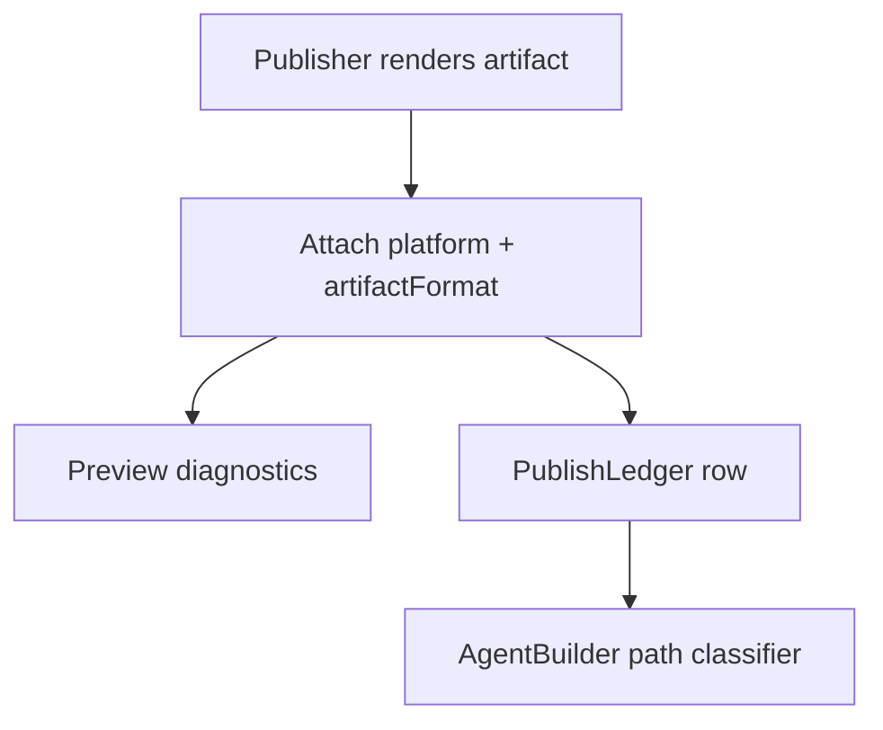
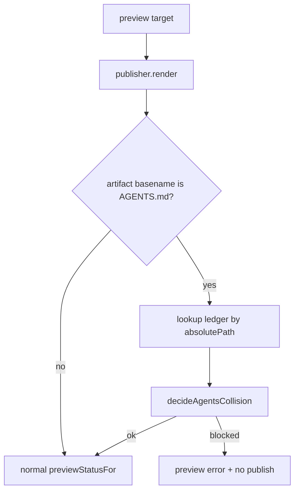
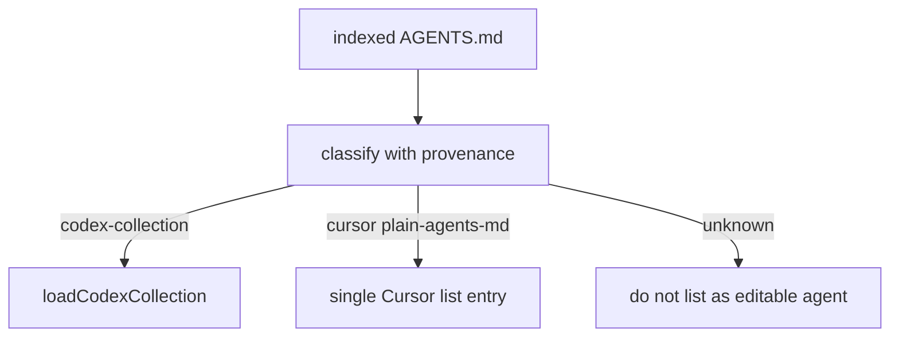
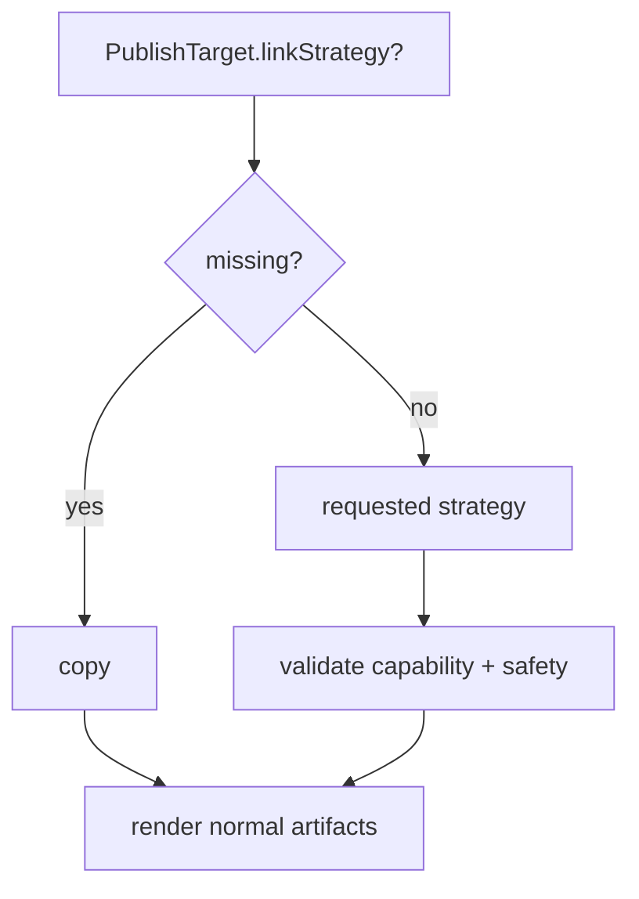
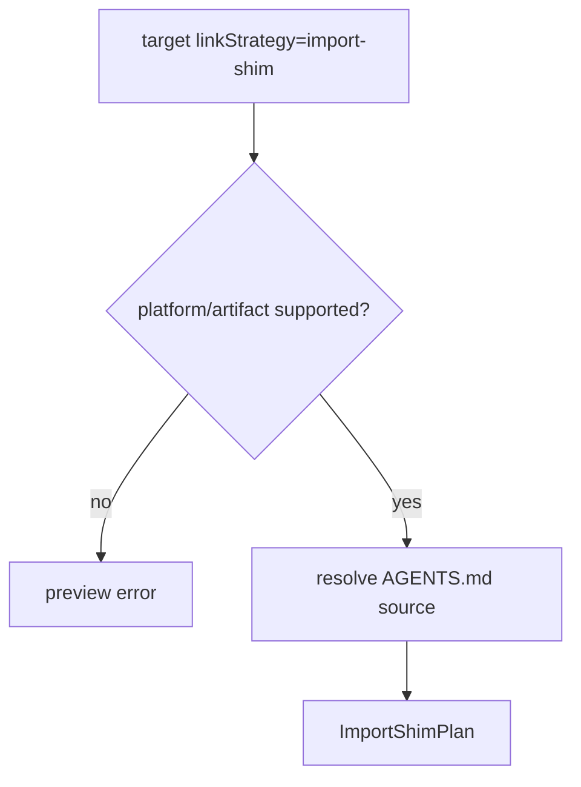
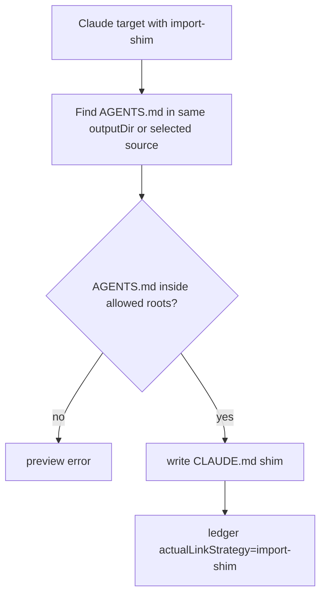
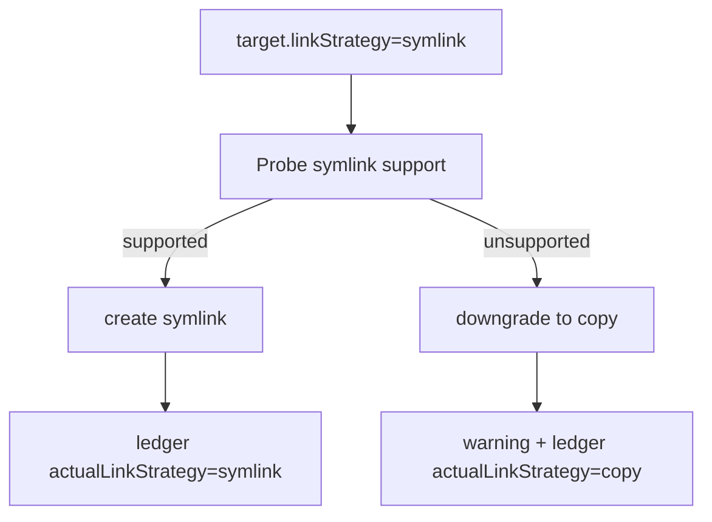
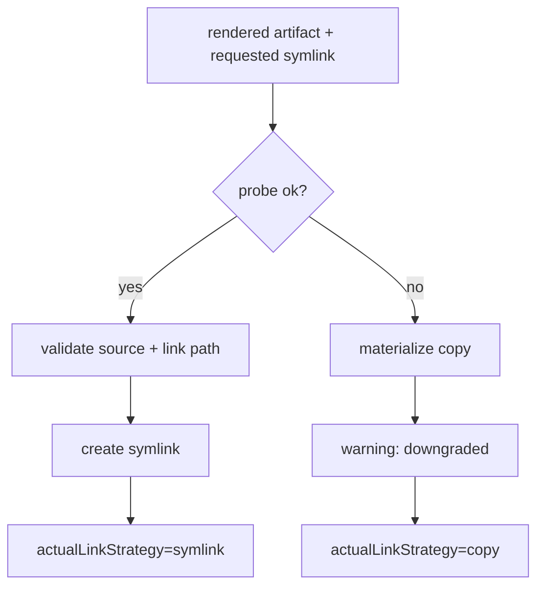

# r2ab3 - Agent Publisher Remaining Platforms and Cursor Plan

**Date**: 2026-06-21
**Scope**: Finish the next Agent Publisher wave after the r2ab3 Copilot/Claude/Codex rollout. Cursor is the priority. The plan also covers the residual Publisher consistency gap, generic `AGENTS.md` platform identity, Windsurf/Devin, Antigravity, Kiro, and optional link strategies.
**Execution posture**: Keep the current materialized-artifact backbone. Do not block Cursor on symlinks/import-shims/mentions. Add link strategies only after materialized platform support is stable.

## Mandatory Reading

| file name | line range | description |
| --- | --- | --- |
| `server/zz-reach2/architecture/agents/archi-agent-builder.md` | 10-72 | Current Builder/Publisher split, canonical-only create, legacy compatibility, and no-linking decision. |
| `server/zz-reach2/architecture/agents/archi-agent-builder.md` | 132-168 | Canonical definition, knowledge refs, publish target model, and current supported-platform caveat. |
| `server/zz-reach2/architecture/agents/archi-agent-builder.md` | 218-299 | Publisher API, lifecycle, materialization behavior, supported outputs, and unsupported platform rows. |
| `server/zz-reach2/architecture/agents/archi-agent-builder.md` | 301-336 | Index/list behavior and current gaps around generic `AGENTS.md` classification and unsupported platforms. |
| `visualizer/zz-reach2/architecture/agents/archi-agent-builder-ui.md` | 9-46 | Current visualizer product shape: Builder saves definitions, Publisher chooses platforms. |
| `visualizer/zz-reach2/architecture/agents/archi-agent-builder-ui.md` | 67-127 | App-owned Builder and Publisher state plus canonical-only create flow. |
| `visualizer/zz-reach2/architecture/agents/archi-agent-builder-ui.md` | 152-208 | PublishAgentDialog flow, platform target rows, defaults, and filename hints. |
| `visualizer/zz-reach2/architecture/agents/archi-agent-builder-ui.md` | 243-250 | UI constraints that must be closed for Cursor and other platforms. |
| `server/zz-reach2/upgrades/2026-06/r2ab2-agent-builder-2.md` | 1-7 | Implemented r2ab3 architecture choice: materialized artifacts, ledger, field-map help, and no Alternative A linking in the rollout. |
| `server/zz-reach2/upgrades/2026-06/r2ab2-agent-builder-2.md` | 523-527 | Canonical-only Builder create tasks that changed the default save path. |
| `server/zz-reach2/upgrades/2026-06/r2ab2-agent-builder-2.md` | 659-690 | PublishAgentDialog shell and platform row tasks already built. |
| `server/zz-reach2/upgrades/2026-06/r2ab2-agent-builder-2.md` | 887-898 | Remediation status for canonical persistence, platform-native defaults, markers, route errors, and drift. |
| `server/zz-reach2/upgrades/2026-06/r2ab2-agent-builder-2.md` | 996-1014 | Final residual finding: publishing existing Agent List items does not persist the converted canonical definition. |
| `server/zz-reach2/upgrades/2026-06/r2ab2-agent-builder-2-gap.md` | 31-37 | Intended seven-publisher class list, including `AgentPublisherCursor`. |
| `server/zz-reach2/upgrades/2026-06/r2ab2-agent-builder-2-gap.md` | 66-93 | Guidance and skill family tables for all target platforms, including Cursor paths and skill roots. |
| `server/zz-reach2/upgrades/2026-06/r2ab2-agent-builder-2-gap.md` | 346-386 | Target `AgentPublisher` hierarchy and per-platform responsibilities. |
| `server/zz-reach2/upgrades/2026-06/r2ab2-agent-builder-2-gap.md` | 511-518 | Broader target shape with `PublishPlatform` and future `linkStrategy`. |
| `server/zz-reach2/upgrades/2026-06/r2ab2-agent-builder-2-gap.md` | 580-585 | Remaining backend and link-strategy rollout phases. |
| `server/zz-reach2/upgrades/2026-06/skills-agents-standards-2026-codex-claude-copilot.md` | 3-15 | Baseline AGENTS/SKILL interoperability conclusions for Codex, Claude, Copilot, and Kiro. |
| `server/zz-reach2/upgrades/2026-06/skills-agents-standards-2026-codex-claude-copilot.md` | 65-169 | Codex, Claude, and Copilot artifact behavior that existing publishers must not regress. |
| `server/zz-reach2/upgrades/2026-06/skills-agents-standards-2026-codex-claude-copilot.md` | 204-269 | Kiro compatibility, steering, skills, and path precedence. |
| `server/zz-reach2/upgrades/2026-06/skills-agents-standards-2026-codex-claude-copilot.md` | 325-350 | Migration/interoperability guidance and compatibility matrix. |
| `server/zz-reach2/upgrades/2026-06/skills-agents-standards-2026-cursor-windsurf-antigravity.md` | 3-11 | Executive summary for Cursor, Windsurf, and Antigravity differences. |
| `server/zz-reach2/upgrades/2026-06/skills-agents-standards-2026-cursor-windsurf-antigravity.md` | 21-58 | Cursor AGENTS/SKILL behavior, nested merge semantics, skill roots, and Cursor-only fields. |
| `server/zz-reach2/upgrades/2026-06/skills-agents-standards-2026-cursor-windsurf-antigravity.md` | 98-139 | Windsurf/Devin AGENTS and skills behavior. |
| `server/zz-reach2/upgrades/2026-06/skills-agents-standards-2026-cursor-windsurf-antigravity.md` | 141-201 | Cross-vendor AGENTS/SKILL comparison and implementation guidance. |
| `server/src/agentPublisher/types.ts` | 1-141 | Current publish platforms, canonical definition, target, preview, ledger, drift, and capability types. |
| `server/src/agentPublisher/AgentPublisher.ts` | 30-88 | Current supported platform list and capability response behavior. |
| `server/src/agentPublisher/AgentPublisher.ts` | 103-190 | Preview/publish orchestration, publisher lookup, ledger writes, and index update callback. |
| `server/src/agentPublisher/AgentPublisher.ts` | 208-245 | Drift detection using ledger, current definition, and canonical store. |
| `server/src/agentPublisher/AgentPublisherBase.ts` | 1-77 | Current render/materialize seam where copy-only writes happen. Needed for future link strategies. |
| `server/src/agentPublisher/fileOps.ts` | 1-73 | Current atomic write, backup, and hash helpers that link strategies should reuse or sit beside. |
| `server/src/agentPublisher/pathPolicy.ts` | 1-124 | Allowed-root validation helpers that import-shim and symlink strategies must reuse. |
| `server/src/agentPublisher/PublishLedger.ts` | 1-73 | Ledger upsert and save behavior that must capture actual materialization strategy later. |
| `server/src/agentPublisher/pathContract.ts` | 1-69 | Existing platform-native default directory contract. |
| `server/src/agentPublisher/skillRenderer.ts` | 1-58 | Current portable skill rendering and platform-specific skill path helper. |
| `server/src/agentBuilder/AgentBuilder.ts` | 40-112 | Builder create response and Agent List platform type surface. |
| `server/src/agentBuilder/AgentBuilder.ts` | 694-712 | Current agent artifact path classifier that treats `AGENTS.md` as Codex. |
| `server/src/agentBuilder/AgentBuilder.ts` | 1582-1850 | Agent list/get-agent behavior and current Codex collection assumptions. |
| `server/src/agentBuilder/AgentBuilder.ts` | 2068-2098 | Publisher-to-Builder index update hook. |
| `visualizer/src/components/agentPublisher/PublishAgentDialog.tsx` | 38-190 | Platform order, target-state creation, capability loading, preview, and publish payload assembly. |
| `visualizer/src/components/agentPublisher/PublishAgentDialog.tsx` | 217-344 | Platform row rendering, path tree selection, preview list, and confirm publish behavior. |
| `visualizer/src/components/agentPublisher/PlatformTargetRow.tsx` | 1-82 | Current platform-row controls that would receive a strategy selector. |
| `visualizer/src/components/agentPublisher/publishUtils.ts` | 1-44 | UI default-directory and filename-hint behavior that must be updated for Cursor. |

## Acceptance Outcomes

- Cursor can be selected in Publisher and can publish materialized Cursor agent and skill artifacts with safe defaults and preview.
- Cursor artifacts do not corrupt or get misclassified as Codex collections.
- Existing publish-from-Agent-List flows persist their converted canonical definition before publish.
- Copilot, Claude, and Codex existing tests continue to pass.
- Windsurf, Antigravity, and Kiro have either implemented materialized support or explicitly documented disabled capability rows with follow-up tasks.
- Link strategies are either implemented as opt-in behavior or explicitly deferred with UI/API types remaining coherent.

{{SIMPLE}}
## 1.

- [ ] Re-open `server/src/agentPublisher/AgentPublisher.ts` and confirm the active supported list is still only `copilot`, `claude`, and `codex`.
- [ ] Re-open `server/src/agentPublisher/types.ts` and confirm `PublishPlatform` still includes `cursor`, `kiro`, `windsurf`, and `antigravity`.
- [ ] Re-open `visualizer/src/components/agentPublisher/PublishAgentDialog.tsx` and confirm unsupported platform rows are rendered but disabled through `supportedArtifactKinds`.
- [ ] Re-open `server/src/agentBuilder/AgentBuilder.ts` and confirm generic `AGENTS.md` paths are still classified as Codex.
- [ ] Re-open `server/src/agentPublisher/tests` and list the current publisher tests that must remain green.
- [ ] Re-open `visualizer/src/components/agentPublisher/*.test.*` and list current UI utility tests.
- [ ] Add dated runtime audit notes to this plan with any code drift discovered before implementation.

{{MEDIUM}}
## 2.

- [ ] Close the publish-from-existing-agent canonical store gap by deciding whether persistence belongs in the client conversion path or in the server publish route.
- [ ] Prefer server-side persistence: add an optional canonical-store upsert inside `AgentPublisher.publish()` before ledger writes when a store is available.
- [ ] Ensure the upsert is idempotent and keyed by `CanonicalAgentDefinition.id`.
- [ ] Return a publish warning only if canonical persistence fails after artifacts were not written; avoid partial writes with an untracked definition.
- [ ] Add a backend test that publishes a browser-converted legacy definition and can reload it through `GET /api/agent-builder/get-definition`.
- [ ] Add a regression test that Builder-created definitions still persist exactly once.
- [ ] Update `r2ab2-agent-builder-2.md` final residual status after this gap is fixed.

{{MEDIUM}}
## 3.

ASSUMPTION: this was already built previously. If not, re-asses at runtime: Groups 1-2 are complete, and current Publisher/Builder code still matches the Mandatory Reading table.

Goal: give generic `AGENTS.md` files an explicit provenance shape before Cursor is enabled.

```ts
export type AgentsArtifactFormat =
	| "codex-collection"
	| "plain-agents-md"
	| "plain-agents-override-md";

export interface PublishedArtifactProvenance {
	platform: PublishPlatform;
	artifactKind: ArtifactKind;
	artifactFormat?: AgentsArtifactFormat;
	canonicalId?: string;
}
```



- [ ] Add an `AgentsArtifactFormat` type in `server/src/agentPublisher/types.ts`.
- [ ] Add optional `artifactFormat?: AgentsArtifactFormat` to `RenderedArtifact`.
- [ ] Add optional `artifactFormat?: AgentsArtifactFormat` to `PublishLedgerEntry`.
- [ ] Set `artifactFormat: "codex-collection"` only from `AgentPublisherCodex` for `AGENTS.md` collection artifacts.
- [ ] Plan Cursor/Windsurf/Kiro/Antigravity `AGENTS.md` renderers to set `artifactFormat: "plain-agents-md"`.
- [ ] Default missing legacy ledger `artifactFormat` to unknown behavior, not Cursor behavior.
- [ ] Add unit coverage for serializing and loading ledger rows with and without `artifactFormat`.

{{MEDIUM}}
## 4.

ASSUMPTION: this was already built previously. If not, re-asses at runtime: Group 3 is complete and rendered artifacts can carry `artifactFormat`.

Goal: isolate `AGENTS.md` collision rules behind a small helper before wiring it into preview.

```ts
type AgentsCollisionDecision =
	| { ok: true; mode: "same-platform-replace" | "compatible-generated" }
	| { ok: false; reason: string };

function decideAgentsCollision(existing: PublishedArtifactProvenance | undefined, incoming: PublishedArtifactProvenance): AgentsCollisionDecision {
	if (!existing) return { ok: true, mode: "compatible-generated" };
	if (existing.platform === incoming.platform && existing.artifactFormat === incoming.artifactFormat) {
		return { ok: true, mode: "same-platform-replace" };
	}
	return { ok: false, reason: "Existing generated AGENTS.md belongs to a different platform format." };
}
```

- [ ] Add a small collision helper near Publisher orchestration, such as `server/src/agentPublisher/agentsCollision.ts`.
- [ ] Make the helper compare existing provenance by absolute path.
- [ ] Treat same platform plus same `artifactFormat` as replaceable generated output.
- [ ] Treat Codex `codex-collection` versus Cursor `plain-agents-md` as incompatible.
- [ ] Treat unmanaged files with no generated marker and no ledger provenance as backup candidates, not compatible generated files.
- [ ] Return a short user-facing reason for incompatible generated collisions.
- [ ] Keep the first policy strict: no shared multi-platform `AGENTS.md` file in this batch.

{{MEDIUM}}
## 5.

ASSUMPTION: this was already built previously. If not, re-asses at runtime: Groups 3-4 are complete and collision decisions can explain incompatible `AGENTS.md` targets.

Goal: wire collision diagnostics into preview without changing materialization yet.



- [ ] Add a ledger lookup helper for entries by `absolutePath`, or derive one locally without changing upsert keys.
- [ ] In `AgentPublisher.preview()`, inspect rendered `AGENTS.md` artifacts before returning.
- [ ] Use the collision helper only for generated `AGENTS.md` style artifacts.
- [ ] Add preview errors for incompatible generated collisions before any files are written.
- [ ] Preserve unmanaged backup behavior for files without generated provenance.
- [ ] Add a route-level preview test for Codex then Cursor targeting the same `AGENTS.md`.
- [ ] Add a route-level preview test proving unmanaged root `AGENTS.md` still reports backup behavior.

{{MEDIUM}}
## 6.

ASSUMPTION: this was already built previously. If not, re-asses at runtime: Groups 3-5 are complete and Publisher preview blocks incompatible generated collisions.

Goal: teach AgentBuilder to classify generic `AGENTS.md` from provenance, while keeping unmanaged files conservative.

```ts
type AgentArtifactClassification =
	| { platform: "codex"; artifactFormat: "codex-collection" }
	| { platform: "cursor" | "windsurf" | "kiro" | "antigravity"; artifactFormat: "plain-agents-md" }
	| { platform: "unknown"; artifactFormat?: undefined };
```

- [ ] Add a tiny classifier helper beside `isCodexAgentsMdPath()` instead of expanding every call site inline.
- [ ] Let `AGENTS.md` classify as Codex only when path shape or provenance indicates `codex-collection`.
- [ ] Let `AGENTS.md` classify as Cursor only when ledger or generated metadata indicates Cursor.
- [ ] Keep unmanaged `AGENTS.md` as `unknown` unless explicit provenance is present.
- [ ] Update `isAnyAgentDefinitionPath()` callers to use the classifier where platform identity matters.
- [ ] Update the `get-agent` error copy so generic `AGENTS.md` is not described as always Codex.
- [ ] Add a small architecture note that provenance is required for plain `AGENTS.md` platform identity.

{{MEDIUM}}
## 7.

ASSUMPTION: this was already built previously. If not, re-asses at runtime: Groups 3-6 are complete and `AgentBuilder` has a classifier seam.

Goal: close the generic `AGENTS.md` test matrix before Cursor publishing is enabled.

- [ ] Add an AgentBuilder unit test for Codex `AGENTS.md` collection classification.
- [ ] Add an AgentBuilder unit test for Cursor plain `AGENTS.md` classification with provenance.
- [ ] Add an AgentBuilder unit test proving unmanaged `AGENTS.md` is not parsed as Cursor.
- [ ] Add a Publisher preview test for cross-platform same-path conflict.
- [ ] Add a Publisher preview test proving same-platform generated replacement is allowed.
- [ ] Add a Publisher publish test proving ledger rows include `artifactFormat`.
- [ ] Update `archi-agent-builder.md` with the collision and provenance policy.

{{MEDIUM}}
## 8.

- [ ] Extend the canonical model with optional platform-neutral publishing hints needed by Cursor skills, such as `paths?: string[]`.
- [ ] Add an optional Cursor-specific hint for `disable-model-invocation` using a TypeScript-friendly property name and renderer mapping.
- [ ] Update `toCanonicalAgentDefinition()` and `fromCanonicalAgentDefinition()` to preserve new optional fields without breaking legacy callers.
- [ ] Update visualizer mirrored types for the new optional fields.
- [ ] Add tests proving old canonical JSON still loads when the new fields are absent.
- [ ] Add tests proving metadata and paths survive canonical store round trips.
- [ ] Keep the Builder form unchanged unless a later UI task explicitly adds controls for the new hints.

{{MEDIUM}}
## 9.

ASSUMPTION: this was already built previously. If not, re-asses at runtime: Groups 3-8 are complete, including `artifactFormat` and Cursor canonical hints.

Goal: add the Cursor publisher as a plain materialized renderer.

```ts
export class AgentPublisherCursor extends AgentPublisherBase {
	readonly platform = "cursor" as const;

	render(def: CanonicalAgentDefinition, target: PublishTarget): RenderedArtifact[] {
		return [{
			absolutePath: this.joinOutput(target.outputDir, "AGENTS.md"),
			content: renderCursorAgentMarkdown(def),
			platform: this.platform,
			artifactKind: target.artifactKind,
			artifactFormat: "plain-agents-md",
		}];
	}
}
```

- [ ] Create `server/src/agentPublisher/platforms/AgentPublisherCursor.ts`.
- [ ] Implement Cursor agent rendering as plain Markdown `AGENTS.md` with no YAML frontmatter and no Codex collection markers.
- [ ] Render Cursor agent body from description, optional when-to-use, argument hint, tools as prose, and knowledge references.
- [ ] Implement Cursor skill rendering to the portable default `.agents/skills/<id>/SKILL.md`.
- [ ] Include Cursor skill frontmatter fields `name`, `description`, optional `paths`, optional `disable-model-invocation`, and `metadata`.
- [ ] Emit the platform-neutral generated marker in Cursor artifacts.
- [ ] Add snapshot tests for Cursor agent and Cursor skill output.
- [ ] Add unmanaged backup tests for Cursor `AGENTS.md` and `SKILL.md`.

{{MEDIUM}}
## 10.

- [ ] Extend `pathContract.ts` so Cursor defaults to `agentOutputDir = projectRoot` and `skillRootDir = projectRoot`.
- [ ] Add optional config support for Cursor-specific publish roots through existing `publishRoots.cursor`.
- [ ] Update `skillRenderer.resolveSkillPath()` or Cursor publisher-local path handling so Cursor skills write `.agents/skills/<id>/SKILL.md`.
- [ ] Add tests for Cursor default paths from `projectRoot`, inferred `.github/agents`, and explicit `publishRoots.cursor`.
- [ ] Register `AgentPublisherCursor` in `AgentPublisher.publishers`.
- [ ] Add `cursor` to `SUPPORTED_PLATFORMS` only after path, render, preview, and conflict tests pass.
- [ ] Ensure `/api/agent-publisher/platforms?projectName=...` returns Cursor supported artifact kinds and defaults.

{{MEDIUM}}
## 11.

- [ ] Update `visualizer/src/components/agentPublisher/publishUtils.ts` so Cursor agent hints show `{outputDir}/AGENTS.md`.
- [ ] Update Cursor skill hints so the UI shows `{skillRoot}/.agents/skills/{id}/SKILL.md`.
- [ ] Ensure `PublishAgentDialog` does not preselect Cursor by default until product choice says it should.
- [ ] Ensure selecting Cursor and Agent produces a valid preview payload with `platform: "cursor"` and the selected output dir.
- [ ] Ensure selecting Cursor and Skill produces a valid preview payload with the selected skill root.
- [ ] Add UI utility tests for Cursor filename hints.
- [ ] Add component or integration tests for Cursor row enabled/disabled behavior based on capabilities.
- [ ] Update `archi-agent-builder-ui.md` with Cursor target-row behavior.

{{MEDIUM}}
## 12.

ASSUMPTION: this was already built previously. If not, re-asses at runtime: Groups 3-11 are complete and Cursor artifacts carry provenance through preview/publish.

Goal: decide and implement the Agent List policy for Cursor without touching Codex collection semantics.

```ts
type FlatEntry = {
	name: string;
	platform: "github" | "claude" | "codex" | "cursor";
	path: string;
	artifactFormat?: AgentsArtifactFormat;
	codexEntryId?: string; // codex only
};
```



- [ ] Update `AgentBuilder.list()` to include Cursor artifacts only when provenance says the file is a Cursor artifact.
- [ ] Decide whether Cursor `AGENTS.md` should appear in Agent List as one logical agent or as project guidance; implement the chosen behavior consistently.
- [ ] Avoid using Codex `codexEntryId` semantics for Cursor plain `AGENTS.md`.
- [ ] Add tests that Cursor published artifacts appear in `/prepare` after publish.
- [ ] Add tests that Cursor artifacts do not inflate Codex collection entries.
- [ ] Preserve existing GitHub, Claude, and Codex grouping behavior.
- [ ] Document the selected Cursor Agent List policy in `archi-agent-builder.md`.
- [ ] Add UI copy only if Cursor list entries need a distinct platform label.

{{MEDIUM}}
## 13.

ASSUMPTION: this was already built previously. If not, re-asses at runtime: Group 12 is complete and Cursor list entries have a stable policy.

Goal: make Cursor retrieval explicit, not an accidental Codex fallback.

```ts
if (classification.platform === "cursor") {
	return {
		agent: reconstructCursorPlainAgent(readFileSync(agentPath, "utf8"), indexed.sourceName, agentPath),
	};
}
```

- [ ] Add `reconstructCursorPlainAgent()` or a similarly named helper near existing reconstruction helpers.
- [ ] In `getAgent()`, branch on Cursor classification before the Codex collection branch.
- [ ] Return `platform: "cursor"` from the Cursor retrieval branch.
- [ ] Leave `codexEntryId` undefined for Cursor responses.
- [ ] Reuse generated metadata or canonical store data when available for description, tools, and knowledge.
- [ ] Fall back to conservative Markdown reconstruction when metadata is unavailable.
- [ ] Return a clear 404 or unsupported error if the selected policy excludes Cursor edit/list.

{{MEDIUM}}
## 14.

ASSUMPTION: this was already built previously. If not, re-asses at runtime: Groups 12-13 are complete.

Goal: pin Cursor AgentBuilder behavior with focused tests.

- [ ] Add a test that Cursor published artifacts appear in `/prepare` after publish.
- [ ] Add a test that Cursor `get-agent` returns `platform: "cursor"` with no `codexEntryId`.
- [ ] Add a test that Cursor artifacts do not inflate Codex collection entries.
- [ ] Add tests for editing or publishing from a Cursor Agent List card if Cursor is included in Agent List.
- [ ] Document any deliberately unsupported Cursor edit/list behavior.
- [ ] Add a regression test that multi-entry Codex `AGENTS.md` still requires `codexEntryId`.
- [ ] Add a regression test that GitHub and Claude file detection is unchanged.

{{MEDIUM}}
## 15.

- [ ] Add backend route tests for Cursor `/preview` success.
- [ ] Add backend route tests for Cursor `/publish` success and ledger rows.
- [ ] Add backend route tests for Cursor drift states: clean, disk-changed, missing-file, and canonical-changed.
- [ ] Add an integration test that publishes Cursor agent and skill artifacts in a fixture project.
- [ ] Add a regression test that Codex preview/publish still handles `AGENTS.json` collection updates.
- [ ] Add a regression test that Copilot and Claude default paths remain platform-native.
- [ ] Run `bun run typecheck` in `server/`.
- [ ] Run `bun run test` in `server/`.

{{SIMPLE}}
## 16.

- [ ] Add a manual verification checklist for Cursor in this plan.
- [ ] Manually preview a Cursor agent at project root and inspect the rendered `AGENTS.md`.
- [ ] Manually publish a Cursor agent to a temporary fixture and confirm the ledger row is written.
- [ ] Manually preview a Cursor skill and confirm the `.agents/skills/<id>/SKILL.md` path.
- [ ] Manually verify repeated Cursor publish does not create unmanaged backups for generated files.
- [ ] Manually verify a Codex publish after Cursor publish does not silently overwrite incompatible `AGENTS.md`.
- [ ] Record verification commands and results in this plan.

{{MEDIUM}}
## 17.

- [ ] Create `server/src/agentPublisher/platforms/AgentPublisherWindsurf.ts`.
- [ ] Render Windsurf/Devin agent guidance as plain `AGENTS.md` or `agents.md` according to the selected target policy.
- [ ] Default Windsurf agent output to `projectRoot`, with heat suggested placement visible in the UI.
- [ ] Render Windsurf skills to `.windsurf/skills/<id>/SKILL.md` for native support.
- [ ] Consider `.agents/skills/<id>/SKILL.md` as an optional portability mode, but keep the first implementation single-path.
- [ ] Add generated marker, preview status, backup, ledger, and drift tests.
- [ ] Register Windsurf only after route and publisher tests pass.

{{MEDIUM}}
## 18.

- [ ] Create `server/src/agentPublisher/platforms/AgentPublisherAntigravity.ts`.
- [ ] Render Antigravity agent guidance as root `AGENTS.md` by default.
- [ ] Add optional `GEMINI.md` mirror support only if the target contract can represent sidecar/mirror artifacts safely.
- [ ] Render Antigravity skills to `.agents/skills/<id>/SKILL.md` as the portable default.
- [ ] Explicitly avoid the non-portable `.agents/agents.md` plus `.agents/skills/*.md` orchestration pattern.
- [ ] Add tests for `AGENTS.md`, optional `GEMINI.md` if implemented, and skill output.
- [ ] Register Antigravity only after tests and collision policy coverage pass.

{{MEDIUM}}
## 19.

- [ ] Create `server/src/agentPublisher/platforms/AgentPublisherKiro.ts`.
- [ ] Render Kiro compatibility guidance as root `AGENTS.md`.
- [ ] Decide whether native `.kiro/steering/*.md` mirrors are in this batch or a later opt-in feature.
- [ ] Render Kiro skills to `.kiro/skills/<id>/SKILL.md`.
- [ ] Add tests for root guidance, skill path, default path contract, ledger, and drift.
- [ ] Register Kiro only after tests and AGENTS collision coverage pass.
- [ ] Document that richer Kiro steering inclusion modes are outside the first materialized support pass if not implemented.

{{MEDIUM}}
## 20.

ASSUMPTION: this was already built previously. If not, re-asses at runtime: Groups 17-19 are complete or any unimplemented platforms remain disabled with empty `supportedArtifactKinds`.

Goal: make backend capability metadata descriptive enough that the UI can stop hardcoding every path shape.

```ts
export interface PlatformArtifactTemplate {
	artifactKind: ArtifactKind;
	rootKey: "agentOutputDir" | "skillRootDir" | "projectRoot";
	relativePathTemplate: string;
	note?: string;
}

export interface PlatformCapability {
	platform: PublishPlatform;
	label: string;
	supportedArtifactKinds: ArtifactKind[];
	defaultDirs?: PlatformDefaultDirs;
	artifactTemplates?: PlatformArtifactTemplate[];
	notes?: string[];
}
```

- [ ] Generalize platform capability metadata so the UI can describe native path shapes beyond `agentOutputDir` and `skillRootDir`.
- [ ] Add optional platform notes to `/api/agent-publisher/platforms`, such as "Cursor AGENTS merges with ancestors" or "Windsurf subdirs become glob rules".
- [ ] Add optional target profiles if one platform supports both native and portable skill roots.
- [ ] Add `artifactTemplates` for Copilot, Claude, Codex, and Cursor first.
- [ ] Keep `defaultDirs` in place for backward compatibility during the UI migration.
- [ ] Add a backend unit or route test for each template's rendered relative path.
- [ ] Document the capability response shape in `archi-agent-builder.md`.

{{MEDIUM}}
## 21.

ASSUMPTION: this was already built previously. If not, re-asses at runtime: Group 20 is complete and `/api/agent-publisher/platforms` returns template metadata.

Goal: move Publisher UI filename hints onto backend-provided templates.

```tsx
function resolveTemplatePath(template: string, values: { id: string; name: string }): string {
	return template
		.replaceAll("{id}", values.id)
		.replaceAll("{name}", values.name);
}
```

- [ ] Update `PublishAgentDialog` to show platform notes without cluttering supported Copilot/Claude/Codex rows.
- [ ] Update filename hints to use backend-provided artifact path templates where possible instead of hardcoding every platform in the UI.
- [ ] Add tests proving frontend hints match backend-rendered preview paths for all supported platforms.
- [ ] Keep unsupported platform rows disabled with clear copy until their backend publishers are registered.
- [ ] Keep `resolveFilenameHint()` fallback behavior for older backend responses.
- [ ] Add visualizer type coverage for optional `artifactTemplates` and `notes`.
- [ ] Update `archi-agent-builder-ui.md` with the capability metadata flow.

{{MEDIUM}}
## 22.

ASSUMPTION: this was already built previously. If not, re-asses at runtime: Groups 1-21 have landed, Cursor materialized publishing is stable, and `AgentPublisherBase.materializeArtifacts()` is still the central write seam.

Goal: turn link strategies from a vague concept into a typed contract without changing runtime behavior yet.

```ts
export type LinkStrategy = "copy" | "import-shim" | "symlink";

export interface PublishTarget {
    platform: PublishPlatform;
    artifactKind: ArtifactKind;
    outputDir: string;
    codexEntryId?: string;
    linkStrategy?: LinkStrategy; // omitted means "copy"
}
```



- [ ] Add `LinkStrategy` to `server/src/agentPublisher/types.ts` with `copy`, `import-shim`, and `symlink`.
- [ ] Add optional `linkStrategy?: LinkStrategy` to `PublishTarget`, defaulting behavior to `copy` when omitted.
- [ ] Add optional `requestedLinkStrategy?: LinkStrategy` and `actualLinkStrategy?: LinkStrategy` to `RenderedArtifact` or a small nested materialization metadata shape.
- [ ] Add optional `supportedLinkStrategies?: LinkStrategy[]` to `PlatformCapability`.
- [ ] Keep existing publish payloads valid by treating missing strategy as `copy` everywhere.
- [ ] Add type-level or unit tests that old `PublishTarget` objects still compile or validate.
- [ ] Add a short architecture note that this batch only adds the contract, not new behavior.

{{MEDIUM}}
## 23.

ASSUMPTION: this was already built previously. If not, re-asses at runtime: Group 22 is complete and `copy` remains the only behavior used by default.

Goal: make `copy` explicit and record it without changing platform output.

```ts
const requested = target.linkStrategy ?? "copy";
const actual = requested === "copy" ? "copy" : requested;
```

- [ ] Update `AgentPublisher.preview()` so rendered artifacts carry requested/actual strategy metadata for copy targets.
- [ ] Update `AgentPublisher.publish()` so ledger rows record the actual strategy used.
- [ ] Add `linkStrategy?: LinkStrategy` or `actualLinkStrategy?: LinkStrategy` to `PublishLedgerEntry`.
- [ ] Keep `PublishLedger.upsert()` key unchanged so existing rows are replaced rather than duplicated.
- [ ] Add a migration-safe default when loading older ledger entries with no strategy field.
- [ ] Add tests proving existing copy-only publish still writes the same files and hashes.
- [ ] Add tests proving new ledger rows include `copy`.

{{MEDIUM}}
## 24.

ASSUMPTION: this was already built previously. If not, re-asses at runtime: Groups 22-23 are complete, and Claude/Copilot/Codex plus Cursor materialized publishing are stable.

Goal: define the smallest supported import-shim input contract before adding writes.

```ts
type ImportShimPlan = {
	platform: "claude";
	artifactKind: "agent";
	shimPath: string;
	importedPath: string;
	relativeImport: string;
};
```



- [ ] Define import-shim support as `platform=claude` and `artifactKind=agent` only.
- [ ] Add a helper that returns an `ImportShimPlan` or a user-facing error.
- [ ] Let the first source resolution look for an `AGENTS.md` in the same selected output root.
- [ ] Allow a later source-selection parameter only if `PublishTarget` can express it safely.
- [ ] Return preview errors for unsupported platforms requesting `import-shim`.
- [ ] Keep Claude sub-agent materialization unchanged when `linkStrategy` is omitted.
- [ ] Add unit tests for supported and unsupported import-shim target requests.

{{MEDIUM}}
## 25.

ASSUMPTION: this was already built previously. If not, re-asses at runtime: Group 24 is complete and `ImportShimPlan` exists.

Goal: implement the smallest useful non-copy strategy: Claude `CLAUDE.md` import shim for project guidance. This is not a replacement for Claude sub-agent files; it is an optional guidance bridge to an existing `AGENTS.md`.

```md
@AGENTS.md

<!-- Generated by ContextCore AgentPublisher -->
```



- [ ] Add a helper that builds the shim content with a relative `@AGENTS.md`-style import path.
- [ ] Validate both the shim output path and imported file path through existing path allow-list logic.
- [ ] Return preview errors when an import target would point outside allowed roots.
- [ ] Write the shim through existing generated-marker, backup, and atomic-write helpers.
- [ ] Set requested and actual strategy metadata to `import-shim` for the rendered shim artifact.
- [ ] Keep the shim content tiny and deterministic so snapshot tests are readable.
- [ ] Add a preview test for a blocked import path outside allowed roots.

{{MEDIUM}}
## 26.

ASSUMPTION: this was already built previously. If not, re-asses at runtime: Groups 24-25 are complete and import-shim preview writes metadata.

Goal: close import-shim integration coverage before adding symlinks.

- [ ] Add tests for successful same-directory shim output.
- [ ] Add tests for nested relative imports such as `@../AGENTS.md` only when allowed by `pathPolicy`.
- [ ] Add tests for blocked import paths outside allowed roots.
- [ ] Add a publish test proving unmanaged existing `CLAUDE.md` is backed up before shim write.
- [ ] Add a ledger test proving `actualLinkStrategy: "import-shim"` is recorded.
- [ ] Add a drift test proving shim content participates in normal artifact hash checks.
- [ ] Update docs with the first supported import-shim case and explicit non-goals.

{{MEDIUM}}
## 27.

ASSUMPTION: this was already built previously. If not, re-asses at runtime: Groups 22-26 are complete and import-shim behavior is tested.

Goal: add a symlink capability probe that can be tested independently of publishing.

```ts
export type SymlinkProbe = () => boolean;

export function probeSymlinkSupport(tempRoot: string): boolean {
	// create temp source, create temp symlink, clean up, return success
}
```



- [ ] Add a small symlink capability probe that runs in a temp directory and cleans up after itself.
- [ ] Keep symlink probing separate from publish execution so preview can report whether a downgrade is likely.
- [ ] Add tests for supported symlink behavior where practical on the host.
- [ ] Add tests for forced downgrade using an injectable probe result.
- [ ] Make preview consume the probe result without creating final symlinks.
- [ ] Keep the default strategy as `copy` regardless of probe result.

{{MEDIUM}}
## 28.

ASSUMPTION: this was already built previously. If not, re-asses at runtime: Group 27 is complete and symlink support can be probed.

Goal: add a file-operation helper for symlink creation that mirrors existing backup safety.

```ts
type SymlinkWriteOptions = {
	sourcePath: string;
	linkPath: string;
	generatedMarkers: string[];
};
```

- [ ] Add a helper in `fileOps.ts` or a sibling module that creates parent directories for the link path.
- [ ] Back up unmanaged existing files before replacing them with a symlink.
- [ ] Replace generated existing files or symlinks without creating duplicate backups.
- [ ] Validate source and destination paths before calling the helper.
- [ ] Use platform-appropriate `fs.symlinkSync` type only after confirming what Node expects on Windows.
- [ ] Add unit tests for existing generated file, unmanaged file, and existing symlink cases.
- [ ] Keep atomic text writes unchanged for copy and import-shim strategies.

{{MEDIUM}}
## 29.

ASSUMPTION: this was already built previously. If not, re-asses at runtime: Groups 27-28 are complete and the symlink helper is covered.

Goal: integrate symlink as an opt-in strategy with safe downgrade to copy.



- [ ] Restrict symlink source and destination paths to allowed roots before creating the link.
- [ ] Downgrade to copy with a warning when symlink creation is unavailable or rejected by the OS.
- [ ] Store both requested `symlink` and actual `copy` or `symlink` in preview metadata.
- [ ] Store both requested `symlink` and actual `copy` or `symlink` in publish metadata.
- [ ] Keep materialization grouped by platform so existing publisher ownership stays intact.
- [ ] Ensure downgraded copies use the same generated marker and backup helpers as normal copy.
- [ ] Add publish-result warnings that include the target path and the fallback strategy.
- [ ] Keep symlink unavailable for unsupported platforms until capability metadata says otherwise.

{{MEDIUM}}
## 30.

ASSUMPTION: this was already built previously. If not, re-asses at runtime: Group 29 is complete and symlink downgrade metadata reaches preview/publish.

Goal: close symlink behavior with predictable tests.

- [ ] Add a route preview test for requested symlink when the probe says supported.
- [ ] Add a route preview test for requested symlink when the probe forces downgrade.
- [ ] Add a publish test proving downgrade writes a normal file and records `actualLinkStrategy: "copy"`.
- [ ] Add a publish test proving supported symlink records `actualLinkStrategy: "symlink"` where host support allows.
- [ ] Add a test proving drift compares artifact content or downgraded copy content consistently.
- [ ] Add docs for Windows symlink downgrade expectations.

{{MEDIUM}}
## 31.

ASSUMPTION: this was already built previously. If not, re-asses at runtime: Groups 22-30 are complete and backend capabilities expose supported strategies.

Goal: expose strategy selection in the Publisher UI without disrupting the existing default path.

```tsx
type TargetState = {
    selected: boolean;
    artifactKind: ArtifactKind;
    outputDir: string;
    linkStrategy: LinkStrategy;
};
```

- [ ] Mirror `LinkStrategy` and the optional strategy fields in `visualizer/src/types.ts`.
- [ ] Extend `TargetState` in `PublishAgentDialog.tsx` with `linkStrategy`, defaulting every row to `copy`.
- [ ] Add `linkStrategy` to `makePublishTargetsFromState()` payloads only when selected.
- [ ] Extend `PlatformTargetRow.tsx` with a compact strategy selector shown only when more than one strategy is supported.
- [ ] Render unavailable strategies as disabled options with a short title or hint.
- [ ] Show requested/actual strategy in preview rows when the backend returns downgrade metadata.
- [ ] Add UI utility tests for default copy payloads and explicit non-copy payloads.
- [ ] Keep all existing Copilot/Claude/Codex copy-only tests passing.

{{MEDIUM}}
## 32.

ASSUMPTION: this was already built previously. If not, re-asses at runtime: Groups 22-31 are complete and link strategies are available through preview and publish.

Goal: close test coverage for link strategy behavior before turning it into product copy.

- [ ] Add route tests for `/api/agent-publisher/platforms` returning strategy capability metadata.
- [ ] Add route tests for `/api/agent-publisher/preview` with `copy`, `import-shim`, and `symlink`.
- [ ] Add route tests for `/api/agent-publisher/publish` recording requested and actual strategies in ledger rows.
- [ ] Add a drift test proving strategy metadata does not change artifact hash comparisons.
- [ ] Add a visualizer test proving unsupported rows do not show a strategy selector.
- [ ] Add a visualizer test proving a symlink downgrade warning appears in preview/publish output.
- [ ] Run server and visualizer type checks after the strategy batches.

{{SIMPLE}}
## 33.

- [ ] Update `server/zz-reach2/architecture/agents/archi-agent-builder.md` after each platform backend is enabled.
- [ ] Update `visualizer/zz-reach2/architecture/agents/archi-agent-builder-ui.md` after each UI capability change.
- [ ] Add release notes for Cursor support once the Cursor batch passes verification.
- [ ] Add troubleshooting notes for incompatible `AGENTS.md` collisions.
- [ ] Add troubleshooting notes for unsupported platform rows and how to enable them.
- [ ] Add troubleshooting notes for link-strategy downgrades after link strategies ship.
- [ ] Add examples of recommended Cursor root and nested `AGENTS.md` placement.
- [ ] Keep all task checkboxes in this plan unchecked until implementation begins.

{{MEDIUM}}
## 34.

- [ ] Run final `bun run typecheck` in `server/`.
- [ ] Run final `bun run test` in `server/`.
- [ ] Run final visualizer build or typecheck according to the current package scripts.
- [ ] Run targeted visualizer tests for Publisher utility and dialog behavior.
- [ ] Start the backend and visualizer dev server for manual Publisher checks.
- [ ] Manually verify Copilot, Claude, Codex, and Cursor preview paths in the live dialog.
- [ ] Manually verify publish writes, ledger rows, and AgentBuilder `/prepare` refresh for Cursor.
- [ ] Record final verification results and residual risks in this plan.
