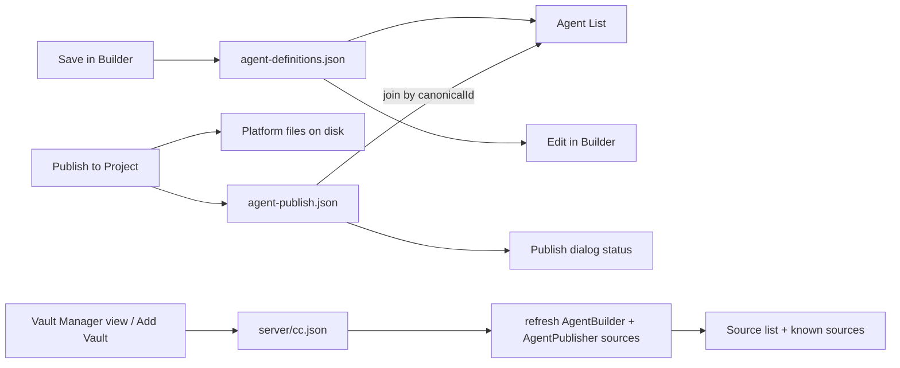
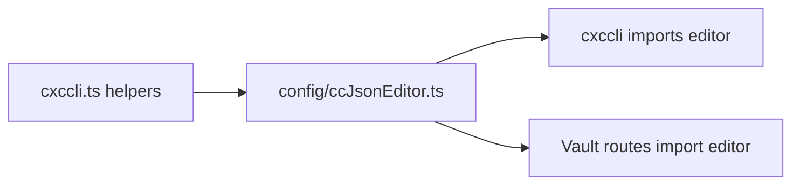
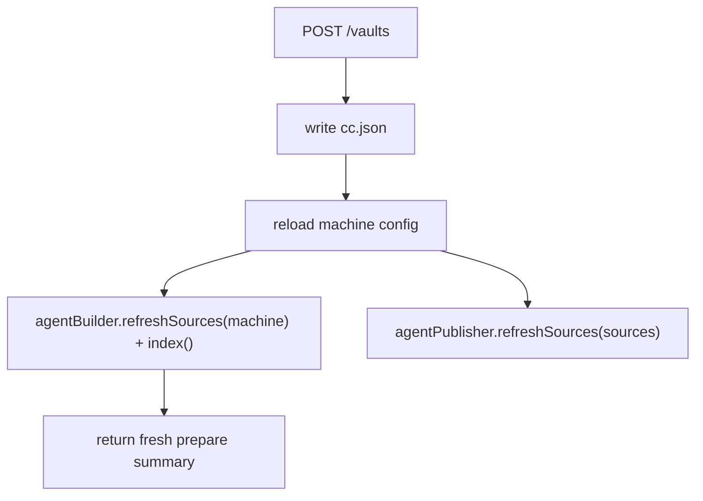
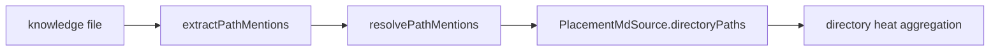

# r2ap - Canonical Agent Catalog, Add Vault, and Publisher Placement UX

**Date**: 2026-06-21
**Scope**: Continue Agent Publisher improvements after r2ab3. This plan covers three chronological work streams:

1. **Canonical-first Agent List**: Agent List must be strictly backed by `{storage}/.settings/agent-definitions.json`. Disk artifacts are publish output only and are joined through the publish ledger when needed.
2. **Add Vault / Vault Manager**: Add a built-in visualizer view for browsing server-side directories, adding AgentBuilder data sources, persisting them into `server/cc.json`, refreshing the running AgentBuilder/Publisher source inventory, and updating the UI source list.
3. **Placement UX**: Separate markdown source chips from directory placement heat in PublishAgentDialog, then support Expand Context for related docs.

**Depends on**: r2ab2/r2ab3 Publisher backbone, `CanonicalAgentStore`, `PublishLedger`, `PathHeatAnalyzer`, `PublishAgentDialog`, current `cc.json` `dataSources`, and existing `cxccli` atomic `cc.json` mutation helpers.

**Execution posture**: Part A first, because it fixes the catalog/edit/publish mental model. Part B second, because Add Vault changes the source inventory used by both Builder and Publisher. Part C third, because placement UX depends on the same canonical definition and source list behavior.

**Explicit non-goals**:

- Listing orphan `.github`/`.claude`/`AGENTS.md` platform files in Agent List.
- Importing unmanaged disk-only agents into canonical storage.
- Reworking legacy `POST /api/agent-builder/create` with `platform`.
- Re-enabling symlink publishing.
- Making startup mutate `cc.json`. Add Vault is an explicit user-triggered config mutation route, not startup behavior.

---

## Mandatory Reading

| file name | line range | description |
| --- | --- | --- |
| `server/zz-reach2/architecture/archi-context-core-level0.md` | 19-144, 681-705 | High-level `cc.json`, `CCSettings`, AgentBuilder, and multi-machine config context. |
| `server/zz-reach2/architecture/agents/archi-agent-builder.md` | 10-124, 172-336 | Current Builder/Publisher split, canonical store, ledger, platform outputs, listing/provenance policy. |
| `visualizer/zz-reach2/architecture/agents/archi-agent-builder-ui.md` | 9-127, 152-250 | Current visualizer Builder, Agent List, Publish dialog, platform rows, and placement UI behavior. |
| `server/zz-reach2/upgrades/2026-06/r2ab2-agent-builder-2.md` | 887-1014 | Canonical persistence remediation and residual publish-from-existing-agent notes that led to this plan. |
| `server/zz-reach2/upgrades/2026-06/r2ab3-agent-builder-3.md` | 1-120, 760-973 | Remaining platform rollout, AGENTS.md collision/provenance handling, and symlink deferral status. |
| `server/zz-reach2/upgrades/2026-03/r2uab-agent-builder.md` | 1-154 | Original AgentBuilder `dataSources` config shape and indexing contract. |
| `visualizer/public/README-DATA-SOURCES.MD` | 1-123 | Current user-facing data source instructions; must be updated after Add Vault. |
| `server/zz-reach2/architecture/cli/archi-cli.md` | 1-113, 139-202 | Existing `cc.json` mutation UX and atomic write safety model. |
| `server/zz-reach2/upgrades/2026-04/r2cc-cxc-cli.md` | 1-120, 137-195 | Completed CLI config editor plan; useful for reusing mutation helpers and tests. |
| `server/zz-reach2/architecture/startup/archi-startup.md` | 120-120, 538-548 | Startup state ownership and invariant that startup must not mutate `cc.json`. |
| `server/cc.json` | current `machines[].dataSources` block | Real local data source grouping and field conventions to preserve when adding vaults. |
| `server/src/agentBuilder/AgentBuilder.ts` | 87-154, 1174-1215, 1244-1353, 1451-1480, 1652-1870, 2066-2100, 2214-2242 | Critical current list/create/index/prepare/get-definition seams. |
| `server/src/agentPublisher/AgentPublisher.ts` | 30-151, 247-384 | Platform capability, preview/publish, ledger, canonical persistence, and drift behavior. |
| `server/src/agentPublisher/CanonicalAgentStore.ts` | 1-91 | `agent-definitions.json` persistence and upsert/list/get API. |
| `server/src/agentPublisher/PublishLedger.ts` | 1-73 | Publish ledger loading, lookup by canonical id, and lookup by absolute path. |
| `server/src/server/routes/agentBuilderRoutes.ts` | 7-113, 118-209 | Current AgentBuilder route surface and availability checks. |
| `server/src/server/routes/agentPublisherRoutes.ts` | 7-172 | Current Publisher route surface; status route will be added here. |
| `server/src/ContextCore.ts` | 403-426 | Current startup wiring for AgentBuilder, CanonicalAgentStore, and AgentPublisher. |
| `server/src/settings/CCSettings.ts` | 46-121 | Singleton `cc.json` loading behavior that makes live config mutation non-trivial. |
| `server/src/cxccli.ts` | 225-332, 640-681, 2440-2470 | Reusable `cc.json` parse/machine/write helpers and export surface. |
| `visualizer/src/types.ts` | 87-220, 297-330 | Mirrored AgentBuilder, Publisher, and Agent List types. |
| `visualizer/src/api/search.ts` | 211-281 | Current AgentBuilder prepare/create/list/get-agent fetch wrappers. |
| `visualizer/src/hooks/useViews.ts` | 1-110, 168-232 | Built-in view definitions and view type validation; Vault Manager should be added here. |
| `visualizer/src/components/searchTools/SearchBar.tsx` | 24-96, 312-424 | View dropdown and Agent Builder action column; Manage Vaults entry belongs here. |
| `visualizer/src/App.tsx` | 267-369, 683-717, 985-1015, 1193-1265, 1356-1487 | Source state, publish/edit handlers, source filter wiring, and Publisher open flow. |
| `visualizer/src/hooks/useSearch.ts` | 116-160, 348-360 | Agent List card mapping and fetch trigger. |
| `visualizer/src/components/agentBuilder/SourceFilterDropdown.tsx` | 1-79 | Source selector UI where Add Vault should be attached. |

---

## Product Direction



| User action | Persists to | Appears in Agent List? |
| --- | --- | --- |
| Save definition | `agent-definitions.json` | Yes, always |
| Publish definition | Disk artifacts + `agent-publish.json` | Existing catalog card updates publish status |
| Add Vault | `server/cc.json` current machine `dataSources` | No direct agent card; source appears in Builder and Publisher |
| Legacy disk-only agent | Repo files only | No |

**Why**: Users expect Save and List to mean the same catalog. Disk artifacts are publish output. Agent Builder sources are the knowledge vaults the catalog uses, so adding a vault should update source selection without making the user hand-edit `cc.json`.

---

## Important Browser Constraint for Add Vault

Normal browser APIs do **not** expose an arbitrary selected directory's absolute OS path to page JavaScript. `input type="file" webkitdirectory` and the File System Access API can show picker UI, but they do not give a reliable absolute path like `D:\Codez\...`.

This plan therefore assumes the implementation uses one of these supported local-app approaches:

1. **Preferred web-safe approach**: a custom in-app directory browser UI backed by server endpoints. The visualizer asks the local server for roots/children and the selected absolute path is produced by the server.
2. **Fallback**: a manual absolute path field with server-side validation.
3. **Optional native bridge**: a server-launched OS folder picker or desktop wrapper. This needs an explicit product decision because it is platform-specific and fragile in headless/service runs.

Do not implement a plain browser directory upload picker expecting it to return an absolute path.

---

## Acceptance Outcomes

### Part A - Canonical Agent Catalog

- `GET /api/agent-builder/list` returns only canonical definitions from `agent-definitions.json`.
- Every returned card has a `canonicalId`.
- Unpublished canonical definitions appear in Agent List.
- Published targets are shown by joining `agent-publish.json` rows by `canonicalId`.
- List does not scan disk agent artifacts to decide which agents exist.
- Edit from Agent List loads `GET /api/agent-builder/get-definition?canonicalId=...`.
- Publish from Agent List opens Publisher from the canonical definition.
- Publish dialog shows per-platform status and drift/missing-file state when opened.

### Part B - Add Vault / Vault Manager

- A new built-in Vault Manager view exists in the current view system.
- Source selector shows an **Add Vault** shortcut that opens Vault Manager.
- User can choose a directory through a custom in-app browser or enter an absolute path manually.
- Vault Manager shows roots, breadcrumbs, child directories, selected path details, and source metadata fields.
- Server adds an AgentBuilder `dataSources` entry for the current machine in `server/cc.json`.
- The write is atomic and preserves unrelated config branches.
- Duplicate source paths are rejected or surfaced as already configured.
- Running AgentBuilder and AgentPublisher source inventories refresh without requiring a restart.
- `/api/agent-builder/prepare`, known source filter state, and Publisher platform defaults reflect the new source.
- The route remains available even when no AgentBuilder exists yet.

### Part C - Placement UX

- Placement tree shows directories only, never `.md` file leaves.
- Markdown source chips are separate from directory heat.
- Basket markdown files are checked by default; related markdown files are visible but unchecked.
- Tree heat can be filtered by selected markdown source chips.
- Expand Context appends selected related markdown files to the Builder knowledge basket and re-heats without closing Publisher.

---

## Target API Shape - Canonical Agent List

Replace disk-consolidated `AgentListEntry` with a canonical + publish projection.

```ts
export type PublishedTargetSummary = {
	platform: PublishPlatform;
	artifactKind: ArtifactKind;
	absolutePath: string;
	publishedAt: string;
	artifactFormat?: AgentsArtifactFormat;
	actualLinkStrategy?: LinkStrategy;
	codexEntryId?: string;
	state?: "clean" | "disk-changed" | "missing-file" | "canonical-changed" | "unknown";
};

export type CanonicalAgentListEntry = {
	canonicalId: string;
	projectName: string;
	name: string;
	description: string;
	hint: string;
	kind: ArtifactKind;
	savedAt?: string;
	publishedTo: PublishedTargetSummary[];
	unpublished: boolean;
};

export type AgentListResponse = {
	totalAgents: number;
	agents: CanonicalAgentListEntry[];
};
```

List should avoid expensive full drift hashing by default. It may include ledger metadata and a cheap missing-file check if acceptable. The Publish dialog status endpoint can run the fuller drift check on demand.

```ts
GET /api/agent-publisher/status?canonicalId=...
// -> { canonicalId, publishedTo: PublishedTargetSummary[], drift?: DriftReport }
```

---

## Target API Shape - Add Vault

The naming can change during implementation, but the behavior should be explicit:

```ts
GET /api/agent-builder/vault-roots
// -> { roots: Array<{ label: string; path: string }> }

GET /api/agent-builder/vault-children?path=D%3A%5CCodez
// -> { path, parentPath?, directories: Array<{ name: string; path: string }> }

POST /api/agent-builder/vaults
// body:
{
	path: "D:\\Codez\\Nexus\\NewProject",
	name?: "NewProject",
	type?: "Vault",
	category?: "vaults",
	projectRoot?: "D:\\Codez\\Nexus\\NewProject",
	agentPath?: "D:\\Codez\\Nexus\\NewProject\\.github\\agents"
}
```

Default source entry:

```json
{
	"path": "D:\\Codez\\Nexus\\NewProject",
	"projectRoot": "D:\\Codez\\Nexus\\NewProject",
	"name": "NewProject",
	"type": "Vault",
	"purpose": "AgentBuilder"
}
```

`agentPath` is optional for Add Vault because Publisher path contracts can default to platform-native directories under `projectRoot`. If legacy create support still needs an agent path, the UI can expose an advanced field later.

---

## Target API Shape - Placement

```ts
export type PlacementMdSource = {
	absolutePath: string;
	displayPath: string;
	inBasket: boolean;
	isRelated: boolean;
	directoryPaths: Array<{ absolutePath: string; hits: number }>;
};

export interface PathHeatResult {
	projectName: string;
	projectRoot: string;
	totalHits: number;
	tree: DirHeatNode[];
	suggestedOutputDir?: string;
	droppedPathCount: number;
	mdSources: PlacementMdSource[];
}
```

Directory-only heat rule: path mentions that resolve to files count against their parent directory for placement; markdown documents are represented as selectable source chips, not as tree leaves.

---

# Part A - Canonical Agent Catalog

{{SIMPLE}}
## 1.

Runtime audit and decision capture.

- [X] Confirm `AgentBuilder.list()` still scans `indexedFiles` and disk artifacts.
- [X] Confirm `CanonicalAgentStore.list()` returns all stored definitions without disk artifact dependency.
- [X] Confirm `PublishLedger.getByCanonicalId()` and `detectDrift()` cover the status data needed by Publisher.
- [X] Confirm `GET /api/agent-builder/get-definition` already returns canonical definitions by id.
- [X] Confirm visualizer Agent List cards still use `agentPath` / `codexEntryId` as identity.
- [X] Confirm whether AgentBuilder endpoints are unavailable when no `dataSources` exist.
- [X] Decide whether list performs cheap missing-file checks or leaves all drift to status endpoint.
- [X] Record findings under **Runtime Audit Notes**.

{{MEDIUM}}
## 2.

Canonical catalog response types.

ASSUMPTION: this was already built previously. If not, re-asses at runtime: `CanonicalAgentStore`, `PublishLedger`, and `CanonicalAgentDefinition` exist and are wired into AgentBuilder/AgentPublisher.

Implementation sketch:

```ts
export interface PublishedTargetSummary {
	platform: PublishPlatform;
	artifactKind: ArtifactKind;
	absolutePath: string;
	publishedAt: string;
	artifactFormat?: AgentsArtifactFormat;
	actualLinkStrategy?: LinkStrategy;
	codexEntryId?: string;
	state?: DriftState;
}

export interface CanonicalAgentListEntry {
	canonicalId: string;
	projectName: string;
	name: string;
	description: string;
	hint: string;
	kind: ArtifactKind;
	savedAt?: string;
	publishedTo: PublishedTargetSummary[];
	unpublished: boolean;
}
```

- [X] Replace or add server list types: `CanonicalAgentListEntry`, `PublishedTargetSummary`, and updated `AgentListResponse`.
- [X] Preserve legacy type names only if it reduces churn, but make their fields canonical-first.
- [X] Include `artifactFormat`, `actualLinkStrategy`, `codexEntryId`, and `publishedAt` in published summaries when present.
- [X] Derive `hint` from canonical `"argument-hint"` or `whenToUse`.
- [X] Add a stable `savedAt` strategy, either from definition metadata or omit it until the store schema grows.
- [X] Mirror the new response types in `visualizer/src/types.ts`.
- [X] Keep `platform` values aligned with `PublishPlatform`, not legacy `"github"` labels.
- [X] Add a short JSDoc note that Agent List is canonical-first and disk artifacts are publish output.

{{MEDIUM}}
## 3.

Canonical list mapper details.

ASSUMPTION: this was already built previously. If not, re-asses at runtime: `PublishLedger.getByCanonicalId()` returns persisted rows and `CanonicalAgentStore.list()` returns current definitions.

Mapper sketch:

```ts
function toPublishedTargetSummary(entry: PublishLedgerEntry): PublishedTargetSummary {
	return {
		platform: entry.platform,
		artifactKind: entry.artifactKind,
		absolutePath: entry.absolutePath,
		publishedAt: entry.publishedAt,
		artifactFormat: entry.artifactFormat,
		actualLinkStrategy: entry.actualLinkStrategy,
	};
}

function toCanonicalListEntry(def: CanonicalAgentDefinition, rows: PublishLedgerEntry[]): CanonicalAgentListEntry {
	const publishedTo = rows.map(toPublishedTargetSummary);
	return {
		canonicalId: def.id,
		projectName: def.projectName,
		name: def.name,
		description: def.description,
		hint: def["argument-hint"] ?? def.whenToUse ?? "",
		kind: def.kind,
		publishedTo,
		unpublished: publishedTo.length === 0,
	};
}
```

- [X] Add a canonical-list mapper from `CanonicalAgentDefinition` plus ledger rows.
- [X] Avoid reading platform files while mapping list entries.
- [X] Sort catalog entries deterministically by `projectName`, then `name`.
- [X] Use `definition.id` as the only stable list identity.
- [X] Decide whether to include cheap `missing-file` state in list rows or leave it to status.
- [X] Add a test for two definitions with no ledger rows.
- [X] Add a test for two definitions where only one has ledger rows.
- [X] Add a test that a disk-only legacy agent file is ignored.

{{MEDIUM}}
## 4.

Canonical list and status implementation.

- [X] Implement `AgentBuilder.listCanonicalAgents()` or replace `list()` with canonical-store-only behavior.
- [X] Join ledger rows by `canonicalId`; do not scan disk artifacts to decide existence.
- [X] Return unpublished definitions with `publishedTo: []` and `unpublished: true`.
- [X] Keep `GET /api/agent-builder/list` as the route path, but change its response shape.
- [X] Add `GET /api/agent-publisher/status?canonicalId=...`.
- [X] Reuse `AgentPublisher.detectDrift(canonicalId)` in the status route when feasible.
- [X] Return a clear 404 when `canonicalId` is unknown.
- [ ] Add route tests for published, unpublished, unknown id, and disk-only legacy artifact cases.

{{MEDIUM}}
## 5.

Visualizer canonical Agent List cards.

- [X] Update visualizer `AgentListEntry` and `AgentListResponse` mirrored types.
- [X] Update `toAgentListCards()` to use `canonicalId` as card id.
- [X] Show project, description, hint, and published platform labels from `publishedTo`.
- [X] Show a clear "Not published" state when `unpublished` is true.
- [X] Remove `agentPath` as primary identity from Agent List cards.
- [X] Extend `CardData` and D3 event details with `canonicalId`.
- [X] Keep `agentPath` fields only as optional legacy/debug data if still needed elsewhere.
- [ ] Add UI/card mapping tests for published and unpublished canonical entries.

{{MEDIUM}}
## 6.

Edit, publish, and refresh flow changes.

- [X] Add `fetchAgentBuilderGetDefinition(canonicalId)` client API wrapper.
- [X] Update `handleCardEditAgent` to load canonical definitions by `canonicalId`.
- [X] Map canonical `knowledge[]` back to Builder basket entries, preserving file vs text refs.
- [X] Update `handleCardPublishAgent` to load canonical definitions by `canonicalId`.
- [X] Remove client-side legacy `agentDefinitionToCanonical()` from the Agent List publish path.
- [X] Ensure saving an edited canonical agent upserts the same `canonicalId`, not a duplicate.
- [X] Refresh Agent List after save and after publish.
- [X] Preserve template edit/use flows independently from Agent List changes.

{{MEDIUM}}
## 7.

Publish dialog status display.

- [X] On dialog open, fetch `GET /api/agent-publisher/status?canonicalId=...` when definition id exists.
- [X] Show per-platform row state: published, not published, drift, missing, or unknown.
- [X] Show last published path and time for published targets.
- [X] Pre-fill output directory from last published target for that platform/artifact kind when available.
- [X] Do not block publishing when drift is present; display a warning near preview/confirm.
- [X] Refresh status after successful publish without closing the dialog.
- [X] Invalidate Agent List data when the dialog closes after a publish.
- [ ] Add focused UI tests for status rendering and output directory prefill.

{{SIMPLE}}
## 8.

Part A documentation and verification.

- [X] Update `archi-agent-builder.md` Indexing/List section: list equals canonical catalog plus ledger join.
- [X] Update `archi-agent-builder-ui.md` Agent List edit/publish flow.
- [X] Add release note: disk-only platform artifacts are no longer listed as saved agents.
- [X] Run `cd server; bun run typecheck`.
- [ ] Run targeted server route tests for AgentBuilder and AgentPublisher status.
- [X] Run `cd visualizer; npm run typecheck`.
- [X] Run targeted visualizer tests for Agent List mapping and publish/edit handlers.
- [X] Record Part A outcome under **Verification Outcome**.

---

# Part B - Add Vault / Vault Manager

{{MEDIUM}}
## 9.

Vault Manager route availability design.

ASSUMPTION: this was already built previously. If not, re-asses at runtime: AgentBuilder routes are mounted unconditionally in `ContextServer.ts`, but most handlers return early when `ctx.agentBuilder` is missing.

Route availability sketch:

```ts
// Vault browse routes must not require ctx.agentBuilder.
app.get("/api/agent-builder/vault-roots", (_req, res) => {
	res.json(listVaultRoots());
});
```

- [X] Confirm product choice: custom server-backed Vault Manager view plus manual absolute path fallback.
- [X] Decide route namespace, preferring `agentBuilderRoutes.ts` unless a config-route module is cleaner.
- [X] Mark Vault browse routes as independent from `ctx.agentBuilder`.
- [X] Mark Vault mutation route as dependent on a config/runtime service, not on existing `ctx.agentBuilder`.
- [X] Decide whether the Add Vault shortcut opens the full view or pre-opens a lightweight add flow inside the view.
- [X] Decide where runtime service lives in `RouteContext`.
- [X] Define warning behavior for selecting huge roots like `D:\`, user home, or a repo root with `node_modules`.
- [X] Record decisions under **Runtime Audit Notes** before implementation.

{{MEDIUM}}
## 10.

Add Vault source-entry defaults.

ASSUMPTION: this was already built previously. If not, re-asses at runtime: `DataSourceEntry` supports `path`, `projectRoot`, `publishRoots`, `agentPath`, `claudeAgentPath`, `codexAgentPath`, `codexAgentPaths`, `name`, `type`, and `purpose`.

Default-entry sketch:

```ts
function makeVaultDataSource(input: AddVaultInput): DataSourceEntry {
	const root = resolve(input.path);
	return {
		path: root,
		projectRoot: input.projectRoot ? resolve(input.projectRoot) : root,
		name: input.name.trim(),
		type: input.type?.trim() || "Vault",
		purpose: "AgentBuilder",
	};
}
```

- [X] Default category key for new entries to `vaults`.
- [X] Default `projectRoot` to the selected path.
- [X] Keep `agentPath` optional because Publisher can infer native paths from `projectRoot`.
- [X] Default source `name` from selected folder basename.
- [X] Add duplicate-name rule, such as suffixing `Name 2` or requiring user edit.
- [X] Reject duplicate normalized absolute paths.
- [X] Add unit tests for defaults from `D:\Codez\Nexus\NewProject`.
- [X] Add unit tests for duplicate path and duplicate name behavior.

{{MEDIUM}}
## 11.

Config mutation helper extraction.

ASSUMPTION: this was already built previously. If not, re-asses at runtime: `cxccli.ts` exports `loadCcConfig`, `selectMachine`, `updateMachineConfig`, and `writeCcConfig`, but those helpers may be too CLI-coupled for server routes.

Preferred direction:



- [X] Move pure `cc.json` parse/write helpers into a non-CLI module if importing `cxccli.ts` pulls prompt/commander behavior.
- [ ] Keep `cxccli.ts` behavior working by importing or re-exporting shared helpers.
- [X] Preserve tab-indented JSON output.
- [X] Preserve atomic temp-file write behavior.
- [X] Preserve optional `.bak` behavior.
- [X] Add tests proving shared helper reads a temp `cc.json`.
- [X] Add tests proving shared helper writes only the targeted machine.
- [X] Add tests proving unknown top-level and machine fields survive round trip.

{{MEDIUM}}
## 12.

Data-source mutation service.

- [X] Add a data-source mutation service that loads `server/cc.json`, selects the current machine, and mutates only that machine.
- [X] Validate selected path is absolute, exists, and is a directory readable by the server process.
- [X] Dedupe by normalized absolute path using Windows case-insensitive comparison.
- [X] Write `cc.json` atomically and preserve unrelated machines, harnesses, and unknown fields.
- [X] Add a `createVaultDataSource(configPath, machineName, input)` service return shape.
- [X] Return the created entry plus updated AgentBuilder source summaries.
- [X] Add route/service tests for no machine match and malformed config.
- [X] Add a test proving existing canonical definitions and ledger rows survive Add Vault.

{{MEDIUM}}
## 13.

Runtime source refresh seam.

ASSUMPTION: this was already built previously. If not, re-asses at runtime: `AgentBuilder.sources` and `AgentPublisher.pathPolicy` are currently private constructor state, so direct mutation may require new public refresh methods or a small runtime holder.

Refresh flow:



- [X] Add `AgentBuilder.refreshSources(machineConfig)` or equivalent constructor-safe method.
- [X] Ensure refresh clears stale indexed rows for removed/replaced sources.
- [X] Re-run `agentBuilder.index()` after source refresh.
- [X] Add `AgentPublisher.refreshSources(sources)` or recreate publisher through a runtime manager.
- [X] Ensure `PathPolicy` and `PathHeatAnalyzer` see the new source list.
- [X] Keep canonical store and publish ledger instances stable across refresh.
- [X] Add test: add source, call `/prepare`, new source appears without restart.
- [X] Add test: new source has Publisher default directories without restart.

{{MEDIUM}}
## 14.

Directory browser server routes.

- [X] Add `GET /api/agent-builder/vault-roots` or equivalent to list browse roots/drives.
- [X] Add `GET /api/agent-builder/vault-children?path=...` to list child directories only.
- [X] Return `path`, `parentPath`, breadcrumb segments, and sorted child directories.
- [X] Include minimal child metadata: name, absolute path, whether child is readable when cheap.
- [X] Add `GET /api/agent-builder/vault-info?path=...` for selected-path validation and broad-root warnings.
- [X] Guard invalid, nonexistent, non-directory, and unreadable paths with JSON errors.
- [ ] Add route tests for roots, children, parent navigation, invalid path, and unreadable directory.
- [X] Keep all browser routes read-only and independent from `cc.json` mutation.

{{MEDIUM}}
## 15.

Vault mutation route.

Route sketch:

```ts
app.post("/api/agent-builder/vaults", async (req, res) => {
	try {
		const result = await ctx.agentBuilderRuntime.addVault(req.body);
		res.status(201).json(result);
	} catch (error) {
		const { status, message } = routeError(error);
		res.status(status).json({ error: message });
	}
});
```

- [X] Add `POST /api/agent-builder/vaults` to persist a selected path as an AgentBuilder source.
- [X] Keep this route available when `ctx.agentBuilder` is undefined.
- [X] Return the created/updated `DataSourceEntry`, `configPath`, and fresh `PrepareResponse` summary.
- [X] Return consistent JSON errors for duplicates, invalid path, and write failure.
- [ ] Add route test for add success with an existing AgentBuilder.
- [ ] Add route test for add success when no AgentBuilder existed at startup.
- [ ] Add route test for duplicate path.
- [ ] Add route test for nonexistent path.

{{MEDIUM}}
## 16.

Vault Manager view integration.

- [X] Add `vault-manager` to `ViewType`.
- [X] Add a built-in `VAULT_MANAGER_VIEW` with stable id, label, color, and order.
- [X] Add `vault-manager` to `VIEW_TYPE_DEFAULTS`, `seedViews()`, and stored-view validation.
- [X] Add a Manage Vaults action to the Agent Builder column in the view dropdown.
- [X] Add `handleManageVaults` in `App.tsx` and wire it through `SearchBar`.
- [X] Add an Add Vault shortcut next to `SourceFilterDropdown` that switches to Vault Manager.
- [X] Exclude Vault Manager from search execution and standard result-card rendering.
- [X] Update disabled search/edit/filter logic for the new view.

{{MEDIUM}}
## 17.

Vault Explorer component skeleton.

ASSUMPTION: this was already built previously. If not, re-asses at runtime: the `vault-manager` view type and SearchBar navigation entry exist.

Component sketch:

```tsx
export default function VaultManagerView({ onVaultAdded }: Props) {
	const [currentPath, setCurrentPath] = useState("");
	const [children, setChildren] = useState<VaultDirectoryEntry[]>([]);
	const [selectedPath, setSelectedPath] = useState("");
	// roots -> navigate -> validate -> submit
}
```

- [X] Create `visualizer/src/components/vaults/VaultManagerView.tsx` or equivalent.
- [X] Create client API wrappers for roots, children, path info, and create vault.
- [X] Add `VaultRoot`, `VaultChild`, `VaultInfo`, and `CreateVaultResponse` types.
- [X] Render the component instead of `ChatMap` when `activeView.type === "vault-manager"`.
- [X] Add local loading and error states for roots, children, and validation.
- [X] Add `onVaultAdded` callback prop for source refresh.
- [ ] Add an initial smoke test that the view renders roots loading state.
- [X] Add empty-state copy for no roots or read failure.

{{MEDIUM}}
## 18.

Vault Explorer navigation UI.

- [X] Render root shortcuts and recent/current configured vaults as quick navigation targets.
- [X] Render clickable breadcrumbs with stable truncation for long Windows paths.
- [X] Render child directories as a dense selectable list.
- [X] Support single-click selection of a directory.
- [ ] Support double-click or Enter to navigate into a directory.
- [X] Support parent navigation through breadcrumb or `parentPath`.
- [X] Add manual absolute path input with a Validate button.
- [X] Add tests for root click, breadcrumb click, child navigation, and manual path validation.

{{MEDIUM}}
## 19.

Vault Explorer details and styling.

- [X] Show selected path details: path, basename-derived name, warnings, and existing-source match.
- [X] Add CSS that matches the current restrained dashboard/tool style without nested cards.
- [X] Use compact headings and stable row heights so long paths do not shift layout.
- [X] Avoid hero/landing-page treatment; this is an operational tool view.
- [X] Add focus-visible styles for keyboard navigation.
- [X] Add broad-root warning display.
- [X] Add duplicate-source warning display.
- [X] Add responsive layout behavior for narrow screens.

{{MEDIUM}}
## 20.

Add Vault submit flow.

- [X] Add editable fields for source name and source type (category/projectRoot/agentPath deferred — server defaults apply).
- [X] Default name from selected folder basename and type to `Vault`.
- [X] Show broad-root and duplicate warnings before submit.
- [X] Disable submit until path validation succeeds and required fields are present.
- [X] Add `POST /api/agent-builder/vaults` to persist the selected path as an AgentBuilder source.
- [X] Return the created/updated `DataSourceEntry`, `configPath`, and fresh `PrepareResponse` summary.
- [X] Show success/failure inline and keep the selected vault visible after save.
- [ ] Add component tests for browse, breadcrumbs, manual path, validation, duplicate, and submit success.

{{MEDIUM}}
## 21.

Refresh source inventory after Add Vault.

- [X] After successful Add Vault, refresh `agentBuilderSources` from returned prepare data or a fresh `/prepare` call.
- [X] Add the new source to `agentBuilderSelectedSources` by default.
- [X] Rerun the Agent Builder file-card fetch so the new vault's files appear.
- [X] Preserve existing source filter selections where possible.
- [X] Refresh Publisher platform capabilities/defaults when the active definition project matches the new source.
- [X] Ensure `useSearch` and `App.tsx` do not keep stale card data for removed/changed source lists.
- [X] Update empty-state copy so "No data sources defined" offers Add Vault directly.
- [ ] Add a regression test for Add Vault followed by visible source/card refresh.

{{SIMPLE}}
## 22.

Part B documentation and verification.

- [X] Update `README-DATA-SOURCES.MD` with Vault Manager instructions and browser path-picker limitation.
- [X] Update `archi-agent-builder.md` with runtime Add Vault config mutation and refresh behavior.
- [X] Update `archi-agent-builder-ui.md` with Vault Manager view, source shortcut, and source refresh flow.
- [X] Add troubleshooting notes for invalid paths, duplicate vaults, unreadable directories, and huge roots.
- [X] Run `cd server; bun run typecheck`.
- [ ] Run server route tests covering Add Vault.
- [X] Run `cd visualizer; npm run typecheck`.
- [X] Record Part B outcome under **Verification Outcome**.

---

# Part C - Publisher Placement UX

{{SIMPLE}}
## 23.

Runtime audit for placement.

- [X] Confirm `PathHeatAnalyzer` currently emits file paths in `topPaths` or tree leaves.
- [X] Confirm `PublishAgentDialog` currently renders top path chips as placement hints.
- [X] Confirm how basket knowledge file refs are resolved to absolute paths.
- [X] Confirm how related markdown links are currently extracted, if at all.
- [X] Decide whether related docs are discovered only from markdown links or also bare paths.
- [X] Decide whether Expand Context modifies only UI basket state or also immediately upserts canonical storage.
- [X] Record placement findings under **Runtime Audit Notes**.

{{MEDIUM}}
## 24.

Placement type additions.

ASSUMPTION: this was already built previously. If not, re-asses at runtime: existing `PathHeatResult` still has `topPaths` and optional `knowledgeFilePaths`.

Type sketch:

```ts
export interface PlacementMdSource {
	absolutePath: string;
	displayPath: string;
	inBasket: boolean;
	isRelated: boolean;
	directoryPaths: Array<{ absolutePath: string; hits: number }>;
}
```

- [X] Add `PlacementMdSource` and extend `PathHeatResult` with `mdSources`.
- [X] Keep `topPaths` temporarily for backward compatibility or mark it deprecated.
- [X] Mirror `PlacementMdSource` in visualizer types.
- [X] Add a helper for display path generation relative to project root.
- [X] Add a helper for checking whether a resolved path is markdown-like.
- [X] Add type-level tests or compile coverage for old heat responses where `mdSources` is absent.
- [X] Update API wrapper types in visualizer.
- [X] Document the new field in the target API shape if implementation changes it.

{{MEDIUM}}
## 25.

Placement per-source heat extraction.

Existing flow to split:



- [X] Refactor heat analysis to track hits per source markdown file before aggregation.
- [X] Convert resolved file mentions to parent-directory hits for directory tree placement.
- [X] Count the basket file itself against its parent directory, not the file path.
- [X] De-dupe resolved paths per knowledge file before adding source hits.
- [X] Store each source's directory hit list in `mdSources`.

{{MEDIUM}}
## 26.

Placement heat compatibility tests.

ASSUMPTION: this was already built previously. If not, re-asses at runtime: `PathHeatAnalyzer.analyze()` already returns `droppedPathCount`, `knowledgeFilePaths`, and `topPaths`.

- [X] Preserve `droppedPathCount`.
- [X] Preserve `knowledgeFilePaths` during transition if existing UI still reads it.
- [X] Add tests for one basket markdown file with two path mentions.
- [X] Add tests for repeated mention in one file counting once.
- [X] Add a test that old clients can ignore `mdSources`.
- [X] Add a test that `topPaths` remains stable or is intentionally deprecated.
- [X] Add a test that a missing basket file is skipped without crashing.

{{MEDIUM}}
## 27.

Directory-only tree aggregation.

Directory aggregation sketch:

```ts
function directoryForPlacement(path: string): string {
	return statSync(path).isDirectory() ? path : dirname(path);
}
```

- [X] Add a safe `toPlacementDirectory(path)` helper that catches stat failures.
- [X] Ensure `directHits` and `subtreeHits` keys are directory paths only.
- [X] Ensure `buildDirTree()` receives only directory keys.
- [X] Add a test proving markdown files do not appear as tree leaf nodes.
- [X] Add a test proving a mentioned source file increments its parent directory.
- [X] Add a test proving directory mentions remain directory hits.
- [X] Keep `suggestedOutputDir` computed from directory tree.
- [X] Keep heat normalization stable after file-to-directory conversion.

{{MEDIUM}}
## 28.

Related markdown discovery.

- [X] Discover related markdown docs from markdown links in selected basket docs.
- [X] Reuse `extractPathMentions()` and `resolvePathMentions()` where possible.
- [X] Filter related candidates to existing `.md` or `.markdown` files inside the project root.
- [X] Drop URLs, anchors, mailto, and unresolved paths.
- [X] De-dupe related docs already in the basket.
- [X] Mark related docs with `inBasket: false` and `isRelated: true`.
- [X] Add tests for relative markdown link discovery.
- [X] Add tests for no noisy URL/anchor matches.

{{MEDIUM}}
## 29.

Placement UI source chips and filtering.

- [X] Add markdown source chips or a compact source list in PublishAgentDialog.
- [X] Default basket markdown sources to checked.
- [X] Default related markdown sources to unchecked.
- [X] Rebuild or filter the heat tree client-side when checked source set changes.
- [X] Show captions that distinguish "All basket docs" from "Selected docs".
- [X] Remove or replace filename-based top path chips.
- [X] Keep directory selection behavior scoped to the active platform row.
- [X] Add visualizer tests for chip defaults, filtering, and directory-only rendering.

{{MEDIUM}}
## 30.

Expand Context flow.

- [X] Add `onExpandContext` from PublishAgentDialog to App.
- [X] Show Expand Context when checked related docs are not already in the basket.
- [X] Append selected related docs as file knowledge refs with correct source name.
- [X] Recompute heat after expansion while keeping the dialog open.
- [X] Mark canonical definition as dirty after expansion if not auto-saving.
- [X] Decide and implement either auto-upsert canonical on expand or explicit "Save changes before publish" warning.
- [X] Add tests for expanding related docs and avoiding duplicate basket entries.
- [X] Add manual verification steps for Expand Context with real linked markdown docs.

{{SIMPLE}}
## 31.

Final documentation and verification.

- [X] Update architecture docs for placement source chips and Expand Context.
- [X] Run `cd server; bun run typecheck`.
- [X] Run `cd server; bun run test`.
- [X] Run `cd visualizer; npm run typecheck`.
- [X] Run `cd visualizer; npm run build`.
- [ ] Manual Part A: Agent List contains only `agent-definitions.json` entries.
- [ ] Manual Part B: Add Vault writes `cc.json`, refreshes sources, and new files appear without restart.
- [ ] Manual Part C: placement tree has no `.md` leaves and Expand Context works.

---

## Runtime Audit Notes

**Part A (group 1):** `AgentBuilder.list()` was replaced by `AgentBuilderRuntime.listCanonicalAgents()` + `mapCanonicalAgentList()`. List identity is `definition.id` only; disk scans no longer decide catalog membership. Cheap `missing-file` checks are optional on list; fuller drift runs on `GET /api/agent-publisher/status`. Visualizer Agent List now uses `canonicalId` for card id and D3 edit/publish events. `get-definition` works without `ctx.agentBuilder` when runtime store is wired.

**Part B (group 9):** Vault browse/mutate routes live in `agentBuilderRoutes.ts`. Browse routes do not require `ctx.agentBuilder`. Mutation goes through `AgentBuilderRuntime.addVault()` + `ccJsonEditor.ts`. Product choice: server-backed Vault Manager + manual absolute path fallback. Shared `ccJsonEditor` module exists; `cxccli.ts` still has inline helpers (deferred re-export).

**Part C (group 23):** `PathHeatAnalyzer` emits directory-only tree nodes and `mdSources` chips. `topPaths` retained for compatibility. Related markdown discovered via link resolution in heat analysis. Expand Context updates in-session definition + Builder basket; warns before publish if not saved to canonical store.

## Verification Outcome

**Part A:** Server `bun run typecheck` and `bun run test` pass (review remediation: `ccJsonEditor` fixture fixed via `testFixtures.ts`). Visualizer typecheck + `npm run build` pass. `agentEditState.test.ts` covers canonical edit mode and stale-id save guard.

**Part B:** Vault routes implemented. `VaultManagerView` mount-only root loader + `suggestSourceNameIfEmpty` prevent navigation reset on name edits. Advanced vault fields (`category`, `projectRoot`, `agentPath`) deferred in UI — server defaults documented in view copy.

**Part C:** `mergeDriftIntoPublishedSummaries` attaches drift state to `publishedTo` on `/api/agent-publisher/status`. `formatPublishStatusLabel` tests cover row-specific states.

**Review remediation (§32–37):** Completed 2026-06-21. Manual verification items in §33, §35, and §31 remain open.

## Residual Risks

1. **Browser directory picker limitation**: native browser folder APIs cannot return absolute paths. A server-side browser or native bridge decision is required before Add Vault implementation.
2. **Runtime config refresh**: `CCSettings` is currently a singleton with a readonly config snapshot. Add Vault needs a manager or explicit reload path so Builder and Publisher see new sources.
3. **No-source startup**: current AgentBuilder routes may be unavailable when no `dataSources` exist. Add Vault must be reachable in that state.
4. **Huge vaults**: selecting a broad root can produce slow indexing and noisy file cards. The UI should warn before adding broad roots.
5. **Codex multi-entry summaries**: publish summaries should show Codex directory and entry id clearly when a canonical agent maps into a Codex collection.
6. **Expand Context persistence**: adding related docs in the dialog can make the open definition diverge from `agent-definitions.json` unless the flow auto-saves or warns before publish.

## Deferred

- Import orphan disk agents into canonical store.
- Legacy platform-specific `create(platform=...)` migration.
- Native desktop shell integration unless chosen explicitly for Add Vault.
- Symlink or non-copy publish strategy changes.

---

## Code Review - 2026-06-21

**Assessment:** Not ready to merge. The implementation covers the major planned surfaces, but there are release-blocking issues in server typecheck and the canonical Agent List edit flow. The Vault Manager and Publisher status UI also have behavioral regressions that are not covered by current tests.

### Findings

**P0 - Server typecheck currently fails.**

- `server/src/config/tests/ccJsonEditor.test.ts:14-28` builds a `ContextCoreConfig` fixture without the required `MachineConfig.harnesses` field (`server/src/types.ts:75`). `bun run typecheck` fails with TS2352. The plan's Verification Outcome says server typecheck passed, but this workspace does not currently pass it.

**P1 - Canonical Agent List edit does not enter edit mode or populate form fields.**

- `visualizer/src/App.tsx:1317-1318` sets `editingCanonicalId` for canonical edit, then explicitly sets `editingAgentPath(null)`.
- `visualizer/src/App.tsx:1520` still computes `editMode` from `editingAgentPath !== null`.
- `visualizer/src/components/agentBuilder/AgentBuilder.tsx:135-138` only applies `initialValues` when `editMode` is true.

Result: clicking edit on a canonical Agent List card loads the definition into state but the Builder form does not receive the initial project/name/description/hint values, the UI does not show edit mode, and cancel is unavailable. This breaks the central canonical edit path.

**P1 - Stale `editingCanonicalId` can overwrite the wrong saved agent.**

- `visualizer/src/App.tsx:1011` always sends `editingCanonicalId ?? input.canonicalId` on save.
- `visualizer/src/App.tsx:982-996`, `visualizer/src/App.tsx:417-429`, and `visualizer/src/App.tsx:1331-1353` clear the old edit path/codex state but do not clear `editingCanonicalId`.

Result: after editing or publishing an existing canonical agent, clearing the Builder, sending clipboard content to Builder, or using a template can leave the old canonical id hidden in state. A later "new" save may upsert the previous agent instead of creating a new catalog entry.

**P1 - Vault Manager reloads back to the first root during normal selection/name edits.**

- `visualizer/src/components/vaults/VaultManagerView.tsx:42-56` defines `loadInfo` with `sourceName` as a dependency.
- `visualizer/src/components/vaults/VaultManagerView.tsx:58-77` defines `navigateTo` with `loadInfo` as a dependency.
- `visualizer/src/components/vaults/VaultManagerView.tsx:79-104` reruns the root-loading effect whenever `navigateTo` changes.

Result: selecting a directory can auto-fill `sourceName`, which changes `loadInfo`, then `navigateTo`, then reruns the initial root loader and navigates back to the first root. Typing in the Source name field has the same effect. This makes the directory browser unreliable and can cause the wrong path to be submitted.

**P2 - Publish dialog platform rows show `unknown` even when drift status is available.**

- `server/src/agentPublisher/AgentPublisher.ts:498-505` builds `publishedTo` without any per-row `state`.
- `visualizer/src/components/agentPublisher/publishUtils.ts:298-301` formats the row label from `row.state ?? "unknown"`.
- `visualizer/src/components/agentPublisher/PublishAgentDialog.tsx:320-334` uses drift only for a generic warning banner.

Result: the status endpoint returns drift, but the row labels do not join drift entries back onto `publishedTo`. Published rows are labeled `unknown` instead of clean, disk-changed, canonical-changed, or missing-file, which misses the planned per-platform status behavior.

**P2 - Add Vault UI does not expose all fields that the plan marks complete.**

- `server/src/agentBuilder/vaultDefaults.ts:17-20` and `visualizer/src/api/vaults.ts:37-39` support `category`, `projectRoot`, and `agentPath`.
- `visualizer/src/components/vaults/VaultManagerView.tsx:114-118` only sends `path`, `name`, and `type`.
- `visualizer/src/components/vaults/VaultManagerView.tsx:214-219` only renders Source name and Source type fields.

Result: the plan marks the optional category key and advanced source path fields as implemented, but the UI does not provide them. This is probably acceptable for an MVP if documented as deferred, but it should not remain marked as done.

### Verification Run By Reviewer

- `cd server; bun run typecheck` - failed with TS2352 in `src/config/tests/ccJsonEditor.test.ts`.
- `cd visualizer; npm run typecheck` - passed.
- `cd server; bun test src/config/tests/ccJsonEditor.test.ts src/agentPublisher/tests/canonicalList.test.ts src/agentPublisher/tests/placementMd.test.ts src/agentPublisher/tests/r2ab3.test.ts src/agentBuilder/tests/agentBuilder.codex.test.ts` - passed: 43 pass, 1 skip.
- `cd visualizer; bun test src/components/agentPublisher/publishUtils.test.ts` - passed: 9 pass.

### Review Summary

The backend direction is mostly coherent: canonical list mapping is separated, Add Vault has server-side browse/mutate services, and placement has a useful `mdSources` shape. The biggest problems are in the visualizer state transitions where the old path-based edit model was only partially replaced by canonical ids. I would fix the two Agent List edit/id-state issues and the server typecheck first, then retest Add Vault manually because the current Vault Manager effect dependencies can make manual verification misleading.

---

# Review Remediation Tasks

{{SIMPLE}}
## 32.

Restore server typecheck and make verification truthful.

- [X] Fix `server/src/config/tests/ccJsonEditor.test.ts` so `makeConfig()` builds a valid `ContextCoreConfig`, including required `MachineConfig.harnesses`.
- [X] Prefer a small test fixture helper over `as ContextCoreConfig` when constructing config objects used by typecheck.
- [X] Re-run `cd server; bun run typecheck` and confirm it passes.
- [X] Re-run the targeted `ccJsonEditor` test after the fixture change.
- [X] Update the existing **Verification Outcome** text if any claimed command still has not been rerun successfully.

{{MEDIUM}}
## 33.

Repair canonical Agent List edit mode.

- [X] Change the Builder `editMode` calculation in `visualizer/src/App.tsx` so canonical edits enter edit mode when `editingCanonicalId` is set.
- [X] Ensure `handleCardEditAgent()` sets enough state for `AgentBuilder.tsx` to populate `projectName`, `agentName`, `description`, `hint`, and `tools`.
- [X] Keep cancel behavior available for canonical edits and make it clear `editingCanonicalId`.
- [X] Keep legacy path-based edit state isolated from canonical edit state.
- [X] Add a regression test or component-level assertion that editing a canonical Agent List card pre-fills the Builder form.
- [ ] Manually verify edit from Agent List, save, cancel, and return-to-list behavior.

{{MEDIUM}}
## 34.

Prevent stale canonical ids from overwriting new agents.

- [X] Clear `editingCanonicalId` in `handleClearKnowledge()`, `handleCancelEdit()`, `handleBasketSendToBuilder()`, and template use/edit entry points.
- [X] Clear `editingCanonicalId` when starting any explicit "new agent" flow from the Agent Builder launcher.
- [X] Separate "last definition available for publishing" from "currently editing canonical id" so publish-open state cannot poison new saves.
- [X] Only send `canonicalId` in `fetchAgentBuilderCreate()` when the user is actively editing that canonical definition.
- [X] Add a regression test: edit existing agent A, clear/start new agent B, save, and assert B receives a new canonical id instead of overwriting A.

{{MEDIUM}}
## 35.

Stabilize Vault Manager navigation state.

- [X] Refactor `VaultManagerView.loadInfo()` so it does not depend on `sourceName` in a way that recreates `navigateTo()` during ordinary typing.
- [X] Make the initial roots-loading effect run only on mount, or otherwise guard it so it does not re-navigate after source metadata edits.
- [X] Preserve `selectedPath`, `children`, and breadcrumbs when the user edits Source name or Source type.
- [X] Clear stale `error` only for the operation being retried, not because of unrelated metadata edits.
- [X] Add a component test for selecting a child directory, editing Source name, and confirming the selected path does not reset to the first root.
- [ ] Manually verify manual path Validate/Open and double-click navigation after the refactor.

{{MEDIUM}}
## 36.

Show real per-platform publish status in Publisher rows.

- [X] Decide whether to attach drift `state` to `publishedTo` on the server or join `publishStatus.drift.entries` to rows on the client.
- [X] Ensure each platform/artifact row displays `clean`, `disk-changed`, `canonical-changed`, `missing-file`, or `unknown` from actual drift data.
- [X] Keep the generic drift warning banner, but make row labels specific enough to identify the affected target.
- [X] Add a test for `formatPublishStatusLabel()` or the status mapping helper with clean and missing-file rows.
- [X] Add a server or client test proving `/api/agent-publisher/status` data can drive row-specific states.

{{SIMPLE}}
## 37.

Align Add Vault UI scope with the plan.

- [X] Decide whether `category`, `projectRoot`, and `agentPath` are required in the current Vault Manager UI or should be explicitly deferred.
- [ ] If required now, add compact advanced fields for `category`, `projectRoot`, and `agentPath` and pass them through `createVault()`.
- [X] If deferred, change groups 20 and 21 task states/text so they no longer claim those UI fields are implemented.
- [X] Add validation copy for any advanced field that can create surprising publish defaults.
- [X] Add a small regression test or manual checklist item for the chosen Add Vault field scope.

---

## Code Re-Review - 2026-06-21

**Assessment:** The review remediation is now in good shape. The previous blocking findings are resolved: server typecheck passes, canonical Agent List edit mode is canonical-id aware, stale canonical ids are cleared in the relevant new-agent/template/clear flows, Vault Manager no longer couples root loading to Source name edits, publish status rows can receive drift state, and the Add Vault advanced fields are explicitly deferred instead of incorrectly claimed as implemented.

### Findings

No blocking findings.

**P3 - Vault navigation coverage is helper-level, not component-level.**

- Group 35 asks for a component test proving that selecting a child directory and editing Source name does not reset the selected path.
- The implementation adds `visualizer/src/components/vaults/vaultFormUtils.test.ts`, which validates the helper contract, but it does not render `VaultManagerView` or exercise the React effect/navigation state directly.

This is acceptable as a short-term coverage gap because the code change itself is straightforward and verification is otherwise green. Keep the manual Vault Manager verification checkbox open until someone clicks through roots, manual path Validate/Open, and double-click navigation in the running UI.

### Verification Run By Reviewer

- `cd server; bun run typecheck` - passed.
- `cd visualizer; npm run typecheck` - passed.
- `cd server; bun test src/config/tests/ccJsonEditor.test.ts src/agentPublisher/tests/canonicalList.test.ts src/agentPublisher/tests/placementMd.test.ts src/agentPublisher/tests/r2ab3.test.ts src/agentBuilder/tests/agentBuilder.codex.test.ts` - passed: 44 pass, 1 skip.
- `cd visualizer; bun test src/components/agentPublisher/publishUtils.test.ts src/agentBuilder/agentEditState.test.ts src/components/vaults/vaultFormUtils.test.ts` - passed: 19 pass.
- `cd visualizer; npm run build` - passed.
- `cd server; bun run test` - passed: 379 pass, 1 skip.

### Re-Review Summary

The remediation meets the bar for continuing. The earlier P0/P1 problems are closed in code, not just in the plan. Remaining risk is mostly manual UI validation around Vault Manager and Agent List edit/save/cancel, which the plan still tracks as unchecked manual verification.
