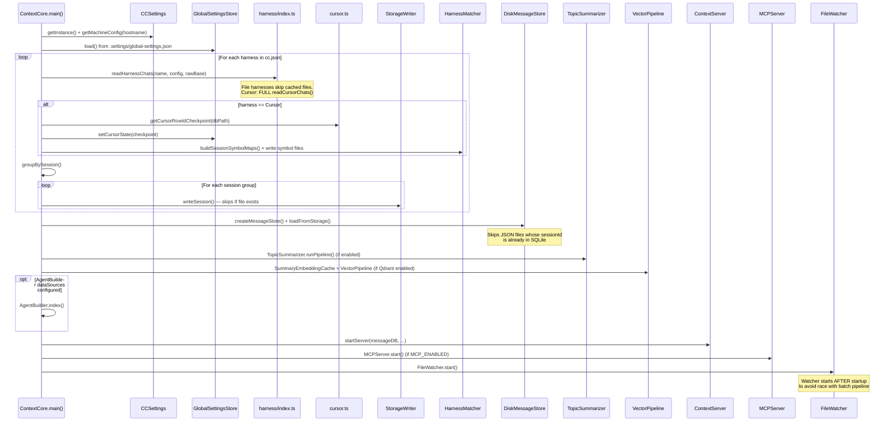
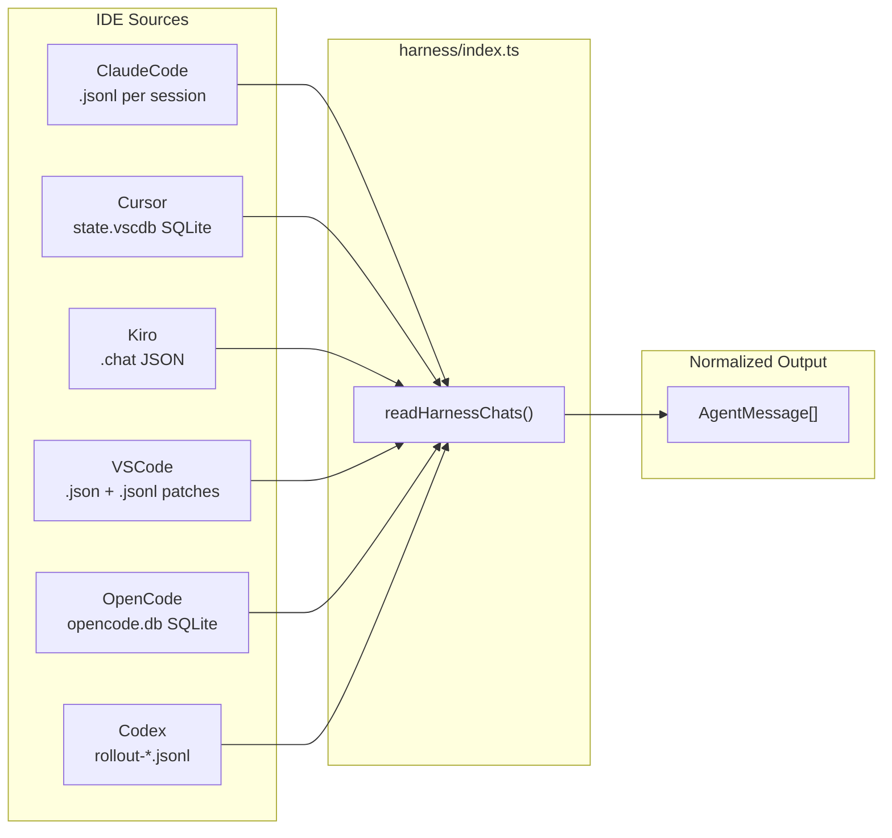
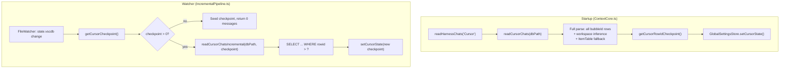
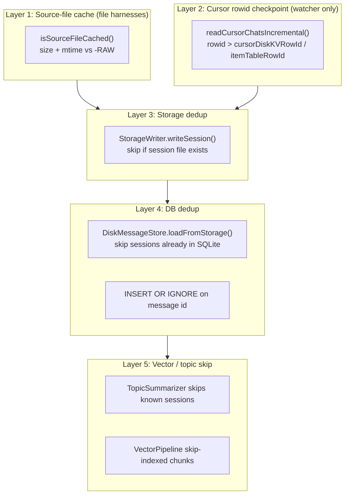
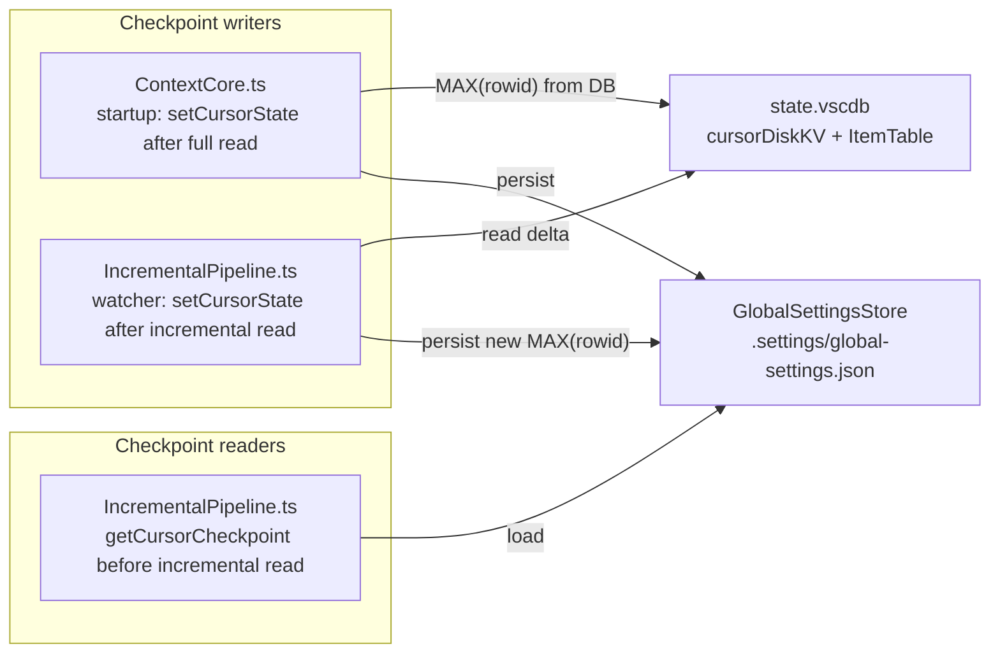
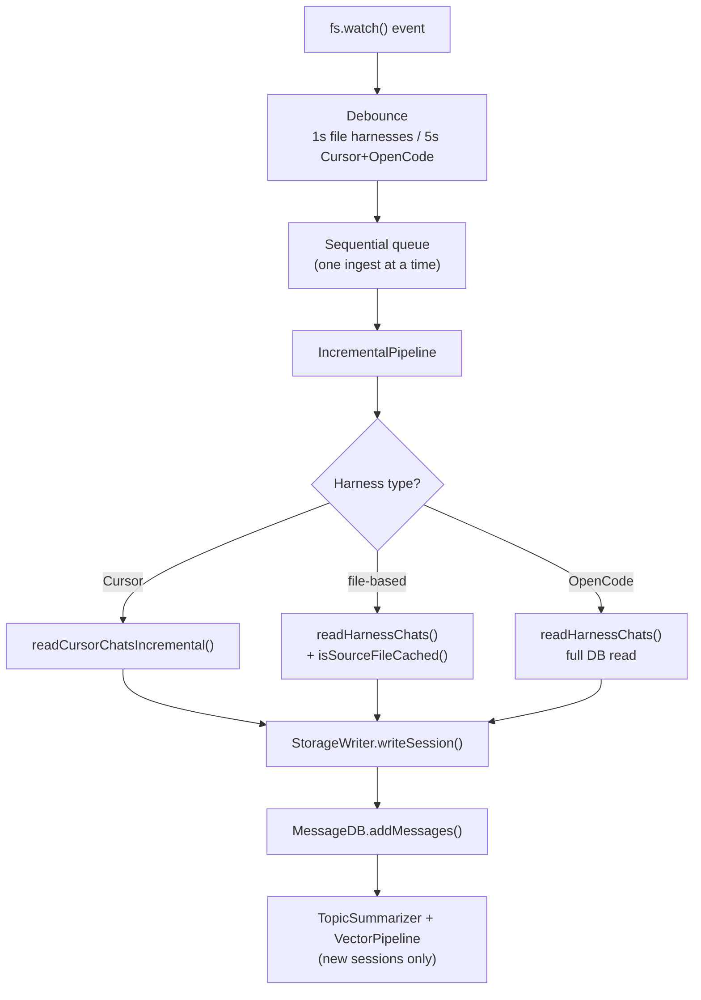
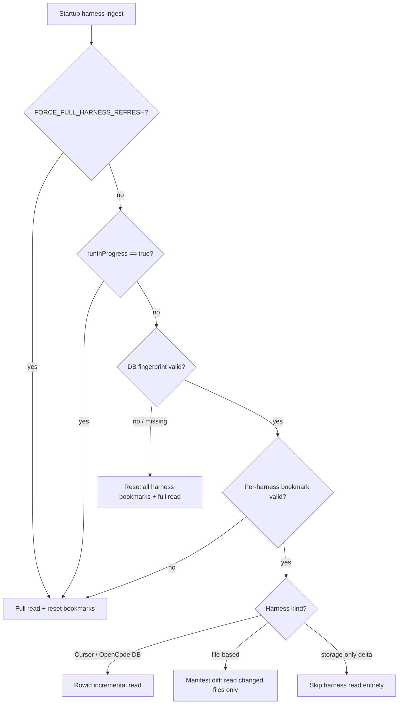
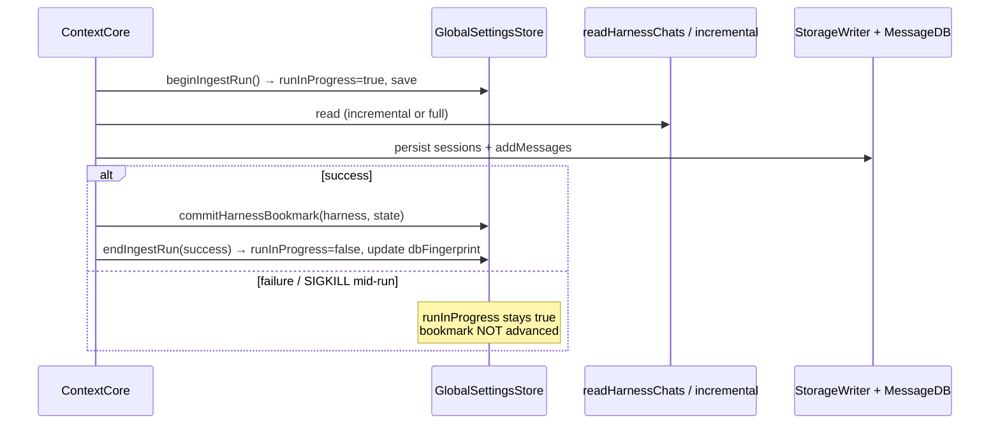
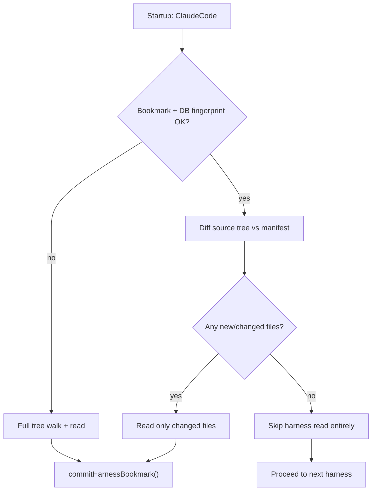

# R2SO — Startup Optimization (Architectural Review)

**Date**: 2026-06-08
**Status**: Retroactive documentation + forward-looking optimization plan
**Scope**: Full ContextCore startup pipeline, conversation ingestion strategies, and incremental-read optimizations (especially Cursor)
**Retroactive work documented**: Cursor rowid-based incremental watcher ingest (implemented 2026-04-10, originally undocumented as an upgrade plan)
**Architecture refs**: [`archi-context-core-level0.md`](../../architecture/archi-context-core-level0.md), [`archi-harness.md`](../../architecture/harness/archi-harness.md), [`archi-h-cursor.md`](../../architecture/harness/archi-h-cursor.md), [`archi-file-watcher.md`](../../architecture/data/archi-file-watcher.md), [`archi-database.md`](../../architecture/data/archi-database.md)
**Predecessor plans**: [`r2ufs-file-system-watcher.md`](../2026-03/r2ufs-file-system-watcher.md) (identified Cursor full re-read problem), [`r2udb-database-upgrade.md`](../2026-03/r2udb-database-upgrade.md) (on-disk DB incremental load)

---

## 1. Problem Statement

ContextCore startup is a **multi-stage batch pipeline**: read IDE sources → persist JSON sessions → load SQLite → summarize topics → embed vectors → start API/MCP → start FileWatcher.

Two performance pain points drove optimization work:

| Pain point | When | Symptom |
|---|---|---|
| **Cursor watcher full re-read** | Every `state.vscdb` change while running | 22k+ bubble rows + 56k+ workspace rows re-parsed on every DB touch |
| **Startup full harness scan** | Every process restart | All harness sources re-read even when storage + DB already contain the corpus |

The **watcher path for Cursor** was optimized on **2026-04-10** via rowid checkpoints. The **startup path for Cursor** still performs a full `readCursorChats()` on every boot — this document captures current state and frames the remaining startup optimization.

---

## 2. Current Startup Flow (As Implemented)

Entry point: [`ContextCore.ts`](../../../src/ContextCore.ts) → `main()`.



### 2.1 Startup Stage Inventory

| Stage | Module | Incremental? | Notes |
|---|---|---|---|
| **1. Config** | `CCSettings`, `config.ts` | N/A | Hostname → machine selection from `cc.json` |
| **2. Harness read** | `harness/*.ts` | Partial | File harnesses: `isSourceFileCached()`. Cursor/OpenCode: full DB read |
| **3. Cursor checkpoint seed** | `GlobalSettingsStore`, `cursor.ts` | N/A | Writes `MAX(rowid)` after full Cursor read |
| **4. Cursor symbol maps** | `HarnessMatcher` | No | Rebuilt every startup when Cursor has messages |
| **5. Storage write** | `StorageWriter` | Yes | Skips existing session files (`existsSync`, session dedup) |
| **6. DB load** | `DiskMessageStore.loadFromStorage()` | Yes | Skips sessions already in SQLite |
| **7. Topic summarization** | `TopicSummarizer` | Partial | Skips sessions that already have topic entries |
| **8. Vector indexing** | `VectorPipeline` | Partial | Skip-indexed chunks; `SKIP_STARTUP_UPDATING_QDRANT` env gate |
| **9. AgentBuilder** | `AgentBuilder.index()` | No | Full re-index of configured data sources |
| **10. API + MCP** | `ContextServer`, `MCPServer` | N/A | Binds port, mounts routes |
| **11. FileWatcher** | `FileWatcher` + `IncrementalPipeline` | Yes | Live incremental ingest (Cursor: rowid-based) |

### 2.2 Environment Gates Affecting Startup Cost

| Variable | Default | Effect |
|---|---|---|
| `SKIP_AI_SUMMARIZATION` | `true` | Skips GPT topic pipeline at startup |
| `SKIP_AI_SUMMARIZATION_PASS_2` | `false` | Gates pass-2 re-summarization |
| `SKIP_STARTUP_UPDATING_QDRANT` | varies | Skips vector indexing at startup |
| `DO_NOT_USE_QDRANT` | `false` | Disables Qdrant entirely |
| `IN_MEMORY_DB` | `false` | Uses in-memory SQLite (full reload every boot) |

---

## 3. How We Read Conversations

Each harness implements `(path, rawBase) → AgentMessage[]`. The registry in [`harness/index.ts`](../../../src/harness/index.ts) dispatches by name.



### 3.1 Per-Harness Read Strategy

| Harness | Source | Startup read | Watcher read | Cache / skip mechanism |
|---|---|---|---|---|
| **ClaudeCode** | `.jsonl` files | Full tree scan | Scoped to changed path | `isSourceFileCached()` — size + mtime vs `-RAW` copy |
| **Cursor** | `state.vscdb` | **Full DB read** (`readCursorChats`) | **Rowid incremental** (`readCursorChatsIncremental`) | Watcher: `rowid > checkpoint`. Startup: none |
| **Kiro** | `.chat` files | Full tree scan | Scoped to changed path | `isSourceFileCached()` after project resolution |
| **VSCode** | `.json` / `.jsonl` | Full tree scan | Scoped to changed path | `isSourceFileCached()` |
| **OpenCode** | `opencode.db` | Full DB read | Full DB read | Extension filter on watcher (`.db`/`.json` only, not `.db-wal`/`.db-shm`) |
| **Codex** | `rollout-*.jsonl` | Recursive scan | Scoped to changed path | `isSourceFileCached()` |

### 3.2 Cursor Read Paths (Startup vs Watcher)



**Key asymmetry**: watcher path is rowid-incremental; startup path is still full.

---

## 4. What We Optimize (and What We Don't Yet)

### 4.1 Optimization Layers



### 4.2 Retroactive: Cursor Watcher Optimization (2026-04-10)

**Problem** (from [`r2ufs-file-system-watcher.md`](../2026-03/r2ufs-file-system-watcher.md) §4.2, §6.2):

> Cursor stores everything in a single SQLite DB. On `state.vscdb` change, re-read the entire Cursor harness.

With 22k bubbles and 56k workspace rows, every keystroke-level DB flush triggered a full parse.

**Solution**: rowid-based incremental reads gated by a persisted checkpoint.

| Component | Role |
|---|---|
| `GlobalSettingsStore` | Persists checkpoint to disk |
| `getCursorRowIdCheckpoint()` | Reads `MAX(rowid)` from `cursorDiskKV` + `ItemTable` |
| `readCursorChatsIncremental()` | Queries only `rowid > checkpoint` rows |
| `IncrementalPipeline.ingest()` | Cursor branch uses incremental path; other harnesses use `readHarnessChats()` |
| `ContextCore.ts` | Seeds checkpoint after startup full read |

**Why rowid, not timestamp**: `cursorDiskKV` and `ItemTable` have no `added_date` column — schema is only `key TEXT, value BLOB`. SQLite `rowid` progression is the only reliable delta signal.

### 4.3 Remaining Gap: Startup Full Read (All Harnesses)

On every restart, `ContextCore.ts` still calls `readHarnessChats()` for **every** configured harness. For Cursor this means full `readCursorChats()` against a monolithic `state.vscdb` — in production this file can exceed **1.9 GiB**, making a full parse prohibitive on every boot.

Downstream layers make re-reads **mostly a no-op** for already-ingested data:

- `StorageWriter` returns existing path without rewriting
- `DiskMessageStore.loadFromStorage()` skips sessions already in DB
- `INSERT OR IGNORE` rejects duplicate message IDs
- File harnesses: `isSourceFileCached()` skips unchanged source files (but still **walk the full source tree**)

But the **expensive work still runs** where no bookmark gate exists:

| Harness | Wasted work on steady-state restart |
|---|---|
| **Cursor** | Open 1.9 GiB DB, scan all bubble rows, workspace inference, HarnessMatcher rebuild |
| **OpenCode** | Full `opencode.db` read (same DB-class problem, no rowid bookmark yet) |
| **ClaudeCode, Kiro, VSCode, Codex** | Full directory tree walk (per-file cache helps only after a file is visited) |

**Proposed future optimization** (not yet implemented): gate startup reads behind validated ingest bookmarks in `global-settings.json`. Incremental path when bookmark + DB fingerprint are healthy; full path only when detection signals require it.

---

## 5. Cursor Checkpoint — Where It Lives

### 5.1 Persisted on Disk

```
{storage}/.settings/global-settings.json
```

**Current shape (v1 — as implemented today):**

```json
{
  "cursor": {
    "cursorDiskKVRowId": 46876,
    "itemTableRowId": 1234,
    "lastQueriedAt": "2026-04-10T12:40:00.000Z"
  }
}
```

**Target shape (v2 — see §9):** Cursor rowids move under `ingest.harnesses.Cursor` alongside a general `harnesses` map and `dbFingerprint`. The v1 top-level `cursor` key is retained only during migration.

### 5.2 In-Memory Access

| What | Where | Purpose |
|---|---|---|
| **Store class** | [`GlobalSettingsStore.ts`](../../../src/settings/GlobalSettingsStore.ts) | Load/save/persist checkpoint |
| **Type** | `CursorRowIdCheckpoint` | `{ cursorDiskKVRowId, itemTableRowId }` |
| **Read checkpoint** | `globalSettingsStore.getCursorCheckpoint()` | Returns current rowid values (0 if unset) |
| **Write checkpoint** | `globalSettingsStore.setCursorState(checkpoint)` | Updates rowids + `lastQueriedAt`, saves to disk |
| **Read MAX(rowid) from DB** | `getCursorRowIdCheckpoint(dbPath)` in [`cursor.ts`](../../../src/harness/cursor.ts) | Queries live `state.vscdb` for latest rowids |
| **Incremental read** | `readCursorChatsIncremental(dbPath, rawBase, checkpoint)` | Parses only rows newer than checkpoint |

### 5.3 Who Reads / Writes the Checkpoint



### 5.4 Checkpoint Log Lines

```
[Cursor][Checkpoint] Startup full refresh: cursorDiskKV=45000, ItemTable=1200 -> cursorDiskKV=46876, ItemTable=1234
[Cursor][Checkpoint] Watcher start: cursorDiskKV=46876, ItemTable=1234
[Cursor][Checkpoint] Watcher end: cursorDiskKV=46876, ItemTable=1234 -> cursorDiskKV=46880, ItemTable=1234
```

---

## 6. Post-Startup: FileWatcher Live Ingest

After API/MCP are up, [`FileWatcher.ts`](../../../src/watcher/FileWatcher.ts) watches harness source paths + remote machine storage dirs.



Dual-mode watching:

| Mode | Watches | Pipeline |
|---|---|---|
| **Harness** | Local IDE sources from `cc.json` | Full downstream: harness → storage → DB → AI/vector |
| **Remote storage** | `{storage}/{OtherMachine}/**/*.json` | Short: parse JSON → DB → AI/vector (no harness re-read) |

---

## 7. Deduplication Guarantees (Why Re-Reads Are Mostly Harmless)

Even when a full read happens, multiple layers prevent duplicate data:

| Layer | Mechanism | Module |
|---|---|---|
| Message ID | `SHA-256(sessionId \| role \| timestamp \| prefix)` → 16 hex chars | `hashId.ts` |
| Storage file | `existsSync(outputPath)` + session-level path cache | `StorageWriter.ts` |
| DB insert | `INSERT OR IGNORE` on message primary key | `BaseMessageStore.ts` |
| DB load | Skip JSON files whose `sessionId` is already in SQLite | `DiskMessageStore.ts` |
| Raw archive | Skip if `-RAW` copy matches size + mtime | `rawCopier.ts` |

**Implication**: re-reading already-ingested conversations produces **no new persisted data** but still consumes **parse time and memory**. The optimization target is eliminating unnecessary parse work, not fixing data corruption.

### 7.1 When a Full Re-Read *Is* Still Required

Incremental startup is the default goal, but a full re-read (or full bookmark reset) remains necessary in these cases:

| Scenario | Why incremental is unsafe | Detection signal (proposed) |
|---|---|---|
| **First run / empty bookmark** | No checkpoint or manifest to delta from | `harnesses.{name}` absent or `lastSuccessfulIngestAt` null |
| **DB wiped or replaced** | Bookmarks point at a corpus that no longer exists in SQLite | DB file missing, or stored `dbFingerprint` ≠ live DB stats |
| **Storage wiped but DB retained** | Orphan DB rows with no JSON backing (less common) | Storage session file count drop vs bookmark `storageSessionCount` |
| **Crash mid-ingest** | Bookmark may be ahead of what actually landed in DB/storage | `runInProgress: true` on startup (see §9.2) |
| **Unclean shutdown during watcher ingest** | Cursor rowid advanced but `addMessages()` never committed | Same `runInProgress` gate; Cursor rowid not advanced until harness stage succeeds |
| **Harness parser / mapping rule change** | Old bookmarks produced under different logic | `harnessCodeVersion` or `parserEpoch` bump in settings vs compiled constant |
| **Source path config change** | `cc.json` paths moved; old manifest invalid | `sourceRoots` in bookmark ≠ current `cc.json` paths (normalized) |
| **Cursor DB replaced or truncated** | Rowid checkpoint refers to a different physical file | `sourceSizeBytes` / `sourceMtime` / `sourceInode` mismatch vs bookmark |
| **Manual force refresh** | Operator knows better | `FORCE_FULL_HARNESS_REFRESH=true` or `--full-refresh` CLI flag |

**Steady-state rule of thumb**: if messages are in the DB, storage JSON exists, bookmarks are consistent, and the previous run completed cleanly → **do not full-read**. For Cursor specifically, use rowid incremental (watcher path already does this; startup should adopt the same gate).

---

## 8. Detecting When Full Re-Read Is Required

### 8.1 Decision Flow



### 8.2 DB Wipe Detection (Easy)

Store a **DB fingerprint** in `global-settings.json` at the end of every successful startup. On next boot, compare against the live database:

| Fingerprint field | Source | Wipe signal |
|---|---|---|
| `databaseFile` | `cc.json` → `databaseFile` path | File does not exist → full reset |
| `messageCount` | `messageDB.getMessageCount()` | Stored count > live count → DB was truncated or recreated |
| `sessionCount` | `SELECT COUNT(DISTINCT sessionId)` | Same |
| `fileMtime` | `stat(databaseFile).mtimeMs` | Changed while counts dropped → replaced DB file |
| `fileSizeBytes` | `stat(databaseFile).size` | Useful secondary signal |

**On wipe detected**: call `GlobalSettingsStore.resetAllIngestBookmarks()` — zero out Cursor rowids, clear file manifests, set `runInProgress: false`, then run full harness reads for all configured sources.

### 8.3 Crash Detection (Easy)

Use a **two-phase commit** for bookmarks — never advance the marker until the harness ingest stage completes successfully.



**On next startup** with `runInProgress: true`:

1. Log warning: `[Ingest] Previous run did not complete — refusing to trust bookmarks`
2. Do **not** advance Cursor rowids or file manifests from the interrupted run
3. Either full-read the affected harness(es), or re-run incremental from the **last committed** bookmark (safer: full-read for Cursor/OpenCode; manifest re-walk for file harnesses)

**Watcher path**: same rule — `IncrementalPipeline` must not call `setCursorState()` until `addMessages()` succeeds for that ingest batch. Current code advances checkpoint after read; this should be tightened to commit **after** downstream persistence succeeds.

### 8.4 Additional Detection Proposals

| Signal | Applies to | Proposal |
|---|---|---|
| **Source file identity** | Cursor, OpenCode | Bookmark `sourcePath` + `sourceSizeBytes` + `sourceMtimeMs`. If any differ → treat as new/replaced DB (full read or re-seed rowid from 0) |
| **Rowid regression** | Cursor | If live `MAX(rowid)` < bookmarked rowid → DB was vacuumed/replaced → reset Cursor bookmark |
| **File manifest hash** | ClaudeCode, Kiro, VSCode, Codex | At end of successful scan, store `{ path, size, mtime }[]` or a rolling hash per source root. Startup: walk tree, diff against manifest, read only changed/new paths |
| **`-RAW` archive as ground truth** | File harnesses | Already mirrors source with size+mtime. Manifest can be derived from `-RAW` without re-statting every source file on cold boot |
| **Harness message count sanity** | All | `bookmark.messagesIngested` vs `messageDB.getHarnessCounts()` — large drift triggers re-read for that harness |
| **Parser epoch** | All | Bump `INGEST_PARSER_EPOCH` constant when harness logic changes; mismatch → full re-read for affected harness |
| **Config path drift** | All | Hash normalized `cc.json` harness `paths` array; change → invalidate that harness bookmark only |

### 8.5 What We Do *Not* Need to Detect

| Case | Why |
|---|---|
| Duplicate messages in DB | `INSERT OR IGNORE` already handles |
| Duplicate session JSON files | `StorageWriter` dedup handles |
| Watcher firing during startup | FileWatcher starts after startup completes (sequential `await` in `main()`) |

---

## 9. Generalized Ingest Bookmarks (`global-settings.json` v2)

Today `global-settings.json` only tracks Cursor rowids. The startup optimization expands it into a **general ingest bookmark store** while keeping Cursor-specific rowid fields (Cursor's monolithic DB warrants its own fast-path).

### 9.1 Proposed Schema

```json
{
  "schemaVersion": 2,
  "ingest": {
    "runInProgress": false,
    "runInProgressStartedAt": null,
    "lastSuccessfulRunAt": "2026-06-08T10:00:00.000Z",
    "parserEpoch": 1,
    "dbFingerprint": {
      "databaseFile": "cxc-db.sqlite",
      "messageCount": 184203,
      "sessionCount": 4217,
      "fileMtimeMs": 1749384000000,
      "fileSizeBytes": 524288000
    },
    "harnesses": {
      "ClaudeCode": {
        "mode": "file-manifest",
        "lastSuccessfulIngestAt": "2026-06-08T10:00:00.000Z",
        "sourceRoots": ["C:\\Users\\...\\.claude\\projects"],
        "filesIndexed": 412,
        "filesSkippedCached": 410,
        "manifestRevision": 3
      },
      "Cursor": {
        "mode": "rowid",
        "lastSuccessfulIngestAt": "2026-06-08T10:00:00.000Z",
        "sourcePath": "C:\\Users\\...\\state.vscdb",
        "sourceSizeBytes": 2040109465,
        "sourceMtimeMs": 1749383900000,
        "cursorDiskKVRowId": 46876,
        "itemTableRowId": 1234
      },
      "Kiro": { "mode": "file-manifest", "..." : "..." },
      "VSCode": { "mode": "file-manifest", "..." : "..." },
      "OpenCode": {
        "mode": "rowid",
        "sourcePath": "C:\\Users\\...\\opencode.db",
        "messageRowId": 0,
        "note": "placeholder — adopt same pattern as Cursor when implemented"
      },
      "Codex": { "mode": "file-manifest", "..." : "..." }
    }
  }
}
```

### 9.2 Bookmark Modes by Harness

| Mode | Harnesses | Bookmark tracks | Startup behavior (steady state) |
|---|---|---|---|
| **`rowid`** | Cursor (now), OpenCode (future) | `MAX(rowid)` per relevant table + source file identity | `readXIncremental()` — parse only new rows |
| **`file-manifest`** | ClaudeCode, Kiro, VSCode, Codex | Per-source-file `{ path, size, mtime }` or derived from `-RAW` | Walk tree, read **only** files that differ from manifest |
| **`skip`** | N/A (optimization) | All files match manifest, DB fingerprint OK | **Skip harness read entirely** — zero source I/O |

Cursor keeps its dedicated `cursorDiskKVRowId` / `itemTableRowId` fields under `harnesses.Cursor` (not a separate top-level `cursor` key) for clarity, but the store may accept both shapes during migration.

### 9.3 GlobalSettingsStore API (Proposed)

| Method | Purpose |
|---|---|
| `beginIngestRun()` | Set `runInProgress: true`, save immediately |
| `endIngestRun(success, dbFingerprint)` | Clear `runInProgress`, update `lastSuccessfulRunAt` + DB fingerprint on success |
| `getHarnessBookmark(name)` | Return bookmark for one harness |
| `commitHarnessBookmark(name, state)` | Persist per-harness state **only after** that harness stage succeeds |
| `resetHarnessBookmark(name)` | Clear one harness (config path change, manual reset) |
| `resetAllIngestBookmarks()` | DB wipe / catastrophic recovery |
| `isRunInProgress()` | Crash detection on startup |
| `isDbFingerprintValid(liveStats)` | Compare stored vs live DB |
| `getCursorCheckpoint()` | **Retained** — reads from `harnesses.Cursor` rowid fields |

### 9.4 Migration from Current Shape

Current file uses top-level `cursor: { cursorDiskKVRowId, itemTableRowId, lastQueriedAt }`. Migration on load:

1. If `schemaVersion` absent, treat as v1
2. Copy `cursor.*` → `ingest.harnesses.Cursor.{ rowid fields, lastSuccessfulIngestAt }`
3. Set `schemaVersion: 2`, `parserEpoch: 1`
4. Write back on first successful `endIngestRun()`

### 9.5 File Manifest Detail (File-Based Harnesses)

File harnesses already have per-file cache via `isSourceFileCached()` (size + mtime vs `-RAW`). The manifest layer adds a **startup gate before the walk**:



Manifest can be stored inline in `global-settings.json` (small installs) or spill to `.settings/ingest-manifests/{harness}.json` if the file list is large.

---

## 10. Retroactive Implementation Record (2026-04-10)

Work was implemented in Codex session `019d76ea-8f5b-73e0-b233-cb54b572cb7a` without a dedicated upgrade plan file. Files touched:

| File | Change |
|---|---|
| `src/settings/GlobalSettingsStore.ts` | **New** — persists cursor rowid checkpoint + `lastQueriedAt` |
| `src/harness/cursor.ts` | Added `getCursorRowIdCheckpoint()`, `readCursorChatsIncremental()` |
| `src/harness/cursor-query.ts` | Added `extractCursorBubbleMessagesSinceRowId()` |
| `src/watcher/IncrementalPipeline.ts` | Cursor branch uses incremental read + checkpoint logging |
| `src/ContextCore.ts` | Seeds checkpoint after startup full read; passes `GlobalSettingsStore` to pipeline |
| `archi-h-cursor.md` | §2.4 rowid incremental watcher ingest |
| `archi-file-watcher.md` | Mixed harness ingest diagram + checkpoint semantics |

---

## 11. Forward Work — Startup Optimization Tasks

### Phase 1 — Crash-safe bookmarks (foundation)

- [ ] **T1.** Extend `GlobalSettingsStore` to schema v2: `ingest.runInProgress`, `dbFingerprint`, `harnesses{}` map
- [ ] **T2.** Implement `beginIngestRun()` / `endIngestRun()` in `ContextCore.main()` — set `runInProgress` at pipeline start, clear only on clean completion
- [ ] **T3.** Move Cursor checkpoint commit to **after** `StorageWriter` + `loadFromStorage`/`addMessages` succeed (startup + watcher)
- [ ] **T4.** On startup: if `runInProgress === true`, log warning and refuse to trust bookmarks → force recovery read
- [ ] **T5.** Implement `dbFingerprint` capture + `isDbFingerprintValid()` — reset all bookmarks on DB wipe detection

### Phase 2 — Cursor startup incremental (highest impact)

- [ ] **T6.** Gate startup Cursor read: if bookmark valid + DB has Cursor sessions, use `readCursorChatsIncremental()` instead of `readCursorChats()`
- [ ] **T7.** Bookmark Cursor `sourceSizeBytes` + `sourceMtimeMs` — invalidate on DB file replacement
- [ ] **T8.** Gate HarnessMatcher symbol map rebuild — skip when incremental Cursor read returns 0 new messages
- [ ] **T9.** Detect rowid regression (`MAX(rowid)` < bookmark) → reset Cursor bookmark + full read

### Phase 3 — All harnesses

- [ ] **T10.** Add `file-manifest` bookmark mode for ClaudeCode, Kiro, VSCode, Codex
- [ ] **T11.** Startup tree diff: skip harness entirely when manifest + DB fingerprint match (zero source I/O)
- [ ] **T12.** OpenCode: adopt `rowid` bookmark mode (same pattern as Cursor)
- [ ] **T13.** Add `INGEST_PARSER_EPOCH` constant — bump forces full re-read for affected harnesses
- [ ] **T14.** Hash `cc.json` harness `paths` — invalidate per-harness bookmark on config drift

### Phase 4 — Operator controls + observability

- [ ] **T15.** Add `FORCE_FULL_HARNESS_REFRESH=true` env and/or `--full-refresh` CLI flag
- [ ] **T16.** Startup metrics: per-harness duration, files scanned vs skipped vs read, messages parsed vs written vs loaded
- [ ] **T17.** `bun run cxc ingest-status` (or similar) — print bookmark health, DB fingerprint, last run state
- [ ] **T18.** Migrate v1 `cursor` top-level key → v2 `ingest.harnesses.Cursor` on load

---

## 12. Related Documents

| Document | Relevance |
|---|---|
| [`r2ufs-file-system-watcher.md`](../2026-03/r2ufs-file-system-watcher.md) | Original FileWatcher plan; identified Cursor full re-read as accepted cost |
| [`r2udb-database-upgrade.md`](../2026-03/r2udb-database-upgrade.md) | On-disk SQLite + incremental `loadFromStorage()` |
| [`r2cfw-cache-file-watcher.md`](../2026-03/r2cfw-cache-file-watcher.md) | Response cache invalidation on watcher ingest (separate concern) |
| [`archi-h-cursor.md`](../../architecture/harness/archi-h-cursor.md) | Cursor harness deep dive + §2.4 incremental update |
| [`archi-file-watcher.md`](../../architecture/data/archi-file-watcher.md) | FileWatcher + IncrementalPipeline architecture |
