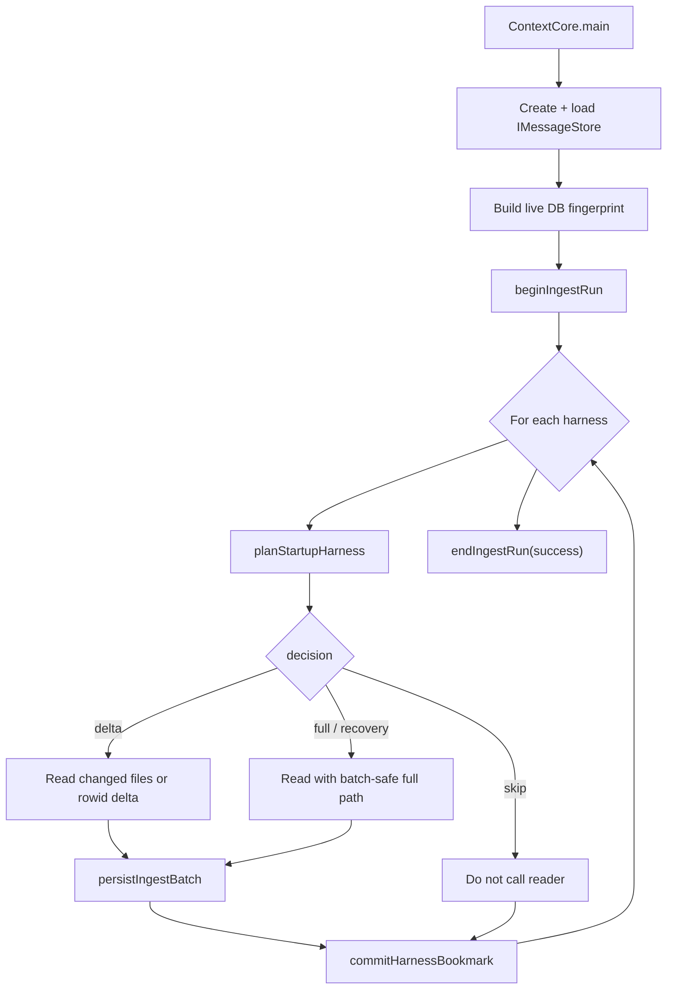

# R2SO - Startup Optimization Implementation Plan

**Date**: 2026-06-08
**Status**: Planned
**Goal**: Stop full conversation re-reads on steady-state startup for every harness, and make required Cursor full/recovery reads bounded to batches of at most 5,000 emitted messages per processing step.

## Mandatory Reading

| file name | line range | description |
|---|---:|---|
| `server/zz-reach2/upgrades/2026-06/r2so-startup-optimization-status.md` | 1-636 | Current status and target architecture: startup still full-reads harnesses, Cursor watcher already has rowid checkpoints, proposed v2 bookmarks, crash detection, DB fingerprinting, and forward work. |
| `server/zz-reach2/architecture/archi-context-core-level0.md` | 1-922 | Level-0 flow for harness -> storage -> DB -> API/MCP, module inventory, subject generation, deduplication, risks, and current startup ordering. |
| `server/zz-reach2/architecture/harness/archi-harness.md` | 1-1036 | Cross-harness reader contracts, source formats, cache behavior, project/model mapping, and raw archival differences for ClaudeCode, Cursor, Kiro, VSCode, OpenCode, and Codex. |
| `server/zz-reach2/architecture/data/archi-file-watcher.md` | 1-693 | Incremental live ingest model, Cursor rowid checkpoint semantics, debounce/queue behavior, remote storage ingest, and write serialization constraints. |
| `server/zz-reach2/architecture/data/archi-database.md` | 1-662 | Two-tier storage model, `IMessageStore`, on-disk SQLite/WAL behavior, incremental `loadFromStorage()`, `addMessages()`, and DB concurrency guarantees. |
| `server/src/ContextCore.ts` | 131-234, 527-543 | Current startup full harness read loop, Cursor checkpoint seeding before DB load, storage write loop, DB load, and later FileWatcher startup. |
| `server/src/settings/GlobalSettingsStore.ts` | 1-130 | Current v1 global settings shape with only top-level Cursor rowid checkpoint state. |
| `server/src/harness/index.ts` | 1-63 | Current registry contract materializes one `AgentMessage[]` per harness/path, which blocks streaming or chunked startup ingest. |
| `server/src/harness/cursor.ts` | 104-649 | Full Cursor read path, current incremental rowid watcher read, and checkpoint functions that startup should reuse and harden. |
| `server/src/harness/cursor-query.ts` | 697-936 | Current Cursor bubble scan and delta scan use `.all()` and then process/log every 5,000 rows; that is progress logging, not memory-bounded chunking. |
| `server/src/harness/cursor-matcher.ts` | 1088-1210 | Current workspace inference loads every `cursorDiskKV` row into `allRows` before processing; this is one of the main 10+ GiB memory contributors. |
| `server/src/watcher/IncrementalPipeline.ts` | 96-235 | Existing post-startup ingest flow, Cursor incremental branch, current early checkpoint commit, storage writes, `addMessages()`, and full-session overwrite behavior. |
| `server/src/db/DiskMessageStore.ts` | 1-105 | On-disk SQLite setup, incremental storage load, and transaction-wrapped `addMessages()` used by both startup and watcher ingest. |
| `server/src/harness/opencode.ts` | 130-176 | Current OpenCode startup/watch read loads all sessions from SQLite and accumulates all messages, so it needs its own bookmark and affected-session path. |
| `server/src/utils/rawCopier.ts` | 1-112 | Existing file cache and raw DB dump behavior; chunked DB harnesses must avoid overwriting/skipping one raw file while still preserving provenance. |

## Objective

Steady-state startup must not full-read conversation sources for any harness. A normal restart should validate bookmarks, load the already-persisted SQLite/JSON state, skip unchanged harnesses, start API/MCP quickly, and let FileWatcher handle live deltas.

Full re-read remains allowed only for first run, forced refresh, invalid bookmarks, parser epoch changes, DB/storage wipe detection, source replacement, or crash recovery. When a Cursor full/recovery read is required, it must be processed in bounded batches: no more than 5,000 Cursor messages per persisted batch, no `cursorDiskKV` or workspace inference pass may hold all rows in memory, and progress logs must reflect real batch boundaries rather than only loop counters.

## Design Rules

- Startup should create/load `IMessageStore` before harness ingest decisions so DB fingerprint and existing data are available.
- Startup and FileWatcher should share one batch persistence path: stamp machine/harness, write storage, call `addMessages()`, overwrite the complete session file only when needed, summarize/embed only new messages.
- Bookmarks are committed after persistence succeeds, never immediately after source read.
- Cursor full read should stream/page source rows with `LIMIT 5000`, build only compact per-session workspace state, emit/persist batches, then release batch arrays.
- File-based harnesses should use manifests to skip unchanged startup roots before parsing. If files changed, read only the changed/new files.
- DB-backed harnesses should use rowid/affected-session bookmarks. Cursor is first; OpenCode follows the same model.
- Every plan group below is chronological, capped at 8 tasks, and tagged `{{SIMPLE}}` or `{{MEDIUM}}` only. Previous higher-difficulty work has been split into narrower implementation batches.

## Implementation Sketches

### Startup Decision Flow



### Bookmark Shape Target

```ts
type HarnessBookmark = {
  mode: "file-manifest" | "rowid";
  parserEpoch: number;
  sourcePathHash: string;
  lastSuccessfulIngestAt: string | null;
  sourceIdentity?: {
    path: string;
    sizeBytes: number;
    mtimeMs: number;
  };
  rowids?: Record<string, number>;
  manifestPath?: string;
};
```

ASSUMPTION: this was already built previously. If not, re-assess at runtime. This shape should be built in `GlobalSettingsStore` before later groups depend on it.

### Shared Batch Persistence Shape

```ts
type HarnessIngestBatch = {
  harnessName: string;
  messages: AgentMessage[];
  checkpointCandidate?: unknown;
  isFinalBatch: boolean;
};

async function persistIngestBatch(batch: HarnessIngestBatch): Promise<BatchPersistResult> {
  // Stamp machine/harness, group by session, write storage, add to DB.
  // Commit bookmarks outside this function after it succeeds.
}
```

ASSUMPTION: this was already built previously. If not, re-assess at runtime. Startup and FileWatcher should both call this helper once it exists.

### Cursor Paging Primitive

```ts
const rows = db.query<CursorKVRowWithRowId, [number, number]>(
  "SELECT rowid, key, value FROM cursorDiskKV " +
  "WHERE key LIKE 'bubbleId:%' AND rowid > ? " +
  "ORDER BY rowid LIMIT ?"
).all(lastSeenRowId, Math.min(batchSize, 5000));
```

The important part is not the progress log. The important part is that each `.all()` is bounded and its parsed rows are released after persistence.

{{SIMPLE}}
## Group 1 - Baseline, Flags, and Guardrails

- [ ] **T1.** Capture current startup baseline with the large Cursor DB: wall-clock startup time, peak `bun.exe` RSS, Cursor bubble count, workspace row count, and whether API/MCP bind before or after harness ingest.
- [X] **T2.** Add startup log categories for `startup-db-load`, `startup-ingest-plan`, `startup-harness-skip`, `startup-harness-delta`, `startup-harness-full`, and `startup-harness-batch`.
- [X] **T3.** Add `FORCE_FULL_HARNESS_REFRESH=true` support and ensure it is checked before every bookmark decision.
- [X] **T4.** Add `CURSOR_INGEST_BATCH_SIZE` with default `5000`, hard maximum `5000`, and lower-bound validation for test runs.
- [X] **T5.** Add `INGEST_PARSER_EPOCH` constants per harness, starting with the current epoch value for all harnesses.
- [X] **T6.** Add a startup summary line that reports, per harness, one of: `skipped`, `delta`, `full`, `forced-full`, or `recovery-full`.

{{MEDIUM}}
## Group 2 - Bookmark Types and V1 Migration

- [X] **T7.** Extend `GlobalSettingsStore` from v1 Cursor-only state to schema v2 with `ingest.runInProgress`, `lastSuccessfulRunAt`, `parserEpoch`, `dbFingerprint`, and `harnesses`.
- [X] **T8.** Migrate existing top-level `cursor` state into `ingest.harnesses.Cursor` on load while retaining `getCursorCheckpoint()` compatibility.
- [X] **T9.** Add `beginIngestRun()` and `endIngestRun(success, dbFingerprint)` methods that save immediately.
- [X] **T10.** Add `getHarnessBookmark(name)`, `commitHarnessBookmark(name, state)`, `resetHarnessBookmark(name)`, and `resetAllIngestBookmarks()`.
- [X] **T11.** Implement this migration pattern in `load()`:

```ts
if (!parsed.schemaVersion && parsed.cursor) {
  migrated.ingest.harnesses.Cursor = {
    mode: "rowid",
    rowids: {
      cursorDiskKV: parsed.cursor.cursorDiskKVRowId ?? 0,
      ItemTable: parsed.cursor.itemTableRowId ?? 0,
    },
    lastSuccessfulIngestAt: parsed.cursor.lastQueriedAt ?? null,
  };
}
```

- [X] **T12.** Unit-test v1-to-v2 migration, empty settings behavior, invalid JSON recovery, and saving committed harness state.

{{MEDIUM}}
## Group 3 - Bookmark Validation Helpers

ASSUMPTION: this was already built previously. If not, re-assess at runtime. Group 2 bookmark types and read/write methods should already exist.

- [X] **T13.** Add source-root hashing helpers that normalize `cc.json` paths from `HarnessConfig.paths` before storing them in each harness bookmark.
- [X] **T14.** Add parser epoch validation so a harness bookmark is invalid when its stored epoch differs from the current harness epoch.
- [X] **T15.** Add source file identity collector for DB harnesses using `statSync`: normalized source path, size bytes, and mtime ms.
- [X] **T16.** Add rowid regression helper for DB harnesses: return invalid when live rowid is lower than stored rowid.
- [X] **T17.** Add `ValidationResult = { ok: boolean; reason: string }` so startup logs can print why a full read is required.
- [X] **T18.** Unit-test validation helpers with changed path hash, parser epoch mismatch, source mtime change, and rowid regression.

{{MEDIUM}}
## Group 4 - DB Fingerprint Helpers

- [X] **T19.** Add a DB fingerprint collector using `settings.databaseFile`, file size, file mtime, `messageDB.getMessageCount()`, and `messageDB.getHarnessCounts()`.
- [X] **T20.** Add a session count collector using `messageDB.listSessions().length`; this is acceptable for now because it avoids widening the DB interface.
- [X] **T21.** Add `isDbFingerprintValid(liveFingerprint)` with conservative invalidation when stored counts are larger than live counts, DB path changed, or DB file is missing.
- [X] **T22.** On DB fingerprint failure, reset all ingest bookmarks and log that the next startup ingest is a recovery full read.
- [X] **T23.** On `runInProgress === true`, refuse to trust bookmarks and choose recovery decisions for affected harnesses.
- [X] **T24.** Unit-test DB fingerprint validation for missing DB file, reduced message count, reduced harness count, and unchanged DB.

{{MEDIUM}}
## Group 5 - Startup Reordering

ASSUMPTION: this was already built previously. If not, re-assess at runtime. Groups 2-4 validation helpers should already exist.

- [X] **T25.** Move `createMessageStore(settings)` and `messageDB.loadFromStorage(settings.storage)` before harness startup ingest decisions in `ContextCore.main()`.
- [X] **T26.** Keep existing storage-load behavior for old/remote JSON files, but stop relying on a later full DB reload to pick up startup harness output.
- [X] **T27.** Create a `StartupIngestCoordinator` module that receives `messageDB`, `storageWriter`, `settings`, `machine`, and `globalSettingsStore`.
- [X] **T28.** Replace the inline `for (const [harnessName, harnessConfig] ...)` startup loop with a call into `StartupIngestCoordinator`.
- [X] **T29.** Keep topic/vector startup after DB load plus startup delta ingest, so newly added startup messages are summarized/embedded exactly once.
- [X] **T30.** Keep FileWatcher creation after startup ingest and server setup, preserving the current no-race startup model.

{{MEDIUM}}
## Group 6 - Batch Contract Types

- [X] **T31.** Add `HarnessIngestBatch` and `BatchPersistResult` types in a shared ingest module, not inside `ContextCore.ts`.
- [X] **T32.** Include `checkpointCandidate` on `HarnessIngestBatch`, but do not commit it inside the reader.
- [X] **T33.** Include `touchedSessionIds` and `fatalError` on `BatchPersistResult`.
- [X] **T34.** Include `batchStats` fields for messages parsed, sessions scanned, messages inserted, storage files written, storage files overwritten, and duration.
- [X] **T35.** Add a no-op empty batch rule: empty messages with a checkpoint candidate may be treated as successful only when the reader explicitly marks it final.
- [X] **T36.** Document in comments that readers may allocate only batch-local arrays and must not return whole-corpus arrays in batch mode.

{{MEDIUM}}
## Group 7 - Shared Batch Persistence Helper

ASSUMPTION: this was already built previously. If not, re-assess at runtime. Group 6 batch types should already exist.

- [X] **T37.** Extract message stamping into a helper: set `machine`, set `harness`, and relativize `source` against storage root.
- [X] **T38.** Extract `groupBySession()` from both `ContextCore.ts` and `IncrementalPipeline.ts` into a shared utility.
- [X] **T39.** Implement `persistIngestBatch(batch)` using the same storage then DB sequence as watcher ingest.
- [X] **T40.** Preserve continued-conversation behavior: after `addMessages()` inserts rows, fetch `messageDB.getBySessionId(sessionId)` and `writeSession(..., overwrite=true)`.
- [X] **T41.** Return inserted message count and touched session IDs from `persistIngestBatch()`.
- [X] **T42.** Make `persistIngestBatch()` catch session-level errors, collect them, and mark fatal only when the whole batch cannot be trusted.
- [X] **T43.** After each batch, explicitly drop local references by exiting the function; do not store all batches in a parent array.
- [X] **T44.** Unit-test batch persistence with duplicate messages, new messages, and a throwing `StorageWriter`.

{{MEDIUM}}
## Group 8 - Watcher Uses Shared Persistence

ASSUMPTION: this was already built previously. If not, re-assess at runtime. Group 7 `persistIngestBatch()` should already exist.

- [X] **T45.** Change `IncrementalPipeline.ingest()` to wrap its messages in `HarnessIngestBatch` and call `persistIngestBatch()`.
- [X] **T46.** Move Cursor watcher `setCursorState(incremental.checkpoint)` after `persistIngestBatch()` succeeds.
- [X] **T47.** For Cursor watcher no-op deltas, allow checkpoint/source identity refresh only when the reader returned final success and there were no persistence errors.
- [X] **T48.** Keep watcher `result.sessionsScanned`, `result.messagesAdded`, and summarization/vector stats compatible with existing logs.
- [X] **T49.** Verify FileWatcher's sequential queue still calls only one `pipeline.ingest()` or `ingestFromStorage()` at a time.
- [X] **T50.** Add a test that simulates Cursor incremental read success followed by persistence failure and confirms the checkpoint is not advanced.

{{MEDIUM}}
## Group 9 - Cursor Row Page Reader

- [X] **T51.** Add a helper `readCursorKvPage(db, lastRowId, limit, whereSql)` that always uses `ORDER BY rowid LIMIT ?`.
- [X] **T52.** Make the helper clamp `limit` to `CURSOR_INGEST_BATCH_SIZE` and then to hard max `5000`.
- [X] **T53.** Replace `extractCursorBubbleMessages()` internals with a loop around `readCursorKvPage()` for `key LIKE 'bubbleId:%'`.
- [X] **T54.** Replace `extractCursorBubbleMessagesSinceRowId()` internals with the same page reader, starting from the stored checkpoint rowid.
- [X] **T55.** Return page metadata: first rowid, last rowid, selected row count, parsed bubble record count, and malformed count.
- [X] **T56.** Keep sorting inside a page only; global ordering across pages comes from rowid pagination plus per-session parent carry state.
- [X] **T57.** Add progress log `[Cursor][bubble-page] rowid=a..b selected=N parsed=M`.
- [X] **T58.** Unit-test the page helper against a tiny SQLite fixture with more than one page.

{{MEDIUM}}
## Group 10 - Cursor Bubble Page To Message Batch

ASSUMPTION: this was already built previously. If not, re-assess at runtime. Group 9 page reader should already exist.

- [X] **T59.** Add `CursorBatchState` with `lastMessageIdBySession: Map<string, string>` and no full-message history.
- [X] **T60.** Convert each page of `CursorBubbleRecord[]` into `AgentMessage[]` using `lastMessageIdBySession` for stable parent chaining.
- [X] **T61.** Stop accumulating all `results` in `readCursorChats()` when batch mode is active; emit one `HarnessIngestBatch` page at a time.
- [X] **T62.** Enforce at most 5,000 emitted `AgentMessage` objects per batch; if one page expands beyond that, split it before persistence.
- [X] **T63.** Write raw Cursor page data to collision-safe files like `{sessionId}.{firstRowId}-{lastRowId}.json`.
- [X] **T64.** Update message `source` to the page raw file; complete session storage is still maintained by `StorageWriter` overwrite from DB.
- [X] **T65.** Add tests for a session spanning two pages and verify parent IDs chain correctly.
- [X] **T66.** Add tests proving no emitted batch exceeds 5,000 messages.

{{MEDIUM}}
## Group 11 - Cursor Workspace Authoritative Per-Session Reads

ASSUMPTION: this was already built previously. If not, re-assess at runtime. Group 10 should emit batches with a known set of session IDs.

- [X] **T67.** Add `inferCursorWorkspaceForSessions(db, sessionIds, bubbleContextBySession, ruleSet)`.
- [X] **T68.** First query `composerData:{sessionId}` directly for each active session rather than scanning the whole table.
- [X] **T69.** Query `messageRequestContext:{sessionId}:%` directly for each active session to collect project layouts.
- [X] **T70.** Build `projectLayoutWorkspaceMap` and `composerWorkspaceMap` only for active session IDs.
- [X] **T71.** Reuse existing project resolution order: project layouts, composer file URIs, bubble hints, explicit rules, generic rules, `MISC`.
- [X] **T72.** Return the same output shape currently used by `inferCursorWorkspaceBySession()` where practical, so caller changes stay small.
- [X] **T73.** Add tests for one session with project layout metadata and one with composer metadata only.

{{MEDIUM}}
## Group 12 - Cursor Workspace Paged Fallback

ASSUMPTION: this was already built previously. If not, re-assess at runtime. Group 11 authoritative per-session inference should already exist.

- [X] **T74.** Add a fallback workspace scan that pages `cursorDiskKV` with `ORDER BY rowid LIMIT 5000`.
- [X] **T75.** During each workspace page, parse a row only if its key hints at one of the active session IDs or a workspace-related key family.
- [X] **T76.** Accumulate only compact counters: `Map<sessionId, Map<normalizedRoot, count>>`, unresolved family counts, and source counts.
- [X] **T77.** Release the parsed page rows before reading the next page.
- [X] **T78.** Add log `[Cursor][workspace-page] rowid=a..b selected=N relevant=M`.
- [X] **T79.** Make the fallback optional when authoritative metadata plus bubble context already resolves all active sessions.
- [X] **T80.** Test fallback with 12,000 fake rows and verify the helper reads three bounded pages.

{{MEDIUM}}
## Group 13 - Cursor Startup Decisions

ASSUMPTION: this was already built previously. If not, re-assess at runtime. Groups 3-4 validation helpers and Groups 9-12 Cursor batch readers should already exist.

- [X] **T81.** Add a Cursor planner that returns `skip` when bookmark is valid, source DB path is still valid, DB fingerprint is valid, and live max rowids equal stored rowids.
- [X] **T82.** Return `rowid-delta` when bookmark is valid and live max rowids are greater than stored rowids.
- [X] **T83.** Return `recovery-full` when rowids regress, DB fingerprint is invalid, source DB path changes or disappears, parser epoch changed, or `runInProgress` is true.
- [X] **T84.** Return `forced-full` when `FORCE_FULL_HARNESS_REFRESH` targets Cursor.
- [X] **T85.** Commit Cursor rowids only after all batches for the selected decision persist successfully.
- [X] **T86.** Skip `HarnessMatcher` symbol-map rebuild for `skip` and zero-insert delta runs.
- [X] **T87.** For Cursor delta sessions with missing or `MISC` project, reuse the existing DB session project when available.
- [X] **T88.** Add planner tests for skip, delta, rowid regression, forced full, and crash recovery.

{{MEDIUM}}
## Group 14 - File Manifest Store

- [X] **T89.** Add file-manifest bookmark mode for ClaudeCode, Kiro, VSCode, and Codex.
- [X] **T90.** Store large manifests in `.settings/ingest-manifests/{machine}-{harness}.json` and store only a manifest path/revision in `global-settings.json`.
- [X] **T91.** Manifest entry shape should include relative path, size, mtime, parser epoch, and optionally last raw archive path.
- [X] **T92.** Add manifest load/save helpers with invalid JSON fallback to force a full file-harness read.
- [X] **T93.** Add manifest diff helper that returns `newFiles`, `changedFiles`, `unchangedFiles`, and `deletedFiles`.
- [X] **T94.** Ensure deleted source files do not delete historical storage JSON; they only update the manifest.
- [X] **T95.** Unit-test manifest diff for new, changed, unchanged, deleted, and missing manifest file.

{{MEDIUM}}
## Group 15 - Scoped File Harness Readers

ASSUMPTION: this was already built previously. If not, re-assess at runtime. Group 14 manifest diff should already exist.

- [X] **T96.** Add registry support for scoped file reads, for example `readHarnessFiles(harnessName, filePaths, rawBase)`.
- [X] **T97.** Implement scoped ClaudeCode reads for selected `.jsonl` files while preserving the existing root reader for full reads.
- [X] **T98.** Implement scoped Codex reads for selected `rollout-*.jsonl` files while preserving canonical event filtering.
- [X] **T99.** Implement scoped VSCode reads for selected `.json`/`.jsonl` files and keep workspace lookup from the parent workspace storage directory.
- [X] **T100.** Implement scoped Kiro reads for selected `.chat` files, including project resolution before raw cache checks.
- [X] **T101.** Use existing `isSourceFileCached()` inside scoped readers as a second safety layer.
- [X] **T102.** Commit the new manifest only after all changed/new files were persisted and inserted successfully.

{{MEDIUM}}
## Group 16 - OpenCode Checkpoint Helpers

- [X] **T103.** Add OpenCode bookmark shape with source identity and rowid fields for `session`, `message`, and `part`.
- [X] **T104.** Add `getOpenCodeRowIdCheckpoint(dbPath)` using `MAX(rowid)` from those tables.
- [X] **T105.** Add source DB identity collection using the resolved `opencode.db` path, size, and mtime.
- [X] **T106.** Add rowid regression validation for all three OpenCode tables.
- [X] **T107.** Add affected-session SQL for message/part changes:

```sql
SELECT DISTINCT session_id FROM message WHERE rowid > ?
UNION
SELECT DISTINCT session_id FROM part WHERE rowid > ?
UNION
SELECT id AS session_id FROM session WHERE rowid > ?
```

- [X] **T108.** Unit-test checkpoint and affected-session helpers with a tiny SQLite fixture.

{{MEDIUM}}
## Group 17 - OpenCode Incremental Reader

ASSUMPTION: this was already built previously. If not, re-assess at runtime. Groups 7 and 16 should already exist.

- [X] **T109.** Add `readOpenCodeChatsIncremental(dbPath, rawBase, checkpoint)` that processes only affected session IDs.
- [X] **T110.** Reuse existing `processSession(db, session, rawBase)` for each affected session where possible.
- [X] **T111.** Return affected sessions through `HarnessIngestBatch` instead of accumulating all OpenCode messages.
- [X] **T112.** Add OpenCode startup decisions: `skip`, `rowid-delta`, `recovery-full`, and `forced-full`.
- [X] **T113.** Route OpenCode watcher DB events through incremental OpenCode read while keeping `.db-wal` and `.db-shm` ignored.
- [X] **T114.** Commit OpenCode rowids only after affected-session persistence succeeds.
- [X] **T115.** Add tests for first run, no-op restart, affected-session delta, and source DB replacement.

{{MEDIUM}}
## Group 18 - Unified Startup Planner

ASSUMPTION: this was already built previously. If not, re-assess at runtime. Cursor planner, file manifests, and OpenCode planner should already exist.

- [X] **T116.** Add `planStartupHarness(harnessName, harnessConfig, context)` that returns action plus reason.
- [X] **T117.** Planner inputs should include DB fingerprint, run-in-progress state, parser epoch, path hash, source identity, rowid state, manifest diff, and force-refresh setting.
- [X] **T118.** Ensure `skip` means no harness reader is called and no source DB/file parsing occurs.
- [X] **T119.** Ensure `delta` for file harnesses reads only manifest-changed files.
- [X] **T120.** Ensure `delta` for DB harnesses reads only rowid/affected-session changes.
- [X] **T121.** Ensure `full` for Cursor and OpenCode still uses the batch path, never the old full accumulated array path.
- [X] **T122.** Log a compact startup decision table: harness, action, reason, old bookmark, live source state, and expected read scope.

{{SIMPLE}}
## Group 19 - Operator Tools and Docs

- [X] **T123.** Add `bun run cxc ingest-status` or equivalent to print bookmark health, DB fingerprint, source path hashes, rowids, and last successful run.
- [X] **T124.** Add `bun run cxc reset-ingest --harness Cursor` or equivalent to reset one harness bookmark without deleting DB/storage.
- [X] **T125.** Document `FORCE_FULL_HARNESS_REFRESH`, `CURSOR_INGEST_BATCH_SIZE`, and parser epoch bumps.
- [X] **T126.** Add log examples for steady-state restart, Cursor delta restart, file manifest delta, forced full refresh, and crash recovery.
- [X] **T127.** Add startup warning when a full Cursor read is required and show that it will run in 5,000-message batches.
- [X] **T128.** Add troubleshooting note: progress every 5,000 rows is not enough unless memory is released between pages.
- [X] **T129.** Update architecture docs after implementation: startup flow, harness contract, FileWatcher checkpoint semantics, and database lifecycle.

### Operator Notes

Controls:

- `FORCE_FULL_HARNESS_REFRESH=Cursor` forces one or more harnesses through the recovery/full path. Use a comma-separated list for multiple harnesses or `*`/`all` for every harness.
- `CURSOR_INGEST_BATCH_SIZE` controls Cursor source page size and emitted batch cap. Values above `5000` are clamped to `5000`.
- Parser epoch bumps live in `server/src/ingest/IngestConfig.ts`. Bump a harness epoch when parser semantics change enough that existing bookmarks and manifests must be treated as stale.
- `bun run cxc ingest-status` prints run state, DB fingerprint, source path hash, bookmark mode, rowids, manifest paths, and last successful ingest times.
- `bun run cxc reset-ingest --harness Cursor` clears one harness bookmark without deleting storage or the Context Core DB.

Expected startup log shapes:

```text
[StartupIngest] Cursor: action=skipped reason=Cursor rowids unchanged expected=0
[StartupIngest] Cursor: action=delta reason=Cursor rowids advanced expected=318
[StartupIngest] ClaudeCode: action=delta reason=file manifest changed: new=0, changed=1, deleted=0 expected=1
[StartupIngest] Cursor: action=forced-full reason=FORCE_FULL_HARNESS_REFRESH expected=1
[StartupIngest] Cursor full/recovery read will run in <=5000 message batches.
[StartupIngest] Cursor: action=recovery-full reason=previous ingest run was interrupted expected=1
```

Troubleshooting:

- If a restart prints full Cursor `[bubble-scan]` or `[workspace-rows]` style logs, inspect `bun run cxc ingest-status` before deleting anything. The common causes are missing bookmarks, parser epoch mismatch, rowid regression, forced refresh, crash recovery, or DB fingerprint reset.
- Progress every 5,000 rows is not enough by itself. The reader must also release each parsed page before loading the next page, and persistence must happen per emitted batch.
- A full or recovery read is still allowed, but it must use the batched path. Cursor and OpenCode should not return one giant accumulated message array during startup.
- Bookmark advancement is the final step. If storage or DB persistence fails, the previous checkpoint remains in place so the next run can retry conservatively.

{{MEDIUM}}
## Group 20 - Verification Gates

Unchecked items in this group still require live/manual restart verification against the user's real configured sources or large Cursor DB.

- [ ] **T130.** Verify first run from empty bookmarks: all harnesses ingest successfully; Cursor batches never exceed 5,000 emitted messages.
- [ ] **T131.** Verify steady-state restart: no harness performs a full source read; Cursor does not print full `[bubble-scan]` or full `[workspace-rows]`.
- [ ] **T132.** Verify Cursor rowid delta on restart: simulate new Cursor rows, restart, confirm only rows newer than checkpoint are read.
- [ ] **T133.** Verify Cursor forced full refresh with the large DB: peak `bun.exe` RSS stays below the agreed budget and each page is bounded.
- [ ] **T134.** Verify file harness manifests: touch one Claude/Codex/VSCode/Kiro source file and confirm only that file is parsed on restart.
- [X] **T135.** Verify OpenCode rowid delta: change one session and confirm only affected sessions are read.
- [ ] **T136.** Verify crash recovery: kill during ingest, restart, confirm `runInProgress` causes conservative recovery and no bookmark was advanced past persisted data.
- [ ] **T137.** Verify DB wipe detection: delete or replace `cxc-db.sqlite`, restart, confirm bookmarks reset and recovery does not silently skip.

## Acceptance Criteria

- Normal restart with unchanged sources performs zero full harness re-reads.
- Cursor startup no-op validates rowids and skips parsing the 40k+ bubble rows and 100k+ workspace rows.
- Cursor full/recovery mode processes source data in pages and persists at most 5,000 emitted messages per batch.
- Cursor workspace inference never materializes the entire `cursorDiskKV` table in memory.
- Bookmarks advance only after storage and DB writes complete.
- File-based harnesses parse only changed/new files after the first successful manifest.
- OpenCode no longer full-reads all sessions on every startup once its bookmark is valid.
- Existing deduplication guarantees remain intact: storage skip, DB `INSERT OR IGNORE`, and session overwrite for continued conversations.
