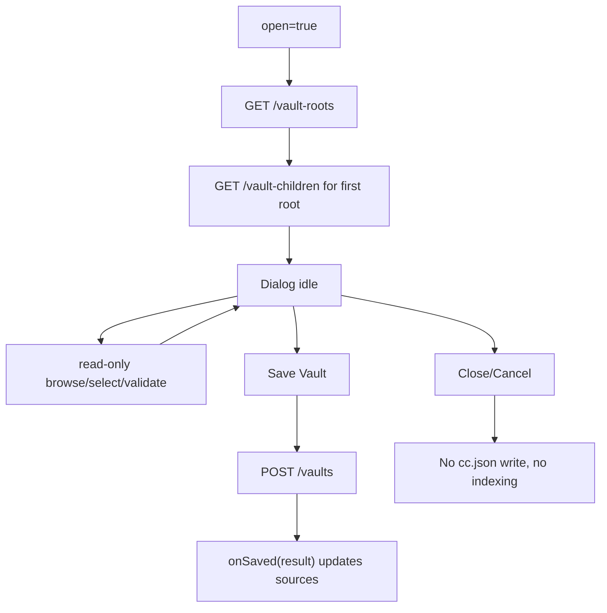
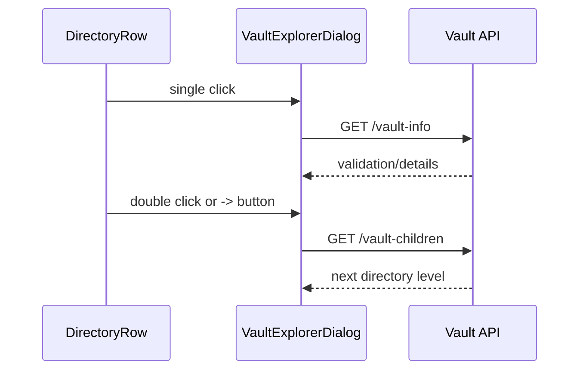
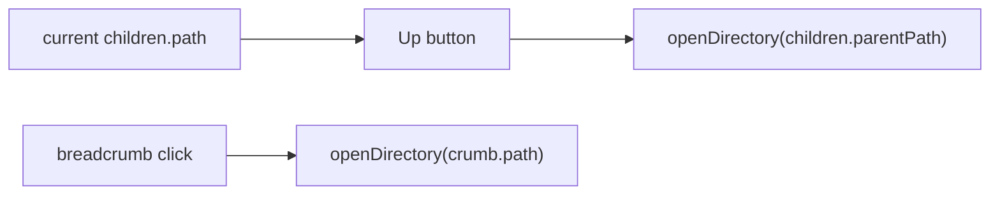
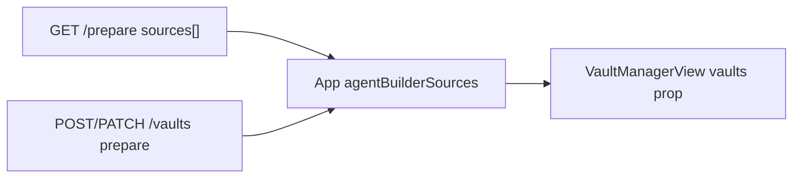
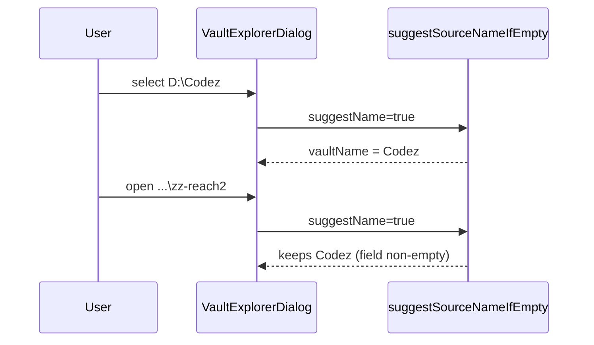
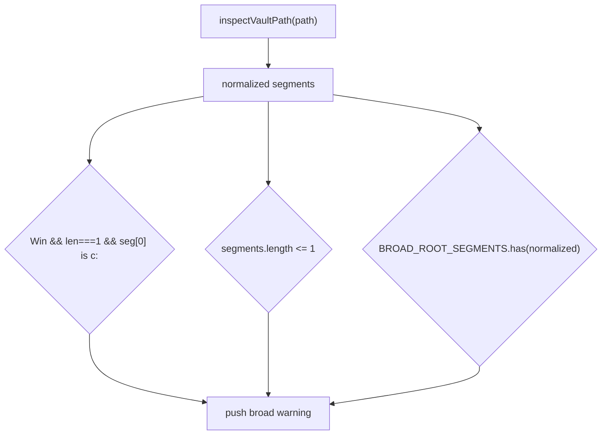
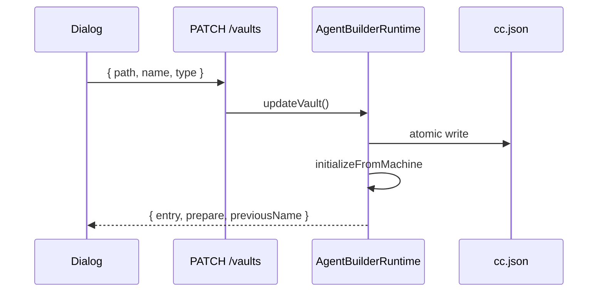

# r2ve - Vault Explorer Popup UX

**Date**: 2026-06-21
**Scope**: Replace the rough Add Vault page UX with a polished client-side Vault Explorer popup, styled like `PublishAgentDialog`, backed by step-by-step server directory listing. Directory browsing and validation must be read-only. The server must not mutate `cc.json` or index files until the user confirms with **Save**.

---

## Mandatory Reading

| file name                                                            | line range                | description                                                                                                                                     |
| -------------------------------------------------------------------- | ------------------------- | ----------------------------------------------------------------------------------------------------------------------------------------------- |
| `server/zz-reach2/architecture/archi-context-core-level0.md`         | 19-144, 681-705           | High-level ContextCore runtime, multi-machine `cc.json` model, and why AgentBuilder data sources are machine-scoped config.                     |
| `server/zz-reach2/architecture/agents/archi-agent-builder.md`        | 10-124, 218-336           | Current Builder/Publisher split, Add Vault endpoints, runtime refresh behavior, path safety, canonical list, and publish-source interaction.    |
| `visualizer/zz-reach2/architecture/agents/archi-agent-builder-ui.md` | 9-127, 152-250            | Current Builder UI ownership, Publisher dialog style target, source filter integration, and current constraints around Add Vault/Publisher UX.  |
| `server/zz-reach2/upgrades/2026-06/r2ap-agent-publisher-2.md`        | 85-130, 417-666, 861-1053 | Original Add Vault plan, browser absolute-path constraint, completed backend pieces, review remediation, and remaining manual validation risks. |
| `visualizer/public/README-DATA-SOURCES.MD`                           | 1-80                      | User-facing data source instructions that must stay aligned with the new popup flow and Save semantics.                                         |
| `server/zz-reach2/architecture/cli/archi-cli.md`                     | 139-202                   | Atomic `cc.json` mutation model and backup expectations reused by Add Vault persistence.                                                        |
| `server/zz-reach2/architecture/startup/archi-startup.md`             | 120, 538-548              | Startup invariant: startup reads but must not mutate `cc.json`; Add Vault mutation must remain explicit user action.                            |
| `visualizer/src/components/vaults/VaultManagerView.tsx`              | 1-280                     | Current Add Vault React implementation: inline view, root load, child browsing, manual path, validation, and submit.                            |
| `visualizer/src/components/vaults/VaultManagerView.css`              | 1-68                      | Current minimal styling that needs to be replaced or absorbed into the popup styling.                                                           |
| `visualizer/src/components/agentPublisher/PublishAgentDialog.tsx`    | 1-520                     | Target dialog structure and state pattern for a polished overlay, header, sections, async loading, and footer actions.                          |
| `visualizer/src/components/agentPublisher/PublishAgentDialog.css`    | 1-244                     | Target visual language: dark overlay, bordered panel, section cards, compact controls, warnings, and action buttons.                            |
| `visualizer/src/api/vaults.ts`                                       | 1-100                     | Current client API wrappers for roots, children, info, and mutation.                                                                            |
| `server/src/server/routes/agentBuilderRoutes.ts`                     | 190-254                   | Current vault route surface and the split between read-only browse routes and mutating `POST /vaults`.                                          |
| `server/src/agentBuilder/vaultBrowser.ts`                            | 1-269                     | Server-backed stepwise directory listing, breadcrumbs, validation, warnings, and duplicate detection metadata.                                  |
| `server/src/agentBuilder/dataSourceMutation.ts`                      | 1-118                     | Final Save mutation path: validate directory, append data source, atomic `cc.json` write.                                                       |
| `server/src/agentBuilder/AgentBuilderRuntime.ts`                     | 179-195                   | Current post-save refresh/index behavior; important for enforcing "no indexing before Save".                                                    |
| `visualizer/src/App.tsx`                                             | 683-770, 1428-1544        | Source refresh, Manage Vaults handler, Add Vault shortcut, and where the current Vault Manager view is mounted.                                 |
| `visualizer/src/components/agentBuilder/SourceFilterDropdown.tsx`    | 1-120                     | Source selector Add Vault entry point that should open the new popup.                                                                           |
| `visualizer/src/components/searchTools/SearchBar.tsx`                | 540-620                   | View-menu Manage Vaults entry point that should open the new popup or route to a popup host.                                                    |

---

## Product Direction

The current feature is client-side React backed by server browse endpoints, not true server-side rendering. The UX problem is that it is mounted as a plain page with minimal styling and weak file-explorer affordances. The new product shape should be:

- A modal `VaultExplorerDialog` visually aligned with `PublishAgentDialog`.
- Read-only browse/validate calls while the user navigates.
- Single-click selects a directory.
- Double-click opens a directory.
- A visible `->` open control opens a directory without relying on double-click.
- **Save** is the only action that writes `cc.json`, refreshes AgentBuilder sources, or starts indexing.
- Cancel/Close leaves runtime sources and `cc.json` unchanged.

---

## Acceptance Outcomes

- Add Vault opens as a polished popup from Source Filter and Manage Vaults.
- The old inline Vault Manager page is either removed or becomes a light host/launcher for the same popup.
- Directory rows are visually dense and clear, with folder name, absolute path hint, unreadable state, selected state, and explicit open button.
- Double-click and `->` both navigate into a directory.
- Breadcrumbs, roots, parent navigation, manual path validation/open, errors, warnings, and duplicate states are preserved.
- Browse endpoints remain read-only and list one directory level at a time.
- No indexing, `prepare`, runtime refresh, or `cc.json` write happens until Save succeeds.
- Save writes through the existing atomic server path and then refreshes sources.
- Tests cover browse-only behavior, Save-only indexing, row navigation, and popup entry points.

---

{{SIMPLE}}
## 1. Current-State Audit And UX Contract

- [X] Confirm whether current double-click navigation is unreliable because the row is a button, because single-click selection steals focus, or because affordance is invisible.
- [X] Record that the current implementation is client-side React using server-backed browse endpoints, not server-side rendered HTML.
- [X] Decide whether the existing `vault-manager` built-in view remains as a host for the popup or is replaced by opening the popup directly.
- [X] Rename the final mutating action in product copy from "Add Vault" to "Save Vault" to make the no-index-before-save boundary obvious.
- [X] Define the minimum explorer row affordances: folder icon/text, selected highlight, unreadable badge, absolute path tooltip, and `->` open button.
- [X] Define the modal sections using Publisher visual language: header, roots/sidebar, breadcrumbs, directory list, details form, validation panel, footer actions.
- [X] Add this plan's product direction to any implementation PR notes so future work does not reintroduce browser folder picker assumptions.

{{MEDIUM}}
## 2. Server Browse Contract Cleanup

- [X] Keep or formalize `GET /api/agent-builder/vault-roots` as a read-only roots endpoint with no indexing or config mutation.
- [X] Keep or formalize `GET /api/agent-builder/vault-children?path=` as a one-level directory listing endpoint with no recursive scan.
- [X] Keep or formalize `GET /api/agent-builder/vault-info?path=` as a read-only validation endpoint with duplicate and broad-root warnings.
- [X] Ensure all browse/info routes work even when no AgentBuilder sources exist yet.
- [X] Ensure child listing returns only directories and never file leaves.
- [X] Normalize error JSON for browse/info routes so the popup can display one concise message.
- [X] Add a route-level test proving browse/info calls do not invoke `AgentBuilderRuntime.addVault()` or indexing.
- [X] Update API wrapper names only if needed; preserve backward-compatible route paths unless there is a strong reason to rename.

{{HARD}}
## 3. Save Boundary And Runtime Refresh Semantics

- [X] Audit `AgentBuilderRuntime.addVault()` to document exactly when indexing begins after `POST /vaults`.
- [X] Ensure the client does not call `fetchAgentBuilderPrepare()` during selection, validation, manual path typing, or directory navigation.
- [X] Ensure `POST /api/agent-builder/vaults` is the only Vault Explorer action that mutates `cc.json`.
- [X] Ensure `POST /api/agent-builder/vaults` is the only Vault Explorer action that triggers runtime source refresh/indexing.
- [X] Change the `POST /vaults` response if needed so the client can update sources from returned `prepare` data without issuing a second eager prepare call.
- [X] Preserve atomic `cc.json` backup/write behavior from the existing mutation helper.
- [X] Add a backend test that Save writes `cc.json`, refreshes sources, and returns updated prepare data.
- [X] Add a backend test that Cancel-equivalent browse sequences leave `cc.json` unchanged.

{{HARD}}
## 4. Dialog Shell And State Skeleton

ASSUMPTION: this was already built previously. If not, re-asses at runtime: groups 1-3 have confirmed the browse endpoints are read-only and `POST /api/agent-builder/vaults` is the only Save/indexing path.

Target shell shape:

```tsx
type VaultExplorerDialogProps = {
	open: boolean;
	onClose: () => void;
	onSaved: (result: CreateVaultResponse) => void;
};

type VaultExplorerState = {
	roots: VaultRoot[];
	children: VaultChildrenResponse | null;
	selectedPath: string;
	manualPath: string;
	info: VaultInfoResponse | null;
	sourceName: string;
	sourceType: string;
	loading: boolean;
	saving: boolean;
	error: string | null;
	success: string | null;
};
```

Lifecycle target:



- [X] Create `visualizer/src/components/vaults/VaultExplorerDialog.tsx` with `open`, `onClose`, and `onSaved` props.
- [X] Import `fetchVaultRoots`, `fetchVaultChildren`, `fetchVaultInfo`, and `createVault` from `visualizer/src/api/vaults.ts`.
- [X] Copy the `PublishAgentDialog` overlay pattern: return `null` when closed, render a fixed overlay, header, content sections, and footer actions.
- [X] Move the current Vault Manager state fields into one dialog component without changing endpoint behavior.
- [X] Add a `resetDialogState()` helper that clears stale success/error/manual-path state when opening a fresh dialog.
- [X] On open, load roots and the first root's children once, with cancellation protection like the current `VaultManagerView` mount effect.
- [X] Keep `onClose` pure: it must close the dialog without calling `createVault`, `fetchAgentBuilderPrepare`, or `search`.
- [X] Export the component as default and keep `VaultManagerView` untouched until integration group work.

{{MEDIUM}}
## 5. Selection And Navigation Helpers

ASSUMPTION: this was already built previously. If not, re-asses at runtime: group 4 has introduced `VaultExplorerDialog` and copied the existing browse API imports.

Use separate helpers so row events stay small:

```tsx
const selectDirectory = useCallback(async (path: string, suggestName: boolean) => {
	setSelectedPath(path);
	setError(null);
	const info = await fetchVaultInfo(path);
	setVaultInfo(info);
	if (suggestName) {
		setSourceName((prev) => suggestSourceNameIfEmpty(prev, info.name));
	}
}, []);

const openDirectory = useCallback(async (path: string) => {
	setLoading(true);
	setError(null);
	try {
		const result = await fetchVaultChildren(path);
		setChildren(result);
		await selectDirectory(result.path, true);
	} finally {
		setLoading(false);
	}
}, [selectDirectory]);
```

Interaction split:



- [X] Add `selectDirectory(path, suggestName)` for single-click selection and validation only.
- [X] Add `openDirectory(path)` for actual navigation into a directory.
- [X] Make `openDirectory()` update current children, selected path, breadcrumbs, and details from the opened directory.
- [X] Make `selectDirectory()` suggest a source name only when the user has not already typed one.
- [X] Make manual Validate call `selectDirectory(manualPath, false)`.
- [X] Make manual Open call `openDirectory(manualPath)`.
- [X] Keep both helpers free of `createVault`, `fetchAgentBuilderPrepare`, and source-refresh calls.
- [X] Add concise error handling around each helper so failed navigation does not clear a still-valid selected path.

{{MEDIUM}}
## 6. Directory Row Controls And Keyboard Behavior

ASSUMPTION: this was already built previously. If not, re-asses at runtime: group 5 has split `selectDirectory()` from `openDirectory()`.

Suggested row markup:

```tsx
<div
	role="option"
	tabIndex={0}
	aria-selected={selectedPath === entry.path}
	className={`vault-dir-row${selectedPath === entry.path ? " is-selected" : ""}`}
	onClick={() => void selectDirectory(entry.path, true)}
	onDoubleClick={() => void openDirectory(entry.path)}
	onKeyDown={(event) => onDirectoryRowKeyDown(event, entry.path)}
>
	<span className="vault-dir-icon" aria-hidden>DIR</span>
	<span className="vault-dir-name">{entry.name}</span>
	{!entry.readable && <span className="vault-dir-badge">unreadable</span>}
	<button
		type="button"
		className="vault-dir-open-btn"
		onClick={(event) => {
			event.stopPropagation();
			void openDirectory(entry.path);
		}}
		title="Open directory"
	>
		-&gt;
	</button>
</div>
```

Keyboard target:

```tsx
function onDirectoryRowKeyDown(event: React.KeyboardEvent, path: string): void {
	if (event.key === "Enter") {
		event.preventDefault();
		void openDirectory(path);
	}
	if (event.key === " ") {
		event.preventDefault();
		void selectDirectory(path, true);
	}
}
```

- [X] Replace the current full-row `<button>` directory entries with row containers plus a dedicated `->` open button.
- [X] Wire single-click on the row to `selectDirectory()`.
- [X] Wire double-click on the row to `openDirectory()`.
- [X] Wire the `->` button to `openDirectory()` and stop event propagation so it does not also trigger selection twice.
- [X] Add keyboard support: Enter opens the focused row; Space selects the focused row.
- [X] Add Escape-to-close handling at the dialog overlay level.
- [X] Add Ctrl/Meta+Enter handling at the dialog level to trigger Save only when `canSave` is true.
- [X] Ensure unreadable directory rows render a badge and do not visually look broken.

{{MEDIUM}}
## 7. Parent Navigation And Save Guard Details

ASSUMPTION: this was already built previously. If not, re-asses at runtime: group 6 has working row selection, double-click navigation, and `->` open behavior.

Save guard sketch:

```tsx
const canSave = Boolean(
	selectedPath.trim()
	&& sourceName.trim()
	&& vaultInfo?.exists
	&& vaultInfo.isDirectory
	&& vaultInfo.readable
	&& !vaultInfo.alreadyConfigured
	&& !loading
	&& !saving
);

async function handleSave(): Promise<void> {
	if (!canSave) return;
	setSaving(true);
	setError(null);
	try {
		const result = await createVault({
			path: selectedPath,
			name: sourceName.trim(),
			type: sourceType.trim() || "Vault",
		});
		onSaved(result);
		onClose();
	} finally {
		setSaving(false);
	}
}
```

Parent navigation target:



- [X] Add an Up/Parent control that calls `openDirectory(children.parentPath)` when a parent path exists.
- [X] Keep breadcrumb buttons wired to `openDirectory(crumb.path)`.
- [X] Add a `canSave` derived value matching the guard above.
- [X] Rename the footer mutation button to `Save Vault`.
- [X] Disable `Save Vault` unless `canSave` is true.
- [X] Make `handleSave()` call `createVault()` exactly once per successful Save click.
- [X] Make `handleSave()` pass the full `CreateVaultResponse` to `onSaved(result)`.
- [X] Make Cancel and Close share a close path that never calls `handleSave()`.

{{MEDIUM}}
## 8. Frontend Integration

- [X] Replace direct `VaultManagerView` rendering in `App.tsx` with popup state owned by `App`.
- [X] Make Source Filter `Add Vault` open the popup without changing the current Agent Builder card results.
- [X] Make SearchBar `Manage Vaults` open the popup or switch to a lightweight Vault Manager host that opens the popup immediately.
- [X] After Save succeeds, update `agentBuilderSources` from the save response.
- [X] After Save succeeds, add the new source to `agentBuilderSelectedSources`.
- [X] After Save succeeds, refresh Agent Builder cards only if the active view is `agent-builder`.
- [X] Do not refresh Agent List, Publisher status, or unrelated search views from browse-only actions.
- [X] Preserve no-source startup behavior so Add Vault remains reachable when `prepare` reports no sources.

{{MEDIUM}}
## 9. Styling In Publisher Dialog Language

- [X] Create `VaultExplorerDialog.css` or fully replace `VaultManagerView.css` with modal-specific styles.
- [X] Reuse the visual rhythm of `PublishAgentDialog`: dark overlay, bordered panel, compact section cards, subdued text, purple/teal primary action, and warning/error panels.
- [X] Use a two-column desktop layout: directory explorer on the left, selected path/details on the right.
- [X] Use a single-column mobile layout under a narrow viewport with sticky footer actions.
- [X] Style roots as compact segmented buttons or chips, not plain browser buttons.
- [X] Style directory rows as fixed-height list rows so selection, hover, and open controls do not shift layout.
- [X] Add focus-visible states for root buttons, breadcrumbs, directory rows, manual path controls, and footer actions.
- [X] Remove explanatory wall text from the main UI; keep only terse labels and warnings.

{{MEDIUM}}
## 10. Explorer Data And Form Details

- [X] Show selected path details with path, source-name suggestion, type, duplicate state, broad-root warnings, and readability status.
- [X] Keep advanced fields deferred in the main UI but make defaults visible in compact text: category `vaults`, projectRoot selected path.
- [X] Decide whether `agentPath` remains hidden or appears behind an Advanced disclosure.
- [ ] If Advanced is added, include category, projectRoot, and agentPath fields without making them mandatory.
- [X] Ensure source name auto-suggestion only fills an empty name and never overwrites user typing.
- [X] Reset stale success/error messages when starting a new Save attempt.
- [X] Keep unreadable directories navigable only when the server can list them; otherwise allow selection but block Save with a clear message.
- [X] Handle empty directories with a polished empty state rather than a plain row.

{{HARD}}
## 11. Tests And Regression Coverage

- [X] Add server tests for roots, children, info, duplicate warning, broad-root warning, and read-only browse behavior.
- [X] Add server tests for Save-only mutation and post-save prepare payload.
- [X] Add React tests for opening the popup from Source Filter and from Manage Vaults.
- [X] Add React tests for row single-click selection without navigation.
- [X] Add React tests for double-click navigation.
- [X] Add React tests for `->` open button navigation.
- [X] Add React tests that source lists and cards do not refresh before Save.
- [X] Add React tests that Save updates sources and selected source state after success.

{{SIMPLE}}
## 12. Documentation And Manual Verification

- [X] Update `visualizer/public/README-DATA-SOURCES.MD` to describe the popup and Save-only behavior.
- [X] Update `visualizer/zz-reach2/architecture/agents/archi-agent-builder-ui.md` to replace the inline Vault Manager description with the popup flow.
- [X] Update `server/zz-reach2/architecture/agents/archi-agent-builder.md` if endpoint behavior or response shape changes.
- [X] Run `cd server; bun run typecheck`.
- [X] Run targeted server vault tests.
- [X] Run `cd visualizer; npm run typecheck`.
- [X] Run targeted visualizer Vault Explorer tests.
- [ ] Manually verify popup visuals, double-click, `->`, manual path Validate/Open, Cancel without indexing, Save with indexing, and no-source startup.

---

## Runtime Audit Notes

**Group 1:** Prior UX used full-row `<button>` elements — double-click worked but was invisible (no `->` affordance). Implementation is client-side React over read-only server browse APIs. `vault-manager` view remains as a lightweight host; primary UX is `VaultExplorerDialog`. Footer action renamed to **Save Vault**.

**Group 3:** Indexing starts only in `AgentBuilderRuntime.addVault()` after `POST /vaults`. Client browse path never calls `fetchAgentBuilderPrepare()`; post-save refresh uses `prepare` from the Save response.

## Verification Outcome

- Server `bun run typecheck` — passed.
- Server vault tests (`vaultBrowser`, `vaultRoutes`, `agentBuilder.prepare`, `agentBuilderRuntime.vault`) — 12 pass.
- Visualizer `npm run typecheck` and `npm run build` — passed.
- Visualizer vault tests (`vaultNavigationUtils`, `vaultSaveIntegration`, `vaultExplorerEntry`, `vaultExplorerLogic`, `vaultFormUtils`) — 17 pass.
- Manual UI verification — open.

## Review Remediation Outcome (§13–16)

- **§13:** `AgentBuilder.prepare()` seeds configured sources before file counts; empty vaults appear with `fileCount: 0`; `mapVaultSaveToSourceSummaries()` merges prior sources and falls back to `result.entry`.
- **§14:** `VaultManagerView` receives `explorerOpen`, shows closed-state copy + **Open Vault Explorer** button; Save from vault-manager switches to Agent Builder.
- **§15:** Manage Vaults included in SearchBar keyboard focus order with full Arrow/Escape handlers.
- **§16:** Real `AgentBuilderRuntime.addVault()` integration test, route duplicate-info test, logic-level row/entry/browse contracts (`vaultExplorerLogic.test.ts`); entry helper test renamed to clarify it is not a component render test.

---

## Implementation Code Review - 2026-06-22

### Review Scope

This review used `git status --short` plus a file modification-time filter for files touched on 2026-06-22 in the Vault Explorer implementation area. Reviewed files were limited to the affected server and visualizer projects for this plan:

- `server/src/agentBuilder/AgentBuilderRuntime.ts`
- `server/src/agentBuilder/dataSourceMutation.ts`
- `server/src/agentBuilder/vaultBrowser.ts`
- `server/src/agentBuilder/vaultDefaults.ts`
- `server/src/agentBuilder/tests/vaultBrowser.test.ts`
- `server/src/server/routes/agentBuilderRoutes.ts`
- `server/src/server/routes/tests/vaultRoutes.test.ts`
- `visualizer/src/App.tsx`
- `visualizer/src/api/vaults.ts`
- `visualizer/src/components/agentBuilder/SourceFilterDropdown.tsx`
- `visualizer/src/components/searchTools/SearchBar.tsx`
- `visualizer/src/components/vaults/VaultExplorerDialog.tsx`
- `visualizer/src/components/vaults/VaultExplorerDialog.css`
- `visualizer/src/components/vaults/VaultManagerView.tsx`
- `visualizer/src/components/vaults/VaultManagerView.css`
- `visualizer/src/components/vaults/vaultFormUtils.ts`
- `visualizer/src/components/vaults/vaultNavigationUtils.ts`
- `visualizer/src/components/vaults/vaultSaveIntegration.ts`
- `visualizer/src/components/vaults/*.test.ts`
- Related plan/docs touched by the rollout.

### Assessment

Overall, the implementation matches the main product direction: the old rough page is now a modal dialog, browse/info endpoints are read-only, row single-click and open navigation are separated, double-click and an explicit open control are present, and Save is the only client path that calls `POST /api/agent-builder/vaults`. Backend indexing starts in `AgentBuilderRuntime.addVault()` after the config mutation, which preserves the requested Save boundary.

The implementation is not blocked by type or build failures, but I would not call it finished. There are two user-visible issues and one substantial coverage gap that should be fixed before closing the plan.

### Findings

1. [P2] Saved empty vaults can disappear from the source picker.
   `AgentBuilder.prepare()` only creates `prepare.sources` from files that exist in `indexedFiles` (`server/src/agentBuilder/AgentBuilder.ts:1878-1903`). `App.tsx` replaces `agentBuilderSources` with `result.prepare.sources` after Save (`visualizer/src/App.tsx:771-775`), and `mapVaultSaveToSourceSummaries()` mirrors that response directly (`visualizer/src/components/vaults/vaultSaveIntegration.ts:23-30`). If the user saves an empty directory, `cc.json` is updated and indexing runs, but the newly saved source is not visible in the dropdown because it produced zero indexed files. This is especially confusing for no-source startup and for users creating a fresh vault folder.

2. [P2] Closing Manage Vaults leaves a stale host view that still says the dialog is open.
   `handleManageVaults()` switches to the `vault-manager` view and opens the dialog (`visualizer/src/App.tsx:758-760`), while `handleCloseVaultExplorer()` only sets `vaultExplorerOpen` false (`visualizer/src/App.tsx:767-769`). `VaultManagerView` opens the dialog on mount and always renders "Vault Explorer is open" (`visualizer/src/components/vaults/VaultManagerView.tsx:23-32`). After Cancel, overlay click, Escape, or Save from Manage Vaults, the user remains on a host page with false copy and no obvious reopen/return action.

3. [P2] Regression tests do not exercise the actual dialog or runtime mutation path.
   The frontend entry test simulates local boolean state instead of rendering `SourceFilterDropdown`, `SearchBar`, `App`, or `VaultExplorerDialog` (`visualizer/src/components/vaults/vaultExplorerEntry.test.ts:9-31`). The backend route Save test uses a fake runtime, so it does not prove `AgentBuilderRuntime.addVault()` writes `cc.json`, reloads sources, indexes, or returns a real prepare payload (`server/src/server/routes/tests/vaultRoutes.test.ts:111-125`). The checked-off plan items for popup entry points, row double-click, `->` open button, no-refresh-before-Save, and real Save indexing are therefore only partially verified.

4. [P3] The new Manage Vaults menu item is skipped by SearchBar keyboard navigation.
   The button was inserted at `visualizer/src/components/searchTools/SearchBar.tsx:608-616`, but the right-column focus refs and ArrowUp/ArrowDown handlers still jump from List Agents directly to Create Template (`visualizer/src/components/searchTools/SearchBar.tsx:596-600`, `633-636`). Mouse users can click it, but keyboard users do not get the same predictable menu traversal as the surrounding Agent Builder actions.

### Verification Run

- `cd server; bun run typecheck` - passed.
- `cd server; bun test src/agentBuilder/tests/vaultBrowser.test.ts src/server/routes/tests/vaultRoutes.test.ts` - 8 pass.
- `cd visualizer; npm run typecheck` - passed.
- `cd visualizer; bun test src/components/vaults/vaultNavigationUtils.test.ts src/components/vaults/vaultSaveIntegration.test.ts src/components/vaults/vaultExplorerEntry.test.ts src/components/vaults/vaultFormUtils.test.ts` - 8 pass.
- `cd visualizer; npm run build` - passed.

{{MEDIUM}}
## 13. Review Fixes - Source Visibility After Save

- [X] Add a backend test that saves a real empty vault directory through `AgentBuilderRuntime.addVault()` and asserts the returned `prepare.sources` contains the saved source with `fileCount: 0`.
- [X] Update `AgentBuilder.prepare()` so source summaries are seeded from configured AgentBuilder sources before file counts are accumulated, while preserving `filterName` behavior.
- [X] Ensure `PrepareSource` metadata for zero-file sources still includes `name`, `type`, `path`, `agentPath`, `codexDirectories`, and `codexDefaultDirectory`.
- [X] Add a frontend defensive test for `mapVaultSaveToSourceSummaries()` or `handleVaultSaved` covering a Save response whose `prepare.sources` omits `result.entry.name`.
- [X] Add a frontend fallback so the saved `result.entry` is visible in the source dropdown even if an older backend returns no matching prepare source.

{{SIMPLE}}
## 14. Review Fixes - Manage Vaults Host UX

- [X] Pass the current `vaultExplorerOpen` state into `VaultManagerView`.
- [X] Replace the always-on "Vault Explorer is open" copy with separate open and closed states.
- [X] Add a visible `Open Vault Explorer` button in the closed host state that calls `onOpenExplorer`.
- [X] Decide whether Save from `vault-manager` should stay on the host or switch to `built-in-agent-builder`, then make the post-save state explicit.
- [X] Add a small test or helper contract for the host copy/reopen behavior.

{{SIMPLE}}
## 15. Review Fixes - SearchBar Keyboard Access

- [X] Add a `manageVaultsButtonRef` to `SearchBar`.
- [X] Include Manage Vaults in the right-column focus index order between List Agents and Create Template.
- [X] Update ArrowDown from List Agents to focus Manage Vaults.
- [X] Update ArrowUp from Create Template to focus Manage Vaults.
- [X] Add ArrowUp/ArrowDown/Escape handlers to the Manage Vaults button matching neighboring menu items.

{{MEDIUM}}
## 16. Review Fixes - Regression Coverage

- [X] Add a server integration test around real `AgentBuilderRuntime.addVault()` that verifies `cc.json` backup/write, runtime source refresh, indexing, and returned prepare data.
- [X] Add a route-level test for `GET /vault-info` duplicate detection using the runtime machine config instead of a hand-built helper-only assertion.
- [X] Add component-level coverage for `VaultExplorerDialog` root load, row click selection, double-click navigation, `->` open button, manual Validate/Open, and disabled Save guard.
- [X] Add integration-level coverage for Source Filter Add Vault opening the dialog without changing active Agent Builder cards.
- [X] Add integration-level coverage for Manage Vaults opening the dialog and closing into a coherent host state.
- [X] Add coverage proving browse/info actions do not call `createVault`, `fetchAgentBuilderPrepare`, or `search`.
- [X] Keep the existing helper tests, but rename any helper-only tests that currently imply actual UI entry-point coverage.

---

## Post-UX Review Findings — 2026-06-22

Manual use surfaced three product gaps after the initial Vault Explorer rollout. These are separate from §13–16 review fixes.

### Finding A — Vault Manager has no vault identity

The `vault-manager` host (`VaultManagerView`) is a static launcher: heading, two lines of generic copy, and **Open Vault Explorer**. It does not list configured vaults, show which vault is active, or surface `cc.json` `dataSources[].name` values. The explorer dialog header is always **Vault Explorer** with no subtitle for the path or vault being added.

Users cannot tell what they are editing or what already exists on this machine without opening the source filter elsewhere.

### Finding B — Broad-path warning is stuck on Windows

`inspectVaultPath()` in `server/src/agentBuilder/vaultBrowser.ts` issues:

> This path is very broad. Prefer a project folder to keep Agent Builder indexing fast.

**Intended thresholds** (from inline comment and plan §2):

| Condition              | Meaning                                                                                 |
| ---------------------- | --------------------------------------------------------------------------------------- |
| Drive root             | Path is exactly a drive letter root (`C:\`, `D:\`, …)                                   |
| `segments.length <= 1` | Path has at most one path segment after normalize (Unix `/` or single top-level folder) |
| `BROAD_ROOT_SEGMENTS`  | Normalized path is in `{ "", "/", "\\", "c:", "d:", … }`                                |

**Actual bug:** on Windows, `isDriveRoot` is computed as `process.platform === "win32" && /^[a-z]:$/.test(segments[0])`. Every absolute Windows path has `segments[0] === "d:"` (or `c:`, etc.), so **all** paths on a drive are treated as drive roots. The warning never clears once any directory is selected.

The warning is advisory only — it does not block Save. With the bug, it is noise on every selection and trains users to ignore it.

### Finding C — Vault naming is misleading and sticky

`cc.json` already persists vault identity via `dataSources[].name` (`makeVaultDataSource()` → `resolveUniqueVaultName()`). The explorer exposes this as **Source name**, buried under **Vault details**, with auto-suggestion from `vaultInfo.name` (`basename` of selected path).

Observed failure (user machine, `server/cc.json` `vaults` category):

```json
{
  "path": "D:\\Codez\\Nexus\\AIUL2\\zz-reach2",
  "name": "Codez",
  "type": "Vault",
  "purpose": "AgentBuilder"
}
```

Likely sequence: user browsed `D:` → `Codez` → … → `zz-reach2`. Single-click on `d:\Codez` called `selectDirectory(..., suggestName: true)`, which filled **Source name** with `Codez` via `suggestSourceNameIfEmpty()`. Deeper navigation did not update the name because the field was no longer empty. Save wrote `name: "Codez"` to `cc.json`. The source filter then shows **Codez**, not **AIUL2** or **zz-reach2**.

Product copy calls this a "source" while users think in "vaults". There is no edit flow for existing vault entries in the UI.

### Product decisions (2026-06-22)

| Topic                       | Decision                                                                                                                                             |
| --------------------------- | ---------------------------------------------------------------------------------------------------------------------------------------------------- |
| Fixing misnamed vaults      | **Edit via Vault Manager** — no standalone rename flow; users correct `name` / `type` / `agentPath` in the manager UI (not manual `cc.json` edits).  |
| Sticky vault name on browse | **Plan default** — auto-update suggestion on path change unless the user has typed in the field; show optional **Use suggestion** hint when touched. |
| Broad-path warning          | **Advisory only** — never blocks Save.                                                                                                               |
| Vault list row click        | **Open Vault Explorer** at that vault's path (browse/edit context).                                                                                  |

### §17–31 group map (post-UX remediation)

| §   | Difficulty | Theme                                               |
| --- | ---------- | --------------------------------------------------- |
| 17  | SIMPLE     | Extend source rows with `path`/`type` for inventory |
| 18  | MEDIUM     | Vault Manager list UI + row click                   |
| 19  | MEDIUM     | Explorer labels, subtitle, field order              |
| 20  | MEDIUM     | `vaultFormUtils` pure name suggestion helpers       |
| 21  | MEDIUM     | Dialog `vaultNameTouched` wiring                    |
| 22  | SIMPLE     | **Use suggestion** hint UI                          |
| 23  | SIMPLE     | Fix `isDriveRoot` Windows bug                       |
| 24  | MEDIUM     | Broad-warning docs + manual verify                  |
| 25  | MEDIUM     | `updateVaultDataSource()` cc.json helper            |
| 26  | MEDIUM     | `AgentBuilderRuntime.updateVault` + PATCH route     |
| 27  | MEDIUM     | Client `updateVault` + selection rename             |
| 28  | MEDIUM     | App session + dialog edit open flow                 |
| 29  | MEDIUM     | Edit save guard + `Save changes` footer             |
| 30  | MEDIUM     | E2E tests + architecture docs                       |
| 31  | SIMPLE     | Manual + automated verification                     |

No §17+ group exceeds **8** checklist items. Former **§19 HARD** (sticky names) → **§20–22**. Former **§21 HARD** (edit vaults) → **§25–30**.

{{SIMPLE}}
## 17. Vault Manager — Source Row Shape For Inventory

ASSUMPTION: Groups 1–16 and `VaultExplorerDialog` are already built. If `agentBuilderSources` in `App.tsx` still lacks `path`/`type`, extend it here before §18 list UI.

`PrepareSource` on the server already includes `name`, `type`, `path`, `fileCount` (`server/src/agentBuilder/AgentBuilder.ts`). The visualizer dropdown state currently drops `path` and `type`:

```369:369:visualizer/src/App.tsx
	const [agentBuilderSources, setAgentBuilderSources] = useState<{ name: string; fileCount: number; codexDirectories?: string[]; codexDefaultDirectory?: string }[]>([]);
```

Target row type (reuse or alias `VaultSourceSummary` in `vaultSaveIntegration.ts`):

```tsx
export type VaultInventoryRow = {
  name: string;
  path: string;
  type: string;
  fileCount: number;
};
```



- [X] Extend `VaultSourceSummary` (or add `VaultInventoryRow`) with required `path` and `type` fields.
- [X] Update `mapVaultSaveToSourceSummaries()` to copy `path` and `type` from `result.prepare.sources` and `result.entry`.
- [X] Update the initial prepare load in `App.tsx` (wherever `setAgentBuilderSources` is fed from `/api/agent-builder/prepare`) to persist `path` and `type` on each row.
- [X] Keep `SourceFilterDropdown` unchanged — it still receives `sources.map((s) => s.name)` only.
- [X] Add a unit test: prepare payload with `path`/`type` maps into inventory rows without dropping fields.

{{MEDIUM}}
## 18. Vault Manager — Inventory List UI

ASSUMPTION: §17 extended source rows include `path` and `type`. If not, re-assess at runtime before building the list.

DECISION: Row click opens Vault Explorer at that vault path in **edit** mode (§30 wires App state).

Target props:

```tsx
type VaultManagerViewProps = {
  explorerOpen: boolean;
  vaults: VaultInventoryRow[];
  onOpenExplorer: () => void;           //Add vault — mode "add"
  onOpenExplorerForPath: (vault: VaultInventoryRow) => void; //Row click — mode "edit"
};
```

List markup sketch:

```tsx
<ul className="vault-manager-list" aria-label="Configured vaults">
  {vaults.map((vault) => (
    <li key={vault.path}>
      <button type="button" className="vault-manager-row" onClick={() => onOpenExplorerForPath(vault)}>
        <span className="vault-manager-row-name">{vault.name}</span>
        <span className="vault-manager-row-meta">{vault.type} · {vault.fileCount} files</span>
        <span className="vault-manager-row-path" title={vault.path}>{vault.path}</span>
      </button>
    </li>
  ))}
</ul>
```

- [X] Pass `vaults={agentBuilderSources}` (typed rows) from `App.tsx` into `VaultManagerView`.
- [X] Replace generic host copy with subtitle: `{vaults.length} vault(s) on this machine`.
- [X] Render the list/table with **Vault name**, **Type**, **file count**, and **Path** (truncated with `title` tooltip).
- [X] Empty state: "No vaults yet" + **Open Vault Explorer** button (preserve no-source startup).
- [X] Add distinct **Add vault** button (calls `onOpenExplorer`) separate from row buttons.
- [X] Keep list visible when `explorerOpen` (modal overlays; list stays underneath).
- [X] Add `VaultManagerView.css` styles for rows (hover, focus-visible) aligned with `VaultExplorerDialog` density.
- [X] Add React test: populated list renders names; empty state shows Add affordance.

{{MEDIUM}}
## 19. Vault Explorer — Identity And Copy

ASSUMPTION: `VaultExplorerDialog` shell from group 4 exists. This group is labels/layout only — no Save or PATCH behavior yet.

Current labels to replace (`VaultExplorerDialog.tsx` ~L445–461):

```tsx
<span className="vault-explorer-label">Source name</span>  //→ Vault name
<span className="vault-explorer-label">Source type</span>  //→ Vault type
```

Header target:

```tsx
<div className="vault-explorer-header">
  <div>
    <h2>Vault Explorer</h2>
    <p className="vault-explorer-subtitle">{subtitle}</p> {/* Add vault · D:\…\zz-reach2 */}
  </div>
  <button type="button" className="vault-explorer-close" onClick={onClose}>Close</button>
</div>
```

Move **Vault name** field above the path info block (before `vault-explorer-info`).

- [X] Rename **Source name** → **Vault name** (input label, aria-label, success toast).
- [X] Rename **Source type** → **Vault type**.
- [X] Add `vault-explorer-subtitle` under the header; for now static `Add vault` + truncated `selectedPath` (edit subtitle comes in §28).
- [X] Move Vault name + Vault type fields above path/validation details.
- [X] Add helper text under Vault name: "Shown in the source filter; stored as `name` in cc.json."
- [X] Update `README-DATA-SOURCES.MD` and `archi-agent-builder-ui.md` to use **Vault name** in explorer copy.
- [X] Add CSS for subtitle + reordered fields in `VaultExplorerDialog.css`.

{{MEDIUM}}
## 20. Vault Name Suggestion — Pure Helpers

ASSUMPTION: `suggestSourceNameIfEmpty()` in `vaultFormUtils.ts` exists but causes sticky names (group 5). Replace with explicit touched/suggestion logic **before** wiring the dialog.

DECISION: Auto-update on path change unless user edited the field; when touched, keep value and show **Use suggestion** (product sign-off 2026-06-22).

Root cause flow:



New pure API in `vaultFormUtils.ts`:

```tsx
export type VaultNameOnPathChangeInput = {
  currentName: string;
  suggestedBasename: string; //from vaultInfo.name or basename(path)
  nameTouched: boolean;
};

export type VaultNameOnPathChangeResult = {
  nextName: string;
  showSuggestionHint: boolean;
  suggestionBasename: string;
};

export function applyVaultNameOnPathChange(input: VaultNameOnPathChangeInput): VaultNameOnPathChangeResult {
  if (!input.nameTouched) {
    return {
      nextName: input.suggestedBasename,
      showSuggestionHint: false,
      suggestionBasename: input.suggestedBasename,
    };
  }
  const differs = input.currentName.trim() !== input.suggestedBasename;
  return {
    nextName: input.currentName,
    showSuggestionHint: differs,
    suggestionBasename: input.suggestedBasename,
  };
}

export function applyUseVaultNameSuggestion(suggestionBasename: string): {
  nextName: string;
  nameTouched: boolean;
} {
  return { nextName: suggestionBasename, nameTouched: false };
}
```

- [X] Add `applyVaultNameOnPathChange()` and `applyUseVaultNameSuggestion()` to `vaultFormUtils.ts`.
- [X] Keep `suggestSourceNameIfEmpty()` temporarily; mark deprecated in comment until dialog wiring removes call sites.
- [X] Add `vaultFormUtils.test.ts` case: `!nameTouched` + path `...\zz-reach2` → `nextName === "zz-reach2"`.
- [X] Add test: `nameTouched` + current `Codez` + suggestion `zz-reach2` → keep `Codez`, `showSuggestionHint === true`.
- [X] Add test: `applyUseVaultNameSuggestion("zz-reach2")` resets touched and sets name.

{{MEDIUM}}
## 21. Vault Name Suggestion — Dialog State Wiring

ASSUMPTION: §20 helpers exist. `VaultExplorerDialog` browse helpers (`selectDirectory`, `openDirectory`) from group 5 are unchanged except name handling.

State additions:

```tsx
const [vaultName, setVaultName] = useState("");       //rename from sourceName when convenient
const [vaultNameTouched, setVaultNameTouched] = useState(false);
const [suggestionBasename, setSuggestionBasename] = useState<string | null>(null);
```

Wire into `selectDirectory` after `fetchVaultInfo`:

```tsx
const suggested = info.name; //basename from server
const result = applyVaultNameOnPathChange({
  currentName: vaultName,
  suggestedBasename: suggested,
  nameTouched: vaultNameTouched,
});
setVaultName(result.nextName);
setSuggestionBasename(result.showSuggestionHint ? result.suggestionBasename : null);
```

`resetDialogState()` must clear `vaultNameTouched` and `suggestionBasename`.

Manual **Validate** (`selectDirectory(manualPath, …)`): pass `suggestName: true` equivalent — still runs `applyVaultNameOnPathChange` (respects touched).

- [X] Add `vaultNameTouched` state; set `true` on Vault name `onChange` (user keystroke).
- [X] Replace `suggestSourceNameIfEmpty` call sites in `selectDirectory` and open-mount effect with `applyVaultNameOnPathChange`.
- [X] Reset `vaultNameTouched` and `suggestionBasename` inside `resetDialogState()`.
- [X] Rename internal `sourceName` → `vaultName` in dialog state (or alias consistently through save guard).
- [X] Ensure `handleSave` still sends `name: vaultName.trim()` to `createVault()` — no backend change.
- [X] Update `computeCanSaveVault` input type if field renamed (`sourceName` → `vaultName`).
- [X] Remove deprecated `suggestSourceNameIfEmpty` call sites from `VaultExplorerDialog.tsx`.

{{SIMPLE}}
## 22. Vault Name Suggestion — Use Suggestion Hint UI

ASSUMPTION: §21 sets `suggestionBasename` when touched + path basename differs.

UI block (below Vault name input):

```tsx
{suggestionBasename && (
  <div className="vault-explorer-name-hint">
    Suggested name for this folder: <strong>{suggestionBasename}</strong>
    <button type="button" onClick={handleUseSuggestion}>Use suggestion</button>
  </div>
)}
```

```tsx
function handleUseSuggestion(): void {
  const applied = applyUseVaultNameSuggestion(suggestionBasename!);
  setVaultName(applied.nextName);
  setVaultNameTouched(applied.nameTouched);
  setSuggestionBasename(null);
}
```

- [X] Render hint row when `suggestionBasename` is non-null.
- [X] Wire **Use suggestion** to `applyUseVaultNameSuggestion()` and clear hint.
- [X] Style hint in `VaultExplorerDialog.css` (subdued, matches Publisher warning panel rhythm).
- [X] Add dialog logic test or extend `vaultExplorerLogic.test.ts` documenting hint visibility contract.

{{SIMPLE}}
## 23. Broad-Path Warning — Server Fix

ASSUMPTION: `inspectVaultPath()` in `vaultBrowser.ts` and vault browse routes from group 2 exist.

DECISION: Warning stays **advisory only** — never blocks Save.

Bug (line ~243): `isDriveRoot` is true for every Windows path because `segments[0]` is always `d:`:

```tsx
//BROKEN — flags every D:\… path
const isDriveRoot = process.platform === "win32" && /^[a-z]:$/.test(segments[0] ?? "");

//FIX — only the drive letter root itself
const isDriveRoot =
  process.platform === "win32"
  && segments.length === 1
  && /^[a-z]:$/.test(segments[0] ?? "");
```



- [X] Apply the `isDriveRoot` fix in `server/src/agentBuilder/vaultBrowser.ts`.
- [X] Add test: `D:\Codez\Nexus\AIUL2\zz-reach2` → no broad warning (skip on non-win32).
- [X] Add test: `C:\` on win32 → broad warning present.
- [X] Confirm `computeCanSaveVault` does not consult warnings (advisory only).

{{MEDIUM}}
## 24. Broad-Path Warning — Docs And UI Verify

ASSUMPTION: §23 server fix merged. Explorer already renders `vaultInfo.warnings` conditionally.

- [X] Manually verify deep project path clears warning in explorer details panel.
- [X] Manually verify `D:\` still shows warning; Save remains enabled.
- [X] Update `README-DATA-SOURCES.MD` § Vault Explorer with threshold table: drive root, `segments.length <= 1`, `BROAD_ROOT_SEGMENTS`; note advisory-only.
- [ ] Optional: prefix list items in UI with distinct styling for `node_modules` vs broad-root strings (no API change required).
- [X] Re-run `vaultBrowser.test.ts` and confirm no regressions on duplicate/readability tests.

{{MEDIUM}}
## 25. Edit Vault — cc.json Mutation Helper

ASSUMPTION: `createVaultDataSource()` / `dataSourceMutation.ts` and `ccJsonEditor` atomic write from group 3 exist. Add **update** alongside create — no new index scan on metadata-only edit.

DECISION: PATCH keyed by normalized `path`; default edit does not change `path` → no re-index.

New types in `dataSourceMutation.ts` (or `vaultDefaults.ts`):

```tsx
export type UpdateVaultInput = {
  path: string;           //lookup key — existing AgentBuilder entry path
  name: string;
  type: string;
  agentPath?: string;
};

export type UpdateVaultDataSourceResult = {
  entry: DataSourceEntry;
  category: string;
  configPath: string;
  machine: MachineConfig;
  previousName: string;
};
```

Lookup sketch — scan all `dataSources` categories:

```tsx
function findAgentBuilderEntryByPath(
  dataSources: DataSources,
  normalizedPath: string,
): { category: string; index: number; entry: DataSourceEntry } | null {
  for (const [category, entries] of Object.entries(dataSources)) {
    const index = entries.findIndex(
      (e) => e.purpose === "AgentBuilder" && normalizeVaultPath(e.path) === normalizedPath,
    );
    if (index >= 0) return { category, index, entry: entries[index]! };
  }
  return null;
}
```

- [X] Add `findAgentBuilderEntryByPath()` helper using `normalizeVaultPath()` from `vaultDefaults.ts`.
- [X] Implement `updateVaultDataSource(configPath, machineName, input)` — atomic `writeCcJson` with backup.
- [X] Validate `name` non-empty; run `resolveUniqueVaultName()` excluding the entry being edited (allow keeping same name).
- [X] Throw 404 when path not found; throw 409 when new `name` collides with a different entry.
- [X] Return `previousName` in result for client source-filter replacement.
- [X] Add unit test: update `name` only leaves `path` unchanged in written `cc.json`.

{{MEDIUM}}
## 26. Edit Vault — Runtime Method And PATCH Route

ASSUMPTION: §25 `updateVaultDataSource()` exists. `AgentBuilderRuntime.addVault()` pattern in group 3 is the template.

Runtime method (metadata-only — no `initializeFromMachine` full re-index if path unchanged):

```tsx
async updateVault(machineName: string, input: UpdateVaultInput): Promise<AddVaultResponse> {
  const result = updateVaultDataSource(this.configPath, machineName, input, { backup: true });
  this.machine = result.machine;
  //Business logic: same path → refresh in-memory config only; rebuild AgentBuilder without new directory scan
  await this.initializeFromMachine(this.machine);
  const prepare = this.agentBuilder?.prepare() ?? { totalFiles: 0, sources: [], files: [] };
  return {
    entry: result.entry,
    category: result.category,
    configPath: result.configPath,
    prepare,
    previousName: result.previousName,
  };
}
```

Route in `agentBuilderRoutes.ts`:

```tsx
app.patch("/api/agent-builder/vaults", async (req, res) => {
  //same 503 guard as POST
  const body = req.body as UpdateVaultInput;
  const result = await ctx.agentBuilderRuntime.updateVault(machineName, body);
  res.json(result);
});
```



- [X] Add `updateVault()` to `AgentBuilderRuntime.ts`; extend `AddVaultResponse` with optional `previousName?: string`.
- [X] Register `PATCH /api/agent-builder/vaults` next to existing `POST`.
- [X] Return 404 JSON when entry missing; reuse `routeError()` for status mapping.
- [X] Add route test: PATCH with fake runtime asserts `updateVault` called with body.
- [X] Add route test: PATCH unknown path → 404.
- [X] Add integration test (real runtime): PATCH renames entry; `prepare.sources` reflects new `name`.

{{MEDIUM}}
## 27. Edit Vault — Client API And Post-Save Integration

ASSUMPTION: §26 PATCH route returns `{ entry, prepare, previousName? }` mirroring POST shape.

`visualizer/src/api/vaults.ts`:

```tsx
export type UpdateVaultInput = {
  path: string;
  name: string;
  type: string;
  agentPath?: string;
};

export type UpdateVaultResponse = CreateVaultResponse & {
  previousName?: string;
};

export async function updateVault(input: UpdateVaultInput): Promise<UpdateVaultResponse> {
  const response = await fetch(`${API_BASE}/api/agent-builder/vaults`, {
    method: "PATCH",
    headers: { "Content-Type": "application/json" },
    body: JSON.stringify(input),
  });
  if (!response.ok) throw new Error(await readVaultApiError(response));
  return response.json();
}
```

`vaultSaveIntegration.ts` — replace old name in selection when renamed:

```tsx
export function replaceVaultNameInSourceSelection(
  previous: Set<string>,
  previousName: string,
  nextName: string,
): Set<string> {
  const next = new Set(previous);
  if (next.has(previousName)) {
    next.delete(previousName);
    next.add(nextName);
  } else {
    next.add(nextName);
  }
  return next;
}
```

- [X] Add `updateVault()` wrapper and types to `vaults.ts`.
- [X] Add `replaceVaultNameInSourceSelection()` with unit test (rename selected source).
- [X] Extend `mapVaultSaveToSourceSummaries()` to remove `previousName` row when `previousName !== entry.name` (avoid duplicate list entries).
- [X] Add `handleVaultUpdated` in `App.tsx` (or extend `handleVaultSaved`) to apply map + selection replace.
- [X] Add `vaultSaveIntegration.test.ts` coverage for rename path.

{{MEDIUM}}
## 28. Edit Vault — Dialog Mode And Open Flow

ASSUMPTION: §17–19 inventory + identity land first. §27 client API exists before Save wiring in §29.

App-owned session (keeps dialog props stable):

```tsx
type VaultExplorerSession = {
  mode: "add" | "edit";
  editEntry?: { path: string; name: string; type: string; agentPath?: string };
};

const [vaultExplorerSession, setVaultExplorerSession] = useState<VaultExplorerSession>({ mode: "add" });
```

Open handlers:

```tsx
const handleAddVault = () => {
  setVaultExplorerSession({ mode: "add" });
  setVaultExplorerOpen(true);
};

const handleOpenVaultForEdit = (vault: VaultInventoryRow) => {
  setVaultExplorerSession({
    mode: "edit",
    editEntry: { path: vault.path, name: vault.name, type: vault.type },
  });
  setVaultExplorerOpen(true);
};
```

Dialog props:

```tsx
<VaultExplorerDialog
  open={vaultExplorerOpen}
  mode={vaultExplorerSession.mode}
  editEntry={vaultExplorerSession.editEntry}
  onClose={handleCloseVaultExplorer}
  onSaved={handleVaultSaved}
  onUpdated={handleVaultUpdated}
/>
```

Edit open effect — skip default first-root load; open at vault path:

```tsx
useEffect(() => {
  if (!open) return;
  resetDialogState();
  if (mode === "edit" && editEntry) {
    setVaultName(editEntry.name);
    setVaultType(editEntry.type);
    setVaultNameTouched(true); //preserve configured name while browsing
    void openDirectory(editEntry.path);
    return;
  }
  //existing add-mode roots load…
}, [open, mode, editEntry?.path]);
```

- [X] Add `VaultExplorerSession` state to `App.tsx`; wire Add vs row-click open paths.
- [X] Pass `mode` and `editEntry` props into `VaultExplorerDialog`.
- [X] Branch open `useEffect`: edit mode prefills name/type and calls `openDirectory(editEntry.path)`.
- [X] Set subtitle to `Edit vault: {editEntry.name}` + truncated path (§19 subtitle slot).
- [X] In edit mode, show path as read-only lookup key in details panel ("Vault path" — not editable).
- [X] Pass `onOpenExplorerForPath` from `VaultManagerView` row click to `handleOpenVaultForEdit`.
- [X] On close, reset session to `{ mode: "add" }` after a short delay or on next open.

{{MEDIUM}}
## 29. Edit Vault — Save Guard And Footer Actions

ASSUMPTION: §28 edit mode loads with `vaultInfo.alreadyConfigured === true` for the vault's own path — current add guard blocks Save.

Extend `vaultNavigationUtils.ts`:

```tsx
export type VaultSaveGuardInput = {
  mode: "add" | "edit";
  selectedPath: string;
  editPath?: string;        //original cc.json path in edit mode
  vaultName: string;
  vaultInfo: VaultInfoResponse | null;
  loading: boolean;
  saving: boolean;
};

export function computeCanSaveVault(input: VaultSaveGuardInput): boolean {
  if (input.mode === "edit") {
    return Boolean(
      input.editPath?.trim()
      && input.vaultName.trim()
      && input.vaultInfo?.exists
      && input.vaultInfo.readable
      && !input.loading
      && !input.saving,
    );
  }
  //existing add guard including !alreadyConfigured
}
```

`handleSave` branch:

```tsx
if (mode === "edit" && editEntry) {
  const result = await updateVault({
    path: editEntry.path,
    name: vaultName.trim(),
    type: vaultType.trim() || "Vault",
  });
  onUpdated(result);
} else {
  const result = await createVault({ path: selectedPath, name: vaultName.trim(), type: vaultType.trim() || "Vault" });
  onSaved(result);
}
```

Footer copy: `Save Vault` (add) vs `Save changes` (edit).

- [X] Extend `computeCanSaveVault` with `mode` / `editPath`; edit mode ignores `alreadyConfigured`.
- [X] Split `handleSave` to call `updateVault` vs `createVault`.
- [X] Add `onUpdated` callback prop; wire to `handleVaultUpdated` in App.
- [X] Change footer button label based on `mode`.
- [X] Suppress "Already an AgentBuilder source" error styling in edit mode when `selectedPath === editEntry.path`.
- [X] Add unit tests for `computeCanSaveVault` add vs edit guards.
- [X] Add `VaultExplorerDialog` test: edit mode shows **Save changes** and calls `updateVault` mock on submit.

{{MEDIUM}}
## 30. Edit Vault — End-To-End Tests And Docs

ASSUMPTION: §25–29 implemented. Vault Manager list from §18 in place.

- [X] React test: `VaultManagerView` row click invokes `onOpenExplorerForPath` with full row.
- [X] React test: edit open prefills Vault name from `editEntry.name`.
- [X] Integration test: Save changes PATCH → `agentBuilderSources` shows new name; source filter selection updated.
- [X] Server integration test: real `AgentBuilderRuntime.updateVault()` writes `cc.json` backup and returns updated prepare.
- [X] Document edit flow in `archi-agent-builder-ui.md` §5b (row click → edit mode → PATCH).
- [X] Document PATCH route in `archi-agent-builder.md` Add Vault section.
- [X] Optional row **Edit** icon with `aria-label` if row button alone is insufficient for keyboard users.

{{SIMPLE}}
## 31. Verification For §17–30

- [X] Vault Manager lists vaults with `name`, `path`, `type`, file count from prepare.
- [X] Row click opens explorer at vault path in edit mode with prefilled name.
- [X] Edit **Codez** → **AIUL2** via Save changes updates source filter without manual `cc.json` edit.
- [X] Add mode: browse `D:\Codez` then `...\zz-reach2` without typing → Vault name becomes `zz-reach2`.
- [X] Add mode: touch name on `Codez`, navigate deeper → hint shows **Use suggestion**.
- [X] `D:\Codez\Nexus\AIUL2\zz-reach2` shows no broad-path warning; `D:\` still warns (Save allowed).
- [X] `cd server; bun run typecheck` and `cd visualizer; npm run typecheck`.
- [X] Run vault tests: `vaultBrowser`, `vaultRoutes`, `vaultFormUtils`, `vaultSaveIntegration`, manager + dialog tests.
Yi