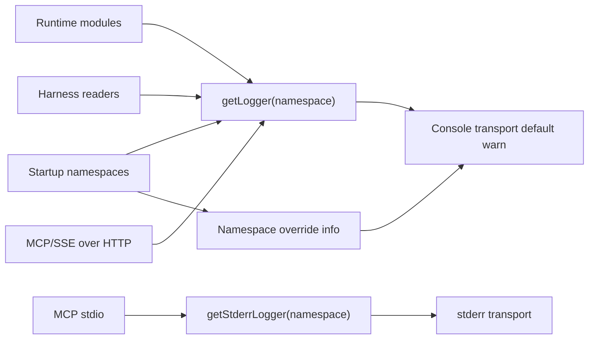
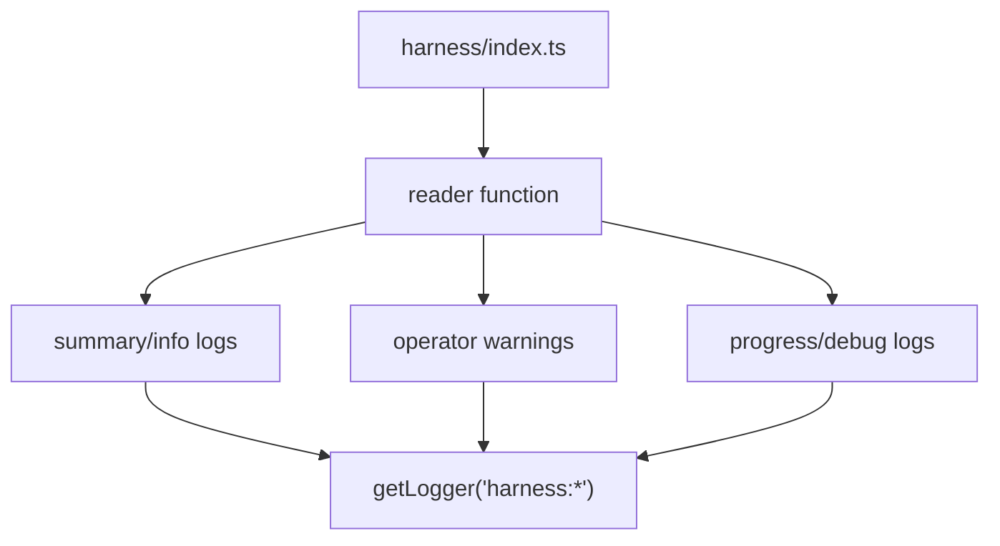
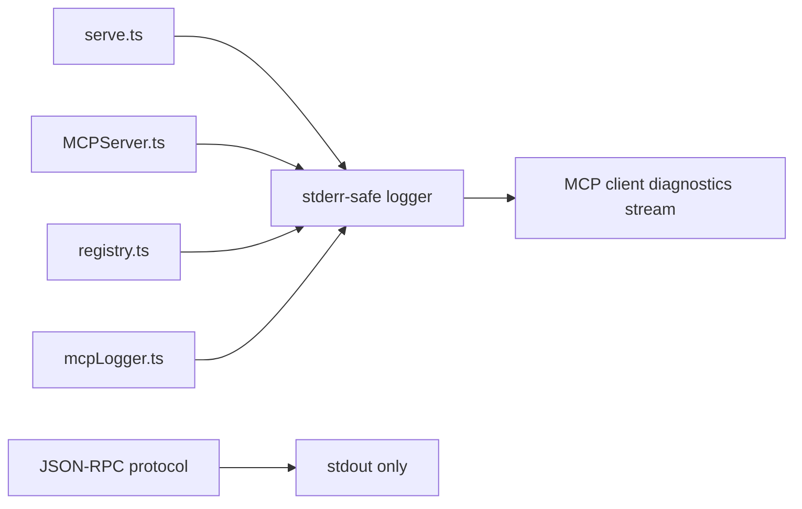

# R2WL - Winston Logging Implementation Plan

**Date**: 2026-06-08
**Status**: Implemented
**Goal**: Replace platform-wide `console.*` logging with Winston, default runtime console output to `warn`, keep startup-related logging at `info`, and mute noisy Codex trace diagnostics from the console.

## Mandatory Reading

| file name | line range | description |
|---|---:|---|
| `server/zz-reach2/architecture/archi-context-core-level0.md` | 1-922 | Level-0 architecture, runtime, entry point, harness registry, startup orchestration, storage/DB/API flow, and module inventory used to choose logger namespaces and avoid disturbing the pipeline boundaries. |
| `server/zz-reach2/upgrades/2026-06/r2so-startup-optimization.md` | 1-182 | Startup optimization plan to treat as implemented for this logging change; identifies startup decision, bookmark, batch ingest, Cursor/OpenCode, manifest, DB, watcher, and verification paths that must remain visible at `info`. |
| `server/package.json` | 1-39 | Server package metadata, Bun scripts, dependency layout, and current absence of Winston; latest Winston was verified online and with `bun pm view winston version` as `3.19.0`. |
| `server/tsconfig.json` | 1-14 | TypeScript module settings (`type: module`, ESNext, bundler resolution, strict mode) that shape the Winston import/config file style. |
| `server/src/ContextCore.ts` | 1-260, 432-627 | Main startup orchestrator, AgentBuilder/MCP startup logs, shutdown logs, and process-level startup guard; this is the primary consumer of startup `info` logging. |
| `server/src/harness/index.ts` | 1-63 | Harness registry and dispatch point; useful for placing `harness:index` warnings for unknown harnesses without touching reader contracts. |
| `server/src/harness/codex.ts` | 366-808 | Codex reader trace and summary logging surface; noisy `console.trace` diagnostics must move to Winston debug/silly and stay muted from console by default. |
| `server/src/harness/cursor.ts` | 104-210, 270-379, 635-638 | Cursor ingest logs, mapping warnings, fallback ItemTable diagnostics, and incremental checkpoint summary; key startup-optimization harness logging. |
| `server/src/harness/cursor-query.ts` | 108-114, 618-925 | Cursor progress helpers, model/timestamp maps, bubble scan, and delta scan logs; key for quieting repetitive progress while preserving warnings. |
| `server/src/harness/cursor-matcher.ts` | 273-281, 956-990, 1096-1297 | Cursor rule-drop warnings, workspace-map progress, full workspace inference diagnostics, and unresolved-session evidence logs. |
| `server/src/mcp/MCPServer.ts` | 1-96 | Stdio MCP wrapper; documents the stdout protocol hazard and currently writes diagnostics directly to stderr. |
| `server/src/mcp/registry.ts` | 34-188 | MCP request/tool/resource/prompt logging and dispatch; must remain stderr-safe for stdio transports. |
| `server/src/mcp/mcpLogger.ts` | 1-187 | MCP-specific file logger and always-on stderr tool-call diagnostics; must preserve JSON file logging semantics if wrapped in Winston. |
| `server/src/mcp/serve.ts` | 34-98 | Standalone MCP entry point; all startup diagnostics currently use `console.error` so stdout remains protocol-clean. |
| `server/src/mcp/transports/sse.ts` | 37-181 | HTTP/SSE MCP logs; not stdout-constrained like stdio, but should still move to `mcp:sse` Winston levels. |
| `server/src/cxccli.ts` | 579-648, 1076-1080, 1529-1770 | Interactive and JSON CLI output; most `console.*` calls here are user-facing output and should be classified before migration. |
| `server/src/setup.ts` | 142-858 | Interactive setup wizard output; console output is intentional user interface and should mostly remain as console output. |

## Design Rules

- Install `winston@3.19.0` in the server package.
- Add one shared logging configuration module and expose namespaced loggers with a small helper API.
- Default platform-wide console level is `warn`.
- Startup-related namespaces log to console at `info`.
- Codex trace diagnostics become Winston debug/silly messages and do not appear in the console under the default configuration.
- Keep MCP stdio safety in mind: standalone MCP diagnostic output must stay on stderr or use a stderr-safe Winston transport if migrated later.
- Treat the startup optimization plan as already implemented by configuring startup namespace overrides for both current files and expected startup components from that plan.
- Every plan group below is chronological and capped at 8 tasks.
- There are no hard-difficulty groups in this revision; former hard tasks were decomposed into `{{MEDIUM}}` and `{{SIMPLE}}` batches.

## Implementation Concepts

ASSUMPTION: `src/logging/logger.ts`, `getLogger(namespace)`, namespace-level overrides, and a default console level of `warn` were already built previously. If not, re-assess at runtime.

ASSUMPTION: the logging helper can either create stderr-safe loggers or can be extended with a tiny stderr transport helper. If not, re-assess at runtime before touching MCP stdio files.

Preferred ordinary runtime pattern:

```ts
import { getLogger } from "../logging/logger.js";

const logger = getLogger("harness:cursor");

logger.info(`Starting ingest from ${dbPath}`);
logger.warn(`Failed parsing key "${key}": ${message}`);
logger.debug(`Routing sample: ${routingSample}`);
```

Preferred MCP stdio pattern:

```ts
import { getStderrLogger } from "../logging/logger.js";

const logger = getStderrLogger("mcp:stdio");

logger.info("Server running on stdio");
logger.error("Fatal startup error", { error: serializeError(err) });
```

If `getStderrLogger()` does not exist, create or request an equivalent helper before changing `MCPServer.ts`, `registry.ts`, `mcpLogger.ts`, or `serve.ts`.



Suggested level mapping for incoming agents:

```ts
// Old console.log progress or summaries:
logger.info("Processed 12 files: 10 cached, 2 new/modified");

// Old console.log very repetitive progress:
logger.debug("[bubble-scan] 5000/45000");

// Old console.warn actionable operator issue:
logger.warn("Auto-derived projects need mapping rules", { count: adCount });

// Old console.error:
logger.error("Startup failed", { error: serializeError(err) });
```

## `src/` Directory Inventory

| directory | planned upgrade task |
|---|---|
| `src/agentBuilder/` | T33 |
| `src/agentPublisher/` | T32 |
| `src/analysis/` | T28 |
| `src/cache/` | T20 |
| `src/cli/` | T58-T60 |
| `src/db/` | T26 |
| `src/harness/` | T34-T47 |
| `src/mcp/` | T48-T57 |
| `src/models/` | T21 |
| `src/search/` | T24 |
| `src/server/` | T30 |
| `src/settings/` | T27 |
| `src/storage/` | T22 |
| `src/utils/` | T23 |
| `src/vector/` | T29 |
| `src/watcher/` | T31 |

{{SIMPLE}}
## Group 1 - Simple Batch 1

- [X] **T1.** Install `winston@3.19.0` in `server/package.json` and update `server/bun.lock`.
- [X] **T2.** Add `src/logging/logger.ts` as the central Winston configuration file.
- [X] **T3.** Configure the shared console transport with default level `warn`.
- [X] **T4.** Add environment overrides such as `LOG_LEVEL` and `LOG_NAMESPACE_LEVELS` without requiring them for normal operation.
- [X] **T5.** Add a `getLogger(namespace)` helper so each file can create its own namespaced logger.
- [X] **T6.** Preserve plain readable console output with timestamp, level, namespace, and message formatting.
- [X] **T7.** Add a short logger self-test or typecheck-friendly smoke path if the project already has an appropriate test pattern.

{{MEDIUM}}
## Group 2 - Medium Batch 1

- [X] **T8.** Add namespace-level overrides so startup namespaces emit `info` to console while the global default remains `warn`.
- [X] **T9.** Include current startup namespaces: `ContextCore`, `MessageDB`, `DiskMessageStore`, `GlobalSettingsStore`, `FileWatcher`, and `IncrementalPipeline`.
- [X] **T10.** Include startup-optimization namespaces from R2SO: `StartupIngestCoordinator`, `startup-db-load`, `startup-ingest-plan`, `startup-harness-skip`, `startup-harness-delta`, `startup-harness-full`, and `startup-harness-batch`.
- [X] **T11.** Include startup harness namespaces involved in R2SO: `harness:index`, `harness:cursor`, `harness:cursor-query`, `harness:cursor-matcher`, `harness:opencode`, `utils:rawCopier`, and `db:DiskMessageStore`.
- [X] **T12.** Convert the main startup-facing `console.log`, `console.warn`, and `console.error` calls in `ContextCore.ts` to its namespaced logger.
- [X] **T13.** Ensure startup failure and shutdown errors still print at `error`, independent of namespace overrides.
- [X] **T14.** Keep startup progress summaries at `info` where they are needed for the optimized startup flow.

{{MEDIUM}}
## Group 3 - Medium Batch 2

- [X] **T15.** Add a `harness:codex` logger in `codex.ts`.
- [X] **T16.** Replace the noisy `console.trace` diagnostics in `codex.ts` with `logger.debug` or `logger.silly`.
- [X] **T17.** Convert Codex processed-file summaries to `logger.info`, which remains hidden from console unless the namespace or global level allows it.
- [X] **T18.** Convert Codex malformed-line summaries to `logger.warn` only if they are operator-actionable; otherwise use `logger.info`.
- [X] **T19.** Confirm Codex trace/debug diagnostics do not appear in the console with default config.

{{SIMPLE}}
## Group 4 - Simple Batch 2

- [X] **T20.** Upgrade `src/cache/`: audit `ResponseCache` and any cache helpers for `console.*`; migrate diagnostics to `cache:*` Winston namespaces or record that the directory has no runtime logging.
- [X] **T21.** Upgrade `src/models/`: audit model classes for logging; keep models side-effect-light and migrate any diagnostics to `models:*` namespaces only if logging already exists.
- [X] **T22.** Upgrade `src/storage/`: migrate storage writer diagnostics to `storage:*` Winston namespaces, with duplicate/skip messages below the default console threshold unless they are warnings.
- [X] **T23.** Upgrade `src/utils/`: migrate utility diagnostics, including raw-copy/cache helpers used by startup optimization, to `utils:*` namespaces.
- [X] **T24.** Upgrade `src/search/`: migrate search indexing/query diagnostics to `search:*` namespaces and keep normal query chatter below console default.
- [X] **T25.** Run a first production-console search after the simple directory batch and note any intentional exceptions before moving to broader runtime directories.

{{MEDIUM}}
## Group 5 - Medium Batch 3

- [X] **T26.** Upgrade `src/db/`: migrate `BaseMessageStore`, `DiskMessageStore`, `InMemoryMessageStore`, and related DB diagnostics to `db:*` namespaces; keep startup DB load at `info`.
- [X] **T27.** Upgrade `src/settings/`: migrate settings-store warnings and load/save diagnostics to `settings:*` namespaces, preserving actionable config problems at `warn` or `error`.
- [X] **T28.** Upgrade `src/analysis/`: migrate `TopicSummarizer`, `TopicContextBuilder`, and subject/summarization diagnostics to `analysis:*` namespaces; keep startup summarization state at `info`.
- [X] **T29.** Upgrade `src/vector/`: migrate vector initialization, embedding cache, Qdrant, and vector-pipeline diagnostics to `vector:*` namespaces; keep startup vector decisions at `info`.
- [X] **T30.** Upgrade `src/server/`: migrate API server and route diagnostics to `server:*` namespaces, with routine request/search chatter below the default console threshold.
- [X] **T31.** Upgrade `src/watcher/`: migrate `FileWatcher` and `IncrementalPipeline` diagnostics to `watcher:*` namespaces; keep R2SO startup/watch decision messages at `info`.
- [X] **T32.** Upgrade `src/agentPublisher/`: migrate publisher progress, warnings, and ledger diagnostics to `agentPublisher:*` namespaces.
- [X] **T33.** Upgrade `src/agentBuilder/`: migrate builder indexing/generation diagnostics to `agentBuilder:*` namespaces while preserving actionable warnings.

{{MEDIUM}}
## Group 6 - Medium Batch 4

- [X] **T34.** Upgrade `src/harness/index.ts`: add `harness:index` logger and emit a `warn` when an unknown configured harness has no reader, while preserving the current `[]` return behavior.
- [X] **T35.** Upgrade file-based harness summaries in `claude.ts` and `vscode.ts`: use `harness:claude` and `harness:vscode`; map malformed-file warnings to `warn` and processed counts to `info`.
- [X] **T36.** Upgrade Kiro rule/config diagnostics in `kiro.ts`: map dropped project rules, malformed `.chat` files, unresolved routing, and suggested mapping snippets to `warn`; map dedupe and processed summaries to `info`.
- [X] **T37.** Upgrade OpenCode startup logs in `opencode.ts`: use `harness:opencode`; map missing/unopenable DB and per-session processing failures to `warn`; map found/produced counts to `info`.
- [X] **T38.** Upgrade Cursor top-level ingest logs in `cursor.ts`: use `harness:cursor`; map ingest start, rule counts, workspace sources, routing sample, and total duration to `info` or `debug` based on noise.
- [X] **T39.** Keep Cursor actionable mapping guidance in `cursor.ts` at `warn`: auto-derived projects, MISC sessions, failed key parsing, and suggested `cc.json` snippets should remain visible by default.
- [X] **T40.** Upgrade Cursor incremental checkpoint summary in `cursor.ts`: keep the `rowid old->new` message at `info` because R2SO startup/watch flows need it.

{{MEDIUM}}
## Group 7 - Medium Batch 5

- [X] **T41.** Upgrade `cursor-query.ts` progress helper: replace `console.log` in `logCursorProgress()` with `logger.debug` so repetitive `[bubble-scan]` progress is muted by default.
- [X] **T42.** Upgrade `cursor-query.ts` map summaries: make session model/timestamp map counts and sample bubble fields `debug`; keep timestamp fallback warnings at `warn`.
- [X] **T43.** Upgrade `cursor-query.ts` delta scan messages: use `debug` for row counts and field samples; use `warn` for DateTime fallback warnings.
- [X] **T44.** Upgrade `cursor-matcher.ts` rule loading: keep dropped explicit/generic mapping rules at `warn` under `harness:cursor-matcher`.
- [X] **T45.** Upgrade `cursor-matcher.ts` workspace progress: use `debug` for composer/project layout progress and full workspace-infer counters.
- [X] **T46.** Upgrade `cursor-matcher.ts` unresolved-session evidence: use `info` only if it supports startup recovery decisions; otherwise use `debug`.
- [X] **T47.** Upgrade `HarnessMatcher.ts` and `antigravity.ts`: use `harness:matcher` for symbol-map diagnostics; classify `antigravity.ts` as disabled/experimental and either migrate to `harness:antigravity` or document as intentionally out of runtime.

Harness migration target shape:



{{MEDIUM}}
## Group 8 - Medium Batch 6

- [X] **T48.** Before editing MCP files, verify the logger helper has a stderr-safe API such as `getStderrLogger(namespace)`; if it does not, add that helper in the logging module first.
- [X] **T49.** Upgrade `MCPServer.ts`: replace `logMcpInfo()` internals with a stderr-safe `mcp:stdio` logger while preserving the invariant that stdout carries only MCP protocol data.
- [X] **T50.** Upgrade `registry.ts`: replace `logMcpRequest()` internals with the same stderr-safe logger; keep request logs low-noise, probably `debug` unless explicitly enabled.
- [X] **T51.** Upgrade `mcpLogger.ts` request/result/error console diagnostics to stderr-safe Winston calls while preserving its existing JSON session/detail file writes.
- [X] **T52.** Keep `mcpLogger.ts` file write failures at `error` and ensure they still go to stderr in stdio mode.
- [X] **T53.** Upgrade `serve.ts`: replace `console.error` startup/status lines with stderr-safe `mcp:serve` logger calls; startup load counts can be `info`, fatal startup remains `error`.
- [X] **T54.** Verify no MCP stdio path uses `console.log`, `process.stdout.write`, or a stdout Winston transport after migration.

MCP stdio migration target:



{{MEDIUM}}
## Group 9 - Medium Batch 7

- [X] **T55.** Upgrade `mcp/transports/sse.ts`: replace `logMcpSseInfo()` with `mcp:sse` Winston logger; route connection/message failures to `logger.error`.
- [X] **T56.** Upgrade `mcp/tools/search.ts`: replace Qdrant search failure `console.error` with `mcp:search` or `mcp:tools:search` logger at `error`.
- [X] **T57.** Leave `src/mcp/tests/**` console output alone unless test assertions require migration; test runner output is user-facing command output.
- [X] **T58.** Upgrade `src/cli/discovery.ts`: audit for diagnostics; migrate non-user-facing diagnostics to `cli:discovery`, or record no migration required if it is logging-free.
- [X] **T59.** Classify `cxccli.ts` console output before migrating: table rendering, JSON output, prompts, validation text, and success messages are CLI UI and should remain console output.
- [X] **T60.** Migrate only non-interactive/background diagnostics in `cxccli.ts` to `cli:cxccli`; if none are found, document `cxccli.ts` as an intentional console exception.
- [X] **T61.** Classify `setup.ts` console output as interactive setup UI; keep wizard display output on console and migrate only fatal/background diagnostics if any are clearly not UI.

CLI classification snippet:

```ts
// Keep: command output consumed by a human or --json caller.
console.log(JSON.stringify(rows, null, "\t"));

// Keep: validation output for CLI UX.
console.error(chalk.red(`Validation error: ${message}`));

// Migrate only if it is background diagnostic noise, not command output.
logger.debug("Scanner skipped duplicate candidate", { path });
```

{{SIMPLE}}
## Group 10 - Simple Batch 3

- [X] **T62.** Audit root `src/config.ts`: confirm no logging exists and record no migration required.
- [X] **T63.** Audit root `src/types.ts`: confirm no logging exists and record no migration required.
- [X] **T64.** Audit root `src/startHiMem.ts`: keep child process `stdio: inherit` behavior; record no Winston migration required unless new wrapper diagnostics are added.
- [X] **T65.** Re-check root `ContextCore.ts` after Group 2 and ensure no startup `console.*` calls remain except intentionally user-facing first-run guidance if documented.
- [X] **T66.** Re-check `setup.ts` and `cxccli.ts` intentional console exceptions are documented in this plan or an adjacent implementation note.
- [X] **T67.** Run a production-only search for `console.trace` and remove or document every occurrence.
- [X] **T68.** Run a production-only search for `process.stdout.write` and verify it is absent from logging paths.

{{SIMPLE}}
## Group 11 - Simple Batch 4

- [X] **T69.** Run production-only search: `rg -n "console\\.(log|warn|error|trace)" server/src -g "*.ts" -g "!**/tests/**"` and classify every remaining hit as migrated, user-facing CLI output, or intentional MCP exception.
- [X] **T70.** Run production-only search: `rg -n "process\\.(stdout|stderr)\\.write" server/src -g "*.ts" -g "!**/tests/**"` and classify every remaining hit.
- [X] **T71.** Add a short "Intentional Console Exceptions" note to this plan or a follow-up implementation note listing `setup.ts`, `cxccli.ts`, and any MCP stderr helpers that intentionally remain.
- [X] **T72.** Run `bun run typecheck` from `server`.
- [X] **T73.** Run focused tests for touched areas if available; otherwise run the existing relevant Bun test subset.
- [X] **T74.** Verify TypeScript imports use `.js` specifiers consistently for the new logger module.

{{MEDIUM}}
## Group 12 - Medium Batch 8

- [X] **T75.** Start the normal server and verify console output shows startup `info` plus warnings/errors, but suppresses ordinary runtime `info` outside startup namespaces.
- [X] **T76.** Verify Codex debug/trace messages are muted from the console by default.
- [X] **T77.** Verify setting a lower log level exposes Codex debug output for local troubleshooting.
- [X] **T78.** Verify startup-optimization namespaces from R2SO still emit `info` messages for startup decisions, batches, DB load, and watcher/bootstrap paths.
- [X] **T79.** Run or manually exercise standalone `bun run mcp` and verify stdout remains protocol-clean while diagnostics appear on stderr.
- [X] **T80.** Exercise MCP/SSE startup if enabled and verify `mcp:sse` logs follow Winston level controls.
- [X] **T81.** Summarize the migration, default levels, namespace overrides, directory coverage, intentional console exceptions, and verification results for handoff.

---

## Intentional Console Exceptions

| file | reason |
|---|---|
| `src/setup.ts` | Interactive setup wizard UI — all chalk-formatted prompts, scan results, and preview output |
| `src/cxccli.ts` | CLI command UI — tables, JSON (`--json`), prompts, validation errors, success messages |
| `src/ContextCore.ts` (lines 76–79) | First-run `cc.json` missing guidance — direct operator instructions before logger/bootstrap |
| `src/harness/cursor-query.ts` (block comments) | Dead legacy implementations inside `/* … */` — not executed at runtime |
| `src/watcher/FileWatcher.ts` (commented line) | Disabled debug hook — not executed |
| `src/mcp/tests/**` | Test runner and assertion output — user-facing command output |

MCP stdio diagnostics use `getStderrLogger()` (`mcp:stdio`, `mcp:serve`) — not raw `console.*`, but intentionally bypass the stdout console transport.

---

## Implementation Summary (T81)

### Core module

- **`src/logging/logger.ts`** — Winston 3.19.0, default console level `warn`, `getLogger(namespace)`, `getStderrLogger(namespace)`, `serializeError()`, env overrides `LOG_LEVEL` and `LOG_NAMESPACE_LEVELS`.
- **`src/logging/tests/logger.test.ts`** — smoke tests for defaults, startup overrides, env tuning, cache behavior.

### Default levels

| context | console level |
|---|---|
| Global default | `warn` |
| Startup/R2SO namespaces (see `STARTUP_CONSOLE_INFO_NAMESPACES` in logger.ts) | `info` |
| Codex trace/progress (`harness:codex`) | `debug`/`silly` — muted unless `LOG_LEVEL=debug` or `LOG_NAMESPACE_LEVELS=harness:codex:debug` |
| Routine API/search/vector runtime | `debug` — muted at default |

### Directory coverage

| directory | status |
|---|---|
| `logging/` | new central module |
| `db/`, `settings/`, `watcher/`, `ingest/` | migrated |
| `harness/` | migrated (11 files) |
| `vector/`, `analysis/`, `server/`, `search/`, `models/`, `agentBuilder/` | migrated |
| `mcp/` (production) | migrated to stderr-safe or `mcp:sse` loggers |
| `cache/`, `storage/`, `utils/` | no runtime `console.*` found |
| `agentPublisher/` | no runtime `console.*` found |
| `cli/discovery.ts` | logging-free |
| `config.ts`, `types.ts`, `startHiMem.ts` | audited, no migration |

### Verification results

- `bun run typecheck` — pass
- `bun test src/logging/tests/logger.test.ts` + ingest/watcher/harness/settings subset — 10 pass
- Production `console.trace` — zero active hits (removed from Codex; only dead comment blocks remain)
- Production `process.stdout.write` / `process.stderr.write` — zero hits outside tests
- Incremental pipeline test confirms startup namespaces emit `info` at default config

### Operator tuning

```bash
# Expose all debug output including Codex trace
LOG_LEVEL=debug bun run start

# Tune one namespace
LOG_NAMESPACE_LEVELS=harness:codex:debug,mcp:stdio:info bun run start
```
