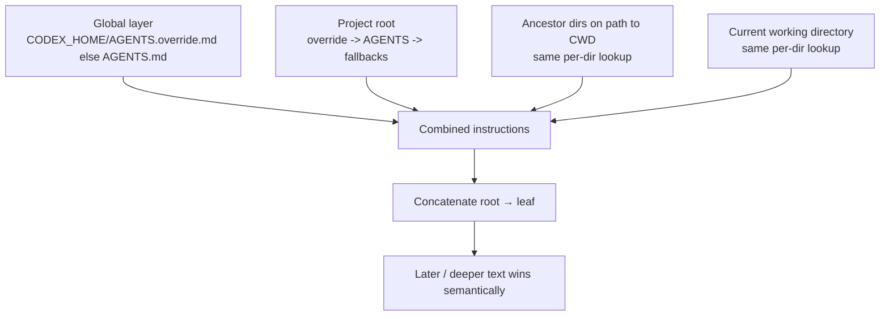
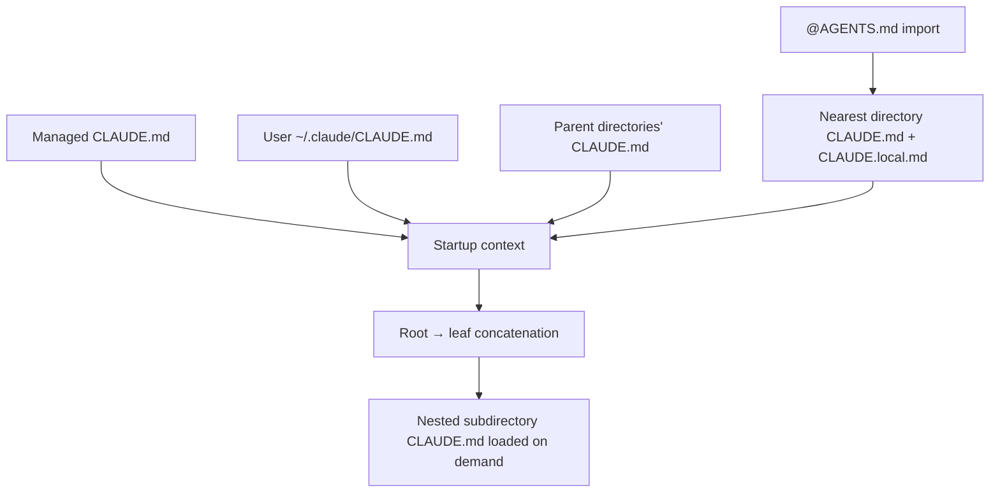

# AGENTS.md and Agent Skills Across Codex, Claude, Copilot, and Kiro

## Executive summary

Two different but related artifacts are in scope here. **`AGENTS.md`** is an open, free-form Markdown convention for persistent agent guidance. It has **no required schema fields**; the shared convention is “nearest relevant file wins,” while explicit user prompts override repository guidance. **Agent Skills** use **`SKILL.md`** (singular, not `SKILLS.md`) inside a skill directory, with a formal YAML-frontmatter schema: `name` and `description` are required; `license`, `compatibility`, `metadata`, and experimental `allowed-tools` are optional. citeturn39view3turn39view1turn41view0

Among the four vendors, **Codex** is the cleanest first-class implementation of `AGENTS.md`: it has a documented multi-layer algorithm, supports `AGENTS.override.md`, optional fallback filenames, a byte cap, and deterministic root-to-leaf concatenation where deeper files override broader ones by appearing later in the prompt. It also supports Agent Skills broadly, and extends them with `agents/openai.yaml` for UI metadata, invocation policy, and dependency declarations. citeturn25view1turn25view3turn25view4turn28view0

**Claude Code does not natively read `AGENTS.md`**. Its native artifact is `CLAUDE.md`, though Anthropic explicitly recommends importing `@AGENTS.md` or symlinking it for interoperability. Claude’s skills support is the richest here: it follows the open standard but adds many frontmatter extensions, including `when_to_use`, `argument-hint`, `arguments`, `disable-model-invocation`, `user-invocable`, `disallowed-tools`, `model`, `effort`, `context`, `agent`, `hooks`, `paths`, and `shell`. Claude also has the most explicit security semantics around deny-first permission rules, hook precedence, and workspace trust for project skills. citeturn32view0turn32view1turn32view2turn36view0turn38view1turn38view2

**GitHub Copilot** supports `AGENTS.md` as one of several repository-customization mechanisms, but its implementation sits alongside `.github/copilot-instructions.md`, `.github/instructions/*.instructions.md`, and optional root `CLAUDE.md` / `GEMINI.md`. The docs explicitly say multiple relevant instruction sets can apply, with **personal > repository > organization** priority, while within the `AGENTS.md` layer the **nearest `AGENTS.md` takes precedence**. Copilot also supports Agent Skills in cloud agent, code review, CLI, agent mode, and the SDK, but the documented skill field set varies by surface: product docs emphasize `name`, `description`, optional `license`, and `allowed-tools`, while the SDK skill loader documents only an optional `name` and `description` subset. citeturn17view3turn17view5turn12view4turn12view5turn42view0turn14view3turn14view0turn14view5

**Kiro** supports `AGENTS.md`, but only as a compatibility layer over its richer **steering** system. Kiro documents `AGENTS.md` in the workspace root or the global steering directory, and says those files are **always included**; unlike native steering, `AGENTS.md` does **not** support inclusion modes. Kiro’s native steering is materially more expressive than `AGENTS.md`, with `always`, `fileMatch`, `manual`, and `auto` modes. Kiro also supports the open skill format and clearly documents one important security caveat: once write-capable tools are enabled, skills and other local resources are **not isolated** from each other; they operate with the same permissions as the agent. citeturn20view0turn20view1turn20view2turn20view3turn21view1turn19view0

The practical interoperability conclusion is straightforward. If you want the **best cross-vendor baseline**, keep a canonical, concise root `AGENTS.md`, add nested `AGENTS.md` files only where vendors actually support them well, generate a small `CLAUDE.md` shim that imports `@AGENTS.md`, and keep shared skills strictly within the open `SKILL.md` schema unless you truly need vendor-specific behavior. Put vendor-specific extensions in sidecars where possible—such as Codex’s `agents/openai.yaml`—or in vendor-native config systems such as Copilot custom instructions, Claude settings/hooks, or Kiro steering/custom-agent JSON. citeturn39view3turn32view0turn41view0turn28view0turn17view5turn20view0

## Standards baseline

The **AGENTS.md** standard is intentionally lightweight. The project describes it as “a README for agents,” recommends placing one at repository root, and explicitly says there are **no required fields** because it is just standard Markdown. The shared convention is that nested files may be used in large monorepos, the **closest AGENTS.md to the edited file wins**, and explicit user chat prompts override repository instructions. citeturn39view1turn39view3

The **Agent Skills** standard is materially stricter. A skill is a directory containing at minimum a `SKILL.md`; that file must contain YAML frontmatter followed by Markdown instructions. The standard specifies two required fields—`name` and `description`—plus optional `license`, `compatibility`, `metadata`, and experimental `allowed-tools`. It also recommends progressive disclosure: load metadata first, then full instructions on activation, then referenced resources only as needed. citeturn41view0turn40search1turn40search2

| Artifact | Canonical filename | Formal schema | Required fields | Optional fields | Normative precedence / loading rule |
|---|---|---|---|---|---|
| AGENTS guidance | `AGENTS.md` | No formal schema; plain Markdown. citeturn39view3turn39view1 | None. citeturn39view3 | No specific constraint. Use any headings you like. citeturn39view3 | Closest AGENTS file wins; user prompt overrides repo guidance. citeturn39view3 |
| Agent Skills | `SKILL.md` inside a skill directory | YAML frontmatter + Markdown body. citeturn41view0 | `name`, `description`. citeturn41view0 | `license`, `compatibility`, `metadata`, experimental `allowed-tools`. citeturn41view0 | Progressive disclosure: metadata at startup, full `SKILL.md` on activation, resources on demand. citeturn41view0turn40search2 |

The full open Agent Skills schema is below.

| Field | Required | Constraints / semantics | Example |
|---|---|---|---|
| `name` | Yes | 1–64 chars; lowercase letters, numbers, hyphens; no leading/trailing hyphen; no consecutive hyphens; must match parent directory name. citeturn41view0 | `name: code-review` citeturn41view0 |
| `description` | Yes | 1–1024 chars; should describe both what the skill does and when to use it; should include specific trigger keywords. citeturn41view0 | `description: Extracts text and tables from PDF files...` citeturn41view0 |
| `license` | No | License name or reference to bundled license file. citeturn41view0 | `license: Apache-2.0` citeturn41view0 |
| `compatibility` | No | Up to 500 chars; environment requirements such as product, packages, or network access. citeturn41view0 | `compatibility: Requires git, docker, jq, and access to the internet` citeturn41view0 |
| `metadata` | No | Arbitrary string key/value map. citeturn41view0 | `metadata: { author: example-org, version: "1.0" }` citeturn41view0 |
| `allowed-tools` | No | Space-separated string of pre-approved tools; experimental and variably supported. citeturn41view0 | `allowed-tools: Bash(git:*) Bash(jq:*) Read` citeturn41view0 |

A portable minimal skill therefore looks like this:

```md
---
name: code-review
description: Review code for correctness, security, and test gaps. Use when reviewing diffs or preparing a pull request.
license: Apache-2.0
compatibility: Requires git; no other specific constraint
metadata:
  author: acme-devtools
  version: "1.0"
---

## Review process

1. Read the diff first.
2. Flag correctness, security, and test issues.
3. Suggest minimal fixes.
```

That format is standards-compliant across the open Agent Skills spec. citeturn41view0

## Vendor implementations

The four vendors do not implement the standards at the same layer. Codex and Copilot expose `AGENTS.md` natively; Claude treats `CLAUDE.md` as the primary memory file and recommends importing `AGENTS.md`; Kiro treats `AGENTS.md` as a compatibility input into its steering system. For skills, all four support the open `SKILL.md` model, but each product adds surface-specific behavior and extensions. citeturn25view1turn17view3turn32view0turn20view0turn27view0turn32view3turn42view0turn24search7

### Codex

Codex implements `AGENTS.md` as a first-class instruction chain. It reads a global file from `CODEX_HOME`/`~/.codex`, then walks **from project root down to the current working directory**, checking each directory in order for `AGENTS.override.md`, then `AGENTS.md`, then configured fallback names. It includes at most one file per directory, concatenates them root-to-leaf, skips empty files, and stops loading when `project_doc_max_bytes` is reached. That is a concrete, deterministic override algorithm rather than an informal “nearest wins” rule. citeturn25view1turn25view4turn26search6

Codex’s skill implementation is also strong and relatively conservative. It follows the open standard, scans repository, user, admin, and system skill locations, and uses progressive disclosure. If multiple skills share the same `name`, Codex does **not** merge them; both can appear in selectors. Its main extension is **`agents/openai.yaml`**, which stores UI metadata, an invocation policy (`allow_implicit_invocation`), and dependency declarations such as MCP requirements. citeturn27view0turn27view2turn28view0

**Sample Codex `AGENTS.md`:**

```md
# AGENTS.md

## Build and test
- Run `pnpm lint` and `pnpm test` before finishing.
- For the payments service, prefer `make test-payments`.

## Change policy
- Keep patches minimal.
- Do not add production dependencies without approval.

## Review expectations
- Update tests when behavior changes.
- Document public API changes in `docs/`.
```

**Sample Codex skill with sidecar metadata:**

```md
# .agents/skills/release-check/SKILL.md
---
name: release-check
description: Validate release readiness. Use when preparing a release or verifying CI, changelog, and versioning.
license: Apache-2.0
---

1. Run the release validation commands.
2. Check changelog completeness.
3. Confirm version bumps and tagged artifacts.
```

```yaml
# .agents/skills/release-check/agents/openai.yaml
interface:
  display_name: "Release Check"
  short_description: "Release-readiness checklist"
policy:
  allow_implicit_invocation: false
dependencies:
  tools:
    - type: "mcp"
      value: "internalReleaseApi"
      description: "Release system"
```

Those sidecar fields are Codex-specific; they are not part of the open skill schema. citeturn28view0

### Claude

Claude Code’s native guidance file is **`CLAUDE.md`**, not `AGENTS.md`. Anthropic explicitly documents the interoperability pattern: create `CLAUDE.md` that imports `@AGENTS.md`, or symlink `AGENTS.md` to `CLAUDE.md`. Claude loads memory by walking upward from the current working directory, concatenating `CLAUDE.md` and `CLAUDE.local.md` files from broader to narrower scope, with `CLAUDE.local.md` appended after `CLAUDE.md` in the same directory; nested subdirectory CLAUDE files are loaded on demand when files there are read. Imports are supported with `@path`, resolved relative to the importing file, up to four hops. citeturn32view0turn32view1turn32view2

Claude’s skill implementation is the most feature-rich. The product supports the open Agent Skills standard but adds a substantial frontmatter surface: `when_to_use`, `argument-hint`, `arguments`, `disable-model-invocation`, `user-invocable`, `allowed-tools`, `disallowed-tools`, `model`, `effort`, `context`, `agent`, `hooks`, `paths`, and `shell`. All fields are optional in Claude; `description` is merely recommended, not required, which is looser than the open specification. Claude also adds dynamic context injection via `!command`, subagent execution via `context: fork`, and plugin-scoped skill namespacing. citeturn36view0turn33view2turn33view3turn33view4turn33view5

**Sample Claude `CLAUDE.md` shim:**

```md
@AGENTS.md

## Claude-specific notes
- Use plan mode for changes under src/billing/.
- Keep explanations concise unless the user asks for more detail.
```

**Sample Claude skill with extensions:**

```md
# ~/.claude/skills/pr-summary/SKILL.md
---
name: pr-summary
description: Summarize changes in a pull request.
when_to_use: Use when asked to summarize a PR, review a PR diff, or prepare release notes from a PR.
argument-hint: [pr-number]
arguments: [pr]
context: fork
agent: Explore
allowed-tools: Bash(gh *) Read Grep
disable-model-invocation: false
user-invocable: true
paths: ["**/*.ts", "**/*.tsx"]
shell: bash
---

## Pull request context
- PR diff: !`gh pr diff $pr`
- PR comments: !`gh pr view $pr --comments`

## Task
Summarize the PR, list risks, and call out missing tests.
```

That snippet is highly expressive in Claude, but most of those fields are non-portable. citeturn36view0turn33view3turn33view4turn33view5

### Copilot

GitHub Copilot supports three repository instruction types on GitHub: repository-wide `.github/copilot-instructions.md`, path-specific `.github/instructions/*.instructions.md`, and **agent instructions** via `AGENTS.md`. GitHub explicitly states that **multiple relevant instruction sets can apply**, that personal instructions have highest priority, repository instructions are next, and organization instructions are last, and that within the AGENTS layer the **nearest `AGENTS.md` in the directory tree takes precedence**. GitHub also allows a single root `CLAUDE.md` or `GEMINI.md` as an alternative agent-instruction file. citeturn17view2turn17view3turn17view4turn17view5

Copilot’s skills support spans **cloud agent, code review, CLI, agent mode in VS Code, and the Copilot SDK**. The cloud/CLI product docs say `SKILL.md` files are Markdown with YAML frontmatter; in their “simplest form” they include required `name`, required `description`, optional `license`, and the Markdown body. The product docs additionally support `allowed-tools` to pre-approve tools without repeated confirmations. The SDK loader is looser and more minimal: it documents frontmatter as optional, with only `name` and `description`, and exposes discovery through `skillDirectories` / `disabledSkills` session options. citeturn42view0turn14view3turn14view0turn14view5

**Sample Copilot `AGENTS.md`:**

```md
# AGENTS.md

## Repository expectations
- Build with `npm run build`.
- Run `npm test` and `npm run lint` before finishing.
- Keep React components functional and typed.

## Pull requests
- Use concise PR titles.
- Update docs when public behavior changes.
```

**Sample Copilot skill:**

```md
# .github/skills/image-convert/SKILL.md
---
name: image-convert
description: Converts SVG images to PNG format. Use when asked to convert SVG files.
license: Apache-2.0
allowed-tools: shell
---

When asked to convert an SVG to PNG, run the `convert-svg-to-png.sh`
script from this skill directory and pass the input SVG path as the
first argument.
```

GitHub warns specifically that pre-approving `shell` / `bash` can allow attacker-controlled skills or prompt injections to execute arbitrary commands, so this extension should be used sparingly. citeturn14view0turn14view4

### Kiro

Kiro supports `AGENTS.md`, but it is not the primary abstraction. The native construct is **steering**. Kiro says `AGENTS.md` files can be placed in the global steering directory (`~/.kiro/steering/`) or in the root folder of the workspace, and they are **always included**. Unlike native steering files, `AGENTS.md` does **not** support inclusion modes such as `always`, `fileMatch`, `manual`, or `auto`. In practice, teams using Kiro seriously will usually outgrow plain `AGENTS.md` and move richer guidance into steering files. citeturn20view0turn20view1

Kiro supports the open Agent Skills standard in both IDE and CLI documentation, but its operational model is different from the others. Skills live in `.kiro/skills/` (workspace) or `~/.kiro/skills/` (global), with workspace skills overriding global skills of the same name. The default agent auto-loads both locations; custom agents do **not** load skills by default and must be given `skill://.../SKILL.md` resources explicitly. Kiro’s IDE docs also surface optional open-standard-style fields (`license`, `compatibility`, `metadata`). citeturn20view5turn21view1turn21view3

**Sample Kiro `AGENTS.md` or steering-compatible guidance:**

```md
# AGENTS.md

## Project standards
- Use CDK diff before CDK deploy.
- Keep infrastructure changes isolated from app logic.
- Never commit secrets; use environment-specific configuration.

## Validation
- Run the project test suite before marking work complete.
```

**Sample Kiro steering file with richer native behavior:**

```md
# .kiro/steering/api-standards.md
---
inclusion: fileMatch
fileMatchPattern: ["app/api/**/*", "**/*.openapi.yaml"]
---

Use RESTful naming conventions.
Return structured error payloads.
Add request validation and auth checks for new endpoints.
```

**Sample Kiro skill:**

```md
# .kiro/skills/cdk-deploy/SKILL.md
---
name: cdk-deploy
description: Deploy AWS CDK stacks with best practices. Use when deploying infrastructure, running cdk deploy, or troubleshooting CDK issues.
compatibility: Requires AWS credentials and CDK CLI
metadata:
  author: platform-team
  version: "1.0"
---

1. Run `cdk synth`.
2. Run `cdk diff`.
3. Run `cdk deploy`.
4. Review IAM changes carefully.
```

Kiro will progressively load that skill, but once write-capable tools are enabled, the skill and other local resources share the agent’s permissions. citeturn21view1turn21view3turn19view0

## Path precedence and override logic

The biggest implementation differences are not in syntax but in **discovery** and **override mechanics**. That is where portability often breaks. citeturn25view1turn32view1turn17view3turn20view0

| Vendor | AGENTS / memory discovery | Skill discovery | Path precedence rule |
|---|---|---|---|
| Open baseline | Root plus nested AGENTS files are recommended; closest file to edited area wins; user prompt overrides. citeturn39view3 | No standard location rule. citeturn41view0 | Nearest relevant AGENTS wins. citeturn39view3 |
| Codex | Global `CODEX_HOME`: `AGENTS.override.md` else `AGENTS.md`; then project root→CWD, per dir check `AGENTS.override.md` → `AGENTS.md` → configured fallbacks; one file per dir; concatenate root→leaf; later entries override earlier. citeturn25view1turn25view4 | Repo `.agents/skills` from CWD upward to repo root, plus user/admin/system locations. Same-name skills do not merge. citeturn27view0turn27view2 | Deeper path entries override by later prompt position; sibling override file masks sibling base file. citeturn25view1turn25view3 |
| Claude | Walk upward from CWD for `CLAUDE.md` and `CLAUDE.local.md`; concatenate root→leaf; within dir `CLAUDE.local.md` is appended after `CLAUDE.md`; nested subdir files load on demand. `AGENTS.md` must be imported or symlinked. citeturn32view0turn32view1turn32view2 | Personal, project, enterprise, plugin locations; project skills from starting dir and parents to repo root, nested skills discovered on demand. Same-name precedence: enterprise > personal > project; plugin namespaced. citeturn34view2turn34view3turn34view4 | Narrower directory guidance comes later in context; local file overrides same-dir shared file; higher skill scope overrides lower for same name. citeturn32view1turn34view4 |
| Copilot | Repository-wide `.github/copilot-instructions.md`, matching `.github/instructions/*.instructions.md`, and AGENTS layer; nearest `AGENTS.md` wins inside AGENTS layer; all relevant instruction sets can apply; personal > repository > organization priority. citeturn17view2turn17view3turn17view5turn12view4 | Project skills in `.github/skills`, `.claude/skills`, or `.agents/skills`; personal in `~/.copilot/skills` or `~/.agents/skills`; project overrides personal when same name. citeturn42view0turn11view4 | Personal > repo > org; matching path-specific instructions are additive with repo-wide; nearest AGENTS wins within AGENTS scope. citeturn17view2turn17view3turn17view5 |
| Kiro | `AGENTS.md` only in workspace root or global steering dir; always included; no inclusion modes. Native steering: project > global. Kiro does not document nested AGENTS traversal beyond root compatibility points. citeturn20view0turn24search2 | Workspace `.kiro/skills` and global `~/.kiro/skills`; workspace overrides global. Default agent auto-loads both; custom agents require `skill://` in `resources`. citeturn20view5turn21view1 | Workspace skill overrides global skill by name; AGENTS global-vs-workspace precedence is best read as workspace > global by inference from steering precedence and shared locations. citeturn24search2turn20view0 |

A precise way to think about **Codex AGENTS resolution** is:



That algorithm is directly documented by OpenAI. citeturn25view1turn25view4

Claude’s native resolution is different because it treats project memory as a directory-chain of `CLAUDE.md` / `CLAUDE.local.md` files, not AGENTS files:



That makes Claude interoperable with `AGENTS.md`, but only indirectly. citeturn32view0turn32view1turn32view2

The main override strategies vendors expose are summarized here.

| Vendor | Explicit override mechanism | Detailed rule |
|---|---|---|
| Codex | `AGENTS.override.md`; fallback filename ordering; config-layer overrides. citeturn25view1turn25view4turn31search0 | In each directory, `AGENTS.override.md` masks `AGENTS.md`; global scope also prefers override file; project configs load root→leaf with closest winning; CLI flags override config layers. citeturn25view1turn31search0 |
| Claude | `CLAUDE.local.md`; imports; settings/hook deny rules. citeturn32view1turn32view2turn38view1turn38view2 | `CLAUDE.local.md` appends after same-dir `CLAUDE.md`; imported AGENTS content is expanded inline; deny rules still apply regardless of hook allow; blocking hook can stop tool use before permission rules. citeturn32view1turn38view1turn38view2 |
| Copilot | Path-specific `.instructions.md`; `excludeAgent`; personal/repo/org layering. citeturn12view4turn12view5turn17view5 | Repo-wide and matching path-specific instructions are both used; `excludeAgent` can keep a file out of cloud-agent or code-review contexts; all relevant instructions are provided with personal > repo > org priority. citeturn12view4turn12view5turn17view5 |
| Kiro | Native steering inclusion modes; local custom agents override global custom agents. citeturn20view0turn24search0 | Steering files can be always-on, path-matched, manual, or auto-matched; local custom agents and workspace skills override global ones when names conflict. citeturn20view0turn24search0turn21view1 |

In practice, the most reliable conflict-resolution pattern is **broad defaults at the top, narrow exceptions near the work**, plus a separate deterministic enforcement channel for truly non-negotiable controls. All four systems treat instruction files primarily as **context**, not absolute policy; Claude states this most explicitly for `CLAUDE.md`, and Kiro/Codex/Copilot all rely on separate permission or sandbox layers to actually block unsafe actions. citeturn37search7turn30view2turn11view2turn19view0

## Security and permission models

The standards themselves carry little or no hard security semantics. `AGENTS.md` has no permission model at all. Agent Skills adds only an **experimental** `allowed-tools` field, and the spec explicitly says support varies by implementation. The real security behavior comes from each host product. citeturn39view3turn41view0

| System | Default posture | Approval / allowlist model | Key risk notes |
|---|---|---|---|
| AGENTS.md standard | No specific constraint. It is context only. citeturn39view3 | No standard permission model. User prompts override repository guidance. citeturn39view3 | Security is delegated entirely to the host agent. citeturn39view3 |
| Codex | Sandboxed local execution by default; no network in default workspace-write sandbox unless enabled; permission profiles for filesystem/network. citeturn30view2turn30view1turn30view0 | Approval policy + sandbox policy + optional rules; side-effecting app/MCP calls can also require approval. citeturn30view1turn30view3 | `:danger-full-access` removes local sandboxing; rules and managed requirements can constrain unsafe combinations. citeturn30view0turn31search4 |
| Claude | Strict read-only by default; multiple permission modes from `default` to `bypassPermissions`. citeturn38view0turn37search14 | Deny/ask/allow rules, permission modes, protected paths, workspace trust, pre-tool hooks with deny-first precedence. citeturn38view0turn38view1turn38view2 | Skill `allowed-tools` grants prompt-free tool use while skill is active; malicious project skills can widen tool access once workspace trust is accepted. Dynamic `!command` expansion can be disabled by policy. citeturn33view2turn33view4 |
| Copilot | Cloud agent runs in ephemeral Actions-backed environment; secrets/variables isolated to Agents scope; tool access defaults to all in custom agents unless restricted. citeturn11view2turn13view0turn12view3 | `allowed-tools` in skills pre-approves tools; custom agent `tools` can allow all, specific tools, or none; Agents secrets and variables available at org/repo levels. citeturn14view0turn12view3turn11view2 | GitHub warns that pre-approving shell tools can enable arbitrary command execution; repo-level secrets override org-level secrets with same name; only `COPILOT_MCP_` values are exposed to MCP configs. citeturn14view0turn11view2 |
| Kiro | Read-only tools by default in CLI custom agents; writes require explicit enablement or runtime approval; IDE offers supervised/autopilot modes. citeturn19view0turn19view3 | `allowedTools`, `toolsSettings`, protected paths, supervised review, trusted commands, preToolUse hooks. citeturn22view2turn23view2turn19view3 | When write tools are enabled, the agent has the user’s filesystem permissions, can modify `~/.kiro`, and skills/resources are not isolated from each other. citeturn19view0 |

Two security details matter especially for cross-vendor skill design. First, **`allowed-tools` is not uniformly implemented**: it is experimental in the open spec, meaningful in Claude and Copilot product surfaces, and conceptually similar but not identical to Kiro’s JSON `allowedTools`. Second, instruction files are not a substitute for policy. If a workflow must never run `shell`, or must never touch particular files, enforce that with the product’s **sandbox / protected-path / deny-rule / hook** system, not just a sentence in `AGENTS.md` or `SKILL.md`. citeturn41view0turn33view2turn14view0turn22view2turn38view1turn30view2

## Migration, interoperability, and best practices

The cleanest **AGENTS-first** interoperability pattern is:

1. Write a canonical root `AGENTS.md` in plain Markdown.
2. Add nested `AGENTS.md` files only where you need path-local guidance and the target vendors actually honor nested discovery.
3. In Claude repos, add a tiny `CLAUDE.md` shim that imports `@AGENTS.md`.
4. In Copilot repos, keep `AGENTS.md` for agent instructions, but put review-specific and path-specific behavior into `.github/copilot-instructions.md` and `.github/instructions/*.instructions.md`.
5. In Kiro-heavy repos, move anything conditional or path-specific into `.kiro/steering/*.md`, because `AGENTS.md` there is compatibility-only and always-on. citeturn39view3turn32view0turn17view2turn20view0

For skills, the best portability rule is stricter: keep the shared `SKILL.md` confined to the **open schema** unless you are willing to accept vendor lock-in. Use `name`, `description`, and optionally `license`, `compatibility`, and `metadata` as the portable core. Put vendor-specific behavior in sidecars or vendor-native config:
- Codex: `agents/openai.yaml`. citeturn28view0
- Claude: frontmatter extensions, settings, hooks, or plugins. citeturn36view0turn33view4
- Copilot: `allowed-tools`, custom agents, agent profile files, repo instructions. citeturn14view0turn16view0
- Kiro: steering files or custom-agent JSON with `resources`, `allowedTools`, and `toolsSettings`. citeturn20view0turn23view0turn22view2

The compatibility matrix below is the practical bottom line.

| Capability | Codex | Claude | Copilot | Kiro |
|---|---|---|---|---|
| Native `AGENTS.md` support | Yes. citeturn25view1 | No; use `CLAUDE.md` and import/symlink `AGENTS.md`. citeturn32view0 | Yes. citeturn17view3 | Yes, as steering compatibility. citeturn20view0 |
| Nested `AGENTS.md` path discovery | Yes, root→CWD. citeturn25view1 | No native AGENTS discovery; nested `CLAUDE.md` supported. citeturn32view1 | Yes, nearest AGENTS in directory tree. citeturn17view3 | No specific nested AGENTS traversal documented beyond workspace root/global locations. citeturn20view0 |
| Native Skills support | Yes. citeturn27view0 | Yes. citeturn32view3 | Yes. citeturn42view0 | Yes. citeturn24search7 |
| Open-skill core fields portable | Yes. citeturn27view0turn41view0 | Yes, but Claude loosens requirements and adds many extensions. citeturn36view0 | Yes, with surface-dependent subsets. citeturn14view3turn14view5 | Yes. citeturn21view3turn21view1 |
| Vendor-specific extensions | `agents/openai.yaml`. citeturn28view0 | Extensive SKILL frontmatter extensions. citeturn36view0 | `allowed-tools`, custom agent profiles, `.instructions.md`. citeturn14view0turn16view0turn12view4 | Steering files, custom agent JSON, `skill://` resources. citeturn20view0turn23view0turn20view5 |
| Best interop strategy | Canonical AGENTS + standard SKILL + optional Codex sidecar. citeturn25view1turn41view0turn28view0 | Canonical AGENTS + `CLAUDE.md` import shim + keep Claude-only fields out of shared `SKILL.md` if portability matters. citeturn32view0turn36view0 | Canonical AGENTS + GitHub-specific repo/path instruction files + standard skill core. citeturn17view2turn42view0 | Canonical AGENTS only for root compatibility; use steering/skills for serious Kiro-native workflows. citeturn20view0turn21view1 |

A compact set of design best practices follows from the evidence above. Keep **AGENTS guidance short, stable, and scoped**: build/test commands, architectural boundaries, review expectations, and escalation rules are ideal. Keep **skills narrower and more procedural**: they should tell the agent how to perform a workflow it does not already know, with concise trigger descriptions and minimal standing context. For skills, keep `SKILL.md` short and move reference material to `references/`; both the open specification and vendor docs recommend this pattern. For any behavior that must be guaranteed, use enforcement layers—permissions, hooks, protected paths, or sandboxes—rather than prompt-only instructions. citeturn39view3turn41view0turn40search5turn36view0turn38view1turn30view2turn19view0

## Open questions and risks

The biggest **gap** is that `AGENTS.md` remains a convention rather than a strict protocol. The open project documents the broad model—plain Markdown, no schema, closest file wins—but vendors still differ materially in global scope handling, nested discovery, and interaction with other configuration sources. That means “portable” AGENTS guidance is mostly portable in spirit, not in exact runtime behavior. citeturn39view3turn25view1turn17view5turn20view0

The largest **portability risk** for skills is extension drift. Claude exposes the longest frontmatter surface; Codex adds sidecar metadata; Copilot differs by product surface; Kiro has native steering and JSON agents alongside skills. If you place vendor-specific behavior directly into shared `SKILL.md`, another client may ignore it, partially honor it, or surface it differently. The safest assumption is: **open-schema fields are portable; everything else is implementation-specific unless the vendor explicitly says otherwise**. citeturn36view0turn28view0turn14view5turn23view0

There are also **security risks** around prompt-defined capabilities. Both Anthropic and GitHub explicitly warn that pre-approving shell tools in a skill can turn a malicious or prompt-injected skill into arbitrary command execution. Kiro’s docs add a distinct warning that once write tools are enabled, local resources—including skills and steering—share the same permissions and are not isolated. Codex mitigates these risks most cleanly with explicit sandbox/approval boundaries, but even there, a badly scoped full-access profile can erase the benefit. citeturn33view2turn14view0turn19view0turn30view0turn30view2

Finally, some exact merge details are still under-documented. GitHub documents that all relevant instruction sets may be provided and that personal/repository/organization priorities apply, but it does not fully spell out the exact concatenation order among AGENTS, repo-wide instructions, and path-specific instructions in every Copilot surface. Kiro documents AGENTS compatibility locations, but not a full nested AGENTS traversal algorithm analogous to Codex or Claude’s native directory walking. In both cases, the right engineering posture is to avoid relying on undocumented tie-breakers when a cleaner, explicit vendor-native construct is available. citeturn17view2turn17view5turn20view0turn24search2