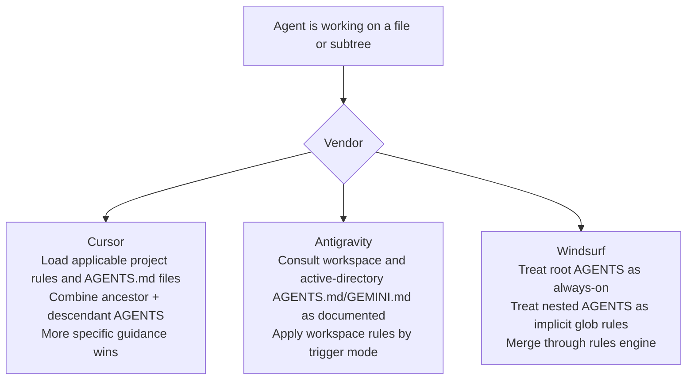

# AGENTS.md and SKILL.md in Cursor, Antigravity, and Windsurf

## Executive summary

This report focuses only on **Cursor, Google Antigravity, and Windsurf** and intentionally avoids re-covering Codex, Claude, Copilot, and Kiro. Across these three vendors, the biggest practical difference is not the existence of `AGENTS.md` or `SKILL.md` themselves, but **how each product resolves path scope, merges nested instructions, and layers vendor-specific rule systems around the open formats**. The open `AGENTS.md` baseline is deliberately schema-free and says the **closest** `AGENTS.md` should win, with explicit user prompts overriding everything. The open Agent Skills baseline is stricter: a skill is a folder containing `SKILL.md`, with required `name` and `description`, plus optional `license`, `compatibility`, `metadata`, and experimental `allowed-tools`. citeturn7view0turn6view0

**Cursor** and **Windsurf** both materially diverge from the published `AGENTS.md` reference by using a **hierarchical merge model** rather than a nearest-file-only model. Cursor says nested `AGENTS.md` files are **combined with parent directories**, with more specific instructions taking precedence. Windsurf says root `AGENTS.md` is treated as an **always-on rule**, while subdirectory `AGENTS.md` files become **implicit glob rules** for that subtree and are processed by the same rules engine as its structured rules system. That means implementers should not assume “nearest file only” behavior on either platform. citeturn15view0turn17view0turn71search0

**Antigravity** is the most fragmented of the three. Its current official docs and migration notes preserve both `AGENTS.md` and legacy `GEMINI.md`, document a migration toward `.agents/` paths, and expose Agent Skills as an open standard. But Google’s own Codelabs also teach a **separate** `.agents/agents.md` + `.agents/skills/*.md` workflow that is not the same thing as the folder-based `SKILL.md` Agent Skills format. In other words, Antigravity currently publishes **two overlapping “skill-like” authoring patterns**: one portable and spec-aligned, and one product-specific and orchestration-oriented. That is the most important “new finding” in this vendor set. citeturn52search0turn52search1turn55search0turn33search0turn31view0turn46view0turn48view0

A terminology note matters here: in all three vendors’ formal skills documentation, the canonical filename is **`SKILL.md` singular**, not `SKILLS.md`. The phrase “skills.md” appears in one official Antigravity Codelab, but there it refers to a higher-level workflow pattern rather than the formal Agent Skills file type. citeturn16view0turn18view0turn46view0turn48view0

## Reference baselines and methodology

For `AGENTS.md`, the relevant baseline is the public `agents.md` specification site. That baseline is intentionally lightweight: `AGENTS.md` is just Markdown, has **no required fields**, and is meant to be a predictable place for agent-facing instructions. On conflict, the **closest `AGENTS.md` to the edited file wins**, and explicit user chat prompts override everything. citeturn7view0

For skills, the baseline is the public Agent Skills specification. Under that reference implementation, a skill is a **directory** with a required `SKILL.md` file; `SKILL.md` must contain YAML frontmatter plus Markdown body content. The reference spec requires `name` and `description`, defines optional `license`, `compatibility`, `metadata`, and experimental `allowed-tools`, recommends optional `scripts/`, `references/`, and `assets/` directories, and uses **progressive disclosure**: only `name` and `description` are loaded at startup, the full body is loaded on activation, and supporting resources are loaded as needed. citeturn6view0

I prioritized official vendor docs, official changelogs/blogs, and official Google Codelabs. Where an official product page was not directly retrievable as page text, I used official search-result snippets from that page and clearly identified any gaps or ambiguities those snippets left unresolved. That matters most for Antigravity, whose public materials are currently spread across product docs, migration notes, and multiple Google Codelabs. citeturn20search2turn24search0turn32search1turn32search7

## Cursor

### Official sources and scope

Cursor’s primary sources are unusually strong for this topic: the official `rules.md` docs, official `skills.md` docs, the CLI docs, the Cursor 2.4 changelog, and the official “dynamic context discovery” blog post. Together, these sources are enough to reconstruct both the **schema** and the **runtime behavior** Cursor documents for `AGENTS.md` and `SKILL.md`. For one important operational caveat — root-level `AGENTS.md` leakage in multi-root workspaces — the best public source is Cursor’s own official forum, where a team member explicitly acknowledges the behavior as a known issue. citeturn15view0turn16view0turn16view1turn61search1turn72view0turn63view0

### AGENTS.md in Cursor

Cursor documents `AGENTS.md` as a **plain Markdown** alternative to `.cursor/rules` for “straightforward use cases,” explicitly contrasting it with `.mdc` project rules that require frontmatter. It supports `AGENTS.md` at the **project root and in subdirectories**. Critically, Cursor says nested `AGENTS.md` files are **combined with parent directories**, with more specific instructions taking precedence. That is a direct divergence from the open `AGENTS.md` reference, which says the nearest file wins. citeturn15view0turn7view0

Cursor’s official forum clarifies how that documented behavior is meant to work at runtime. A nested file such as `subproject_A/blabla/AGENTS.md` is treated like a rule with an **implicit glob** of `subproject_A/blabla/**`, so it is supposed to enter agent context only when the agent works with files inside that subtree, including files it reads or edits during the conversation. The same thread also states that **root `AGENTS.md` applies to the whole workspace** and that `AGENTS.md` itself does **not** support frontmatter or explicit globs; for more explicit control, Cursor recommends `.cursor/rules/*.mdc` instead. citeturn64view0turn15view0

One important runtime caveat is officially acknowledged: in **multi-root workspaces**, Cursor currently loads the **root-level** `AGENTS.md` from each workspace folder **globally**, without properly scoping that root file to its current directory. Cursor staff say nested non-root `AGENTS.md` files work correctly, but root files can “leak” across repositories in the same multi-root workspace. That means the documented hierarchical model is the **intended** behavior, but in one common workspace shape the actual runtime behavior is still imperfect. citeturn63view0

### SKILL.md in Cursor

Cursor’s skills implementation is explicit and richer than the neutral Agent Skills reference. Cursor automatically discovers skills from **two project-level roots** — `.agents/skills/` and `.cursor/skills/` — and **two user-level roots** — `~/.agents/skills/` and `~/.cursor/skills/`. For compatibility, it also scans other clients’ skill directories, including `.claude/skills/`, `.codex/skills/`, and their home-directory equivalents. Within each skills root, it recursively discovers any `SKILL.md` it finds. It also supports **nested project subdirectories** containing `.cursor/skills/` or `.agents/skills/`, so monorepos can colocate subtree-specific skills with the code they govern. citeturn16view0

Cursor’s documented `SKILL.md` frontmatter fields are:

| Field | Required in Cursor docs | Cursor-documented meaning | Evidence |
|---|---|---|---|
| `name` | Yes | Lowercase letters, numbers, hyphens only; must match parent folder name | citeturn16view0 |
| `description` | Yes | What the skill does and when to use it; used for relevance decisions | citeturn16view0 |
| `paths` | No | Glob patterns that scope the skill to matching files; can be comma-separated string or list | citeturn16view0 |
| `disable-model-invocation` | No | When `true`, skill is only available by explicit manual invocation via `/skill-name` | citeturn16view0 |
| `metadata` | No | Arbitrary key-value mapping | citeturn16view0 |
| `globs` | Legacy fallback | Accepted for older skills, but new skills should use `paths` | citeturn16view0 |

Two details matter here. First, Cursor adds **vendor-specific control fields** — especially `paths` and `disable-model-invocation` — that are not in the neutral Agent Skills reference. Second, Cursor’s docs do **not** document the reference spec’s `license`, `compatibility`, or experimental `allowed-tools` fields, even though the reference spec supports them. That means Cursor is not merely “implementing the spec”; it is implementing a **Cursor-shaped subset plus extensions**. citeturn16view0turn6view0

Cursor also documents the runtime model behind skills more explicitly than most vendors. Skills are part of Cursor’s “dynamic context discovery” strategy: the agent initially gets a lightweight catalog that includes a skill’s **name and description** as static context, then uses tools such as **grep** and Cursor’s **semantic search** to pull in relevant full skill content only when needed. That design explains why Cursor encourages moving “dynamic rules” and slash commands into skills: in Cursor 2.4, the editor and CLI both gained Agent Skills support, and Cursor introduced a built-in `/migrate-to-skills` helper to convert eligible rules and commands into skills. citeturn72view0turn61search1turn16view0

### Deviations and recommended implementation guidance

Cursor’s biggest deviation from the public `AGENTS.md` baseline is its **merge model** for nested `AGENTS.md`. Instead of nearest-file-only resolution, Cursor combines ancestor and descendant instructions and lets more specific instructions win on conflict. Its biggest deviation from the vanilla Agent Skills baseline is the addition of **`paths`** and **`disable-model-invocation`**, which push more scoping and trigger logic into frontmatter. citeturn15view0turn16view0turn7view0turn6view0

For implementation, the safest Cursor pattern is a **thin root `AGENTS.md`** with only repository-wide constraints, plus **nested leaf `AGENTS.md` files** for package- or subsystem-specific conventions. For skills, prefer `.agents/skills/` if cross-client portability matters, use `paths` instead of legacy `globs`, and set `disable-model-invocation: true` for operations with side effects such as deployment or external messaging. In multi-root workspaces, if strict scope isolation matters today, use `.cursor/rules/*.mdc` with explicit globs rather than relying on root `AGENTS.md` behavior until Cursor’s acknowledged bug is fixed. citeturn64view0turn16view0turn63view0

## Antigravity

### Official sources and scope

Antigravity is the hardest of the three to document rigorously because its public guidance is spread across **official product docs**, **official migration notes**, **official best-practices pages**, and several **official Google Codelabs** that do not always use the same file layout examples. The strongest sources for this report are the Antigravity docs snippets surfaced by search, the official Gemini-CLI migration page, and three official Codelabs: one on authoring Antigravity skills, one on using Agent Skills with Antigravity CLI, and one on autonomous pipelines using `agents.md` and `skills.md`. citeturn20search2turn24search0turn52search0turn31view0turn46view0turn48view0

### AGENTS.md in Antigravity

Antigravity officially preserves both **`AGENTS.md`** and legacy **`GEMINI.md`** as context files. The official migration guide says Antigravity CLI supports the same context files as Gemini CLI: at **workspace context** level it reads both `GEMINI.md` and `AGENTS.md` from the **active workspace directory**, while at **workspace local context** level it continues to parse and enforce rule constraints from the **active directory’s** `GEMINI.md` and `AGENTS.md` files. The same migration guide also says the agent still automatically consults **global developer context** in `~/.gemini/GEMINI.md`. The official CLI best-practices page recommends creating a `GEMINI.md` **or** `AGENTS.md` at the workspace root to capture codebase-specific standards, styles, test commands, and deprecation guidance. citeturn52search0turn53search0turn52search1turn40search2

That dual-file support is itself a meaningful deviation from the open `AGENTS.md` reference. Cursor and Windsurf center `AGENTS.md` as the agent-facing Markdown file, but Antigravity explicitly keeps **`GEMINI.md` compatibility** alive. In practical terms, that means Antigravity’s `AGENTS.md` story is partly a standards adoption story and partly a **legacy migration story**. citeturn52search0turn52search1turn7view0

The accessible Antigravity sources I found do **not** publish an equally clear parent/child merge algorithm for nested `AGENTS.md` files comparable to Cursor or Windsurf. The product guidance I could retrieve talks about **workspace-root** and **active-directory** context, not a documented “nearest wins” or “merge ancestor chain” rule. That is a real documentation gap: Antigravity clearly supports `AGENTS.md`, but its public materials are less explicit about path hierarchy semantics than the other two vendors. citeturn52search0turn53search0turn40search2

### SKILL.md in Antigravity

Antigravity’s current public docs position skills as an **open standard** and describe them with a progressive-disclosure model: the agent first sees a skill inventory, then loads full instructions only when a skill is relevant. The current search-exposed docs also say Antigravity now defaults to **`.agents/skills`**, while maintaining backward support for **`.agent/skills`**. Another official docs snippet says **global skills** live under `~/.gemini/config/skills/<skill-folder>/`, and the current searchable skill-field snippet says `name` is **not required**, defaults to the **folder name**, and `description` **is required**. That is a direct deviation from the neutral Agent Skills reference, which requires `name`. citeturn40search1turn36search0turn33search0turn66search0turn34search0turn6view0

Antigravity’s own official Codelabs confirm that path churn. An April 2026 Codelab on authoring Antigravity skills teaches **workspace** skills in `<workspace-root>/.agent/skills/` and **global** skills in `~/.gemini/antigravity/skills/`. The same Codelab explicitly says `name` is **not mandatory** and defaults to the directory name, while describing the familiar skill directory layout with `SKILL.md`, optional `scripts/`, `references/`, and `assets/`. A newer June 2026 Codelab for Antigravity CLI instead teaches local skills in **`.agents/skills/my-favorite-things/SKILL.md`** and shows the CLI `/skills` command listing available skills. The official Gemini-CLI migration page adds another transition rule: if a project still has custom workspace skills under `.gemini/skills/`, users must **rename or relocate** them into `.agents/skills/`. citeturn31view0turn46view0turn55search0

The accessible official sources do **not** give a clean, current, directly retrievable field table equivalent to Cursor’s. In the official snippets I could verify, only **`name`** and **`description`** are explicitly surfaced. I did **not** find equally strong accessible primary-source confirmation for Antigravity support of Cursor-style `paths`, `disable-model-invocation`, or `metadata`, even though the broader Agent Skills ecosystem supports related constructs. For a rigorous implementation, that means those fields should be treated as **unverified in Antigravity’s current public docs** unless tested in a live environment. citeturn34search0turn31view0turn46view0

### The major Antigravity documentation inconsistency

The most consequential Antigravity finding is that Google currently publishes **two conceptually different “skills” patterns**.

The first pattern is the portable, spec-aligned one: folder-per-skill, `SKILL.md`, optional support files, progressive disclosure, and `.agents/skills`-style discovery. That pattern appears in the Antigravity docs snippets and the Agent Skills Codelabs. citeturn40search1turn33search0turn31view0turn46view0

The second pattern appears in Google’s May 2026 Codelab on “autonomous developer pipelines.” That Codelab tells users to create **`.agents/agents.md`** for team personas and **plain `.md` files** under **`.agents/skills/`** such as `write_specs.md`, `generate_code.md`, and `deploy_cloud_run.md`. Those files act as orchestrated workflow modules consumed by a custom `/startcycle` workflow, not as folder-based Agent Skills with canonical `SKILL.md` files. In other words, this Codelab uses “agents.md” and “skills.md” as a **product-native automation recipe**, not as the open `AGENTS.md` and `SKILL.md` standards. citeturn48view0

For an implementer, that distinction is crucial. If your goal is **portability** across vendors, the `.agents/agents.md` + `.agents/skills/*.md` Codelab pattern is the wrong model. If your goal is a **zero-code Antigravity-native pipeline**, that Codelab may be useful — but it should not be mistaken for Antigravity’s canonical `SKILL.md` specification. citeturn48view0turn46view0turn31view0

### Deviations and recommended implementation guidance

Antigravity deviates from the neutral baselines in three ways. First, it keeps **`GEMINI.md`** alive alongside `AGENTS.md`. Second, its accessible current docs and official Codelabs show **path evolution** across `.gemini/skills`, `.agent/skills`, and `.agents/skills`, plus differing examples for global skill paths. Third, its official materials blur together **portable Agent Skills** and **Antigravity-specific orchestration files**. citeturn52search0turn52search1turn33search0turn66search0turn31view0turn48view0

The implementation advice here is therefore conservative. If you want a portable skill, use the **folder-based `SKILL.md` model under `.agents/skills/`**, keep frontmatter to the smallest common denominator that Antigravity explicitly documents (`description`, and `name` if you want deterministic cross-tool identity), and treat older `.agent/skills` and `.gemini/skills` locations as migration baggage rather than the primary target. For repo-level instruction files, use **one sparse root `AGENTS.md` or `GEMINI.md`** for broad workspace context, and do not assume nested override semantics beyond what the accessible docs explicitly state. Finally, do not mix the Google Codelab’s `.agents/agents.md` and `.agents/skills/*.md` workflow pattern into a portability layer unless you are deliberately building an Antigravity-only orchestration system. citeturn40search2turn55search0turn46view0turn48view0

## Windsurf

### Official sources and scope

Windsurf’s documentation is now effectively **Devin Desktop** documentation; official Windsurf docs pages redirect into `docs.devin.ai`, and the product docs themselves openly describe the IDE as “Devin Desktop.” That matters because the product is in the middle of a branding and path migration: the **rules system** now prefers `.devin/`, while the **skills** system still prominently uses `.windsurf/skills` and `~/.codeium/windsurf/...`. For this topic, the key sources are the official `AGENTS.md` page, the official `Skills` page, the official `Memories & Rules` page, and the official Devin Local page. citeturn17view0turn60search16turn71search0turn60search4

### AGENTS.md in Windsurf

Windsurf documents `AGENTS.md` as a directory-scoped instruction file that plugs into the **same rules engine** as `.devin/rules/` and legacy `.windsurf/rules/`, but with the trigger inferred from file location instead of frontmatter. The runtime behavior is unusually explicit: a root-level `AGENTS.md` is treated as an **always-on** rule whose full content is included in the system prompt on every message, while a subdirectory `AGENTS.md` is treated as a **glob rule** whose auto-generated pattern is `<directory>/**`. Windsurf also recognizes both `AGENTS.md` and `agents.md`. citeturn17view0turn71search0

Discovery is also broader than Cursor’s. Windsurf says it automatically discovers `AGENTS.md` files throughout the **workspace and subdirectories**, and for Git repositories it also searches **parent directories up to the Git root**. Its docs explicitly say that multiple `AGENTS.md` files can exist at different levels and provide increasingly specific guidance, and its best-practices guidance says not to repeat global instructions in subdirectory files because subdirectories **inherit from parent directories**. This is a clear hierarchical merge model, not a nearest-file-only model. citeturn17view0turn71search0

This makes Windsurf’s `AGENTS.md` implementation conceptually closer to “syntactic sugar for structured rules” than to a minimal open-standard file. The system is very convenient, but it is also quite opinionated: `AGENTS.md` is not just read; it is transformed into specific rule-engine semantics. citeturn17view0turn71search0

### SKILL.md in Windsurf

Windsurf’s skills documentation says skills help Cascade with complex multi-step tasks and use **progressive disclosure**: only the skill’s `name` and `description` are shown to the model by default, and the full `SKILL.md` plus supporting files are loaded only when Cascade invokes the skill or when the user explicitly `@mentions` it. The documented manual invocation syntax is therefore **`@skill-name`**, not Cursor’s slash-invocation style. citeturn17view1turn18view0

The documented skill roots are:

| Scope | Location | Notes | Evidence |
|---|---|---|---|
| Workspace | `.windsurf/skills/<skill-name>/` | Project-specific; committed with repo | citeturn18view0 |
| Global | `~/.codeium/windsurf/skills/<skill-name>/` | Available across all workspaces on the machine | citeturn18view0 |
| System | OS-specific directories such as `/etc/windsurf/skills/` | Enterprise deployment; read-only to end users | citeturn18view0 |
| Cross-agent compatibility | `.agents/skills/`, `~/.agents/skills/`, and optionally `.claude/skills/` if config reading is enabled | Shared skill discovery across ecosystems | citeturn18view0 |

Unlike Cursor, Windsurf’s vendor page only explicitly documents **two required frontmatter fields**: `name` and `description`. It gives naming rules for `name` — lowercase letters, numbers, and hyphens — and explains `description` as the part shown to the model for activation decisions. The page points users to `agentskills.io` for more details on the specification, but on the Windsurf page itself I found no explicit documentation for optional fields such as `paths`, `metadata`, `compatibility`, or `disable-model-invocation`. In practice, that means Windsurf publicly documents only the **portable core**, not a large vendor extension surface. citeturn18view0turn6view0

One additional new finding is that Windsurf’s newer **Devin Local** agent uses the **same skills format and discovery mechanism** as Devin CLI. That implies the Windsurf/Devin skill story is being standardized across local IDE and CLI surfaces, even while the surrounding product naming and rules directories are still migrating. citeturn60search4

### Rules migration and override behavior

Windsurf’s override story is unusually clear at the rules-engine layer. The `Memories & Rules` docs say `.devin/rules` is now the **preferred** workspace rules location and takes precedence over legacy `.windsurf/rules`. They also say system-level rules are **merged** with workspace and global rules **without overriding user-defined rules**. AGENTS-derived rules sit inside that same engine: root-level `AGENTS.md` becomes always-on, and subdirectory `AGENTS.md` becomes an auto-glob rule for that directory. citeturn71search0

The product therefore has two simultaneous migrations underway. The first is a **brand migration** from Windsurf to Devin Desktop. The second is a **rules-path migration** from `.windsurf/rules` to `.devin/rules`. But the skills paths themselves still carry the older Windsurf and Codeium names. That asymmetry is important for implementers, because it means a “search and replace everything to `.devin/`” migration would be wrong. citeturn71search0turn18view0turn60search16

### Deviations and recommended implementation guidance

Windsurf’s biggest deviation from the open `AGENTS.md` baseline is again the **merge model**. Its biggest architectural distinction is that `AGENTS.md` is explicitly **compiled into the rules engine**, rather than merely read as a standalone nearest-file text artifact. On skills, Windsurf stays closer to the neutral spec than Cursor does, but it publicly documents a smaller subset of the optional field surface and adds a broader set of **discovery roots**, including system and cross-agent scopes. citeturn17view0turn18view0turn71search0turn6view0

The safest implementation pattern in Windsurf is a **small root `AGENTS.md`** for truly repo-wide behavior, with nested subdirectory `AGENTS.md` files for increasingly specific conventions, written under the assumption that they **inherit** parents. Use structured rules under `.devin/rules` when you need explicit activation modes or tighter administrative control. For skills, use `.windsurf/skills` for repo-shared functionality, keep names globally unique because duplicate-name precedence is not documented, and use `.agents/skills` only when cross-tool reuse is a deliberate goal. citeturn17view0turn18view0turn71search0

## Cross-vendor comparison and implementation guidance

### AGENTS.md comparison

| Vendor | Official AGENTS artifact | Placement and discovery | Merge and override behavior | Main deviation from AGENTS reference | Evidence |
|---|---|---|---|---|---|
| Cursor | Plain `AGENTS.md` as a simple alternative to `.cursor/rules` | Project root and subdirectories inside the project | Nested `AGENTS.md` files are **combined with parent directories**; more specific instructions take precedence; nested files behave like implicit subtree globs in practice | Deviates from nearest-file-only reference by using **hierarchical merge** | citeturn15view0turn64view0turn7view0 |
| Antigravity | `AGENTS.md`, but also legacy `GEMINI.md` remains first-class | Docs and migration notes emphasize active workspace directory and active directory; best-practices page recommends workspace-root `AGENTS.md` or `GEMINI.md` | Accessible public docs do not clearly publish a parent/child merge rule comparable to Cursor or Windsurf | Adds **dual-file legacy compatibility** and leaves nested-path semantics comparatively under-documented | citeturn52search0turn53search0turn52search1turn40search2 |
| Windsurf | Plain `AGENTS.md` or `agents.md`, compiled into the rules engine | Any directory in the workspace; scans subdirectories and parent directories up to Git root; case-insensitive filename support | Root = always-on rule; subdirectory = implicit glob rule for `<dir>/**`; child files inherit parent guidance | Deviates from nearest-file-only reference by using **rules-engine hierarchical merge** | citeturn17view0turn71search0turn7view0 |

The key implementation consequence is simple: if you want one `AGENTS.md` strategy that behaves predictably across all three, write a **minimal root file** and put specific instructions into nested directory files — but do **not** assume nearest-file-only semantics on Cursor or Windsurf, and do **not** assume Antigravity has fully documented the same hierarchy. citeturn15view0turn17view0turn52search0turn53search0

### SKILL.md schema comparison

| Vendor | Discovery roots | Vendor-documented fields | Required vs optional | Defaults and aliases | Notable deviation or gap | Evidence |
|---|---|---|---|---|---|---|
| Cursor | `.agents/skills`, `.cursor/skills`, `~/.agents/skills`, `~/.cursor/skills`, plus compatibility roots | `name`, `description`, `paths`, `disable-model-invocation`, `metadata`, legacy `globs` fallback | `name` and `description` required; the rest optional | `globs` accepted for older skills; Cursor 2.4 adds migration tooling | Extends the reference spec with Cursor-specific controls; docs do not explicitly surface reference fields like `license`, `compatibility`, `allowed-tools` | citeturn16view0turn61search1turn6view0 |
| Antigravity | Current docs: `.agents/skills` preferred, `.agent/skills` backward support; current snippet also shows global `~/.gemini/config/skills/<skill-folder>`; older official Codelab used `~/.gemini/antigravity/skills/` | Accessible official snippets clearly expose `name` and `description`; official Codelab also describes folder-per-skill `SKILL.md` with optional `scripts/`, `references/`, `assets/` | `description` clearly required; `name` documented as optional and defaulting to folder name | `.gemini/skills` must be migrated to `.agents/skills`; older `.agent/skills` still supported | Directly diverges from reference spec by making `name` optional; current public docs are fragmented and do not clearly expose the full optional field surface | citeturn33search0turn34search0turn66search0turn31view0turn55search0turn6view0 |
| Windsurf | `.windsurf/skills`, `~/.codeium/windsurf/skills`, enterprise system paths, plus `.agents/skills` compatibility roots | `name` and `description` are the only fields explicitly documented on the vendor page | Both documented as required on the vendor page | Cross-agent discovery also scans `.agents/skills`; optional `.claude/skills` scanning if enabled | Public vendor docs expose only the portable core and point users to the broader Agent Skills spec for details | citeturn18view0turn17view1turn6view0 |

The safest cross-vendor `SKILL.md` subset is therefore: **folder-per-skill**, **explicit `name`**, **explicit `description`**, a concise Markdown body, and optional `scripts/`, `references/`, and `assets/`. If you need path scoping, prefer **directory placement** over frontmatter, because that is well documented in Cursor and Windsurf and less ambiguous in Antigravity than relying on optional fields whose support is not clearly published. citeturn16view0turn18view0turn31view0turn46view0

### Path priority and override strategies

| Vendor | Documented priority or merge order | Path-scoped behavior | What is still undocumented | Evidence |
|---|---|---|---|---|
| Cursor | Team Rules → Project Rules → User Rules; AGENTS behaves like project-scoped rules in practice | Root `AGENTS.md` applies workspace-wide; nested `AGENTS.md` scopes to subtree and merges with ancestors; nested skills inside project subdirs scope to that subtree | Official docs do not clearly publish duplicate-skill-name precedence across multiple roots; root AGENTS in multi-root workspaces currently have a known scoping bug | citeturn15view0turn16view0turn64view0turn63view0 |
| Antigravity | Global developer context in `~/.gemini/GEMINI.md`; workspace rules in `.agents/rules`; active workspace and active directory both parse `AGENTS.md`/`GEMINI.md`; rule triggers include always-on, model-decision, glob, manual | Skills now prefer `.agents/skills`; rules now prefer `.agents/rules`; legacy `.agent/` and `.gemini/skills` paths remain part of migration story | Explicit conflict-resolution order across global rules, workspace rules, `AGENTS.md`, and `GEMINI.md` is not clearly published in the accessible official docs used here | citeturn52search1turn52search0turn53search0turn24search0turn44search0turn58search0turn55search0 |
| Windsurf | `.devin/rules` preferred over `.windsurf/rules`; system rules merge with workspace and global rules without overriding user-defined rules; `AGENTS.md` is processed by the same rules engine | Root `AGENTS.md` = always-on; subdir `AGENTS.md` = implicit glob; skills discovered at workspace/global/system plus compatibility roots | Duplicate-skill precedence and conflict handling across overlapping skill roots are not explicitly documented | citeturn71search0turn18view0 |

The following abstraction matches the documented path-resolution behavior across the three vendors: Cursor and Windsurf merge a path hierarchy, while the accessible Antigravity docs expose workspace/active-directory contexts but do not publish an equally explicit ancestor-chain merge rule. citeturn15view0turn17view0turn52search0turn53search0



The skills-loading flow is more similar across the three, although Cursor and Windsurf publish the runtime model more explicitly than Antigravity does. Cursor and Windsurf both clearly document progressive disclosure, and Antigravity’s public materials also describe skills as on-demand capability modules rather than always-on prompt text. citeturn72view0turn17view1turn36search0turn31view0

```mermaid
flowchart LR
    A[Scan skill roots] --> B[Build lightweight catalog]
    B --> C[name + description visible to model]
    C --> D{Task matches?}
    D -->|Yes| E[Load full SKILL.md]
    E --> F[Load scripts / references / assets as needed]
    D -->|Manual path| G[/skill-name or @skill-name depending vendor]
```

### Concise implementation guidance

If the goal is **maximum portability across Cursor, Antigravity, and Windsurf**, the most robust approach is to treat `AGENTS.md` and `SKILL.md` as **lowest-common-denominator artifacts**.

For `AGENTS.md`, keep the root file short and universal, then add nested files only where directory-specific guidance is truly needed. Do not encode assumptions that depend on nearest-file-only semantics, because Cursor and Windsurf both document hierarchical merge behavior instead. If you need explicit globbing, enable/disable controls, or stronger isolation, step up to the vendor’s structured rules format rather than trying to stretch `AGENTS.md` past what the platform documents. citeturn15view0turn17view0turn71search0

For skills, use the **portable folder layout** from the Agent Skills reference: one folder per skill, a canonical `SKILL.md`, explicit `name`, explicit `description`, optional `scripts/`, `references/`, and `assets/`, and no dependence on vendor-only fields unless you are targeting that vendor specifically. In practice, that means `paths` and `disable-model-invocation` are useful for Cursor-targeted skills, but not a safe baseline for all three vendors. citeturn6view0turn16view0turn18view0turn31view0

For **Antigravity specifically**, separate two mental models. Use **`SKILL.md` folder-based skills** when you want a portable, standards-oriented skill. Use **`.agents/agents.md` plus `.agents/skills/*.md`** only when you intentionally want the specific Antigravity Codelab-style orchestration pattern. Those are not the same artifact family, and treating them as interchangeable will create needless design confusion and portability problems. citeturn46view0turn48view0turn31view0