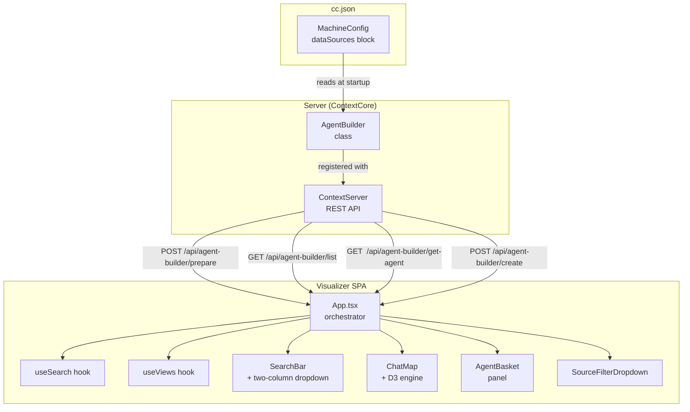
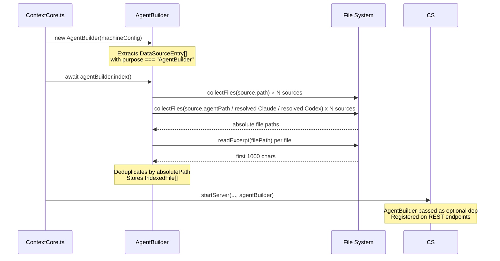
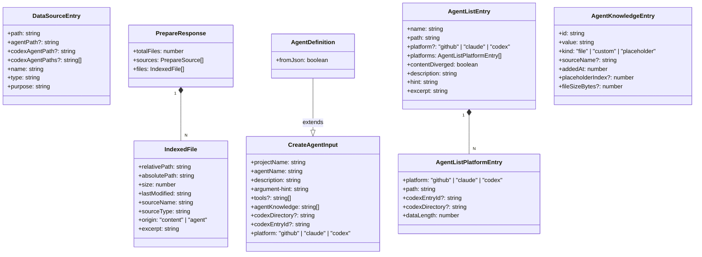
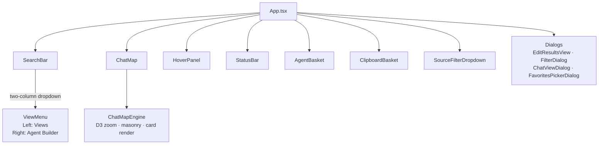
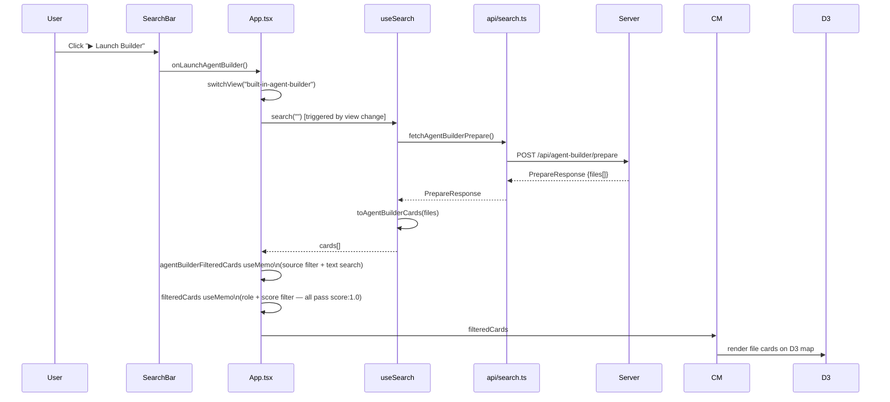
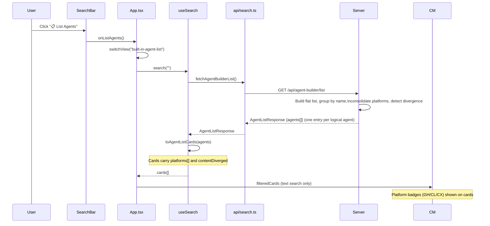
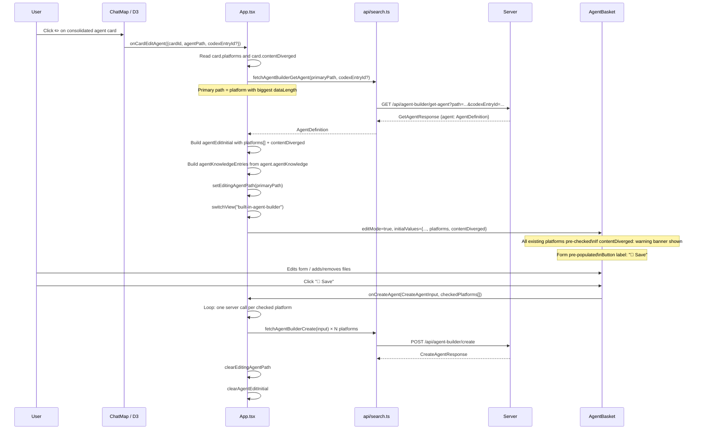
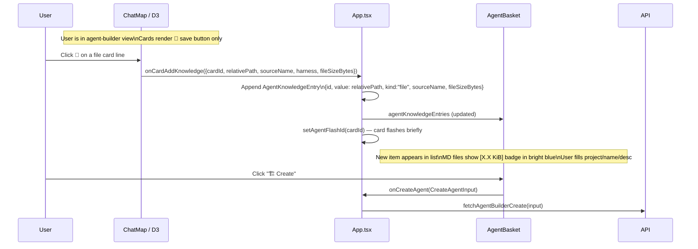
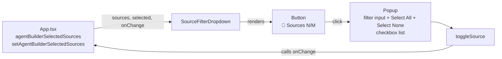

# Agent Builder UI — Architectural Review

**Date**: 2026-04-10
**Status**: Current (reflects r2uab Phase 1–4 — all fully implemented, including post-launch UI/Layout polish + knowledge entry UX improvements)
**Scope**: End-to-end architecture of the Agent Builder feature: server indexing, REST API, visualizer data flow, UI components, card rendering, edit flow.

---

## 1. Purpose & Context

The Agent Builder is a full-stack feature that lets a user **curate knowledge files into an AI agent definition** directly from the visualizer UI. The goal is to compose platform-specific agent files (GitHub `.agent.md`, Claude `.md`, Codex `AGENTS.md`) from first-class UI within the Context Core visualizer.

The system spans two tiers:

| Tier                                                                          | Role                                                                                                                        |
| ----------------------------------------------------------------------------- | --------------------------------------------------------------------------------------------------------------------------- |
| **Server** (`AgentBuilder.ts` + REST endpoints)                               | Scans configured directories, maintains an in-memory file index, writes GitHub/Claude/Codex agent artifacts + JSON companions, lists/retrieves agents |
| **Visualizer** (`App.tsx`, `useSearch`, `useViews`, `AgentBasket`, D3 engine) | Presents indexed files as D3 cards, lets the user drag knowledge into a basket, fills a form, submits to the server         |

---

## 2. System Overview



---

## 3. Server Architecture

### 3.1 Configuration: `dataSources` in `cc.json`

Each `MachineConfig` may carry an optional `dataSources` map. Each entry with `purpose: "AgentBuilder"` is picked up by the `AgentBuilder` class.

```jsonc
// cc.json (excerpt)
{
  "machine": "MYBOX",
  "harnesses": { ... },
  "dataSources": {
    "zz-reach2": [
      {
        "name": "Context Core Server",
        "type": "architecture",
        "purpose": "AgentBuilder",
        "path": "D:/Codez/.../server/zz-reach2",
        "agentPath": "D:/Codez/.../.github/agents"
      }
    ]
  }
}
```

Key fields on `DataSourceEntry`:

| Field       | Purpose                                                                                            |
| ----------- | -------------------------------------------------------------------------------------------------- |
| `path`      | Root of **content** files to index (recursively scanned)                                           |
| `agentPath` | GitHub output directory (`.agent.md`, `.agent.json`)                                               |
| `claudeAgentPath` | Claude output directory (`.md`, `.json` under `.claude/agents`)                             |
| `codexAgentPath` | Legacy single Codex output directory (`AGENTS.md`, `AGENTS.json`)                           |
| `codexAgentPaths` | Preferred Codex directory list used by UI directory picker and API validation               |
| `name`      | Label used as `sourceName` on every `IndexedFile` and as the `projectName` in `CreateAgentInput`   |
| `type`      | Informational string (e.g. `"architecture"`) surfaced in card metadata                             |
| `purpose`   | Must be `"AgentBuilder"` to be included; other purposes are ignored                                |

### 3.2 `AgentBuilder` Class — Lifecycle



The `AgentBuilder` is **stateful in-memory** — it holds the indexed file list for the process lifetime and updates it live when `create()` is called (no re-scan needed).

### 3.3 REST API Endpoints

All endpoints live on `ContextServer` (Express). They each guard against `agentBuilder` being undefined (no `dataSources` configured) and return HTTP 404 in that case.

```mermaid
graph LR
    subgraph "POST /api/agent-builder/prepare"
        P1[optional body: name?] --> P2[agentBuilder.prepare\nfilterName?]
        P2 --> P3[PrepareResponse\ntotalFiles · sources[] · files[]]
    end

    subgraph "POST /api/agent-builder/create"
        C1[CreateAgentInput\nprojectName agentName\ndescription hint\ntools[] agentKnowledge[]\n+ codexDirectory? codexEntryId?] --> C2[agentBuilder.create]
        C2 --> C3[writes platform markdown\n+ companion JSON]
        C3 --> C4[updates in-memory index]
        C4 --> C5[CreateAgentResponse\ncreated · path · agentName]
    end

    subgraph "GET /api/agent-builder/list"
        L1[no params] --> L2[agentBuilder.list\nreads GitHub/Claude/Codex agent entries]
        L2 --> L3[AgentListResponse\ntotalAgents · agents[]]
    end

    subgraph "GET /api/agent-builder/get-agent"
        G1[?path=absPath&codexEntryId?] --> G2[agentBuilder.getAgent\nreads companion JSON or parses markdown]
        G2 --> G3[GetAgentResponse\nagent: AgentDefinition]
    end
```

**Error status codes from `agentBuilder.create()`:**

| Code | Trigger                                                         |
| ---- | --------------------------------------------------------------- |
| 400  | Validation failure / invalid platform / missing required output path (including Codex directory or entry id requirements) |
| 404  | No `dataSources` configured / `projectName` not found           |
| 500  | Unexpected server-side file I/O or parse errors                 |

### 3.4 `AgentBuilder` Internal Methods

| Method           | Description                                                                                                                         |
| ---------------- | ----------------------------------------------------------------------------------------------------------------------------------- |
| `index()`        | Async; full recursive scan of all sources; deduplicates by abs path; reads excerpts                                                 |
| `prepare(name?)` | Returns `PrepareResponse`; optional `name` filter restricts to one source                                                           |
| `create(input)`  | Writes platform markdown (GitHub/Claude/Codex) and companion JSON; immediately updates `indexedFiles[]`                             |
| `list()`         | Groups all agent entries by name across platforms (GitHub/Claude/Codex); picks the richest as primary; detects content divergence; returns one consolidated `AgentListEntry` per logical agent |
| `getAgent(path, codexEntryId?)` | Reads one logical agent; Codex collections require `codexEntryId` when multiple entries share one AGENTS file |

**Example GitHub markdown format written by `create()`:**

```markdown
---
name: my-agent
description: Does X
argument-hint: A task to perform
tools: ['read_file', 'grep_search']
---

To get context for your task, you MUST read the following files:

- [path/to/file.md](path/to/file.md)
- [another/file.ts](another/file.ts)
```

---

## 4. Type System

### 4.1 Shared Types (server `agentBuilder/AgentBuilder.ts` & visualizer `types.ts`)



### 4.2 `ViewType` Extensions

```typescript
type ViewType =
  | "search"          // server-side message search
  | "search-threads"  // server-side thread search
  | "latest"          // server-side latest messages
  | "favorites"       // client-side from saved favorites
  | "agent-builder"   // file cards from /prepare — build mode
  | "agent-list";     // agent cards from /list   — browse+edit mode
```

### 4.3 `CardRenderMode` (internal to `chatMapEngine.ts`)

```typescript
type CardRenderMode = "default" | "agent-builder" | "agent-list";
```

Controls which action buttons appear on each card line (see §7).

---

## 5. Visualizer Architecture

### 5.1 Component Hierarchy



### 5.2 State Ownership in `App.tsx`

| State                         | Type                     | Purpose                                                     |
| ----------------------------- | ------------------------ | ----------------------------------------------------------- |
| `agentBuilderSources`         | `{ name; fileCount; codexDirectories?; codexDefaultDirectory? }[]`  | Populated on mount from `/prepare`; drives Source + Codex Directory pickers |
| `agentBuilderSelectedSources` | `Set<string>`            | Which sources are active in the filter dropdown; persisted to localStorage `"cxc-agent-sources"`; empty = **none selected** |
| `agentKnowledgeEntries`       | `AgentKnowledgeEntry[]`  | Files/text added to basket                                  |
| `isCreatingAgent`             | `boolean`                | Submission in-flight flag                                   |
| `agentCreateError/Success`    | `string \| null`         | Status feedback from last create                            |
| `agentFlashId`                | `string \| null`         | Card ID to flash briefly after add-to-basket                |
| `editingAgentPath`            | `string \| null`         | null = create mode; a path = edit mode                      |
| `editingCodexEntryId`         | `string \| null`         | Tracks which logical Codex entry is being edited within one AGENTS file |
| `agentEditInitial`            | `{projectName, agentName, description, hint, tools, codexDirectory?, platform?, platforms?, contentDiverged?} \| null` | Pre-fill values when editing an existing agent; `platforms[]` carries all platform variants for the consolidated agent; `contentDiverged` triggers the warning banner |

### 5.3 Data Flow — Agent Builder View



### 5.4 Data Flow — Agent List View



### 5.5 Data Flow — Agent Edit



### 5.6 Data Flow — Knowledge File → AgentBasket



---

## 6. View Switching & the Two-Column Dropdown

### 6.1 Dropdown Layout

The `SearchBar` dropdown was extended to a two-column grid layout. The left column retains the classic view list; the right column is the Agent Builder panel.

```
┌────────────────────────────────────────────────────────┐
│  VIEWS                        │  AGENT BUILDER          │
│  ─────────────────────────    │  ──────────────────     │
│  Built-in                     │                         │
│   🕒  Latest Threads          │   ▶  Launch Builder     │
│   🔎  Search Messages         │   📋 List Agents        │
│   🧵  Search Threads          │                         │
│   ⭐  Favorites               │                         │
│                               │                         │
│  Favorites                    │                         │
│   ...user views...            │                         │
│                               │                         │
│  Searches                     │                         │
│   ...user views...            │                         │
└────────────────────────────────────────────────────────┘
```

CSS: `.view-menu` uses `display: grid; grid-template-columns: 1fr 1fr`. Max-width increased to `560px`. A vertical divider separates the columns.

### 6.2 Toolbar State Gating per View Type

| Control                | `agent-builder`                      | `agent-list`                   | other views |
| ---------------------- | ------------------------------------ | ------------------------------ | ----------- |
| Search textbox         | ✅ enabled (client-side filter)       | ✅ enabled (client-side filter) | ✅ (varies)  |
| Search button / Enter  | ✅ (sets filter text, no server call) | ✅ (same)                       | normal      |
| ✏️ Edit view button     | ❌ disabled                           | ❌ disabled                     | ✅           |
| Filter button          | ❌ disabled                           | ❌ disabled                     | ✅           |
| `SourceFilterDropdown` | ✅ visible                            | ❌ hidden                       | ❌ hidden    |

---

## 7. D3 Card Rendering

### 7.1 Harness Color Palette (Extensions)

| Harness label | Color            | Used for                                                          |
| ------------- | ---------------- | ----------------------------------------------------------------- |
| `AgentFile`   | `#f97316` orange | Files from `origin: "agent"` sources (GitHub/Claude/Codex markdown + JSON companions) |
| `ContentFile` | `#06b6d4` cyan   | Files from `origin: "content"` sources (docs, markdown, code)     |
| `AgentCard`   | `#f97316` orange | Agent cards in agent-list view                                    |

### 7.2 `CardRenderMode` Button Matrix

The `renderCardHtml` function receives a `CardRenderMode` that controls per-line action buttons:

| Button                         | `"default"`          | `"agent-builder"`          | `"agent-list"`                  |
| ------------------------------ | -------------------- | -------------------------- | ------------------------------- |
| 💾 Save / add-knowledge         | ✅ (add to clipboard) | ✅ (add to agent knowledge) | ❌                               |
| ☆ Star                         | ✅                    | ❌                          | ❌                               |
| 📋 Copy                         | ✅                    | ❌                          | ❌                               |
| 📧 Envelope                     | ✅                    | ❌                          | ❌                               |
| ✏️ Edit agent (`card-edit-btn`) | ❌                    | ❌                          | ✅ (placed at card header level) |

### 7.3 LOD (Level of Detail) Mapping for File Cards

Cards in agent-builder view exploit the existing LOD zoom system to show progressive file content:

| Zoom Level            | LOD     | Field rendered   | Content                               |
| --------------------- | ------- | ---------------- | ------------------------------------- |
| < 0.7×                | minimal | title only       | filename                              |
| 0.7–1.2×              | summary | `excerptShort`   | relative path                         |
| 1.2–2.5×              | medium  | `excerptMedium`  | `sourceName · sourceType · size`      |
| ≥ 2.5×                | full    | `excerptLong`    | First ~1000 chars from server excerpt |
| Card flip / high zoom | detail  | `source.message` | Same excerpt (full card body)         |

### 7.4 Card Render Mode Switching

`ChatMapEngine` holds `config.cardRenderMode`. The engine watches for mode changes in `updateCards()` — if the mode changed, it force-re-renders all card HTML without repositioning. `App.tsx` calls `engine.setCardRenderMode()` whenever `activeView.type` changes:

```
activeView.type === "agent-builder"  →  mode = "agent-builder"
activeView.type === "agent-list"     →  mode = "agent-list"
otherwise                            →  mode = "default"
```

### 7.5 Map Layout & Zoom Strategy (Force Square)

By default, the D3 engine (`computeGridLayout`) creates a masonry grid dynamically bounded by the container's physical width. In standard views, this creates manageable vertical lists spanning a few columns. However, in `agent-builder` mode, where hundreds or thousands of file cards are fetched at once, this caused an unnavigable "infinite vertical scroll" stuck to minimal width.

To fix this, when `config.cardRenderMode === "agent-builder"`, the layout switches to a **force square** algorithm (`Math.ceil(Math.sqrt(cards.length))`). This expands the number of columns to create a roughly proportional square grid regardless of the window bounds. Coupled with the engine's `zoomToFit` logic, this lays out all knowledge files into a massive pseudo-spatial 2D map that the user can seamlessly zoom out from and pan across.

---

## 8. Client-Side Filtering Pipeline

For agent-builder and agent-list views, filtering is entirely client-side. The pipeline in `App.tsx`:

```
useSearch.cards (full fetch from server)
    │
    ▼
agentBuilderFilteredCards (useMemo)
    ├── Source filter: card.project ∈ agentBuilderSelectedSources
    │   (only applied in agent-builder, not agent-list)
    └── Text filter: card.title or card.excerptLong includes searchInputValue
    │
    ▼
filteredCards (useMemo, chained on top)
    └── role filter + minScore filter
        (always passes for file/agent cards since score = 1.0, role = "system")
    │
    ▼
ChatMap (render)
```

The `handleSearch` callback short-circuits for agent-builder and agent-list views — it updates `searchInputValue` (triggering the useMemo) without calling `useSearch.search()` and without making a server request.

---

## 9. AgentBasket Component

`AgentBasket.tsx` is the right-side panel that forms the creation/edit interface.

```mermaid
graph LR
    subgraph "AgentBasket Internal State"
        PN[projectName]
        AN[agentName]
        DESC[description]
        HINT[argumentHint]
        TOOLS[tools]
        CT[customText]
    end

    subgraph "Props In"
        ENT[entries: AgentKnowledgeEntry[]]
        SRC[sources: name+fileCount[]]
        IM[isCreating]
        ERR[createError]
        SUC[createSuccess]
        FID[flashId]
        EM[editMode]
        IV[initialValues]
    end

    subgraph "Props Out (callbacks)"
        OCR[onCreateAgent]
        ORE[onRemoveEntry]
        OMU[onMoveUp]
        OMD[onMoveDown]
        OAC[onAddCustomEntry]
        OUE[onUpdateEntry]
        OCL[onClear]
        OCE[onCancelEdit]
    end

    IV -->|useEffect on editMode flip| PN
    IV -->|useEffect on editMode flip| AN
    IV -->|useEffect on editMode flip| DESC
    IV -->|useEffect on editMode flip| HINT
    IV -->|useEffect on editMode flip| TOOLS
```

**Key behaviours:**
- Auto-selects `projectName` when only one source exists.
- Auto-selects `projectName` when all `kind:"file"` entries share the same `sourceName`.
- Slug-normalises `agentName` (lowercase, hyphens only).
- In edit mode (`editMode === true`): "Create" button becomes "💾 Save"; a "Cancel Edit" button appears.
- `initialValues` are applied via a `useEffect` that fires when `editMode` transitions `false → true`.
- **Platform checkboxes** (GitHub Copilot / Claude Code / OpenAI Codex) appear below the header buttons when `mode !== "template"`. State persisted to localStorage `"cxc-agent-platforms"`. At least one must be checked for Create to be enabled. `onCreateAgent` signature: `(input: Omit<CreateAgentInput, "platform">, platforms: ("github" | "claude" | "codex")[]) => void` — App.tsx loops and fires one server call per platform. In edit mode, all platforms the agent already exists on are pre-checked from `initialValues.platforms[]` (the consolidated list). If `initialValues.contentDiverged` is true, an amber warning banner is shown: *"Agent data differs between platforms. Saving may overwrite a version with different content."*
- **Inline entry editing**: each knowledge entry has an edit (✎) icon. Clicking it loads the entry's text into the textarea, highlights the entry row dark green, and `onUpdateEntry(id, newValue)` replaces it on Ctrl+Enter.
- **File size badge for MD files**: When a knowledge entry is `kind: "file"` and its `value` ends with `.md`, a bright-blue `[X.X KiB]` badge (`.agent-basket-entry-size`, color `#38bdf8`) is rendered inline after the path. The size is threaded from `IndexedFile.size` → `CardData.fileSize` → `CardAddKnowledgeEventDetail.fileSizeBytes` → `AgentKnowledgeEntry.fileSizeBytes`. `ContentFileDialog` also passes `data.size` through the same path.
- **Removal confirmation**: Clicking the ✕ remove button on a knowledge entry triggers a `window.confirm("Remove this knowledge entry?")` dialog before invoking `onRemoveEntry`. This also applies to `ClipboardBasket` / `ClipboardMessage` entries (`window.confirm("Remove this snippet?")`).

---

## 10. `SourceFilterDropdown` Component

`SourceFilterDropdown.tsx` is a standalone controlled dropdown placed between the ✏️ edit button and the search input when in agent-builder view.



**State convention:** an empty `Set` means **none selected** (zero cards shown). `Select All` sets the full set of source names; `Select None` sets an empty set. On first load (no localStorage), App.tsx reconciles by selecting all server names. Selections persist to localStorage `"cxc-agent-sources"`. The popup includes a live-filter textbox to narrow the source list.

---

## 11. Key Design Decisions

### 11.1 `IndexedFile` vs Direct Server Search

Rather than adding query parameters to `/api/search`, the Agent Builder uses a dedicated `/prepare` endpoint that returns a **bulk flat file list**. All filtering (source, text) happens **client-side**. This was intentional:

- Files don't have relevance scores — they are equal peers.
- Avoid server roundtrips on every keystroke.
- The index is small enough to transmit in one call (typically hundreds to low-thousands of docs).

### 11.2 `CardData` Shape Reuse

Agent Builder files and agent cards reuse the existing `CardData` type by mapping file metadata into the message-centric fields. The `source` field is filled with a `SerializedAgentMessage` "stub" — this means the entire D3 rendering pipeline, hover panel, and chat view dialog work without modification. Only the action buttons (§7.2) and card render mode need view-aware logic. The optional `fileSize?: number` field on `CardData` is populated from `IndexedFile.size` in `toAgentBuilderCards()` and threaded through the `card-add-knowledge` event into `AgentKnowledgeEntry.fileSizeBytes`.

### 11.3 In-Memory Index Stays Fresh

When `create()` is called, `AgentBuilder` immediately pushes the new platform markdown and companion JSON entries into `this.indexedFiles[]`. This means a subsequent `/prepare` or `/list` call will include the newly created agent without a server restart or re-index.

### 11.4 Dual File Format (Platform Markdown + JSON)

Every `create()` call produces a platform markdown artifact + structured JSON companion:

- **GitHub**: `{agentName}.agent.md` + `{agentName}.agent.json`
- **Claude**: `{agentName}.md` + `{agentName}.json`
- **Codex**: `AGENTS.md` + `AGENTS.json` (collection format with `agents[]`)

Codex-specific UI semantics:

- One AGENTS file can represent multiple logical agents, each shown as its own card.
- Edit events carry both `agentPath` and `codexEntryId` so the correct logical entry is loaded.
- Saves upsert only the selected Codex entry and keep sibling entries intact.
- Directory selection is explicit in the Agent Builder form when Codex is selected.

When `getAgent()` runs, it prefers companion JSON (structured, authoritative). If only markdown exists (legacy), it reconstructs `CreateAgentInput` by parsing frontmatter + extracting markdown link targets. The `fromJson: boolean` field on `AgentDefinition` signals which path was taken.

### 11.5 Consolidated Agent List (Cross-Platform Deduplication)

The `list()` endpoint consolidates agents that share the same `agentName` across platforms (GitHub, Claude, Codex) into a single `AgentListEntry`. This prevents showing 3 cards for the same logical agent.

**Consolidation algorithm**:
1. Build a flat intermediate list of all agent entries with platform metadata and a content fingerprint (from companion JSON: description, hint, knowledge, tools).
2. Group by agent `name`.
3. For each group, pick the **primary** platform variant (the one with the biggest `dataLength` — i.e., the richest definition file).
4. Compare content fingerprints across the group to set `contentDiverged: boolean`.
5. Return one consolidated `AgentListEntry` per group with a `platforms: AgentListPlatformEntry[]` array.

**Edit flow implications**:
- When editing, the primary platform version (biggest data) is loaded via `getAgent()`.
- All platforms the agent exists on are pre-checked in the AgentBasket platform checkboxes.
- If `contentDiverged` is true, a warning banner is shown: *"Agent data differs between platforms. Saving may overwrite a version with different content."*
- On save, the agent is written to all checked platforms (one `create()` call per platform), potentially overwriting divergent versions with the edited definition.

**Card rendering**: Agent-list cards show small platform badges (GH, CL, CX) in the card header to indicate which platforms the agent exists on.

### 11.6 Search is Client-Side in Agent-Builder Views

`handleSearch` in `App.tsx` special-cases `agent-builder` and `agent-list` view types — it sets `searchInputValue` only, triggering the `agentBuilderFilteredCards` useMemo rather than calling `useSearch.search()`. This prevents accidental server calls and keeps the UX snappy.

### 11.6.1 Codex Directory Selection Persistence

The Codex directory picker stores the last selected directory per source in localStorage (`cxc-agent-codex-directories`). On subsequent create sessions, the picker restores the previously used directory when it is still allowed for that source.

### 11.7 UI Conventions & Polish

Several UI conventions were refined post-launch to reduce friction and noise:
- **No auto-focus on load:** The `SearchBar` does not implicitly request focus to avoid the search history drop-down covering the screen when navigating.
- **Consistent Disabling Cursors:** Unavailable states (e.g. disabled search buttons in specific modes) use `not-allowed` instead of the system `wait` cursor.
- **Icon Integrity:** Agent knowledge empty states strictly use system emojis (💾) rather than character-set dependent glyphs.
- **MD File Size Visibility:** Markdown knowledge entries display their file size in KiB (`[X.X KiB]`, bright blue `#38bdf8`) so the user can gauge knowledge bulk at a glance.
- **Destructive Action Confirmation:** Per-entry removal in both AgentBasket and ClipboardBasket requires a `window.confirm()` dialog to prevent accidental deletions.

---

## 12. File Inventory

### Server

| File                                      | Role                                                                                    |
| ----------------------------------------- | --------------------------------------------------------------------------------------- |
| `server/src/agentBuilder/AgentBuilder.ts` | Core indexing class; all agent CRUD logic                                               |
| `server/src/server/ContextServer.ts`      | REST endpoint registration (`/prepare`, `/create`, `/list`, `/get-agent`)               |
| `server/src/ContextCore.ts`               | Startup wiring: instantiates `AgentBuilder`, calls `index()`, passes to `startServer()` |
| `server/src/types.ts`                     | `DataSourceEntry`, `DataSources`, `MachineConfig.dataSources`                           |

### Visualizer

| File                                                 | Role                                                                                                                                                                         |
| ---------------------------------------------------- | ---------------------------------------------------------------------------------------------------------------------------------------------------------------------------- |
| `visualizer/src/types.ts`                            | `ViewType`, `IndexedFile`, `PrepareResponse`, `AgentKnowledgeEntry`, `CreateAgentInput`, `AgentListEntry`, `AgentDefinition`, `GetAgentResponse`, `CardEditAgentEventDetail` |
| `visualizer/src/api/search.ts`                       | `fetchAgentBuilderPrepare`, `fetchAgentBuilderCreate`, `fetchAgentBuilderList`, `fetchAgentBuilderGetAgent`                                                                  |
| `visualizer/src/hooks/useViews.ts`                   | `AGENT_BUILDER_VIEW`, `AGENT_LIST_VIEW` built-in view definitions                                                                                                            |
| `visualizer/src/hooks/useSearch.ts`                  | `toAgentBuilderCards()`, `toAgentListCards()`, agent-builder/agent-list branches in `search()`                                                                               |
| `visualizer/src/App.tsx`                             | State ownership, filter pipeline, `handleEditAgent`, all callback wiring                                                                                                     |
| `visualizer/src/components/searchTools/SearchBar.tsx`            | Two-column dropdown, `onLaunchAgentBuilder`, `onListAgents` props                                                                                                            |
| `visualizer/src/components/searchTools/SearchBar.css`            | Grid layout, right-column styles, launch button                                                                                                                              |
| `visualizer/src/components/agentBuilder/AgentBuilder.tsx`        | Form + knowledge list panel; create + edit modes                                                                                                                             |
| `visualizer/src/components/agentBuilder/AgentBuilder.css`        | Panel styles; edit mode variants                                                                                                                                             |
| `visualizer/src/components/agentBuilder/SourceFilterDropdown.tsx` | Multi-select source filter                                                                                                                                                  |
| `visualizer/src/components/agentBuilder/SourceFilterDropdown.css` | Filter dropdown styles                                                                                                                                                      |
| `visualizer/src/d3/chatMapEngine.ts`                 | `CardRenderMode`, `renderCardHtml` mode-aware buttons, `card-edit-btn` click handler, `setCardRenderMode()`                                                                  |
| `visualizer/src/d3/colors.ts`                        | `AgentFile: "#f97316"`, `ContentFile: "#06b6d4"`, `AgentCard: "#f97316"`                                                                                                     |
| `visualizer/src/components/searchTools/HoverPanel.tsx`           | Agent-list card metadata: Agent Name, Description, Hint rows                                                                                                                |
| `visualizer/src/components/searchTools/StatusBar.tsx`            | "X agents" label in agent-list view                                                                                                                                         |

---

## 13. Known Constraints & Future Considerations

| Item                                           | Detail                                                                                                                                                                                                                    |
| ---------------------------------------------- | ------------------------------------------------------------------------------------------------------------------------------------------------------------------------------------------------------------------------- |
| **No incremental re-index**                    | `AgentBuilder.index()` runs only at startup. Changes to the scanned directories (new files added externally) are not detected until server restart. A `FileWatcher`-backed incremental pipeline could be added.           |
| **Overwrite on re-create**                     | `create()` with the same `agentName` + `projectName` silently overwrites existing files. A confirmation step could be added when `editingAgentPath` differs from the derived output path.                                 |
| **No template support in UI**                  | The server has `/add-template` and `/list-templates` endpoints (types exist in `AgentBuilder.ts`) but the visualizer has no UI for templates yet.                                                                         |
| **CORS open**                                  | `ContextServer` uses `cors()` with no origin restriction. Fine for localhost development; should be locked down if exposed on a network.                                                                                  |
| **Excerpt is first 1000 chars**                | The excerpt read at index time is a fixed 1000-char head. Large files have rich previews; for binary files this will be noisy. Filtering by extension before reading could improve quality.                               |
| **Agent knowledge paths are relative strings** | The `agentKnowledge` array stores relative paths passed in from the UI. These are relative to the data source `path` root. There is no server-side validation that the referenced paths still exist at the time of write. |
