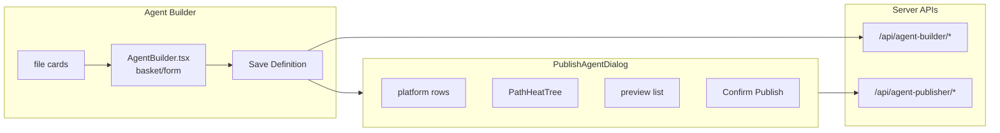
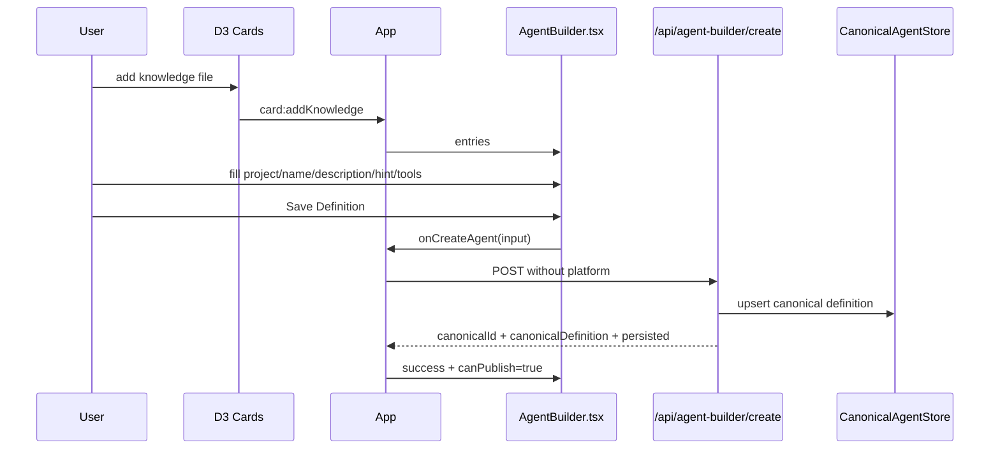
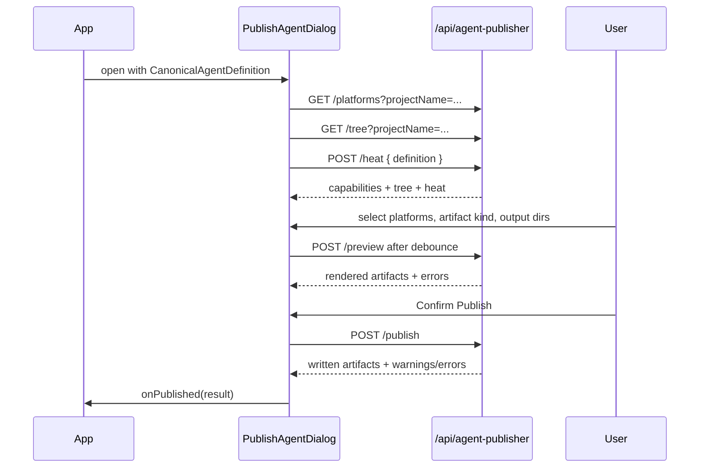

# Agent Builder and Publisher UI - Architecture

**Date**: 2026-06-21
**Status**: Current after r2ab3 Publisher rollout
**Scope**: Visualizer Agent Builder, Agent List, PublishAgentDialog, path heat placement, card actions, and client API flow.

---

## 1. Purpose and Current Product Shape

The visualizer now separates authoring from publishing:

| UI area | Responsibility |
| --- | --- |
| Agent Builder panel | Curate knowledge files and custom text into a canonical agent/skill definition. |
| Agent List view | Browse and edit legacy/materialized agent artifacts. |
| PublishAgentDialog | Choose platforms, artifact kind, output directories, preview files, and confirm materialized publish. |

The Builder no longer shows platform checkboxes in the primary create/save flow. Platform choices live in `PublishAgentDialog`.

```mermaid
flowchart LR
    subgraph BuilderUI["Agent Builder"]
        Cards["file cards"]
        Basket["AgentBuilder.tsx<br/>basket/form"]
        Save["Save Definition"]
    end

    subgraph PublisherUI["PublishAgentDialog"]
        Platforms["platform rows"]
        Heat["PathHeatTree"]
        Preview["preview list"]
        Confirm["Confirm Publish"]
    end

    subgraph APIs["Server APIs"]
        AB["/api/agent-builder/*"]
        AP["/api/agent-publisher/*"]
    end

    Cards --> Basket --> Save --> AB
    Save --> PublisherUI
    PublisherUI --> AP
```

---

## 2. Main UI Modules

| Module | Path | Responsibility |
| --- | --- | --- |
| `App.tsx` | `visualizer/src/App.tsx` | Owns builder/publisher state, card callbacks, create/save, edit, publish, source filtering, and modal open/close state. |
| `AgentBuilder.tsx` | `visualizer/src/components/agentBuilder/AgentBuilder.tsx` | Right-side Builder basket and form. Imported as `AgentBasket` in `App.tsx`. |
| `SourceFilterDropdown.tsx` | `visualizer/src/components/agentBuilder/SourceFilterDropdown.tsx` | Source multi-select for Agent Builder file cards. |
| `ContentFileDialog.tsx` | `visualizer/src/components/agentBuilder/ContentFileDialog.tsx` | Reads and displays indexed file content, with add-to-agent flow. |
| `PublishAgentDialog.tsx` | `visualizer/src/components/agentPublisher/PublishAgentDialog.tsx` | Publisher shell: platform rows, heat/tree, preview, publish result. |
| `PlatformTargetRow.tsx` | `visualizer/src/components/agentPublisher/PlatformTargetRow.tsx` | One platform target row with selected state, artifact kind, directory, native default, heat hint, and filename hint. |
| `PathHeatTree.tsx` | `visualizer/src/components/agentPublisher/PathHeatTree.tsx` | Collapsible directory picker with heat and selected/suggested paths. |
| `publishUtils.ts` | `visualizer/src/components/agentPublisher/publishUtils.ts` | Shared default-directory and filename-hint helpers. |
| `api/agentPublisher.ts` | `visualizer/src/api/agentPublisher.ts` | Fetch wrappers and legacy-to-canonical conversion helper. |
| `api/search.ts` | `visualizer/src/api/search.ts` | Agent Builder fetch wrappers. |
| `useSearch.ts` | `visualizer/src/hooks/useSearch.ts` | Maps Builder files, Agent List entries, and template entries to cards. |
| `chatMapEngine.ts` | `visualizer/src/d3/chatMapEngine.ts` | Renders cards and emits add/edit/publish/use-template events. |

---

## 3. State Ownership

`App.tsx` owns the cross-component state:

| State | Purpose |
| --- | --- |
| `agentBuilderSources` | Source metadata from `/api/agent-builder/prepare`; drives project dropdown and source filter. |
| `agentBuilderSelectedSources` | Client-side source filter for file cards. Persisted in localStorage as `cxc-agent-sources`. |
| `agentKnowledgeEntries` | Knowledge basket items, including file refs, custom text, and placeholders. |
| `agentCreateError` / `agentCreateSuccess` | Builder status feedback. |
| `lastCreatedAgentDefinition` | Last canonical definition returned by canonical-only create/save. Enables Publish to Project. |
| `isPublisherOpen` | Controls `PublishAgentDialog`. |
| `editingAgentPath` / `editingCodexEntryId` | Tracks edit mode for legacy/materialized artifacts. |
| `agentEditInitial` | Initial form values when editing a listed agent or template. |
| `contentFileTarget` | File-content modal target. |

`PublishAgentDialog` owns transient publishing state:

| State | Purpose |
| --- | --- |
| `capabilities` | Platform capability rows from `/api/agent-publisher/platforms`. |
| `nativeDefaults` | Per-platform default directories returned by the backend. |
| `targets` | Selected platform, artifact kind, and output directory per platform. |
| `activePlatform` | Which platform the path tree edits. |
| `tree` / `heat` | Raw tree and heat analysis result. |
| `preview` | Rendered artifacts and preview errors. |
| `publishResult` | Written artifacts and warnings after publish. |

---

## 4. Builder Create Flow

```mermaid
sequenceDiagram
    participant User
    participant Cards as D3 Cards
    participant App
    participant Basket as AgentBuilder.tsx
    participant API as /api/agent-builder/create
    participant Store as CanonicalAgentStore

    User->>Cards: add knowledge file
    Cards->>App: card:addKnowledge
    App->>Basket: entries
    User->>Basket: fill project/name/description/hint/tools
    User->>Basket: Save Definition
    Basket->>App: onCreateAgent(input)
    App->>API: POST without platform
    API->>Store: upsert canonical definition
    API-->>App: canonicalId + canonicalDefinition + persisted
    App->>Basket: success + canPublish=true
```

Current UI behavior:

- Builder create/save calls `fetchAgentBuilderCreate(input)` once.
- No platform list is sent from the Builder form.
- The returned `canonicalDefinition` is stored in `lastCreatedAgentDefinition`.
- `Publish to Project` appears when a canonical definition is available.
- Template mode remains separate and does not automatically publish.

---

## 5. Agent List Edit and Publish Flow

Agent List cards are still based on `/api/agent-builder/list`, which consolidates legacy GitHub, Claude, and Codex artifacts by agent name.

Edit path:

1. User clicks edit on an Agent List card.
2. `App.tsx` calls `fetchAgentBuilderGetAgent(path, codexEntryId?)`.
3. The Builder form is populated from the legacy/materialized artifact.
4. Saving writes a canonical definition through canonical-only create.

Publish existing path:

1. User clicks publish on an Agent List card.
2. `App.tsx` calls `fetchAgentBuilderGetAgent(path, codexEntryId?)`.
3. `agentDefinitionToCanonical()` converts the legacy response client-side.
4. `PublishAgentDialog` opens directly, without switching to Builder.

Known gap: publishing an existing Agent List item currently does not upsert that browser-converted canonical definition into `CanonicalAgentStore`, so later store-backed drift/reload behavior is weaker for this path.

---

## 6. Publisher Dialog Flow

```mermaid
sequenceDiagram
    participant App
    participant Dialog as PublishAgentDialog
    participant API as /api/agent-publisher
    participant User

    App->>Dialog: open with CanonicalAgentDefinition
    Dialog->>API: GET /platforms?projectName=...
    Dialog->>API: GET /tree?projectName=...
    Dialog->>API: POST /heat { definition }
    API-->>Dialog: capabilities + tree + heat
    User->>Dialog: select platforms, artifact kind, output dirs
    Dialog->>API: POST /preview after debounce
    API-->>Dialog: rendered artifacts + errors
    User->>Dialog: Confirm Publish
    Dialog->>API: POST /publish
    API-->>Dialog: written artifacts + warnings/errors
    Dialog->>App: onPublished(result)
```

Default selection:

- `codex`, `claude`, and `copilot` are preselected when supported.
- Kiro, Cursor, Windsurf, and Antigravity are rendered but disabled as unsupported in the current rollout.
- The backend returns platform-native default directories, and heat is displayed as a placement suggestion rather than blindly replacing native defaults.

---

## 7. Platform Target Rows

Each platform row shows:

- checkbox for platform selection
- Agent/Skill segmented control when supported
- selected output directory
- native default directory hint
- heat-suggested directory hint when it differs
- exact "Will write" filename hint
- unsupported label when the platform has no supported artifact kinds

`makePublishTargetsFromState()` builds the request payload by selecting checked platforms with output directories.

Current filename hint behavior:

| Platform | Agent hint | Skill hint |
| --- | --- | --- |
| `copilot` | `{outputDir}/{name}.agent.md` | `{skillRoot}/.github/skills/{id}/SKILL.md` |
| `claude` | `{outputDir}/{name}.md` | `{skillRoot}/.claude/skills/{id}/SKILL.md` |
| `codex` | `{outputDir}/AGENTS.md` | `{skillRoot}/.agents/skills/{id}/SKILL.md` |
| unsupported platforms | `{outputDir}/{name}` | `{skillRoot}/skills/{id}/SKILL.md` placeholder |

Cursor implementation must update this hint table before enabling Cursor support.

---

## 8. Path Heat and Placement UI

The Publisher opens with both raw tree data and heat data:

- `/tree` returns the project directory tree.
- `/heat` reads file knowledge, extracts path mentions, resolves them inside allowed project roots, aggregates direct/subtree hits, and returns top paths plus `suggestedOutputDir`.

The UI shows:

- top path chips
- selected directory
- suggested heat directory
- collapsible tree rows
- manual directory selection that applies only to the active platform

Heat helps choose scope for placement-sensitive platforms. For current Copilot/Claude/Codex support, native defaults remain the safer initial target; heat is a visible suggestion.

---

## 9. Card Rendering Integration

Agent Builder and Agent List reuse the D3 card pipeline:

| View | Card mode | Main actions |
| --- | --- | --- |
| `agent-builder` | file cards | add knowledge, open file content |
| `agent-list` | agent cards | edit, publish |
| `template-list` | template cards | use template, edit template |

Agent List cards carry `platforms[]`, `contentDiverged`, `agentPath`, and optional `codexEntryId`. D3 emits card events that `App.tsx` translates into edit or publish flows.

---

## 10. Current Constraints

1. Cursor, Windsurf, Kiro, and Antigravity are enabled when backend publishers are registered; Copilot/Claude/Codex remain the default preselected platforms.
2. Filename hints prefer backend `artifactTemplates` from `/api/agent-publisher/platforms`, with UI fallback for older responses.
3. Claude **agent** rows may expose `import-shim` when the backend reports it in `supportedLinkStrategiesByKind`; skill rows are copy-only. Symlink is not exposed in the Cursor rollout.
4. Platform notes (e.g. Cursor ancestor merge) appear on supported rows when provided by the backend.
5. Manual verification remains useful for browser refresh-after-save.
