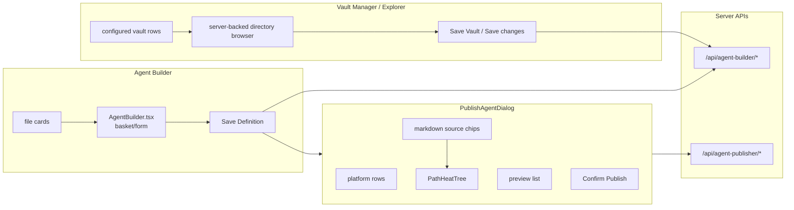
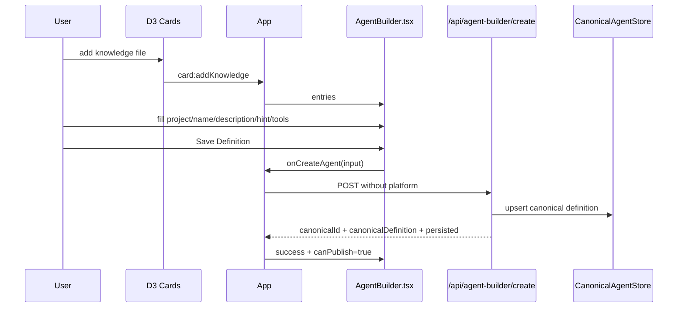
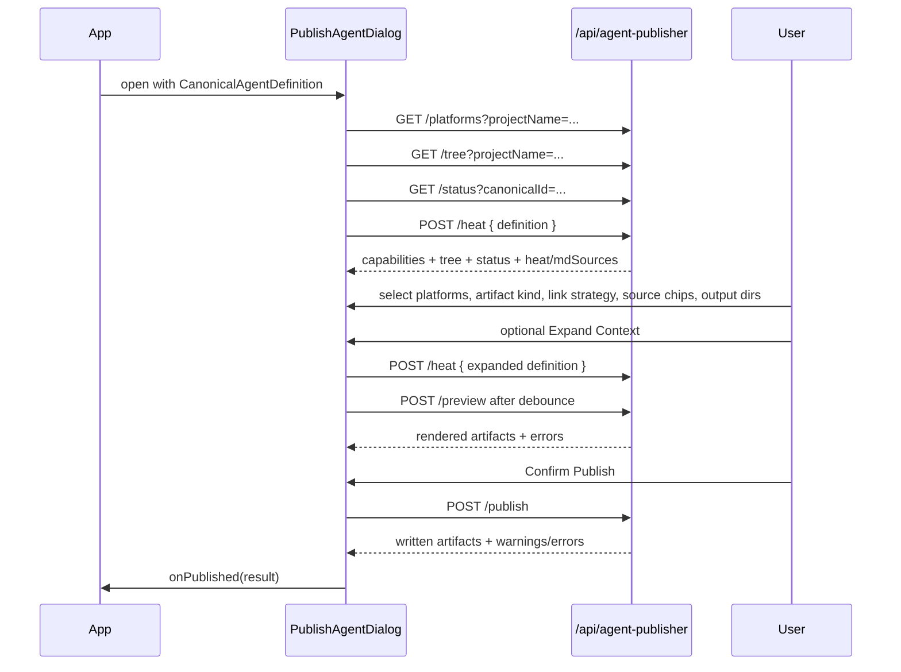

# Agent Builder and Publisher UI - Architecture

**Date**: 2026-06-22
**Status**: Current after r2ap Publisher placement/status and r2ve Vault Explorer rollout
**Scope**: Visualizer Agent Builder basket, canonical Agent List, templates, source filter, and card pipeline. **PublishAgentDialog, placement UX, and Vault Explorer** are documented in [`archi-agent-publisher-ui.md`](./archi-agent-publisher-ui.md).
**Server**: [`archi-agent-builder.md`](../../../../server/zz-reach2/architecture/agents/archi-agent-builder.md) · Publisher/Vault server: [`archi-agent-publisher.md`](../../../../server/zz-reach2/architecture/agents/archi-agent-publisher.md)

---

## 1. Purpose and Current Product Shape

The visualizer now separates authoring from publishing:

| UI area | Responsibility |
| --- | --- |
| Agent Builder panel | Curate knowledge files and custom text into a canonical agent/skill definition. |
| Agent List view | Browse, edit, and publish canonical catalog entries from `agent-definitions.json`, joined with publish-ledger status. |
| PublishAgentDialog | Choose platforms, artifact kind, output directories, link strategy, placement markdown sources, preview files, and confirm materialized publish. |
| Vault Manager / Vault Explorer | List configured AgentBuilder vaults, browse server directories, Save Vault, and Save changes to vault metadata. |

The Builder no longer shows platform checkboxes in the primary create/save flow. Platform choices live in `PublishAgentDialog`.

```mermaid
flowchart LR
    subgraph BuilderUI["Agent Builder"]
        Cards["file cards"]
        Basket["AgentBuilder.tsx<br/>basket/form"]
        Save["Save Definition"]
    end

    subgraph PublisherUI["PublishAgentDialog"]
        Platforms["platform rows"]
        Sources["markdown source chips"]
        Heat["PathHeatTree"]
        Preview["preview list"]
        Confirm["Confirm Publish"]
    end

    subgraph VaultUI["Vault Manager / Explorer"]
        Inventory["configured vault rows"]
        Browse["server-backed directory browser"]
        Persist["Save Vault / Save changes"]
    end

    subgraph APIs["Server APIs"]
        AB["/api/agent-builder/*"]
        AP["/api/agent-publisher/*"]
    end

    Cards --> Basket --> Save --> AB
    Save --> PublisherUI
    Sources --> Heat
    PublisherUI --> AP
    Inventory --> Browse --> Persist --> AB
```

---

## 2. Main UI Modules

| Module | Path | Responsibility |
| --- | --- | --- |
| `App.tsx` | `visualizer/src/App.tsx` | Owns builder/publisher/vault state, card callbacks, create/save, edit, publish, source filtering, and modal open/close state. |
| `AgentBuilder.tsx` | `visualizer/src/components/agentBuilder/AgentBuilder.tsx` | Right-side Builder basket and form. Imported as `AgentBasket` in `App.tsx`. |
| `SourceFilterDropdown.tsx` | `visualizer/src/components/agentBuilder/SourceFilterDropdown.tsx` | Source multi-select for Agent Builder file cards. |
| `ContentFileDialog.tsx` | `visualizer/src/components/agentBuilder/ContentFileDialog.tsx` | Reads and displays indexed file content, with add-to-agent flow. |
| `PublishAgentDialog.tsx` | `visualizer/src/components/agentPublisher/PublishAgentDialog.tsx` | Publisher shell: platform rows, publish status, markdown source chips, filtered heat/tree, preview, publish result, and Expand Context. |
| `PlatformTargetRow.tsx` | `visualizer/src/components/agentPublisher/PlatformTargetRow.tsx` | One platform target row with selected state, artifact kind, directory, native default, heat hint, and filename hint. |
| `PathHeatTree.tsx` | `visualizer/src/components/agentPublisher/PathHeatTree.tsx` | Collapsible directory picker with heat and selected/suggested paths. |
| `publishUtils.ts` | `visualizer/src/components/agentPublisher/publishUtils.ts` | Shared default-directory, filename-hint, source-chip selection, heat filtering, publish prefill, and status-label helpers. |
| `VaultManagerView.tsx` | `visualizer/src/components/vaults/VaultManagerView.tsx` | Built-in vault inventory host with Add vault action and row-click edit entry point. |
| `VaultExplorerDialog.tsx` | `visualizer/src/components/vaults/VaultExplorerDialog.tsx` | Modal server-backed directory browser for add/edit vault flows, styled like PublishAgentDialog. |
| `vaultFormUtils.ts` / `vaultNavigationUtils.ts` | `visualizer/src/components/vaults/*` | Vault name suggestion, row keyboard behavior, subtitle, duplicate-banner, and Save guard logic. |
| `vaultSaveIntegration.ts` | `visualizer/src/components/vaults/vaultSaveIntegration.ts` | Maps Save Vault / Save changes responses into source inventory and selected-source state. |
| `api/agentPublisher.ts` | `visualizer/src/api/agentPublisher.ts` | Fetch wrappers for platforms, tree, heat, preview, publish, drift, and status. |
| `api/vaults.ts` | `visualizer/src/api/vaults.ts` | Fetch wrappers for Vault Explorer browse/info routes plus Save Vault and Save changes. |
| `api/search.ts` | `visualizer/src/api/search.ts` | Agent Builder fetch wrappers. |
| `useSearch.ts` | `visualizer/src/hooks/useSearch.ts` | Maps Builder files, Agent List entries, and template entries to cards. |
| `chatMapEngine.ts` | `visualizer/src/d3/chatMapEngine.ts` | Renders cards and emits add/edit/publish/use-template events. |

---

## 3. State Ownership

`App.tsx` owns the cross-component state:

| State | Purpose |
| --- | --- |
| `agentBuilderSources` | Source metadata from `/api/agent-builder/prepare`; also used as Vault Manager inventory rows (`name`, `path`, `type`, `fileCount`). |
| `agentBuilderSelectedSources` | Client-side source filter for file cards. Persisted in localStorage as `cxc-agent-sources`. |
| `agentKnowledgeEntries` | Knowledge basket items, including file refs, custom text, and placeholders. |
| `agentCreateError` / `agentCreateSuccess` | Builder status feedback. |
| `lastCreatedAgentDefinition` | Last canonical definition returned by canonical-only create/save. Enables Publish to Project. |
| `isPublisherOpen` | Controls `PublishAgentDialog`. |
| `editingCanonicalId` | Tracks active canonical edit mode; cleared when starting new-agent/template/clipboard flows to avoid stale overwrites. |
| `editingAgentPath` / `editingCodexEntryId` | Tracks legacy disk-artifact edit state only. |
| `agentEditInitial` | Initial form values when editing a listed agent or template. |
| `contentFileTarget` | File-content modal target. |
| `vaultExplorerOpen` | Controls `VaultExplorerDialog`. |
| `vaultExplorerSession` | `{ mode: "add" | "edit", editEntry? }`; row-click edit opens the dialog at the configured vault path. |

`PublishAgentDialog` owns transient publishing state:

| State | Purpose |
| --- | --- |
| `capabilities` | Platform capability rows from `/api/agent-publisher/platforms`. |
| `nativeDefaults` | Per-platform default directories returned by the backend. |
| `targets` | Selected platform, artifact kind, and output directory per platform. |
| `activePlatform` | Which platform the path tree edits. |
| `fullHeat` / `tree` | Raw directory tree plus complete heat analysis result from `/heat`. |
| `selectedMdPaths` | Checked markdown source chips; basket docs are checked by default and related docs are opt-in. |
| `publishStatus` | Ledger-backed publish summaries and row-specific drift states from `/api/agent-publisher/status`. |
| `preview` | Rendered artifacts and preview errors. |
| `publishResult` | Written artifacts and warnings after publish. |
| `knowledgeExpanded` | Marks that Expand Context changed the in-session working definition and should be saved in Builder. |

---

## 4. Builder Create Flow

```mermaid
sequenceDiagram
    participant User
    participant Cards as D3 Cards
    participant App
    participant Basket as AgentBuilder.tsx
    participant API as /api/agent-builder/create
    participant Store as CanonicalAgentStore

    User->>Cards: add knowledge file
    Cards->>App: card:addKnowledge
    App->>Basket: entries
    User->>Basket: fill project/name/description/hint/tools
    User->>Basket: Save Definition
    Basket->>App: onCreateAgent(input)
    App->>API: POST without platform
    API->>Store: upsert canonical definition
    API-->>App: canonicalId + canonicalDefinition + persisted
    App->>Basket: success + canPublish=true
```

Current UI behavior:

- Builder create/save calls `fetchAgentBuilderCreate(input)` once.
- No platform list is sent from the Builder form.
- The returned `canonicalDefinition` is stored in `lastCreatedAgentDefinition`.
- `Publish to Project` appears when a canonical definition is available.
- Template mode remains separate and does not automatically publish.

---

## 5. Agent List Edit and Publish Flow

Agent List cards are backed by `/api/agent-builder/list` (canonical store + publish ledger join). Card id is `canonicalId`.

Edit path:

1. User clicks edit on an Agent List card.
2. `App.tsx` calls `fetchAgentBuilderGetDefinition(canonicalId)`.
3. Canonical `knowledge[]` populates the Builder basket (file vs text refs).
4. `editingCanonicalId` enters Builder edit mode so project/name/description/hint/tools are prefilled.
5. Saving upserts the same `canonicalId` through canonical-only create.

Publish existing path:

1. User clicks publish on an Agent List card.
2. `App.tsx` loads the canonical definition by `canonicalId`.
3. `PublishAgentDialog` opens and fetches `/api/agent-publisher/status` for per-platform drift and output-dir prefill.

New-agent flows explicitly clear `editingCanonicalId` so a later save cannot accidentally overwrite the previously edited canonical entry.

## 5b. Vault Explorer

Built-in `vault-manager` is a host/inventory view. It lists configured vaults (`Vault name`, type, file count, path), keeps a visible **Add vault** action, and opens **VaultExplorerDialog** for actual browse/add/edit work. The dialog is a modal styled like `PublishAgentDialog`.

| Entry point | Behavior |
| --- | --- |
| Source filter **Add Vault** | Opens explorer in **add** mode |
| **Manage Vaults** | Switches to vault-manager inventory without changing card results |
| Vault Manager **Add vault** | Opens explorer in **add** mode |
| Vault Manager row click | Opens explorer in **edit** mode at that vault path |

Browse/validate uses read-only `GET /vault-roots`, `/vault-children`, and `/vault-info`. Single-click selects and validates a directory; double-click, Enter, breadcrumb buttons, the parent control, manual Open, and the row `->` button navigate. Browse calls never write `cc.json`, refresh sources, call `prepare`, or index files.

**Save Vault** (`POST /vaults`) adds a row and starts indexing only after the server write succeeds. **Save changes** (`PATCH /vaults`) updates `name`/`type` for an existing normalized `path` and returns `previousName` so source-filter selections can be renamed. Both update `agentBuilderSources` from the response `prepare` payload.

**Vault name** maps to `dataSources[].name` in `cc.json`. The field auto-updates to the selected folder basename until the user edits it; after that, path changes keep the typed value and show **Use suggestion** when the basename differs. Broad-root warnings are advisory and do not block Save. Edit mode treats the existing path as a read-only lookup key and allows saving even though `vault-info` marks that path as already configured.

---

## 6. Publisher Dialog Flow

```mermaid
sequenceDiagram
    participant App
    participant Dialog as PublishAgentDialog
    participant API as /api/agent-publisher
    participant User

    App->>Dialog: open with CanonicalAgentDefinition
    Dialog->>API: GET /platforms?projectName=...
    Dialog->>API: GET /tree?projectName=...
    Dialog->>API: GET /status?canonicalId=...
    Dialog->>API: POST /heat { definition }
    API-->>Dialog: capabilities + tree + status + heat/mdSources
    User->>Dialog: select platforms, artifact kind, link strategy, source chips, output dirs
    User->>Dialog: optional Expand Context
    Dialog->>API: POST /heat { expanded definition }
    Dialog->>API: POST /preview after debounce
    API-->>Dialog: rendered artifacts + errors
    User->>Dialog: Confirm Publish
    Dialog->>API: POST /publish
    API-->>Dialog: written artifacts + warnings/errors
    Dialog->>App: onPublished(result)
```

Default selection:

- Platform checkboxes restore from **`cxc-publisher-platforms`** localStorage; first visit defaults to Copilot, Claude, and Codex when supported. See [`archi-agent-publisher-ui.md`](./archi-agent-publisher-ui.md) §5.
- Kiro, Cursor, Windsurf, and Antigravity are supported but not in the first-visit default set.
- The backend returns platform-native default directories, and heat is displayed as a placement suggestion rather than blindly replacing native defaults.
- Last published targets from `/status` prefill matching platform/artifact output directories and show row-specific states: `clean`, `disk-changed`, `canonical-changed`, `missing-file`, or `unknown`.
- Expand Context appends checked related markdown docs to the in-session working definition and Builder basket, re-heats without closing the dialog, and shows a warning until the Builder definition is saved.

---

## 7. Platform Target Rows

Each platform row shows:

- checkbox for platform selection
- Agent/Skill segmented control when supported
- link-strategy control when the backend reports more than `copy`
- selected output directory
- native default directory hint
- heat-suggested directory hint when it differs
- exact "Will write" filename hint
- publish status label when ledger rows exist
- platform notes from backend capabilities
- unsupported label when the platform has no supported artifact kinds

`makePublishTargetsFromState()` builds the request payload by selecting checked platforms with output directories.

Current filename hint behavior:

| Platform | Agent hint | Skill hint |
| --- | --- | --- |
| `copilot` | `{outputDir}/{name}.agent.md` | `{skillRoot}/.github/skills/{id}/SKILL.md` |
| `claude` | `{outputDir}/{name}.md` | `{skillRoot}/.claude/skills/{id}/SKILL.md` |
| `codex` | `{outputDir}/AGENTS.md` | `{skillRoot}/.agents/skills/{id}/SKILL.md` |
| `cursor` | `{outputDir}/AGENTS.md` | `{skillRoot}/.agents/skills/{id}/SKILL.md` |
| `windsurf` | `{outputDir}/AGENTS.md` | `{skillRoot}/.windsurf/skills/{id}/SKILL.md` |
| `antigravity` | `{outputDir}/AGENTS.md` | `{skillRoot}/.agents/skills/{id}/SKILL.md` |
| `kiro` | `{outputDir}/AGENTS.md` | `{skillRoot}/.kiro/skills/{id}/SKILL.md` |
| unsupported platforms | `{outputDir}/{name}` | `{skillRoot}/skills/{id}/SKILL.md` placeholder |

Filename hints prefer backend `artifactTemplates`; this table is the fallback for older capability responses. Claude agent rows may expose `import-shim`; skill rows and all other current rows are copy-only in the UI.

---

## 8. Path Heat and Placement UI

The Publisher opens with both raw tree data and heat data:

- `/tree` returns the project directory tree.
- `/heat` reads file knowledge, extracts path mentions, resolves them inside allowed project roots, converts file hits to parent-directory placement hits, and returns a directory-only heat tree plus `mdSources`.

The UI shows:

- markdown source chips from `mdSources`
- basket markdown docs checked by default
- related markdown discoveries unchecked by default
- selected directory
- suggested heat directory
- collapsible tree rows
- manual directory selection that applies only to the active platform
- **Expand Context** when checked related docs are not already in the Builder basket

Changing the checked markdown chips filters directory heat client-side through `filterHeatByMdSources()`. The tree never renders `.md` file leaves; markdown files are represented as source chips, and their path mentions contribute heat to directories.

Expand Context calls back into `App.tsx`, appends selected related docs as file knowledge refs, updates `lastCreatedAgentDefinition`, updates the Builder basket, and triggers a re-heat while the Publisher stays open. It does not immediately persist `agent-definitions.json`; the dialog warns that the Builder definition should be saved.

Heat helps choose scope for placement-sensitive platforms. Native platform defaults remain the initial target; heat is a visible suggestion unless the user explicitly selects a directory for the active platform.

---

## 9. Card Rendering Integration

Agent Builder and Agent List reuse the D3 card pipeline:

| View | Card mode | Main actions |
| --- | --- | --- |
| `agent-builder` | file cards | add knowledge, open file content |
| `agent-list` | agent cards | edit, publish |
| `template-list` | template cards | use template, edit template |

Agent List cards carry `canonicalId`, `projectName`, `publishedTo`, `unpublished`, and optional legacy/debug path fields. D3 emits card events with `canonicalId`; `App.tsx` loads `get-definition` for edit/publish flows instead of using disk artifact paths as identity.

---

## 10. Current Constraints

1. Cursor, Windsurf, Kiro, and Antigravity have backend publishers; default checkbox set and localStorage behavior are in [`archi-agent-publisher-ui.md`](./archi-agent-publisher-ui.md).
2. Filename hints prefer backend `artifactTemplates` from `/api/agent-publisher/platforms`, with UI fallback for older responses.
3. Claude **agent** rows may expose `import-shim` when the backend reports it in `supportedLinkStrategiesByKind`; skill rows are copy-only. Symlink is not exposed.
4. Platform notes (e.g. Cursor ancestor merge) appear on supported rows when provided by the backend.
5. Vault Explorer browse/validate is read-only; source refresh and indexing happen only after Save Vault or Save changes succeeds.
6. Vault Explorer UI exposes Vault name/type as primary fields; advanced `category`, `projectRoot`, and `agentPath` remain server/API-level fields for now.
7. Expand Context is an in-session working-definition change until the user saves the Builder definition.
