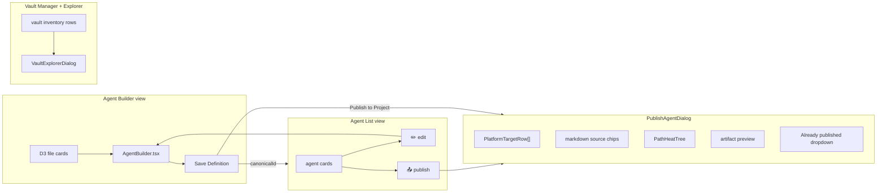
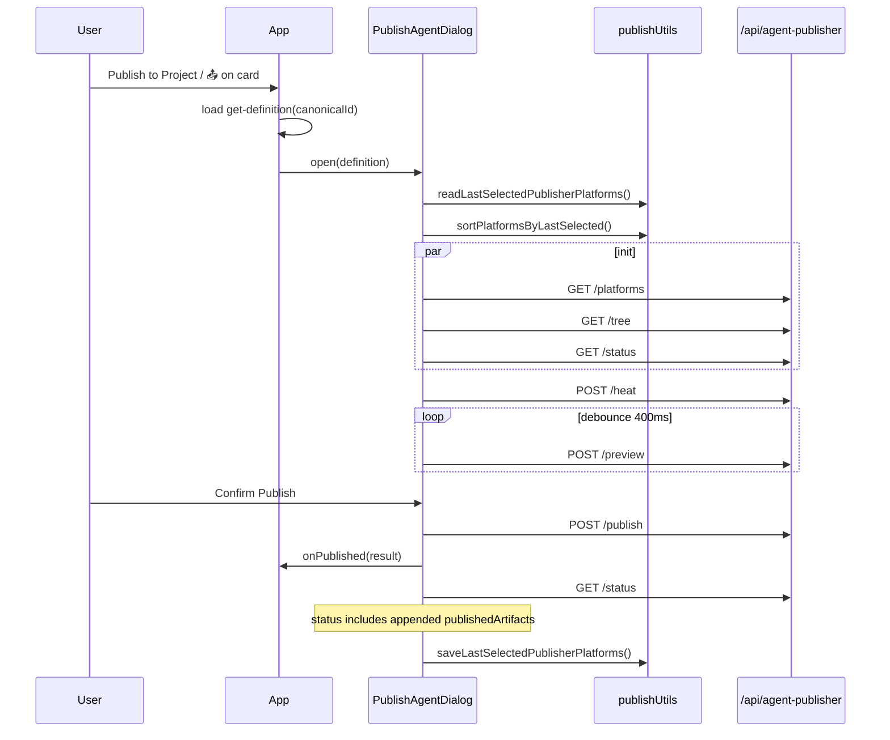
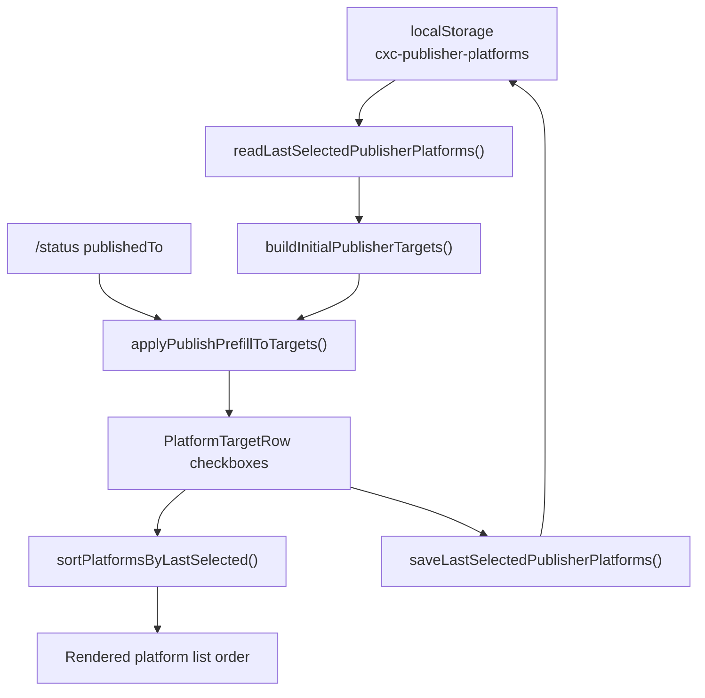
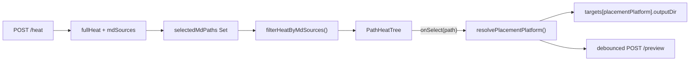
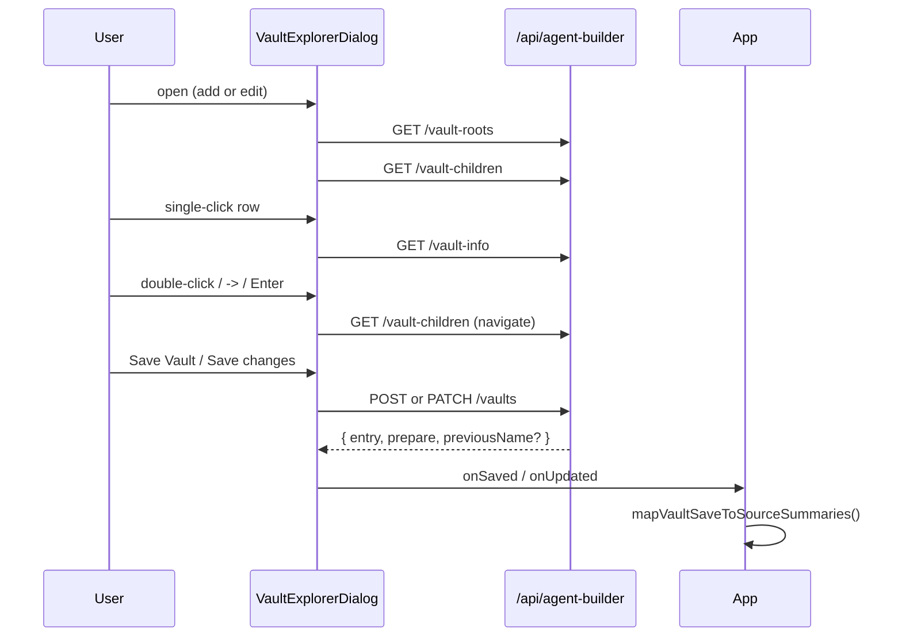

# Agent Publisher and Vault Explorer — UI Architecture

**Date**: 2026-06-22  
**Status**: Current after r2ap (placement UX, canonical list), r2ab3 (seven platforms), r2ve (Vault Explorer modal), Publisher platform localStorage, and Publisher placement/history polish (2026-06-22)  
**Scope**: `PublishAgentDialog`, placement UI, Vault Manager/Explorer, client APIs, localStorage, and integration with Builder/Agent List  
**Server counterpart**: [`server/zz-reach2/architecture/agents/archi-agent-publisher.md`](../../../../server/zz-reach2/architecture/agents/archi-agent-publisher.md)  
**Builder companion**: [`archi-agent-builder-ui.md`](./archi-agent-builder-ui.md) — basket, canonical save, Agent List cards, source filter

---

## 1. Purpose and Product Shape

The visualizer separates **authoring** (Builder) from **publishing** (Publisher) and **vault configuration** (Vault Explorer):

| UI surface | Component(s) | User goal |
| --- | --- | --- |
| Agent Builder basket | `AgentBuilder.tsx` | Curate knowledge → Save canonical definition |
| Agent List | D3 + `App.tsx` | Browse catalog → Edit or Publish by `canonicalId` |
| Publish to Project | `PublishAgentDialog.tsx` | Select platforms, placement, preview, confirm write |
| Vault inventory | `VaultManagerView.tsx` | See configured vaults; open add/edit explorer |
| Vault Explorer | `VaultExplorerDialog.tsx` | Browse server dirs → Save Vault / Save changes |

Platform checkboxes were **removed** from the Builder form. All platform targeting lives in `PublishAgentDialog`.



---

## 2. Module Map

| Module | Path | Responsibility |
| --- | --- | --- |
| `App.tsx` | `visualizer/src/App.tsx` | Publisher/vault modal state, create/save/publish handlers, source inventory |
| `PublishAgentDialog.tsx` | `components/agentPublisher/PublishAgentDialog.tsx` | Publisher shell, debounced preview, platform order |
| `PlatformTargetRow.tsx` | `components/agentPublisher/PlatformTargetRow.tsx` | One platform: checkbox; expanded body only when checked (kind, dirs, notes, status) |
| `PathHeatTree.tsx` | `components/agentPublisher/PathHeatTree.tsx` | Collapsible heat tree; click sets placement platform output dir |
| `publishUtils.ts` | `components/agentPublisher/publishUtils.ts` | Defaults, heat filter, prefill, **platform localStorage**, filename hints, **`resolvePlacementPlatform`**, published-artifact labels |
| `VaultManagerView.tsx` | `components/vaults/VaultManagerView.tsx` | Vault inventory host, Add vault, row → edit |
| `VaultExplorerDialog.tsx` | `components/vaults/VaultExplorerDialog.tsx` | Modal browser (Publisher visual language) |
| `vaultFormUtils.ts` | `components/vaults/vaultFormUtils.ts` | Vault name on path change, Use suggestion |
| `vaultNavigationUtils.ts` | `components/vaults/vaultNavigationUtils.ts` | `computeCanSaveVault` add vs edit guards |
| `vaultSaveIntegration.ts` | `components/vaults/vaultSaveIntegration.ts` | Map save responses → `agentBuilderSources` + selection |
| `api/agentPublisher.ts` | `api/agentPublisher.ts` | platforms, tree, heat, preview, publish, status |
| `api/vaults.ts` | `api/vaults.ts` | vault-roots/children/info, createVault, updateVault |
| `SourceFilterDropdown.tsx` | `components/agentBuilder/SourceFilterDropdown.tsx` | Source multi-select + **Add Vault** shortcut |
| `SearchBar.tsx` | `components/searchTools/SearchBar.tsx` | View menu + **Manage Vaults** |

---

## 3. State Ownership

### 3.1 `App.tsx` (cross-cutting)

| State | Purpose |
| --- | --- |
| `agentBuilderSources` | Prepare sources + vault inventory (`name`, `path`, `type`, `fileCount`) |
| `agentBuilderSelectedSources` | File card filter; persisted `cxc-agent-sources` |
| `lastCreatedAgentDefinition` | Enables **Publish to Project** after canonical save |
| `isPublisherOpen` | `PublishAgentDialog` visibility |
| `editingCanonicalId` | Builder edit mode; cleared on new-agent flows |
| `vaultExplorerOpen` | Explorer modal |
| `vaultExplorerSession` | `{ mode: "add" \| "edit", editEntry? }` |

### 3.2 `PublishAgentDialog` (transient)

| State | Purpose |
| --- | --- |
| `capabilities` / `nativeDefaults` | From `GET /platforms` |
| `targets` | Per-platform `selected`, `artifactKind`, `outputDir`, `linkStrategy` |
| `platformOrder` | Display order (last-selected platforms first) |
| `activePlatform` | Which row receives tree directory picks and heat-map link clicks |
| `fullHeat` / `selectedMdPaths` | Heat + filtered chips |
| `publishStatus` | From `GET /status` — prefill dirs, drift labels, **`publishedArtifacts` history** |
| `selectedPublishedArtifactKey` | Controlled value for **Already published** dropdown |
| `preview` / `publishResult` | Debounced preview + confirm result |
| `knowledgeExpanded` | Expand Context touched basket without Builder save |

### 3.3 `VaultExplorerDialog`

| State | Purpose |
| --- | --- |
| `roots` / `children` | Server browse snapshots |
| `selectedPath` / `manualPath` | Selection vs typed path |
| `vaultInfo` | From `vault-info` — duplicate, warnings, readability |
| `vaultName` / `vaultType` | Form fields (`name` → `cc.json`) |
| `vaultNameTouched` | Sticky name + **Use suggestion** hint |
| `mode` / `editEntry` | Add vs edit (path read-only in edit) |

---

## 4. Publish Flow



**Entry points**

| Action | Opens Publisher with |
| --- | --- |
| Builder **Publish to Project** | `lastCreatedAgentDefinition` |
| Agent List **📤** | `fetchAgentBuilderGetDefinition(canonicalId)` |

---

## 5. Platform Rows and localStorage

### 5.1 Row contents (`PlatformTargetRow`)

**Unchecked rows** stay compact: platform checkbox + label only. No platform notes, no publish-status line, no Agent/Skill body.

**Checked rows** expand to show:

- Agent/Skill toggle, link-strategy (when backend offers more than `copy`)
- Selected output directory (from tree, heat-map link, or native default)
- Native default hint
- **Path heatmap hint** when heat suggestion differs from native default (see §6.4)
- **Will write** filename from `artifactTemplates` or `resolveFilenameHint()`
- Backend **platform notes** (e.g. Kiro compatibility, Windsurf/Antigravity guidance) — **only while checked**
- **Publish status** (`clean`, `canonical-changed`, `disk-changed`, etc.) — **only while checked and ledger has a row**; never shows “Not published” (checkbox + **Already published** history cover that)

`formatPublishStatusLabel()` returns `undefined` when no ledger row exists for the active kind.

### 5.2 Selection memory

| Key | Owner | Format |
| --- | --- | --- |
| `cxc-publisher-platforms` | `publishUtils.ts` | JSON array of `PublishPlatform` ids |

**On dialog open**

1. `readLastSelectedPublisherPlatforms()` — fallback `["copilot","claude","codex"]` when empty.
2. `buildInitialPublisherTargets()` applies last selection, then `applyPublishPrefillToTargets()` from `/status` (published platforms forced selected + output dir).
3. `setActivePlatform(resolvePlacementPlatform(initialTargets, "codex"))` — first checked platform receives tree picks (fixes preview staying on wrong platform when only Cursor is checked).
4. `sortPlatformsByLastSelected()` — previously selected platforms render **at the top** of the list.

**While open**

- `useEffect` on `targets` calls `saveLastSelectedPublisherPlatforms()` so toggles persist for the next session.



### 5.3 Default selection vs backend capabilities

- First visit: Copilot, Claude, Codex checked when supported.
- Cursor, Windsurf, Kiro, Antigravity: available but not in first-visit default.
- Ledger prefill from `/status` may add platforms and output directories beyond last localStorage.

---

## 6. Placement UX

### 6.1 Two-pane layout

| Pane | Content |
| --- | --- |
| **Platforms** | `platformOrder.map` → `PlatformTargetRow` |
| **Placement** | Markdown chips + `PathHeatTree` |

### 6.2 Markdown source chips

- From `PathHeatResult.mdSources`
- Basket files: **checked** by default (`inBasket && !isRelated`)
- Related link discoveries: visible, **unchecked** by default
- `filterHeatByMdSources()` recomputes tree client-side when chips change
- Tree shows **directories only** — no `.md` file leaves

### 6.3 Directory selection

- Tree click sets `outputDir` for the **placement platform**, not blindly `activePlatform`:
  - `resolvePlacementPlatform(targets, activePlatform)` returns `activePlatform` when that row is checked, otherwise the **first checked** platform in `PUBLISHER_PLATFORM_ORDER`.
- Placement pane copy (`Directory picks apply to…`, tree caption) uses the resolved placement platform label.
- Heat suggestion is advisory; native default from backend is not auto-replaced.
- `Expand Context` (when related chips checked and not in basket): calls `App` → append file knowledge refs → re-heat; shows warning until Builder saves canonical definition.



### 6.4 Path heatmap link

When filtered heat’s `suggestedOutputDir` differs from the row’s native default, the checked platform shows:

```text
Suggested by path heatmap: <clickable path>
```

Clicking the path calls `onHeatSuggestedSelect` → sets that platform’s `outputDir` and focuses the row (`activePlatform`). Same effect as picking the folder in `PathHeatTree` for that platform.

### 6.5 Publish history — “Already published”

Each successful publish appends rows to **`publishedArtifacts`** on the canonical definition in `agent-definitions.json` (server persists; UI reads via `GET /status`).

| UI element | Behavior |
| --- | --- |
| **Already published:** label + `<select>` | Rendered **below Preview** when `publishedArtifacts.length > 0` |
| Dropdown options | Newest first; label from `formatPublishedArtifactLabel()` (`platform · kind · path · timestamp`) |
| On pick | Restores platform checkbox, artifact kind, output dir (`outputDirFromArtifactPath`), and link strategy when stored |

History is append-only per publish session; ledger `publishedTo` still drives drift detection and row status labels.

---

## 7. AGENTS.md Collision — UI Experience

When Codex and Cursor (or any `codex-collection` + `plain-agents-md` pair) target the **same** `outputDir`, preview shows:

```text
d:\...\AGENTS.md: Multiple incompatible AGENTS.md targets in the same publish request.
```

**Confirm Publish** stays disabled while `preview.errors.length > 0`.

| User intent | UI action |
| --- | --- |
| Codex at project root | Keep Codex checked; uncheck Cursor **or** set Cursor output dir to a subfolder |
| Cursor at root | Opposite; or set Codex via `codexAgentPaths` / tree pick |
| Both platforms | Two separate publish sessions, or split directories — not one combined request |

Claude + Copilot in the same request are unaffected (different filenames/paths).

See server doc §9 for format details: [`archi-agent-publisher.md`](../../../../server/zz-reach2/architecture/agents/archi-agent-publisher.md#9-agentsmd--format-families-and-collision-policy).

---

## 8. Vault Manager and Vault Explorer

### 8.1 Inventory host (`VaultManagerView`)

Built-in view `vault-manager`:

- Lists `agentBuilderSources` as vault rows: name, type, file count, path
- **Add vault** → explorer add mode
- Row click → explorer edit mode at vault path
- When explorer closed: **Open Vault Explorer** button (not stale "dialog is open" copy)

### 8.2 Explorer modal (`VaultExplorerDialog`)

Styled like `PublishAgentDialog`: dark overlay, section cards, compact footer.



### 8.3 Entry points

| Entry | Behavior |
| --- | --- |
| Source filter **Add Vault** | Explorer add mode; does not switch view |
| SearchBar **Manage Vaults** | Switch to `vault-manager` view |
| Vault Manager **Add vault** | Explorer add mode |
| Vault Manager row click | Explorer edit mode |

Browse/validate never calls `createVault`, `fetchAgentBuilderPrepare`, or `search()`.

### 8.4 Interaction model

| Gesture | Effect |
| --- | --- |
| Single-click row | `selectDirectory` → `vault-info` only |
| Double-click / `->` / Enter | `openDirectory` → next level |
| Breadcrumb / Up | Navigate to parent |
| Manual Validate | `selectDirectory(manualPath)` |
| Manual Open | `openDirectory(manualPath)` |
| Escape | Close modal |
| Ctrl/Meta+Enter | Save when `canSave` |

### 8.5 Vault naming

- Label **Vault name** (maps to `dataSources[].name`)
- Auto-fills folder basename until user types (`vaultNameTouched`)
- **Use suggestion** when touched name differs from current folder basename
- Edit mode: path read-only; Save changes allowed even when `alreadyConfigured`

### 8.6 Save integration (`vaultSaveIntegration.ts`)

After successful POST/PATCH:

1. `mapVaultSaveToSourceSummaries()` updates `agentBuilderSources` (includes zero-file vaults).
2. Add: append new name to `agentBuilderSelectedSources`.
3. Edit rename: `replaceVaultNameInSourceSelection(previousName, nextName)`.
4. Refresh Agent Builder cards only when active view is `agent-builder`.

---

## 9. Card and D3 Integration

Agent List publish/edit uses **`canonicalId`**, not disk paths.

| View | `cardRenderMode` | Actions |
| --- | --- | --- |
| `agent-builder` | `agent-builder` | 📎 add knowledge |
| `agent-list` | `agent-list` | ✏️ edit, 📤 publish |
| `template-list` | `template-list` | ✏️ edit, 🔨 use template |

Publish handler in `App.tsx` loads `get-definition` before opening dialog.

---

## 10. localStorage Contract

| Key | Owner | Purpose |
| --- | --- | --- |
| `cxc-agent-sources` | `App.tsx` | Agent Builder source filter selection |
| `cxc-publisher-platforms` | `publishUtils.ts` | Last Publisher platform checkboxes + list order priority |
| `ccv:views` / `ccv:activeViewId` | `useViews` | Includes `vault-manager` built-in view |

All reads are try/catch guarded; write failures do not block publish or vault save.

---

## 11. Visual and UX Conventions

Shared between `PublishAgentDialog` and `VaultExplorerDialog`:

- Fixed overlay, bordered panel, section headings
- Primary action button (purple/teal) vs neutral Close/Cancel
- Error and warning panels above content
- Two-column desktop layout; stacked mobile with sticky footer
- `focus-visible` on interactive controls
- **Publisher platform list**: unchecked rows are single-line to limit dialog height; detail expands on check only

Vault directory rows: fixed height, selected highlight, unreadable badge, explicit `->` open control (not full-row button only).

---

## 12. Constraints and Known Gaps

1. **AGENTS.md collision** — UI shows server preview error; no inline per-platform conflict resolver yet.
2. **Expand Context** — in-session only until Builder Save Definition persists canonical store.
3. **Vault advanced fields** — `projectRoot`, `agentPath`, `category` are server/API; UI exposes name/type primarily.
4. **Symlink** — not shown in link-strategy UI.
5. **Filename hints** — prefer backend `artifactTemplates`; `publishUtils` table is fallback.
6. **Browser paths** — no native folder picker; server-backed browse only ([r2ve](../../../../../server/zz-reach2/upgrades/2026-06/r2ve-vault-explorer.md) constraint).
7. **Publish history backfill** — `publishedArtifacts` is populated on publish after this feature ships; older agents have empty history until republished (ledger `publishedTo` still reflects last-known targets).

---

## 13. Related Documentation

- Server APIs, collision policy, vault browse contract: [`archi-agent-publisher.md`](../../../../server/zz-reach2/architecture/agents/archi-agent-publisher.md)
- Builder basket, templates, Agent List: [`archi-agent-builder-ui.md`](./archi-agent-builder-ui.md)
- User-facing data sources: [`visualizer/public/README-DATA-SOURCES.MD`](../../../public/README-DATA-SOURCES.MD)
- Upgrade plans: [r2ap](../../../../../server/zz-reach2/upgrades/2026-06/r2ap-agent-publisher-2.md), [r2ab3](../../../../../server/zz-reach2/upgrades/2026-06/r2ab3-agent-builder-3.md), [r2ve](../../../../../server/zz-reach2/upgrades/2026-06/r2ve-vault-explorer.md)
