# ContextCore Visualizer — Architectural Review

**Date**: 2026-03-10
**Reviewer**: Architectural post-build analysis (based on implementation of `r2ud-d3-visualizer.md`)
**Status**: Multi-view upgrade shipped (`r2umv`) — views, favorites, star workflow, keyboard-accessible dropdown, search history with autocomplete, LOD-aware HoverPanel

---

## 1. Executive Summary

The ContextCore Visualizer is a standalone Vite + React + D3 SPA that now supports a **multi-view workspace** (Search, Latest Chats, Favorites) and renders cards as a **zoomable 2-D map**. The architecture keeps a clean split: React owns view/search/favorites state and modal UI; D3 owns SVG zoom/pan and high-frequency pointer interactions. A thin hook bridges both runtimes without crossing boundaries.

The MVP + v1.1 interaction fixes remain intact, and the v2 upgrade adds persistent local views/favorites, card-level starring, a styled favorites picker modal, keyboard-accessible custom view dropdown (arrows, enter, escape, home/end, typeahead), **search history with autocomplete** (100-entry localStorage-backed FIFO queue with individual/bulk deletion), and **LOD-aware HoverPanel** (metadata-only layout at medium/full zoom showing labeled rows instead of duplicating visible card content).

---

## 2. Module Topology

```
visualizer/
├── index.html
├── vite.config.ts               ← dev proxy + port
├── package.json                 ← isolated from root bun project
├── tsconfig.json                ← composite references
├── tsconfig.app.json            ← src/ compilation (noEmit, react-jsx, ES2022)
├── tsconfig.node.json           ← vite.config.ts compilation
└── src/
    ├── main.tsx                 ← React root mount (StrictMode)
    ├── App.tsx                  ← Top-level orchestration (views, favorites, search, modal flows)
    ├── App.css                  ← Error banner styles
    ├── index.css                ← CSS custom properties, resets, card body CSS
    ├── types.ts                 ← All shared types (domain + UI)
    ├── api/
    │   └── search.ts            ← fetch wrappers for /api/search, /api/sessions, /api/messages
    ├── components/
    │   ├── searchTools/
    │   │   ├── SearchBar.tsx/.css   ← Search input + custom view dropdown + keyboard nav + search history autocomplete
    │   │   ├── HoverPanel.tsx/.css  ← Floating detail panel, viewport-clamped, LOD-aware layout (metadata-only at medium/full)
    │   │   └── StatusBar.tsx/.css   ← Zoom level, LOD tier, latency, result count
    │   ├── searchView/
    │   │   ├── ChatMap.tsx/.css     ← React shell for the D3 viewport
    │   │   ├── EditResultsView.tsx/.css  ← Add/edit view modal + project scope + scopes
    │   │   └── ClipboardBasket.tsx  ← Saved line snippets panel
    │   └── favorites/
    │       └── FavoritesPickerDialog.tsx/.css ← Star-target favorites modal (select/create)
    ├── d3/
    │   ├── chatMapEngine.ts     ← Pure imperative D3 engine (closure-based)
    │   ├── layout.ts            ← Score-sorted masonry grid
    │   └── colors.ts            ← Harness palette + symbol hash-coloring
    └── hooks/
        ├── useViews.ts          ← LocalStorage-backed view definitions + active view
        ├── useFavorites.ts      ← LocalStorage-backed favorites entries
        ├── useSearch.ts         ← View-aware search/latest/favorites card sourcing
        ├── useSearchHistory.ts  ← LocalStorage-backed search history (100 entries, FIFO)
        └── useChatMap.ts        ← React ↔ D3 lifecycle bridge
```

> **UI deep dive**: component responsibilities, hook internals, localStorage contracts, and modal flows are documented in [ui/archi-context-core-visualizer-ui.md](ui/archi-context-core-visualizer-ui.md).

### 2.1 Dependency Graph

```mermaid
graph LR
    subgraph React Layer
        App --> SearchBar
        App --> ChatMap
        App --> EditResultsView
        App --> FavoritesPickerDialog
        App --> ClipboardBasket
        App --> HoverPanel
        App --> StatusBar
        App --> useSearch
        App --> useViews
        App --> useFavorites
        App --> useSearchHistory
        ChatMap --> useChatMap
    end

    subgraph Hook Layer
        useSearch --> search.ts
        useViews --> LocalStorage
        useFavorites --> LocalStorage
        useSearchHistory --> LocalStorage
        useSearch --> colors.ts
        useChatMap --> chatMapEngine
    end

    subgraph D3 Layer
        chatMapEngine --> layout.ts
        chatMapEngine --> colors.ts
    end

    subgraph Types
        types.ts
    end

    useSearch -.->|CardData[]| types.ts
    useViews -.->|ViewDefinition[]| types.ts
    useFavorites -.->|FavoriteEntry[]| types.ts
    chatMapEngine -.->|CardData, HoverEventDetail, ViewportChangeDetail, CardStarEventDetail| types.ts
    App -.->|HoverEventDetail, ViewportChangeDetail, CardStarEventDetail| types.ts
```

---

## 3. Layered Architecture

The system is divided into four explicit layers with strict directionality:

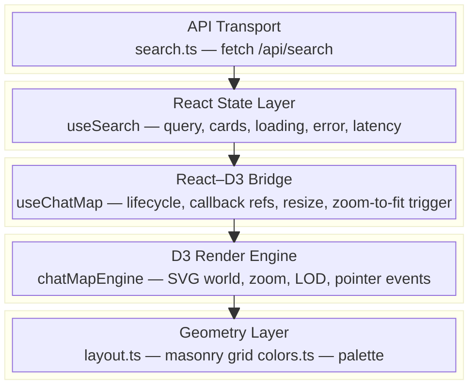

**Key rule**: data flows **down** (React → D3). Events flow **up** (D3 → React) exclusively through the `onEvent` callback registered in `useChatMap`. D3 never reads React state and React never reads D3 internal state.

---

## 4. Data Flow

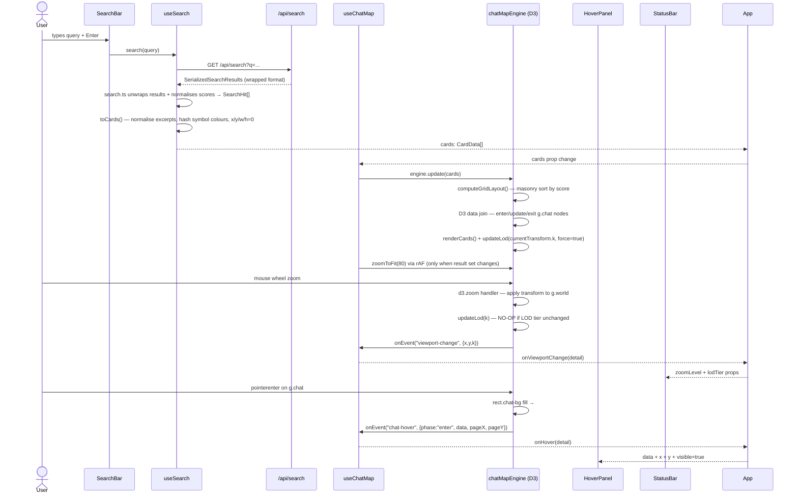

### 4.2 View-Aware Flow (v2)

The active view controls card source and search controls:

- `search` view → `/api/search?q=...`
- `latest` view → `/api/messages` (recent messages)
- `favorites` view → `localStorage` favorites only (no API call)

Star workflow:

- D3 emits `card-star` event for card-level star click
- React opens favorites picker modal when needed
- Selection persists to favorites storage and updates star state in the engine

> **Detailed view flows** (switch, create, star, auto-refresh): [ui/archi-context-core-visualizer-ui.md §5](ui/archi-context-core-visualizer-ui.md#5-view-system--detailed-flows)

### 4.1 Data Transformation Pipeline

The server returns a **`SerializedSearchResults`** envelope from `/api/search`:

```json
{
  "results": [ SerializedAgentMessageFound, ... ],
  "query": "storyteller",
  "engine": "fuse" | "qdrant" | "hybrid",
  "totalFuseResults": 947,
  "totalQdrantResults": 0
}
```

Each item in `results` is a **flat** `SerializedAgentMessageFound` — a `SerializedAgentMessage` with three additional score fields embedded directly on the object:

| Field           | Type             | Description                                                                           |
| --------------- | ---------------- | ------------------------------------------------------------------------------------- |
| `fuseScore`     | `number \| null` | Fuse.js score (0 = perfect, 1 = worst). Null if found only via Qdrant.                |
| `qdrantScore`   | `number \| null` | Qdrant cosine similarity (0–1, higher = better). Null if Qdrant disabled / not found. |
| `combinedScore` | `number`         | Weighted merge: 75% Qdrant + 25% inverted Fuse. Used for ranking.                     |

The client's `search.ts` adapter normalises this into the `SearchHit[]` shape the rest of the client expects:

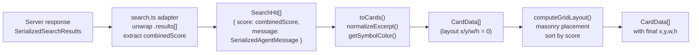

The adapter also supports the legacy flat-array format (`SearchHit[]` directly) for backwards compatibility. This means the visualizer works against both old and new server versions without configuration.

---

## 4.3 Search History & Autocomplete

> **Hook internals**: [ui/archi-context-core-visualizer-ui.md §3.4](ui/archi-context-core-visualizer-ui.md#34-usesearchhistory--query-fifo-queue)

The search bar includes a **localStorage-backed search history** feature with autocomplete:

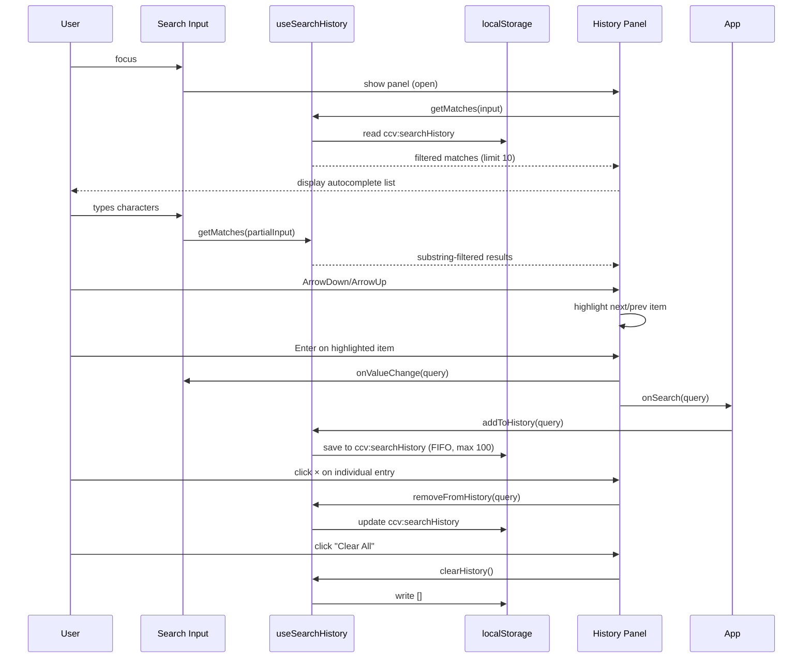

**Key features:**
- **100-entry FIFO queue**: New searches push to front, oldest entries drop when limit exceeded
- **Case-insensitive deduplication**: Same query (ignoring case) moves to front rather than creating duplicate
- **Substring filtering**: Autocomplete shows entries where `query.toLowerCase().includes(input.toLowerCase())`
- **Individual deletion**: Each entry has a × button (`removeFromHistory(query)`)
- **Bulk deletion**: "Clear All" button wipes entire history
- **Keyboard navigation**: Arrow keys highlight, Enter selects, Escape closes
- **Panel positioning**: Wrapped in `.search-input-container` (position: relative) so panel appears directly below search input, not shifted to left edge of search bar

The panel conditionally renders only when:
1. `isHistoryPanelOpen === true` (set on input focus, cleared on blur/escape/selection)
2. `historyMatches.length > 0` (has matching entries)
3. `!isSearchDisabled` (active view is a search view)

---

## 4.4 LOD-Aware HoverPanel Layout

> **Component detail**: [ui/archi-context-core-visualizer-ui.md §4.4](ui/archi-context-core-visualizer-ui.md#44-hoverpanel)

The HoverPanel adapts its content layout based on the current zoom level (`k`) to avoid redundancy:

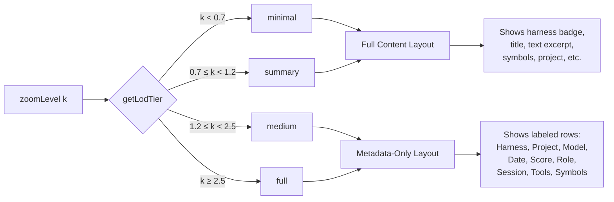

**Rationale**: At medium and full zoom (k ≥ 1.2), the card itself is large enough to read title and text directly. The HoverPanel duplicating this information wastes space. Instead, it switches to a **metadata-only layout** showing structured data that isn't visible on the card at those zoom levels.

**Metadata-only layout** (`.hover-panel-meta`):
- **Harness**: Badge with color
- **Project**: Project name or "MISC"
- **Model**: Model identifier (e.g., "claude-sonnet-4-5")
- **Date**: Formatted timestamp
- **Score**: Raw `combinedScore` with 2 decimal places (not fabricated percentage)
- **Role**: "user" or "assistant"
- **Session**: First 12 characters of sessionId
- **Tools**: Count + comma-separated tool names (if any tool calls)
- **Symbols**: Count of symbols

Each row uses `.hover-meta-row` (flex, baseline-aligned) with `.hover-meta-label` (64px width, uppercase, muted) + value span. Session ID uses monospace font (`.hover-session-id`).

This layout change was implemented to reduce visual clutter and provide complementary information rather than redundant information at high zoom levels.

---

## 5. The D3 Engine in Detail

### 5.1 SVG DOM Structure

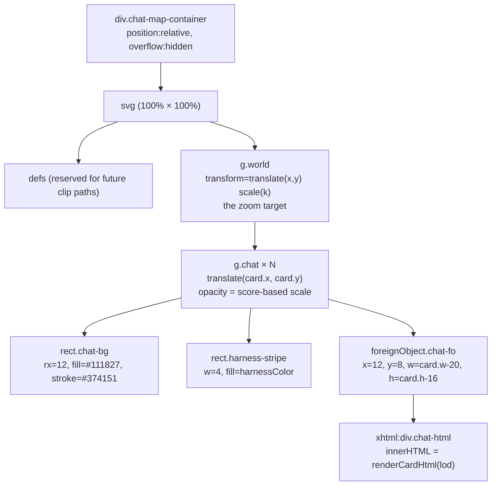

`foreignObject` is the critical choice here. It allows fully styled HTML (coloured `<span>` symbols, text overflow, wrapping) to live inside the SVG zoom world with no coordinate conversion overhead. The alternative — pure SVG `<text>` — would require manual word-wrapping and cannot use CSS flexbox for symbol chips.

### 5.2 Zoom System

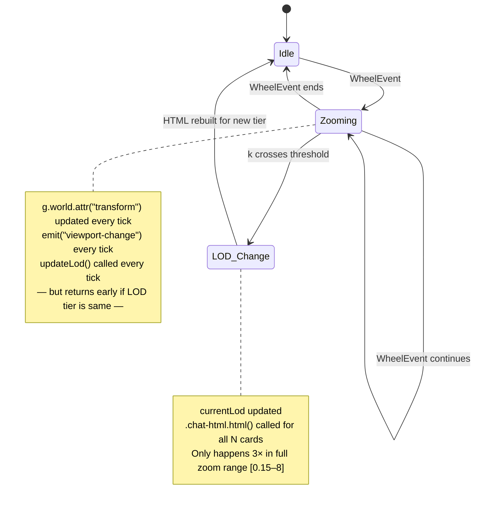

**v1.1 fix — LOD guard**: prior to the fix, `updateLod()` re-serialised `renderCardHtml()` for every card on every wheel tick — a **O(N × card HTML length)** operation. The guard `if (!force && lod === currentLod) return;` reduces this to at most 3 rebuilds per zoom gesture (at the `0.7`, `1.2`, and `2.5` thresholds).

| Zoom `k` | LOD tier  | Content rendered per card                                     |
| -------- | --------- | ------------------------------------------------------------- |
| < 0.7    | `minimal` | Project name only (single div)                                |
| 0.7–1.2  | `summary` | Harness badge + title + project + date                        |
| 1.2–2.5  | `medium`  | Badge + title + up to 8 symbols + short excerpt               |
| ≥ 2.5    | `full`    | Badge + title + 24 symbols + project + model + medium excerpt |

### 5.3 Card Rendering Engine — Enter/Update/Exit

The data join uses `card.id` as the key function, which is essential for identity-preserving updates:

```typescript
world.selectAll<SVGGElement, CardData>("g.chat")
    .data(currentCards, (card) => card.id)
    .join(enter, update, exit)
```

- **Enter**: builds the full three-node subtree (bg rect + stripe + foreignObject)  
- **Update**: D3's default — returns existing nodes untouched; attributes are then set on the merged selection  
- **Exit**: removes stale nodes immediately (no exit transition at this scale)

Score-based opacity is applied to each `g.chat` group via a `d3.scaleLinear` mapping the actual score range `[min, max]` → `[1.0, 0.55]`. This makes best-match cards visually dominant without hiding any result.

---

## 6. React–D3 Bridge (`useChatMap`)

This hook is the most architecturally sensitive piece because it must prevent two failure modes simultaneously:

1. **Engine recreation on every callback change** (stale closure problem)
2. **Zoom state loss on data updates** (auto-fit on every render)

### 6.1 Pattern: Ref-stabilised Callbacks

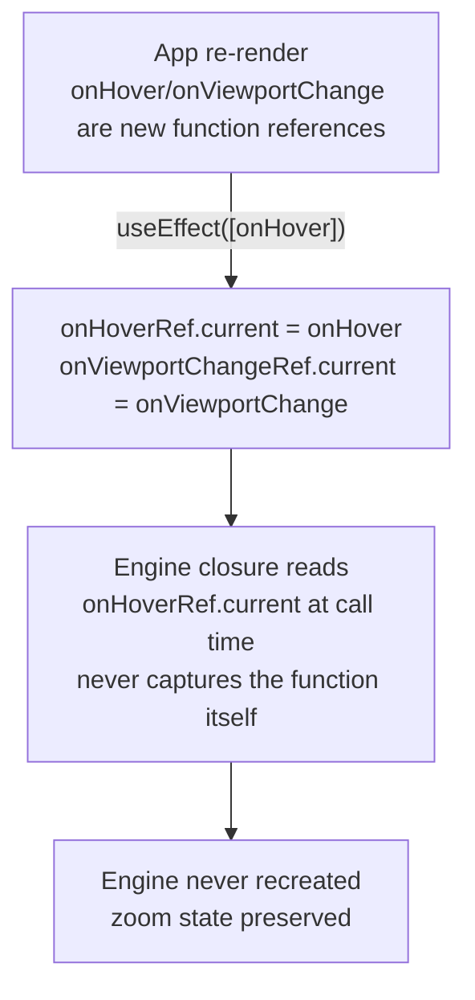

The init `useEffect` depends only on `[containerRef]`, which is a stable ref that never changes identity. This means the engine is created **exactly once** per mount.

### 6.2 Pattern: Signature-gated Zoom-to-Fit

`zoomToFit()` is called from the hook only when the result set actually changes — not on every card prop update. The comparison key is:

```
signature = `${cards.length}:${cards.slice(0,20).map(c => c.id).join("|")}`
```

This makes zoom-to-fit fire on new searches but not on hover state changes, resize cycles, or React re-renders that preserve the same card set.

### 6.3 Resize Handling

A `ResizeObserver` is attached to the container div and calls `engine.update(latestCardsRef.current)` on any size change. The `latestCardsRef` ref pattern ensures the resize handler always has access to the current card set without creating a new closure.

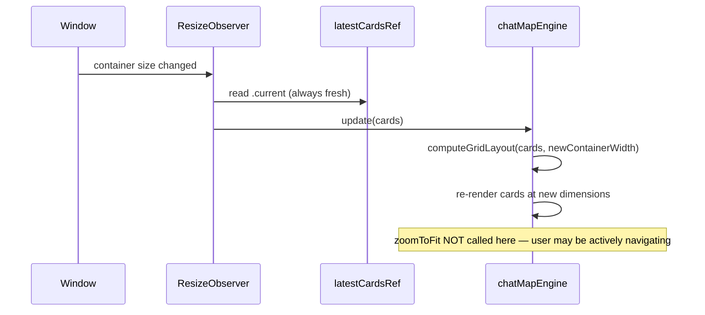

---

## 7. Layout Algorithm

`computeGridLayout` implements a **score-sorted masonry (column-balancing) grid**.

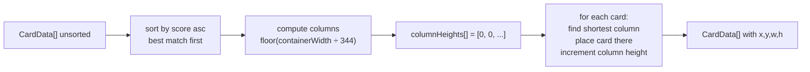

**Height estimation** (`estimateHeight`):

```
base = 120px
+ ceil(symbols.length / 6) × 16px   ← symbol chip rows
+ ceil(excerptMedium.length / 56) × 14px   ← text lines
clamped to [120, 280]
```

This is an approximation — the actual rendered height in the browser may differ slightly because the CSS truncates overflow. A future improvement would be to measure the rendered `foreignObject` content and relayout.

**Cards are sorted by score ascending** (best Fuse.js match first → lowest score number). This means the top-left portion of the map is always the most relevant content, which matches natural top-left reading bias.

---

## 8. Symbol Coloring

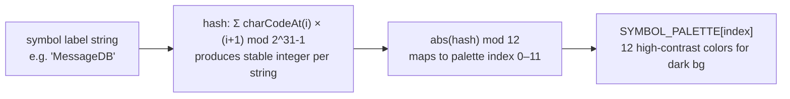

The hash function uses position-weighted character codes (`charCodeAt(i) * (i+1)`), which distinguishes strings like `"ab"` and `"ba"` that a naïve sum would conflate. The result is that **the same symbol name always maps to the same colour** across all cards and across searches — a key usability property for pattern scanning.

Harness colours are hard-coded:

| Harness    | Colour    | Purpose              |
| ---------- | --------- | -------------------- |
| ClaudeCode | `#f59e0b` | Amber — warmth       |
| Cursor     | `#8b5cf6` | Violet               |
| Kiro       | `#10b981` | Emerald              |
| VSCode     | `#3b82f6` | Blue (VS Code brand) |
| (unknown)  | `#6b7280` | Neutral grey         |

The 4px left-side `harness-stripe` on each card is the visible application of this palette at all LOD tiers, including `minimal` where no other content is shown.

---

## 9. Performance Analysis

### 9.1 Theoretical Complexity

| Operation                 | Complexity | Notes                                      |
| ------------------------- | ---------- | ------------------------------------------ |
| Initial render of N cards | O(N)       | D3 join, one DOM mutation per card         |
| Zoom tick (same LOD tier) | O(1)       | Only `g.world` transform attribute changes |
| LOD tier change           | O(N)       | `.chat-html.html(...)` for all N cards     |
| Resize → relayout         | O(N log N) | Sort + masonry pass                        |
| New search                | O(N log N) | Sort + layout + full D3 join               |

### 9.2 Observed Behaviour at Scale

- **2,219 cards rendered** on first test query — functionally correct but with stuttering.
- **Root cause of zoom stutter**: `updateLod()` was calling `.html(d => renderCardHtml(d, lod))` on every wheel tick, meaning ~2,200 string concatenations + innerHTML assignments per scroll event. Fixed in v1.1.
- **Root cause of zoom reset**: `requestAnimationFrame(() => zoomToFit())` was firing inside `update()`, which was called on every React render including hover state changes. Fixed in v1.1 with the signature guard.

### 9.3 Remaining Bottlenecks

1. **LOD tier crossing cost**: Replacing innerHTML for 2,000+ `foreignObject` nodes at once may still cause a visible frame drop at the transition points. Mitigation: use `requestIdleCallback` or batch in chunks of 100.

2. **`foreignObject` reflow cost**: Each `foreignObject` forces the browser to run a full HTML layout subtree for its content. At 2,000+ cards, even with lazy LOD, the initial render paint is expensive. Mitigation: virtualise (only render cards inside the current viewport frustum).

3. **`pointermove` frequency**: Every mouse movement fires `emit("chat-hover")` → `onHoverRef.current()` → React state update → React re-render. This is fine for the hover panel (which uses `position: fixed`) but triggers App re-renders. Mitigation: throttle pointermove to 60fps with a `requestAnimationFrame` gate.

4. **Masonry `Math.min(...columnHeights)`**: Uses spread into `Math.min`, which is O(columns) per card. For 2,000 cards with 6 columns, that is 12,000 comparisons. Acceptable now; switch to a min-heap if column count grows large.

---

## 10. State Model

> **Hook internals and localStorage contract**: [ui/archi-context-core-visualizer-ui.md §3](ui/archi-context-core-visualizer-ui.md#3-hooks) · [§6](ui/archi-context-core-visualizer-ui.md#6-localstorage-contract)

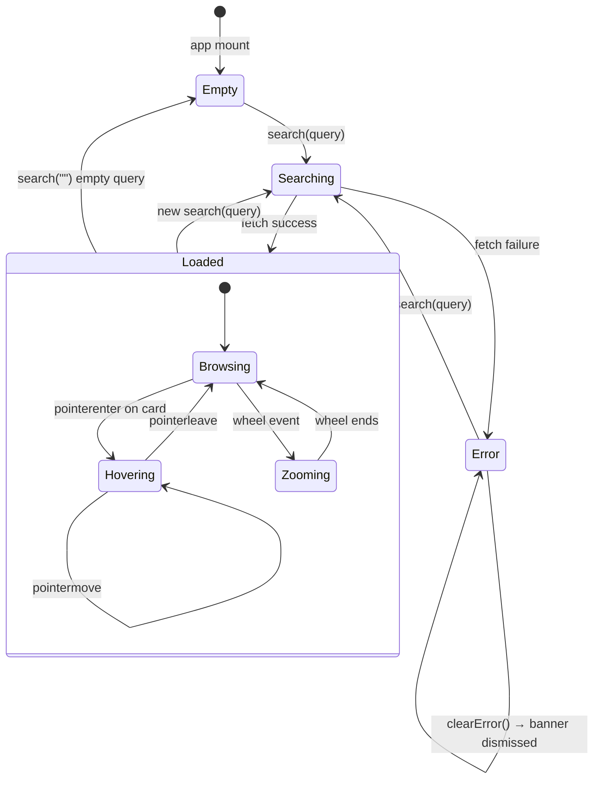

### 10.1 React State Inventory

| State                   | Owner              | Type                       | Notes                                                                     |
| ----------------------- | ------------------ | -------------------------- | ------------------------------------------------------------------------- |
| `views`                 | `useViews`         | `ViewDefinition[]`         | Includes built-ins + user views                                           |
| `activeViewId`          | `useViews`         | `string`                   | Persisted selected view (defaults/falls back to `built-in-latest`)        |
| `favorites`             | `useFavorites`     | `FavoriteEntry[]`          | Cross-view starred card snapshots                                         |
| `history`               | `useSearchHistory` | `string[]`                 | Search query history (max 100, FIFO, ccv:searchHistory in localStorage)   |
| `query`                 | `useSearch`        | `string`                   | Last submitted query                                                      |
| `results`               | `useSearch`        | `SearchHit[]`              | Normalised from server's `SerializedSearchResults` by `search.ts` adapter |
| `cards`                 | `useSearch`        | `CardData[]`               | Transformed, layout-ready                                                 |
| `isLoading`             | `useSearch`        | `boolean`                  |                                                                           |
| `error`                 | `useSearch`        | `string \| null`           |                                                                           |
| `latencyMs`             | `useSearch`        | `number \| null`           | `performance.now()` delta                                                 |
| `hasSearched`           | `useSearch`        | `boolean`                  | Controls empty-state overlay                                              |
| `hoverDetail`           | `App`              | `HoverEventDetail \| null` |                                                                           |
| `viewport`              | `App`              | `ViewportChangeDetail`     | `{x, y, k}`                                                               |
| `isEditResultsViewOpen` | `App`              | `boolean`                  | Add/edit view modal visibility                                            |
| `isFavoritesPickerOpen` | `App`              | `boolean`                  | Favorites target picker visibility                                        |

### 10.2 D3 Engine Mutable State (closure variables)

| Variable                   | Type               | Notes                                    |
| -------------------------- | ------------------ | ---------------------------------------- |
| `currentCards`             | `CardData[]`       | Set by most recent `update()` call       |
| `currentTransform`         | `d3.ZoomTransform` | Kept in sync by zoom event handler       |
| `currentLod`               | `LOD`              | Guards against unnecessary HTML rebuilds |
| `worldWidth / worldHeight` | `number`           | Updated by `update()` from layout bounds |

---

## 11. Component Interface Summary

> **Component responsibilities and modal flows**: [ui/archi-context-core-visualizer-ui.md §4](ui/archi-context-core-visualizer-ui.md#4-components)

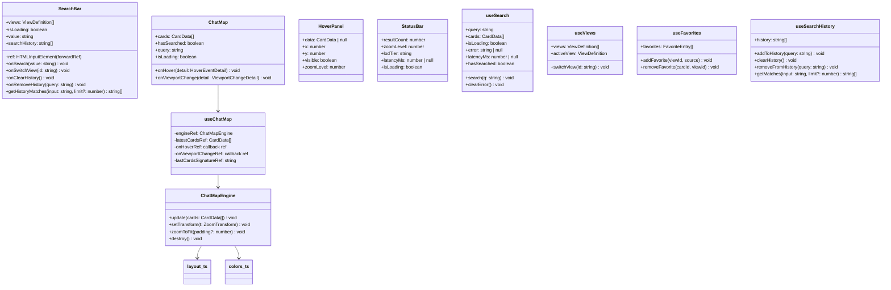

---

## 12. Deployment Model

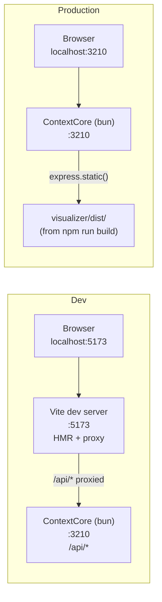

**Dev**: Vite proxies `/api/*` to `:3210`. Frontend and backend are separate processes but appear same-origin in the browser.

**Production**: `npm run build` (or `npm run build:viz` from repo root) emits to `visualizer/dist/`. The Express server at `:3210` serves these static assets via `express.static("visualizer/dist")` registered after the API routes. There is no CORS configuration required because both the API and the SPA are served from the same origin.

The root `package.json` carries a `build:viz` convenience script so CI can build the frontend as part of the backend pipeline without navigating into the subdirectory.

---

## 13. Security Notes

### 13.1 XSS in `foreignObject`

The engine reconstructs `innerHTML` for every card at LOD transitions. All user-derived strings (message text, symbols, project names, model names, subject lines) are processed through `escapeHtml()` before being embedded. The function handles the five critical HTML entities: `&`, `<`, `>`, `"`, `'`.

**Risk**: colour values passed directly into `style="background-color:..."` attributes are sourced from the hard-coded `HARNESS_COLORS` map (never from user data), so CSS injection is not possible there. `SYMBOL_PALETTE` is also static. Symbol labels are escaped before insertion but their colour is a palette lookup, not the label itself — this is correct.

**Remaining risk**: the `symbol.color` value in `renderSymbols` is passed as `style="color:${symbol.color}"` without sanitisation. This color value originates from `getSymbolColor()` which always returns a hex string from the static `SYMBOL_PALETTE` array, so it is safe. However, if `CardData` were ever constructed from untrusted sources (e.g. injected at the hook layer), a malicious color value could inject arbitrary CSS. A defensive `escapeAttr` guard on the color string before use in `style=` would prevent this.

---

## 14. Known Issues & Gaps (post-v2)

| Issue                                          | Severity                     | Root Cause                                  | Recommended Fix                                                 |
| ---------------------------------------------- | ---------------------------- | ------------------------------------------- | --------------------------------------------------------------- |
| LOD transition jank at large N                 | Medium                       | Synchronous innerHTML for all N nodes       | Batch updates in idle callbacks or virtualise visible cards     |
| Mouse-out resets zoom to ~0.1x                 | Fixed (v1.1)                 | `zoomToFit` called on every `update()`      | Fixed: signature guard + removed auto-fit from `update()`       |
| Wheel zoom sluggish & stuttery                 | Fixed (v1.1)                 | `updateLod` running full rebuild every tick | Fixed: `if (lod === currentLod) return` guard                   |
| Engine recreated on hover                      | Fixed (v1.1)                 | `useEffect` depended on callback refs       | Fixed: stable init effect + callback ref pattern                |
| HoverPanel duplicates card content at high LOD | Fixed (v2.1)                 | Same layout shown at all zoom levels        | Fixed: LOD-aware layout — metadata-only at medium/full zoom     |
| Score shown as fake percentage                 | Fixed (v2.1)                 | `(1 - score) * 100` formula had no meaning  | Fixed: Display raw `combinedScore.toFixed(2)`                   |
| No search history / autocomplete               | Fixed (v2.1)                 | Feature didn't exist                        | Fixed: Added `useSearchHistory` + autocomplete panel            |
| No viewport frustum culling                    | Low (now), High (10k+ cards) | All N cards always in DOM                   | Implement D3 octree / viewport intersection filter              |
| `pointermove` causes React render              | Low                          | No throttle on hover updates                | Throttle to rAF boundary                                        |
| Card height estimated, not measured            | Low                          | `estimateHeight()` approximation            | Post-render measurement pass or CSS `min-content`               |
| View dropdown is custom UI (not native select) | Low                          | Needed for swatch + keyboard UX             | Keep ARIA/listbox behavior audited in future accessibility pass |
| `bun start` exits with code 1                  | Backend (unrelated)          | Backend crash on startup                    | Investigate `src/server/index.ts`                               |

---

## 15. Extension Points

The architecture was designed to be open for several planned enhancements without breaking the existing module boundaries:

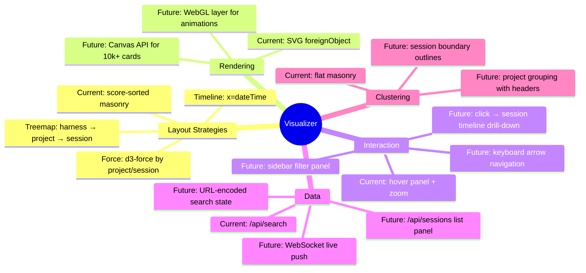

The key extension seam is `layout.ts`: the `computeGridLayout` function can be replaced with any other algorithm that assigns `x, y, w, h` to each `CardData` without touching the engine, components, or hooks. The engine's `update()` method calls into it via its imported reference — swapping to a force or timeline layout is a single-file change.

---

## 16. Conclusion

The ContextCore Visualizer now supports both the original map-search workflow and a multi-view workspace model with persistent user configuration. The React + D3 split remains clean, and the new view/favorites features were added without coupling D3 internals to application state.

The most important architectural decisions made during implementation:

1. **Closure-based D3 engine** over a class: avoids `this` binding issues with D3's callback-heavy API and makes the public surface explicit.
2. **`foreignObject` for card content** over SVG text: unlocks CSS layout, flexbox symbol chips, and text overflow without implementing a text-wrapping algorithm.
3. **LOD guard on every zoom tick**: the single most impactful performance fix — reduces O(N) DOM work to O(1) for the common case of continuing to zoom within a tier.
4. **Callback refs in the bridge hook**: prevents the engine from being torn down and recreated when App re-renders due to hover state, which would lose zoom position.
5. **Signature-gated zoom-to-fit**: allows resize and hover to call `engine.update()` freely without fighting the user's manually navigated zoom level.
