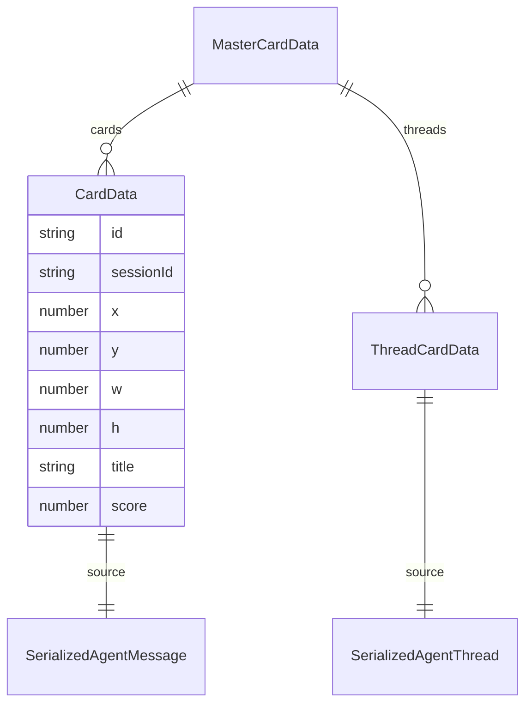
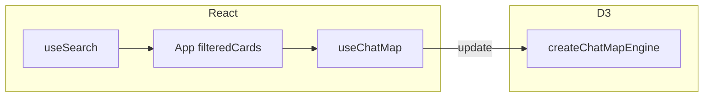
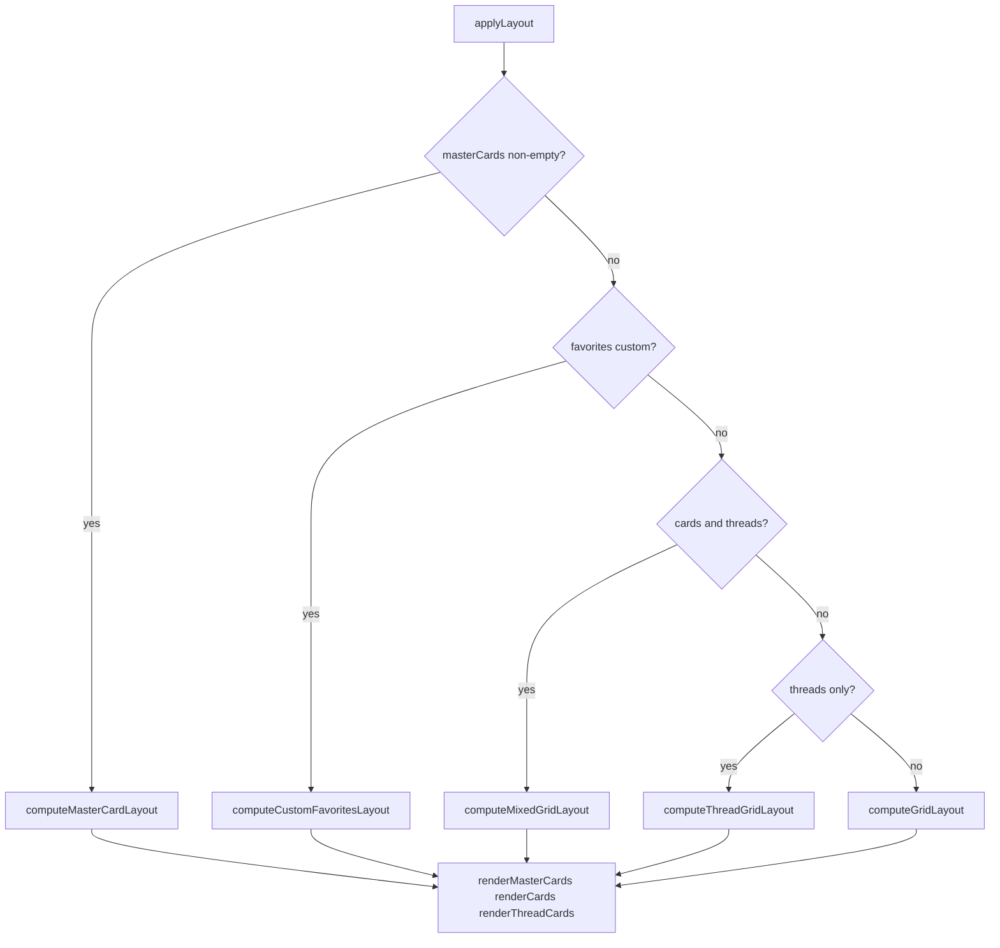
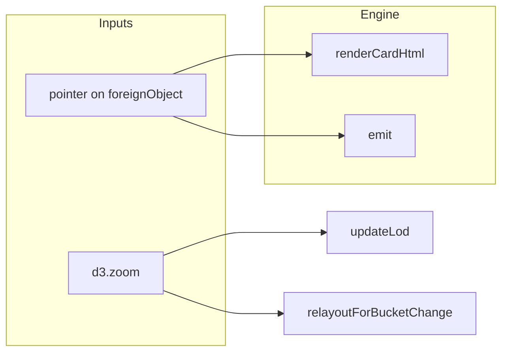

# ContextCore Visualizer — Cards: Architecture

**Date**: 2026-05-13  
**Scope**: **`CardData`**, **`ThreadCardData`**, **`MasterCardData`**, and how **`createChatMapEngine`** (`visualizer/src/d3/chatMapEngine.ts`) lays out, renders, and emits pointer events for map cards. Upstream shaping in **`useSearch`** / **`groupIntoMasterCards`** is summarized only where it feeds the engine.  
**Core files**: [`visualizer/src/types.ts`](../../../src/types.ts) (card-related types), [`visualizer/src/d3/chatMapEngine.ts`](../../../src/d3/chatMapEngine.ts), [`visualizer/src/d3/layout.ts`](../../../src/d3/layout.ts).  
**Relates to**: [`archi-context-core-visualizer-ui.md`](./archi-context-core-visualizer-ui.md) (`useChatMap`, `ChatMap`), [`archi-favorites-ui.md`](./archi-favorites-ui.md) (custom favorites layout, drag, **`layoutPosition`**), [`archi-search-ui.md`](./archi-search-ui.md) (search hit → card pipeline).

---

## 1. Executive summary

The map is an **SVG** world (`g.world`) of **message cards** (`g.chat` + **`CardData`**), **thread cards** (`g.thread` + **`ThreadCardData`**), and optional **grouped master cards** (`g.mastercard` + **`MasterCardData`**). React passes plain JSON-ish arrays into **`engine.update(cards, threadCards, masterCards)`**; the engine **mutates copies with `x,y,w,h`**, paints **HTML inside `foreignObject`**, and bridges user gestures back via **`onEvent`** + DOM **`CustomEvent`**. **LOD** (level of detail) is derived from **zoom scale `k`**: coarse zoom shows titles and short excerpts; fine zoom shows full **`source.message`** and richer thread excerpts. **Layout** chooses among masonry grids, mixed card+thread grids, master-card packing, or **custom favorites** world coordinates. **Star state** is a **`Set<string>`** of ids overlaid on per-line star icons.

---

## 2. Domain types (`types.ts`)

### 2.1 Canonical payloads

| Type | Role |
| ---- | ---- |
| **`SerializedAgentMessage`** | Full agent message from search/API: **`id`**, **`sessionId`**, **`role`**, **`model`**, **`subject`**, **`message`**, **`symbols`**, **`tags`**, **`toolCalls`**, etc. |
| **`SerializedAgentThread`** | Thread aggregate: **`sessionId`**, **`subject`**, **`firstMessage`**, **`matchingMessageIds`**, scores, counts, date range. |

### 2.2 `CardData` — one message card on the map

**Identity & placement**: **`id`** (message id), **`sessionId`**, **`x,y,w,h`** (world space; **`w`** is usually **`LAYOUT_CARD_WIDTH`** (320) after layout).

**Display fields** (set before D3; engine reads these for HTML, not raw `source` alone): **`title`**, **`harness`**, **`project`**, **`model`**, **`role`**, **`dateTime`**, **`score`**, **`hits`**, **`symbols`** (`SymbolEntry[]` with colors), **`excerptShort` / `excerptMedium` / `excerptLong`**.

**Full row for dialogs / copy / star**: **`source: SerializedAgentMessage`**.

**Optional overlays**: **`customColor`**, **`customEmoji`** (favorites custom line), **`agentPath`**, **`codexEntryId`**, **`platforms`** (agent-list GH/CL/CX badges), **`contentDiverged`**, **`fileSize`**, **`favoriteSource`** (taller min height in **`layout.ts`**), **`layoutPosition`** (favorites persisted **`{x,y}`**).

### 2.3 `ThreadCardData` — one thread card

**Identity**: **`id`** equals **`sessionId`** after **`useSearch`’s `toThreadCards`**. Same **`x,y,w,h`**, **`title`**, **`score`**, **`hits`**, **`source: SerializedAgentThread`**, optional **`favoriteSource`**, **`layoutPosition`**.

### 2.4 `MasterCardData` — scope / project grouping

**Container**: **`id`**, **`label`**, **`emoji`**, **`color`**, **`kind`**: `"scope"` \| `"project"`, plus nested **`cards[]`** and **`threads[]`**. Layout writes **`x,y,w,h`** on the master and **absolute `x,y` on children** (children are still rendered as **flat** `g.chat` / `g.thread` siblings in the world for simpler picking).

---

## 3. Upstream: how `CardData` reaches the engine

React **`useSearch`** (and grouping in **`App`** via **`groupIntoMasterCards`**) builds **`CardData[]`**, **`ThreadCardData[]`**, and optionally **`MasterCardData[]`**. **`useChatMap`** holds refs and calls **`engine.update(filteredCards, filteredThreads, masterCards)`** when those arrays change. The engine stores them as **`sourceCards` / `sourceThreads` / `sourceMasterCards`** and runs **`applyLayout`**.

---

## 4. Engine configuration

**`EngineConfig`** (`chatMapEngine.ts`):

| Field | Purpose |
| ----- | ------- |
| **`cardRenderMode`** | `"default"` \| `"agent-builder"` \| `"agent-list"` \| `"template-list"` — controls header buttons and **`renderExcerptLines`** per-line actions. |
| **`favoritesCardPositioning`** | Carried for logging/consistency; favorites custom layout is driven primarily by **`favoriteMapViewId`**. |
| **`favoriteMapViewId`** | Non-empty on an active favorites tab → **`isFavoritesCustomLayout()`** enables **`computeCustomFavoritesLayout`**, pan filter, and drag **`card-position-change`** payloads. |

**`setConfig(partial)`** merges config; if **`cardRenderMode`** changes, HTML is re-rendered at current LOD. If layout drivers change, **`applyLayout`** re-runs on **`source*`** arrays.

---

## 5. Layout pipeline (`applyLayout`)

**Order of branches** in **`chatMapEngine.ts`**:

1. **`masterCards.length > 0`** → **`computeMasterCardLayout`**; flatten children into **`currentCards` / `currentThreads`** for rendering; bounds from **`computeMasterCardWorldBounds`**.
2. Else **`isFavoritesCustomLayout()`** (non-empty **`favoriteMapViewId`**, no masters, at least one card or thread) → **`computeCustomFavoritesLayout`** + **`computeMixedWorldBounds`**.
3. Else **both** cards and threads → **`computeMixedGridLayout`**.
4. Else **threads only** → **`computeThreadGridLayout`**.
5. Else **cards only** → **`computeGridLayout`** ( **`forceSquare`** when **`cardRenderMode === "agent-builder"`** ).

**Layout width**: normally **`computeLayoutWidth(baseWidth, reflowBucket)`** widens virtual columns at low zoom so text reflows; **custom favorites** use **`baseWidth`** only (no zoom-width multiplier).

### 5.1 `layout.ts` responsibilities

| Function | Behavior |
| -------- | -------- |
| **`computeGridLayout`** | Masonry by **ascending `score`**; column count from width; **`estimateHeight(card)`** using excerpts + symbols; **`favoriteSource`** raises floor height. |
| **`computeThreadGridLayout`** | Same pattern with **`estimateThreadHeight`**. |
| **`computeMixedGridLayout`** | Merges cards + threads into one score-sorted stream, assigns columns. |
| **`computeCustomFavoritesLayout`** | For each id: if **`layoutPosition`** valid → use **`x,y`**; else slot from auto **`computeMixedGridLayout`** on stripped geometry. |
| **`computeMasterCardLayout`** | Vertical stack of masters; per-master internal masonry; **child `x,y` include master offset**. |
| **`computeWorldBounds` / `computeMixedWorldBounds` / `computeMasterCardWorldBounds`** | World size for zoom/pan limits. |

---

## 6. SVG structure and data join

Each **`g.chat`** group:

- **`rect.chat-bg`**, **`rect.harness-stripe`**, **`rect.hits-bar`** (visual chrome).
- **`foreignObject.chat-fo`** → **`div.chat-html`** — inner HTML from **`renderCardHtml`**.
- **`text.card-emoji-text`** for custom emoji overlay when zoomed out.

**`g.thread`** mirrors with **`rect.thread-bg`**, **`foreignObject`**, **`div.thread-html`**.

**`join`** uses **`(d) => d.id`** for stable identity across updates.

---

## 7. LOD and HTML content

**`getLod(k)`** returns **`minimal` → `detail-5`** from zoom **`k`**.

**`updateLod`** compares new LOD to **`currentLod`**; on change, rewrites **`.chat-html` / `.thread-html`** innerHTML from **`renderCardHtml` / `renderThreadCardHtml`**.

**Message card (`renderCardHtml`)**:

- Builds harness / project badges (and **platform badges** in agent-list).
- Header actions: default → envelope (+ custom **✏️** for harness **`custom`**); agent-builder → knowledge-only lines; agent-list / template-list → edit / use-template buttons.
- LOD gates which excerpt string is fed to **`renderExcerptLines`**: medium LOD uses **`excerptMedium` / `excerptLong`**; **`detail-3+`** uses full **`card.source.message`**.

**`renderExcerptLines`**: splits message text into lines; every 10th visible line shows an action column (**💾 / ★ / 📋** in default; agent-builder **💾** only; list modes spacer).

**Threads (`renderThreadCardHtml`)**: LOD expands **`firstMessage`** slice length; title, stats, star; **`thread-star-btn`**, **`thread-title`**.

**Opacity**: message cards scale opacity slightly by **score**; hits bar scales by **`hits`**.

---

## 8. Zoom, reflow buckets, and viewport

**`d3.zoom`** transforms **`g.world`**. On **`zoom`**:

- **`updateLod(k)`** for HTML fidelity.
- **`relayoutForBucketChange(getReflowBucket(k))`** unless suspended or applying a programmatic transform.

**Reflow bucket**: below **`k < 1`**, discrete buckets **`floor(k / 0.3)`** drive **`computeLayoutWidth`** so card **width** in world units grows as you zoom out (masonry reflow). At **`k >= 1`**, bucket is locked so panning does not thrash layout.

**`isFavoritesCustomLayout()`**: **`relayoutForBucketChange`** becomes a **no-op** for position reflow (zoom does not rearrange favorites world positions).

**Emitted**: **`viewport-change`** `{ x, y, k }` for **`StatusBar`** / **`HoverPanel`** clamping.

---

## 9. Pointer events and engine event map

Clicks on **`foreignObject`** HTML are wired on **`g.chat` / `g.thread`** (delegation). Typical flows:

- **`.line-add-btn`** → **`line-click`** or **`card-add-knowledge`** (agent-builder).
- **`.line-star-btn`** → **`line-star`** with **`FavoriteSource`**.
- **`.chat-title` / `.thread-title`** → **`title-click`**.
- **`.card-envelope-btn`** → **`copy-json`**.
- **Card body** → **`chat-click`** / **`thread-click`**.
- **Hover** → **`chat-hover`** / **`thread-hover`** with positions.

**Favorites drag** (when custom layout): **`d3.drag`** on **`g.chat` / `g.thread`**, world pointer via **`getDragWorldPoint`**, **`syncSourceLayoutFromDrag`** updates **`source*`** + **`layoutPosition`**, end emits **`card-position-change`**.

**`EngineEventMap`** (subset): **`chat-hover`**, **`chat-click`**, **`thread-hover`**, **`thread-click`**, **`viewport-change`**, **`line-click`**, **`card-star`**, **`line-star`**, **`thread-star`**, **`title-click`**, **`card-add-knowledge`**, **`card-edit-agent`**, **`card-use-template`**, **`copy-json`**, **`copy-msg`**, **`card-position-change`**.

---

## 10. `MasterCardData` and LOD tier for headers

**`getMastercardTier(k)`** selects header typography density. **`updateLod`** refreshes **`mastercard-header-wrap`** HTML when tier changes.

---

## 11. Public engine API (`ChatMapEngine`)

| Method | Role |
| ------ | ---- |
| **`update(cards, threadCards?, masterCards?)`** | Replaces **`source*`** and runs **`applyLayout`**. |
| **`setStarredIds(Set)`** | Re-renders card/thread HTML for ★/☆. |
| **`setConfig(partial)`** | Mode + favorites ids; may relayout + re-html. |
| **`setTransform`**, **`resetViewportToTop`**, **`zoomToFit`**, **`zoomToItem`** | Camera helpers (double-click title uses **`zoomToItem`**). |
| **`destroy()`** | Tear down listeners / SVG. |

---

## 12. Invariants and pitfalls

- **`CardData.id`** is the **message id** for search/favorites message cards; **`ThreadCardData.id`** is usually **`sessionId`** — star sets and **`title-click`** handlers must use the same ids the engine uses.
- **`source`** must stay consistent with **`title`** / excerpts for trust; **`renderCardHtml`** at high LOD reads **`source.message`** directly.
- **`foreignObject`** breaks **`closest("g.chat")`** for some browsers — favorites pan filtering and **`getNearestGroup`** use **`composedPath`**, parent walk, and **`elementsFromPoint`** fallbacks.
- Layout functions **return new objects** with **`x,y,w,h`**; drag **mutates `source*`** in place for **`layoutPosition`** sync.

---

## 13. File index

| Topic | Path |
| ----- | ---- |
| Card types | `visualizer/src/types.ts` |
| Engine | `visualizer/src/d3/chatMapEngine.ts` |
| Layout math | `visualizer/src/d3/layout.ts` |
| Colors for badges | `visualizer/src/d3/colors.ts` |
| React bridge | `visualizer/src/hooks/useChatMap.ts` |
| Shell | `visualizer/src/components/searchView/ChatMap.tsx` |
| Card-adjacent CSS | `visualizer/src/index.css`, `ChatMap.css` |

---

## 14. Related docs

- **Favorites-only behavior** (pan filter, drag, **`favoriteMapViewId`**, Workbox): [`archi-favorites-ui.md`](./archi-favorites-ui.md).  
- **App wiring and modals**: [`archi-context-core-visualizer-ui.md`](./archi-context-core-visualizer-ui.md).
