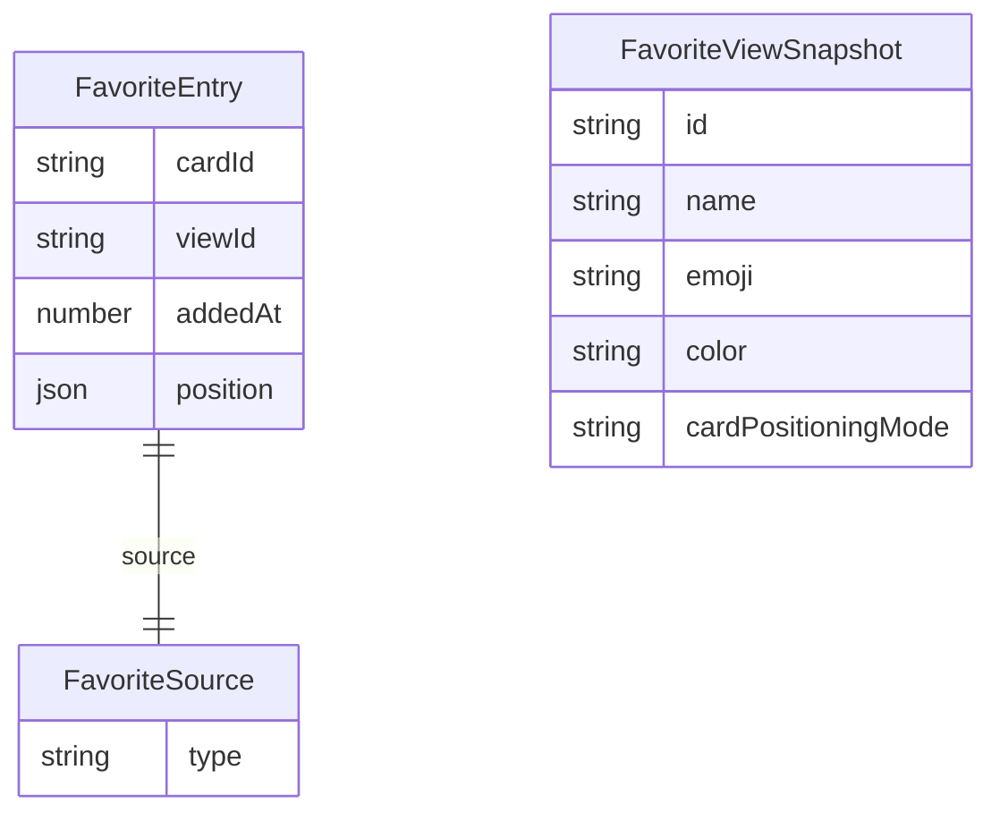
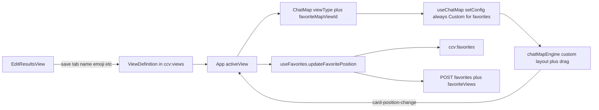
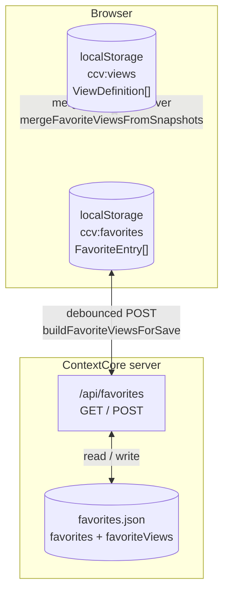
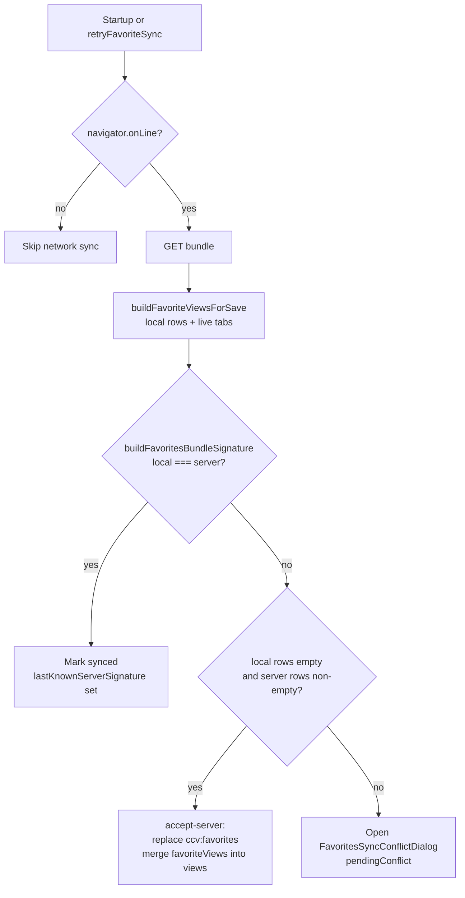
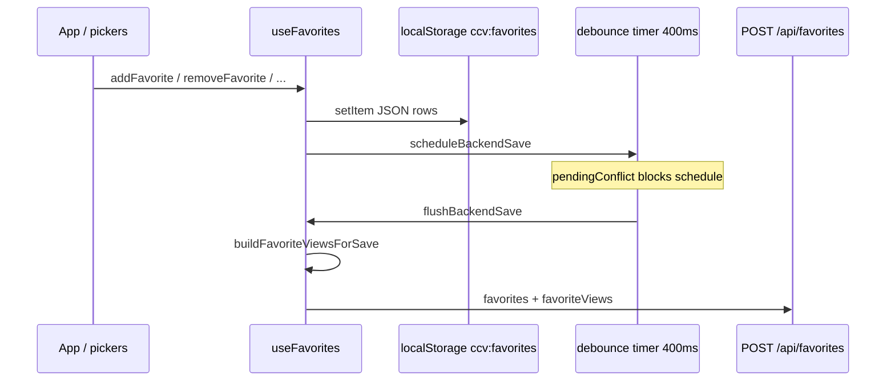
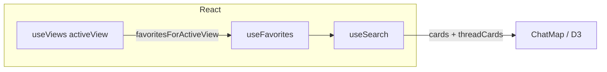
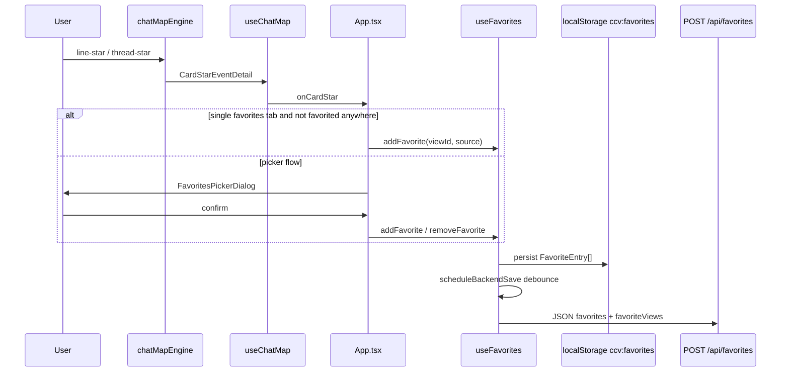
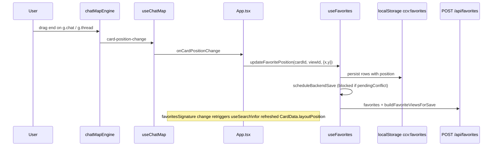
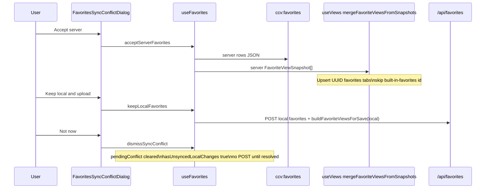

# ContextCore Visualizer — Favorites: Architecture

**Date**: 2026-05-13  
**Last updated**: 2026-05-13 — custom favorites map (pan/drag/viewport, Workbox **`/api/favorites`**, signatures, optional **`ccv:debugFavDrag`**); **`ChatViewDialog`** **`favoriteSource`** snapshot on favorites title click; D3 drag **`Subject`** typing + **`getDragWorldPoint`** parameter widening (`chatMapEngine.ts`).
**Scope**: Favorites-type views, `ccv:favorites` cache, server `favorites.json` bundle, REST sync and conflict resolution, map starring UI, D3 **custom favorites** layout (`computeCustomFavoritesLayout`), **`FavoriteEntry.position`**, `useSearch` / `ChatMap` / `useChatMap` / `chatMapEngine` integration, PWA runtime cache for favorites API, **full-card / thread read UI from snapshot** (`ChatViewDialog` + `App.handleTitleClick`).  
**Relates to**: [`archi-context-core-visualizer-ui.md`](./archi-context-core-visualizer-ui.md) (orchestration, hooks index), [`archi-context-core-visualizer.md`](../archi-context-core-visualizer.md) (layered topology).

---

## 1. Purpose

Favorites let users snapshot **messages** and **threads** into one or more **favorites-type views** (`ViewDefinition` with `type === "favorites"`). Each row is a denormalized **`FavoriteEntry`** so starred items survive upstream DB changes. **On the map, every favorites tab uses the same behavior:** a **custom world layout** — cards keep world **`x,y`** (from saved **`FavoriteEntry.position`** when present, otherwise auto slots from `computeCustomFavoritesLayout`), **zoom does not reflow masonry**, **pan applies only to empty canvas** (not when starting a gesture on card HTML), and **drag** moves the card in world space and persists on release.

The type system and server bundle still carry **`cardPositioningMode`** on **`ViewDefinition`** / **`FavoriteViewSnapshot`** (always normalized to **`CustomCardPositioning`** for favorites-type tabs in **`useViews.normalizeView`**). There is **no** SearchBar toggle and **no** Edit modal radio for layout mode; **EditResultsView** still saves **`CustomCardPositioning`** on favorites saves so **`favoriteViews`** in `POST /api/favorites` stays consistent.

**Two-tier persistence:**

- **Browser**: `localStorage` key **`ccv:favorites`** holds **`FavoriteEntry[]`** only. It is the **offline cache** and updates **synchronously** on every mutation.
- **ContextCore server**: **`{storage}/.settings/favorites.json`** holds a **bundle** — favorite **rows** plus **view metadata** (`favoriteViews`) so another machine or a raw JSON upload still shows **human-readable tab names** and can **import unknown `viewId`s** as real tabs after sync.

When online, the visualizer **reconciles** local rows + derived view snapshots against the server bundle. If they **diverge**, the user must choose **server** or **local** before either side is overwritten (except the fast path: **local rows empty, server has rows** → auto-accept server).

**Title → “session” dialog:** On non-favorites views, clicking a card **subject** (chat title) still opens **`ChatViewDialog`** and loads the live session via **`fetchSessionMessages(sessionId)`**. On a **favorites** tab, the same D3 **`title-click`** event is handled in **`App.handleTitleClick`**: the app resolves the clicked **message** or **thread** card from the same lists the map uses (**`locallyFilteredCards`** / **`locallyFilteredThreadCards`**), attaches the row’s **`FavoriteSource`** to **`chatViewTarget.favoriteSource`**, and passes it into **`ChatViewDialog`**. The dialog then **skips the API** and renders a **read-only snapshot** (subject, body, context/history/tags/symbols/rationale/tool calls for messages; subject, first excerpt, dates, matching ids, scores for threads). That avoids an empty **“Chat session”** shell for **custom** favorites, **offline** snapshots, or sessions that no longer exist on the server. See **§7.7**.

---

## 2. Data Model

### 2.1 `FavoriteSource`

Polymorphic snapshot (`visualizer/src/types.ts`):

| Variant     | Shape                                                 | `cardId` in `FavoriteEntry`                          |
| ----------- | ----------------------------------------------------- | ---------------------------------------------------- |
| `"message"` | `{ type: "message"; data: SerializedAgentMessage }`   | `SerializedAgentMessage.id`                          |
| `"thread"`  | `{ type: "thread"; data: SerializedAgentThread }`   | `SerializedAgentThread.sessionId` (see `addFavorite`) |

### 2.2 `FavoriteEntry`

```text
{ cardId, viewId, source: FavoriteSource, addedAt, position?: { x, y } }
```

- **`position`**: Optional world-space origin for the card when the owning view uses **`CustomCardPositioning`**. Omitted in **`Auto`** mode and for legacy rows. Sync treats position changes as row deltas (**`buildFavoritesSignature`** includes a `p` field per row).
- **`viewId`**: Owning favorites tab (`built-in-favorites` or user UUID tab from `useViews`).
- **Identity for sync diffs**: **`favoriteKey(entry)`** = `` `${viewId}::${cardId}` `` (`favoriteSync.ts`).
- **Uniqueness**: Same `(cardId, viewId)` cannot appear twice; `addFavorite` no-ops duplicates.

### 2.3 `FavoriteViewSnapshot`

Compact metadata for each favorites tab sent with the server bundle (`types.ts`, mirrored on server in `server/src/models/FavoriteEntry.ts`):

```text
{ id, name, emoji, color, cardPositioningMode?: "Auto" | "CustomCardPositioning" }
```

Built by **`buildFavoriteViewsForSave(entries, favoriteViewsDefinitions)`** in `favoriteSync.ts`: every current **`type === "favorites"`** tab, plus **synthetic** rows for any `viewId` that appears in **`entries`** but not in the live tab list (fallback name `Favorites (<8-char prefix>)`, positioning mode **`Auto`**). **`buildFavoriteViewsSignature`** includes each snapshot’s positioning mode so server vs local **view** diffs surface in **`decideFavoriteStartupSync`**.

### 2.4 `ViewDefinition` (favorites-type tabs)

Favorites-type views carry **`cardPositioningMode`** for bundle / storage compatibility. **`normalizeView()`** in `useViews.ts` **always** sets favorites tabs to **`CustomCardPositioning`** (legacy **`Auto`** rows in JSON are upgraded on read). Other view types strip **`cardPositioningMode`**. **`EditResultsView`** does not expose layout radios; saving a favorites-type view still sends **`CustomCardPositioning`** in the save payload.

### 2.5 Legacy `ccv:favorites` migration

On read (`useFavorites.safeReadFavorites`), entries whose `source` lacks `{ type: "message" | "thread" }` are wrapped as `{ type: "message", data: <legacy> }`.



### 2.6 CustomCardPositioning data flow (high level)



---

## 3. Storage and API

### 3.1 Locations

| Key / location | Owner | Content |
| -------------- | ----- | ------- |
| **`ccv:favorites`** | `useFavorites` | **`FavoriteEntry[]`** JSON only (offline cache; not the server bundle shape). |
| **`{storage}/.settings/favorites.json`** | `FavoriteStore` (server) | **Bundle**: `{ "favorites": FavoriteEntry[], "favoriteViews": FavoriteViewSnapshot[] }`. **Legacy**: bare JSON **array** = rows only, `favoriteViews` treated as `[]` on load. |
| **`GET` / `POST` `/api/favorites`** | `favoriteRoutes.ts` | JSON body / response uses **`favorites`** + **`favoriteViews`**. Legacy GET that returns a bare array is still accepted by `fetchFavorites()` (views default to `[]`). |
| **`ccv:views`** | `useViews` | Full **`ViewDefinition[]`** (favorites-type tabs carry **`cardPositioningMode`** normalized to **`CustomCardPositioning`**). |
| **`ccv:activeViewId`** | `useViews` | Last active view id. |

**PWA (production / dev with VitePWA):** `vite.config.ts` registers a **Workbox `runtimeCaching`** rule for **`/api/favorites`** (`NetworkFirst`) so the service worker does not log “No route found” when offline or when the SW intercepts favorites sync traffic.

### 3.2 Server POST validation

- **`favorites`**: required array; each element **`normalizeFavoriteEntry`**.
- **`favoriteViews`**: optional array; each element **`normalizeFavoriteViewSnapshot`**.
- **`ensureFavoriteViewCoverage`** (`favoriteRoutes.ts`): after validation, every **`viewId`** referenced by a row gets a snapshot row (server fills gaps so the file stays self-describing).



---

## 4. Hooks and App wiring

### 4.1 `useFavorites(options)`

**File**: `visualizer/src/hooks/useFavorites.ts`.

**Options** (from `App.tsx`):

| Option | Meaning |
| ------ | ------- |
| **`favoriteViewsForSync`** | `ViewDefinition[]` filtered to `type === "favorites"` (sorted by `createdAt`). Used to build **local** view snapshots for bundle comparison and POST bodies. |
| **`onMergeServerFavoriteViews`** | **`mergeFavoriteViewsFromSnapshots`** from `useViews` — runs when the user **accepts server** (or startup auto-accept) so server UUID tabs appear in **`ccv:views`**. |

**Exposed state (subset):** `favorites`, `storageError`, `syncError`, `isSyncing`, `isServerAvailable`, `hasUnsyncedLocalChanges`, `pendingConflict`, `isSavingConflictChoice`, `retryFavoriteSync`, conflict actions. **Mutations** include **`addFavorite`**, **`updateFavorite`**, **`updateFavoritePosition`**, **`removeFavorite`**, **`removeFavoritesForView`** — all respect **`pendingConflict`** for debounced POST scheduling (same as before for add/remove).

**Refs:** `favoriteViewsForSyncRef` / `onMergeServerFavoriteViewsRef` updated every render so **`runStartupSync`** does not need to depend on `views` (avoids re-fetching on every tab rename).

### 4.2 `useViews.mergeFavoriteViewsFromSnapshots`

**File**: `visualizer/src/hooks/useViews.ts`.

For each server **`FavoriteViewSnapshot`**:

- Skips **`built-in-favorites`** (built-in tab is not replaced from server JSON).
- If a **`favorites`**-type view with that **id** exists → **`normalizeView`** merges **`name`**, **`emoji`**, **`color`**, and **`cardPositioningMode`** from the snapshot.
- Else → appends a new **`favorites`** view with empty query, fresh **`createdAt`**, and **`cardPositioningMode`** from the snapshot (default **`Auto`**), then persists **`ccv:views`**.

### 4.3 `favoriteSync.ts` (pure helpers)

| Helper | Role |
| ------ | ---- |
| **`buildFavoritesSignature` / `buildFavoriteViewsSignature`** | Order-independent fingerprints for rows-only and views-only. Row signature includes **`p`** (position object or `null`). View signature includes **`p`** (positioning mode string, default **`Auto`**). |
| **`buildFavoritesBundleSignature(entries, views)`** | Single string: rows signature + **`|v:`** + views signature — **conflict detection** compares bundles, not rows alone. |
| **`decideFavoriteStartupSync(localRows, serverRows, localViews, serverViews)`** | **`same`** \| **`accept-server`** (local row count 0 and server has rows) \| **`ask-user`** + full **`FavoriteSyncConflict`**. |
| **`buildFavoritePerViewConflictRows` / `favoritePerViewRowHasDelta`** | Per-**`viewId`** counts and metadata deltas for the modal scroll list. |



---

## 5. Mutation path: local first, server debounced

1. **`addFavorite` / `updateFavorite` / `updateFavoritePosition` / `removeFavorite` / `removeFavoritesForView`** update React state and **`persistLocalFavorites`** immediately.
2. **`scheduleBackendSave`** queues a **400ms** debounced **`flushBackendSave`**.
3. If **`pendingConflict`** is set, **no POST** is scheduled (avoids overwriting during an unresolved conflict).
4. **`flushBackendSave`** builds **`buildFavoriteViewsForSave(toSave, favoriteViewsForSyncRef)`**, then **`saveFavorites(toSave, snapshots)`** (`POST` bundle).
5. On success, if the in-flight bundle signature still matches current state, **`hasUnsyncedLocalChanges`** clears and **`lastKnownServerSignatureRef`** updates.



---

## 6. Conflict modal (`FavoritesSyncConflictDialog`)

**File**: `visualizer/src/components/favorites/FavoritesSyncConflictDialog.tsx` + `.css`.

- **Overlay**: `position: fixed`, **`align-items: flex-start`**, **`padding-top: 24px`** (same shell idea as `EditResultsView`).
- **Dialog**: **`max-height: calc(100vh - 48px)`**, **`overflow: hidden`**, flex column — never grows past the viewport.
- **Global stats**: `FavoriteConflictSummary` (totals, only-on-server, only-local, changed snapshot count).
- **Per view**: scroll region **`fav-sync-per-view-scroll`** with **`max-height: min(320px, calc(100vh - 360px))`**; one card per **`viewId`** where **`favoritePerViewRowHasDelta`** is true (hides “quiet” tabs with no diff). View metadata equality (**`viewMetaEqual`**) includes **`cardPositioningMode`** so a server vs local tab that only differs by Auto vs Custom surfaces as a metadata change.
- **Actions**: Not now (dismiss), Keep local and upload (`saveFavorites` with local rows + local **`buildFavoriteViewsForSave`**), Accept server (replace rows + **`onMergeServerFavoriteViews`**).

**StatusBar** (`App.tsx`): when there is a **`favoritesSyncError`** and no higher-priority storage banner, a **Retry** control calls **`retryFavoriteSync`** (re-runs the same GET + decision path after reconnect).

---

## 7. Access paths (user and code)

### 7.1 Switching to a favorites view

1. **SearchBar** — group **Favorites** lists built-in + user favorites views.
2. **`useViews.switchView`** / **`ccv:activeViewId`** restore the last selection.

When **`activeView.type === "favorites"`**, server search is **not** used for card bodies; see §9.

### 7.2 Starring on the map

1. **Message cards**: per excerpt line, **★ / ☆** on **`.line-star-btn`** → D3 **`line-star`** with message `FavoriteSource`.
2. **Thread cards**: **`.thread-star-btn`** → **`thread-star`** with thread `FavoriteSource`.

**`useChatMap`** forwards both to **`onCardStar`**.

### 7.3 App: picker vs direct add

**`App.handleCardStar`**:

- **`favoriteViews`** = `views.filter(v => v.type === "favorites")` sorted by **`createdAt`** (same list passed into **`useFavorites`** for sync).
- Single favorites tab and not starred anywhere → **`applyStarToView`** (no modal).
- Otherwise → **`FavoritesPickerDialog`**; **`handleSaveFavorites`** applies per-view add/remove.

### 7.4 Custom text favorites

**`AddFavoriteMessage`** when **`activeView.type === "favorites"`** — synthetic **`custom`** harness message; **`updateFavorite`** / **`addFavorite`** as appropriate.

### 7.5 Deleting a favorites view

**`EditResultsView`** delete for **`type === "favorites"`** → **`removeFavoritesForView(editingView.id)`** in `App.tsx`.

### 7.6 SearchBar in favorites / latest modes

SearchBar disables or adapts free-text search for **`favorites`** and **`latest`** (see `SearchBar.tsx`).

### 7.7 `ChatViewDialog` on favorites (title click → snapshot, not session fetch)

**Files**: `visualizer/src/App.tsx` (**`handleTitleClick`**, **`chatViewTarget`** state), `visualizer/src/components/searchView/ChatViewDialog.tsx` + **`.css`**.

**D3** still emits **`title-click`** with **`{ sessionId, messageId }`** (`chatMapEngine.ts`: message cards use **`card.sessionId`** + **`card.id`**; thread cards use **`thread.sessionId`** + **`firstMatchId`** from **`matchingMessageIds`**).

**`App.handleTitleClick`** when **`activeView.type === "favorites"`** (before the generic **`!detail.sessionId`** guard for other modes):

1. **Message card**: **`locallyFilteredCards.find((c) => c.id === detail.messageId)`** — favorites message cards use **`SerializedAgentMessage.id`** as **`CardData.id`**, so **`messageId`** from the engine matches the list row.
2. **Thread card**: **`locallyFilteredThreadCards.find((t) => t.sessionId === detail.sessionId || t.matchingMessageIds.includes(detail.messageId))`** — aligns with how the engine picks **`messageId`** for thread titles.

If a row is found, **`setChatViewTarget`** includes **`favoriteSource: { type: "message", data: msgCard.source }`** or **`{ type: "thread", data: threadCard.source }`** (same **`SerializedAgentMessage` / `SerializedAgentThread`** objects **`useSearch`** put on **`CardData.source` / `ThreadCardData.source`**). If no row matches, behavior falls through to the normal path (session fetch when **`sessionId`** is present).

**`ChatViewDialog`** props: existing **`sessionId`**, **`messageId`**, plus optional **`favoriteSource?: FavoriteSource`**.

| Mode | Fetch | Header | Body |
| ---- | ----- | ------ | ---- |
| **No `favoriteSource`** | **`fetchSessionMessages(sessionId)`** as today | Editable topic (click title) when messages load | **`MessageBubble`** list + green flash on **`messageId`** |
| **`favoriteSource` set** | **Skipped** (`useEffect` short-circuits; **`loading`** cleared) | **Read-only** subject from snapshot (**`cv-title--readonly`**; no **`/api/topics`** save) | **`FavoriteSnapshotBody`**: message → meta chips, subject, body, context, history, tags, symbols, rationale, source, token usage, tool calls (**`ToolCallBlock`** reuse); thread → meta, subject, first message excerpt, optional date range, matching message ids, scores |

**Clipboard (📧):** copies **`JSON.stringify(favoriteSource, null, 2)`** in snapshot mode, else the fetched **`messages`** array.

**Text selection → basket:** **`data-message-id`** on the snapshot root is the message **`id`** or the thread **`sessionId`** (thread card **`id`** on the map). The **`selectionchange`** handler seeds **`cardId`** from that when the selection is not inside a nested bubble.

**Styling:** **`ChatViewDialog.css`** adds **`.cv-fav-*`** (sections, hint line, meta chips, pre blocks) and **`.cv-title--readonly`**.

---

## 8. Search / card pipeline (`useSearch`)

When **`activeView.type === "favorites"`**:

1. **`search()`** does not call HTTP for results.
2. Reads **`favoritesForActiveView`** = **`getFavoritesForView(activeView.id)`**.
3. Splits **message** vs **thread** sources → **`toCardsFromMessages`** / **`toThreadCards`**.
4. Sort follows **`addedAt`**.
5. Every produced **`CardData` / `ThreadCardData`** sets **`favoriteSource: true`** so height estimation uses the taller favorites minimum (**`layout.ts`**).
6. Whenever a row has **`FavoriteEntry.position`**, that object is copied to **`layoutPosition`** on the corresponding **`CardData` / `ThreadCardData`** so **`computeCustomFavoritesLayout`** can pin world coordinates; rows without **`position`** still get masonry slots from the internal auto pass.

**`favoritesSignature`** in `App.tsx` (favorites tab only) encodes each row’s **`cardId`**, **`addedAt`**, and **`position`** (no separate mode token — layout mode is fixed at runtime). It triggers **`search(activeView.query)`** when that signature changes so the map refreshes after drag saves or row churn. The favorites branch of **`useSearch.search()`** does **not** increment **`searchResetToken`** (avoids coupling favorites data refresh to the global “reset viewport to top” path used by server searches).



---

## 9. Starred state on the map (`starredCardIds`)

**`App.starredCardIds`** (`useMemo`):

- **`activeView.type === "favorites"`** → IDs from **`favoritesForActiveView`** only.
- Else → all **`cardId`**s present in **`favorites`** across every view.

D3 uses this for **★ vs ☆** without full relayout when possible.

---

## 10. D3 engine: rendering and layout

### 10.0 Engine config (favorites vs card HTML mode)

**`EngineConfig`** in **`chatMapEngine.ts`** keeps **`cardRenderMode`** (which HTML variant to paint: default, agent-builder, agent-list, template-list) separate from **`favoritesCardPositioning`** and **`favoriteMapViewId`**. **`useChatMap`** calls **`setConfig`** whenever **`viewType`** / **`favoriteMapViewId`** change: for **`viewType === "favorites"`** it always sets **`favoritesCardPositioning: "CustomCardPositioning"`** and **`favoriteMapViewId`** to the active tab id (empty when not on favorites). **`ChatMap`** does not pass a separate positioning prop into the hook.

**Favorites viewport behavior (`useChatMap.ts`):** while **`viewType === "favorites"`**, the effect tied to **`resetViewportToken`** does **not** call **`resetViewportToTop`** (prevents jarring camera jumps when favorites data refreshes after a drag). A separate effect runs **`zoomToFit(80)`** only when the favorites **tab id or card count** changes (tracked with **`favoritesFitKeyRef`**, not on pure position-only updates).

### 10.1 Standard map layout (non–custom-favorites paths)

When **`isFavoritesCustomLayout()`** is **false** (any non-favorites **`viewType`**, or favorites with no **`favoriteMapViewId`**, or empty card set, or master-card grouping), **`applyLayout`** uses the usual branches: **`computeMixedGridLayout`** when both messages and threads exist; **`computeThreadGridLayout`** for thread-only; **`computeGridLayout`** for card-only. Zoom **bucket** reflow (**`relayoutForBucketChange`**) recomputes layout width from the zoom level for those modes.

### 10.2 Custom favorites layout (`isFavoritesCustomLayout`)

The engine treats the map as **custom favorites** when **`favoriteMapViewId`** is non-empty, **`sourceMasterCards.length === 0`**, and there is at least one card or thread. (This matches “user is on a favorites tab with flat cards” — **`favoritesCardPositioning`** is still set to **`CustomCardPositioning`** from React for documentation consistency.)

When that predicate is true:

- **`applyLayout`** calls **`computeCustomFavoritesLayout`**: rows with **`layoutPosition`** keep those world **`x,y`**; rows without positions get masonry slots from an internal **`computeMixedGridLayout`** pass on stripped copies (new stars pick up auto slots without moving saved neighbors).
- **`relayoutForBucketChange`** only updates the tracked bucket — it does **not** reflow card positions, so zoom-in/out does not rearrange the map.
- **Resize** still invokes **`update` → `applyLayout`**; layout width follows the container (no zoom-width multiplier), and **`computeCustomFavoritesLayout`** runs again so missing positions can reflow while saved **`layoutPosition`** values win.

### 10.3 Pan vs drag

**`d3.zoom` `.filter`**: when **`favoriteMapViewId`** is set (favorites tab), primary pointer down is evaluated with **`eventTargetInFavoritesCardOrThread`**, which walks **`composedPath()`**, **`parentNode`**, and (fallback) **`document.elementsFromPoint`**, so targets **inside `foreignObject` HTML** still count as “on a card” — **`Element.closest("g.chat")`** alone is unreliable across the SVG/HTML boundary. If the gesture starts on a card, the zoom filter returns **`false`** so **pan does not steal** the interaction; wheel zoom still works.

**`d3.drag`**: a **single** drag behavior is installed on **`g.chat`** / **`g.thread`** only (the inner **`.chat-html` / `.thread-html`** nodes no longer host a second drag — that was a major source of jitter). **`onDrag`** maps the pointer to **world coordinates** via **`getDragWorldPoint`** (pointer in **SVG** space minus **`currentTransform`**, divided by **`k`**) and a per-id **grab offset** captured on **`start`**, so the card tracks the cursor without double-scaling **`event.dx`**. Drag filters still skip star / copy / save / title targets. **`onStart`** calls **`preventDefault`** on the source event; **`onEnd`** clears any text selection and emits **`card-position-change`**. **`App.tsx`** forwards to **`useFavorites.updateFavoritePosition`** (no extra guard on view mode — favorites only).

**`ChatMap.css`**: when **`viewType === "favorites"`**, the container gets **`chat-map-container--favorites`** so **`.chat-html` / `.thread-html`** use **`user-select: none`** to reduce accidental selection during drags (copy still uses explicit controls).

**Debug logging**: `chatMapEngine.ts` **`logFavDrag`** only prints when **`localStorage.getItem("ccv:debugFavDrag") === "1"`** (then uses **`console.warn`** with prefix **`[cc-fav-drag]`**).

### 10.4 Per-line actions and height (**default** `cardRenderMode`)

**`renderExcerptLines`**: **`.line-actions`** column with basket, star, copy on decimated lines.

**`layout.ts`**: **`estimateHeight`** uses **`FAVORITE_MESSAGE_MIN_HEIGHT`** (192px) when **`favoriteSource`** is true on a message card, so short favorites message cards still reserve enough vertical space for the three-button column at summary/detail zoom. **`estimateThreadHeight`** uses **`FAVORITE_THREAD_MIN_HEIGHT`** (152px) for favorites threads. Non-favorites cards omit **`favoriteSource`**, so agent-builder / list / template cards are unchanged. **`index.css`** also gives non-spacer **`.line-actions`** a matching 86px minimum stack height.

### 10.5 Thread excerpt

**`.thread-excerpt-line`** + **`.thread-star-btn`**.

---

## 11. Important style rules (favorites-related)

| Rule / area | File | Notes |
| ----------- | ---- | ----- |
| **`.line-actions`** | `index.css` | Column stack beside `.line-text`; non-spacer stacks have **`min-height: 86px`** for 💾 / ★ / 📋. |
| **`.excerpt-line`** | `index.css` | Flex row; row/content height now agrees with the favorites-sourced minima in **`layout.ts`**. |
| **`.line-star-btn`** | `index.css` | Larger hit target. |
| **`.chat-body`** | `index.css` | `overflow: hidden` — layout minima must cover the real control stack. |
| **FavoritesPickerDialog** | `FavoritesPickerDialog.css` | Z-index below **ChatViewDialog** (see `ChatViewDialog.css`). |
| **FavoritesSyncConflictDialog** | `FavoritesSyncConflictDialog.css` | Viewport-capped modal + scrollable per-view list. |
| **ChatViewDialog** (favorites) | `ChatViewDialog.css` | With **`favoriteSource`**: read-only title + **`.cv-fav-*`** snapshot body; no session **GET**; 📧 copies snapshot JSON. |

---

## 12. Component and hook index

| Piece | Path |
| ----- | ---- |
| Map shell + `viewType` / `favoriteMapViewId` / favorites container class | `visualizer/src/components/searchView/ChatMap.tsx` |
| D3 bridge | `visualizer/src/hooks/useChatMap.ts` |
| Favorites hook | `visualizer/src/hooks/useFavorites.ts` |
| Sync helpers | `visualizer/src/hooks/favoriteSync.ts` |
| Search branch for favorites | `visualizer/src/hooks/useSearch.ts` |
| Views + merge from server | `visualizer/src/hooks/useViews.ts` |
| Star picker | `visualizer/src/components/favorites/FavoritesPickerDialog.tsx` |
| Sync conflict modal | `visualizer/src/components/favorites/FavoritesSyncConflictDialog.tsx` |
| Custom text modal | `visualizer/src/components/favorites/AddFavoriteMessage.tsx` |
| Grid / excerpt height | `visualizer/src/d3/layout.ts` |
| Card HTML / stars / mixed layout | `visualizer/src/d3/chatMapEngine.ts` |
| Global excerpt styles | `visualizer/src/index.css` |
| Orchestration (`handleTitleClick`, `chatViewTarget`, sync modals) | `visualizer/src/App.tsx` |
| Full-session dialog + favorites snapshot UI | `visualizer/src/components/searchView/ChatViewDialog.tsx` |
| Server store | `server/src/settings/FavoriteStore.ts` |
| Server routes | `server/src/server/routes/favoriteRoutes.ts` |

---

## 13. Sequence: star interaction and backend bundle



---

## 14. Sequence: custom card drag → saved position



---

## 15. Sequence: conflict resolution



---

## 16. Maintenance notes

- **Layout vs CSS**: clipped controls — align **`layout.ts`** favorites **`favoriteSource`** minima with **`renderExcerptLines`**; add **`index.css`** min-heights only when they match measured stacks.
- **Custom favorites layout**: document new stars without **`position`** until the user drags or accepts auto fallback from **`computeCustomFavoritesLayout`**.
- **PWA**: after changing Workbox routes, rebuild / bump SW so **`/api/favorites`** caching matches deployed **`vite.config.ts`**.
- **New favorite shapes**: keep **`FavoriteSource`** discriminants so **`useSearch`** can split messages vs threads.
- **Per-view ★ semantics**: On a favorites view, **`starredCardIds`** uses **that view only**; elsewhere it uses the **global** list — intentional.
- **ChatViewDialog + favorites**: Keep **`handleTitleClick`** card resolution in sync with **`locallyFilteredCards` / `locallyFilteredThreadCards`** (same sources **`ChatMap`** receives). If **`favoriteSource`** is omitted, the dialog still tries **`fetchSessionMessages`** — useful fallback if resolution fails.
- **D3 drag typings**: Favorites **`d3.drag`** handlers use **`D3DragEvent<Element, CardData, CardData>`** (and **`ThreadCardData`** variant) so **`event.subject`** is typed; **`getDragWorldPoint`** accepts **`D3DragEvent<Element, any, any>`** because only **`sourceEvent`** is read (invariant **`Datum`** / **`Subject`** assignability on **`D3DragEvent`**).
- **Docs / Insomnia**: POST examples should include **`favoriteViews`** (with **`cardPositioningMode`**) next to **`favorites`** (rows may include **`position`**) — `server/interop/insomnia-context-core.json` (tracked in R2FCR plan).

---

## 17. Related storage keys (cross-reference)

| Key | Documented in |
| --- | ------------- |
| `ccv:favorites` | This doc, `useFavorites.ts` |
| `ccv:views`, `ccv:activeViewId` | `useViews.ts`, main UI arch doc |
| `favorites.json` bundle | This doc, `FavoriteStore.ts`, `r2fbs-favorites-backend-storage.md` |
