# Search System — Architectural Review

**Date**: 2026-03-26 (updated)
**Scope**: End-to-end search system across server and visualizer, SearchBar controls, settings persistence
**Related Plans**: [`r2ubs-better-search.md`](../../upgrades/2026-03/r2ubs-better-search.md), [`r2ubbs-better-search-ui2.md`](../../upgrades/2026-03/r2ubbs-better-search-ui2.md), [`r2ubs-better-search-2.md`](../../../server/zz-reach2/upgrades/2026-03/r2ubs-better-search-2.md), [`r2stu-serach-threads-upgrade.md`](../../upgrades/2026-03/r2stu-serach-threads-upgrade.md)

---

## 1. System Overview

The search system spans two layers: a **server-side search engine** (query parsing, Fuse.js indexing, optional Qdrant vector search, field-targeted filtering, thread aggregation, response caching) and a **visualizer-side search UI** (view management, query input, project-scoped filtering, date-range filtering, field-targeted filtering, result visualization). Together they support four search modes: fuzzy message search, thread-level search, latest threads, and project-filtered search — each of which can be combined with field-targeted `symbols` and `subject` filters.

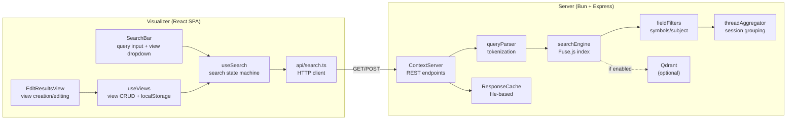

---

## 2. Server-Side Architecture

### 2.1 Query Parser (`src/search/queryParser.ts`)

Parses raw query strings into structured query objects supporting three modes.

| Syntax            | Mode                               | Example                     |
| ----------------- | ---------------------------------- | --------------------------- |
| `term`            | Fuzzy (default Fuse.js)            | `storyteller`               |
| `"phrase"`        | Exact substring (case-insensitive) | `"error handling"`          |
| `term1 term2`     | OR — match either                  | `storyteller nncharacter`   |
| `term1 + term2`   | AND — match both                   | `storyteller + nncharacter` |
| `"phrase" + term` | Mixed AND                          | `"tile info" + render`      |

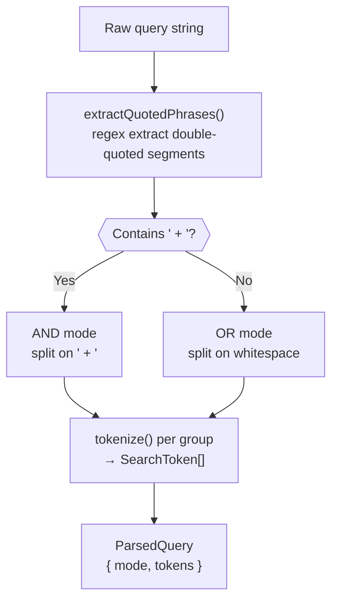

**Key types:**
```typescript
type SearchToken = { type: "fuzzy"; term: string } | { type: "exact"; phrase: string };
type ParsedQuery = { mode: "or" | "and"; tokens: SearchToken[] };
type ScoringConfig = { scoreWeight: number; countWeight: number };
// DEFAULT_SCORING = { scoreWeight: 0.6, countWeight: 0.4 }
```

**Composite scoring** (OR queries): blends the inverted Fuse.js score (0 = perfect → 1.0) with a term match ratio (`matchedTermCount / totalTermCount`), weighted by `ScoringConfig`.

**Hit counting** (`countTermHits`): counts total occurrences of all matched terms in a message's text. Quoted terms are counted as literal substring matches. This `hits` value is returned to the visualizer for visual display (gradient bars on cards).

### 2.2 Search Engine (`src/search/searchEngine.ts`)

Maintains a **module-level Fuse.js index** built once at startup and reused across all requests. The index operates on `SearchRecord` objects (lightweight projections of `AgentMessage` with only searchable fields).

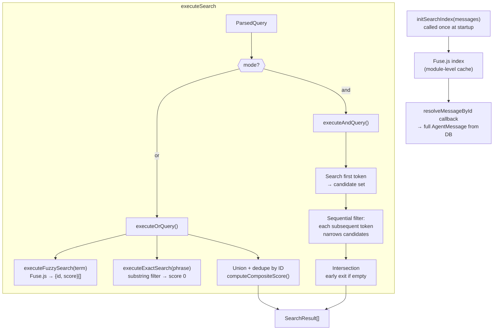

**Fuse.js configuration:**
- Threshold: `settings.FUSE_THRESHOLD` (typically `0.6`)
- Min match length: 3 characters
- Weighted keys: `message` (3), `subject` (2), `symbols` (2), `tags` (2), `context` (1)

**AND query optimization:** Sequential filtering — search the first token, then filter the result set through each subsequent token. Early exit when candidates reach zero.

### 2.3 Thread Aggregator (`src/search/threadAggregator.ts`)

Groups individual message search results into conversation-level thread summaries.

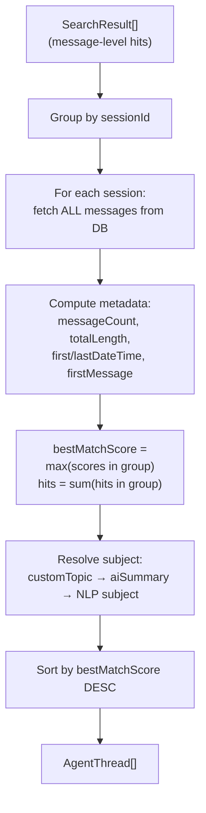

**`getLatestThreads(db, limit)`** — separate path for the "Latest Threads" view. Fetches all sessions, computes metadata per session, resolves topics, sorts by `lastDateTime` descending.

**`AgentThread` fields:**
```typescript
{
  sessionId, subject, harness, messageCount, totalLength,
  firstDateTime, lastDateTime, firstMessage,
  matchingMessageIds, bestMatchScore, hits
}
```

### 2.4 Hybrid Search with Qdrant (Optional)

When Qdrant is enabled (via environment variables), the `/api/search` endpoint performs a two-phase search:

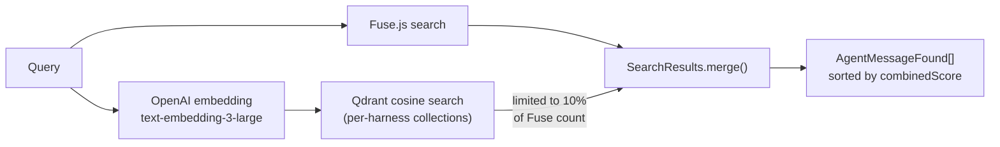

**Merge scoring:** Each `AgentMessageFound` carries `fuseScore`, `qdrantScore`, and a `combinedScore` = 75% Qdrant + 25% inverted Fuse. Messages found by both engines get the combined score; single-engine hits keep their individual score.

### 2.5 Response Cache (`src/cache/ResponseCache.ts`)

File-based query cache stored in `{storage}/zzzcache/queries/{YYYY-MM-DD}/`.

- **File naming:** `{sanitized-query-prefix}--{12-char-SHA256-hash}.json`
- **Scope:** 1 day (new directory per date)
- **Bypass:** `DISABLE_SEARCH_CACHE=true` env var
- **Header:** `X-Cache: HIT` / `MISS` on API responses
- **POST requests with project filters are never cached** — only GET requests are cacheable

### 2.6 API Endpoints

| Endpoint                     | Method | Purpose                                                                           | Cache |
| ---------------------------- | ------ | --------------------------------------------------------------------------------- | ----- |
| `/api/search?q=`             | GET    | Message-level fuzzy search (+ optional Qdrant)                                    | Yes   |
| `/api/search`                | POST   | Message search with `{ query, symbols?, subject?, projects[] }`                   | No    |
| `/api/messages`              | POST   | Message search with `searchTerms`, `fromDate`, `projects`, `symbols?`, `subject?` | No    |
| `/api/search/threads?q=`     | GET    | Thread-level search aggregation                                                   | No    |
| `/api/search/threads`        | POST   | Thread search with `{ query, symbols?, subject?, projects[] }`                    | No    |
| `/api/threads`               | POST   | Thread search with `searchTerms`, `fromDate`, `projects`, `symbols?`, `subject?`  | No    |
| `/api/threads/latest?limit=` | GET    | Most recent threads by date                                                       | No    |
| `/api/projects`              | GET    | All projects grouped by harness                                                   | No    |
| `/api/list-scopes`           | GET    | All persisted scope definitions                                                   | No    |
| `/api/scopes`                | POST   | Save full scope list `{ scopes: ScopeEntry[] }`                                   | No    |

**Project filtering** (POST endpoints): when `projects` is present and non-empty, Fuse.js results are filtered to messages whose `harness` + `project` match one of the listed pairs. Applied before thread aggregation when applicable.

**Field-targeted filtering** (POST endpoints): `symbols` and `subject` are optional string parameters that narrow results to messages whose respective fields match:
- `symbols` — case-insensitive substring match against any entry in the message's `symbols[]` array
- `subject` — case-insensitive substring match against the message's raw `subject` field (pre-topic-resolution)
- When `searchTerms` is present, field filters are applied **post-Fuse** (scores preserved, results narrowed)
- When `searchTerms` is empty but `symbols`/`subject` are present, the server enters **field-only mode**: starts from `getAllMessages()`, applies filters sequentially, sorts by date descending, and assigns a uniform score of `1.0`
- When all three are empty, returns empty results (no "select all" behavior)
- Qdrant hybrid search is skipped entirely in field-only mode

**Scopes** (`GET /api/list-scopes`, `POST /api/scopes`): Scopes are named project groupings persisted in `{storage}/zeSettings/scopes.json` via `ScopeStore`. Each `ScopeEntry` carries `id`, `name`, `emoji`, `color`, and `projectIds: { harness, project }[]`. The POST endpoint validates all fields (non-empty strings, hex color format, valid project pairs) via `normalizeScopeEntry()` and replaces the full list atomically. The GET endpoint returns `[]` when the file does not exist yet.

### 2.7 Field Filters (`src/search/fieldFilters.ts`)

Utility module providing field-targeted filtering functions used by all POST route handlers (messageRoutes, threadRoutes, searchRoutes). Operates on both `AgentMessage[]` (for field-only mode) and `SearchResult[]` (for post-Fuse narrowing).

| Function                  | Input                  | Filter target                                             | Used when                        |
| ------------------------- | ---------------------- | --------------------------------------------------------- | -------------------------------- |
| `filterMessagesBySymbols` | `AgentMessage[], term` | `msg.symbols[]` substring                                 | Field-only mode (no searchTerms) |
| `filterMessagesBySubject` | `AgentMessage[], term` | `msg.subject` substring                                   | Field-only mode (no searchTerms) |
| `filterResultsBySymbols`  | `SearchResult[], term` | `r.message.symbols[]` sub                                 | Post-Fuse narrowing              |
| `filterResultsBySubject`  | `SearchResult[], term` | `r.message.subject` sub                                   | Post-Fuse narrowing              |
| `messagesToResults`       | `AgentMessage[]`       | N/A — wraps messages as `SearchResult[]` with score `1.0` | Field-only → thread aggregation  |

All matching is **case-insensitive substring** via `.toLowerCase().includes()`. This is intentional: `symbols` are typically code identifiers where exact-case is less useful than partial matching.

---

## 3. Visualizer-Side Architecture

### 3.1 API Client (`src/api/search.ts`)

HTTP client that always POSTs to the new `/api/messages` and `/api/threads` endpoints with `searchTerms`, `fromDate`, optional `projects`, and optional field filters `symbols` and `subject`.

| Function                                                                      | Method | Endpoint              | Body                                                                              | Returns                    |
| ----------------------------------------------------------------------------- | ------ | --------------------- | --------------------------------------------------------------------------------- | -------------------------- |
| `searchMessages(searchTerms, fromDate, projects?, symbols?, subject?)`        | POST   | `/api/messages`       | `{ searchTerms, fromDate, projects, symbols?, subject?, page: 1, pageSize: 150 }` | `SearchHit[]`              |
| `searchThreads(searchTerms, fromDate, projects?, symbols?, subject?, limit?)` | POST   | `/api/threads`        | `{ searchTerms, fromDate, projects, symbols?, subject?, limit? }`                 | `ThreadSearchResponse`     |
| `fetchLatestMessages(limit?)`                                                 | POST   | `/api/messages`       | `{ searchTerms: "", page: 1, pageSize: limit }`                                   | `SerializedAgentMessage[]` |
| `fetchLatestThreads(limit?)`                                                  | GET    | `/api/threads/latest` | —                                                                                 | `SerializedAgentThread[]`  |
| `fetchProjects()`                                                             | GET    | `/api/projects`       | —                                                                                 | `ProjectGroup[]`           |
| `fetchScopes()`                                                               | GET    | `/api/list-scopes`    | —                                                                                 | `Scope[]`                  |
| `saveScopes(scopes)`                                                          | POST   | `/api/scopes`         | `{ scopes }`                                                                      | `{ saved: number }`        |
| `fetchSessionMessages(sessionId)`                                             | GET    | `/api/sessions/:id`   | —                                                                                 | `SerializedAgentMessage[]` |

**`searchMessages` response normalization:** The function handles three response formats — new wrapped `{ results: [...] }`, legacy flat arrays, and individual objects with `combinedScore` fields — normalizing all to the `SearchHit[]` shape the rest of the client expects.

### 3.2 View Management (`src/hooks/useViews.ts`)

Views are the primary organizational unit for search. Each view defines what type of search to perform, the query, and optional project scope.

**Built-in views** (8, non-deletable):

| ID                         | Type              | Purpose                  |
| -------------------------- | ----------------- | ------------------------ |
| `built-in-latest`          | `latest`          | Most recent threads      |
| `built-in-search`          | `search`          | Fuzzy message search     |
| `built-in-search-threads`  | `search-threads`  | Thread-level search      |
| `built-in-favorites`       | `favorites`       | Starred items            |
| `built-in-agent-builder`   | `agent-builder`   | File indexing for agents |
| `built-in-agent-list`      | `agent-list`      | List created agents      |
| `built-in-template-create` | `template-create` | Template creation        |
| `built-in-template-list`   | `template-list`   | List templates           |

**User views** can be `search`, `search-threads`, or `favorites` type. Search views (both message and thread) carry a persisted `query`, optional `projects` scope, `autoQuery` flag (auto-search on view switch), and `autoRefreshSeconds` for polling.

**`ViewDefinition` type:**
```typescript
{
  id: string;              // UUID for user views, "built-in-*" for built-ins
  name: string;            // Max 60 chars
  type: ViewType;
  emoji: string;           // 1–2 Unicode chars, defaults per type
  color: string;           // Hex #RRGGBB
  query: string;           // Search query (empty for non-search types)
  autoQuery: boolean;      // Auto-run search on view switch
  autoRefreshSeconds: number; // Polling interval (0 = disabled, min 5 if enabled)
  createdAt: number;       // Epoch ms
  projects?: SelectedProject[];  // Optional project scope filter
  symbols?: string;        // Field-targeted symbol filter (substring match)
  subject?: string;        // Field-targeted subject filter (substring match)
}
```

**Persistence:** LocalStorage at keys `ccv:views` (all definitions) and `ccv:activeViewId` (current selection). Reads are defensive (`safeReadViews()` / `safeReadActiveViewId()`) with fallback to built-in defaults.

### 3.3 Search State Machine (`src/hooks/useSearch.ts`)

Central hook that dispatches the right API call based on the active view's type. Accepts a `fromDate` parameter for temporal filtering. Passes `activeView.symbols` and `activeView.subject` through to API calls for field-targeted search.

**`UseSearchParams` type:**
```typescript
type UseSearchParams = {
	activeView: ViewDefinition;
	favoritesForActiveView: FavoriteEntry[];
	fromDate: string;
	limit?: number;
};
```

**Empty-query behavior:** When `searchTerms` is empty (and no field filters are active), `search` and `search-threads` views proceed to the server which returns latest results (latest threads for `search-threads`, paginated messages for `search`). There is no client-side early-return guard — the server handles empty queries gracefully.

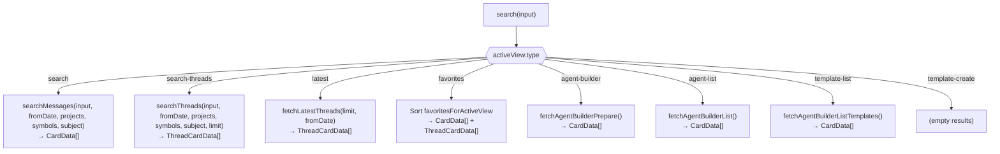

**State:** `query`, `results` (raw SearchHit[]), `cards` (CardData[]), `threadCards` (ThreadCardData[]), `isLoading`, `error`, `latencyMs`, `hasSearched`.

**Card conversion:** All result types are normalized to `CardData` or `ThreadCardData` shapes for the D3 visualization engine. This includes synthetic "fake cards" for agent files, agent definitions, and templates — enabling a unified rendering pipeline.

**Excerpt normalization:** Whitespace-collapsed, trimmed excerpts at three levels: short (120 chars), medium (400 chars), long (1200 chars).

**`projectsKey` stabilization:** Since `activeView.projects` is an array (reference comparison), `useSearch` derives a stable `projectsKey = JSON.stringify(activeView.projects ?? [])` via `useMemo` and includes it in the `search` callback's dependency array. This ensures the callback is recreated when project scope changes. The `fromDate` string is also in the dependency array so the callback updates when the date range changes. `activeView.symbols` and `activeView.subject` are also in the dependency array.

**Note on field filter UI exposure:** As of 2026-03-21, the `symbols` and `subject` fields on `ViewDefinition` are wired through the full stack (type → useSearch → API → server routes) but are **not yet exposed in the UI**. There is no input field in `SearchBar` or `EditResultsView` for users to set these values. They can only be set programmatically or via future UI additions. The traditional `searchTerms` input remains the only user-facing search field.

### 3.4 Auto-Search Triggers (`App.tsx`)

Five `useEffect` hooks in `App.tsx` control when searches fire automatically. An additional trigger re-runs the search when the date range changes.

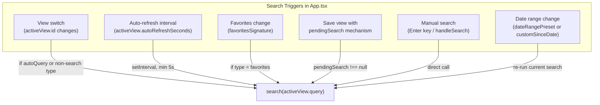

| Trigger                   | Deps                                                                            | Behavior                                                                                                                                                                                                                             |
| ------------------------- | ------------------------------------------------------------------------------- | ------------------------------------------------------------------------------------------------------------------------------------------------------------------------------------------------------------------------------------ |
| **View switch**           | `[activeView.id]`                                                               | For `search` type: fires only if `autoQuery` is true. All other types: always fires.                                                                                                                                                 |
| **Perpetual refresh**     | `[activeView.id, .type, .query, .autoRefreshSeconds, search]`                   | `setInterval` at configured seconds (min 5). Cleanup on unmount/change.                                                                                                                                                              |
| **Favorites mutation**    | `[activeView.id, .type, .query, favoritesSignature, search]`                    | Re-renders favorites view when starred items change.                                                                                                                                                                                 |
| **Pending search (save)** | `[pendingSearch, search]`                                                       | Fires after `handleSaveView` sets `pendingSearch`. Clears to `null` after execution. Deferred to next render so `search` callback has fresh `activeView.projects`.                                                                   |
| **Date range change**     | `[activeView.type, activeView.query, customSinceDate, dateRangePreset, search]` | For search / search-threads views: re-runs `activeView.query` whenever `dateRangePreset` or `customSinceDate` changes. Uses `activeView.query` (not internal `query` state) to avoid stale-closure issues with search-threads views. |
| **Manual**                | N/A                                                                             | `handleSearch(value)` called from `SearchBar`'s Enter key or button.                                                                                                                                                                 |

**The `pendingSearch` mechanism** solves a React closure timing issue: when a view is saved with new project filters, `updateView` and `setPendingSearch` are batched into one re-render. After re-render, `search` is recreated with fresh `activeView.projects` (via `projectsKey`), and the `useEffect` fires with the updated callback.

### 3.5 Search Bar (`src/components/searchTools/SearchBar.tsx`)

The primary search interface, combining a **view dropdown**, **query input**, **date-range filter**, **limit selector**, **live filter**, **result filter**, and **search history panel**.

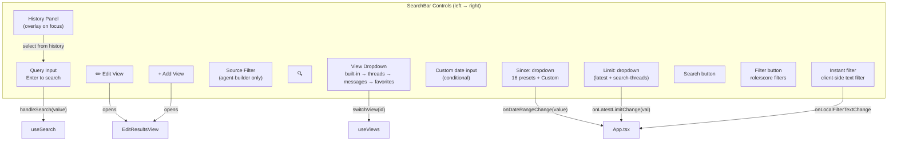

**View dropdown features:**
- Groups views into four categories: **Built-in Views**, **Search Threads**, **Search Messages**, **Favorites**
- Category order in the left column: Built-in Views → Search Threads → Search Messages → Favorites
- Categories with zero user views are hidden (no empty headers)
- Full keyboard navigation: arrows, Home/End, Enter, Escape, letter typeahead
- Typeahead buffer clears after 450ms
- Emoji + color swatch per view entry
- Right column: Agent Builder shortcut buttons (Launch Builder, List Agents, Create Template, List Templates)

**Search input:**
- Hidden for `latest` view type (no query needed)
- Disabled for `favorites` view type
- Enter triggers search; focus opens history panel
- Value syncs to `searchInputValue` state in `App.tsx`

**Date-range filter ("Since:"):**
- Always-visible `Since:` label and `<select>` dropdown positioned between the search icon and the query input
- 16 preset options: All, Last week, Last 2 weeks, Last 3 weeks, Last month, Last 6 weeks, Last 2 months, Last 3 months (default), Last 4–6 months, Last year, Last 18 months, Last 2 years, Last 3 years, Custom
- "All" sends an empty `fromDate` string (no date filtering)
- "Custom" reveals an additional `<input type="date">` for a user-specified since date
- Props: `dateRangeValue`, `onDateRangeChange`, `customSinceDate`, `onCustomSinceDateChange`
- State is owned by `App.tsx` (`DateRangePreset` type, `dateRangePreset`, `customSinceDate`); SearchBar is a controlled component
- `App.tsx` computes the ISO date via `resolveFromDate(preset, customSinceDate)` and passes the result as `fromDate` to `useSearch`
- All three settings (`dateRangePreset`, `customSinceDate`, `latestLimit`) are persisted to localStorage and restored on app load. Validated on restore: date presets are checked against `VALID_DATE_PRESETS`, limit is validated as a positive integer
- Changing the date range automatically re-triggers the current search for `search`, `search-threads`, and `latest` view types

**Limit selector ("Limit:"):**
- Visible on `latest` and `search-threads` view types (controlled by `showLimit` prop)
- `<label>` wrapping a `<select>` dropdown with options: 50, 100, 150, 200, 300, 400, 500
- Default: 100
- Props: `showLimit`, `latestLimit`, `onLatestLimitChange`
- State is owned by `App.tsx` (`latestLimit`); persisted to localStorage key `cxc-search-limit`
- For `latest`: passed as `limit` to `fetchLatestThreads()`
- For `search-threads`: passed as `limit` to `searchThreads()` → `POST /api/threads { limit }`

**Live filter ("Instant filter..."):**
- Always-visible text input at the far right of the search bar
- Performs client-side filtering of already-fetched results without a server round-trip
- Props: `localFilterText`, `onLocalFilterTextChange`
- State is owned by `App.tsx`; filtering logic applied via `useMemo` on the card arrays

**Result filter button ("Filter"):**
- Opens `FilterDialog` for role/score filtering
- Badge indicator when active filters are applied
- Props: `onOpenFilter`, `hasActiveFilters`, `isFilterDisabled`

**Source filter dropdown:**
- Conditional; shown only for `agent-builder` view type (`showSourceFilter` prop)
- Multi-select dropdown for filtering agent builder files by data source name

**Search history:**
- Stored separately via `useSearchHistory` hook
- Filtered by current input as substring match
- Individual removal (`×` button) and "Clear All"
- Keyboard navigable (arrow up/down, Enter to select)
- Hidden for `latest` view type

### 3.6 Edit Results View (`src/components/searchView/EditResultsView.tsx`)

Modal dialog for creating and editing named views. Operates in `"add"` or `"edit"` mode.

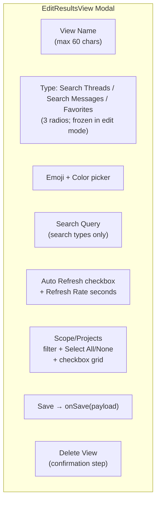

**Type radios:** Three options — **Search Threads** (default in add mode, `type = "search-threads"`, emoji 🧵, color `#8b5cf6`), **Search Messages** (`type = "search"`, emoji 🔎, color `#3b82f6`), **Favorites** (`type = "favorites"`, emoji ⭐, color `#f59e0b`). Changing the radio updates the default emoji and color from `VIEW_TYPE_DEFAULTS`. A convenience boolean `isSearchType = type === "search" || type === "search-threads"` gates visibility of the query, refresh, and project sections; these are hidden for Favorites.

**Modal sizing:** The overlay uses `align-items: flex-start; padding-top: 24px` so the dialog stays top-anchored (no vertical centering). The dialog uses `max-height: calc(100vh - 48px)` (not fixed `height`), allowing it to shrink from the bottom when content is shorter. When Favorites is selected, the query/refresh/project sections are hidden and the modal contracts to just the name/type/emoji/color fields.

**Dynamic project grid height:** The projects checkbox grid computes its CSS `height` based on the number of visible project entries (after filter). Constants: 2-column grid, 28px per row, 8px gap, min 80px, max 360px. The grid uses `overflow-y: auto` so it scrolls when there are many projects, but the overall modal height stays compact when there are few.

**Scopes section** (search types only):
- Fetches persisted scopes from `GET /api/list-scopes` on modal open
- Displays scopes as clickable buttons (emoji + name + color swatch); selecting a scope loads its `projectIds` into the project checkbox grid
- **Create Scope**: saves the currently selected projects as a new named scope (requires ≥ 2 projects selected). Opens an inline `EditScope` editor for name/emoji/color.
- **Modify Scope**: edits the selected scope's metadata (name, emoji, color) via the same inline editor. Validation: name required (max 40 chars), emoji defaults to "📦", color validated as `#RRGGBB`.
- **Update Scope Selection**: overwrites the selected scope's `projectIds` with the current checkbox state
- All scope mutations call `saveScopes()` → `POST /api/scopes` to persist the full list to `zeSettings/scopes.json`

**Project scope grid** (below scopes):
- Fetches available projects from `/api/projects` on mount → `ProjectGroup[]`
- Flattened into sorted entries: `{ harness, project, label }`, sorted alphabetically by project then harness
- **Live filter input** with search icon — instantly reduces visible checkboxes via case-insensitive substring match on the `PROJECT [HARNESS]` label format
- **Select All / Select None buttons** — operate on the filtered set only (Select All adds visible unchecked entries; Select None removes visible entries from selection; entries hidden by filter are not affected)
- Checked entries hidden by the filter remain checked in state — they are just not visible until the filter is cleared or matches them again
- Stored as `SelectedProject[]` on `ViewDefinition`

**Save payload:**
```typescript
{ name, type, emoji, color, query, autoQuery, autoRefreshSeconds, projects }
```

---

## 4. Data Flow Diagrams

### 4.1 Message Search (Full Path)

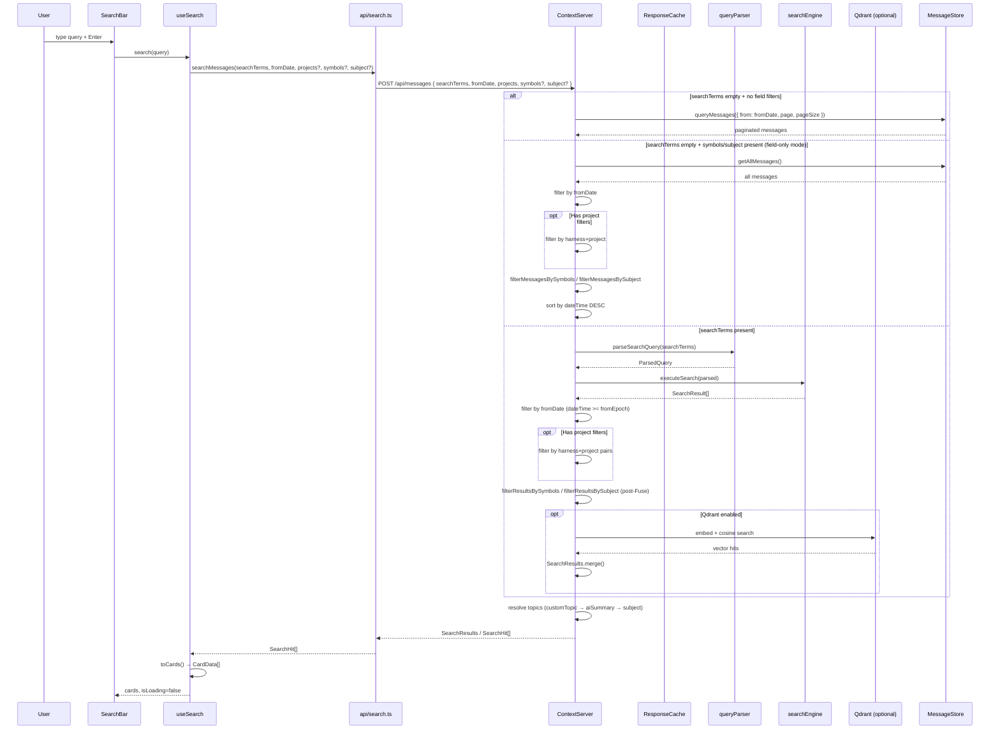

### 4.2 Thread Search (Full Path)

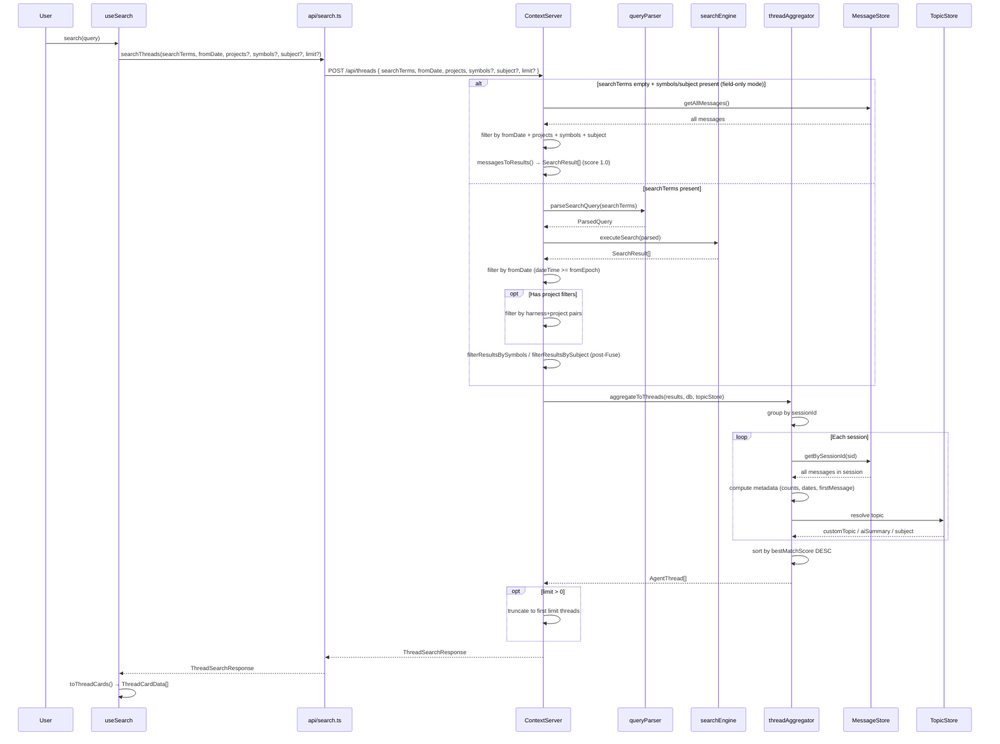

### 4.3 View Save → Immediate Search

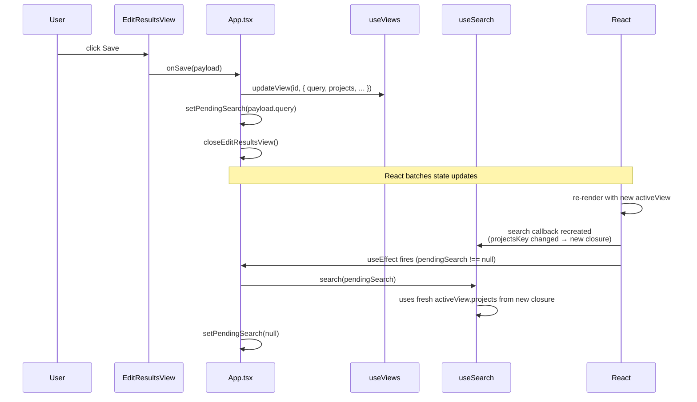

---

## 5. Type Relationships

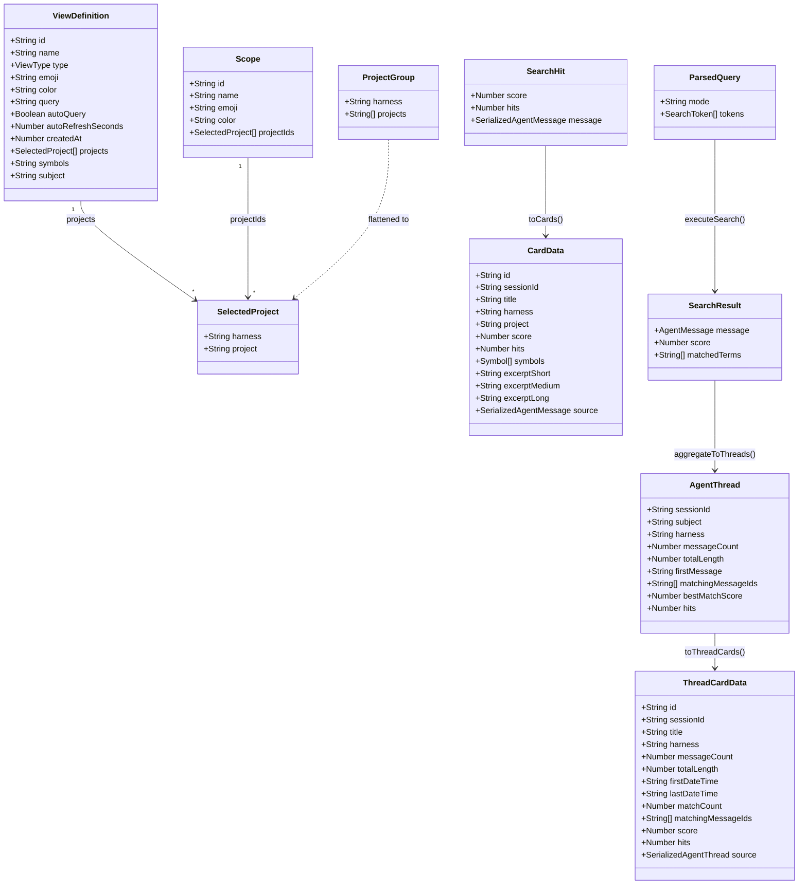

---

## 6. Module Inventory

### 6.1 Server Modules

| Module                | Path                                        | Responsibility                                                                                   |
| --------------------- | ------------------------------------------- | ------------------------------------------------------------------------------------------------ |
| **queryParser**       | `server/src/search/queryParser.ts`          | Tokenization, exact/fuzzy classification, AND/OR mode detection, composite scoring, hit counting |
| **searchEngine**      | `server/src/search/searchEngine.ts`         | Module-level Fuse.js index, OR/AND query execution, result deduplication                         |
| **threadAggregator**  | `server/src/search/threadAggregator.ts`     | Session grouping, thread metadata, topic resolution, latest threads                              |
| **AgentThread**       | `server/src/models/AgentThread.ts`          | Thread type definition                                                                           |
| **AgentMessageFound** | `server/src/models/AgentMessageFound.ts`    | Extended message with Fuse/Qdrant/combined scores and hits                                       |
| **fieldFilters**      | `server/src/search/fieldFilters.ts`         | Symbols/subject field-targeted filtering for both AgentMessage[] and SearchResult[]              |
| **SearchResults**     | `server/src/models/SearchResults.ts`        | Hybrid result container with merge algorithm                                                     |
| **ResponseCache**     | `server/src/cache/ResponseCache.ts`         | File-based query cache with per-day directories                                                  |
| **ScopeStore**        | `server/src/settings/ScopeStore.ts`         | Scope persistence to `zeSettings/scopes.json`; load/save/list/replaceAll                         |
| **ScopeEntry**        | `server/src/models/ScopeEntry.ts`           | `ScopeEntry` and `ScopeProject` type definitions                                                 |
| **ContextServer**     | `server/src/server/ContextServer.ts`        | Express app setup, delegates to route modules                                                    |
| **messageRoutes**     | `server/src/server/routes/messageRoutes.ts` | `/api/messages` GET+POST, field-only + Fuse + Qdrant paths                                       |
| **threadRoutes**      | `server/src/server/routes/threadRoutes.ts`  | `/api/threads` POST + `/api/threads/latest` GET                                                  |
| **searchRoutes**      | `server/src/server/routes/searchRoutes.ts`  | `/api/search` GET+POST + `/api/search/threads` GET+POST (legacy + extended)                      |

### 6.2 Visualizer Modules

| Module                 | Path                                                         | Responsibility                                                                                                                                                                                                         |
| ---------------------- | ------------------------------------------------------------ | ---------------------------------------------------------------------------------------------------------------------------------------------------------------------------------------------------------------------- |
| **api/search**         | `visualizer/src/api/search.ts`                               | HTTP client; POSTs to `/api/messages` and `/api/threads` with `searchTerms`, `fromDate`, `projects`, `symbols?`, `subject?`                                                                                            |
| **useSearch**          | `visualizer/src/hooks/useSearch.ts`                          | Search state machine; dispatches by view type; passes `fromDate`, `symbols`, `subject`; card conversion                                                                                                                |
| **useViews**           | `visualizer/src/hooks/useViews.ts`                           | View CRUD; localStorage persistence; 8 built-in views                                                                                                                                                                  |
| **useSearchHistory**   | `visualizer/src/hooks/useSearchHistory.ts`                   | Recent query storage and filtering                                                                                                                                                                                     |
| **SearchBar**          | `visualizer/src/components/searchTools/SearchBar.tsx`        | Query input, view dropdown with 4 categories (Built-in Views / Search Threads / Search Messages / Favorites), date-range filter, limit selector (latest + search-threads), instant filter, history panel, keyboard nav |
| **EditResultsView**    | `visualizer/src/components/searchView/EditResultsView.tsx`   | View add/edit modal with 3 type radios (Search Threads / Search Messages / Favorites), dynamic height, project scope + scopes UI                                                                                       |
| **EditScope**          | `visualizer/src/components/searchView/EditScope.tsx`         | Inline scope metadata editor (name/emoji/color) used by EditResultsView                                                                                                                                                |
| **AddFavoriteMessage** | `visualizer/src/components/favorites/AddFavoriteMessage.tsx` | Favorites-only custom text modal (title + message + emoji + color), persisted as synthetic message entries                                                                                                             |
| **App**                | `visualizer/src/App.tsx`                                     | Auto-search triggers, pendingSearch mechanism, date-range state (`DateRangePreset`, `resolveFromDate()`), search/view wiring                                                                                           |

---

## 7. Key Design Decisions

### 7.1 Cached Fuse.js Index

The Fuse.js index is built once at startup (`initSearchIndex`) and held in module-level state. Since ingestion is batch-only (at startup + incremental via FileWatcher), the index is rebuilt when new data arrives but reused across all search requests. This eliminates per-request `O(n)` index construction.

### 7.2 Sequential AND Filtering

AND queries use sequential filtering rather than full intersection: search the first token to get a candidate set, then filter through each subsequent token. This is faster when the first token is selective and avoids computing full result sets for every token.

### 7.3 POST-Only Search Transport

The visualizer now always POSTs to `/api/messages` and `/api/threads` with `{ searchTerms, fromDate, projects }`. The older GET-based routing (GET for unfiltered, POST for project-filtered) is retained server-side for backward compatibility but the visualizer no longer uses it. This simplifies the client: one transport path regardless of filters.

### 7.4 `projectsKey` for Closure Freshness

`useSearch` derives `projectsKey = JSON.stringify(activeView.projects ?? [])` and includes it in the `search` callback's `useCallback` dependency array. Without this, the callback would capture a stale `activeView.projects` reference when only projects change (since `activeView.projects` is an array with unstable reference identity).

### 7.5 `pendingSearch` Deferred Execution

When `handleSaveView` in `App.tsx` updates a view's query or projects, calling `search()` in the same event handler would use a stale `search` callback (React hasn't re-rendered yet). Instead, `setPendingSearch(query)` is set alongside `updateView()`. React batches both state updates into one re-render, after which `search` has a fresh closure. The `useEffect([pendingSearch, search])` then fires with the correct callback.

### 7.6 Topic Resolution at API Response Time

Subject resolution (`customTopic → aiSummary → NLP subject`) happens after search, not during indexing. This allows topic updates (via `POST /api/topics`) to take effect immediately without invalidating the search index or cache.

### 7.7 Hybrid Qdrant Scoring

When both Fuse.js and Qdrant return results for the same message, the combined score weights semantic similarity higher (75% Qdrant, 25% inverted Fuse). Qdrant results are capped at 10% of Fuse result count to prevent semantic noise from overwhelming lexical precision.

### 7.8 Date Range as Pre-Aggregation Filter

Date filtering (`fromDate`) is applied on the server *before* thread aggregation. This means threads returned by `POST /api/threads` only contain matches within the requested date range. The `resolveFromDate()` helper in `App.tsx` converts the UI preset to an ISO date string; for "All" it returns an empty string (disabling the filter entirely).

### 7.9 Field-Targeted Search: AND Intersection Across Dimensions

When multiple search dimensions are active (`searchTerms` + `symbols` + `subject`), results must satisfy **all** active dimensions (AND semantics). This mirrors the behavior of project and date filters — each additional filter narrows the result set. Field filters are applied **post-Fuse** to preserve Fuse.js relevance scores: the result set shrinks but individual scores remain intact, which is important for ranking and visual gradient bars.

### 7.10 Subject Filtering on Raw Field (Pre-Resolution)

The `subject` filter matches against `AgentMessage.subject` — the raw field, **not** the topic-resolved subject (which may be a `customTopic` or `aiSummary`). This is a deliberate choice: (1) it's deterministic and doesn't depend on `TopicStore` state, (2) `resolveSubject()` is applied after filtering for display purposes, and (3) the raw subject is what's indexed by Fuse.js. If topic-aware subject search is needed in the future, it would require a separate filter or index expansion.

### 7.11 Route Overlap: messageRoutes vs searchRoutes

Both `POST /api/messages` and `POST /api/search` provide message-level search, but their POST bodies differ slightly (`searchTerms` vs `query`, `fromDate` support). The visualizer uses only `messageRoutes` and `threadRoutes` POST endpoints. `searchRoutes` POST endpoints exist for backward compatibility and MCP server usage. All four POST endpoints support `symbols` and `subject` parameters.

---

## 8. Configuration Constants

| Constant              | Location               | Value                                    | Purpose                               |
| --------------------- | ---------------------- | ---------------------------------------- | ------------------------------------- |
| `DEFAULT_SCORING`     | `queryParser.ts`       | `{ scoreWeight: 0.6, countWeight: 0.4 }` | OR query composite scoring weights    |
| `FUSE_THRESHOLD`      | `CCSettings`           | `0.6` (typical)                          | Fuse.js fuzzy match threshold         |
| Min match length      | `searchEngine.ts`      | `3`                                      | Minimum characters for Fuse.js match  |
| Qdrant weight         | `AgentMessageFound.ts` | `0.75`                                   | Semantic score weight in hybrid mode  |
| Fuse weight           | `AgentMessageFound.ts` | `0.25`                                   | Lexical score weight in hybrid mode   |
| Qdrant cap            | `ContextServer.ts`     | `10%` of Fuse results                    | Max vector results merged             |
| Cache hash length     | `ResponseCache.ts`     | `12` chars (SHA-256 truncated)           | Query cache file naming               |
| Cache prefix max      | `ResponseCache.ts`     | `50` chars                               | Sanitized query in filename           |
| Auto-refresh min      | `useViews.ts`          | `5` seconds                              | Minimum polling interval              |
| View name max         | `useViews.ts`          | `60` chars                               | Name length limit                     |
| Emoji max             | `useViews.ts`          | `2` Unicode chars                        | Emoji field limit                     |
| Typeahead timeout     | `SearchBar.tsx`        | `450` ms                                 | Letter buffer clear delay             |
| Project grid columns  | `EditResultsView.tsx`  | `2`                                      | Columns in project checkbox grid      |
| Project grid row px   | `EditResultsView.tsx`  | `28` px                                  | Height per project row                |
| Project grid row gap  | `EditResultsView.tsx`  | `8` px                                   | Gap between project rows              |
| Project grid min H    | `EditResultsView.tsx`  | `80` px                                  | Minimum grid height                   |
| Project grid max H    | `EditResultsView.tsx`  | `360` px                                 | Maximum grid height (scrolls beyond)  |
| Excerpt short         | `useSearch.ts`         | `120` chars                              | Card compact excerpt                  |
| Excerpt medium        | `useSearch.ts`         | `400` chars                              | Card expanded excerpt                 |
| Excerpt long          | `useSearch.ts`         | `1200` chars                             | Hover panel excerpt                   |
| Latest threads limit  | `App.tsx`              | `100`                                    | Default for built-in latest view      |
| Latest messages limit | `useSearch.ts`         | `150`                                    | Default for fallback latest           |
| Date range presets    | `SearchBar.tsx`        | 16 options                               | All, Last week – Last 3 years, Custom |
| Default date preset   | `App.tsx`              | `"last-3-months"`                        | Initial time range filter             |
| Limit options         | `SearchBar.tsx`        | `[50, 100, 150, 200, 300, 400, 500]`     | Dropdown choices for result limit     |

### 8.1 LocalStorage Keys (Search Settings)

| Key                       | Owner              | Type       | Purpose                                                                                                                                                                    |
| ------------------------- | ------------------ | ---------- | -------------------------------------------------------------------------------------------------------------------------------------------------------------------------- |
| `cxc-search-date-preset`  | `App.tsx`          | string     | Persisted `DateRangePreset` value; validated against `VALID_DATE_PRESETS` on load                                                                                          |
| `cxc-search-custom-since` | `App.tsx`          | string     | Persisted custom since date (ISO `YYYY-MM-DD`)                                                                                                                             |
| `cxc-search-limit`        | `App.tsx`          | string     | Persisted result limit; parsed as positive integer on load                                                                                                                 |
| `cxc-agent-platforms`     | `AgentBuilder.tsx` | JSON array | Persisted platform selection (`["github"]`, `["claude"]`, or both). Not saved when in edit mode to avoid clobbering the user's preference with the edited agent's platform |
| `cxc-agent-sources`       | `App.tsx`          | JSON array | Persisted agent builder source filter selection                                                                                                                            |
| `ccv:views`               | `useViews.ts`      | JSON       | All view definitions                                                                                                                                                       |
| `ccv:activeViewId`        | `useViews.ts`      | string     | Currently selected view ID                                                                                                                                                 |
