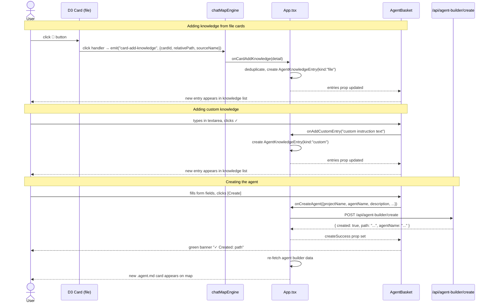

# r2uac – Agent Creator Panel

**Date**: 2026-03-17
**Status**: Planning
**Scope**: New `AgentBasket` panel in the visualizer that collects file references from agent-builder cards and submits them to `POST /api/agent-builder/create` to produce `.agent.md` files
**Depends on**: `r2uab-agent-builder.md` (server — implemented), `r2uab-agent-builder-ui.md` (visualizer — implemented)

---

## 1. Motivation

The Agent Builder view already renders indexed files as D3 cards. But there's no way to **select** files and **create an agent** from within the visualizer. Currently, creating an agent requires manually calling the `/api/agent-builder/create` endpoint.

The Agent Creator panel bridges this gap: a tall side panel (similar to `ClipboardBasket` but much larger) where the user fills in agent metadata, collects knowledge entries from file cards, and submits the whole thing to produce a `.agent.md` file on disk.

---

## 2. Design

### 2.1 Panel Layout (ASCII)

```
┌─────────────────────────────────────────┐  ← top edge: ~60px from top (below search bar)
│ 🏗️ Agent Creator            [Create] [×] │  ← header: title + create + clear buttons
├─────────────────────────────────────────┤
│ Project  [▾ Context Core Server      ]  │  ← dropdown: populated from agentBuilderSources
│ Name     [__________________________ ]  │  ← text input: agentName (slug)
│ Desc     [__________________________ ]  │  ← text input: description
│ Hint     [__________________________ ]  │  ← text input: argument-hint
│ Tools    [__________________________ ]  │  ← text input: comma-separated tool names
├─────────────────────────────────────────┤
│ Knowledge (3 files)                     │  ← section header with count
│ ┌─────────────────────────────────────┐ │
│ │ ⬆ × ⬇  architecture/archi-mcp.md   │ │  ← knowledge entry (from card save)
│ │ ⬆ × ⬇  architecture/archi-search.md│ │  ← knowledge entry (from card save)
│ │ ⬆ × ⬇  "Custom instruction text.." │ │  ← custom entry (from textarea)
│ │                                     │ │
│ │           (scrollable area)         │ │
│ │                                     │ │
│ └─────────────────────────────────────┘ │
├─────────────────────────────────────────┤
│ [auto-grow textarea, 2 rows default  ]  │  ← custom knowledge input
│ [                                  ✓ ]  │  ← checkmark commits textarea → entry
└─────────────────────────────────────────┘  ← bottom edge: same as ClipboardBasket (40px)
```

### 2.2 Key Behaviors

1. **Visibility**: The AgentBasket is only visible when the active view is `agent-builder`. When visible, ClipboardBasket is hidden (they occupy the same screen region).

2. **Panel size**: Fixed position, `left: 10px`, `bottom: 40px`, `top: 60px`, `width: 420px`. This spans from the same bottom as ClipboardBasket up to just below the search bar.

3. **Card-level save button**: In agent-builder view, each card gets a **📎 (Add to Agent)** button in its header area (next to the existing 📧 envelope button). Clicking it emits a `"card-add-knowledge"` engine event with the card's `id` (absolutePath) and `excerptShort` (relativePath). This is card-level, not line-level — the whole file reference is added.

4. **Knowledge entries**: Each entry is either:
   - A **file reference** (from card save): displays the `relativePath`, stores the path for the API call
   - A **custom text** (from textarea): displays the text inline, stores the raw text as-is (the server writes it verbatim into the agent knowledge section)

5. **Custom knowledge textarea**: Auto-growing textarea (min 2 rows, grows with content). A ✓ button to the right of the textarea. When clicked (or Enter pressed), the textarea content becomes a new knowledge entry and the textarea clears.

6. **Create Agent**: Calls `POST /api/agent-builder/create` with the form fields + all knowledge entries as `agentKnowledge[]`. On success: shows confirmation banner + clears the form. On error: shows error in the panel header area.

7. **Entry reordering**: Same up/down/remove controls as ClipboardBasket — `⬆ × ⬇` buttons on each entry.

### 2.3 Card Save Integration

The existing D3 engine already renders action buttons per card/line. For agent-builder mode:
- A new `📎` button is added to the card header (alongside `📧`) at LOD ≥ summary
- The button CSS class: `card-add-knowledge-btn`
- On click: the engine emits `"card-add-knowledge"` event with `{ cardId, relativePath, sourceName }`
- App.tsx handles the event by adding to the agent basket's knowledge entries (deduplicated by path)

### 2.4 Mapping to Server API

```
AgentBasket form state  →  POST /api/agent-builder/create body
─────────────────────────────────────────────────────────────
projectDropdown         →  projectName
nameInput               →  agentName
descInput               →  description
hintInput               →  argument-hint
toolsInput (split ",")  →  tools[]
knowledgeEntries[].path →  agentKnowledge[]
```

---

## 3. New Types

### 3.1 `AgentKnowledgeEntry` — `visualizer/src/types.ts`

```typescript
/** A single knowledge entry in the AgentBasket. */
export type AgentKnowledgeEntry = {
  /** Unique ID for React key + reorder operations. */
  id: string;
  /** Either a file relativePath or custom text. */
  value: string;
  /** "file" = from card save, "custom" = from textarea. */
  kind: "file" | "custom";
  /** Data source name (only for kind="file"). */
  sourceName?: string;
  /** Timestamp when added. */
  addedAt: number;
};
```

### 3.2 `CreateAgentInput` / `CreateAgentResponse` — `visualizer/src/types.ts`

```typescript
/** Input for POST /api/agent-builder/create (mirrors server type). */
export type CreateAgentInput = {
  projectName: string;
  agentName: string;
  description: string;
  "argument-hint": string;
  tools?: string[];
  agentKnowledge: string[];
};

/** Response from POST /api/agent-builder/create. */
export type CreateAgentResponse = {
  created: boolean;
  path: string;
  agentName: string;
};
```

### 3.3 `CardAddKnowledgeEventDetail` — `visualizer/src/types.ts`

```typescript
/** Emitted by D3 engine when user clicks 📎 on a card in agent-builder view. */
export type CardAddKnowledgeEventDetail = {
  cardId: string;
  relativePath: string;
  sourceName: string;
};
```

---

## 4. Implementation Plan

### Group A — Types & API Adapter

{{SIMPLE}}

- [x] **A1** — Add `AgentKnowledgeEntry`, `CreateAgentInput`, `CreateAgentResponse`, and `CardAddKnowledgeEventDetail` types to `visualizer/src/types.ts` (as specified in §3)
- [x] **A2** — Add `fetchAgentBuilderCreate(input: CreateAgentInput): Promise<CreateAgentResponse>` to `visualizer/src/api/search.ts` — POST to `/api/agent-builder/create` with JSON body; propagate HTTP error messages

### Group B — D3 Engine: Card-Level Knowledge Button

{{MEDIUM}}

- [x] **B1** — Add `"card-add-knowledge"` event type to `EngineEventMap` in `chatMapEngine.ts` with detail type `CardAddKnowledgeEventDetail`
- [x] **B2** — In `renderCardHtml()`, add a `📎` button (`<span class="card-add-knowledge-btn" title="Add to Agent">📎</span>`) next to the existing `📧` envelope button. Show at LOD ≥ summary (same visibility as the envelope button). The button should only render when a flag `showAgentKnowledgeBtn` is true (passed via engine options or a setter method)
- [x] **B3** — In the card click handler inside `renderCards()`, add a branch for `target.classList.contains("card-add-knowledge-btn")`: stop propagation, extract `card.excerptShort` (relativePath) and `card.project` (sourceName) from the bound card data, emit `"card-add-knowledge"` event
- [x] **B4** — Add `setAgentBuilderMode(enabled: boolean)` to the `ChatMapEngine` public interface. When enabled, the engine passes `showAgentKnowledgeBtn: true` to `renderCardHtml`. Store as a closure variable `isAgentBuilderMode`
- [x] **B5** — Style `.card-add-knowledge-btn` in `visualizer/src/index.css`: inline-block, cursor pointer, margin-left 6px, opacity 0.6 → 1.0 on hover, font-size 12px

### Group C — AgentBasket Component

{{HARD}}

- [x] **C1** — Create `visualizer/src/components/AgentBasket.tsx`:
  - **Props**:
    - `entries: AgentKnowledgeEntry[]` — current knowledge entries
    - `onRemoveEntry: (id: string) => void`
    - `onMoveUp: (id: string) => void`
    - `onMoveDown: (id: string) => void`
    - `onAddCustomEntry: (text: string) => void` — callback when user commits custom text
    - `onClear: () => void` — clear all entries
    - `onCreateAgent: (input: CreateAgentInput) => void` — submit callback
    - `sources: { name: string; fileCount: number }[]` — for project dropdown
    - `isCreating: boolean` — loading state during create
    - `createError: string | null` — last error from create attempt
    - `createSuccess: string | null` — success message (path of created file)
  - **Internal state**: `projectName`, `agentName`, `description`, `argumentHint`, `tools` (all strings), `customText` (textarea)
  - **Layout**: as described in §2.1 — header → form fields → scrollable knowledge list → bottom textarea

- [x] **C2** — Implement the **form fields section** inside AgentBasket:
  - Project dropdown (`<select>`) populated from `sources` prop. First option: "— Select project —" (disabled). Default: first source if only one exists
  - Name, Description, Hint: single-line `<input type="text">` with placeholder text
  - Tools: single-line `<input type="text">` with placeholder "e.g. read, edit, search" — split by comma on submit

- [x] **C3** — Implement the **knowledge entries list** (scrollable middle section):
  - Section header: "Knowledge ({count} entries)" with count badge
  - Each entry: `⬆ × ⬇` control column (same pattern as ClipboardMessage) + entry display
  - File entries: display with 📄 icon + relativePath in monospace font
  - Custom entries: display with ✏️ icon + text (truncated to 2 lines, full text on hover via title attr)
  - Auto-scroll to bottom when new entry is added

- [x] **C4** — Implement the **custom knowledge textarea** at the bottom:
  - `<textarea>` with `rows={2}`, auto-grow behavior (adjust rows based on content line count, max 6 rows)
  - A ✓ button to the right of the textarea (inside a flex row)
  - On ✓ click or Ctrl+Enter: call `onAddCustomEntry(customText)`, clear textarea
  - Disabled when textarea is empty (whitespace-only)

- [x] **C5** — Implement the **Create Agent button** in the header:
  - Green accent button "[🏗️ Create]" — calls `onCreateAgent` with assembled `CreateAgentInput`
  - Disabled when: `isCreating`, or `agentName` empty, or `projectName` not selected, or 0 knowledge entries
  - Shows spinner/loading text when `isCreating`
  - Validation: `agentName` must be a valid slug (lowercase, hyphens, no spaces) — show inline hint if invalid

- [x] **C6** — Implement **feedback display**:
  - `createError`: red banner below header, dismissible
  - `createSuccess`: green banner below header showing "✓ Created: {path}", auto-dismiss after 5s

### Group D — AgentBasket Styling

{{MEDIUM}}

- [x] **D1** — Create `visualizer/src/components/AgentBasket.css`:
  - `.agent-basket`: fixed position, `left: 10px`, `bottom: 40px`, `top: 60px`, `width: 420px`, same bg/border/shadow as `.clipboard-basket`, z-index: 1000, flex column layout
  - `.agent-basket-header`: same pattern as `.basket-header` — flex row, title + action buttons, border-bottom
  - `.agent-basket-form`: padding 12px 16px, display flex column, gap 8px, flex-shrink 0, border-bottom
  - `.agent-basket-form-row`: flex row with label (80px fixed width, text-align right, muted color) + input (flex: 1)
  - `.agent-basket-form input, .agent-basket-form select`: dark bg, border, rounded, padding 6px 10px, text primary color, font-size 13px
  - `.agent-basket-knowledge-header`: section header with count badge, padding, uppercase label, muted
  - `.agent-basket-knowledge-list`: flex: 1, overflow-y: auto, padding 8px (this is the scrollable middle)
  - `.agent-basket-entry`: same layout as `.basket-line` — flex row, control column + value display
  - `.agent-basket-entry-file` / `.agent-basket-entry-custom`: icon + text styling
  - `.agent-basket-custom-input`: flex row at bottom, border-top, padding 8px
  - `.agent-basket-custom-input textarea`: flex: 1, resize none, dark bg, border, rounded, font-size 13px, font-family monospace
  - `.agent-basket-custom-input .confirm-btn`: 32px square button, green accent, rounded, ✓ icon
  - `.agent-basket-create-btn`: green bg (#10b981), white text, rounded, full-width within header actions, disabled state (opacity 0.5)
  - `.agent-basket-banner-error` / `.agent-basket-banner-success`: colored banners, padding, font-size 12px, dismissible

### Group E — App Integration & State Wiring

{{MEDIUM}}

- [x] **E1** — In `App.tsx`, add state for the agent basket:
  - `agentKnowledgeEntries: AgentKnowledgeEntry[]` (useState, starts empty)
  - `isCreatingAgent: boolean` (useState, false)
  - `agentCreateError: string | null` (useState, null)
  - `agentCreateSuccess: string | null` (useState, null)

- [x] **E2** — Add handlers in `App.tsx`:
  - `handleAddKnowledgeFromCard(detail: CardAddKnowledgeEventDetail)`: deduplicate by `relativePath`, create `AgentKnowledgeEntry` with `kind: "file"`, add to entries
  - `handleAddCustomKnowledge(text: string)`: create entry with `kind: "custom"`, add to entries
  - `handleRemoveKnowledge(id: string)`: filter out by id
  - `handleMoveKnowledgeUp/Down(id: string)`: same swap pattern as basket
  - `handleClearKnowledge()`: empty the array
  - `handleCreateAgent(input: CreateAgentInput)`: set `isCreatingAgent`, call `fetchAgentBuilderCreate(input)`, on success set `agentCreateSuccess` + clear form, on error set `agentCreateError`

- [x] **E3** — Wire D3 engine event: In the `onEvent` handler inside `useChatMap` / `ChatMap` / `App.tsx`, add a branch for `"card-add-knowledge"` that calls `handleAddKnowledgeFromCard`

- [x] **E4** — Conditional rendering in `App.tsx`:
  - Show `<AgentBasket>` when `activeView.type === "agent-builder"`
  - Show `<ClipboardBasket>` when `activeView.type !== "agent-builder"`
  - Pass all necessary props to `<AgentBasket>`

- [x] **E5** — Wire `setAgentBuilderMode` on the D3 engine: In `useChatMap.ts`, call `engine.setAgentBuilderMode(true)` when the active view is `agent-builder`, and `false` otherwise. This requires passing the active view type as a prop/dependency to `useChatMap`

### Group F — useChatMap Bridge Updates

{{SIMPLE}}

- [x] **F1** — Add `onCardAddKnowledge` callback ref to `useChatMap.ts` (same ref-stabilisation pattern as `onHoverRef`): accepts `CardAddKnowledgeEventDetail`, wired to the engine's `"card-add-knowledge"` event
- [x] **F2** — Add `viewType` prop to `ChatMap` component and pass it through to `useChatMap`. When `viewType` changes to/from `"agent-builder"`, call `engine.setAgentBuilderMode(viewType === "agent-builder")`
- [x] **F3** — Pass `onCardAddKnowledge` prop from `App.tsx` through `ChatMap` to `useChatMap`

### Group G — Clear-on-View-Switch & Persistence

{{SIMPLE}}

- [x] **G1** — When switching away from agent-builder view, do NOT auto-clear the basket (user may switch to look at something and come back). Only clear on explicit "×" (clear) button press or after successful create
- [x] **G2** — (Optional) Persist agent basket state to `localStorage` key `ccv:agentBasket` so it survives page reloads. Save: entries + form field values. Restore on mount when view is agent-builder. Clear localStorage on successful create

### Group H — Edge Cases & Polish

{{MEDIUM}}

- [x] **H1** — **Duplicate detection**: When a card's file is already in the knowledge list, show visual feedback (brief flash on the existing entry) instead of adding a duplicate. Use `relativePath` as the dedup key
- [x] **H2** — **Empty state**: When knowledge list is empty, show centered muted text: "Click 📎 on file cards to add them as agent knowledge"
- [x] **H3** — **Slug validation**: The `agentName` field should auto-slugify on blur (lowercase, replace spaces with hyphens, strip non-alphanumeric except hyphens). Show red border if invalid characters are typed
- [x] **H4** — **Auto-select project**: If all knowledge entries come from the same source, auto-select that source in the project dropdown
- [x] **H5** — **Keyboard shortcuts**: Ctrl+Enter in any form field triggers Create (if valid). Escape clears the custom textarea. Tab order flows naturally through form → textarea → create button
- [x] **H6** — **Success refresh**: After successful agent creation, re-fetch agent builder data (call the search hook's refresh) so the newly created `.agent.md` file appears as a card on the map

---

## 5. File Inventory

### New Files
| File                                        | Description                         |
| ------------------------------------------- | ----------------------------------- |
| `visualizer/src/components/AgentBasket.tsx` | Agent Creator panel component       |
| `visualizer/src/components/AgentBasket.css` | Styling for the agent creator panel |

### Modified Files
| File                                    | Changes                                                                                                                  |
| --------------------------------------- | ------------------------------------------------------------------------------------------------------------------------ |
| `visualizer/src/types.ts`               | `AgentKnowledgeEntry`, `CreateAgentInput`, `CreateAgentResponse`, `CardAddKnowledgeEventDetail` types                    |
| `visualizer/src/api/search.ts`          | `fetchAgentBuilderCreate()` function                                                                                     |
| `visualizer/src/d3/chatMapEngine.ts`    | `"card-add-knowledge"` event, `📎` button in `renderCardHtml`, `setAgentBuilderMode()` method, `EngineEventMap` extension |
| `visualizer/src/index.css`              | `.card-add-knowledge-btn` styling                                                                                        |
| `visualizer/src/components/ChatMap.tsx` | Pass `viewType` and `onCardAddKnowledge` props through to `useChatMap`                                                   |
| `visualizer/src/hooks/useChatMap.ts`    | `onCardAddKnowledge` callback ref, `setAgentBuilderMode` bridge, `viewType` dependency                                   |
| `visualizer/src/App.tsx`                | Agent basket state, handlers, conditional rendering, create submission                                                   |

---

## 6. Data Flow Diagram



---

## 7. Future Extensions (not in this iteration)

- **Knowledge preview**: Hover on a file entry to see the first 500 chars of its content in a tooltip
- **Drag & drop reordering**: Drag entries to reorder instead of ⬆/⬇ buttons
- **Template presets**: Pre-fill form with common agent templates (e.g. "UI Worker", "Server Worker")
- **Edit existing agents**: Click an existing `.agent.md` card to load it into the AgentBasket for editing (parse frontmatter + body back into form fields)
- **Multi-select on map**: Shift+click or lasso-select multiple cards to add them all at once
- **Knowledge grouping**: Group entries by source name with collapsible headers
