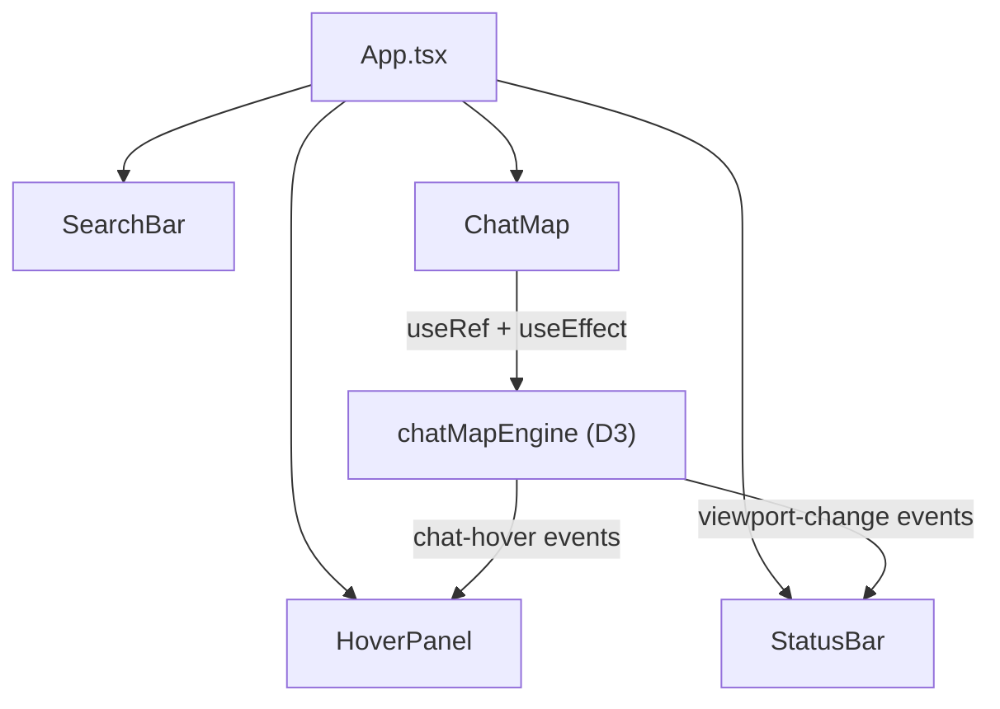
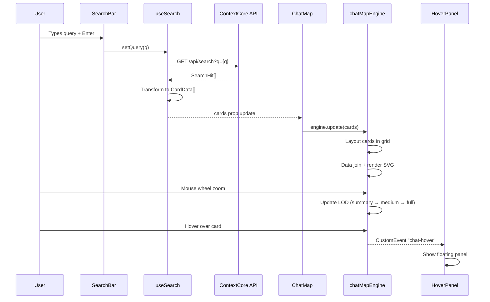

# ContextCore Visualizer – D3 Chat Map

**Date**: 2026-03-09  
**Scope**: Front-end React + Vite + D3 application for visualizing ContextCore search results  
**Location**: `visualizer/` (as a separate Vite project within the context-core repo)  
**Backend**: ContextCore Express API at `localhost:3210`

---

## 1. Product Vision

A single-page application that lets the user type a search query, hits the ContextCore `/api/search` endpoint, and renders the matching chat messages as a **zoomable 2D map** of rectangular cards. Each card represents a single `AgentMessage` search hit. As the user zooms in with the mouse wheel, cards reveal progressively more detail — from a summary tag line at far zoom, through colored symbols at mid zoom, to full message excerpts at close zoom. A hover panel provides quick-read context without requiring zoom.

The goal is to make it easy to **find a relevant chat based on the symbols it refers to**, across all four IDE harnesses (Claude Code, Cursor, Kiro, VS Code).

---

## 2. Technology Stack

| Layer         | Technology                   | Purpose                                          |
| ------------- | ---------------------------- | ------------------------------------------------ |
| Bundler       | **Vite 6**                   | Fast dev server, HMR, production build           |
| UI Framework  | **React 19**                 | Component structure, state management, search UI |
| Visualization | **D3 v7**                    | Zoom/pan engine, data join, coordinate math      |
| Styling       | **CSS Modules** or plain CSS | Scoped styles, dark theme                        |
| Language      | **TypeScript**               | Type safety, shared types with backend           |
| HTTP          | **fetch** (native)           | Call ContextCore API (no axios needed)           |

No additional state management library (Redux, Zustand) is needed for the MVP — React's `useState` + `useRef` + `useCallback` are sufficient for search state and D3 integration.

---

## 3. Backend API Contract

### 3.1 Endpoint: `GET /api/search?q={query}`

Returns an array of search hits, each containing a Fuse.js relevance score and a serialized `AgentMessage`.

```typescript
// Response shape from /api/search
type SearchHit = {
  score: number;           // Fuse.js score (0 = perfect match, higher = worse)
  message: SerializedAgentMessage;
};

// Serialized AgentMessage (19 fields)
type SerializedAgentMessage = {
  id: string;
  sessionId: string;
  harness: string;         // "ClaudeCode" | "Cursor" | "Kiro" | "VSCode"
  machine: string;
  role: "user" | "assistant" | "tool" | "system";
  model: string | null;
  message: string;         // Full message text
  subject: string;         // NLP-generated subject line
  context: string[];
  symbols: string[];       // Code symbols referenced
  history: string[];
  tags: string[];
  project: string;         // Project name
  parentId: string | null;
  tokenUsage: { input: number | null; output: number | null } | null;
  toolCalls: { name: string; context: string[]; results: string[] }[];
  rationale: string[];     // Thinking/reasoning content
  source: string;          // Path to raw source file
  dateTime: string;        // ISO 8601
};
```

**Result size**: The backend returns the top 10% of all messages (by relevance). For a typical corpus this could be hundreds to low thousands of results.

### 3.2 Additional Endpoints (future use)

| Endpoint                | Use in Visualizer                              |
| ----------------------- | ---------------------------------------------- |
| `GET /api/sessions`     | Session list sidebar / filter panel            |
| `GET /api/sessions/:id` | Drill-down: view full session in timeline mode |
| `GET /api/messages`     | Filtered browsing without fuzzy search         |

---

## 4. Architecture Overview

```
visualizer/
├── index.html                 # Vite entry point
├── package.json               # Separate from context-core root
├── tsconfig.json
├── vite.config.ts
├── src/
│   ├── main.tsx               # React root mount
│   ├── App.tsx                # Top-level layout: SearchBar + ChatMap
│   ├── App.css                # Global styles, dark theme
│   ├── types.ts               # SearchHit, CardData, shared types
│   ├── api/
│   │   └── search.ts          # fetch wrapper for /api/search
│   ├── components/
│   │   ├── SearchBar.tsx       # Text input + Enter trigger
│   │   ├── ChatMap.tsx         # React wrapper around D3 canvas
│   │   ├── HoverPanel.tsx      # Floating detail panel on hover
│   │   └── StatusBar.tsx       # Result count, zoom level, loading state
│   ├── d3/
│   │   ├── chatMapEngine.ts   # Pure D3 module: zoom, cards, LOD, events
│   │   ├── layout.ts          # Grid/pack layout algorithm for card placement
│   │   └── colors.ts          # Harness color palette, symbol coloring
│   └── hooks/
│       ├── useSearch.ts        # Search state + fetch logic
│       └── useChatMap.ts       # Binds D3 engine to React lifecycle
└── zz-reach2/
    └── upgrades/
        └── r2ud-d3-visualizer.md   # This document
```

### 4.1 Component Hierarchy



### 4.2 Separation of Concerns

**React owns**: search state, API calls, component mounting/unmounting, hover panel rendering, status display.

**D3 owns**: SVG creation, zoom/pan behavior, card rendering, level-of-detail switching, pointer event detection, coordinate math.

The bridge is a React `useRef` to the container `<div>` and a `useEffect` that calls the D3 engine's `create()` function on mount and `update()` on data change. D3 does **not** touch React state directly — it emits DOM `CustomEvent`s that React listens to via `useEffect` event listeners.

---

## 5. Data Flow



---

## 6. Card Data Transformation

The raw `SearchHit[]` from the API needs to be transformed into `CardData[]` with layout positions and pre-computed LOD content before being fed to D3.

```typescript
// Internal card model for D3
type CardData = {
  id: string;
  sessionId: string;
  
  // Layout (computed by layout.ts)
  x: number;
  y: number;
  w: number;
  h: number;

  // Display fields
  title: string;           // subject or first 80 chars of message
  harness: string;
  project: string;
  model: string | null;
  role: string;
  dateTime: string;
  score: number;           // Fuse.js score (lower = better)

  // LOD content tiers
  symbols: SymbolEntry[];  // { label, color }
  excerptShort: string;    // First 120 chars
  excerptMedium: string;   // First 400 chars
  excerptLong: string;     // First 1200 chars

  // Full data reference (for hover panel)
  source: SerializedAgentMessage;
};
```

### 6.1 Symbol Coloring Strategy

Symbols get colors based on a hash of the symbol name, mapped to a palette of 12 distinguishable hues. This ensures the same symbol always gets the same color across cards, making visual scanning effective.

Harness badges use a fixed palette:
- **ClaudeCode**: `#f59e0b` (amber)
- **Cursor**: `#8b5cf6` (violet)
- **Kiro**: `#10b981` (emerald)
- **VSCode**: `#3b82f6` (blue)

---

## 7. D3 Chat Map Engine

### 7.1 Core Architecture

The engine (`d3/chatMapEngine.ts`) is framework-agnostic — it takes a DOM container and data, and manages its own SVG lifecycle. This follows the advice from the conversation.

```
Container (relative-positioned div)
├── SVG (100% × 100%, viewBox)
│   └── g.world (transformed by d3.zoom)
│       └── g.chat (one per card)
│           ├── rect.chat-bg (background)
│           ├── rect.harness-stripe (thin left border, harness color)
│           └── foreignObject.chat-fo
│               └── xhtml:div.chat-html (LOD-switch content)
└── div.hover-panel (absolutely positioned, outside zoom)
```

### 7.2 Zoom & Level of Detail

D3's `d3.zoom()` drives pan and zoom. The `transform.k` (scale factor) determines which LOD tier is active:

| Zoom Level (`k`) | LOD Tier  | Card Shows                                          |
| ---------------- | --------- | --------------------------------------------------- |
| `k < 0.7`        | `minimal` | Harness color dot + project name only               |
| `0.7 ≤ k < 1.2`  | `summary` | Subject line + harness badge + date                 |
| `1.2 ≤ k < 2.5`  | `medium`  | Subject + colored symbols (up to 8) + short excerpt |
| `k ≥ 2.5`        | `full`    | Subject + all symbols + longer excerpt + model tag  |

Zoom configuration:
- **scaleExtent**: `[0.15, 8]` — wide range for big datasets
- **wheelDelta**: Custom sensitivity for smooth scroll zoom
- **translateExtent**: Bounded to world dimensions with padding

### 7.3 Card Layout Algorithm

`d3/layout.ts` takes `CardData[]` and assigns `x, y, w, h` to each card.

**MVP layout: Score-sorted grid**
- Cards are sorted by relevance score (best first).
- Placed left-to-right, top-to-bottom in a grid with configurable column count.
- Card width: fixed (e.g., 320px in world space).
- Card height: varies by content length (min 120px, max 280px).
- Gap: 24px horizontal, 20px vertical.

**Future layout options** (out of scope for MVP):
- Force-directed clustering by project or session
- Treemap by harness → project → session hierarchy
- Timeline (x-axis = date)

### 7.4 Event System

The engine emits `CustomEvent`s on the container DOM element:

| Event Name        | Payload                                                   | Consumer     |
| ----------------- | --------------------------------------------------------- | ------------ |
| `chat-hover`      | `{ phase, data: CardData, localX, localY, pageX, pageY }` | HoverPanel   |
| `chat-click`      | `{ data: CardData }`                                      | App (future) |
| `viewport-change` | `{ x, y, k, transform }`                                  | StatusBar    |

Plus a callback-based `onEvent` option for non-DOM consumers.

### 7.5 Public API

```typescript
type ChatMapEngine = {
  // Replace the entire card dataset and re-render
  update(cards: CardData[]): void;

  // Programmatic zoom/pan
  setTransform(transform: d3.ZoomTransform): void;
  zoomToFit(padding?: number): void;

  // Cleanup
  destroy(): void;
};

function createChatMapEngine(
  container: HTMLElement,
  cards: CardData[],
  options?: ChatMapEngineOptions
): ChatMapEngine;
```

---

## 8. React Components

### 8.1 `SearchBar`

A full-width text input with dark styling. On Enter keypress or button click, triggers the search. Shows a loading spinner during fetch. Includes a debounce guard to prevent duplicate requests.

```
┌─────────────────────────────────────────────────────────────────┐
│  🔍  Search ContextCore...                              [Enter] │
└─────────────────────────────────────────────────────────────────┘
```

### 8.2 `ChatMap`

React wrapper that:
1. Creates a `<div ref={containerRef}>` filling available space.
2. On mount: calls `createChatMapEngine(containerRef.current, [])`.
3. On `cards` prop change: calls `engine.update(cards)`.
4. On unmount: calls `engine.destroy()`.
5. Listens for `chat-hover` events and forwards to `App` state for `HoverPanel`.

### 8.3 `HoverPanel`

Absolutely positioned panel that appears on card hover. Shows:
- **Subject** (bold)
- **Project** / **Harness** badge / **Model**
- **Date** (human-readable)
- **Score** (relevance bar)
- **Full symbols list** (colored)
- **Message excerpt** (up to 500 chars)
- **Tool calls** summary (if any)

Positioned near the cursor but clamped to viewport bounds. Hides on `phase: "leave"`.

### 8.4 `StatusBar`

Bottom bar showing:
- Result count: `"142 messages found"`
- Current zoom: `"Zoom: 1.4x"`
- Active LOD tier badge
- Search latency: `"Searched in 230ms"`

---

## 9. Styling & Theme

Dark theme throughout, matching typical IDE aesthetics:

```css
:root {
  --bg-primary: #0a0a0f;
  --bg-card: #111827;
  --bg-hover: #1f2937;
  --border-card: #374151;
  --text-primary: #f9fafb;
  --text-secondary: #9ca3af;
  --text-muted: #6b7280;
  --accent: #3b82f6;
}
```

Cards have rounded corners (`rx: 12`), subtle borders, and a thin left-side stripe colored by harness. Hover state lightens the background. Symbols use their hash-derived colors with good contrast on dark backgrounds.

---

## 10. Vite & Project Configuration

### 10.1 `vite.config.ts`

```typescript
import { defineConfig } from "vite";
import react from "@vitejs/plugin-react";

export default defineConfig({
  plugins: [react()],
  server: {
    port: 5173,
    proxy: {
      "/api": {
        target: "http://localhost:3210",
        changeOrigin: true,
      },
    },
  },
});
```

The Vite dev server proxies `/api/*` to the ContextCore backend, avoiding CORS issues during development.

### 10.2 `package.json`

```json
{
  "name": "context-visualizer",
  "private": true,
  "version": "0.1.0",
  "type": "module",
  "scripts": {
    "dev": "vite",
    "build": "tsc -b && vite build",
    "preview": "vite preview"
  },
  "dependencies": {
    "d3": "^7.9.0",
    "react": "^19.1.0",
    "react-dom": "^19.1.0"
  },
  "devDependencies": {
    "@types/d3": "^7.4.3",
    "@types/react": "^19.1.0",
    "@types/react-dom": "^19.1.0",
    "@vitejs/plugin-react": "^4.5.2",
    "typescript": "^5.7.2",
    "vite": "^6.3.5"
  }
}
```

### 10.3 `tsconfig.json`

Standard Vite React TypeScript config with `strict: true`, `jsx: "react-jsx"`, `target: "ES2022"`.

---

## 11. Implementation Plan

Tasks are grouped by difficulty level and sorted chronologically within each group. Each group is annotated with the recommended model tier for execution.

---

### Group A — Scaffold & Boilerplate

{{SIMPLE}}

- [ ] **A1.** Run `npm create vite@latest` with the `react-ts` template inside `visualizer/`. This produces `index.html`, `package.json`, `tsconfig.json`, `tsconfig.app.json`, `tsconfig.node.json`, `vite.config.ts`, and the default `src/` skeleton (`main.tsx`, `App.tsx`, `App.css`, `index.css`).
- [ ] **A2.** Install runtime dependencies: `npm install d3 react react-dom` (React is already from the template, but pin to v19; d3 v7 is the addition).
- [ ] **A3.** Install dev dependencies: `npm install -D @types/d3 @types/react @types/react-dom @vitejs/plugin-react typescript vite` (most come from template; `@types/d3` is the addition).
- [ ] **A4.** Edit `vite.config.ts`: add the `server.proxy` block that maps `/api` → `http://localhost:3210` (see §10.1 for exact config). Also set `server.port` to `5173`.
- [ ] **A5.** Create the empty directory structure under `src/`: `api/`, `components/`, `d3/`, `hooks/`. No files yet — just the folders to confirm the layout matches §4.
- [ ] **A6.** Delete Vite template boilerplate: remove `src/assets/`, the default `App.tsx` content (replace with a placeholder `<h1>ContextCore Visualizer</h1>`), and the default counter CSS from `App.css`. Clear `index.css` and add only the CSS reset + dark background (`body { margin: 0; background: #0a0a0f; color: #f9fafb; font-family: system-ui; }`).
- [ ] **A7.** Run `npm run dev` and verify the Vite dev server starts on `:5173` and renders the placeholder heading. Confirm in the browser console that no errors appear.

---

### Group B — Type Definitions & API Layer

{{SIMPLE}}

- [ ] **B1.** Create `src/types.ts`. Define `SerializedAgentMessage` (19 fields — copy the exact shape from §3.1), `ToolCall` (`{ name, context[], results[] }`), `TokenUsage` (`{ input, output }`), and `AgentRole` (`"user" | "assistant" | "tool" | "system"`).
- [ ] **B2.** In the same `src/types.ts`, define `SearchHit` (`{ score: number; message: SerializedAgentMessage }`).
- [ ] **B3.** In `src/types.ts`, define `SymbolEntry` (`{ label: string; color: string }`) and `CardData` — the full internal card model from §6 with all layout, display, LOD, and source fields.
- [ ] **B4.** Create `src/api/search.ts`. Implement `searchMessages(query: string): Promise<SearchHit[]>` — calls `fetch("/api/search?q=" + encodeURIComponent(query))`, parses the JSON response, returns the array. On non-200, throw an `Error` with the status text.
- [ ] **B5.** In `src/api/search.ts`, add a named export `fetchSessions(): Promise<any[]>` that calls `GET /api/sessions` — stub for future use, just the fetch wrapper.

---

### Group C — Search UI & State Hook

{{SIMPLE}}

- [ ] **C1.** Create `src/hooks/useSearch.ts`. The hook manages: `query` (string), `results` (SearchHit[]), `cards` (CardData[]), `isLoading` (boolean), `error` (string | null), `latencyMs` (number | null). Exposes `search(q: string)` which sets loading, records `performance.now()`, calls `searchMessages(q)`, computes latency, and stores results. On error, sets the error string.
- [ ] **C2.** In `useSearch.ts`, add the transformation step: after receiving `SearchHit[]`, map each hit into a `CardData` object. For now set `x, y, w, h` all to `0` (layout will compute them later). Populate `title` from `message.subject` (fall back to first 80 chars of `message.message`). Populate `excerptShort` (first 120 chars), `excerptMedium` (first 400 chars), `excerptLong` (first 1200 chars) from `message.message`. Set `symbols` to an empty array for now (coloring comes later).
- [ ] **C3.** Create `src/components/SearchBar.tsx`. A `<div>` with an `<input type="text" placeholder="Search ContextCore...">` and a magnifying glass icon (use the Unicode character 🔍 or an SVG). On `onKeyDown` with `Enter`, call the `onSearch(value)` prop. The input should `autoFocus` on mount.
- [ ] **C4.** Style `SearchBar`: full-width at the top, fixed height (56px), dark background (`#111827`), rounded border, light placeholder text, `font-size: 1.1rem`. Add a subtle bottom border or shadow to separate it from the map. Put styles in `src/components/SearchBar.css` and import it.
- [ ] **C5.** Wire the search flow in `App.tsx`: instantiate `useSearch()`, pass `search` to `SearchBar`'s `onSearch` prop. For now, when `cards` is non-empty, render a `<pre>` showing `JSON.stringify(cards.length)` and the first card's title. This is a temporary verification step.
- [ ] **C6.** Verify the full round-trip: start the ContextCore backend (`bun start` in root), start the Vite dev server (`npm run dev` in `visualizer/`), type a query in the search bar, hit Enter, and confirm the card count appears. Check the browser DevTools Network tab to confirm the proxy routes `/api/search` to port 3210.

---

### Group D — Color Utilities & Layout Algorithm

{{MEDIUM}}

- [ ] **D1.** Create `src/d3/colors.ts`. Define the harness color map as a `Record<string, string>`: `ClaudeCode → #f59e0b`, `Cursor → #8b5cf6`, `Kiro → #10b981`, `VSCode → #3b82f6`. Export `getHarnessColor(harness: string): string` with a fallback of `#6b7280` for unknown harnesses.
- [ ] **D2.** In `src/d3/colors.ts`, implement `getSymbolColor(label: string): string`. Hash the label string (simple `charCodeAt` sum mod 12), map to a palette of 12 high-contrast colors suitable for dark backgrounds (e.g., `#93c5fd`, `#fbbf24`, `#34d399`, `#f87171`, `#a78bfa`, `#fb923c`, `#2dd4bf`, `#e879f9`, `#facc15`, `#4ade80`, `#38bdf8`, `#f472b6`). Export the palette array as well.
- [ ] **D3.** Go back to `src/hooks/useSearch.ts` and update the `CardData` transformation: populate `symbols` by mapping `message.symbols.map(s => ({ label: s, color: getSymbolColor(s) }))`.
- [ ] **D4.** Create `src/d3/layout.ts`. Implement `computeGridLayout(cards: CardData[], containerWidth: number): CardData[]`. Parameters: `cardWidth = 320`, `cardMinHeight = 120`, `cardMaxHeight = 280`, `gapX = 24`, `gapY = 20`. Calculate column count as `Math.max(1, Math.floor(containerWidth / (cardWidth + gapX)))`. Assign `w = cardWidth`, `h = clamp(120, baseHeight, 280)` where `baseHeight` is estimated from `excerptMedium.length / 2` (rough). Assign `x = col * (cardWidth + gapX)`, `y = running Y offset` per column (since heights vary, track max-Y per column for masonry).
- [ ] **D5.** In `layout.ts`, cards should already be sorted by `score` ascending (best match first) before the grid pass. Add `cards.sort((a, b) => a.score - b.score)` at the start of `computeGridLayout`. Return the same array with `x, y, w, h` populated.
- [ ] **D6.** In `layout.ts`, export `computeWorldBounds(cards: CardData[]): { width: number; height: number }` — scans all cards and returns the bounding box (max `x + w`, max `y + h`) plus 200px padding on each side.

---

### Group E — D3 Engine: SVG Skeleton & Zoom

{{MEDIUM}}

- [ ] **E1.** Create `src/d3/chatMapEngine.ts`. Define the `ChatMapEngineOptions` type: `{ onEvent?: (type: string, detail: any) => void; worldWidth?: number; worldHeight?: number }`. Define the returned `ChatMapEngine` type with `update(cards)`, `setTransform(t)`, `zoomToFit(padding?)`, and `destroy()`.
- [ ] **E2.** Implement `createChatMapEngine(container, cards, options)`: clear the container's inner HTML. Create a `<svg>` via `d3.select(container).append("svg")` with `width: 100%`, `height: 100%`, `display: block`. Append a `<defs>` element (reserved for future clip paths). Append a `<g class="world">` that will be the zoom target. Store `svg`, `world`, `defs` as local variables.
- [ ] **E3.** Set up `d3.zoom()`: configure `scaleExtent([0.15, 8])`, initial `translateExtent` using `worldWidth` / `worldHeight` from options (default 5000 × 3000). Apply custom `wheelDelta` for smooth scroll: `-event.deltaY * (event.deltaMode === 1 ? 0.04 : event.deltaMode ? 1 : 0.002)`. On `"zoom"` event, apply `event.transform` to the `world` group and call `updateLod(event.transform.k)`. Call `svg.call(zoom)`.
- [ ] **E4.** Implement the `emit(type, detail)` helper inside the engine closure: calls `options.onEvent?.(type, detail)` and dispatches `new CustomEvent(type, { detail, bubbles: true })` on the container DOM element.
- [ ] **E5.** On each zoom event, emit `"viewport-change"` with `{ x, y, k, transform }`.
- [ ] **E6.** Implement `destroy()`: remove the SVG element, remove the zoom behavior from SVG (`svg.on(".zoom", null)`), remove all event listeners from container.

---

### Group F — D3 Engine: Card Rendering & Data Join

{{HARD}}

- [ ] **F1.** Implement the D3 data join inside `createChatMapEngine`. Use `world.selectAll("g.chat").data(cards, d => d.id).join(enter => { ... }, update => { ... }, exit => { ... })`. In the `enter` selection: append `<g class="chat">`, then inside it append `<rect class="chat-bg">` (rounded: `rx=12`, `ry=12`), `<rect class="harness-stripe">` (4px wide, full height, positioned at x=0, uses `getHarnessColor(d.harness)`), and `<foreignObject class="chat-fo">` containing an `<xhtml:div class="chat-html">`. In `update`, update positions and sizes. In `exit`, remove.
- [ ] **F2.** Set card transform: `g.chat` gets `transform: translate(d.x, d.y)`. `rect.chat-bg` gets `width: d.w`, `height: d.h`, `fill: #111827`, `stroke: #374151`, `stroke-width: 1.25`. `foreignObject` gets `x: 16` (after stripe), `y: 8`, `width: d.w - 24`, `height: d.h - 16`.
- [ ] **F3.** Implement `escapeHtml(str)` utility inside the engine file: replaces `&`, `<`, `>`, `"`, `'` with HTML entities. This is critical for safely rendering user message content inside `foreignObject`.
- [ ] **F4.** Implement `renderSymbols(symbols: SymbolEntry[], maxCount: number): string` — returns an HTML string of `<span class="sym" style="color:{color}">{label}</span>` elements joined by spaces, limited to `maxCount`.
- [ ] **F5.** Implement `renderCardHtml(card: CardData, lod: string): string`. Returns an HTML fragment with structure varying by LOD tier: **minimal** → just `<div class="chat-project">{project}</div>`; **summary** → project + `<div class="chat-title">{title}</div>` + date; **medium** → title + symbols (up to 8) + `excerptShort`; **full** → title + all symbols + `excerptMedium` + model badge. Each block is wrapped in `<div class="chat-body lod-{lod}">`. Use `escapeHtml` on all user-derived strings.
- [ ] **F6.** Implement `getLod(k: number): string` — returns `"minimal"` if `k < 0.7`, `"summary"` if `k < 1.2`, `"medium"` if `k < 2.5`, `"full"` otherwise.
- [ ] **F7.** Implement `updateLod(k: number)` — computes LOD via `getLod(k)`, then `cards.select(".chat-html").html(d => renderCardHtml(d, lod))`. This is called on every zoom event and on initial render.
- [ ] **F8.** Implement the `update(newCards)` method on the returned engine object. It should: (1) run `computeGridLayout(newCards, containerWidth)`, (2) compute world bounds, (3) update the zoom's `translateExtent`, (4) store the new cards array, (5) re-run the data join, (6) call `updateLod` with current `transform.k`, (7) call `zoomToFit()`.

---

### Group G — D3 Engine: Interaction Events & React Bridge

{{MEDIUM}}

- [ ] **G1.** Add pointer event handlers on `g.chat` groups inside the data join. On `pointerenter`: compute local coordinates via `d3.pointer(event, container)`, emit `"chat-hover"` with `{ phase: "enter", data: d, localX, localY, pageX: event.pageX, pageY: event.pageY }`. On `pointermove`: same but `phase: "move"`. On `pointerleave`: emit with `phase: "leave"`.
- [ ] **G2.** Add `click` handler on `g.chat`: emit `"chat-click"` with `{ data: d }`.
- [ ] **G3.** Implement `zoomToFit(padding = 60)`: compute the bounding box of all cards, calculate the scale and translate needed to fit all cards in the container viewport with the given padding, then call `svg.transition().duration(500).call(zoom.transform, d3.zoomIdentity.translate(tx, ty).scale(k))`.
- [ ] **G4.** Create `src/hooks/useChatMap.ts`. The hook accepts `containerRef: RefObject<HTMLDivElement>` and `cards: CardData[]`. On mount (when `containerRef.current` is set), call `createChatMapEngine(containerRef.current, cards)` and store the engine in a `useRef`. On `cards` change, call `engine.update(cards)`. On unmount, call `engine.destroy()`. Return the engine ref for imperative access.
- [ ] **G5.** Create `src/components/ChatMap.tsx`. Renders `<div ref={containerRef} className="chat-map-container" />` with CSS `flex: 1; position: relative; overflow: hidden;`. Uses `useChatMap(containerRef, cards)`. Accepts `cards: CardData[]` and `onHover: (detail) => void` as props. Sets up a `useEffect` with `addEventListener("chat-hover", ...)` on the container div to forward hover events to the `onHover` prop.
- [ ] **G6.** Update `App.tsx`: replace the temporary `<pre>` debug display with `<ChatMap cards={cards} onHover={setHoverData} />`. Add `hoverData` state. Wrap the layout in a flex column: `SearchBar` at top, `ChatMap` filling remaining space.
- [ ] **G7.** Verify the integration: search for a term, confirm cards render as rectangles in the SVG, scroll to zoom, pan with mouse drag, and observe LOD changes in the card content. Check the console for `chat-hover` events on pointer enter.

---

### Group H — Hover Panel Component

{{MEDIUM}}

- [ ] **H1.** Create `src/components/HoverPanel.tsx`. Props: `data: CardData | null`, `x: number`, `y: number`, `visible: boolean`. When `visible` is false, render nothing (return `null`). When visible, render an absolutely positioned `<div>` at `left: x + 16`, `top: y + 16`.
- [ ] **H2.** Implement the hover panel content layout. Show: subject in bold, a harness badge (`<span>` with harness color background and white text), project name, model name (or "—" if null), date (formatted as `YYYY-MM-DD HH:mm` from the ISO string), score (as a percentage: `(1 - score) * 100`), a horizontal divider, then the full symbols list (colored spans, wrapping), then a message excerpt (first 500 chars with `white-space: pre-wrap`), and if `toolCalls.length > 0` a summary line like `"3 tool calls: Read, Edit, search"`.
- [ ] **H3.** Style `HoverPanel`: dark background (`#1e293b`), border (`1px solid #475569`), rounded corners (8px), padding 16px, `max-width: 420px`, `max-height: 480px`, `overflow-y: auto`, `pointer-events: none` (so it doesn't interfere with D3 events), `z-index: 1000`, subtle box shadow. Text styles: title 15px bold, metadata 13px muted, excerpt 13px monospace, symbols 12px.
- [ ] **H4.** Add viewport clamping logic in `HoverPanel`: if `x + panelWidth > window.innerWidth`, shift left; if `y + panelHeight > window.innerHeight`, shift above the cursor. Use a `useRef` on the panel div and read `getBoundingClientRect()` in a `useLayoutEffect` to get actual dimensions after render.
- [ ] **H5.** Wire in `App.tsx`: render `<HoverPanel data={hoverData?.data} x={hoverData?.pageX} y={hoverData?.pageY} visible={hoverData?.phase !== "leave"} />`. Update `hoverData` from `ChatMap`'s `onHover` callback. On `phase: "leave"`, set visible to false (with a 100ms delay to prevent flicker when moving between adjacent cards).

---

### Group I — Status Bar & Dark Theme CSS

{{SIMPLE}}

- [ ] **I1.** Create `src/components/StatusBar.tsx`. Props: `resultCount: number`, `zoomLevel: number`, `lodTier: string`, `latencyMs: number | null`, `isLoading: boolean`. Renders a fixed-bottom bar with these values displayed left-to-right.
- [ ] **I2.** Format the StatusBar displays: result count as `"142 messages"`, zoom as `"Zoom: 1.4x"` (one decimal), LOD as a small colored badge (`minimal`=gray, `summary`=blue, `medium`=amber, `full`=green), latency as `"230ms"`, and a pulsing dot when `isLoading`.
- [ ] **I3.** Style `StatusBar`: fixed bottom, full width, height 32px, dark background (`#111827`), border-top (`1px solid #1f2937`), horizontal flex with gap, font-size 12px, muted text color. Add `StatusBar.css`.
- [ ] **I4.** Wire StatusBar into `App.tsx`: pass `resultCount` from `useSearch`, and `zoomLevel` / `lodTier` from a new state that updates when `ChatMap` receives `viewport-change` events (add a second `useEffect` listener on the container, or have `useChatMap` expose a callback).
- [ ] **I5.** Apply the full dark theme to `src/index.css`. Set CSS custom properties from §9 (`:root` block with `--bg-primary`, `--bg-card`, etc.). Set `html, body, #root` to `height: 100%`, `margin: 0`, `overflow: hidden`. Set `#root` to `display: flex; flex-direction: column;`.
- [ ] **I6.** Create `src/components/ChatMap.css`: `.chat-map-container { flex: 1; position: relative; overflow: hidden; background: var(--bg-primary); }`. SVG text defaults: `font-family: system-ui; font-size: 13px;`.

{{SIMPLE}}

- [ ] **I7.** Style the `foreignObject` card HTML content. In `src/index.css` (global) or a new `src/d3/cardStyles.css`: `.chat-body { font-family: system-ui; color: var(--text-primary); overflow: hidden; }`, `.chat-title { font-weight: 600; font-size: 14px; margin-bottom: 4px; white-space: nowrap; overflow: hidden; text-overflow: ellipsis; }`, `.chat-project { font-size: 11px; color: var(--text-muted); }`, `.chat-symbols { display: flex; flex-wrap: wrap; gap: 4px; margin: 4px 0; }`, `.sym { font-size: 12px; font-family: monospace; }`, `.chat-excerpt { font-size: 12px; color: var(--text-secondary); line-height: 1.4; overflow: hidden; }`.
- [ ] **I8.** Add the harness badge style: `.harness-badge { display: inline-block; font-size: 10px; font-weight: 600; padding: 1px 6px; border-radius: 4px; color: #fff; text-transform: uppercase; letter-spacing: 0.5px; }`. Use this class in `renderCardHtml` for the medium/full LOD tiers, setting `background-color` to the harness color.

---

### Group J — Visual Polish & Transitions

{{MEDIUM}}

- [ ] **J1.** Add CSS transitions for LOD tier changes on the card HTML content. In the card styles: `.chat-body { transition: opacity 0.15s ease; }`. When `updateLod` runs, briefly set opacity to 0.5 on all `.chat-html` elements, swap the HTML, then set opacity back to 1 after a 50ms `setTimeout`. This creates a subtle fade instead of a hard content swap.
- [ ] **J2.** Add hover highlight on cards: in the D3 `pointerenter` handler, select the hovered `g.chat` and set `rect.chat-bg` fill to `#1f2937` (lighter). On `pointerleave`, revert to `#111827`. Use D3's `.attr()` for this, not CSS, since it's inside the SVG zoom world.
- [ ] **J3.** Add a score-based opacity gradient to cards: cards with worse scores (higher `score` value) get slightly lower opacity. Map score range to opacity `[1.0, 0.55]` using a linear scale. Apply as `opacity` on the `g.chat` group.
- [ ] **J4.** Handle window resize: add a `ResizeObserver` on the container in `useChatMap`. On resize, re-run layout with updated `containerWidth`, update `translateExtent`, and call `zoomToFit()` if the size changed by more than 50px in either dimension.

---

### Group K — Edge Cases, Loading States & Keyboard

{{MEDIUM}}

- [ ] **K1.** Handle empty search results: when `cards.length === 0` after a search completes (not on initial load), show a centered message in the `ChatMap` area: `"No results for '{query}'"` with muted styling. Implementation: render a `<div>` overlay in `ChatMap.tsx` (conditionally shown) on top of the SVG.
- [ ] **K2.** Handle API errors: when `useSearch` catches a fetch error, display an error banner below the `SearchBar` — red-tinted background, white text, the error message, and an `×` dismiss button. Add `error` and `clearError` to the hook's return.
- [ ] **K3.** Handle initial empty state (before any search): show a centered prompt in the map area: `"Type a query above and press Enter to search"` with a subtle icon or muted text.
- [ ] **K4.** Add a loading spinner/indicator: when `isLoading` is true, show a thin animated progress bar at the top of the `ChatMap` area (a 3px-high `<div>` with a CSS shimmer animation from left to right). Also gray out the search input slightly and set `cursor: wait` on the container.
- [ ] **K5.** Add keyboard shortcut: pressing `/` anywhere (when not already focused on the input) focuses the search bar. Implement with a `useEffect` that adds a `keydown` listener on `document`. If `event.key === "/"` and `document.activeElement` is not an input, call `event.preventDefault()` and `searchInputRef.current?.focus()`. Expose the input ref from `SearchBar` via `forwardRef`.
- [ ] **K6.** Auto `zoomToFit()` after new search results arrive: in `useChatMap`, after `engine.update(cards)`, call `engine.zoomToFit(80)` with a slight delay (100ms via `requestAnimationFrame`) so the DOM has settled.
- [ ] **K7.** Truncate long messages defensively: in the `CardData` transformation, strip newlines from excerpts (replace `\n` with ` `), collapse multiple spaces, and trim. This prevents layout blowout inside `foreignObject`.

---

### Group L — Backend CORS & Static Serving Prep

{{SIMPLE}}

- [ ] **L1.** In the ContextCore backend `src/server/index.ts`, add `express.static` middleware after the API routes: `app.use(express.static(path.join(import.meta.dir, "../../visualizer/dist")));`. This allows the production `vite build` output to be served from the same Express server on port 3210, eliminating CORS for production.
- [ ] **L2.** Add a `"build:viz"` script to the root `package.json`: `"build:viz": "cd visualizer && npm run build"`. This provides a one-command build from the project root.
- [ ] **L3.** Add `visualizer/node_modules/` and `visualizer/dist/` to the root `.gitignore` if not already covered by a wildcard pattern.
- [ ] **L4.** Verify production build: run `npm run build` inside `visualizer/`, confirm `dist/` is generated, start ContextCore with `bun start`, and navigate to `http://localhost:3210` to confirm the visualizer loads from the static build.

---

### Group M — Final Integration Test & Cleanup

{{SIMPLE}}

- [ ] **M1.** End-to-end smoke test: start ContextCore backend, start Vite dev server, perform 3 different searches, verify cards render, zoom in/out through all 4 LOD tiers, hover over cards to see the panel, check the status bar updates.
- [ ] **M2.** Console cleanup: remove any `console.log` debug statements added during development. Keep only intentional `console.error` calls in error handlers.
- [ ] **M3.** Check for TypeScript errors: run `npx tsc --noEmit` inside `visualizer/` and fix any type errors.
- [ ] **M4.** Review all created files against the architecture in §4 — ensure no stray files outside the planned structure, and that every file listed in §4 exists and has content.

---

## 12. CORS & Connectivity

During development, the Vite dev server (`:5173`) proxies API requests to the ContextCore backend (`:3210`). No CORS headers are needed on the Express server.

For production builds (`vite build`), the static output could be:
- Served by the ContextCore Express server itself (add `express.static("visualizer/dist")`)
- Served by any static file server, with the API URL configurable via environment variable

**Recommendation for MVP**: Add a single line to `src/server/index.ts` after the API routes:
```typescript
app.use(express.static("visualizer/dist"));
```
This lets a production build be served from the same origin, eliminating CORS entirely.

---

## 13. Future Enhancements (Out of MVP Scope)

| Enhancement                  | Description                                                       |
| ---------------------------- | ----------------------------------------------------------------- |
| **Session drill-down**       | Click a card → fetch full session → timeline view                 |
| **Force-directed layout**    | Cluster cards by project or session using `d3-force`              |
| **Timeline layout**          | X-axis = date, Y-axis = harness, cards positioned chronologically |
| **Filter sidebar**           | Checkboxes for harness, project, model, date range                |
| **Persistent Fuse.js index** | Backend caches the index (see archi doc §12.2)                    |
| **Canvas renderer**          | For 1000+ cards, switch from SVG+foreignObject to Canvas          |
| **Session grouping**         | Group cards by sessionId, draw session boundary outlines          |
| **Keyboard navigation**      | Arrow keys to move between cards, Enter to expand                 |
| **URL state**                | Encode search query + zoom in URL for shareable links             |
| **WebSocket live updates**   | Push new messages to the map as ContextCore ingests them          |

---

## 14. Key Design Decisions & Rationale

1. **React + D3 hybrid** (not pure D3): React manages the application shell, state, and non-visualization UI. D3 owns the SVG world. This avoids the common pitfall of fighting between React's virtual DOM and D3's data join — they operate on separate DOM subtrees.

2. **foreignObject for card content**: Chosen over pure SVG `<text>` because we need styled HTML with colored `<span>` elements for symbols, word wrapping, and `overflow: hidden` clipping. This matches the conversation advice.

3. **Semantic zoom, not geometric zoom**: Instead of rendering everything and shrinking it, the content adapts based on `transform.k`. This keeps the map readable at every zoom level and avoids rendering expensive HTML that would be invisible at far zoom anyway.

4. **CustomEvent bridge**: D3 emits standard DOM events, React listens via `addEventListener` in `useEffect`. This is cleaner than callback props for high-frequency events like `pointermove` and avoids re-renders on every mouse move.

5. **Separate Vite project**: The visualizer is a standalone SPA with its own `package.json`, decoupled from the Bun-based backend. This avoids polluting the backend's dependency tree with React/Vite and allows independent deployment.

6. **Score-sorted grid as MVP layout**: Simple, predictable, fast to implement. More sophisticated layouts (force, treemap, timeline) can be swapped in later by replacing `layout.ts` without touching the rendering engine.
